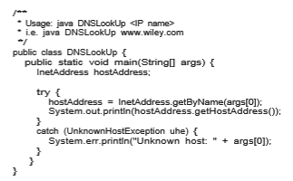
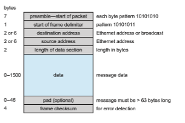
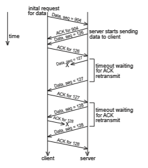

## Communication Structure

Now that we have discussed the physical aspects of networking, we turn to the internal workings.

### Naming and Name Resolution

The first issue in network communication involves the naming of the systems in the network. For a process at site A to exchange information with a process at site B, each must be able to specify the other. Within a computer system, each process has a process identifier, and messages may be addressed with the process identifier. Because networked systems share no memory, however, a host within the system initially has no knowledge about the processes on other hosts.

To solve this problem, processes on remote systems are generally identified by the pair _<_ host name, identifier>, where **host name** is a name unique within the network and **identifie** is a process identifier or other unique number within that host. Ahost name is usually an alphanumeric identifier, rather than a number, to make it easier for users to specify. For instance, site Amight have hosts named _program, student, faculty,_ and _cs._ The host name _program_ is certainly easier to remember than the numeric host address _128.148.31.100._  

Names are convenient for humans to use, but computers prefer numbers for speed and simplicity. For this reason, there must be amechanism to **resolve** the host name into a **host-id** that describes the destination system to the net- working hardware. This mechanism is similar to the name-to-address bind- ing that occurs during program compilation, linking, loading, and execution (Chapter 9). In the case of host names, two possibilities exist. First, every host may have a data file containing the names and numeric addresses of all the other hosts reachable on the network (similar to binding at compile time). The problem with this model is that adding or removing a host from the network requires updating the data files on all the hosts. In fact, in the early days of the ARPANET there was a canonical host file that was copied to every system periodically. As the network grew, however, this method became untenable.

The alternative is to distribute the information among systems on the network. The network must then use a protocol to distribute and retrieve the information. This scheme is like execution-time binding. The Internet uses a **domain-name system** (**DNS**) for host-name resolution.

DNS specifies the naming structure of the hosts, as well as name-to-address resolution. Hosts on the Internet are logically addressed with multipart names known as IP addresses. The parts of an IP address progress from the most specific to the most general, with periods separating the fields. For instance, _eric.cs.yale.edu_ refers to host _eric_ in the Department of Computer Science at Yale University within the top-level domain _edu_. (Other top-level domains include _com_ for commercial sites and _org_ for organizations, as well as a domain for each country connected to the network for systems specified by country rather than organization type.) Generally, the system resolves addresses by examining the host-name components in reverse order. Each component has a **name server**— simply a process on a system—that accepts a name and returns the address of the name server responsible for that name. As the final step, the name server for the host in question is contacted, and a host-id is returned. For example, a request made by a process on system A to communicate with _eric.cs.yale.edu_ would result in the following steps:

**1\.** The system library or the kernel on systemA issues a request to the name server for the edu domain, asking for the address of the name server for yale.edu. The name server for the _edu_ domain must be at a known address, so that it can be queried.

**2\.** The edu name server returns the address of the host on which the yale.edu name server resides.

**3\.** System A then queries the name server at this address and asks about cs.yale.edu.

**4\.** An address is returned. Now, finally, a request to that address for eric.cs.yale.edu returns an Internet address host-id for that host (for example, 128.148.31.100).

This protocol may seem inefficient, but individual hosts cache the IP addresses they have already resolved to speed the process. (Of course, the contents of these caches must be refreshed over time in case the name server is moved  

**Figure 19.4** Java program illustrating a DNS lookup.

or its address changes.) In fact, the protocol is so important that it has been optimized many times and has had many safeguards added. Consider what would happen if the primary edu name server crashed. It is possible that no edu hosts would be able to have their addresses resolved, making them all unreachable! The solution is to use secondary, backup name servers that duplicate the contents of the primary servers.

Before the domain-name service was introduced, all hosts on the Internet needed to have copies of a file (mentioned above) that contained the names and addresses of each host on the network. All changes to this file had to be registered at one site (host SRI-NIC), and periodically all hosts had to copy the updated file from SRI-NIC to be able to contact new systems or find hosts whose addresses had changed. Under the domain-name service, each name- server site is responsible for updating the host information for that domain. For instance, any host changes at Yale University are the responsibility of the name server for _yale.edu_ and need not be reported anywhere else. DNS lookups will automatically retrieve the updated information because they will contact _yale.edu_ directly. Domains may contain autonomous subdomains to further distribute the responsibility for host-name and host-id changes.

Java provides the necessary API to design a program that maps IP names to IP addresses. The program shown in Figure 19.4 is passed an IP name (such as _eric.cs.yale.edu_) on the command line and either outputs the IP address of the host or returns a message indicating that the host name could not be resolved. An InetAddress is a Java class representing an IP name or address. The static method getByName() belonging to the InetAddress class is passed a string representation of an IP name, and it returns the corresponding InetAddress. The program then invokes the getHostAddress() method, which internally uses DNS to look up the IP address of the designated host.  

Generally, the operating system is responsible for accepting from its pro- cesses a message destined for _<_host name, identifier> and for transferring that message to the appropriate host. The kernel on the destination host is then responsible for transferring themessage to the process named by the identifier. This process is described in Section 19.3.4.

### Communication Protocols

When we are designing a communication network, we must deal with the inherent complexity of coordinating asynchronous operations communicating in a potentially slow and error-prone environment. In addition, the systems on the network must agree on a protocol or a set of protocols for determin- ing host names, locating hosts on the network, establishing connections, and so on. We can simplify the design problem (and related implementation) by partitioning the problem into multiple layers. Each layer on one system com- municates with the equivalent layer on other systems. Typically, each layer has its own protocols, and communication takes place between peer layers using a specific protocol. The protocols may be implemented in hardware or software. For instance, Figure 19.5 shows the logical communications between two computers, with the three lowest-level layers implemented in hardware.

The International Standards Organization created the Open Systems Inter- connection (OSI) model for describing the various layers of networking. While these layers are not implemented in practice, they are useful for understanding how networking logically works, and we describe them below:

• **Layer 1: Physical layer**. The physical layer is responsible for handling both the mechanical and the electrical details of the physical transmission of a bit stream. At the physical layer, the communicating systems must agree on the electrical representation of a binary 0 and 1, so that when data are sent as a streamof electrical signals, the receiver is able to interpret the data

**Figure 19.5** Two computers communicating via the OSI network model.  

properly as binary data. This layer is implemented in the hardware of the networking device. It is responsible for delivering bits.

• **Layer 2: Data-link layer**. The data-link layer is responsible for handling _frames,_ or fixed-length parts of packets, including any error detection and recovery that occur in the physical layer. It sends frames between physical addresses.

• **Layer 3: Network layer**. The network layer is responsible for breakingmes- sages into packets, providing connections between logical addresses, and routing packets in the communication network, including handling the addresses of outgoing packets, decoding the addresses of incoming pack- ets, and maintaining routing information for proper response to changing load levels. Routers work at this layer.

• **Layer 4: Transport layer**. The transport layer is responsible for transfer of messages between nodes, maintaining packet order, and controlling flow to avoid congestion.

• **Layer 5: Session layer**. The session layer is responsible for implementing sessions, or process-to-process communication protocols.

• **Layer 6: Presentation layer**. The presentation layer is responsible for resolving the differences in formats among the various sites in the net- work, including character conversions and half duplex–full duplexmodes (character echoing).

• **Layer 7: Application layer**. The application layer is responsible for inter- acting directly with users. This layer deals with file transfer, remote-login protocols, and electronic mail, as well as with schemas for distributed databases.

Figure 19.6 summarizes the **OSI protocol stack**—a set of cooperating pro- tocols—showing the physical flow of data. As mentioned, logically each layer of a protocol stack communicates with the equivalent layer on other systems. But physically, a message starts at or above the application layer and is passed through each lower level in turn. Each layer may modify the message and include message-header data for the equivalent layer on the receiving side. Ultimately, the message reaches the data-network layer and is transferred as one or more packets (Figure 19.7). The data-link layer of the target system receives these data, and the message is moved up through the protocol stack. It is analyzed,modified, and strippedof headers as it progresses. It finally reaches the application layer for use by the receiving process.

The OSI model formalizes some of the earlier work done in network proto- cols but was developed in the late 1970s and is currently not inwidespread use. Perhaps the most widely adopted protocol stack is the TCP/IP model (some- times called the _Internetmodel_), which has been adopted by virtually all Internet sites. The TCP/IP protocol stack has fewer layers than the OSI model. Theoreti- cally, because it combines several functions in each layer, it is more difficult to implement but more efficient than OSI networking. The relationship between the OSI and TCP/IP models is shown in Figure 19.8.

The TCP/IP application layer identifies several protocols in widespread use in the Internet, including HTTP, FTP, SSH, DNS, and SMTP. The transport layer  

**Figure 19.6** The OSI protocol stack.

identifies the unreliable, connectionless **user datagram protocol** (**UDP**) and the reliable, connection-oriented **transmission control protocol** (**TCP**). The **Inter- net protocol** (**IP**) is responsible for routing IP **datagrams**, or packets, through the Internet. The TCP/IP model does not formally identify a link or physical layer, allowing TCP/IP traffic to run across any physical network. In Section 19.3.3, we consider the TCP/IP model running over an Ethernet network.

Security should be a concern in the design and implementation of any modern communication protocol. Both strong authentication and encryption are needed for secure communication. Strong authentication ensures that the sender and receiver of a communication are who or what they are supposed to be. Encryption protects the contents of the communication from eavesdrop- ping. Weak authentication and clear-text communication are still very com- mon, however, for a variety of reasons. When most of the common protocols were designed, security was frequently less important than performance, sim-  

**Figure 19.7** An OSI network message.

plicity, and efficiency. This legacy is still showing itself today, as adding security to existing infrastructure is proving to be difficult and complex.

Strong authentication requires a multistep handshake protocol or authen- tication devices, adding complexity to a protocol. As to the encryption require- ment, modern CPUs can efficiently perform encryption, frequently including cryptographic acceleration instructions so system performance is not compro- mised. Long-distance communication can be made secure by authenticating

**Figure 19.8** The OSI and TCP/IP protocol stacks.  

the endpoints and encrypting the stream of packets in a virtual private net- work, as discussed in Section 16.4.2. LAN communication remains unencrypted at most sites, but protocols such as NFS Version 4, which includes strong native authentication and encryption, should help improve even LAN security.

### TCP/IP Example

Next,we address name resolution and examine its operationwith respect to the TCP/IP protocol stack on the Internet. Then we consider the processing needed to transfer a packet between hosts on different Ethernet networks. We base our description on the IPV4 protocols, which are the type most commonly used today.

In a TCP/IP network, every host has a name and an associated IP address (or host-id). Both of these strings must be unique; and so that the name space can bemanaged, they are segmented. As described earlier, the name is hierarchical, describing the host name and then the organization with which the host is associated. The host-id is split into a network number and a host number. The proportion of the split varies, depending on the size of the network. Once the Internet administrators assign a network number, the site with that number is free to assign host-ids.

The sending system checks its routing tables to locate a router to send the frame on itsway. This routing table is either configuredmanually by the system administrator or is populated by one of several routing protocols, such as the **Border Gateway Protocol** (**BGP**). The routers use the network part of the host- id to transfer the packet from its source network to the destination network. The destination system then receives the packet. The packet may be a complete message, or itmay just be a component of amessage,withmore packets needed before the message can be reassembled and passed to the TCP/UDP (transport) layer for transmission to the destination process.

Within a network, how does a packet move from sender (host or router) to receiver? Every Ethernet device has a unique byte number, called the **medium access control** (**MAC**) **address**, assigned to it for addressing. Two devices on a LAN communicate with each other only with this number. If a system needs to send data to another system, the networking software generates an **address resolution protocol** (**ARP**) packet containing the IP address of the destination system. This packet is **broadcast** to all other systems on that Ethernet network.

A broadcast uses a special network address (usually, the maximum address) to signal that all hosts should receive and process the packet. The broadcast is not re-sent by routers in between different networks, so only systems on the local network receive it. Only the system whose IP address matches the IP address of the ARP request responds and sends back its MAC address to the system that initiated the query. For efficiency, the host caches the IP–MAC address pair in an internal table. The cache entries are aged, so that an entry is eventually removed from the cache if an access to that system is not required within a given time. In this way, hosts that are removed from a network are eventually forgotten. For added performance, ARP entries for heavily used hosts may be pinned in the ARP cache.

Once an Ethernet device has announced its host-id and address, commu- nication can begin. A process may specify the name of a host with which to communicate. Networking software takes that name and determines the IP address of the target, using a DNS lookup or an entry in a local hosts file  

**Figure 19.9** An Ethernet packet.

where translations can be manually stored. The message is passed from the application layer, through the software layers, and to the hardware layer. At the hardware layer, the packet has the Ethernet address at its start; a trailer indicates the end of the packet and contains a **checksum** for detection of packet damage (Figure 19.9). The packet is placed on the network by the Ethernet device. The data section of the packet may contain some or all of the data of the original message, but it may also contain some of the upper-level headers that compose the message. In other words, all parts of the original message must be sent from source to destination, and all headers above the 802.3 layer (data-link layer) are included as data in the Ethernet packets.

If the destination is on the same local network as the source, the system can look in its ARP cache, find the Ethernet address of the host, and place the packet on the wire. The destination Ethernet device then sees its address in the packet and reads in the packet, passing it up the protocol stack.

If the destination system is on a network different from that of the source, the source system finds an appropriate router on its network and sends the packet there. Routers then pass the packet along the WAN until it reaches its destination network. The router that connects the destination network checks its ARP cache, finds the Ethernet number of the destination, and sends the packet to that host. Through all of these transfers, the data-link-layer header may change as the Ethernet address of the next router in the chain is used, but the other headers of the packet remain the same until the packet is received and processed by the protocol stack and finally passed to the receiving process by the kernel.

### Transport Protocols UDP and TCP

Once a host with a specific IP address receives a packet, it must somehow pass it to the correct waiting process. The transport protocols TCP and UDP identify the receiving (and sending) processes through the use of a **port number**. Thus,  
a host with a single IP address can have multiple server processes running and waiting for packets as long as each server process specifies a different port number. By default, many common services use_well-known_ port numbers. Some examples include FTP (21), SSH (22), SMTP (25), and HTTP (80). For exam- ple, if youwish to connect to an “http”website through yourweb browser, your browser will automatically attempt to connect to port 80 on the server by using the number 80 as the port number in the TCP transport header. For an extensive list of well-known ports, log into your favorite Linux or UNIXmachine and take a look at the file /etc/services.

The transport layer can accomplish more than just connecting a network packet to a running process. It can also, if desired, add reliability to a network packet stream. To explain how, we next outline some general behavior of the transport protocols UDP and TCP.

#### User Datagram Protocol

The transport protocol UDP is _unreliable_ in that it is a bare-bones extension to IP with the addition of a port number. In fact, the UDP header is very simple and contains only four fields: source port number, destination port number, length, and checksum. Packets may be sent quickly to a destination using UDP. However, since there are no guarantees of delivery in the lower layers of the network stack, packets may become lost. Packets can also arrive at the receiver out of order. It is up to the application to figure out these error cases and to adjust (or not adjust).

Figure 19.10 illustrates a common scenario involving loss of a packet between a client and a server using the UDP protocol. Note that this protocol is known as a _connectionless_ protocol because there is no connection setup at the beginning of the transmission to set up state—the client just starts sending data. Similarly, there is no connection teardown.

The client begins by sending some sort of request for information to the server. The server then responds by sending four datagrams, or packets, to the client. Unfortunately, one of the packets is dropped by an overwhelmed router. The client must either make do with only three packets or use logic programmed into the application to request the missing packet. Thus, we

**Figure 19.10** Example of a UDP data transfer with dropped packet.  

need to use a different transport protocol if we want any additional reliability guarantees to be handled by the network.

#### 19.3.4.2 Transmission Control Protocol

TCP is a transport protocol that is both _reliable_ and _connection-oriented_. In addi- tion to specifying port numbers to identify sending and receiving processes on different hosts, TCP provides an abstraction that allows a sending process on one host to send an in-order, uninterrupted _byte stream_ across the network to a receiving process on another host. It accomplishes these things through the following mechanisms:

• Whenever a host sends a packet, the receiver must send an **acknowledg- ment packet**, or ACK, to notify the sender that the packet was received. If the ACK is not received before a timer expires, the sender will send that packet again.

• TCP introduces **sequence numbers** into the TCP header of every packet. These numbers allow the receiver to (1) put packets in order before sending data up to the requesting process and (2) be aware of packets missing from the byte stream.

• TCP connections are initiated with a series of control packets between the sender and the receiver (often called a _three-way handshake_) and closed gracefully with control packets responsible for tearing down the connec- tion. These control packets allow both the sender and the receiver to set up and remove state.

Figure 19.11 demonstrates a possible exchange using TCP (with connection setup and tear-down omitted). After the connection has been established, the client sends a request packet to the server with the sequence number 904. Unlike the server in the UDP example, the servermust then send an ACK packet back to the client. Next, the server starts sending its own stream of data packets starting with a different sequence number. The client sends an ACK packet for each data packet it receives. Unfortunately, the data packet with the sequence number 127 is lost, and no ACK packet is sent by the client. The sender times out waiting for the ACK packet, so it must resend data packet 127. Later in the connection, the server sends the data packet with the sequence number 128, but the ACK is lost. Since the server does not receive the ACK it must resend data packet 128. The client then receives a duplicate packet. Because the client knows that it previously received a packet with that sequence number, it throws the duplicate away. However, it must send another ACK back to the server to allow the server to continue.

In the actual TCP specification, an ACK isn’t required for each and every packet. Instead, the receiver can send a **_cumulative ACK_** to ACK a series of packets. The server can also send numerous data packets sequentially before waiting for ACKs, to take advantage of network throughput.

TCP also helps regulate the flow of packets through mechanisms called _flow control_ and _congestion control_. **Flow control** involves preventing the sender from overrunning the capacity of the receiver. For example, the receiver may  

**Figure 19.11** Example of a TCP data transfer with dropped packets.

have a slower connection or may have slower hardware components (like a slower network card or processor). Flow-control state can be returned in the ACK packets of the receiver to alert the sender to slow down or speed up. **Congestion control** attempts to approximate the state of the networks (and generally the routers) between the sender and the receiver. If a router becomes overwhelmedwith packets, it will tend to drop them. Dropping packets results in ACK timeouts, which results in more packets saturating the network. To prevent this condition, the sendermonitors the connection for droppedpackets by noticing how many packets are not acknowledged. If there are too many dropped packets, the sender will slow down the rate at which it sends them. This helps ensure that the TCP connection is being fair to other connections happening at the same time.

By utilizing a reliable transport protocol like TCP, a distributed systemdoes not need extra logic to deal with lost or out-of-order packets. However, TCP is slower than UDP.
