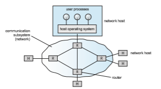

## Network Structure

To completely understand the roles and types of distributed systems in use today,we need to understand the networks that interconnect them. This section serves as a network primer to introduce basic networking concepts and chal- lenges as they relate to distributed systems. The rest of the chapter specifically discusses distributed systems.

There are basically two types of networks: **local-area networks** (**LAN**) and **wide-area networks** (**WAN**). Themain difference between the two is the way in which they are geographically distributed. Local-area networks are composed of hosts distributed over small areas (such as a single building or a number of adjacent buildings), whereas wide-area networks are composed of systems distributed over a large area (such as the United States). These differences  

**Figure 19.2** Local-area network.

imply major variations in the speed and reliability of the communications networks, and they are reflected in the distributed system design.

### Local-Area Networks

Local-area networks emerged in the early 1970s as a substitute for large mainframe computer systems. For many enterprises, it is more economi- cal to have a number of small computers, each with its own self-contained applications, than to have a single large system. Because each small com- puter is likely to need a full complement of peripheral devices (such as disks and printers), and because some form of data sharing is likely to occur in a single enterprise, it was a natural step to connect these small systems into a network.

LANs, as mentioned, are usually designed to cover a small geographical area, and they are generally used in an office or home environment. All the sites in such systems are close to one another, so the communication links tend to have a higher speed and lower error rate than their counterparts inwide-area networks.

A typical LAN may consist of a number of different computers (includ- ing workstations, servers, laptops, tablets, and smartphones), various shared peripheral devices (such as printers and storage arrays), and one or more **routers** (specialized network communication processors) that provide access to other networks (Figure 19.2). Ethernet and **WiFi** are commonly used to con- struct LANs. _Wireless access points_ connect devices to the LAN wirelessly, and they may or may not be routers themselves.

Ethernet networks are generally found in businesses and organizations in which computers and peripherals tend to be nonmobile. These networks use _coaxial, twisted pair,_ and/or _fiber optic_ cables to send signals. An Ethernet network has no central controller, because it is a multiaccess bus, so new hosts can be added easily to the network. The Ethernet protocol is defined by the IEEE 802.3 standard. Typical Ethernet speeds using common twisted-pair cabling can vary from 10 Mbps to over 10 Gbps, with other types of cabling reaching speeds of 100 Gbps.

WiFi is now ubiquitous and either supplements traditional Ethernet net- works or exists by itself. Specifically, WiFi allows us to construct a network without using physical cables. Each host has awireless transmitter and receiver that it uses to participate in the network. WiFi is defined by the IEEE 802.11 standard. Wireless networks are popular in homes and businesses, as well as public areas such as libraries, Internet cafes, sports arenas, and even buses and airplanes. WiFi speeds can vary from 11 Mbps to over 400 Mbps.

Both the IEEE 802.3 and 802.11 standards are constantly evolving. For the latest information about various standards and speeds, see the references at the end of the chapter.

### Wide-Area Networks

Wide-area networks emerged in the late 1960s, mainly as an academic research project to provide efficient communication among sites, allowing hardware and software to be shared conveniently and economically by a wide commu- nity of users. The first WAN to be designed and developed was the ARPANET. Begun in 1968, the ARPANET has grown from a four-site experimental network to a worldwide network of networks, the **Internet** (also known as the **World Wide Web**), comprising millions of computer systems.

Sites in a WAN are physically distributed over a large geographical area. Typical links are telephone lines, leased (dedicated data) lines, optical cable, microwave links, radio waves, and satellite channels. These communication links are controlled by routers (Figure 19.3) that are responsible for directing traffic to other routers and networks and transferring information among the various sites.

For example, the Internet WAN enables hosts at geographically separate sites to communicate with one another. The host computers typically differ from one another in speed, CPU type, operating system, and so on. Hosts are

**Figure 19.3** Communication processors in a wide-area network.  

generally on LANs, which are, in turn, connected to the Internet via regional networks. The regional networks are interlinked with routers to form the worldwide network. Residences can connect to the Internet by either tele- phone, cable, or specialized Internet service providers that install routers to connect the residences to central services. Of course, there are other WANs besides the Internet. Acompany, for example,might create its ownprivateWAN for increased security, performance, or reliability.

WANs are generally slower than LANs, although backbone WAN connec- tions that link major cities may have very fast transfer rates through fiber optic cables. In fact, many backbone providers have fiber optic speeds of 40 Gbps or 100 Gbps. (It is generally the links from local **Internet Service Providers** (**ISPs**) to homes or businesses that slow things down.) However, WAN links are being constantly updated to faster technologies as the demand for more speed continues to grow.

Frequently, WANs and LANs interconnect, and it is difficult to tell where one ends and the other starts. Consider the cellular phone data network. Cell phones are used for both voice and data communications. Cell phones in a given area connect via radio waves to a cell tower that contains receivers and transmitters. This part of the network is similar to a LAN except that the cell phones do not communicate with each other (unless two people talking or exchanging data happen to be connected to the same tower). Rather, the towers are connected to other towers and to hubs that connect the tower communications to land lines or other communication media and route the packets toward their destinations. This part of the network is more WAN-like. Once the appropriate tower receives the packets, it uses its transmitters to send them to the correct recipient.
