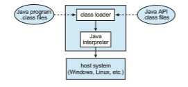

## Examples

Despite the advantages of virtual machines, they received little attention for a number of years after they were first developed. Today, however, virtual machines are coming into greater use as a means of solving system compat- ibility problems. In this section, we explore two popular contemporary virtual machines: the VMwareWorkstation and the Java virtualmachine. These virtual machines can typically run on top of operating systems of any of the design types discussed in earlier chapters.

### VMware

**VMware Workstation** is a popular commercial application that abstracts Intel x86 and compatible hardware into isolated virtual machines. VMware Work- station is a prime example of a Type 2 hypervisor. It runs as an application on a host operating system such as Windows or Linux and allows this host system to run several different guest operating systems concurrently as independent virtual machines.

The architecture of such a system is shown in Figure 18.9. In this scenario, Linux is running as the host operating system, and FreeBSD, Windows NT, and Windows XP are running as guest operating systems. At the heart of VMware is the virtualization layer, which abstracts the physical hardware into isolated virtualmachines running as guest operating systems. Each virtualmachine has its own virtual CPU, memory, disk drives, network interfaces, and so forth.

The physical disk that the guest owns and manages is really just a file within the file system of the host operating system. To create an identical guest, we can simply copy the file. Copying the file to another location protects the guest against a disaster at the original site. Moving the file to another location  

**Figure 18.9** VMware Workstation architecture.

moves the guest system. Such capabilities, as explained earlier, can improve the efficiency of system administration as well as system resource use.

### The Java Virtual Machine

Java is a popular object-oriented programming language introduced by Sun Microsystems in 1995. In addition to a language specification and a large API library, Java provides a specification for a Java virtual machine, or JVM. Java therefore is an example of programming-environment virtualization, as discussed in Section 18.5.6.

Java objects are specified with the class construct; a Java program con- sists of one or more classes. For each Java class, the compiler produces an architecture-neutral **bytecode** output (.class) file that will run on any imple- mentation of the JVM.

The JVM is a specification for an abstract computer. It consists of a **class loader** and a Java interpreter that executes the architecture-neutral bytecodes, as diagrammed in Figure 18.10. The class loader loads the compiled .class files from both the Java program and the Java API for execution by the Java interpreter. After a class is loaded, the verifier checks that the .class file is valid Java bytecode and that it does not overflow or underflow the stack. It also ensures that the bytecode does not perform pointer arithmetic, which could provide illegal memory access. If the class passes verification, it is run by the Java interpreter. The JVM also automatically manages memory by performing **garbage collection**—the practice of reclaimingmemory from objects no longer in use and returning it to the system. Much research focuses on garbage collec- tion algorithms for increasing the performance of Java programs in the virtual machine.  

**Figure 18.10** The Java virtual machine.

The JVM may be implemented in software on top of a host operating system, such as Windows, Linux, or macOS, or as part of a web browser. Alternatively, the JVM may be implemented in hardware on a chip specifically designed to run Java programs. If the JVM is implemented in software, the Java interpreter interprets the bytecode operations one at a time. A faster software technique is to use a **just-in-time** (**JIT**) compiler. Here, the first time a Java method is invoked, the bytecodes for the method are turned into native machine language for the host system. These operations are then cached so that subsequent invocations of a method are performed using the native machine instructions, and the bytecode operations need not be interpreted all over again. Running the JVM in hardware is potentially even faster. Here, a special Java chip executes the Java bytecode operations as native code, thus bypassing the need for either a software interpreter or a just-in-time compiler.

