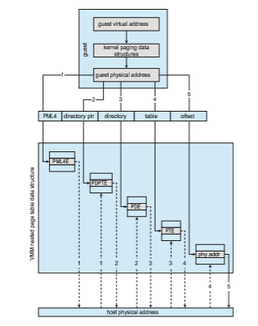

### Hardware Assistance

Without some level of hardware support, virtualization would be impossible. The more hardware support available within a system, the more feature-rich and stable the virtual machines can be and the better they can perform. In the Intel x86 CPU family, Intel added new virtualization support (the **VT-x** instruc- tions) in successive generations beginning in 2005. Now, binary translation is no longer needed.

In fact, all major general-purpose CPUs now provide extended hardware support for virtualization. For example, AMD virtualization technology (**AMD- V**) has appeared in several AMD processors starting in 2006. It defines two new modes of operation—host and guest—thus moving from a dual-mode to a  
multimode processor. The VMM can enable host mode, define the characteris- tics of each guest virtual machine, and then switch the system to guest mode, passing control of the system to a guest operating system that is running in the virtual machine. In guest mode, the virtualized operating system thinks it is running on native hardware and sees whatever devices are included in the host’s definition of the guest. If the guest tries to access a virtualized resource, then control is passed to the VMM tomanage that interaction. The functionality in Intel VT-x is similar, providing root and nonroot modes, equivalent to host and guest modes. Both provide guest VCPU state data structures to load and save guest CPU state automatically during guest context switches. In addition, **virtual machine control structures** (**VMCSs**) are provided to manage guest and host state, as well as various guest execution controls, exit controls, and information about why guests exit back to the host. In the latter case, for exam- ple, a nested page-table violation caused by an attempt to access unavailable memory can result in the guest’s exit.

AMD and Intel have also addressed memory management in the virtual environment. With AMD’s RVI and Intel’s EPT memory-management enhance- ments, VMMs no longer need to implement software NPTs. In essence, these CPUs implement nested page tables in hardware to allow the VMM to fully control paging while the CPUs accelerate the translation from virtual to phys- ical addresses. The NPTs add a new layer, one representing the guest’s view of logical-to-physical address translation. The CPU page-table walking func- tion (traversing the data structure to find the desired data) includes this new layer as necessary, walking through the guest table to the VMM table to find the physical address desired. A TLB miss results in a performance penalty, because more tables (the guest and host page tables) must be traversed to complete the lookup. Figure 18.4 shows the extra translation work performed by the hardware to translate from a guest virtual address to a final physical address.

I/O is another area improved by hardware assistance. Consider that the standard direct-memory-access (DMA) controller accepts a target memory address and a source I/O device and transfers data between the two without operating-system action. Without hardware assistance, a guest might try to set up a DMA transfer that affects the memory of the VMM or other guests. In CPUs that provide hardware-assisted DMA (such as Intel CPUs with VT-d), even DMA has a level of indirection. First, the VMM sets up **protection domains** to tell the CPU which physical memory belongs to each guest. Next, it assigns the I/O devices to the protection domains, allowing them direct access to those memory regions and only those regions. The hardware then transforms the address in a DMA request issued by an I/O device to the host physical memory address associated with the I/O. In this manner, DMA transfers are passed through between a guest and a device without VMM interference.

Similarly, interrupts must be delivered to the appropriate guest and must not be visible to other guests. By providing an interrupt remapping feature, CPUs with virtualization hardware assistance automatically deliver an inter- rupt destined for a guest to a core that is currently running a thread of that guest. That way, the guest receives interrupts without any need for the VMM to intercede in their delivery. Without interrupt remapping, malicious guests could generate interrupts that could be used to gain control of the host system. (See the bibliographical notes at the end of this chapter for more details.)  

**Figure 18.4** Nested page tables.

ARM architectures, specifically ARM v8 (64-bit) take a slightly different approach to hardware support of virtualization. They provide an entire excep- tion level—EL2—which is even more privileged than that of the kernel (EL1). This allows the running of a secluded hypervisor, with its own MMU access and interrupt trapping. To allow for paravirtualization, a special instruction (HVC) is added. It allows the hypervisor to be called from guest kernels. This instruction can only be called from within kernel mode (EL1).

An interesting side effect of hardware-assisted virtualization is that it allows for the creation of thin hypervisors. A good example is macOS’s hyper- visor framework (“HyperVisor.framework”), which is an operating-system- supplied library that allows the creation of virtual machines in a few lines of 
code. The actual work is done via system calls, which have the kernel call the privileged virtualization CPU instructions on behalf of the hypervisor process, allowing management of virtual machines without the hypervisor needing to load a kernel module of its own to execute those calls.
