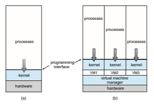

## Overview

The fundamental idea behind a virtual machine is to abstract the hardware of a single computer (the CPU, memory, disk drives, network interface cards, and so forth) into several different execution environments, thereby creating the illusion that each separate environment is running on its own private computer. This concept may seem similar to the layered approach of operating system implementation (see Section 2.8.2), and in someways it is. In the case of

virtualization, there is a layer that creates a virtual system on which operating systems or applications can run.

Virtual machine implementations involve several components. At the base is the **host**, the underlying hardware system that runs the virtual machines. The **virtual machine manager** (**VMM**) (also known as a **hypervisor**) creates and runs virtualmachines by providing an interface that is **_identical_** to the host (except in the case of paravirtualization, discussed later). Each **guest** process is providedwith a virtual copy of the host (Figure 18.1). Usually, the guest process is in fact an operating system. A single physical machine can thus runmultiple operating systems concurrently, each in its own virtual machine.

Take a moment to note that with virtualization, the definition of “operat- ing system” once again blurs. For example, consider VMM software such as VMware ESX. This virtualization software is installed on the hardware, runs when the hardware boots, and provides services to applications. The services include traditional ones, such as scheduling and memory management, along with new types, such as migration of applications between systems. Further- more, the applications are, in fact, guest operating systems. Is the VMware ESX VMManoperating system that, in turn, runs other operating systems?Certainly it acts like an operating system. For clarity, however,we call the component that provides virtual environments a VMM.

The implementation of VMMs varies greatly. Options include the following:

• Hardware-based solutions that provide support for virtual machine cre- ation and management via firmware. These VMMs, which are commonly found inmainframe and large to midsized servers, are generally known as **type 0 hypervisors**. IBM LPARs and Oracle LDOMs are examples.

**Figure 18.1** System models. (a) Nonvirtual machine. (b) Virtual machine.  

**_INDIRECTION_**

“All problems in computer science can be solved by another level of indirec- tion”—David Wheeler “. . . except for the problem of too many layers of indirection.”—Kevlin Henney

• Operating-system-like software built to provide virtualization, including VMware ESX (mentioned above), Joyent SmartOS, and Citrix XenServer. These VMMs are known as **type 1 hypervisors**.

• General-purpose operating systems that provide standard functions as well as VMM functions, includingMicrosoftWindows ServerwithHyperV and Red Hat Linux with the KVM feature. Because such systems have a feature set similar to type 1 hypervisors, they are also known as type 1.

• Applications that run on standard operating systems but provide VMM features to guest operating systems. These applications, which include VMware Workstation and Fusion, Parallels Desktop, and Oracle Virtual- Box, are **type 2 hypervisors**.

• **Paravirtualization**, a technique in which the guest operating system is modified to work in cooperation with the VMM to optimize performance.

• **Programming-environment virtualization**, in which VMMs do not virtu- alize real hardware but instead create an optimized virtual system. This technique is used by Oracle Java and Microsoft.Net.

• **Emulators** that allow applications written for one hardware environment to run on a very different hardware environment, such as a different type of CPU.

• **Application containment**, which is not virtualization at all but rather provides virtualization-like features by segregating applications from the operating system. Oracle Solaris Zones, BSD Jails, and IBM AIX WPARs “contain” applications, making them more secure and manageable.

The variety of virtualization techniques in use today is a testament to the breadth, depth, and importance of virtualization in modern computing. Virtualization is invaluable for data-center operations, efficient application development, and software testing, among many other uses.
