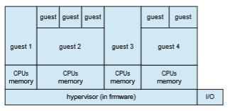
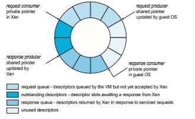

## Types of VMs and Their Implementations

We’ve now looked at some of the techniques used to implement virtualization. Next, we consider the major types of virtual machines, their implementation, their functionality, and how they use the building blocks just described to create a virtual environment. Of course, the hardware on which the virtual machines are running can cause great variation in implementation methods. Here, we discuss the implementations in general, with the understanding that VMMs take advantage of hardware assistance where it is available.

### The Virtual Machine Life Cycle

Let’s begin with the virtual machine life cycle. Whatever the hypervisor type, at the time a virtual machine is created, its creator gives the VMM certain parameters. These parameters usually include the number of CPUs, amount of memory, networking details, and storage details that the VMMwill take into account when creating the guest. For example, a user might want to create a new guest with two virtual CPUs, 4 GB of memory, 10 GB of disk space, one network interface that gets its IP address via DHCP, and access to the DVD drive.

The VMM then creates the virtual machine with those parameters. In the case of a type 0 hypervisor, the resources are usually dedicated. In this situa- tion, if there are not two virtual CPUs available and unallocated, the creation request in our example will fail. For other hypervisor types, the resources are dedicated or virtualized, depending on the type. Certainly, an IP address can- not be shared, but the virtual CPUs are usually multiplexed on the physical CPUs as discussed in Section 18.6.1. Similarly, memory management usually involves allocating more memory to guests than actually exists in physical memory. This is more complicated and is described in Section 18.6.2.

Finally, when the virtual machine is no longer needed, it can be deleted. When this happens, the VMM first frees up any used disk space and then removes the configuration associated with the virtual machine, essentially forgetting the virtual machine.

These steps are quite simple compared with building, configuring, run- ning, and removing physical machines. Creating a virtual machine from an existing one can be as easy as clicking the “clone” button and providing a new name and IP address. This ease of creation can lead to **virtual machine sprawl**, which occurs when there are so many virtual machines on a system that their use, history, and state become confusing and difficult to track.

### Type 0 Hypervisor

Type 0 hypervisors have existed for many years under many names, including “partitions” and “domains.” They are a hardware feature, and that brings its own positives and negatives. Operating systems need do nothing special to take advantage of their features. The VMM itself is encoded in the firmware and  

**Figure 18.5** Type 0 hypervisor.

loaded at boot time. In turn, it loads the guest images to run in each partition. The feature set of a type 0 hypervisor tends to be smaller than those of the other types because it is implemented in hardware. For example, a system might be split into four virtual systems, each with dedicated CPUs, memory, and I/O devices. Each guest believes that it has dedicated hardware because it does, simplifying many implementation details.

I/O presents some difficulty, because it is not easy to dedicate I/O devices to guests if there are not enough. What if a system has two Ethernet ports and more than two guests, for example? Either all guests must get their own I/O devices, or the system must provided I/O device sharing. In these cases, the hypervisor manages shared access or grants all devices to a **control partition**. In the control partition, a guest operating systemprovides services (such as net- working) via daemons to other guests, and the hypervisor routes I/O requests appropriately. Some type 0 hypervisors are even more sophisticated and can move physical CPUs and memory between running guests. In these cases, the guests are paravirtualized, aware of the virtualization and assisting in its exe- cution. For example, a guest must watch for signals from the hardware or VMM that a hardware change has occurred, probe its hardware devices to detect the change, and add or subtract CPUs or memory from its available resources.

Because type 0 virtualization is very close to raw hardware execution, it should be considered separately from the othermethods discussed here. Atype 0 hypervisor can run multiple guest operating systems (one in each hardware partition). All of those guests, because they are running on raw hardware, can in turn be VMMs. Essentially, each guest operating system in a type 0 hypervisor is a native operating system with a subset of hardware made available to it. Because of that, each can have its own guest operating systems (Figure 18.5). Other types of hypervisors usually cannot provide this virtualization-within- virtualization functionality.

### Type 1 Hypervisor

Type 1 hypervisors are commonly found in company data centers and are, in a sense, becoming “the data-center operating system.” They are special-purpose operating systems that run natively on the hardware, but rather than providing  

system calls and other interfaces for running programs, they create, run, and manage guest operating systems. In addition to running on standard hard- ware, they can run on type 0 hypervisors, but not on other type 1 hypervisors. Whatever the platform, guests generally do not know they are running on anything but the native hardware.

Type 1 hypervisors run in kernel mode, taking advantage of hardware pro- tection.Where the host CPU allows, they usemultiplemodes to give guest oper- ating systems their own control and improved performance. They implement device drivers for the hardware they run on, since no other component could do so. Because they are operating systems, theymust also provideCPU schedul- ing, memory management, I/O management, protection, and even security. Frequently, they provide APIs, but those APIs support applications in guests or external applications that supply features like backups, monitoring, and secu- rity. Many type 1 hypervisors are closed-source commercial offerings, such as VMware ESX, while some are open source or hybrids of open and closed source, such as Citrix XenServer and its open Xen counterpart.

By using type 1 hypervisors, data-center managers can control and man- age the operating systems and applications in new and sophisticated ways. An important benefit is the ability to consolidate more operating systems and applications onto fewer systems. For example, rather than having ten systems running at 10 percent utilization each, a data centermight have one serverman- age the entire load. If utilization increases, guests and their applications can be moved to less-loaded systems live,without interruption of service.Using snap- shots and cloning, the system can save the states of guests and duplicate those states—amuch easier task than restoring from backups or installing manually or via scripts and tools. The price of this increased manageability is the cost of the VMM (if it is a commercial product), the need to learn new management tools and methods, and the increased complexity.

Another type of type 1 hypervisor includes various general-purpose oper- ating systems with VMM functionality. Here, an operating system such as Red- Hat Enterprise Linux, Windows, or Oracle Solaris performs its normal duties as well as providing a VMM allowing other operating systems to run as guests. Because of their extra duties, these hypervisors typically provide fewer virtual- ization features than other type 1 hypervisors. Inmanyways, they treat a guest operating system as just another process, but they provide special handling when the guest tries to execute special instructions.

### Type 2 Hypervisor

Type 2 hypervisors are less interesting to us as operating-system explorers, because there is very little operating-system involvement in these application- level virtual machine managers. This type of VMM is simply another process run and managed by the host, and even the host does not know that virtual- ization is happening within the VMM.

Type 2 hypervisors have limits not associatedwith some of the other types. For example, a user needs administrative privileges to access many of the hardware assistance features of modern CPUs. If the VMM is being run by a standard user without additional privileges, the VMM cannot take advantage of these features. Due to this limitation, aswell as the extra overhead of running  

**Figure 18.6** Xen I/O via shared circular buffer.1

a general-purpose operating system as well as guest operating systems, type 2 hypervisors tend to have poorer overall performance than type 0 or type 1.

As is often the case, the limitations of type 2 hypervisors also provide some benefits. They run on a variety of general-purpose operating systems, and running them requires no changes to the host operating system. A student can use a type 2 hypervisor, for example, to test a non-native operating system without replacing the native operating system. In fact, on an Apple laptop, a student could have versions of Windows, Linux, Unix, and less common operating systems all available for learning and experimentation.

### Paravirtualization

As we’ve seen, paravirtualization works differently than the other types of virtualization. Rather than try to trick a guest operating system into believing it has a system to itself, paravirtualization presents the guest with a system that is similar but not identical to the guest’s preferred system. The guest must be modified to run on the paravirtualized virtual hardware. The gain for this extra work is more efficient use of resources and a smaller virtualization layer.

The Xen VMM became the leader in paravirtulization by implementing several techniques to optimize the performance of guests as well as of the host system. For example, as mentioned earlier, some VMMs present virtual devices to guests that appear to be real devices. Instead of taking that approach, the Xen VMM presented clean and simple device abstractions that allow efficient I/O as well as good I/O-related communication between the guest and the VMM. For

1Barham, Paul. “Xen and the Art of Virtualization”. SOSP ’03 Proceedings of the Nineteenth ACM Symposium onOperating Systems Principles, p 164-177. c _©_ 2003 Association for Computing Machinery, Inc each device used by each guest, there was a circular buffer shared by the guest and the VMM via sharedmemory. Read andwrite data are placed in this buffer, as shown in Figure 18.6.

For memory management, Xen did not implement nested page tables. Rather, each guest had its own set of page tables, set to read-only. Xen required the guest to use a specific mechanism, a **hypercall** from the guest to the hyper- visor VMM, when a page-table change was needed. This meant that the guest operating system’s kernel code must have been changed from the default code to these Xen-specificmethods. To optimize performance, Xen allowed the guest to queue up multiple page-table changes asynchronously via hypercalls and then checked to ensure that the changes were complete before continuing operation.

Xen allowed virtualization of x86 CPUs without the use of binary trans- lation, instead requiring modifications in the guest operating systems like the one described above. Over time, Xen has taken advantage of hardware features supporting virtualization. As a result, it no longer requiresmodified guests and essentially does not need the paravirtualization method. Paravirtualization is still used in other solutions, however, such as type 0 hypervisors.

### Programming-Environment Virtualization

Another kind of virtualization, based on a different execution model, is the virtualization of programming **_environments._** Here, a programming language is designed to run within a custom-built virtualized environment. For exam- ple, Oracle’s Java has many features that depend on its running in the **Java virtual machine** (**JVM**), including specific methods for security and memory management.

Ifwedefine virtualization as including only duplication of hardware, this is not really virtualization at all. Butwe neednot limit ourselves to that definition. Instead, we can define a virtual environment, based on APIs, that provides a set of features we want to have available for a particular language and programs written in that language. Java programs run within the JVM environment, and the JVM is compiled to be a native program on systems on which it runs. This arrangement means that Java programs are written once and then can run on any system (including all of the major operating systems) on which a JVM is available. The same can be said of **interpreted languages**, which run inside programs that read each instruction and interpret it into native operations.

### Emulation

Virtualization is probably the most common method for running applications designed for one operating system on a different operating system, but on the same CPU. This method works relatively efficiently because the applications were compiled for the instruction set that the target system uses.

But what if an application or operating system needs to run on a different CPU? Here, it is necessary to translate all of the source CPU’s instructions so that they are turned into the equivalent instructions of the target CPU. Such an environment is no longer virtualized but rather is fully emulated.

**Emulation** is useful when the host system has one system architecture and the guest system was compiled for a different architecture. For example,  

suppose a company has replaced its outdated computer system with a new system but would like to continue to run certain important programs that were compiled for the old system. The programs could be run in an emulator that translates each of the outdated system’s instructions into the native instruction set of the new system. Emulation can increase the life of programs and allow us to explore old architectures without having an actual old machine.

As may be expected, the major challenge of emulation is performance. Instruction-set emulation may run an order of magnitude slower than native instructions, because it may take ten instructions on the new system to read, parse, and simulate an instruction from the old system. Thus, unless the new machine is ten times faster than the old, the program running on the new machine will run more slowly than it did on its native hardware. Another challenge for emulator writers is that it is difficult to create a correct emulator because, in essence, this task involves writing an entire CPU in software.

In spite of these challenges, emulation is very popular, particularly in gaming circles. Many popular video games were written for platforms that are no longer in production. Users who want to run those games frequently can find an emulator of such a platform and then run the game unmodified within the emulator. Modern systems are so much faster than old game consoles that even the Apple iPhone has game emulators and games available to run within them.

### Application Containment

The goal of virtualization in some instances is to provide amethod to segregate applications, manage their performance and resource use, and create an easy way to start, stop, move, andmanage them. In such cases, perhaps full-fledged virtualization is not needed. If the applications are all compiled for the same operating system, thenwedo not need complete virtualization to provide these features. We can instead use application containment.

Consider one example of application containment. Starting with version 10, Oracle Solaris has included **containers**, or **zones**, that create a virtual layer between the operating system and the applications. In this system, only one kernel is installed, and the hardware is not virtualized. Rather, the operating system and its devices are virtualized, providing processes within a zone with the impression that they are the only processes on the system. One or more containers can be created, and each can have its own applications, network stacks, network address and ports, user accounts, and so on. CPU and memory resources can be divided among the zones and the system-wide processes. Each zone, in fact, can run its own scheduler to optimize the performance of its applications on the allotted resources. Figure 18.7 shows a Solaris 10 system with two containers and the standard “global” user space.

Containers are much lighter weight than other virtualization methods. That is, they use fewer system resources and are faster to instantiate and destroy, more similar to processes than virtual machines. For this reason, they are becoming more commonly used, especially in cloud computing. FreeBSD was perhaps the first operating system to include a container-like feature (called “jails”), and AIX has a similar feature. Linux added the **LXC** container feature in 2014. It is now included in the common Linux distributions via  

**Figure 18.7** Solaris 10 with two zones.

a flag in the clone() system call. (The source code for LXCis available at https://linuxcontainers.org/lxc/downloads.)

Containers are also easy to automate and manage, leading to orchestration tools like **docker** and **Kubernetes**. Orchestration tools are means of automat- ing and coordinating systems and services. Their aim is to make it simple to run entire suites of distributed applications, just as operating systems make it simple to run a single program. These tools offer rapid deployment of full applications, consisting of many processes within containers, and also offer monitoring and other administration features. For more on docker, see https://www.docker.com/what-docker. Information about Kubernetes can be found at https://kubernetes.io/docs/concepts/overview/what-is-kubernetes.
