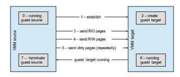

## Virtualization and Operating-System Components

Thus far, we have explored the building blocks of virtualization and the var- ious types of virtualization. In this section, we take a deeper dive into the operating-system aspects of virtualization, including how the VMM provides core operating-system functions like scheduling, I/O, and memory manage- ment. Here, we answer questions such as these: How do VMMs schedule CPU use when guest operating systems believe they have dedicated CPUs? How can memory management work when many guests require large amounts of memory?  

### CPU Scheduling

A system with virtualization, even a single-CPU system, frequently acts like a multiprocessor system. The virtualization software presents one or more virtual CPUs to each of the virtual machines running on the system and then schedules the use of the physical CPUs among the virtual machines.

The significant variations among virtualization technologies make it diffi- cult to summarize the effect of virtualization on scheduling. First, let’s consider the general case of VMM scheduling. The VMM has a number of physical CPUs available and a number of threads to run on those CPUs. The threads can be VMM threads or guest threads. Guests are configured with a certain number of virtual CPUs at creation time, and that number can be adjusted throughout the life of the VM.When there are enough CPUs to allocate the requested number to each guest, the VMM can treat the CPUs as dedicated and schedule only a given guest’s threads on that guest’s CPUs. In this situation, the guests act much like native operating systems running on native CPUs.

Of course, in other situations, there may not be enough CPUs to go around. The VMM itself needs some CPU cycles for guest management and I/O man- agement and can steal cycles from the guests by scheduling its threads across all of the system CPUs, but the impact of this action is relatively minor. More difficult is the case of **overcommitment**, in which the guests are configured for more CPUs than exist in the system. Here, a VMM can use standard scheduling algorithms tomakeprogress on each threadbut can also add a fairness aspect to those algorithms. For example, if there are six hardware CPUs and twelve guest- allocated CPUs, the VMM can allocate CPU resources proportionally, giving each guest half of the CPU resources it believes it has. The VMM can still present all twelve virtual CPUs to the guests, but in mapping them onto physical CPUs, the VMM can use its scheduler to distribute them appropriately.

Even given a scheduler that provides fairness, any guest operating-system scheduling algorithm that assumes a certain amount of progress in a given amount of time will most likely be negatively affected by virtualization. Con- sider a time-sharing operating system that tries to allot 100milliseconds to each time slice to give users a reasonable response time. Within a virtual machine, this operating system receives only what CPU resources the virtualization sys- tem gives it. A 100-millisecond time slice may take much more than 100 mil- liseconds of virtual CPU time. Depending on how busy the system is, the time slicemay take a second ormore, resulting in very poor response times for users logged into that virtualmachine. The effect on a real-time operating system can be even more serious.

The net outcomeof such scheduling is that individual virtualizedoperating systems receive only a portion of the available CPU cycles, even though they believe they are receiving all of the cycles and indeed are scheduling all of the cycles. Commonly, the time-of-day clocks in virtual machines are incorrect because timers take longer to trigger than they would on dedicated CPUs. Virtualization can thus undo the scheduling-algorithm efforts of the operating systems within virtual machines.

To correct for this, the VMMmakes an application available for each type of operating system that the system administrator can install into the guests. This application corrects clock drift and can have other functions, such as virtual device management.  

### Memory Management

Efficient memory use in general-purpose operating systems is a major key to performance. In virtualized environments, there aremore users ofmemory (the guests and their applications, as well as the VMM), leading to more pressure on memory use. Further adding to this pressure is the fact that VMMs typically overcommit memory, so that the total memory allocated to guests exceeds the amount that physically exists in the system. The extra need for efficient memory use is not lost on the implementers of VMMs, who take extensive measures to ensure the optimal use of memory.

For example, VMware ESX uses several methods of memory management. Before memory optimization can occur, the VMM must establish how much real memory each guest should use. To do that, the VMM first evaluates each guest’s maximum memory size. General-purpose operating systems do not expect the amount ofmemory in the system to change, so VMMsmustmaintain the illusion that the guest has that amount ofmemory.Next, the VMMcomputes a target real-memory allocation for each guest based on the configuredmemory for that guest and other factors, such as overcommitment and system load. It then uses the three low-levelmechanisms listed below to reclaimmemory from the guests

**1\.** Recall that a guest believes it controls memory allocation via its page- table management, whereas in reality the VMM maintains a nested page table that translates the guest page table to the real page table. The VMM can use this extra level of indirection to optimize the guest’s use of mem- ory without the guest’s knowledge or help. One approach is to provide double paging. Here, the VMM has its own page-replacement algorithms and loads pages into a backing store that the guest believes is physical memory. Of course, the VMMknows less about the guest’s memory access patterns than the guest does, so its paging is less efficient, creating per- formance problems. VMMs do use this method when other methods are not available or are not providing enough freememory. However, it is not the preferred approach.

**2\.** A common solution is for the VMM to install in each guest a pseudo– device driver or kernel module that the VMM controls. (A **pseudo–device driver**uses device-driver interfaces, appearing to the kernel to be a device driver, but does not actually control a device. Rather, it is an easy way to add kernel-mode code without directly modifying the kernel.) This **_balloon memory manager_** communicates with the VMM and is told to allocate or deallocate memory. If told to allocate, it allocates memory and tells the operating system to pin the allocated pages into physical memory. Recall that pinning locks a page into physical memory so that it cannot be moved or paged out. To the guest, these pinned pages appear to decrease the amount of physical memory it has available, creating memory pressure. The guest then may free up other physical memory to be sure it has enough free memory. Meanwhile, the VMM, knowing that the pages pinned by the balloon process will never be used, removes those physical pages from the guest and allocates them to another guest. At the same time, the guest is using its own memory-management and paging algorithms to manage the available memory, which is the most  

efficient option. If memory pressure within the entire system decreases, the VMM will tell the balloon process within the guest to unpin and free some or all of the memory, allowing the guest more pages for its use.

**3\.** Another common method for reducing memory pressure is for the VMM to determine if the same page has been loaded more than once. If this is the case, the VMM reduces the number of copies of the page to one and maps the other users of the page to that one copy. VMware, for example, randomly samples guest memory and creates a hash for each page sampled. That hash value is a “thumbprint” of the page. The hash of every page examined is compared with other hashes stored in a hash table. If there is amatch, the pages are compared byte by byte to see if they really are identical. If they are, one page is freed, and its logical address is mapped to the other’s physical address. This technique might seem at first to be ineffective, but consider that guests run operating systems. If multiple guests run the same operating system, then only one copy of the active operating-system pages need be inmemory. Similarly, multiple guests could be running the same set of applications, again a likely source of memory sharing.

The overall effect of these mechanisms is to enable guests to behave and performas if they had the full amount ofmemory requested, although in reality they have less.

### I/O

In the area of I/O, hypervisors have some leeway and can be less concerned with how they represent the underlying hardware to their guests. Because of the wide variation in I/O devices, operating systems are used to dealing with varying and flexible I/Omechanisms. For example, an operating system’s device-driver mechanism provides a uniform interface to the operating sys- tem whatever the I/O device. Device-driver interfaces are designed to allow third-party hardwaremanufacturers to provide device drivers connecting their devices to the operating system. Usually, device drivers can be dynamically loaded and unloaded. Virtualization takes advantage of this built-in flexibility by providing specific virtualized devices to guest operating systems.

As described in Section 18.5, VMMs vary greatly in how they provide I/O to their guests. I/O devices may be dedicated to guests, for example, or the VMM may have device drivers onto which it maps guest I/O. The VMM may also provide idealized device drivers to guests. In this case, the guest sees an easy-to-control device, but in reality that simple device driver communicates to the VMM, which sends the requests to a more complicated real device through a more complex real device driver. I/O in virtual environments is complicated and requires careful VMM design and implementation.

Consider the case of a hypervisor and hardware combination that allows devices to be dedicated to a guest and allows the guest to access those devices directly. Of course, a device dedicated to one guest is not available to any other guests, but this direct access can still be useful in some circumstances. The reason to allow direct access is to improve I/O performance. The less the hypervisor has to do to enable I/O for its guests, the faster the I/O can occur. With type 0 hypervisors that provide direct device access, guests can often  

run at the same speed as native operating systems. When type 0 hypervisors instead provide shared devices, performance may suffer.

With direct device access in type 1 and 2 hypervisors, performance can be similar to that of native operating systems if certain hardware support is present. The hardware needs to provide DMA pass-through with facilities like VT-d, as well as direct interrupt delivery (interrupts going directly to the guests). Given how frequently interrupts occur, it should be no surprise that the guests on hardware without these features have worse performance than if they were running natively.

In addition to direct access, VMMs provide shared access to devices. Con- sider a disk drive towhichmultiple guests have access. The VMMmust provide protection while the device is being shared, assuring that a guest can access only the blocks specified in the guest’s configuration. In such instances, the VMM must be part of every I/O, checking it for correctness as well as routing the data to and from the appropriate devices and guests.

In the area of networking, VMMs also have work to do. General-purpose operating systems typically have one Internet protocol (IP) address, although they sometimes have more than one—for example, to connect to a manage- ment network, backup network, and production network. With virtualization, each guest needs at least one IP address, because that is the guest’s main mode of communication. Therefore, a server running a VMM may have dozens of addresses, and the VMM acts as a virtual switch to route the network packets to the addressed guests.

The guests can be “directly” connected to the network by an IP address that is seen by the broader network (this is known as **bridging**). Alternatively, the VMM can provide a **network address translation** (**NAT**) address. The NAT address is local to the server on which the guest is running, and the VMM provides routing between the broader network and the guest. The VMM also provides firewalling to guard connections between guests within the system and between guests and external systems.

### Storage Management

An important question in determining how virtualization works is this: If multiple operating systems have been installed, what and where is the boot disk?Clearly, virtualized environments need to approach storagemanagement differently than do native operating systems. Even the standard multiboot method of slicing the boot disk into partitions, installing a boot manager in one partition, and installing each other operating system in another partition is not sufficient, because partitioning has limits that would prevent it from working for tens or hundreds of virtual machines.

Once again, the solution to this problemdepends on the type of hypervisor. Type 0 hypervisors often allow root disk partitioning, partly because these systems tend to run fewer guests than other systems. Alternatively, a disk manager may be part of the control partition, and that disk manager may provide disk space (including boot disks) to the other partitions.

Type 1 hypervisors store the guest root disk (and configuration informa- tion) in one or more files in the file systems provided by the VMM. Type 2 hypervisors store the same information in the host operating system’s file sys- tems. In essence, a **disk image**, containing all of the contents of the root disk  

of the guest, is contained in one file in the VMM. Aside from the potential per- formance problems that causes, this is a clever solution, because it simplifies copying andmoving guests. If the administrator wants a duplicate of the guest (for testing, for example), she simply copies the associated disk image of the guest and tells the VMM about the new copy. Booting the new virtual machine brings up an identical guest. Moving a virtual machine from one system to another that runs the same VMM is as simple as halting the guest, copying the image to the other system, and starting the guest there.

Guests sometimes need more disk space than is available in their root disk image. For example, a nonvirtualized database server might use several file systems spread across many disks to store various parts of the database. Virtualizing such a database usually involves creating several files and having the VMM present those to the guest as disks. The guest then executes as usual, with the VMM translating the disk I/O requests coming from the guest into file I/O commands to the correct files.

Frequently, VMMs provide a mechanism to capture a physical system as it is currently configured and convert it to a guest that the VMM can manage and run. This **physical-to-virtual** (**P-to-V**) conversion reads the disk blocks of the physical system’s disks and stores them in files on the VMM’s system or on shared storage that the VMM can access. VMMs also provide a **virtual-to- physical** (**V-to-P**) procedure for converting a guest to a physical system. This procedure is sometimes needed for debugging: a problem could be caused by the VMM or associated components, and the administrator could attempt to solve the problemby removing virtualization from the problemvariables. V-to- P conversion can take the files containing all of the guest data and generate disk blocks on a physical disk, recreating the guest as a native operating system and applications. Once the testing is concluded, the original system can be reused for other purposes when the virtual machine returns to service, or the virtual machine can be deleted and the original system can continue to run.

### Live Migration
One feature not found in general-purpose operating systems but found in type 0 and type 1 hypervisors is the live migration of a running guest from one system to another. We mentioned this capability earlier. Here, we explore the details of how live migration works and why VMMs can implement it relatively easily while general-purpose operating systems, in spite of some research attempts, cannot.

First, let’s consider how live migration works. A running guest on one system is copied to another system running the same VMM. The copy occurs with so little interruption of service that users logged in to the guest, as well as network connections to the guest, continue without noticeable impact. This rather astonishing ability is very powerful in resource management and hard- ware administration. After all, compare it with the steps necessary without virtualization: we must warn users, shut down the processes, possibly move the binaries, and restart the processes on the new system. Only then can users access the services again. With live migration, we can decrease the load on an overloaded system or make hardware or system changes with no discernable disruption for users.  

Livemigration ismade possible by thewell-defined interface between each guest and the VMM and the limited state the VMM maintains for the guest. The VMM migrates a guest via the following steps:

**1\.** The source VMM establishes a connection with the target VMM and con- firms that it is allowed to send a guest.

**2\.** The target creates a new guest by creating a new VCPU, new nested page table, and other state storage.

**3\.** The source sends all read-only memory pages to the target.

**4\.** The source sends all read–write pages to the target, marking them as clean.

**5\.** The source repeats step 4, because during that step some pages were probably modified by the guest and are now dirty. These pages need to be sent again and marked again as clean.

**6\.** When the cycle of steps 4 and 5 becomes very short, the source VMM freezes the guest, sends the VCPU’s final state, other state details, and the final dirty pages, and tells the target to start running the guest. Once the target acknowledges that the guest is running, the source terminates the guest.

This sequence is shown in Figure 18.8. We conclude this discussion with a few interesting details and limitations

concerning live migration. First, for network connections to continue uninter- rupted, the network infrastructure needs to understand that a MAC address— the hardware networking address—can move between systems. Before virtu- alization, this did not happen, as the MAC address was tied to physical hard- ware. With virtualization, the MAC must be movable for existing networking connections to continue without resetting. Modern network switches under- stand this and route traffic wherever the MAC address is, even accommodating a move.

**Figure 18.8** Live migration of a guest between two servers.  

Alimitation of livemigration is that no disk state is transferred. One reason live migration is possible is that most of the guest’s state is maintained within the guest—for example, open file tables, system-call state, kernel state, and so on. Because disk I/O is much slower than memory access, however, and used disk space is usually much larger than used memory, disks associated with the guest cannot be moved as part of a live migration. Rather, the disk must be remote to the guest, accessed over the network. In that case, disk access state is maintained within the guest, and network connections are all that matter to the VMM. The network connections are maintained during the migration, so remote disk access continues. Typically, NFS, CIFS, or iSCSI is used to store virtual machine images and any other storage a guest needs access to. These network-based storage accesses simply continue when the network connections are continued once the guest has been migrated.

Live migration makes it possible to manage data centers in entirely new ways. For example, virtualizationmanagement tools canmonitor all the VMMs in an environment and automatically balance resource use by moving guests between the VMMs. These tools can also optimize the use of electricity and cooling by migrating all guests off selected servers if other servers can handle the load and powering down the selected servers entirely. If the load increases, the tools can power up the servers and migrate guests back to them.
