**_File System_**
 A _file_ is a collection of related information defined by its creator. Files are mapped by the operating system onto physical mass-storage devices. A file system describes how files are mapped onto physical devices, as well as how they are accessed andmanipulated by both users and programs.

Accessing physical storage can often be slow, so file systems must be designed for efficient access. Other requirements may be important as well, including providing support for file sharing and remote access to files.  

## Directory Structure

The directory can be viewed as a symbol table that translates file names into their file control blocks. If we take such a view, we see that the directory itself can be organized in many ways. The organization must allow us to insert entries, to delete entries, to search for a named entry, and to list all the entries in the directory. In this section, we examine several schemes for defining the logical structure of the directory system.

When considering a particular directory structure,we need to keep inmind the operations that are to be performed on a directory:

• **Search for a fil** . We need to be able to search a directory structure to find the entry for a particular file. Since files have symbolic names, and similar  
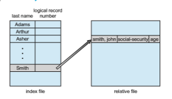
**Figure 13.6** Example of index and relative files.

names may indicate a relationship among files, we may want to be able to find all files whose names match a particular pattern.

• **Create a fil** . New files need to be created and added to the directory.

• **Delete a file.** When a file is no longer needed,wewant to be able to remove it from the directory. Note a delete leaves a hole in the directory structure and the file system may have a method to defragement the directory structure.

• **List a directory**. We need to be able to list the files in a directory and the contents of the directory entry for each file in the list.

• **Rename a file.** Because the name of a file represents its contents to its users, we must be able to change the name when the contents or use of the file changes. Renaming a file may also allow its position within the directory structure to be changed.

• **Traverse the file system**. We may wish to access every directory and every file within a directory structure. For reliability, it is a good idea to save the contents and structure of the entire file system at regular intervals. Often, we do this by copying all files tomagnetic tape, other secondary storage, or across a network to another system or the cloud. This technique provides a backup copy in case of system failure. In addition, if a file is no longer in use, the file can be copied the backup target and the disk space of that file released for reuse by another file.

In the following sections, we describe the most common schemes for defining the logical structure of a directory.

### Single-Level Directory

The simplest directory structure is the single-level directory. All files are con- tained in the same directory, which is easy to support and understand (Figure 13.7).  

**Figure 13.7** Single-level directory.

A single-level directory has significant limitations, however, when the number of files increases or when the system has more than one user. Since all files are in the same directory, they must have unique names. If two users call their data file test.txt, then the unique-name rule is violated. For example, in one programming class, 23 students called the program for their second assignment prog2.c; another 11 called it assign2.c. Fortunately, most file systems support file names of up to 255 characters, so it is relatively easy to select unique file names.

Even a single user on a single-level directorymay find it difficult to remem- ber the names of all the files as the number of files increases. It is not uncommon for a user to have hundreds of files on one computer system and an equal number of additional files on another system. Keeping track of so many files is a daunting task.

### Two-Level Directory**

As we have seen, a single-level directory often leads to confusion of file names among different users. The standard solution is to create a separate directory for each user.

In the two-level directory structure, each user has his own **user fil direc- tory** (**UFD**). The UFDs have similar structures, but each lists only the files of a single user. When a user job starts or a user logs in, the system’s **master fil directory** (**MFD**) is searched. The MFD is indexed by user name or account number, and each entry points to the UFD for that user (Figure 13.8).

When a user refers to a particular file, only his own UFD is searched. Thus, different users may have files with the same name, as long as all the file names within each UFD are unique. To create a file for a user, the operating system searches only that user’s UFD to ascertain whether another file of that name

**Figure 13.8** Two-level directory structure.  

exists. To delete a file, the operating system confines its search to the local UFD; thus, it cannot accidentally delete another user’s file that has the same name.

The user directories themselves must be created and deleted as necessary. A special system program is run with the appropriate user name and account information. The program creates a new UFD and adds an entry for it to the MFD. The execution of this program might be restricted to system administra- tors. The allocation of disk space for user directories can be handled with the techniques discussed in Chapter 14 for files themselves.

Although the two-level directory structure solves the name-collision prob- lem, it still has disadvantages. This structure effectively isolates one user from another. Isolation is an advantage when the users are completely independent but is a disadvantage when the users want to cooperate on some task and to access one another’s files. Some systems simply do not allow local user files to be accessed by other users.

If access is to be permitted, one user must have the ability to name a file in another user’s directory. To name a particular file uniquely in a two-level directory, we must give both the user name and the file name. A two-level directory can be thought of as a tree, or an inverted tree, of height 2. The root of the tree is the MFD. Its direct descendants are the UFDs. The descendants of the UFDs are the files themselves. The files are the leaves of the tree. Specifying a user name and a file name defines a path in the tree from the root (the MFD) to a leaf (the specified file). Thus, a user name and a file name define a **path name**. Every file in the system has a path name. To name a file uniquely, a user must know the path name of the file desired.

For example, if user Awishes to access her own test file named test.txt, she can simply refer to test.txt. To access the file named test.txt of user B (with directory-entry name userb), however, she might have to refer to /userb/test.txt. Every system has its own syntax for naming files in direc- tories other than the user’s own.

Additional syntax is needed to specify the volume of a file. For instance, in Windows a volume is specified by a letter followed by a colon. Thus, a file specification might be C:∖userb∖test. Some systems go even further and separate the volume, directory name, and file name parts of the speci- fication. In OpenVMS, for instance, the file login.com might be specified as: u:\[sst.crissmeyer\]login.com;1, where u is the name of the volume, sst is the name of the directory, crissmeyer is the name of the subdirectory, and 1 is the version number. Other systems—such as UNIX and Linux—simply treat the volume name as part of the directory name. The first name given is that of the volume, and the rest is the directory and file. For instance, /u/pgalvin/testmight specify volume u, directory pgalvin, and file test.

A special instance of this situation occurs with the system files. Programs provided as part of the system—loaders, assemblers, compilers, utility rou- tines, libraries, and so on—are generally defined as files.When the appropriate commands are given to the operating system, these files are read by the loader and executed. Many command interpreters simply treat such a command as the name of a file to load and execute. In the directory system as we defined it above, this file name would be searched for in the current UFD. One solution would be to copy the system files into each UFD. However, copying all the system files would waste an enormous amount of space. (If the system files  

require 5 MB, then supporting 12 users would require 5 × 12 = 60 MB just for copies of the system files.)

The standard solution is to complicate the search procedure slightly. A special user directory is defined to contain the system files (for example, user 0). Whenever a file name is given to be loaded, the operating system first searches the local UFD. If the file is found, it is used. If it is not found, the system automatically searches the special user directory that contains the system files. The sequence of directories searched when a file is named is called the **search path**. The search path can be extended to contain an unlimited list of directories to search when a command name is given. This method is the one most used in UNIX and Windows. Systems can also be designed so that each user has his own search path.

### Tree-Structured Directories

Once we have seen how to view a two-level directory as a two-level tree, the natural generalization is to extend the directory structure to a tree of arbitrary height (Figure 13.9). This generalization allows users to create their own subdirectories and to organize their files accordingly. A tree is the most common directory structure. The tree has a root directory, and every file in the system has a unique path name.

A directory (or subdirectory) contains a set of files or subdirectories. In many implementations, a directory is simply another file, but it is treated in a special way. All directories have the same internal format. One bit in each directory entry defines the entry as a file (0) or as a subdirectory (1). Special

**Figure 13.9** Tree-structured directory structure.  

system calls are used to create and delete directories. In this case the operating system (or the file system code) implements another file format, that of a directory.

In normal use, each process has a current directory. The **current directory** should containmost of the files that are of current interest to the process.When reference is made to a file, the current directory is searched. If a file is needed that is not in the current directory, then the user usually must either specify a path name or change the current directory to be the directory holding that file. To change directories, a system call could be provided that takes a directory name as a parameter and uses it to redefine the current directory. Thus, the user can change her current directory whenever she wants. Other systems leave it to the application (say, a shell) to track and operate on a current directory, as each process could have different current directories.

The initial current directory of a user’s login shell is designated when the user job starts or the user logs in. The operating system searches the accounting file (or some other predefined location) to find an entry for this user (for accounting purposes). In the accounting file is a pointer to (or the name of) the user’s initial directory. This pointer is copied to a local variable for this user that specifies the user’s initial current directory. From that shell, other processes can be spawned. The current directory of any subprocess is usually the current directory of the parent when it was spawned.

Path names can be of two types: absolute and relative. In UNIX and Linux, an **absolute path name** begins at the root (which is designated by an initial “/”) and follows a path down to the specified file, giving the directory names on the path. A **relative path name** defines a path from the current directory. For example, in the tree-structuredfile systemof Figure 13.9, if the current directory is /spell/mail, then the relative path name prt/first refers to the same file as does the absolute path name /spell/mail/prt/first.

Allowing a user to define her own subdirectories permits her to impose a structure on her files. This structure might result in separate directories for files associated with different topics (for example, a subdirectory was created to hold the text of this book) or different forms of information. For example, the directory programsmay contain source programs; the directory binmay store all the binaries. (As a side note, executable files were known in many systems as “binaries” which led to them being stored in the bin directory.)

An interesting policy decision in a tree-structured directory concerns how to handle the deletion of a directory. If a directory is empty, its entry in the directory that contains it can simply be deleted. However, suppose the direc- tory to be deleted is not empty but contains several files or subdirectories. One of two approaches can be taken. Some systemswill not delete a directory unless it is empty. Thus, to delete a directory, the user must first delete all the files in that directory. If any subdirectories exist, this procedure must be applied recursively to them, so that they can be deleted also. This approach can result in a substantial amount of work. An alternative approach, such as that taken by the UNIX rm command, is to provide an option: when a request is made to delete a directory, all that directory’s files and subdirectories are also to be deleted. Either approach is fairly easy to implement; the choice is one of policy. The latter policy is more convenient, but it is also more dangerous, because an entire directory structure can be removedwith one command. If that command is issued in error, a large number of files and directorieswill need to be restored (assuming a backup exists).

With a tree-structured directory system, users can be allowed to access, in addition to their files, the files of other users. For example, user B can access a file of user Aby specifying its path name. User B can specify either an absolute or a relative path name. Alternatively, user B can change her current directory to be user A’s directory and access the file by its file name.

### Acyclic-Graph Directories

Consider two programmers who are working on a joint project. The files asso- ciated with that project can be stored in a subdirectory, separating them from other projects and files of the two programmers. But since both programmers are equally responsible for the project, both want the subdirectory to be in their own directories. In this situation, the common subdirectory should be **_shared._** A shared directory or file exists in the file system in two (or more) places at once.

A tree structure prohibits the sharing of files or directories. An **acyclic graph**—that is, a graph with no cycles—allows directories to share subdirec- tories and files (Figure 13.10). The same file or subdirectory may be in two different directories. The acyclic graph is a natural generalization of the tree- structured directory scheme.

It is important to note that a shared file (or directory) is not the same as two copies of the file. With two copies, each programmer can view the copy rather than the original, but if one programmer changes the file, the changes will not appear in the other’s copy. With a shared file, only one actual file exists, so any changes made by one person are immediately visible to the other. Sharing is

**Figure 13.10** Acyclic-graph directory structure.  

particularly important for subdirectories; a new file created by one person will automatically appear in all the shared subdirectories.

When people are working as a team, all the files they want to share can be put into one directory. The home directory of each teammember could contain this directory of shared files as a subdirectory. Even in the case of a single user, the user’s file organization may require that some file be placed in different subdirectories. For example, a program written for a particular project should be both in the directory of all programs and in the directory for that project.

Shared files and subdirectories can be implemented in several ways. A common way, exemplified by UNIX systems, is to create a new directory entry called a link. A **link** is effectively a pointer to another file or subdirectory. For example, a link may be implemented as an absolute or a relative path name. When a reference to a file is made, we search the directory. If the directory entry is marked as a link, then the name of the real file is included in the link information. We **resolve** the link by using that path name to locate the real file. Links are easily identified by their format in the directory entry (or by having a special type on systems that support types) and are effectively indirect pointers. The operating system ignores these links when traversing directory trees to preserve the acyclic structure of the system.

Another common approach to implementing shared files is simply to duplicate all information about them in both sharing directories. Thus, both entries are identical and equal. Consider the difference between this approach and the creation of a link. The link is clearly different from the original directory entry; thus, the two are not equal. Duplicate directory entries, however, make the original and the copy indistinguishable. A major problem with duplicate directory entries is maintaining consistency when a file is modified.

An acyclic-graph directory structure is more flexible than a simple tree structure, but it is also more complex. Several problems must be considered carefully. A file may now have multiple absolute path names. Consequently, distinct file names may refer to the same file. This situation is similar to the aliasing problem for programming languages. If we are trying to traverse the entire file system—to find a file, to accumulate statistics on all files, or to copy all files to backup storage—this problem becomes significant, since we do not want to traverse shared structures more than once.

Another problem involves deletion. When can the space allocated to a shared file be deallocated and reused? One possibility is to remove the file whenever anyone deletes it, but this action may leave dangling pointers to the now-nonexistent file. Worse, if the remaining file pointers contain actual disk addresses, and the space is subsequently reused for other files, these dangling pointers may point into the middle of other files.

In a systemwhere sharing is implemented by symbolic links, this situation is somewhat easier to handle. The deletion of a link need not affect the original file; only the link is removed. If the file entry itself is deleted, the space for the file is deallocated, leaving the links dangling. We can search for these links and remove them as well, but unless a list of the associated links is kept with each file, this search can be expensive. Alternatively, we can leave the links until an attempt is made to use them. At that time, we can determine that the file of the name given by the link does not exist and can fail to resolve the link name; the access is treated just as with any other illegal file name. (In this case, the system designer should consider carefully what to do when a file is deleted and another file of the same name is created, before a symbolic link to the original file is used.) In the case of UNIX, symbolic links are left when a file is deleted, and it is up to the user to realize that the original file is gone or has been replaced. Microsoft Windows uses the same approach.

Another approach to deletion is to preserve the file until all references to it are deleted. To implement this approach, we must have some mechanism for determining that the last reference to the file has been deleted. We could keep a list of all references to a file (directory entries or symbolic links). When a link or a copy of the directory entry is established, a new entry is added to the file-reference list. When a link or directory entry is deleted, we remove its entry on the list. The file is deleted when its file-reference list is empty.

The trouble with this approach is the variable and potentially large size of the file-reference list. However, we really do not need to keep the entire list —we need to keep only a count of the number of references. Adding a new link or directory entry increments the reference count. Deleting a link or entry decrements the count. When the count is 0, the file can be deleted; there are no remaining references to it. The UNIX operating system uses this approach for nonsymbolic links (or **hard links**), keeping a reference count in the file infor- mation block (or inode; see Section C.7.2). By effectively prohibiting multiple references to directories, we maintain an acyclic-graph structure.

To avoid problems such as the ones just discussed, some systems simply do not allow shared directories or links.

### General Graph Directory

Aserious problem with using an acyclic-graph structure is ensuring that there are no cycles. If we start with a two-level directory and allow users to create subdirectories, a tree-structured directory results. It should be fairly easy to see that simply adding new files and subdirectories to an existing tree-structured directory preserves the tree-structured nature. However, when we add links, the tree structure is destroyed, resulting in a simple graph structure (Figure 13.11).

The primary advantage of an acyclic graph is the relative simplicity of the algorithms to traverse the graph and to determine when there are no more references to a file. We want to avoid traversing shared sections of an acyclic graph twice, mainly for performance reasons. If we have just searched a major shared subdirectory for a particular file without finding it, we want to avoid searching that subdirectory again; the second search would be a waste of time.

If cycles are allowed to exist in the directory, we likewise want to avoid searching any component twice, for reasons of correctness as well as perfor- mance.Apoorlydesignedalgorithmmight result in an infinite loop continually searching through the cycle and never terminating. One solution is to limit arbitrarily the number of directories that will be accessed during a search.

A similar problem exists when we are trying to determine when a file can be deleted. With acyclic-graph directory structures, a value of 0 in the reference count means that there are no more references to the file or directory, and the file can be deleted. However, when cycles exist, the reference count may not be 0 even when it is no longer possible to refer to a directory or file. This anomaly results from the possibility of self-referencing (or a cycle) in the directory structure. In this case, we generally need to use a **garbage collection**  
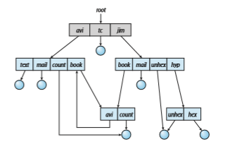
**Figure 13.11** General graph directory.

scheme to determine when the last reference has been deleted and the disk space can be reallocated. Garbage collection involves traversing the entire file system, marking everything that can be accessed. Then, a second pass collects everything that is not marked onto a list of free space. (A similar marking procedure can be used to ensure that a traversal or searchwill cover everything in the file system once and only once.) Garbage collection for a disk-based file system, however, is extremely time consuming and is thus seldom attempted.

Garbage collection is necessary only because of possible cycles in the graph. Thus, an acyclic-graph structure ismuch easier toworkwith. The difficulty is to avoid cycles as new links are added to the structure. How do we knowwhen a new link will complete a cycle? There are algorithms to detect cycles in graphs; however, they are computationally expensive, especially when the graph is on disk storage. A simpler algorithm in the special case of directories and links is to bypass links during directory traversal. Cycles are avoided, and no extra overhead is incurred.

## Protection

When information is stored in a computer system, we want to keep it safe from physical damage (the issue of reliability) and improper access (the issue of protection).

Reliability is generally provided by duplicate copies of files.Many comput- ers have systems programs that automatically (or through computer-operator intervention) copy disk files to tape at regular intervals (once per day or week or month) to maintain a copy should a file system be accidentally destroyed. File systems can be damaged by hardware problems (such as errors in reading or writing), power surges or failures, head crashes, dirt, temperature extremes, and vandalism. Files may be deleted accidentally. Bugs in the file-system soft- ware can also cause file contents to be lost. Reliability was covered in more detail in Chapter 11.

Protection can be provided in many ways. For a laptop system running a modern operating system, we might provide protection by requiring a user name and password authentication to access it, encrypting the secondary stor- age so even someone opening the laptop and removing the drive would have a difficult time accessing its data, and firewalling network access so that when it is in use it is difficult to break in via its network connection. In multiuser system, even valid access of the system needs more advanced mechanisms to allow only valid access of the data.

### Types of Access

The need to protect files is a direct result of the ability to access files. Systems that do not permit access to the files of other users do not need protection. Thus, we could provide complete protection by prohibiting access. Alternatively, we could provide free access with no protection. Both approaches are too extreme for general use. What is needed is controlled access.

Protection mechanisms provide controlled access by limiting the types of file access that can be made. Access is permitted or denied depending on several factors, one of which is the type of access requested. Several different types of operations may be controlled:

• **Read**. Read from the file.

• **Write**. Write or rewrite the file.

• **Execute**. Load the file into memory and execute it.

• **Append**. Write new information at the end of the file.

• **Delete**. Delete the file and free its space for possible reuse.

• **List**. List the name and attributes of the file.

• **Attribute change**. Changing the attributes of the file.

Other operations, such as renaming, copying, and editing the file, may also be controlled. For many systems, however, these higher-level functions may be implemented by a system program that makes lower-level system calls. Protection is provided at only the lower level. For instance, copying a file may be implemented simply by a sequence of read requests. In this case, a user with read access can also cause the file to be copied, printed, and so on.

Many protection mechanisms have been proposed. Each has advantages and disadvantages and must be appropriate for its intended application. A small computer system that is used by only a fewmembers of a research group, for example, may not need the same types of protection as a large corporate computer that is used for research, finance, and personnel operations. We discuss some approaches to protection in the following sections and present a more complete treatment in Chapter 17.  

### Access Control

Themost common approach to the protection problem is tomake access depen- dent on the identity of the user. Different users may need different types of access to a file or directory. The most general scheme to implement identity- dependent access is to associate with each file and directory an **access-control list** (**ACL**) specifying user names and the types of access allowed for each user. When a user requests access to a particular file, the operating system checks the access list associated with that file. If that user is listed for the requested access, the access is allowed. Otherwise, a protection violation occurs, and the user job is denied access to the file.

This approach has the advantage of enabling complex access methodolo- gies. The main problem with access lists is their length. If we want to allow everyone to read a file, we must list all users with read access. This technique has two undesirable consequences:

• Constructing such a list may be a tedious and unrewarding task, especially if we do not know in advance the list of users in the system.

• The directory entry, previously of fixed size, now must be of variable size, resulting in more complicated space management.

These problems can be resolved by use of a condensed version of the access list.

To condense the length of the access-control list, many systems recognize three classifications of users in connection with each file:

• **Owner**. The user who created the file is the owner.

• **Group**. A set of users who are sharing the file and need similar access is a group, or work group.

• **Other**. All other users in the system.

The most common recent approach is to combine access-control lists with themore general (and easier to implement) owner, group, and universe access- control scheme just described. For example, Solaris uses the three categories of access by default but allows access-control lists to be added to specific files and directories when more fine-grained access control is desired.

To illustrate, consider a person, Sara, who is writing a new book. She has hired three graduate students (Jim, Dawn, and Jill) to helpwith the project. The text of the book is kept in a file named book.tex. The protection associated with this file is as follows:

• Sara should be able to invoke all operations on the file.

• Jim, Dawn, and Jill should be able only to read and write the file; they should not be allowed to delete the file.

• All other users should be able to read, but not write, the file. (Sara is interested in letting as many people as possible read the text so that she can obtain feedback.)  

**_PERMISSIONS IN AUNIX SYSTEM_**

In the UNIX system, directory protection and file protection are handled similarly. Associated with each file and directory are three fields—owner, group, and universe—each consisting of the three bits rwx, where r controls **r**ead access, w controls **w**rite access, and x controls e**x**ecution. Thus, a user can list the content of a subdirectory only if the r bit is set in the appropriate field. Similarly, a user can change his current directory to another current directory (say, foo) only if the x bit associated with the foo subdirectory is set in the appropriate field.

A sample directory listing from a UNIX environment is shown in below:

The first field describes the protection of the file or directory. A d as the first character indicates a subdirectory. Also shown are the number of links to the file, the owner’s name, the group’s name, the size of the file in bytes, the date of last modification, and finally the file’s name (with optional extension).

To achieve such protection, we must create a new group—say, text— with members Jim, Dawn, and Jill. The name of the group, text, must then be associated with the file book.tex, and the access rights must be set in accordance with the policy we have outlined.

Now consider a visitor to whom Sara would like to grant temporary access to Chapter 1. The visitor cannot be added to the text group because thatwould give him access to all chapters. Because a file can be in only one group, Sara cannot add another group to Chapter 1. With the addition of access-control- list functionality, though, the visitor can be added to the access control list of Chapter 1.

For this scheme towork properly, permissions and access listsmust be con- trolled tightly. This control can be accomplished in several ways. For example, in the UNIX system, groups can be created and modified only by the manager of the facility (or by any superuser). Thus, control is achieved through human interaction. Access lists are discussed further in Section 17.6.2.

With themore limited protection classification, only three fields are needed to define protection. Often, each field is a collection of bits, and each bit either allows or prevents the access associated with it. For example, the UNIX system defines three fields of three bits each—rwx, where r controls read access, w controls write access, and x controls execution. A separate field is kept for the  

file owner, for the file’s group, and for all other users. In this scheme, nine bits per file are needed to record protection information. Thus, for our example, the protection fields for the file book.tex are as follows: for the owner Sara, all bits are set; for the group text, the r and w bits are set; and for the universe, only the r bit is set.

One difficulty in combining approaches comes in the user interface. Users must be able to tell when the optional ACL permissions are set on a file. In the Solaris example, a “+” is appended to the regular permissions, as in:

19 -rw-r--r--+ 1 jim staff 130 May 25 22:13 file1

A separate set of commands, setfacl and getfacl, is used to manage the ACLs.

Windows users typically manage access-control lists via the GUI. Figure 13.12 shows a file-permission window on Windows 7 NTFS file system. In this example, user “guest” is specifically denied access to the file ListPanel.java.

Another difficulty is assigning precedence when permission and ACLs conflict. For example, if Walter is in a file’s group, which has read permission, but the file has an ACL granting Walter read and write permission, should a write by Walter be granted or denied? Solaris and other operating systems give ACLs precedence (as they are more fine-grained and are not assigned by default). This follows the general rule that specificity should have priority.

### Other Protection Approaches

Another approach to the protection problem is to associate a password with each file. Just as access to the computer system is often controlled by a pass- word, access to each file can be controlled in the same way. If the passwords are chosen randomly and changed often, this scheme may be effective in lim- iting access to a file. The use of passwords has a few disadvantages, however. First, the number of passwords that a user needs to remember may become large, making the scheme impractical. Second, if only one password is used for all the files, then once it is discovered, all files are accessible; protection is on an all-or-none basis. Some systems allow a user to associate a password with a subdirectory, rather than with an individual file, to address this problem. More commonly encryption of a partition or individual files provides strong protection, but password management is key.

In a multilevel directory structure, we need to protect not only individual files but also collections of files in subdirectories; that is, we need to provide a mechanism for directory protection. The directory operations that must be protected are somewhat different from the file operations. We want to control the creation and deletion of files in a directory. In addition, we probably want to control whether a user can determine the existence of a file in a directory. Sometimes, knowledge of the existence and name of a file is significant in itself. Thus, listing the contents of a directory must be a protected operation. Similarly, if a path name refers to a file in a directory, the user must be allowed access to both the directory and the file. In systems where files may have numerous path names (such as acyclic and general graphs), a given user may have different access rights to a particular file, depending on the path name used.  

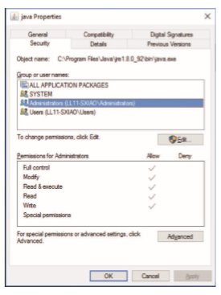
**Figure 13.12** Windows 10 access-control list management.

## Memory-Mapped Files

There is one other method of accessing files, and it is very commonly used. Consider a sequential read of a file on disk using the standard system calls open(), read(), and write(). Each file access requires a system call and disk access. Alternatively, we can use the virtual memory techniques discussed in Chapter 10 to treat file I/O as routine memory accesses. This approach, known as **memory mapping** a file, allows a part of the virtual address space to be logically associated with the file. As we shall see, this can lead to significant performance increases.

### Basic Mechanism

Memory mapping a file is accomplished by mapping a disk block to a page (or pages) in memory. Initial access to the file proceeds through ordinary demand paging, resulting in a page fault. However, a page-sized portion of the file is read from the file system into a physical page (some systems may opt to read in more than a page-sized chunk of memory at a time). Subsequent reads and writes to the file are handled as routine memory accesses. Manipulating files through memory rather than incurring the overhead of using the read() and write() system calls simplifies and speeds up file access and usage.

Note that writes to the file mapped in memory are not necessarily imme- diate (synchronous) writes to the file on secondary storage. Generally, systems update the file based on changes to the memory image only when the file is closed. Under memory pressure, systems will have any intermediate changes to swap space to not lose them when freeing memory for other uses. When the file is closed, all the memory-mapped data are written back to the file on secondary storage and removed from the virtual memory of the process.

Some operating systems providememorymapping only through a specific system call and use the standard system calls to perform all other file I/O. However, some systems choose tomemory-map afile regardless ofwhether the file was specified as memory-mapped. Let’s take Solaris as an example. If a file is specified as memory-mapped (using the mmap() system call), Solaris maps the file into the address space of the process. If a file is opened and accessed using ordinary system calls, such as open(), read(), and write(), Solaris still memory-maps the file; however, the file is mapped to the kernel address space. Regardless of how the file is opened, then, Solaris treats all file I/O as memory- mapped, allowing file access to take place via the efficient memory subsystem and avoiding system call overhead caused by each traditional read() and write().

Multiple processes may be allowed to map the same file concurrently, to allow sharing of data. Writes by any of the processes modify the data in virtual memory and can be seen by all others that map the same section of the file. Given our earlier discussions of virtual memory, it should be clear how the sharing of memory-mapped sections of memory is implemented: the virtual memory map of each sharing process points to the same page of physical memory—the page that holds a copy of the disk block. This memory sharing is illustrated in Figure 13.13. Thememory-mapping system calls can also support copy-on-write functionality, allowing processes to share a file in read-only mode but to have their own copies of any data they modify. So that access to the shared data is coordinated, the processes involved might use one of the mechanisms for achieving mutual exclusion described in Chapter 6.

Quite often, shared memory is in fact implemented by memory mapping files. Under this scenario, processes can communicate using shared mem- ory by having the communicating processes memory-map the same file into their virtual address spaces. The memory-mapped file serves as the region of shared memory between the communicating processes (Figure 13.14). We have already seen this in Section 3.5, where a POSIX shared-memory object is created and each communicating process memory-maps the object into its address space. In the following section, we discuss support in the Windows API for shared memory using memory-mapped files.

### Shared Memory in the Windows API

The general outline for creating a region of shared memory using memory- mapped files in the Windows API involves first creating a **fil mapping** for the  

**Figure 13.13** Memory-mapped files.

file to bemapped and then establishing a **view** of themapped file in a process’s virtual address space. A second process can then open and create a view of the mapped file in its virtual address space. The mapped file represents the shared-memory object that will enable communication to take place between the processes.

We next illustrate these steps in more detail. In this example, a producer process first creates a shared-memory object using the memory-mapping fea- tures available in the Windows API. The producer then writes a message to sharedmemory. After that, a consumer process opens amapping to the shared- memory object and reads the message written by the consumer.

**Figure 13.14** Shared memory using memory-mapped I/O.  
To establish a memory-mapped file, a process first opens the file to be mapped with the CreateFile() function, which returns a HANDLE to the opened file. The process then creates a mapping of this file HANDLE using the CreateFileMapping() function. Once the file mapping is done, the process establishes a view of the mapped file in its virtual address space with the MapViewOfFile() function. The view of the mapped file represents the por- tion of the file being mapped in the virtual address space of the process—the entire file or only a portion of it may be mapped. This sequence in the program

**Figure 13.15** Producer writing to shared memory using the Windows API.  

is shown in Figure 13.15. (We eliminate much of the error checking for code brevity.)

The call to CreateFileMapping() creates a **named shared-memory object** called SharedObject. The consumer process will communicate using this shared-memory segment by creating a mapping to the same named object. The producer then creates a view of the memory-mapped file in its virtual address space. By passing the last three parameters the value 0, it indicates that the mapped view is the entire file. It could instead have passed values specifying an offset and size, thus creating a view containing only a subsection of the file. (It is important to note that the entire mapping may not be loaded into memorywhen the mapping is established. Rather, the mapped file may be demand-paged, thus bringing pages into memory only as they are accessed.) The MapViewOfFile() function returns a pointer to the shared-memory object; any accesses to this memory location are thus accesses to the memory-mapped file. In this instance, the producer process writes themessage “Shared memory message” to shared memory.

A program illustrating how the consumer process establishes a view of the named shared-memory object is shown in Figure 13.16. This program is

**Figure 13.16** Consumer reading from shared memory using the Windows API.  

somewhat simpler than the one shown in Figure 13.15, as all that is necessary is for the process to create a mapping to the existing named shared-memory object. The consumer process must also create a view of the mapped file, just as the producer process did in the program in Figure 13.15. The consumer then reads from shared memory the message “Shared memory message” that was written by the producer process.

Finally, both processes remove the view of the mapped file with a call to UnmapViewOfFile(). We provide a programming exercise at the end of this chapter using shared memory with memory mapping in the Windows API.

## Summary

• A file is an abstract data type defined and implemented by the operating system. It is a sequence of logical records. A logical record may be a byte, a line (of fixed or variable length), or a more complex data item. The operating system may specifically support various record types or may leave that support to the application program.

• A major task for the operating system is to map the logical file concept onto physical storage devices such as hard disk or NVM device. Since the physical record size of the devicemay not be the same as the logical record size, it may be necessary to order logical records into physical records. Again, this task may be supported by the operating system or left for the application program.

• Within a file system, it is useful to create directories to allow files to be organized. A single-level directory in a multiuser system causes naming problems, since each file must have a unique name. A two-level directory solves this problem by creating a separate directory for each user’s files. The directory lists the files by name and includes the file’s location on the disk, length, type, owner, time of creation, time of last use, and so on.

• The natural generalization of a two-level directory is a tree-structured directory. A tree-structured directory allows a user to create subdirectories to organize files. Acyclic-graph directory structures enable users to share subdirectories and files but complicate searching and deletion. A general graph structure allows complete flexibility in the sharing of files and direc- tories but sometimes requires garbage collection to recover unused disk space.

• Remote file systems present challenges in reliability, performance, and security. Distributed information systems maintain user, host, and access information so that clients and servers can share state information to man- age use and access.

• Since files are the main information-storage mechanism in most computer systems, file protection is needed on multiuser systems. Access to files can be controlled separately for each type of access—read, write, execute, append, delete, list directory, and so on. File protection can be provided by access lists, passwords, or other techniques.  

**Practice Exercises**

**13.1** Some systems automatically delete all user files when a user logs off or a job terminates, unless the user explicitly requests that they be kept. Other systems keep all files unless the user explicitly deletes them. Discuss the relative merits of each approach.

**13.2** Why do some systems keep track of the type of a file, while still others leave it to the user and others simply do not implement multiple file types? Which system is “better”?

**13.3** Similarly, some systems support many types of structures for a file’s data, while others simply support a stream of bytes. What are the advantages and disadvantages of each approach?

**13.4** Could you simulate a multilevel directory structure with a single-level directory structure inwhich arbitrarily long names can be used? If your answer is yes, explain how you can do so, and contrast this scheme with themultilevel directory scheme. If your answer is no, explainwhat prevents your simulation’s success. Howwould your answer change if file names were limited to seven characters?

**13.5** Explain the purpose of the open() and close() operations.

**13.6** In some systems, a subdirectory can be read and written by an autho- rized user, just as ordinary files can be.

a. Describe the protection problems that could arise.

b. Suggest a scheme for dealing with each of these protection prob- lems.

**13.7** Consider a system that supports 5,000 users. Suppose that you want to allow 4,990 of these users to be able to access one file.

a. How would you specify this protection scheme in UNIX?

b. Can you suggest another protection scheme that can be usedmore effectively for this purpose than the scheme provided by UNIX?

**13.8** Researchers have suggested that, instead of having an access-control list associated with each file (specifying which users can access the file, and how), we should have a **user control list** associated with each user (specifying which files a user can access, and how). Discuss the relative merits of these two schemes.

**Further Reading**

Amultilevel directory structure was first implemented on the MULTICS system (\[Organick (1972)\]). Most operating systems now implement multilevel direc- tory structures. These include Linux (\[Love (2010)\]), macOS (\[Singh (2007)\]), Solaris (\[McDougall and Mauro (2007)\]), and all versions of Windows (\[Russi- novich et al. (2017)\]).  

A general discussion of Solaris file systems is found in the Sun _Sys- tem Administration Guide: Devices and File Systems_ (http://docs.sun.com/app/ docs/doc/817-5093).

The network file system (NFS), designed by Sun Microsystems, allows directory structures to be spread across networked computer systems. NFS Version 4 is described in RFC3505 (http://www.ietf.org/rfc/rfc3530.txt).

Agreat source of themeanings of computer jargon is http://www.catb.org/ esr/jargon/.

## Bibliography

**\[Love (2010)\]** R. Love, _Linux Kernel Development,_ Third Edition, Developer’s Library (2010).

**\[McDougall and Mauro (2007)\]** R. McDougall and J. Mauro, _Solaris Internals,_ Second Edition, Prentice Hall (2007).

**\[Organick (1972)\]** E. I. Organick, _The Multics System: An Examination of Its Struc- ture_, MIT Press (1972).

**\[Russinovich et al. (2017)\]** M.Russinovich,D.A. Solomon, andA. Ionescu,_Win- dows Internals–Part 1,_ Seventh Edition, Microsoft Press (2017).

**\[Singh (2007)\]** A. Singh, _Mac OS X Internals: A Systems Approach_, Addison- Wesley (2007).  

## Exercises

**Chapter 13 Exercises**

**13.9** Consider a file system in which a file can be deleted and its disk space reclaimedwhile links to that file still exist. What problemsmay occur if a new file is created in the same storage area or with the same absolute path name? How can these problems be avoided?

**13.10** The open-file table is used to maintain information about files that are currently open. Should the operating system maintain a separate table for each user or maintain just one table that contains references to files that are currently being accessed by all users? If the same file is being accessed by two different programs or users, should there be separate entries in the open-file table? Explain.

**13.11** What are the advantages and disadvantages of providing mandatory locks instead of advisory locks whose use is left to users’ discretion?

**13.12** Provide examples of applications that typically access files according to the following methods:

• Sequential

• Random

**13.13** Some systems automatically open a filewhen it is referenced for the first time and close the file when the job terminates. Discuss the advantages and disadvantages of this scheme compared with the more traditional one, where the user has to open and close the file explicitly.

**13.14** If the operating system knew that a certain application was going to access file data in a sequential manner, how could it exploit this information to improve performance?

**13.15** Give an example of an application that could benefit from operating- system support for random access to indexed files.

**13.16** Some systems provide file sharing by maintaining a single copy of a file. Other systems maintain several copies, one for each of the users sharing the file. Discuss the relative merits of each approach.

**EX-48**  

# File -System Implementation

As we saw in Chapter 13, the file system provides the mechanism for on- line storage and access to file contents, including data and programs. File systems usually reside permanently on secondary storage, which is designed to hold a large amount of data. This chapter is primarily concerned with issues surrounding file storage and access on the most common secondary-storage media, hard disk drives and nonvolatile memory devices. We explore ways to structure file use, to allocate storage space, to recover freed space, to track the locations of data, and to interface other parts of the operating system to secondary storage. Performance issues are considered throughout the chapter.

A given general-purpose operating system provides several file systems. Additionally,many operating systems allow administrators or users to add file systems.Why somany? File systems vary inmany respects, including features, performance, reliability, and design goals, and different file systemsmay serve different purposes. For example, a temporary file system is used for fast storage and retrieval of nonpersistent files, while the default secondary storage file system (such as Linux ext4) sacrifices performance for reliability and features. As we’ve seen throughout this study of operating systems, there are plenty of choices and variations, making thorough coverage a challenge. In this chapter, we concentrate on the common denominators.

**CHAPTER OBJECTIVES**

• Describe the details of implementing local file systems and directory struc- tures.

• Discuss block allocation and free-block algorithms and trade-offs.

• Explore file system efficiency and performance issues.

• Look at recovery from file system failures.

• Describe the WAFL file system as a concrete example.

## File-System Structure

Disks provide most of the secondary storage on which file systems are main- tained. Two characteristics make them convenient for this purpose:

**1\.** A disk can be rewritten in place; it is possible to read a block from the disk, modify the block, and write it back into the same block.

**2\.** A disk can access directly any block of information it contains. Thus, it is simple to access any file either sequentially or randomly, and switching from one file to another requires the drive moving the read–write heads and waiting for the media to rotate.

Nonvolatile memory (NVM) devices are increasingly used for file storage and thus as a location for file systems. They differ from hard disks in that they cannot be rewritten in place and they have different performance characteris- tics. We discuss disk and NVM-device structure in detail in Chapter 11.

To improve I/O efficiency, I/O transfers betweenmemory andmass storage are performed in units of **blocks**. Each block on a hard disk drive has one or more sectors. Depending on the disk drive, sector size is usually 512 bytes or 4,096 bytes. NVM devices usually have blocks of 4,096 bytes, and the transfer methods used are similar to those used by disk drives.

**File systems** provide efficient and convenient access to the storage device by allowing data to be stored, located, and retrieved easily. Afile system poses two quite different design problems. The first problem is defining how the file system should look to the user. This task involves defining a file and its attributes, the operations allowed on a file, and the directory structure for organizing files. The second problem is creating algorithms and data structures to map the logical file system onto the physical secondary-storage devices.

The file system itself is generally composed of many different levels. The structure shown in Figure 14.1 is an example of a layered design. Each level in the design uses the features of lower levels to create new features for use by higher levels.

The **I/O control** level consists of device drivers and interrupt handlers to transfer information between the main memory and the disk system. A device driver can be thought of as a translator. Its input consists of high- level commands, such as “retrieve block 123.” Its output consists of low-level, hardware-specific instructions that are used by the hardware controller, which interfaces the I/O device to the rest of the system. The device driver usually writes specific bit patterns to special locations in the I/O controller’s memory to tell the controller which device location to act on and what actions to take. The details of device drivers and the I/O infrastructure are covered in Chapter 12.

The **basic file system** (called the “block I/O subsystem” in Linux) needs only to issue generic commands to the appropriate device driver to read and write blocks on the storage device. It issues commands to the drive based on logical block addresses. It is also concerned with I/O request scheduling. This layer also manages the memory buffers and caches that hold various file- system, directory, and data blocks. A block in the buffer is allocated before the transfer of a mass storage block can occur. When the buffer is full, the buffer manager must find more buffer memory or free up buffer space to allow a  
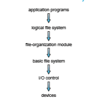
**Figure 14.1** Layered file system.

requested I/O to complete. Caches are used to hold frequently used file-system metadata to improve performance, so managing their contents is critical for optimum system performance.

The **file-organizatio module** knows about files and their logical blocks. Each file’s logical blocks are numbered from 0 (or 1) through _N._ The file- organization module also includes the free-space manager, which tracks unal- located blocks and provides these blocks to the file-organization module when requested.

Finally, the **logical file system** manages metadata information. Metadata includes all of the file-system structure except the actual data (or contents of the files). The logical file system manages the directory structure to provide the file-organization module with the information the latter needs, given a symbolic file name. It maintains file structure via file-control blocks. A **file control block** (**FCB**) (an **inode** in UNIX file systems) contains information about the file, including ownership, permissions, and location of the file contents. The logical file system is also responsible for protection, as discussed in Chapters 13 and 17.

When a layered structure is used for file-system implementation, duplica- tion of code is minimized. The I/O control and sometimes the basic file-system code can be used by multiple file systems. Each file system can then have its own logical file-system and file-organizationmodules. Unfortunately, layering can introducemore operating-systemoverhead,whichmay result in decreased performance. The use of layering, including the decision about howmany lay- ers to use andwhat each layer should do, is amajor challenge in designing new systems.

Many file systems are in use today, and most operating systems support more than one. For example, most CD-ROMs are written in the ISO 9660 for- mat, a standard format agreed on by CD-ROM manufacturers. In addition to removable-media file systems, each operating system has one or more disk- based file systems. UNIX uses the **UNIX fil system** (**UFS**), which is based on the Berkeley Fast File System (FFS). Windows supports disk file-system formats of FAT, FAT32, and NTFS (orWindows NT File System), as well as CD-ROM and DVD file-system formats. Although Linux supports over 130 different file systems, the standard Linux file system is known as the **extended file system**, with the most common versions being ext3 and ext4. There are also distributed file systems in which a file system on a server is mounted by one or more client computers across a network.

File-system research continues to be an active area of operating-system design and implementation. Google created its own file system to meet the company’s specific storage and retrieval needs, which include high- performance access from many clients across a very large number of disks. Another interesting project is the FUSE file system, which provides flexibility in file-system development and use by implementing and executing file systems as user-level rather than kernel-level code. Using FUSE, a user can add a new file system to a variety of operating systems and can use that file system to manage her files.

## File-System Operations

As was described in Section 13.1.2, operating systems implement open() and close() systems calls for processes to request access to file contents. In this section, we delve into the structures and operations used to implement file- system operations.

### Overview

Several on-storage and in-memory structures are used to implement a file system. These structures vary depending on the operating system and the file system, but some general principles apply.

On storage, the file system may contain information about how to boot an operating system stored there, the total number of blocks, the number and location of free blocks, the directory structure, and individual files. Many of these structures are detailed throughout the remainder of this chapter. Here, we describe them briefly:

• A **boot control block** (per volume) can contain information needed by the system to boot an operating system from that volume. If the disk does not contain an operating system, this block can be empty. It is typically the first block of a volume. In UFS, it is called the **boot block**. In NTFS, it is the **partition boot sector**.

• A **volume control block** (per volume) contains volume details, such as the number of blocks in the volume, the size of the blocks, a free-block count and free-block pointers, and a free-FCB count and FCB pointers. In UFS, this is called a **superblock**. In NTFS, it is stored in the **master fil table**.

• A directory structure (per file system) is used to organize the files. In UFS, this includes file names and associated inode numbers. In NTFS, it is stored in the master file table.  

• A per-file FCB containsmany details about the file. It has a unique identifier number to allow association with a directory entry. In NTFS, this informa- tion is actually stored within the master file table, which uses a relational database structure, with a row per file.

The in-memory information is used for both file-system management and performance improvement via caching. The data are loaded at mount time, updated during file-system operations, and discarded at dismount. Several types of structures may be included.

• An in-memory **mount table** contains information about each mounted volume.

• An in-memory directory-structure cache holds the directory information of recently accessed directories. (For directories at which volumes are mounted, it can contain a pointer to the volume table.)

• The **system-wide open-fil table** contains a copy of the FCB of each open file, as well as other information.

• The **per-process open-fil table** contains pointers to the appropriate entries in the system-wide open-file table, as well as other information, for all files the process has open.

• Buffers hold file-system blocks when they are being read from or written to a file system.

To create a new file, a process calls the logical file system. The logical file system knows the format of the directory structures. To create a new file, it allocates a new FCB. (Alternatively, if the file-system implementation creates all FCBs at file-system creation time, an FCB is allocated from the set of free FCBs.) The system then reads the appropriate directory into memory, updates it with the newfile name and FCB, andwrites it back to the file system.Atypical FCB is shown in Figure 14.2.

Some operating systems, including UNIX, treat a directory exactly the same as a file—one with a “type” field indicating that it is a directory. Other oper-

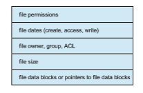
**Figure 14.2** A typical file-control block.  
ating systems, including Windows, implement separate system calls for files and directories and treat directories as entities separate from files. Whatever the larger structural issues, the logical file system can call the file-organization module to map the directory I/O into storage block locations, which are passed on to the basic file system and I/O control system.

### Usage

Now that a file has been created, it can be used for I/O. First, though, it must be opened. The open() call passes a file name to the logical file system. The open() systemcall first searches the system-wide open-file table to see if the file is already in use by another process. If it is, a per-process open-file table entry is created pointing to the existing system-wide open-file table. This algorithm can save substantial overhead. If the file is not already open, the directory structure is searched for the given file name. Parts of the directory structure are usually cached in memory to speed directory operations. Once the file is found, the FCB is copied into a system-wide open-file table in memory. This table not only stores the FCB but also tracks the number of processes that have the file open.

Next, an entry is made in the per-process open-file table, with a pointer to the entry in the system-wide open-file table and some other fields. These other fieldsmay include a pointer to the current location in the file (for the next read() or write() operation) and the access mode in which the file is open. The open() call returns a pointer to the appropriate entry in the per-process file-system table. All file operations are then performed via this pointer. The file name may not be part of the open-file table, as the system has no use for it once the appropriate FCB is located on disk. It could be cached, though, to save time on subsequent opens of the same file. The name given to the entry varies. UNIX systems refer to it as a **fil descriptor**; Windows refers to it as a **fil handle**.

When a process closes the file, the per-process table entry is removed, and the system-wide entry’s open count is decremented. When all users that have opened the file close it, any updatedmetadata are copied back to the disk-based directory structure, and the system-wide open-file table entry is removed.

The caching aspects of file-system structures should not be overlooked. Most systems keep all information about an open file, except for its actual data blocks, inmemory. The BSD UNIX system is typical in its use of caches wherever disk I/O can be saved. Its average cache hit rate of 85 percent shows that these techniques are well worth implementing. The BSD UNIX system is described fully in Appendix C.

The operating structures of a file-system implementation are summarized in Figure 14.3.

## Directory Implementation

The selection of directory-allocation and directory-management algorithms significantly affects the efficiency, performance, and reliability of the file sys- tem. In this section, we discuss the trade-offs involved in choosing one of these algorithms.  

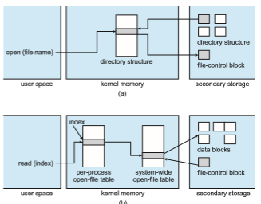
**Figure 14.3** In-memory file-system structures. (a) File open. (b) File read.

### Linear List

The simplest method of implementing a directory is to use a linear list of file names with pointers to the data blocks. This method is simple to program but time-consuming to execute. To create a new file, we must first search the directory to be sure that no existing file has the same name. Then, we add a new entry at the end of the directory. To delete a file, we search the directory for the named file and then release the space allocated to it. To reuse the directory entry, we can do one of several things. We can mark the entry as unused (by assigning it a special name, such as an all-blank name, assigning it an invalid inode number (such as 0), or by including a used–unused bit in each entry), or we can attach it to a list of free directory entries. A third alternative is to copy the last entry in the directory into the freed location and to decrease the length of the directory. A linked list can also be used to decrease the time required to delete a file.

The real disadvantage of a linear list of directory entries is that finding a file requires a linear search. Directory information is used frequently, and users will notice if access to it is slow. In fact, many operating systems implement a software cache to store the most recently used directory information. A cache hit avoids the need to constantly reread the information from secondary storage. A sorted list allows a binary search and decreases the average search time. However, the requirement that the list be kept sorted may complicate creating and deleting files, since we may have to move substantial amounts of  

directory information to maintain a sorted directory. Amore sophisticated tree data structure, such as a balanced tree, might help here. An advantage of the sorted list is that a sorted directory listing can be produced without a separate sort step.

### Hash Table

Another data structure used for a file directory is a hash table. Here, a linear list stores the directory entries, but a hashdata structure is also used. The hash table takes a value computed from the file name and returns a pointer to the file name in the linear list. Therefore, it can greatly decrease the directory search time. Insertion and deletion are also fairly straightforward, although some provision must be made for collisions—situations in which two file names hash to the same location.

The major difficulties with a hash table are its generally fixed size and the dependence of the hash function on that size. For example, assume that we make a linear-probing hash table that holds 64 entries. The hash function con- verts file names into integers from 0 to 63 (for instance, by using the remainder of a division by 64). Ifwe later try to create a 65th file,wemust enlarge the direc- tory hash table—say, to 128 entries. As a result, we need a new hash function that must map file names to the range 0 to 127, and we must reorganize the existing directory entries to reflect their new hash-function values.

Alternatively, we can use a chained-overflow hash table. Each hash entry can be a linked list instead of an individual value, andwe can resolve collisions by adding the new entry to the linked list. Lookups may be somewhat slowed, because searching for a name might require stepping through a linked list of colliding table entries. Still, this method is likely to be much faster than a linear search through the entire directory.

## Allocation Methods

The direct-access nature of secondary storage gives us flexibility in the imple- mentation of files. In almost every case, many files are stored on the same device. The main problem is how to allocate space to these files so that storage space is utilized effectively and files can be accessed quickly. Threemajormeth- ods of allocating secondary storage space are in wide use: contiguous, linked, and indexed. Eachmethod has advantages and disadvantages. Although some systems support all three, it is more common for a system to use one method for all files within a file-system type.

### Contiguous Allocation

**Contiguous allocation** requires that each file occupy a set of contiguous blocks on the device.Device addresses define a linear ordering on the device.With this ordering, assuming that only one job is accessing the device, accessing block _b_ \+ 1 after block _b_ normally requires no head movement. When head movement is needed (from the last sector of one cylinder to the first sector of the next cylinder), the head need only move from one track to the next. Thus, for HDDs, the number of disk seeks required for accessing contiguously allocated files is  

**Figure 14.4** Contiguous allocation of disk space.

minimal (assuming blocks with close logical addresses are close physically), as is seek time when a seek is finally needed.

Contiguous allocation of a file is defined by the address of the first block and length (in block units) of the file. If the file is _n_ blocks long and starts at location _b,_ then it occupies blocks _b, b_ \+ 1, _b_ \+ 2, ..., _b_ \+ _n_ − 1. The directory entry for each file indicates the address of the starting block and the length of the area allocated for this file (Figure 14.4). Contiguous allocation is easy to implement but has limitations, and is therefore not used in modern file systems.

Accessing a file that has been allocated contiguously is easy. For sequential access, the file system remembers the address of the last block referenced and, when necessary, reads the next block. For direct access to block _i_ of a file that starts at block _b,_ we can immediately access block _b_ \+ _i._ Thus, both sequential and direct access can be supported by contiguous allocation.

Contiguous allocation has some problems, however. One difficulty is find- ing space for a new file. The system chosen to manage free space determines how this task is accomplished; these management systems are discussed in Section 14.5. Any management system can be used, but some are slower than others.

The contiguous-allocation problem can be seen as a particular application of the general **dynamic storage-allocation** problem discussed in Section 9.2, which involves how to satisfy a request of size _n_ from a list of free holes. First fit and best fit are the most common strategies used to select a free hole from the set of available holes. Simulations have shown that both first fit and best fit are more efficient than worst fit in terms of both time and storage utilization. Neither first fit nor best fit is clearly best in terms of storage utilization, but first fit is generally faster.

All these algorithms suffer from the problemof **external fragmentation**. As files are allocated and deleted, the free storage space is broken into little pieces.  

External fragmentation exists whenever free space is broken into chunks. It becomes a problem when the largest contiguous chunk is insufficient for a request; storage is fragmented into a number of holes, none of which is large enough to store the data.Dependingon the total amount of disk storage and the average file size, external fragmentation may be a minor or a major problem.

One strategy for preventing loss of significant amounts of storage space to external fragmentation is to copy an entire file system onto another device. The original device is then freed completely, creating one large contiguous free space. We then copy the files back onto the original device by allocating contiguous space from this one large hole. This scheme effectively **compacts** all free space into one contiguous space, solving the fragmentation problem. The cost of this compaction is time, however, and the cost can be particularly high for large storage devices. Compacting these devices may take hours and may be necessary on a weekly basis. Some systems require that this function be done **off-line**, with the file system unmounted. During this **down time**, normal system operation generally cannot be permitted, so such compaction is avoided at all costs on production machines. Most modern systems that need defragmentation can perform it **on-line** during normal system operations, but the performance penalty can be substantial.

Another problem with contiguous allocation is determining how much space is needed for a file. When the file is created, the total amount of space it will need must be found and allocated. How does the creator (program or person) know the size of the file to be created? In some cases, this determina- tion may be fairly simple (copying an existing file, for example). In general, however, the size of an output file may be difficult to estimate.

If we allocate too little space to a file, we may find that the file cannot be extended. Especially with a best-fit allocation strategy, the space on both sides of the file may be in use. Hence, we cannot make the file larger in place. Two possibilities then exist. First, the user program can be terminated, with an appropriate error message. The user must then allocate more space and run the program again. These repeated runs may be costly. To prevent them, the user will normally overestimate the amount of space needed, resulting in considerable wasted space. The other possibility is to find a larger hole, copy the contents of the file to the new space, and release the previous space. This series of actions can be repeated as long as space exists, although it can be time consuming. The user need never be informed explicitly about what is happening, however; the systemcontinues despite the problem, althoughmore and more slowly.

Even if the total amount of space needed for a file is known in advance, preallocationmay be inefficient. Afile that will grow slowly over a long period (months or years)must be allocated enough space for its final size, even though much of that space will be unused for a long time. The file therefore has a large amount of internal fragmentation.

To minimize these drawbacks, an operating system can use a modified contiguous-allocation scheme. Here, a contiguous chunk of space is allocated initially. Then, if that amount proves not to be large enough, another chunk of contiguous space, known as an **extent**, is added. The location of a file’s blocks is then recorded as a location and a block count, plus a link to the first block of the next extent. On some systems, the owner of the file can set the extent size, but this setting results in inefficiencies if the owner is incorrect. Internal  

fragmentation can still be a problem if the extents are too large, and external fragmentation can become a problem as extents of varying sizes are allocated and deallocated. The commercial Symantec Veritas file system uses extents to optimize performance. Veritas is a high-performance replacement for the standard UNIX UFS.

### Linked Allocation

**Linked allocation** solves all problems of contiguous allocation. With linked allocation, each file is a linked list of storage blocks; the blocksmay be scattered anywhere on the device. The directory contains a pointer to the first and last blocks of the file. For example, a file of five blocks might start at block 9 and continue at block 16, then block 1, then block 10, and finally block 25 (Figure 14.5). Each block contains a pointer to the next block. These pointers are not made available to the user. Thus, if each block is 512 bytes in size, and a block address (the pointer) requires 4 bytes, then the user sees blocks of 508 bytes.

To create a new file, we simply create a new entry in the directory. With linked allocation, each directory entry has a pointer to the first block of the file. This pointer is initialized to null (the end-of-list pointer value) to signify an empty file. The size field is also set to 0. A write to the file causes the free- space management system to find a free block, and this new block is written to and is linked to the end of the file. To read a file, we simply read blocks by following the pointers from block to block. There is no external fragmentation with linked allocation, and any free block on the free-space list can be used to satisfy a request. The size of a file need not be declared when the file is created. A file can continue to grow as long as free blocks are available. Consequently, it is never necessary to compact disk space.

Linked allocation does have disadvantages, however. The major problem is that it can be used effectively only for sequential-access files. To find the _i_th

**Figure 14.5** Linked allocation of disk space.  

block of a file, wemust start at the beginning of that file and follow the pointers until we get to the _i_th block. Each access to a pointer requires a storage device read, and some require an HDD seek. Consequently, it is inefficient to support a direct-access capability for linked-allocation files.

Another disadvantage is the space required for the pointers. If a pointer requires 4 bytes out of a 512-byte block, then 0.78 percent of the disk is being used for pointers, rather than for information. Each file requires slightly more space than it would otherwise.

The usual solution to this problem is to collect blocks into multiples, called **clusters**, and to allocate clusters rather than blocks. For instance, the file system may define a cluster as four blocks and operate on the secondary storage device only in cluster units. Pointers then use a much smaller percentage of the file’s space. This method allows the logical-to-physical block mapping to remain simple but improves HDD throughput (because fewer disk-head seeks are required) and decreases the space needed for block allocation and free-list management. The cost of this approach is an increase in internal fragmentation, because more space is wastedwhen a cluster is partially full than when a block is partially full. Also random I/O performance suffers because a request for a small amount of data transfers a large amount of data. Clusters can be used to improve the disk-access time for many other algorithms as well, so they are used in most file systems.

Yet another problem of linked allocation is reliability. Recall that the files are linked together by pointers scattered all over the device, and consider what would happen if a pointer was lost or damaged. Abug in the operating-system software or a hardware failure might result in picking up the wrong pointer. This error could in turn result in linking into the free-space list or into another file. One partial solution is to use doubly linked lists, and another is to store the file name and relative block number in each block. However, these schemes require even more overhead for each file.

An important variation on linked allocation is the use of a **file-allocatio table** (**FAT**). This simple but efficient method of disk-space allocation was used by the MS-DOS operating system. A section of storage at the beginning of each volume is set aside to contain the table. The table has one entry for each block and is indexed by block number. The FAT is used in much the same way as a linked list. The directory entry contains the block number of the first block of the file. The table entry indexed by that block number contains the block number of the next block in the file. This chain continues until it reaches the last block, which has a special end-of-file value as the table entry. An unused block is indicated by a table value of 0. Allocating a new block to a file is a simple matter of finding the first 0-valued table entry and replacing the previous end- of-file value with the address of the new block. The 0 is then replaced with the end-of-file value. An illustrative example is the FAT structure shown in Figure 14.6 for a file consisting of disk blocks 217, 618, and 339.

The FAT allocation scheme can result in a significant number of disk head seeks, unless the FAT is cached. The disk head must move to the start of the volume to read the FAT and find the location of the block in question, then move to the location of the block itself. In the worst case, both moves occur for each of the blocks. A benefit is that random-access time is improved, because the disk head can find the location of any block by reading the information in the FAT.  
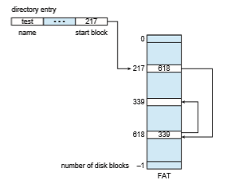
**Figure 14.6** File-allocation table.

### Indexed Allocation

Linked allocation solves the external-fragmentation and size-declaration prob- lems of contiguous allocation. However, in the absence of a FAT, linked alloca- tion cannot support efficient direct access, since the pointers to the blocks are scattered with the blocks themselves all over the disk and must be retrieved in order. **Indexed allocation** solves this problem by bringing all the pointers together into one location: the **index block**.

Each file has its own index block, which is an array of storage-block addresses. The _i_ th entry in the index block points to the _i_ th block of the file. The directory contains the address of the index block (Figure 14.7). To find and read the _i_ th block, we use the pointer in the _i_ th index-block entry. This scheme is similar to the paging scheme described in Section 9.3.

When the file is created, all pointers in the index block are set to null. When the _i_ th block is first written, a block is obtained from the free-space manager, and its address is put in the _i_ th index-block entry.

Indexed allocation supports direct access, without suffering from external fragmentation, because any free block on the storage device can satisfy a request for more space. Indexed allocation does suffer from wasted space, however. The pointer overhead of the index block is generally greater than the pointer overhead of linked allocation. Consider a common case in which we have a file of only one or two blocks. With linked allocation, we lose the space of only one pointer per block. With indexed allocation, an entire index block must be allocated, even if only one or two pointers will be non-null.

This point raises the question of how large the index block should be. Every file must have an index block, so we want the index block to be as small as  
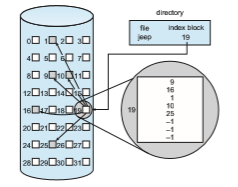
**Figure 14.7** Indexed allocation of disk space.

possible. If the index block is too small, however, it will not be able to hold enough pointers for a large file, and a mechanism will have to be available to deal with this issue. Mechanisms for this purpose include the following:

• **Linked scheme**. An index block is normally one storage block. Thus, it can be read and written directly by itself. To allow for large files, we can link together several index blocks. For example, an index blockmight contain a small header giving the name of the file and a set of the first 100 disk-block addresses. The next address (the last word in the index block) is null (for a small file) or is a pointer to another index block (for a large file).

• **Multilevel index**. Avariant of linked representationuses a first-level index block to point to a set of second-level index blocks, which in turn point to the file blocks. To access a block, the operating system uses the first-level index to find a second-level index block and then uses that block to find the desired data block. This approach could be continued to a third or fourth level, depending on the desiredmaximumfile size.With 4,096-byte blocks, we could store 1,024 four-byte pointers in an index block. Two levels of indexes allow 1,048,576 data blocks and a file size of up to 4 GB.

• **Combined scheme**. Another alternative, used in UNIX-based file systems, is to keep the first, say, 15 pointers of the index block in the file’s inode. The first 12 of these pointers point to **direct blocks**; that is, they contain addresses of blocks that contain data of the file. Thus, the data for small files (of no more than 12 blocks) do not need a separate index block. If the block size is 4 KB, then up to 48 KB of data can be accessed directly. The next three pointers point to **indirect blocks**. The first points to a **single indirect block**, which is an index block containing not data but the addresses of blocks that do contain data. The second points to a **double indirect block**, which contains the address of a block that contains the addresses of blocks that contain pointers to the actual data blocks. The last pointer contains the address of a **triple indirect block**. (A UNIX inode is shown in Figure 14.8.)  

**Figure 14.8** The UNIX inode.

Under this method, the number of blocks that can be allocated to a file exceeds the amount of space addressable by the 4-byte file pointers used by many operating systems. A 32-bit file pointer reaches only 232 bytes, or 4 GB. Many UNIX and Linux implementations now support 64-bit file pointers, which allows files and file systems to be several exbibytes in size. The ZFS file system supports 128-bit file pointers.

Indexed-allocation schemes suffer from some of the same performance problems as does linked allocation. Specifically, the index blocks can be cached in memory, but the data blocks may be spread all over a volume.

### Performance

The allocation methods that we have discussed vary in their storage efficiency and data-block access times. Both are important criteria in selecting the proper method or methods for an operating system to implement.

Before selecting an allocation method, we need to determine how the systems will be used. A system with mostly sequential access should not use the same method as a system with mostly random access.

For any type of access, contiguous allocation requires only one access to get a block. Since we can easily keep the initial address of the file in memory, we can calculate immediately the address of the _i_th block (or the next block) and read it directly.

For linked allocation, we can also keep the address of the next block in memory and read it directly. Thismethod is fine for sequential access; for direct access, however, an access to the _i_th block might require _i_ block reads. This problem indicates why linked allocation should not be used for an application requiring direct access.

As a result, some systems support direct-access files by using contiguous allocation and sequential-access files by using linked allocation. For these systems, the type of access to bemademust be declaredwhen the file is created. A file created for sequential access will be linked and cannot be used for direct access. A file created for direct access will be contiguous and can support both direct access and sequential access, but its maximum length must be declared when it is created. In this case, the operating system must have appropriate data structures and algorithms to support both allocationmethods. Files can be converted from one type to another by the creation of a new file of the desired type, into which the contents of the old file are copied. The old file may then be deleted and the new file renamed.

Indexed allocation is more complex. If the index block is already in mem- ory, then the access can be made directly. However, keeping the index block in memory requires considerable space. If this memory space is not avail- able, then we may have to read first the index block and then the desired data block. For a two-level index, two index-block reads might be necessary. For an extremely large file, accessing a block near the end of the file would require reading in all the index blocks before the needed data block finally could be read. Thus, the performance of indexed allocation depends on the index structure, on the size of the file, and on the position of the block desired.

Some systems combine contiguous allocation with indexed allocation by using contiguous allocation for small files (up to three or four blocks) and auto- matically switching to an indexed allocation if the file grows large. Since most files are small, and contiguous allocation is efficient for small files, average performance can be quite good.

Many other optimizations are in use. Given the disparity between CPU speed and disk speed, it is not unreasonable to add thousands of extra instruc- tions to the operating system to save just a few disk-head movements. Fur- thermore, this disparity is increasing over time, to the point where hundreds of thousands of instructions could reasonably be used to optimize head move- ments.

For NVM devices, there are no disk head seeks, so different algorithms and optimizations are needed. Using an old algorithm that spends many CPU cycles trying to avoid a nonexistent head movement would be very inefficient. Existing file systems are being modified and new ones being created to attain maximum performance from NVM storage devices. These developments aim to reduce the instruction count and overall path between the storage device and application access to the data.

## Free-Space Management

Since storage space is limited, we need to reuse the space from deleted files for new files, if possible. (Write-once optical disks allow only one write to any given sector, and thus reuse is not physically possible.) To keep track of free disk space, the system maintains a **free-space list**. The free-space list records all free device blocks—those not allocated to some file or directory. To create a file, we search the free-space list for the required amount of space and allocate that space to the new file. This space is then removed from the free-space list. When a file is deleted, its space is added to the free-space list. The free-space list, despite its name, is not necessarily implemented as a list, as we discuss next.

### Bit Vector

Frequently, the free-space list is implemented as a **bitmap** or **bit vector**. Each block is represented by 1 bit. If the block is free, the bit is 1; if the block is allocated, the bit is 0.

For example, consider a disk where blocks 2, 3, 4, 5, 8, 9, 10, 11, 12, 13, 17, 18, 25, 26, and 27 are free and the rest of the blocks are allocated. The free-space bitmap would be

001111001111110001100000011100000 ...

The main advantage of this approach is its relative simplicity and its effi- ciency in finding the first free block or _n_ consecutive free blocks on the disk. Indeed,many computers supply bit-manipulation instructions that can be used effectively for that purpose. One technique for finding the first free block on a system that uses a bit vector to allocate space is to sequentially check each word in the bitmap to see whether that value is not 0, since a 0-valued word contains only 0 bits and represents a set of allocated blocks. The first non-0 word is scanned for the first 1 bit, which is the location of the first free block. The calculation of the block number is

(number of bits per word) × (number of 0-value words) + offset of first 1 bit.

Again, we see hardware features driving software functionality. Unfortu- nately, bit vectors are inefficient unless the entire vector is kept inmainmemory (and is written to the device containing the file system occasionally for recov- ery needs). Keeping it in main memory is possible for smaller devices but not necessarily for larger ones. A 1.3-GB disk with 512-byte blocks would need a bitmap of over 332 KB to track its free blocks, although clustering the blocks in groups of four reduces this number to around 83 KB per disk. A 1-TB disk with 4-KB blocks would require 32 MB (240 / 212 = 228 bits = 225 bytes = 25 MB) to store its bitmap. Given that disk size constantly increases, the problemwith bit vectors will continue to escalate as well.

### Linked List

Another approach to free-space management is to link together all the free blocks, keeping a pointer to the first free block in a special location in the file system and caching it in memory. This first block contains a pointer to the next free block, and so on. Recall our earlier example (Section 14.5.1), in which blocks 2, 3, 4, 5, 8, 9, 10, 11, 12, 13, 17, 18, 25, 26, and 27 were free and the rest of the blocks were allocated. In this situation, we would keep a pointer to block 2 as the first free block. Block 2 would contain a pointer to block 3, which would point to block 4, which would point to block 5, which would point to block 8, and so on (Figure 14.9). This scheme is not efficient; to traverse the list, we must read each block, which requires substantial I/O time on HDDs. Fortunately, however, traversing the free list is not a frequent action. Usually,  

**Figure 14.9** Linked free-space list on disk.

the operating system simply needs a free block so that it can allocate that block to a file, so the first block in the free list is used. The FAT method incorporates free-block accounting into the allocation data structure. No separate method is needed.

### Grouping

A modification of the free-list approach stores the addresses of _n_ free blocks in the first free block. The first _n_ −1 of these blocks are actually free. The last block contains the addresses of another _n_ free blocks, and so on. The addresses of a large number of free blocks can now be found quickly, unlike the situation when the standard linked-list approach is used.

### Counting

Another approach takes advantage of the fact that, generally, several contigu- ous blocks may be allocated or freed simultaneously, particularly when space is allocated with the contiguous-allocation algorithm or through clustering. Thus, rather than keeping a list of _n_ free block addresses, we can keep the address of the first free block and the number (_n_) of free contiguous blocks that follow the first block. Each entry in the free-space list then consists of a device address and a count. Although each entry requires more space than would a simple disk address, the overall list is shorter, as long as the count is generally greater than 1. Note that this method of tracking free space is similar to the extent method of allocating blocks. These entries can be stored in a balanced tree, rather than a linked list, for efficient lookup, insertion, and deletion.  

### Space Maps

Oracle’s **ZFS** file system (found in Solaris and some other operating systems) was designed to encompass huge numbers of files, directories, and even file systems (in ZFS, we can create file-system hierarchies). On these scales, meta- data I/O can have a large performance impact. Consider, for example, that if the free-space list is implemented as a bitmap, bitmaps must be modified both when blocks are allocated and when they are freed. Freeing 1 GB of data on a 1-TB disk could cause thousands of blocks of bitmaps to be updated, because those data blocks could be scattered over the entire disk. Clearly, the data structures for such a system could be large and inefficient.

In its management of free space, ZFS uses a combination of techniques to control the size of data structures and minimize the I/O needed to manage those structures. First, ZFS creates **metaslabs** to divide the space on the device into chunks of manageable size. A given volume may contain hundreds of metaslabs. Each metaslab has an associated space map. ZFS uses the counting algorithm to store information about free blocks. Rather than write counting structures to disk, it uses log-structured file-system techniques to record them. The space map is a log of all block activity (allocating and freeing), in time order, in counting format. When ZFS decides to allocate or free space from a metaslab, it loads the associated space map into memory in a balanced-tree structure (for very efficient operation), indexed by offset, and replays the log into that structure. The in-memory space map is then an accurate representa- tion of the allocated and free space in themetaslab. ZFS also condenses themap as much as possible by combining contiguous free blocks into a single entry. Finally, the free-space list is updated on disk as part of the transaction-oriented operations of ZFS. During the collection and sorting phase, block requests can still occur, and ZFS satisfies these requests from the log. In essence, the log plus the balanced tree **_is_** the free list.

### TRIMing Unused Blocks

HDDs and other storage media that allow blocks to be overwritten for updates need only the free list for managing free space. Blocks do not need to be treated specially when freed. A freed block typically keeps its data (but without any file pointers to the block) until the data are overwritten when the block is next allocated.

Storage devices that do not allow overwrite, such as NVM flash-based storage devices, suffer badly when these same algorithms are applied. Recall from Section 11.1.2 that such devices must be erased before they can again be written to, and that those erases must be made in large chunks (blocks, composed of pages) and take a relatively long time compared with reads or writes.

A new mechanism is needed to allow the file system to inform the storage device that a page is free and can be considered for erasure (once the block con- taining the page is entirely free). That mechanism varies based on the storage controller. For ATA-attached drives, it is TRIM, while for NVMe-based storage, it is the unallocate command. Whatever the specific controller command, this mechanism keeps storage space available for writing. Without such a capabil- ity, the storage device gets full and needs garbage collection and block erasure, leading to decreases in storage I/Owrite performance (knownas “awrite cliff”).  

With the TRIM mechanism and similar capabilities, the garbage collection and erase steps can occur before the device is nearly full, allowing the device to provide more consistent performance.

## Efficiency and Performance

Now that we have discussed various block-allocation and directory- management options, we can further consider their effect on performance and efficient storage use. Disks tend to represent a major bottleneck in system performance, since they are the slowest main computer component. EvenNVM devices are slow compared with CPU and main memory, so their performance must be optimized as well. In this section, we discuss a variety of techniques used to improve the efficiency and performance of secondary storage.

### Efficiency

The efficient use of storage device space depends heavily on the allocation and directory algorithms in use. For instance, UNIX inodes are preallocated on a volume. Even an empty disk has a percentage of its space lost to inodes. However, by preallocating the inodes and spreading them across the volume, we improve the file system’s performance. This improved performance results from the UNIX allocation and free-space algorithms, which try to keep a file’s data blocks near that file’s inode block to reduce seek time.

As another example, let’s reconsider the clustering scheme discussed in Section 14.4, which improves file-seek and file-transfer performance at the cost of internal fragmentation. To reduce this fragmentation, BSD UNIX varies the cluster size as a file grows. Large clusters are used where they can be filled, and small clusters are used for small files and the last cluster of a file. This system is described in Appendix C.

The types of data normally kept in a file’s directory (or inode) entry also require consideration. Commonly, a “last write date” is recorded to supply information to the user and to determine whether the file needs to be backed up. Some systems also keep a “last access date,” so that a user can determine when the file was last read. The result of keeping this information is that, whenever the file is read, a field in the directory structure must be written to. That means the block must be read into memory, a section changed, and the block written back out to the device, because operations on secondary storage occur only in block (or cluster) chunks. So any time a file is opened for reading, its FCBmust be read andwritten aswell. This requirement can be inefficient for frequently accessed files, so we must weigh its benefit against its performance cost when designing a file system. Generally, every data item associated with a file needs to be considered for its effect on efficiency and performance.

Consider, for instance, how efficiency is affected by the size of the pointers used to access data. Most systems use either 32-bit or 64-bit pointers through- out the operating system.Using 32-bit pointers limits the size of a file to 232, or 4 GB. Using 64-bit pointers allows very large file sizes, but 64-bit pointers require more space to store. As a result, the allocation and free-space-management methods (linked lists, indexes, and so on) use more storage space.  

One of the difficulties in choosing a pointer size—or, indeed, any fixed allo- cation size within an operating system—is planning for the effects of changing technology. Consider that the IBM PC XT had a 10-MB hard drive and anMS-DOS FAT file system that could support only 32 MB. (Each FAT entry was 12 bits, pointing to an 8-KB cluster.) As disk capacities increased, larger disks had to be split into 32-MB partitions, because the file system could not track blocks beyond 32 MB. As hard disks with capacities of over 100 MB became common, the disk data structures and algorithms in MS-DOS had to be modified to allow larger file systems. (Each FAT entry was expanded to 16 bits and later to 32 bits.) The initial file-system decisions were made for efficiency reasons; how- ever, with the advent of MS-DOS Version 4, millions of computer users were inconveniencedwhen theyhad to switch to the new, larger file system. Solaris’s ZFS file system uses 128-bit pointers, which theoretically should never need to be extended. (Theminimummass of a device capable of storing 2128 bytes using atomic-level storage would be about 272 trillion kilograms.)

As another example, consider the evolution of the Solaris operating sys- tem. Originally, many data structures were of fixed length, allocated at system startup. These structures included the process table and the open-file table. When the process table became full, nomore processes could be created.When the file table became full, no more files could be opened. The systemwould fail to provide services to users. Table sizes could be increased only by recompiling the kernel and rebooting the system. With later releases of Solaris, (as with modernLinux kernels) almost all kernel structureswere allocated dynamically, eliminating these artificial limits on system performance. Of course, the algo- rithms that manipulate these tables are more complicated, and the operating system is a little slower because it must dynamically allocate and deallocate table entries; but that price is the usual one for more general functionality.

### Performance

Even after the basic file-system algorithms have been selected, we can still improve performance in several ways. Aswas discussed in Chapter 12, storage device controllers include local memory to form an on-board cache that is large enough to store entire tracks or blocks at a time. On an HDD, once a seek is performed, the track is read into the disk cache starting at the sector under the disk head (reducing latency time). The disk controller then transfers any sector requests to the operating system. Once blocks make it from the disk controller into main memory, the operating system may cache the blocks there.

Some systems maintain a separate section of main memory for a **buffer cache**, where blocks are kept under the assumption that they will be used again shortly. Other systems cache file data using a **page cache**. The page cache uses virtual memory techniques to cache file data as pages rather than as file-system-oriented blocks. Caching file data using virtual addresses is far more efficient than caching through physical disk blocks, as accesses interface with virtual memory rather than the file system. Several systems—including Solaris, Linux, and Windows—use page caching to cache both process pages and file data. This is known as **unifie virtual memory**.

Some versions of UNIX and Linux provide a **unifie buffer cache**. To illustrate the benefits of the unified buffer cache, consider the two alternatives  

**Figure 14.10** I/O without a unified buffer cache.

for opening and accessing a file. One approach is to use memory mapping (Section 13.5); the second is to use the standard system calls read() and write(). Without a unified buffer cache, we have a situation similar to Figure 14.10. Here, the read() and write() system calls go through the buffer cache. The memory-mapping call, however, requires using two caches—the page cache and the buffer cache. A memory mapping proceeds by reading in disk blocks from the file system and storing them in the buffer cache. Because the virtualmemory system does not interface with the buffer cache, the contents of the file in the buffer cache must be copied into the page cache. This situation, known as **double caching**, requires caching file-system data twice. Not only does this waste memory but it also wastes significant CPU and I/O cycles due to the extra datamovementwithin systemmemory. In addition, inconsistencies between the two caches can result in corrupt files. In contrast, when a unified buffer cache is provided, both memory mapping and the read() and write() system calls use the same page cache. This has the benefit of avoiding double caching, and it allows the virtual memory system to manage file-system data. The unified buffer cache is shown in Figure 14.11.

Regardless of whether we are caching storage blocks or pages (or both), least recently used (LRU) (Section 10.4.4) seems a reasonable general-purpose algorithm for block or page replacement. However, the evolution of the Solaris page-caching algorithms reveals the difficulty in choosing an algorithm. Solaris allows processes and the page cache to share unused memory. Versions earlier than Solaris 2.5.1 made no distinction between allocating pages to a process and allocating them to the page cache. As a result, a system performing many I/O operations used most of the available memory for caching pages. Because of the high rates of I/O, the page scanner (Section 10.10.3) reclaimed pages from processes—rather than from the page cache—when free memory ran low. Solaris 2.6 and Solaris 7 optionally implemented priority paging, in which the page scanner gave priority to process pages over the page cache. Solaris 8 applied a fixed limit to process pages and the file-system page cache, prevent-  
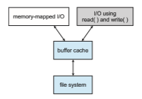
**Figure 14.11** I/O using a unified buffer cache.

ing either from forcing the other out of memory. Solaris 9 and 10 again changed the algorithms to maximize memory use and minimize thrashing.

Another issue that can affect the performance of I/O is whether writes to the file system occur synchronously or asynchronously. **Synchronous writes** occur in the order in which the storage subsystem receives them, and the writes are not buffered. Thus, the calling routine must wait for the data to reach the drive before it can proceed. In an **asynchronous write**, the data are stored in the cache, and control returns to the caller. Most writes are asynchronous. However, metadata writes, among others, can be synchronous. Operating systems frequently include a flag in the open system call to allow a process to request that writes be performed synchronously. For example, databases use this feature for atomic transactions, to assure that data reach stable storage in the required order.

Some systems optimize their page cache by using different replacement algorithms, depending on the access type of the file. Afile being read or written sequentially should not have its pages replaced in LRU order, because the most recently used page will be used last, or perhaps never again. Instead, sequential access can be optimized by techniques known as free-behind and read-ahead. **Free-behind** removes a page from the buffer as soon as the next page is requested. The previous pages are not likely to be used again and waste buffer space. With **read-ahead**, a requested page and several subsequent pages are read and cached. These pages are likely to be requested after the current page is processed. Retrieving these data from the disk in one transfer and caching them saves a considerable amount of time. One might think that a track cache on the controller would eliminate the need for read-ahead on a multiprogrammed system.However, because of the high latency and overhead involved inmakingmany small transfers from the track cache tomainmemory, performing a read-ahead remains beneficial.

The page cache, the file system, and the device drivers have some interest- ing interactions. When small amounts of data are written to a file, the pages are buffered in the cache, and the storage device driver sorts its output queue according to device address. These two actions allow a disk driver to minimize disk-head seeks. Unless synchronous writes are required, a process writing to disk simply writes into the cache, and the system asynchronously writes the  
data to disk when convenient. The user process sees very fast writes. When data are read from a disk file, the block I/O system does some read-ahead; however, writes are much more nearly asynchronous than are reads. Thus, output to the disk through the file system is often faster than is input for small transfers, counter to intuition. No matter how much buffering and caching is available, large, continuous I/O can overrun the capacity and end up bottle- necked on the device’s performance. Consider writing a large movie file to a HDD. If the file is larger than the page cache (or the part of the page cache available to the process) then the page cache will fill and all I/O will occur at drive speed. Current HDDs read faster than they write, so in this instance the performance aspects are reversed from smaller I/O performance.

## Recovery

Files and directories are kept both inmainmemory and on the storage volume, and care must be taken to ensure that a system failure does not result in loss of data or in data inconsistency. A system crash can cause inconsistencies among on-storage file-system data structures, such as directory structures, free-block pointers, and free FCB pointers. Many file systems apply changes to these structures in place. A typical operation, such as creating a file, can involve many structural changeswithin the file systemon the disk.Directory structures are modified, FCBs are allocated, data blocks are allocated, and the free counts for all of these blocks are decreased. These changes can be interrupted by a crash, and inconsistencies among the structures can result. For example, the free FCB count might indicate that an FCB had been allocated, but the directory structuremight not point to the FCB. Compounding this problem is the caching that operating systems do to optimize I/O performance. Some changes may go directly to storage, while others may be cached. If the cached changes do not reach the storage device before a crash occurs, more corruption is possible.

In addition to crashes, bugs in file-system implementation, device con- trollers, and even user applications can corrupt a file system. File systems have varying methods to deal with corruption, depending on the file-system data structures and algorithms. We deal with these issues next.

### Consistency Checking

Whatever the cause of corruption, a file system must first detect the problems and then correct them. For detection, a scan of all the metadata on each file system can confirm or deny the consistency of the system. Unfortunately, this scan can take minutes or hours and should occur every time the system boots. Alternatively, a file system can record its state within the file-systemmetadata. At the start of any metadata change, a status bit is set to indicate that the metadata is in flux. If all updates to the metadata complete successfully, the file system can clear that bit. If, however, the status bit remains set, a consistency checker is run.

The **consistency checker**—a systems program such as fsck in UNIX— compares the data in the directory structure and other metadata with the state on storage and tries to fix any inconsistencies it finds. The allocation and free-space-management algorithms dictate what types of problems the  

checker can find and how successful it will be in fixing them. For instance, if linked allocation is used and there is a link from any block to its next block, then the entire file can be reconstructed from the data blocks, and the directory structure can be recreated. In contrast, the loss of a directory entry on an indexed allocation system can be disastrous, because the data blocks have no knowledge of one another. For this reason, some UNIX file systems cache directory entries for reads, but any write that results in space allocation, or other metadata changes, is done synchronously, before the corresponding data blocks are written. Of course, problems can still occur if a synchronous write is interrupted by a crash. Some NVM storage devices contain a battery or supercapacitor to provide enough power, even during a power loss, to write data from device buffers to the storage media so the data are not lost. But even those precautions do not protect against corruption due to a crash.

### Log-Structured File Systems

Computer scientists often find that algorithms and technologies originally used in one area are equally useful in other areas. Such is the case with the database log-based recovery algorithms. These logging algorithms have been applied successfully to the problem of consistency checking. The resulting implementations are known as **log-based transaction-oriented** (or **journaling**) file systems.

Note that with the consistency-checking approach discussed in the pre- ceding section, we essentially allow structures to break and repair them on recovery. However, there are several problems with this approach. One is that the inconsistency may be irreparable. The consistency check may not be able to recover the structures, resulting in loss of files and even entire directories. Consistency checking can require human intervention to resolve conflicts, and that is inconvenient if no human is available. The system can remain unavail- able until the human tells it how to proceed. Consistency checking also takes system and clock time. To check terabytes of data, hours of clock time may be required.

The solution to this problem is to apply log-based recovery techniques to file-system metadata updates. Both NTFS and the Veritas file system use this method, and it is included in recent versions of UFS on Solaris. In fact, it is now common on many file systems including ext3, ext4, and ZFS.

Fundamentally, all metadata changes are written sequentially to a log. Each set of operations for performing a specific task is a **transaction**. Once the changes are written to this log, they are considered to be committed, and the system call can return to the user process, allowing it to continue execution. Meanwhile, these log entries are replayed across the actual file- system structures. As the changes are made, a pointer is updated to indicate which actions have completed and which are still incomplete. When an entire committed transaction is completed, and entry is made in the log indicating that. The log file is is actually a circular buffer. A **circular buffer** writes to the end of its space and then continues at the beginning, overwriting older values as it goes. We would not want the buffer to write over data that had not yet been saved, so that scenario is avoided. The log may be in a separate section of the file system or even on a separate storage device.  

If the system crashes, the log file will contain zero or more transactions. Any transactions it containswere not completed to the file system, even though theywere committed by the operating system, so theymust now be completed. The transactions can be executed from the pointer until the work is complete so that the file-system structures remain consistent. The only problem occurs when a transactionwas aborted—that is, was not committed before the system crashed. Any changes from such a transaction that were applied to the file system must be undone, again preserving the consistency of the file system. This recovery is all that is needed after a crash, eliminating any problems with consistency checking.

A side benefit of using logging on disk metadata updates is that those updates proceed much faster than when they are applied directly to the on- disk data structures. The reason is found in the performance advantage of sequential I/O over random I/O. The costly synchronous random metadata writes are turned into much less costly synchronous sequential writes to the log-structured file system’s logging area. Those changes, in turn, are replayed asynchronously via random writes to the appropriate structures. The overall result is a significant gain in performance of metadata-oriented operations, such as file creation and deletion, on HDD storage.

### Other Solutions

Another alternative to consistency checking is employed by Network Appli- ance’s WAFL file system and the Solaris ZFS file system. These systems never overwrite blocks with new data. Rather, a transaction writes all data andmeta- data changes to new blocks. When the transaction is complete, the metadata structures that pointed to the old versions of these blocks are updated to point to the new blocks. The file system can then remove the old pointers and the old blocks and make them available for reuse. If the old pointers and blocks are kept, a **snapshot** is created; the snapshot is a view of the file system at a specific point in time (before any updates after that time were applied). This solution should require no consistency checking if the pointer update is done atomically. WAFL does have a consistency checker, however, so some failure scenarios can still cause metadata corruption. (See Section 14.8 for details of the WAFL file system.)

ZFS takes an evenmore innovative approach to disk consistency. LikeWAFL, it never overwrites blocks. However, ZFS goes further and provides checksum- ming of all metadata and data blocks. This solution (when combined with RAID) assures that data are always correct. ZFS therefore has no consistency checker. (More details on ZFS are found in Section 11.8.6.)

### Backup and Restore

Storage devices sometimes fail, and care must be taken to ensure that the data lost in such a failure are not lost forever. To this end, system programs can be used to **back up** data from one storage device to another, such as a magnetic tape or other secondary storage device. Recovery from the loss of an individual file, or of an entire device, may then be a matter of **restoring** the data from backup.

To minimize the copying needed, we can use information from each file’s directory entry. For instance, if the backup program knows when the last backup of a filewas done, and the file’s last write date in the directory indicates that the file has not changed since that date, then the file does not need to be copied again. A typical backup schedule may then be as follows:

• **Day 1**. Copy to a backupmediumall files from the file system. This is called a **full backup**.

• **Day 2**. Copy to another medium all files changed since day 1. This is an **incremental backup**.

• **Day 3**. Copy to another medium all files changed since day 2.

**. . .**

• **Day** _N_. Copy to another medium all files changed since day_N_− 1. Then go back to day 1.

The new cycle can have its backup written over the previous set or onto a new set of backup media.

Using this method, we can restore an entire file system by starting restores with the full backup and continuing through each of the incremental backups. Of course, the larger the value of_N,_ the greater the number of media that must be read for a complete restore. An added advantage of this backup cycle is that we can restore any file accidentally deleted during the cycle by retrieving the deleted file from the backup of the previous day.

The length of the cycle is a compromise between the amount of backup needed and the number of days covered by a restore. To decrease the number of tapes that must be read to do a restore, an option is to perform a full backup and then each day back up all files that have changed since the full backup. In this way, a restore can be done via the most recent incremental backup and the full backup, with no other incremental backups needed. The trade-off is that more files will be modified each day, so each successive incremental backup involves more files and more backup media.

A user may notice that a particular file is missing or corrupted long after the damage was done. For this reason, we usually plan to take a full backup from time to time that will be saved “forever.” It is a good idea to store these permanent backups far away from the regular backups to protect against hazard, such as a fire that destroys the computer and all the backups too. In the TV show “Mr. Robot,” hackers not only attacked the primary sources of banks’ data but also their backup sites. Having multiple backup sites might not be a bad idea if your data are important.

## Example: The WAFL File System

Because secondary-storage I/O has such a huge impact on systemperformance, file-system design and implementation command quite a lot of attention from system designers. Some file systems are general purpose, in that they can provide reasonable performance and functionality for a wide variety of file sizes, file types, and I/O loads. Others are optimized for specific tasks in an attempt to provide better performance in those areas than general-purpose  

file systems. The **write-anywhere file layout** (**WAFL**) from NetApp, Inc. is an example of this sort of optimization. WAFL is a powerful, elegant file system optimized for random writes.

WAFL is used exclusively on network file servers produced by NetApp and is meant for use as a distributed file system. It can provide files to clients via the NFS, CIFS, iSCSI, ftp, and http protocols, although it was designed just for NFS and CIFS. When many clients use these protocols to talk to a file server, the server may see a very large demand for random reads and an even larger demand for random writes. The NFS and CIFS protocols cache data from read operations, so writes are of the greatest concern to file-server creators.

WAFL is used on file servers that include an NVRAM cache for writes. The WAFL designers took advantage of running on a specific architecture to optimize the file system for random I/O, with a stable-storage cache in front. Ease of use is one of the guiding principles of WAFL. Its creators also designed it to include a new snapshot functionality that creates multiple read-only copies of the file system at different points in time, as we shall see.

The file system is similar to the Berkeley Fast File System, with many modifications. It is block-based and uses inodes to describe files. Each inode contains 16 pointers to blocks (or indirect blocks) belonging to the file described by the inode. Each file system has a root inode. All of themetadata lives in files. All inodes are in one file, the free-block map in another, and the free-inode map in a third, as shown in Figure 14.12. Because these are standard files, the data blocks are not limited in location and can be placed anywhere. If a file system is expanded by addition of disks, the lengths of the metadata files are automatically expanded by the file system.

Thus, a WAFL file system is a tree of blocks with the root inode as its base. To take a snapshot, WAFL creates a copy of the root inode. Any file or metadata updates after that go to new blocks rather than overwriting their existing blocks. The new root inode points to metadata and data changed as a result of these writes. Meanwhile, the snapshot (the old root inode) still points to the old blocks, which have not been updated. It therefore provides access to the file system just as it was at the instant the snapshot was made—and takes very little storage space to do so. In essence, the extra space occupied by a snapshot consists of just the blocks that have been modified since the snapshot was taken.
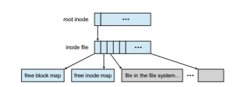
**Figure 14.12** The WAFL file layout.  

An important change frommore standard file systems is that the free-block map has more than one bit per block. It is a bitmap with a bit set for each snapshot that is using the block. When all snapshots that have been using the block are deleted, the bitmap for that block is all zeros, and the block is free to be reused. Used blocks are never overwritten, so writes are very fast, because a write can occur at the free block nearest the current head location. There are many other performance optimizations in WAFL as well.

Many snapshots can exist simultaneously, so one can be taken each hour of the day and each day of the month, for example. A user with access to these snapshots can access files as they were at any of the times the snapshots were taken. The snapshot facility is also useful for backups, testing, versioning, and so on. WAFL’s snapshot facility is very efficient in that it does not even require that copy-on-write copies of each data block be taken before the block is modified. Other file systems provide snapshots, but frequently with less efficiency. WAFL snapshots are depicted in Figure 14.13.

Newer versions of WAFL actually allow read–write snapshots, known as **clones**. Clones are also efficient, using the same techniques as shapshots. In this case, a read-only snapshot captures the state of the file system, and a clone refers back to that read-only snapshot. Any writes to the clone are stored in new blocks, and the clone’s pointers are updated to refer to the new blocks. The original snapshot is unmodified, still giving a view into the file system as
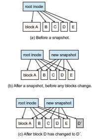
**Figure 14.13** Snapshots in WAFL.  

**_THE APPLE FILE SYSTEM_**

In 2017, Apple, Inc., released a new file system to replace its 30-year-old HFS+ file system. HFS+ had been stretched to add many new features, but as usual, this process added complexity, along with lines of code, and made adding more features more difficult. Starting from scratch on a blank page allows a design to start with current technologies and methodologies and provide the exact set of features needed.

**Apple File System** (**APFS**) is a good example of such a design. Its goal is to run on all current Apple devices, from the Apple Watch through the iPhone to the Mac computers. Creating a file system that works in watchOS, I/Os, tvOS, andmacOS is certainly a challenge. APFS is feature-rich, including 64-bit pointers, clones for files and directories, snapshots, space sharing, fast directory sizing, atomic safe-save primitives, copy-on-write design, encryp- tion (single- and multi-key), and I/O coalescing. It understands NVM as well as HDD storage.

Most of these features we’ve discussed, but there are a few new concepts worth exploring. **Space sharing** is a ZFS-like feature in which storage is avail- able as one or more large free spaces (**containers**) from which file systems can draw allocations (allowing APFS-formatted volumes to grow and shrink). **Fast directory sizing** provides quick used-space calculation and updating. **Atomic safe-save** is a primitive (available via API, not via file-system com- mands) that performs renames of files, bundles of files, and directories as single atomic operations. I/O coalescing is an optimization for NVM devices in which several small writes are gathered together into a large write to optimize write performance.

Apple chose not to implement RAID as part of the new APFS, instead depending on the existingApple RAID volumemechanism for software RAID. APFS is also compatible with HFS+, allowing easy conversion for existing deployments.

it was before the clone was updated. Clones can also be promoted to replace the original file system; this involves throwing out all of the old pointers and any associated old blocks. Clones are useful for testing and upgrades, as the original version is left untouched and the clone deleted when the test is done or if the upgrade fails.

Another feature that naturally results from theWAFLfile system implemen- tation is **replication,** the duplication and synchronization of a set of data over a network to another system. First, a snapshot of aWAFLfile system is duplicated to another system. When another snapshot is taken on the source system, it is relatively easy to update the remote system just by sending over all blocks contained in the new snapshot. These blocks are the ones that have changed between the times the two snapshotswere taken. The remote systemadds these blocks to the file system and updates its pointers, and the new system then is a duplicate of the source system as of the time of the second snapshot. Repeating this processmaintains the remote systemas a nearly up-to-date copy of the first system. Such replication is used for disaster recovery. Should the first system be destroyed, most of its data are available for use on the remote system.  

Finally, note that the ZFS file system supports similarly efficient snapshots, clones, and replication, and those features are becoming more common in various file systems as time goes by.

## Summary

• Most file systems reside on secondary storage, which is designed to hold a large amount of data permanently. The most common secondary-storage medium is the disk, but the use of NVM devices is increasing.

• Storage devices are segmented into partitions to control media use and to allowmultiple, possibly varying, file systems on a single device. These file systems are mounted onto a logical file system architecture to make them available for use.

• File systems are often implemented in a layered or modular structure. The lower levels deal with the physical properties of storage devices and communicatingwith them.Upper levels dealwith symbolic file names and logical properties of files.

• The various files within a file system can be allocated space on the storage device in three ways: through contiguous, linked, or indexed allocation. Contiguous allocation can suffer from external fragmentation. Direct access is very inefficient with linked allocation. Indexed allocation may require substantial overhead for its index block. These algorithms can be optimized in many ways. Contiguous space can be enlarged through extents to increase flexibility and to decrease external fragmentation. Indexed allocation can be done in clusters of multiple blocks to increase throughput and to reduce the number of index entries needed. Indexing in large clusters is similar to contiguous allocation with extents.

• Free-space allocation methods also influence the efficiency of disk-space use, the performance of the file system, and the reliability of secondary storage. The methods used include bit vectors and linked lists. Optimiza- tions include grouping, counting, and the FAT, which places the linked list in one contiguous area.

• Directory-management routines must consider efficiency, performance, and reliability. A hash table is a commonly used method, as it is fast and efficient. Unfortunately, damage to the table or a system crash can result in inconsistency between the directory information and the disk’s contents.

• A consistency checker can be used to repair damaged file-system struc- tures. Operating-system backup tools allow data to be copied to magnetic tape or other storage devices, enabling the user to recover from data loss or even entire device loss due to hardware failure, operating system bug, or user error.

• Due to the fundamental role that file systems play in system operation, their performance and reliability are crucial. Techniques such as log struc- tures and caching help improve performance, while log structures and RAID improve reliability. The WAFL file system is an example of optimiza- tion of performance to match a specific I/O load.  

**Practice Exercises**

**14.1** Consider a file currently consisting of 100 blocks. Assume that the file-control block (and the index block, in the case of indexed alloca- tion) is already in memory. Calculate how many disk I/O operations are required for contiguous, linked, and indexed (single-level) alloca- tion strategies, if, for one block, the following conditions hold. In the contiguous-allocation case, assume that there is no room to grow at the beginning but there is room to grow at the end. Also assume that the block information to be added is stored in memory.

a. The block is added at the beginning.

b. The block is added in the middle.

c. The block is added at the end.

d. The block is removed from the beginning.

e. The block is removed from the middle.

f. The block is removed from the end.

**14.2** Whymust the bit map for file allocation be kept onmass storage, rather than in main memory?

**14.3** Consider a system that supports the strategies of contiguous, linked, and indexed allocation.What criteria should be used in decidingwhich strategy is best utilized for a particular file?

**14.4** One problem with contiguous allocation is that the user must preallo- cate enough space for each file. If the file grows to be larger than the space allocated for it, special actions must be taken. One solution to this problem is to define a file structure consisting of an initial con- tiguous area of a specified size. If this area is filled, the operating sys- tem automatically defines an overflow area that is linked to the initial contiguous area. If the overflow area is filled, another overflow area is allocated. Compare this implementation of a file with the standard contiguous and linked implementations.

**14.5** How do caches help improve performance? Why do systems not use more or larger caches if they are so useful?

**14.6** Why is it advantageous to the user for an operating system to dynami- cally allocate its internal tables?What are the penalties to the operating system for doing so?

**Further Reading**

The internals of the BSD UNIX system are covered in full in \[McKusick et al. (2015)\]. Details concerning file systems for Linux can be found in \[Love (2010)\]. The Google file system is described in \[Ghemawat et al. (2003)\]. FUSE can be found at http://fuse.sourceforge.net.  

Log-structured file organizations for enhancing both performance and con- sistency are discussed in \[Rosenblum and Ousterhout (1991)\], \[Seltzer et al. (1993)\], and \[Seltzer et al. (1995)\]. Log-structured designs for networked file systems are proposed in \[Hartman andOusterhout (1995)\] and \[Thekkath et al. (1997)\].

The ZFS source code for spacemaps can be found at http://src.opensolaris.o rg/source/xref/onnv/onnv-gate/usr/src/uts/common/ fs/zfs/space map.c.

ZFS documentation can be found at http://www.opensolaris.org/os/commu nity/ZFS/docs.

The NTFS file system is explained in \[Solomon (1998)\], the Ext3 file system used in Linux is described in \[Mauerer (2008)\], and the WAFL file system is covered in \[Hitz et al. (1995)\].

**Bibliography**

**\[Ghemawat et al. (2003)\]** S. Ghemawat, H. Gobioff, and S.-T. Leung, “The Google File System”, _Proceedings of the ACM Symposium on Operating Systems Principles_ (2003).

**\[Hartman and Ousterhout (1995)\]** J. H. Hartman and J. K. Ousterhout, “The Zebra Striped Network File System”, _ACM Transactions on Computer Systems_, Volume 13, Number 3 (1995), pages 274–310.

**\[Hitz et al. (1995)\]** D. Hitz, J. Lau, and M. Malcolm, “File System Design for an NFS File Server Appliance”, Technical report, NetApp (1995).

**\[Love (2010)\]** R. Love, _Linux Kernel Development,_ Third Edition, Developer’s Library (2010).

**\[Mauerer (2008)\]** W. Mauerer, _Professional Linux Kernel Architecture_, John Wiley and Sons (2008).

**\[McKusick et al. (2015)\]** M. K. McKusick, G. V. Neville-Neil, and R. N. M. Wat- son,_The Design and Implementation of the FreeBSDUNIXOperating System–Second Edition_, Pearson (2015).

**\[Rosenblum and Ousterhout (1991)\]** M. Rosenblum and J. K. Ousterhout, “The Design and Implementation of a Log-Structured File System”, _Proceedings of the ACM Symposium on Operating Systems Principles_ (1991), pages 1–15.

**\[Seltzer et al. (1993)\]** M. I. Seltzer, K. Bostic, M. K. McKusick, and C. Staelin, “An Implementation of a Log-Structured File System forUNIX”,_USENIXWinter_ (1993), pages 307–326.

**\[Seltzer et al. (1995)\]** M. I. Seltzer, K. A. Smith, H. Balakrishnan, J. Chang, S. McMains, and V. N. Padmanabhan, “File System Logging Versus Clustering: A Performance Comparison”, _USENIX Winter_ (1995), pages 249–264.

**\[Solomon (1998)\]** D. A. Solomon, _Inside Windows NT,_ Second Edition, Microsoft Press (1998).  

**\[Thekkath et al. (1997)\]** C. A. Thekkath, T. Mann, and E. K. Lee, “Frangipani: A Scalable Distributed File System”, _Symposium on Operating Systems Principles_ (1997), pages 224–237.  

**Chapter 14 Exercises**

**14.7** Consider a file system that uses a modified contiguous-allocation scheme with support for extents. A file is a collection of extents, with each extent corresponding to a contiguous set of blocks. A key issue in such systems is the degree of variability in the size of the extents. What are the advantages and disadvantages of the following schemes?

a. All extents are of the same size, and the size is predetermined.

b. Extents can be of any size and are allocated dynamically.

c. Extents can be of a few fixed sizes, and these sizes are predeter- mined.

**14.8** Contrast the performance of the three techniques for allocating disk blocks (contiguous, linked, and indexed) for both sequential and ran- dom file access.

**14.9** What are the advantages of the variant of linked allocation that uses a FAT to chain together the blocks of a file?

**14.10** Consider a system where free space is kept in a free-space list.

a. Suppose that the pointer to the free-space list is lost. Can the system reconstruct the free-space list? Explain your answer.

b. Consider a file system similar to the one used by UNIX with indexed allocation. How many disk I/O operations might be required to read the contents of a small local file at /a/b/c? Assume that none of the disk blocks is currently being cached.

c. Suggest a scheme to ensure that the pointer is never lost as a result of memory failure.

**14.11** Some file systems allow disk storage to be allocated at different levels of granularity. For instance, a file system could allocate 4 KB of disk space as a single 4-KB block or as eight 512-byte blocks. How could we take advantage of this flexibility to improve performance? What modifications would have to be made to the free-space management scheme in order to support this feature?

**14.12** Discuss how performance optimizations for file systemsmight result in difficulties in maintaining the consistency of the systems in the event of computer crashes.

**14.13** Discuss the advantages and disadvantages of supporting links to files that cross mount points (that is, the file link refers to a file that is stored in a different volume).

**14.14** Consider a file system on a disk that has both logical and physical block sizes of 512 bytes. Assume that the information about each file is already in memory. For each of the three allocation strategies (con- tiguous, linked, and indexed), answer these questions:

**EX-49**  

**Exercises**

a. How is the logical-to-physical address mapping accomplished in this system? (For the indexed allocation, assume that a file is always less than 512 blocks long.)

b. If we are currently at logical block 10 (the last block accessed was block 10) and want to access logical block 4, how many physical blocks must be read from the disk?

**14.15** Consider a file system that uses inodes to represent files. Disk blocks are 8 KB in size, and a pointer to a disk block requires 4 bytes. This file system has 12 direct disk blocks, as well as single, double, and triple indirect disk blocks. What is the maximum size of a file that can be stored in this file system?

**14.16** Fragmentation on a storage device can be eliminated through com- paction. Typical disk devices do not have relocation or base registers (such as those used when memory is to be compacted), so how can we relocate files? Give three reasons why compacting and relocating files are often avoided.

**14.17** Explain why logging metadata updates ensures recovery of a file sys- tem after a file-system crash.

**14.18** Consider the following backup scheme:

• **Day 1**. Copy to a backup medium all files from the disk.

• **Day 2**. Copy to another medium all files changed since day 1.

• **Day 3**. Copy to another medium all files changed since day 1.

This differs from the schedule given in Section 14.7.4 by having all subsequent backups copy all files modified since the first full backup. What are the benefits of this system over the one in Section 14.7.4? What are the drawbacks? Are restore operations made easier or more difficult? Explain your answer.

**14.19** Discuss the advantages and disadvantages of associating with remote file systems (stored on file servers) a set of failure semantics different from those associated with local file systems.

**14.20** What are the implications of supporting UNIX consistency semantics for shared access to files stored on remote file systems?

**EX-50**  

# File -System Internals

As we saw in Chapter 13, the file system provides the mechanism for on-line storage and access to file contents, including data and programs. This chapter is primarily concernedwith the internal structures and operations of file systems. We explore in detail ways to structure file use, to allocate storage space, to recover freed space, to track the locations of data, and to interface other parts of the operating system to secondary storage.

**CHAPTER OBJECTIVES**

• Delve into the details of file systems and their implementation.

• Explore booting and file sharing.

• Describe remote file systems, using NFS as an example.

## File Systems

Certainly, no general-purpose computer stores just one file. There are typically thousands, millions, even billions of files within a computer. Files are stored on random-access storage devices, including hard disk drives, optical disks, and nonvolatile memory devices.

As you have seen in the preceding chapters, a general-purpose computer system can have multiple storage devices, and those devices can be sliced up into partitions, which hold volumes, which in turn hold file systems. Depend- ing on the volume manager, a volume may span multiple partitions as well. Figure 15.1 shows a typical file-system organization.

Computer systems may also have varying numbers of file systems, and the file systems may be of varying types. For example, a typical Solaris system may have dozens of file systems of a dozen different types, as shown in the file-system list in Figure 15.2.

In this book, we consider only general-purpose file systems. It is worth noting, though, that there are many special-purpose file systems. Consider the types of file systems in the Solaris example mentioned above:

**Figure 15.1** A typical storage device organization.

• **tmpfs**—a “temporary” file system that is created in volatile main memory and has its contents erased if the system reboots or crashes

• **objfs**—a “virtual” file system (essentially an interface to the kernel that looks like a file system) that gives debuggers access to kernel symbols

• **ctfs**—a virtual file system that maintains “contract” information to man- age which processes start when the system boots andmust continue to run during operation

• **lofs**—a “loop back” file system that allows one file system to be accessed in place of another one

• **procfs**—a virtual file system that presents information on all processes as a file system

• **ufs, zfs**—general-purpose file systems

The file systems of computers, then, can be extensive. Even within a file system, it is useful to segregate files into groups and manage and act on those groups. This organization involves the use of directories (see Section 14.3).

## File-System Mounting

Just as a file must be opened before it can be used, a file system must be mounted before it can be available to processes on the system.More specifically, the directory structure may be built out of multiple file-system-containing volumes, which must be mounted to make them available within the file- system name space.

Themount procedure is straightforward. The operating system is given the name of the device and the **mount point**—the location within the file structure where the file system is to be attached. Some operating systems require that a file-system type be provided, while others inspect the structures of the device  

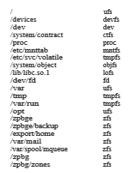
**Figure 15.2** Solaris file systems.

and determine the type of file system. Typically, a mount point is an empty directory. For instance, on aUNIX system, a file system containing a user’s home directories might be mounted as /home; then, to access the directory structure within that file system, we could precede the directory names with /home, as in /home/jane. Mounting that file system under /users would result in the path name /users/jane, which we could use to reach the same directory.

Next, the operating system verifies that the device contains a valid file system. It does so by asking the device driver to read the device directory and verifying that the directory has the expected format. Finally, the operating system notes in its directory structure that a file system is mounted at the specified mount point. This scheme enables the operating system to traverse its directory structure, switching among file systems, and even file systems of varying types, as appropriate.

To illustrate file mounting, consider the file system depicted in Figure 15.3, where the triangles represent subtrees of directories that are of interest. Figure 15.3(a) shows an existing file system,while Figure 15.3(b) shows anunmounted volume residing on /device/dsk. At this point, only the files on the existing file system can be accessed. Figure 15.4 shows the effects of mounting the volume residing on /device/dsk over /users. If the volume is unmounted, the file system is restored to the situation depicted in Figure 15.3.

Systems impose semantics to clarify functionality. For example, a system may disallow a mount over a directory that contains files; or it may make the  

**Figure 15.3** File system. 
mounted file system available at that directory and obscure the directory’s existing files until the file system is unmounted, terminating the use of the file system and allowing access to the original files in that directory. As another example, a system may allow the same file system to be mounted repeatedly, at different mount points; or it may only allow one mount per file system.

Consider the actions of the macOS operating system.Whenever the system encounters a disk for the first time (either at boot time or while the system is running), the macOS operating system searches for a file system on the device. If it finds one, it automatically mounts the file system under the /Volumes directory, adding a folder icon labeled with the name of the file system (as stored in the device directory). The user is then able to click on the icon and thus display the newly mounted file system.

The Microsoft Windows family of operating systems maintains an extended two-level directory structure, with devices and volumes assigned drive letters. Each volume has a general graph directory structure associated

**Figure 15.4** Volume mounted at /users.  

with its drive letter. The path to a specific file takes the form drive- letter:∖path∖to∖file. The more recent versions of Windows allow a file system to be mounted anywhere in the directory tree, just as UNIX does. Windows operating systems automatically discover all devices and mount all located file systems at boot time. In some systems, like UNIX, the mount commands are explicit. A system configuration file contains a list of devices and mount points for automatic mounting at boot time, but other mounts may be executed manually.

Issues concerning file system mounting are further discussed in Section 15.3 and in Section C.7.5.

## Partitions and Mounting

The layout of a disk can have many variations, depending on the operating system and volume management software. A disk can be sliced into multiple partitions, or a volume can span multiple partitions on multiple disks. The former layout is discussed here, while the latter, which is more appropriately considered a form of RAID, is covered in Section 11.8.

Each partition can be either “raw,” containing no file system, or “cooked,” containing a file system. **Raw disk** is used where no file system is appropriate. UNIX swap space can use a raw partition, for example, since it uses its own format on disk and does not use a file system. Likewise, some databases use raw disk and format the data to suit their needs. Raw disk can also hold infor- mation needed by disk RAID systems, such as bitmaps indicating which blocks are mirrored and which have changed and need to be mirrored. Similarly, raw disk can contain aminiature database holding RAID configuration information, such as which disks are members of each RAID set. Raw disk use is discussed in Section 11.5.1.

If a partition contains a file system that is bootable—that has a properly installed and configured operating system—then the partition also needs boot information, as described in Section 11.5.2. This information has its own format, because at boot time the system does not have the file-system code loaded and therefore cannot interpret the file-system format. Rather, boot information is usually a sequential series of blocks loaded as an image intomemory. Execution of the image starts at a predefined location, such as the first byte. This image, the **bootstrap loader**, in turn knows enough about the file-system structure to be able to find and load the kernel and start it executing.

The boot loader can contain more than the instructions for booting a spe- cific operating system. For instance, many systems can be **dual-booted**, allow- ing us to install multiple operating systems on a single system. How does the system know which one to boot? A boot loader that understands multi- ple file systems and multiple operating systems can occupy the boot space. Once loaded, it can boot one of the operating systems available on the drive. The drive can have multiple partitions, each containing a different type of file system and a different operating system. Note that if the boot loader does not understand a particular file-system format, an operating system stored on that file system is not bootable. This is one of the reasons only some file systems are supported as root file systems for any given operating system.  

The **root partition** selected by the boot loader, which contains the operating-system kernel and sometimes other system files, is mounted at boot time. Other volumes can be automatically mounted at boot or manually mounted later, depending on the operating system. As part of a successful mount operation, the operating system verifies that the device contains a valid file system. It does so by asking the device driver to read the device directory and verifying that the directory has the expected format. If the format is invalid, the partition must have its consistency checked and possibly corrected, either with or without user intervention. Finally, the operating system notes in its in-memory mount table that a file system is mounted, along with the type of the file system. The details of this function depend on the operating system.

Microsoft Windows–based systems mount each volume in a separate name space, denoted by a letter and a colon, as mentioned earlier. To record that a file system is mounted at F:, for example, the operating system places a pointer to the file system in a field of the device structure corresponding to F:. When a process specifies the driver letter, the operating system finds the appropriate file-system pointer and traverses the directory structures on that device to find the specified file or directory. Later versions of Windows can mount a file system at any point within the existing directory structure.

On UNIX, file systems can be mounted at any directory. Mounting is imple- mented by setting a flag in the in-memory copy of the inode for that directory. The flag indicates that the directory is a mount point. A field then points to an entry in the mount table, indicating which device is mounted there. The mount table entry contains a pointer to the superblock of the file system on that device. This scheme enables the operating system to traverse its directory structure, switching seamlessly among file systems of varying types.

## File Sharing

The ability to share files is very desirable for users who want to collaborate and to reduce the effort required to achieve a computing goal. Therefore, user- oriented operating systems must accommodate the need to share files in spite of the inherent difficulties.

In this section, we examine more aspects of file sharing. We begin by discussing general issues that arise when multiple users share files. Once multiple users are allowed to share files, the challenge is to extend sharing to multiple file systems, including remote file systems; we discuss that challenge as well. Finally, we consider what to do about conflicting actions occurring on shared files. For instance, if multiple users are writing to a file, should all the writes be allowed to occur, or should the operating system protect the users’ actions from one another?

### Multiple Users

When an operating system accommodates multiple users, the issues of file sharing, file naming, and file protection become preeminent. Given a directory structure that allows files to be shared by users, the system must mediate the file sharing. The system can either allow a user to access the files of other users  

by default or require that a user specifically grant access to the files. These are the issues of access control and protection, which are covered in Section 13.4.

To implement sharing and protection, the system must maintain more file and directory attributes than are needed on a single-user system. Although many approaches have been taken tomeet this requirement,most systemshave evolved to use the concepts of file (or directory) **owner** (or**user**) and **group**. The owner is the user who can change attributes and grant access and who has the most control over the file. The group attribute defines a subset of users who can share access to the file. For example, the owner of a file on a UNIX system can issue all operations on a file, while members of the file’s group can execute one subset of those operations, and all other users can execute another subset of operations. Exactly which operations can be executed by group members and other users is definable by the file’s owner.

The owner and group IDs of a given file (or directory) are stored with the other file attributes.When a user requests an operation on a file, the user ID can be comparedwith the owner attribute to determine if the requesting user is the owner of the file. Likewise, the group IDs can be compared. The result indicates which permissions are applicable. The system then applies those permissions to the requested operation and allows or denies it.

Many systems have multiple local file systems, including volumes of a single disk or multiple volumes on multiple attached disks. In these cases, the ID checking and permission matching are straightforward, once the file systems aremounted. But consider an external disk that can bemoved between systems. What if the IDs on the systems are different? Care must be taken to be sure that IDsmatch between systemswhen devicesmove between them or that file ownership is reset when such a move occurs. (For example, we can create a new user ID and set all files on the portable disk to that ID, to be sure no files are accidentally accessible to existing users.)

## Virtual File Systems

Aswe’ve seen, modern operating systemsmust concurrently support multiple types of file systems. But how does an operating system allow multiple types of file systems to be integrated into a directory structure? And how can users seamlessly move between file-system types as they navigate the file-system space? We now discuss some of these implementation details.

An obvious but suboptimal method of implementing multiple types of file systems is to write directory and file routines for each type. Instead, however, most operating systems, includingUNIX, use object-oriented techniques to sim- plify, organize, and modularize the implementation. The use of these methods allows very dissimilar file-system types to be implemented within the same structure, including network file systems, such as NFS. Users can access files containedwithinmultiple file systems on the local drive or even on file systems available across the network.

Data structures and procedures are used to isolate the basic system-call functionality from the implementation details. Thus, the file-system imple- mentation consists of three major layers, as depicted schematically in Figure 15.5. The first layer is the file-system interface, based on the open(), read(), write(), and close() calls and on file descriptors.  

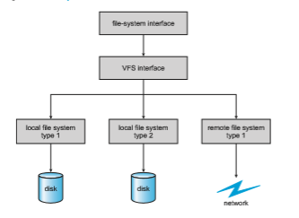
**Figure 15.5** Schematic view of a virtual file system.

The second layer is called the **virtual file system** (**VFS**) layer. The VFS layer serves two important functions:

**1\.** It separates file-system-generic operations from their implementation by defining a clean VFS interface. Several implementations for the VFS inter- face may coexist on the same machine, allowing transparent access to different types of file systems mounted locally.

**2\.** It provides amechanism for uniquely representing afile throughout a net- work. The VFS is based on a file-representation structure, called a **vnode**, that contains a numerical designator for a network-wide unique file. (UNIX inodes are unique within only a single file system.) This network- wide uniqueness is required for support of network file systems. The kernel maintains one vnode structure for each active node (file or direc- tory).

Thus, the VFS distinguishes local files from remote ones, and local files are further distinguished according to their file-system types.

The VFS activates file-system-specific operations to handle local requests according to their file-system types and calls the NFS protocol procedures (or other protocol procedures for other network file systems) for remote requests. File handles are constructed from the relevant vnodes and are passed as argu- ments to these procedures. The layer implementing the file-system type or the remote-file-system protocol is the third layer of the architecture.

Let’s briefly examine the VFS architecture in Linux. The four main object types defined by the Linux VFS are:  

• The **inode object**, which represents an individual file

• The **fil object**, which represents an open file

• The **superblock object**, which represents an entire file system

• The **dentry object**, which represents an individual directory entry

For each of these four object types, the VFS defines a set of operations that may be implemented. Every object of one of these types contains a pointer to a function table. The function table lists the addresses of the actual functions that implement the defined operations for that particular object. For example, an abbreviated API for some of the operations for the file object includes:

• int open(. . .)—Open a file.

• int close(. . .)—Close an already-open file.

• ssize t read(. . .)—Read from a file.

• ssize t write(. . .)—Write to a file.

• int mmap(. . .)—Memory-map a file.

An implementation of the file object for a specific file type is required to imple- ment each function specified in the definition of the file object. (The complete definition of the file object is specified in the file struct file operations, which is located in the file /usr/include/linux/fs.h.)

Thus, the VFS software layer can perform an operation on one of these objects by calling the appropriate function from the object’s function table, without having to know in advance exactly what kind of object it is dealing with. The VFS does not know, or care, whether an inode represents a disk file, a directory file, or a remote file. The appropriate function for that file’s read() operation will always be at the same place in its function table, and the VFS software layer will call that function without caring how the data are actually read.

## Remote File Systems

With the advent of networks (Chapter 19), communication among remote com- puters became possible. Networking allows the sharing of resources spread across a campus or even around the world. One obvious resource to share is data in the form of files.

Through the evolution of network and file technology, remote file-sharing methods have changed. The first implemented method involves manually transferring files between machines via programs like ftp. The second major method uses a **distributed fil system** (**DFS**), in which remote directories are visible from a local machine. In some ways, the third method, the **World Wide Web**, is a reversion to the first. A browser is needed to gain access to the remote files, and separate operations (essentially a wrapper for ftp) are used to transfer files. Increasingly, cloud computing (Section 1.10.5) is being used for file sharing as well.  

ftp is used for both anonymous and authenticated access. **Anonymous access** allows a user to transfer files without having an account on the remote system. The World Wide Web uses anonymous file exchange almost exclu- sively. DFS involves a much tighter integration between the machine that is accessing the remote files and the machine providing the files. This integration adds complexity, as we describe in this section.

### The Client–Server Model

Remote file systems allow a computer to mount one or more file systems from one or more remote machines. In this case, the machine containing the files is the **server**, and the machine seeking access to the files is the **client**. The client–server relationship is common with networked machines. Generally, the server declares that a resource is available to clients and specifies exactly which resource (in this case, which files) and exactly which clients. A server can serve multiple clients, and a client can use multiple servers, depending on the implementation details of a given client–server facility.

The server usually specifies the available files on a volume or directory level. Client identification is more difficult. A client can be specified by a net- work name or other identifier, such as an IP address, but these can be **spoofed**, or imitated. As a result of spoofing, an unauthorized client could be allowed access to the server. More secure solutions include secure authentication of the client via encrypted keys. Unfortunately, with security come many challenges, including ensuring compatibility of the client and server (they must use the same encryption algorithms) and security of key exchanges (intercepted keys could again allow unauthorized access). Because of the difficulty of solving these problems, unsecure authentication methods are most commonly used.

In the case of UNIX and its network file system (NFS), authentication takes place via the client networking information, by default. In this scheme, the user’s IDs on the client and server must match. If they do not, the server will be unable to determine access rights to files. Consider the example of a user who has an ID of 1000 on the client and 2000 on the server. A request from the client to the server for a specific file will not be handled appropriately, as the server will determine if user 1000 has access to the file rather than basing the determination on the real user ID of 2000. Access is thus granted or denied based on incorrect authentication information. The server must trust the client to present the correct user ID. Note that the NFS protocols allowmany-to-many relationships. That is, many servers can provide files to many clients. In fact, a given machine can be both a server to some NFS clients and a client of other NFS servers.

Once the remote file system is mounted, file operation requests are sent on behalf of the user across the network to the server via the DFS protocol. Typically, a file-open request is sent along with the ID of the requesting user. The server then applies the standard access checks to determine if the user has credentials to access the file in the mode requested. The request is either allowed or denied. If it is allowed, a file handle is returned to the client appli- cation, and the application then can perform read, write, and other operations on the file. The client closes the file when access is completed. The operating system may apply semantics similar to those for a local file-system mount or may use different semantics.  

### Distributed Information Systems

Tomake client–server systems easier to manage, **distributed information sys- tems**, also known as **distributed naming services**, provide unified access to the information needed for remote computing. The **domain name system** (**DNS**) provides host-name-to-network-address translations for the entire Internet. Before DNS became widespread, files containing the same information were sent via e-mail or ftp between all networked hosts. Obviously, this methodol- ogy was not scalable! DNS is further discussed in Section 19.3.1.

Other distributed information systems provide **_user name/password/user ID/group ID_** space for a distributed facility. UNIX systems have employed a wide variety of distributed information methods. Sun Microsystems (now part of Oracle Corporation) introduced **yellow pages** (since renamed **network information service**, or **NIS**), and most of the industry adopted its use. It centralizes storage of user names, host names, printer information, and the like. Unfortunately, it uses unsecure authentication methods, including sending user passwords unencrypted (in clear text) and identifying hosts by IP address. Sun’s NIS+ was a much more secure replacement for NIS but was much more complicated and was not widely adopted.

In the case of Microsoft’s **common Internet file system** (**CIFS**), network information is used in conjunction with user authentication (user name and password) to create a network login that the server uses to decide whether to allow or deny access to a requested file system. For this authentication to be valid, the user names must match from machine to machine (as with NFS). Microsoft uses **active directory** as a distributed naming structure to provide a single name space for users. Once established, the distributed naming facility is used by all clients and servers to authenticate users via Microsoft’s version of the **Kerberos** network authentication protocol (https://web.mit.edu/kerberos/).

The industry is moving toward use of the **lightweight directory-access protocol** (**LDAP**) as a secure distributed naming mechanism. In fact, active directory is based on LDAP. Oracle Solaris and most other major operating systems include LDAP and allow it to be employed for user authentication as well as system-wide retrieval of information, such as availability of printers. Conceivably, one distributed LDAP directory could be used by an organization to store all user and resource information for all the organization’s computers. The result would be secure single sign-on for users, who would enter their authentication information once for access to all computers within the organi- zation. It would also ease system-administration efforts by combining, in one location, information that is currently scattered in various files on each system or in different distributed information services.

### Failure Modes

Local file systems can fail for a variety of reasons, including failure of the drive containing the file system, corruption of the directory structure or other disk-management information (collectively called **metadata**), disk-controller failure, cable failure, and host-adapter failure. User or system-administrator failure can also cause files to be lost or entire directories or volumes to be deleted.Many of these failures will cause a host to crash and an error condition to be displayed, and human interventionmay be required to repair the damage.  

Remote file systems have even more failure modes. Because of the complexity of network systems and the required interactions between remote machines, many more problems can interfere with the proper operation of remote file systems. In the case of networks, the network can be interrupted between two hosts. Such interruptions can result from hardware failure, poor hardware configuration, or networking implementation issues. Although some networks have built-in resiliency, including multiple paths between hosts, many do not. Any single failure can thus interrupt the flow of DFS commands.

Consider a client in themidst of using a remote file system. It has files open from the remote host; among other activities, it may be performing directory lookups to open files, reading or writing data to files, and closing files. Now consider a partitioning of the network, a crash of the server, or even a scheduled shutdown of the server. Suddenly, the remote file system is no longer reachable. This scenario is rather common, so it would not be appropriate for the client system to act as it would if a local file system were lost. Rather, the system can either terminate all operations to the lost server or delay operations until the server is again reachable. These failure semantics are defined and implemented as part of the remote-file-system protocol. Termination of all operations can result in users’ losing data—and patience. Thus, most DFS protocols either enforce or allow delaying of file-system operations to remote hosts, with the hope that the remote host will become available again.

To implement this kind of recovery from failure, some kind of **state information** may be maintained on both the client and the server. If both server and client maintain knowledge of their current activities and open files, then they can seamlessly recover from a failure. In the situation where the server crashes but must recognize that it has remotely mounted exported file systems and opened files, NFS Version 3 takes a simple approach, implementing a **stateless** DFS. In essence, it assumes that a client request for a file read orwritewould not have occurred unless the file system had been remotely mounted and the file had been previously open. The NFS protocol carries all the information needed to locate the appropriate file and perform the requested operation. Similarly, it does not track which clients have the exported volumes mounted, again assuming that if a request comes in, it must be legitimate. While this stateless approach makes NFS resilient and rather easy to implement, it also makes it unsecure. For example, forged read or write requests could be allowed by an NFS server. These issues are addressed in the industry standard NFS Version 4, in which NFS is made stateful to improve its security, performance, and functionality.

## Consistency Semantics

Consistency semantics represent an important criterion for evaluating any file system that supports file sharing. These semantics specify how multiple users of a system are to access a shared file simultaneously. In particular, they specify whenmodifications of data by one userwill be observable by other users. These semantics are typically implemented as code with the file system.

Consistency semantics are directly related to the process synchronization algorithms of Chapter 6. However, the complex algorithms of that chapter tend not to be implemented in the case of file I/O because of the great latencies and slow transfer rates of disks and networks. For example, performing an atomic transaction to a remote disk could involve several network communications, several disk reads and writes, or both. Systems that attempt such a full set of functionalities tend to performpoorly.Asuccessful implementationof complex sharing semantics can be found in the Andrew file system.

For the following discussion, we assume that a series of file accesses (that is, reads and writes) attempted by a user to the same file is always enclosed between the open() and close() operations. The series of accesses between the open() and close() operations makes up a **fil session**. To illustrate the concept, we sketch several prominent examples of consistency semantics.

### UNIX Semantics

The UNIX file system (Chapter 19) uses the following consistency semantics:

• Writes to an open file by a user are visible immediately to other users who have this file open.

• One mode of sharing allows users to share the pointer of current location into the file. Thus, the advancing of the pointer by one user affects all sharing users. Here, a file has a single image that interleaves all accesses, regardless of their origin.

In the UNIX semantics, a file is associated with a single physical image that is accessed as an exclusive resource. Contention for this single image causes delays in user processes.

### Session Semantics

The Andrew file system (OpenAFS) uses the following consistency semantics:

• Writes to an open file by a user are not visible immediately to other users that have the same file open.

• Once a file is closed, the changesmade to it are visible only in sessions start- ing later. Already open instances of the file do not reflect these changes.

According to these semantics, a filemay be associated temporarilywith several (possibly different) images at the same time. Consequently, multiple users are allowed to perform both read and write accesses concurrently on their images of the file, without delay. Almost no constraints are enforced on scheduling accesses.

### Immutable-Shared-Files Semantics

A unique approach is that of **immutable shared files.** Once a file is declared as shared by its creator, it cannot be modified. An immutable file has two key properties: its name may not be reused, and its contents may not be altered. Thus, the name of an immutable file signifies that the contents of the file are fixed. The implementation of these semantics in a distributed system (Chapter 19) is simple, because the sharing is disciplined (read-only).  

## NFS

Network file systems are commonplace. They are typically integrated with the overall directory structure and interface of the client system. NFS is a good example of a widely used, well implemented client–server network file system. Here, we use it as an example to explore the implementation details of network file systems.

NFS is both an implementation and a specification of a software system for accessing remote files across LANs (or even WANs). NFS is part of ONC+, which most UNIX vendors and some PC operating systems support. The implementa- tion described here is part of the Solaris operating system, which is a modified version of UNIX SVR4. It uses either the TCP or UDP/IP protocol (depending on the interconnecting network). The specification and the implementation are intertwined in our description of NFS. Whenever detail is needed, we refer to the Solaris implementation; whenever the description is general, it applies to the specification also.

There are multiple versions of NFS, with the latest being Version 4. Here, we describe Version 3, which is the version most commonly deployed.

### Overview

NFS views a set of interconnected workstations as a set of independent machines with independent file systems. The goal is to allow some degree of sharing among these file systems (on explicit request) in a transparent manner. Sharing is based on a client–server relationship. Amachine may be, and often is, both a client and a server. Sharing is allowed between any pair of machines. To ensure machine independence, sharing of a remote file system affects only the client machine and no other machine.

So that a remote directory will be accessible in a transparent manner from a particular machine—say, from**_M1_**—a client of that machine must first carry out a mount operation. The semantics of the operation involve mounting a remote directory over a directory of a local file system. Once the mount oper- ation is completed, the mounted directory looks like an integral subtree of the local file system, replacing the subtree descending from the local directory. The local directory becomes the name of the root of the newly mounted directory. Specification of the remote directory as an argument for the mount operation is not done transparently; the location (or host name) of the remote directory has to be provided. However, from then on, users on machine **_M1_** can access files in the remote directory in a totally transparent manner.

To illustrate file mounting, consider the file system depicted in Figure 15.6, where the triangles represent subtrees of directories that are of interest. The figure shows three independent file systems of machines named **_U_**, **_S1_**, and **_S2_**. At this point, on each machine, only the local files can be accessed. Figure 15.7(a) shows the effects of mounting S1:/usr/shared over U:/usr/local. This figure depicts the view users on **_U_** have of their file system. After the mount is complete, they can access any file within the dir1 directory using the prefix /usr/local/dir1. The original directory /usr/local on that machine is no longer visible.

Subject to access-rights accreditation, any file system, or any directory within a file system, can be mounted remotely on top of any local directory.  

**Figure 15.6** Three independent file systems.

Disklessworkstations can evenmount their own roots from servers. Cascading mounts are also permitted in some NFS implementations. That is, a file system can bemounted over another file system that is remotelymounted, not local. A machine is affected by only those mounts that it has itself invoked. Mounting a remote file systemdoes not give the client access to other file systems thatwere, by chance, mounted over the former file system. Thus, the mount mechanism does not exhibit a transitivity property.

In Figure 15.7(b), we illustrate cascading mounts. The figure shows the result of mounting S2:/usr/dir2 over U:/usr/local/dir1, which is already remotely mounted from **_S1._** Users can access files within dir2 on **_U_** using the prefix /usr/local/dir1. If a shared file system ismounted over a user’s home directories on all machines in a network, the user can log into any workstation and get his or her home environment. This property permits user mobility.

One of the design goals of NFS was to operate in a heterogeneous environ- ment of different machines, operating systems, and network architectures. The

**Figure 15.7** Mounting in NFS. (a) Mounts. (b) Cascading mounts.  

NFS specification is independent of thesemedia. This independence is achieved through the use of RPC primitives built on top of an external data representa- tion (XDR) protocol used between two implementation-independent interfaces. Hence, if the system’s heterogeneous machines and file systems are properly interfaced to NFS, file systems of different types can be mounted both locally and remotely.

The NFS specification distinguishes between the services provided by a mount mechanism and the actual remote-file-access services. Accordingly, two separate protocols are specified for these services: a mount protocol and a pro- tocol for remote file accesses, the **NFS protocol**. The protocols are specified as sets of RPCs. These RPCs are the building blocks used to implement transparent remote file access.

### The Mount Protocol

The **mount protocol** establishes the initial logical connection between a server and a client. In Solaris, each machine has a server process, outside the kernel, performing the protocol functions.

A mount operation includes the name of the remote directory to be mounted and the name of the server machine storing it. The mount request is mapped to the corresponding RPC and is forwarded to the mount server running on the specific server machine. The server maintains an **export list** that specifies local file systems that it exports for mounting, along with names of machines that are permitted to mount them. (In Solaris, this list is the /etc/dfs/dfstab, which can be edited only by a superuser.) The specification can also include access rights, such as read only. To simplify the maintenance of export lists and mount tables, a distributed naming scheme can be used to hold this information and make it available to appropriate clients.

Recall that any directory within an exported file system can be mounted remotely by an accredited machine. A component unit is such a directory. When the server receives a mount request that conforms to its export list, it returns to the client a file handle that serves as the key for further accesses to files within the mounted file system. The file handle contains all the informa- tion that the server needs to distinguish an individual file it stores. In UNIX terms, the file handle consists of a file-system identifier and an inode number to identify the exact mounted directory within the exported file system.

The server also maintains a list of the client machines and the correspond- ing currently mounted directories. This list is used mainly for administrative purposes—for instance, for notifying all clients that the server is going down. Only through addition and deletion of entries in this list can the server state be affected by the mount protocol.

Usually, a systemhas a staticmounting preconfiguration that is established at boot time (/etc/vfstab in Solaris); however, this layout can bemodified. In addition to the actual mount procedure, the mount protocol includes several other procedures, such as unmount and return export list.

### The NFS Protocol

The NFS protocol provides a set of RPCs for remote file operations. The proce- dures support the following operations:  

## NFS 613**

• Searching for a file within a directory

• Reading a set of directory entries

• Manipulating links and directories

• Accessing file attributes

• Reading and writing files

These procedures can be invoked only after a file handle for the remotely mounted directory has been established.

The omission of open and close operations is intentional. A prominent feature of NFS servers is that they are stateless. Servers do not maintain infor- mation about their clients from one access to another. No parallels to UNIX’s open-files table or file structures exist on the server side. Consequently, each request has to provide a full set of arguments, including a unique file identifier and an absolute offset inside the file for the appropriate operations. The result- ing design is robust; no special measures need be taken to recover a server after a crash. File operations must be idempotent for this purpose—that is, the same operation performed multiple times must have the same effect as if it had only been performed once. To achieve idempotence, every NFS request has a sequence number, allowing the server to determine if a request has been duplicated or if any are missing.

Maintaining the list of clients that we mentioned seems to violate the statelessness of the server. However, this list is not essential for the correct operation of the client or the server, and hence it does not need to be restored after a server crash. Consequently, it may include inconsistent data and is treated as only a hint.

A further implication of the stateless-server philosophy and a result of the synchrony of an RPC is that modified data (including indirection and status blocks) must be committed to the server’s disk before results are returned to the client. That is, a client can cache write blocks, but when it flushes them to the server, it assumes that they have reached the server’s disks. The server must write all NFS data synchronously. Thus, a server crash and recovery will be invisible to a client; all blocks that the server ismanaging for the clientwill be intact. The resulting performance penalty can be large, because the advantages of caching are lost. Performance can be increased by using storagewith its own nonvolatile cache (usually battery-backed-up memory). The disk controller acknowledges the disk write when the write is stored in the nonvolatile cache. In essence, the host sees a very fast synchronous write. These blocks remain intact even after a system crash and are written from this stable storage to disk periodically.

A single NFS write procedure call is guaranteed to be atomic and is not intermixed with other write calls to the same file. The NFS protocol, however, does not provide concurrency-controlmechanisms.Awrite() systemcallmay be broken down into several RPC writes, because each NFS write or read call can contain up to 8 KB of data and UDP packets are limited to 1,500 bytes. As a result, two users writing to the same remote file may get their data intermixed. The claim is that, because lock management is inherently stateful, a service outside the NFS should provide locking (and Solaris does). Users are advised to coordinate access to shared files usingmechanisms outside the scope of NFS.  

**Figure 15.8** Schematic view of the NFS architecture.

NFS is integrated into the operating system via a VFS. As an illustration of the architecture, let’s trace how an operation on an already-open remote file is handled (follow the example in Figure 15.8). The client initiates the operation with a regular system call. The operating-system layer maps this call to a VFS operation on the appropriate vnode. The VFS layer identifies the file as a remote one and invokes the appropriate NFS procedure. An RPC call is made to the NFS service layer at the remote server. This call is reinjected to the VFS layer on the remote system, which finds that it is local and invokes the appropriate file- systemoperation. This path is retraced to return the result.An advantage of this architecture is that the client and the server are identical; thus, a machine may be a client, or a server, or both. The actual service on each server is performed by kernel threads.

### Path-Name Translation

**Path-name translation** in NFS involves the parsing of a path name such as /usr/local/dir1/file.txt into separate directory entries, or components: (1) usr, (2) local, and (3) dir1. Path-name translation is done by breaking the path into component names and performing a separate NFS lookup call for every pair of component name and directory vnode. Once a mount point is crossed, every component lookup causes a separate RPC to the server. This expensive path-name-traversal scheme is needed, since the layout of each client’s logical name space is unique, dictated by the mounts the client has performed. It would be much more efficient to hand a server a path name and receive a target vnode once a mount point is encountered. At any point, however, there might be another mount point for the particular client of which the stateless server is unaware.  

So that lookup is fast, a directory-name-lookup cache on the client side holds the vnodes for remote directory names. This cache speeds up references to files with the same initial path name. The directory cache is discarded when attributes returned from the server do not match the attributes of the cached vnode.

Recall that some implementations of NFS allow mounting a remote file system on top of another already-mounted remote file system (a cascading mount). When a client has a cascading mount, more than one server can be involved in a path-name traversal. However, when a client does a lookup on a directory on which the server has mounted a file system, the client sees the underlying directory instead of the mounted directory.

### Remote Operations

With the exception of opening and closing files, there is an almost one-to-one correspondence between the regular UNIX system calls for file operations and the NFS protocol RPCs. Thus, a remote file operation can be translated directly to the corresponding RPC. Conceptually, NFS adheres to the remote-service paradigm; but in practice, buffering and caching techniques are employed for the sake of performance. No direct correspondence exists between a remote operation and an RPC. Instead, file blocks and file attributes are fetched by the RPCs and are cached locally. Future remote operations use the cached data, subject to consistency constraints.

There are two caches: the file-attribute (inode-information) cache and the file-blocks cache. When a file is opened, the kernel checks with the remote server to determine whether to fetch or revalidate the cached attributes. The cached file blocks are used only if the corresponding cached attributes are up to date. The attribute cache is updated whenever new attributes arrive from the server. Cached attributes are, by default, discarded after 60 seconds. Both read-ahead and delayed-write techniques are used between the server and the client. Clients do not free delayed-write blocks until the server confirms that the data have been written to disk. Delayed-write is retained even when a file is opened concurrently, in conflicting modes. Hence, UNIX semantics (Section 15.7.1) are not preserved.

Tuning the system for performance makes it difficult to characterize the consistency semantics of NFS. New files created on a machine may not be visible elsewhere for 30 seconds. Furthermore, writes to a file at one site may or may not be visible at other sites that have this file open for reading. New opens of a file observe only the changes that have already been flushed to the server. Thus, NFS provides neither strict emulation of UNIX semantics nor the session semantics of Andrew (Section 15.7.2). In spite of these drawbacks, the utility and good performance of the mechanism make it the most widely used multi-vendor-distributed system in operation.

## Summary

• General-purpose operating systems provide many file-system types, from special-purpose through general.  

• Volumes containing file systems can be mounted into the computer’s file- system space.

• Depending on the operating system, the file-system space is seamless (mounted file systems integrated into the directory structure) or distinct (each mounted file system having its own designation).

• At least one file system must be bootable for the system to be able to start —that is, it must contain an operating system. The boot loader is run first; it is a simple program that is able to find the kernel in the file system, load it, and start its execution. Systems can containmultiple bootable partitions, letting the administrator choose which to run at boot time.

• Most systems are multi-user and thus must provide a method for file shar- ing and file protection. Frequently, files and directories include metadata, such as owner, user, and group access permissions.

• Mass storage partitions are used either for raw block I/O or for file systems. Each file system resides in a volume, which can be composed of one partition or multiple partitions working together via a volume manager.

• To simplify implementation of multiple file systems, an operating system can use a layered approach, with a virtual file-system interface making access to possibly dissimilar file systems seamless.

• Remote file systems can be implemented simply by using a program such as ftp or the web servers and clients in theWorldWideWeb, or with more functionality via a client–server model. Mount requests and user IDs must be authenticated to prevent unapproved access.

• Client–server facilities do not natively share information, but a distributed information system such as DNS can be used to allow such sharing, pro- viding a unified user name space, password management, and system identification. For example, Microsoft CIFS uses active directory, which employs a version of the Kerberos network authentication protocol to pro- vide a full set of naming and authentication services among the computers in a network.

• Once file sharing is possible, a consistency semantics model must be cho- sen and implemented to moderate multiple concurrent access to the same file. Semantics models include UNIX, session, and immutable-shared-files semantics.

• NFS is an example of a remote file system, providing clients with seam- less access to directories, files, and even entire file systems. A full-featured remote file system includes a communication protocol with remote opera- tions and path-name translation.

**Practice Exercises**

**15.1** Explain how the VFS layer allows an operating system to support mul- tiple types of file systems easily.

**15.2** Why have more than one file system type on a given system?  

**15.3** On a Unix or Linux system that implements the procfs file system, determine how to use the procfs interface to explore the process name space. What aspects of processes can be viewed via this interface? How would the same information be gathered on a system lacking the procfs file system?

**15.4** Why do some systems integrate mounted file systems into the root file system naming structure, while others use a separate naming method for mounted file systems?

**15.5** Given a remote file access facility such as ftp, why were remote file systems like NFS created?

**Further Reading**

The internals of the BSD UNIX system are covered in full in \[McKusick et al. (2015)\]. Details concerning file systems for Linux can be found in \[Love (2010)\].

The network file system (NFS) is discussed in \[Callaghan (2000)\]. NFS Ver- sion 4 is a standard described at http://www.ietf.org/rfc/rfc3530.txt. \[Ouster- hout (1991)\] discusses the role of distributed state in networked file systems. NFS and the UNIX file system (UFS) are described in \[Mauro and McDougall (2007)\].

The Kerberos network authentication protocol is explored in https://web.mit.edu/kerberos/.

**Bibliography**

**\[Callaghan (2000)\]** B. Callaghan, _NFS Illustrated_, Addison-Wesley (2000).

**\[Love (2010)\]** R. Love, _Linux Kernel Development,_ Third Edition, Developer’s Library (2010).

**\[Mauro and McDougall (2007)\]** J. Mauro and R. McDougall, _Solaris Internals: Core Kernel Architecture_, Prentice Hall (2007).

**\[McKusick et al. (2015)\]** M. K. McKusick, G. V. Neville-Neil, and R. N. M. Wat- son,_The Design and Implementation of the FreeBSDUNIXOperating System–Second Edition_, Pearson (2015).

**\[Ousterhout (1991)\]** J. Ousterhout. “The Role of Distributed State”. _In CMU Computer Science: a 25th Anniversary Commemorative_, R. F. Rashid, Ed., Addison- Wesley (1991).  

**15.6** Assume that in a particular augmentation of a remote-file-access pro- tocol, each client maintains a name cache that caches translations from file names to corresponding file handles. What issues should we take into account in implementing the name cache?

**15.7** Given a mounted file system with write operations underway, and a system crash or power loss, what must be done before the file system is remounted if: (a) The file system is not log-structured? (b) The file system is log-structured?

**15.8** Why do operating systems mount the root file system automatically at boot time?

**15.9** Why do operating systems require file systems other than root to be mounted?

**EX-51**