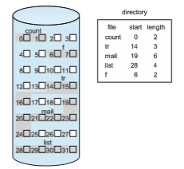
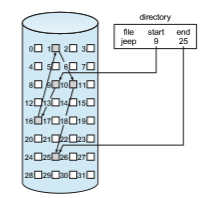
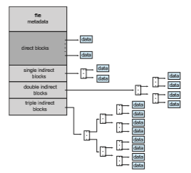

## Allocation Methods

The direct-access nature of secondary storage gives us flexibility in the imple- mentation of files. In almost every case, many files are stored on the same device. The main problem is how to allocate space to these files so that storage space is utilized effectively and files can be accessed quickly. Threemajormeth- ods of allocating secondary storage space are in wide use: contiguous, linked, and indexed. Eachmethod has advantages and disadvantages. Although some systems support all three, it is more common for a system to use one method for all files within a file-system type.

### Contiguous Allocation

**Contiguous allocation** requires that each file occupy a set of contiguous blocks on the device.Device addresses define a linear ordering on the device.With this ordering, assuming that only one job is accessing the device, accessing block _b_ \+ 1 after block _b_ normally requires no head movement. When head movement is needed (from the last sector of one cylinder to the first sector of the next cylinder), the head need only move from one track to the next. Thus, for HDDs, the number of disk seeks required for accessing contiguously allocated files is  

**Figure 14.4** Contiguous allocation of disk space.

minimal (assuming blocks with close logical addresses are close physically), as is seek time when a seek is finally needed.

Contiguous allocation of a file is defined by the address of the first block and length (in block units) of the file. If the file is _n_ blocks long and starts at location _b,_ then it occupies blocks _b, b_ \+ 1, _b_ \+ 2, ..., _b_ \+ _n_ − 1. The directory entry for each file indicates the address of the starting block and the length of the area allocated for this file (Figure 14.4). Contiguous allocation is easy to implement but has limitations, and is therefore not used in modern file systems.

Accessing a file that has been allocated contiguously is easy. For sequential access, the file system remembers the address of the last block referenced and, when necessary, reads the next block. For direct access to block _i_ of a file that starts at block _b,_ we can immediately access block _b_ \+ _i._ Thus, both sequential and direct access can be supported by contiguous allocation.

Contiguous allocation has some problems, however. One difficulty is find- ing space for a new file. The system chosen to manage free space determines how this task is accomplished; these management systems are discussed in Section 14.5. Any management system can be used, but some are slower than others.

The contiguous-allocation problem can be seen as a particular application of the general **dynamic storage-allocation** problem discussed in Section 9.2, which involves how to satisfy a request of size _n_ from a list of free holes. First fit and best fit are the most common strategies used to select a free hole from the set of available holes. Simulations have shown that both first fit and best fit are more efficient than worst fit in terms of both time and storage utilization. Neither first fit nor best fit is clearly best in terms of storage utilization, but first fit is generally faster.

All these algorithms suffer from the problemof **external fragmentation**. As files are allocated and deleted, the free storage space is broken into little pieces.  

External fragmentation exists whenever free space is broken into chunks. It becomes a problem when the largest contiguous chunk is insufficient for a request; storage is fragmented into a number of holes, none of which is large enough to store the data.Dependingon the total amount of disk storage and the average file size, external fragmentation may be a minor or a major problem.

One strategy for preventing loss of significant amounts of storage space to external fragmentation is to copy an entire file system onto another device. The original device is then freed completely, creating one large contiguous free space. We then copy the files back onto the original device by allocating contiguous space from this one large hole. This scheme effectively **compacts** all free space into one contiguous space, solving the fragmentation problem. The cost of this compaction is time, however, and the cost can be particularly high for large storage devices. Compacting these devices may take hours and may be necessary on a weekly basis. Some systems require that this function be done **off-line**, with the file system unmounted. During this **down time**, normal system operation generally cannot be permitted, so such compaction is avoided at all costs on production machines. Most modern systems that need defragmentation can perform it **on-line** during normal system operations, but the performance penalty can be substantial.

Another problem with contiguous allocation is determining how much space is needed for a file. When the file is created, the total amount of space it will need must be found and allocated. How does the creator (program or person) know the size of the file to be created? In some cases, this determina- tion may be fairly simple (copying an existing file, for example). In general, however, the size of an output file may be difficult to estimate.

If we allocate too little space to a file, we may find that the file cannot be extended. Especially with a best-fit allocation strategy, the space on both sides of the file may be in use. Hence, we cannot make the file larger in place. Two possibilities then exist. First, the user program can be terminated, with an appropriate error message. The user must then allocate more space and run the program again. These repeated runs may be costly. To prevent them, the user will normally overestimate the amount of space needed, resulting in considerable wasted space. The other possibility is to find a larger hole, copy the contents of the file to the new space, and release the previous space. This series of actions can be repeated as long as space exists, although it can be time consuming. The user need never be informed explicitly about what is happening, however; the systemcontinues despite the problem, althoughmore and more slowly.

Even if the total amount of space needed for a file is known in advance, preallocationmay be inefficient. Afile that will grow slowly over a long period (months or years)must be allocated enough space for its final size, even though much of that space will be unused for a long time. The file therefore has a large amount of internal fragmentation.

To minimize these drawbacks, an operating system can use a modified contiguous-allocation scheme. Here, a contiguous chunk of space is allocated initially. Then, if that amount proves not to be large enough, another chunk of contiguous space, known as an **extent**, is added. The location of a file’s blocks is then recorded as a location and a block count, plus a link to the first block of the next extent. On some systems, the owner of the file can set the extent size, but this setting results in inefficiencies if the owner is incorrect. Internal  

fragmentation can still be a problem if the extents are too large, and external fragmentation can become a problem as extents of varying sizes are allocated and deallocated. The commercial Symantec Veritas file system uses extents to optimize performance. Veritas is a high-performance replacement for the standard UNIX UFS.

### Linked Allocation

**Linked allocation** solves all problems of contiguous allocation. With linked allocation, each file is a linked list of storage blocks; the blocksmay be scattered anywhere on the device. The directory contains a pointer to the first and last blocks of the file. For example, a file of five blocks might start at block 9 and continue at block 16, then block 1, then block 10, and finally block 25 (Figure 14.5). Each block contains a pointer to the next block. These pointers are not made available to the user. Thus, if each block is 512 bytes in size, and a block address (the pointer) requires 4 bytes, then the user sees blocks of 508 bytes.

To create a new file, we simply create a new entry in the directory. With linked allocation, each directory entry has a pointer to the first block of the file. This pointer is initialized to null (the end-of-list pointer value) to signify an empty file. The size field is also set to 0. A write to the file causes the free- space management system to find a free block, and this new block is written to and is linked to the end of the file. To read a file, we simply read blocks by following the pointers from block to block. There is no external fragmentation with linked allocation, and any free block on the free-space list can be used to satisfy a request. The size of a file need not be declared when the file is created. A file can continue to grow as long as free blocks are available. Consequently, it is never necessary to compact disk space.

Linked allocation does have disadvantages, however. The major problem is that it can be used effectively only for sequential-access files. To find the _i_th

**Figure 14.5** Linked allocation of disk space.  

block of a file, wemust start at the beginning of that file and follow the pointers until we get to the _i_th block. Each access to a pointer requires a storage device read, and some require an HDD seek. Consequently, it is inefficient to support a direct-access capability for linked-allocation files.

Another disadvantage is the space required for the pointers. If a pointer requires 4 bytes out of a 512-byte block, then 0.78 percent of the disk is being used for pointers, rather than for information. Each file requires slightly more space than it would otherwise.

The usual solution to this problem is to collect blocks into multiples, called **clusters**, and to allocate clusters rather than blocks. For instance, the file system may define a cluster as four blocks and operate on the secondary storage device only in cluster units. Pointers then use a much smaller percentage of the file’s space. This method allows the logical-to-physical block mapping to remain simple but improves HDD throughput (because fewer disk-head seeks are required) and decreases the space needed for block allocation and free-list management. The cost of this approach is an increase in internal fragmentation, because more space is wastedwhen a cluster is partially full than when a block is partially full. Also random I/O performance suffers because a request for a small amount of data transfers a large amount of data. Clusters can be used to improve the disk-access time for many other algorithms as well, so they are used in most file systems.

Yet another problem of linked allocation is reliability. Recall that the files are linked together by pointers scattered all over the device, and consider what would happen if a pointer was lost or damaged. Abug in the operating-system software or a hardware failure might result in picking up the wrong pointer. This error could in turn result in linking into the free-space list or into another file. One partial solution is to use doubly linked lists, and another is to store the file name and relative block number in each block. However, these schemes require even more overhead for each file.

An important variation on linked allocation is the use of a **file-allocatio table** (**FAT**). This simple but efficient method of disk-space allocation was used by the MS-DOS operating system. A section of storage at the beginning of each volume is set aside to contain the table. The table has one entry for each block and is indexed by block number. The FAT is used in much the same way as a linked list. The directory entry contains the block number of the first block of the file. The table entry indexed by that block number contains the block number of the next block in the file. This chain continues until it reaches the last block, which has a special end-of-file value as the table entry. An unused block is indicated by a table value of 0. Allocating a new block to a file is a simple matter of finding the first 0-valued table entry and replacing the previous end- of-file value with the address of the new block. The 0 is then replaced with the end-of-file value. An illustrative example is the FAT structure shown in Figure 14.6 for a file consisting of disk blocks 217, 618, and 339.

The FAT allocation scheme can result in a significant number of disk head seeks, unless the FAT is cached. The disk head must move to the start of the volume to read the FAT and find the location of the block in question, then move to the location of the block itself. In the worst case, both moves occur for each of the blocks. A benefit is that random-access time is improved, because the disk head can find the location of any block by reading the information in the FAT.  

**Figure 14.6** File-allocation table.

### Indexed Allocation

Linked allocation solves the external-fragmentation and size-declaration prob- lems of contiguous allocation. However, in the absence of a FAT, linked alloca- tion cannot support efficient direct access, since the pointers to the blocks are scattered with the blocks themselves all over the disk and must be retrieved in order. **Indexed allocation** solves this problem by bringing all the pointers together into one location: the **index block**.

Each file has its own index block, which is an array of storage-block addresses. The _i_ th entry in the index block points to the _i_ th block of the file. The directory contains the address of the index block (Figure 14.7). To find and read the _i_ th block, we use the pointer in the _i_ th index-block entry. This scheme is similar to the paging scheme described in Section 9.3.

When the file is created, all pointers in the index block are set to null. When the _i_ th block is first written, a block is obtained from the free-space manager, and its address is put in the _i_ th index-block entry.

Indexed allocation supports direct access, without suffering from external fragmentation, because any free block on the storage device can satisfy a request for more space. Indexed allocation does suffer from wasted space, however. The pointer overhead of the index block is generally greater than the pointer overhead of linked allocation. Consider a common case in which we have a file of only one or two blocks. With linked allocation, we lose the space of only one pointer per block. With indexed allocation, an entire index block must be allocated, even if only one or two pointers will be non-null.

This point raises the question of how large the index block should be. Every file must have an index block, so we want the index block to be as small as  

**Figure 14.7** Indexed allocation of disk space.

possible. If the index block is too small, however, it will not be able to hold enough pointers for a large file, and a mechanism will have to be available to deal with this issue. Mechanisms for this purpose include the following:

• **Linked scheme**. An index block is normally one storage block. Thus, it can be read and written directly by itself. To allow for large files, we can link together several index blocks. For example, an index blockmight contain a small header giving the name of the file and a set of the first 100 disk-block addresses. The next address (the last word in the index block) is null (for a small file) or is a pointer to another index block (for a large file).

• **Multilevel index**. Avariant of linked representationuses a first-level index block to point to a set of second-level index blocks, which in turn point to the file blocks. To access a block, the operating system uses the first-level index to find a second-level index block and then uses that block to find the desired data block. This approach could be continued to a third or fourth level, depending on the desiredmaximumfile size.With 4,096-byte blocks, we could store 1,024 four-byte pointers in an index block. Two levels of indexes allow 1,048,576 data blocks and a file size of up to 4 GB.

• **Combined scheme**. Another alternative, used in UNIX-based file systems, is to keep the first, say, 15 pointers of the index block in the file’s inode. The first 12 of these pointers point to **direct blocks**; that is, they contain addresses of blocks that contain data of the file. Thus, the data for small files (of no more than 12 blocks) do not need a separate index block. If the block size is 4 KB, then up to 48 KB of data can be accessed directly. The next three pointers point to **indirect blocks**. The first points to a **single indirect block**, which is an index block containing not data but the addresses of blocks that do contain data. The second points to a **double indirect block**, which contains the address of a block that contains the addresses of blocks that contain pointers to the actual data blocks. The last pointer contains the address of a **triple indirect block**. (A UNIX inode is shown in Figure 14.8.)  

**Figure 14.8** The UNIX inode.

Under this method, the number of blocks that can be allocated to a file exceeds the amount of space addressable by the 4-byte file pointers used by many operating systems. A 32-bit file pointer reaches only 232 bytes, or 4 GB. Many UNIX and Linux implementations now support 64-bit file pointers, which allows files and file systems to be several exbibytes in size. The ZFS file system supports 128-bit file pointers.

Indexed-allocation schemes suffer from some of the same performance problems as does linked allocation. Specifically, the index blocks can be cached in memory, but the data blocks may be spread all over a volume.

### Performance

The allocation methods that we have discussed vary in their storage efficiency and data-block access times. Both are important criteria in selecting the proper method or methods for an operating system to implement.

Before selecting an allocation method, we need to determine how the systems will be used. A system with mostly sequential access should not use the same method as a system with mostly random access.

For any type of access, contiguous allocation requires only one access to get a block. Since we can easily keep the initial address of the file in memory, we can calculate immediately the address of the _i_th block (or the next block) and read it directly.

For linked allocation, we can also keep the address of the next block in memory and read it directly. Thismethod is fine for sequential access; for direct access, however, an access to the _i_th block might require _i_ block reads. This problem indicates why linked allocation should not be used for an application requiring direct access.

As a result, some systems support direct-access files by using contiguous allocation and sequential-access files by using linked allocation. For these systems, the type of access to bemademust be declaredwhen the file is created. A file created for sequential access will be linked and cannot be used for direct access. A file created for direct access will be contiguous and can support both direct access and sequential access, but its maximum length must be declared when it is created. In this case, the operating system must have appropriate data structures and algorithms to support both allocationmethods. Files can be converted from one type to another by the creation of a new file of the desired type, into which the contents of the old file are copied. The old file may then be deleted and the new file renamed.

Indexed allocation is more complex. If the index block is already in mem- ory, then the access can be made directly. However, keeping the index block in memory requires considerable space. If this memory space is not avail- able, then we may have to read first the index block and then the desired data block. For a two-level index, two index-block reads might be necessary. For an extremely large file, accessing a block near the end of the file would require reading in all the index blocks before the needed data block finally could be read. Thus, the performance of indexed allocation depends on the index structure, on the size of the file, and on the position of the block desired.

Some systems combine contiguous allocation with indexed allocation by using contiguous allocation for small files (up to three or four blocks) and auto- matically switching to an indexed allocation if the file grows large. Since most files are small, and contiguous allocation is efficient for small files, average performance can be quite good.

Many other optimizations are in use. Given the disparity between CPU speed and disk speed, it is not unreasonable to add thousands of extra instruc- tions to the operating system to save just a few disk-head movements. Fur- thermore, this disparity is increasing over time, to the point where hundreds of thousands of instructions could reasonably be used to optimize head move- ments.

For NVM devices, there are no disk head seeks, so different algorithms and optimizations are needed. Using an old algorithm that spends many CPU cycles trying to avoid a nonexistent head movement would be very inefficient. Existing file systems are being modified and new ones being created to attain maximum performance from NVM storage devices. These developments aim to reduce the instruction count and overall path between the storage device and application access to the data.
