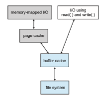

## Efficiency and Performance

Now that we have discussed various block-allocation and directory- management options, we can further consider their effect on performance and efficient storage use. Disks tend to represent a major bottleneck in system performance, since they are the slowest main computer component. EvenNVM devices are slow compared with CPU and main memory, so their performance must be optimized as well. In this section, we discuss a variety of techniques used to improve the efficiency and performance of secondary storage.

### Efficiency

The efficient use of storage device space depends heavily on the allocation and directory algorithms in use. For instance, UNIX inodes are preallocated on a volume. Even an empty disk has a percentage of its space lost to inodes. However, by preallocating the inodes and spreading them across the volume, we improve the file system’s performance. This improved performance results from the UNIX allocation and free-space algorithms, which try to keep a file’s data blocks near that file’s inode block to reduce seek time.

As another example, let’s reconsider the clustering scheme discussed in Section 14.4, which improves file-seek and file-transfer performance at the cost of internal fragmentation. To reduce this fragmentation, BSD UNIX varies the cluster size as a file grows. Large clusters are used where they can be filled, and small clusters are used for small files and the last cluster of a file. This system is described in Appendix C.

The types of data normally kept in a file’s directory (or inode) entry also require consideration. Commonly, a “last write date” is recorded to supply information to the user and to determine whether the file needs to be backed up. Some systems also keep a “last access date,” so that a user can determine when the file was last read. The result of keeping this information is that, whenever the file is read, a field in the directory structure must be written to. That means the block must be read into memory, a section changed, and the block written back out to the device, because operations on secondary storage occur only in block (or cluster) chunks. So any time a file is opened for reading, its FCBmust be read andwritten aswell. This requirement can be inefficient for frequently accessed files, so we must weigh its benefit against its performance cost when designing a file system. Generally, every data item associated with a file needs to be considered for its effect on efficiency and performance.

Consider, for instance, how efficiency is affected by the size of the pointers used to access data. Most systems use either 32-bit or 64-bit pointers through- out the operating system.Using 32-bit pointers limits the size of a file to 232, or 4 GB. Using 64-bit pointers allows very large file sizes, but 64-bit pointers require more space to store. As a result, the allocation and free-space-management methods (linked lists, indexes, and so on) use more storage space.  

One of the difficulties in choosing a pointer size—or, indeed, any fixed allo- cation size within an operating system—is planning for the effects of changing technology. Consider that the IBM PC XT had a 10-MB hard drive and anMS-DOS FAT file system that could support only 32 MB. (Each FAT entry was 12 bits, pointing to an 8-KB cluster.) As disk capacities increased, larger disks had to be split into 32-MB partitions, because the file system could not track blocks beyond 32 MB. As hard disks with capacities of over 100 MB became common, the disk data structures and algorithms in MS-DOS had to be modified to allow larger file systems. (Each FAT entry was expanded to 16 bits and later to 32 bits.) The initial file-system decisions were made for efficiency reasons; how- ever, with the advent of MS-DOS Version 4, millions of computer users were inconveniencedwhen theyhad to switch to the new, larger file system. Solaris’s ZFS file system uses 128-bit pointers, which theoretically should never need to be extended. (Theminimummass of a device capable of storing 2128 bytes using atomic-level storage would be about 272 trillion kilograms.)

As another example, consider the evolution of the Solaris operating sys- tem. Originally, many data structures were of fixed length, allocated at system startup. These structures included the process table and the open-file table. When the process table became full, nomore processes could be created.When the file table became full, no more files could be opened. The systemwould fail to provide services to users. Table sizes could be increased only by recompiling the kernel and rebooting the system. With later releases of Solaris, (as with modernLinux kernels) almost all kernel structureswere allocated dynamically, eliminating these artificial limits on system performance. Of course, the algo- rithms that manipulate these tables are more complicated, and the operating system is a little slower because it must dynamically allocate and deallocate table entries; but that price is the usual one for more general functionality.

### Performance

Even after the basic file-system algorithms have been selected, we can still improve performance in several ways. Aswas discussed in Chapter 12, storage device controllers include local memory to form an on-board cache that is large enough to store entire tracks or blocks at a time. On an HDD, once a seek is performed, the track is read into the disk cache starting at the sector under the disk head (reducing latency time). The disk controller then transfers any sector requests to the operating system. Once blocks make it from the disk controller into main memory, the operating system may cache the blocks there.

Some systems maintain a separate section of main memory for a **buffer cache**, where blocks are kept under the assumption that they will be used again shortly. Other systems cache file data using a **page cache**. The page cache uses virtual memory techniques to cache file data as pages rather than as file-system-oriented blocks. Caching file data using virtual addresses is far more efficient than caching through physical disk blocks, as accesses interface with virtual memory rather than the file system. Several systems—including Solaris, Linux, and Windows—use page caching to cache both process pages and file data. This is known as **unifie virtual memory**.

Some versions of UNIX and Linux provide a **unifie buffer cache**. To illustrate the benefits of the unified buffer cache, consider the two alternatives  

**Figure 14.10** I/O without a unified buffer cache.

for opening and accessing a file. One approach is to use memory mapping (Section 13.5); the second is to use the standard system calls read() and write(). Without a unified buffer cache, we have a situation similar to Figure 14.10. Here, the read() and write() system calls go through the buffer cache. The memory-mapping call, however, requires using two caches—the page cache and the buffer cache. A memory mapping proceeds by reading in disk blocks from the file system and storing them in the buffer cache. Because the virtualmemory system does not interface with the buffer cache, the contents of the file in the buffer cache must be copied into the page cache. This situation, known as **double caching**, requires caching file-system data twice. Not only does this waste memory but it also wastes significant CPU and I/O cycles due to the extra datamovementwithin systemmemory. In addition, inconsistencies between the two caches can result in corrupt files. In contrast, when a unified buffer cache is provided, both memory mapping and the read() and write() system calls use the same page cache. This has the benefit of avoiding double caching, and it allows the virtual memory system to manage file-system data. The unified buffer cache is shown in Figure 14.11.

Regardless of whether we are caching storage blocks or pages (or both), least recently used (LRU) (Section 10.4.4) seems a reasonable general-purpose algorithm for block or page replacement. However, the evolution of the Solaris page-caching algorithms reveals the difficulty in choosing an algorithm. Solaris allows processes and the page cache to share unused memory. Versions earlier than Solaris 2.5.1 made no distinction between allocating pages to a process and allocating them to the page cache. As a result, a system performing many I/O operations used most of the available memory for caching pages. Because of the high rates of I/O, the page scanner (Section 10.10.3) reclaimed pages from processes—rather than from the page cache—when free memory ran low. Solaris 2.6 and Solaris 7 optionally implemented priority paging, in which the page scanner gave priority to process pages over the page cache. Solaris 8 applied a fixed limit to process pages and the file-system page cache, prevent-  

**Figure 14.11** I/O using a unified buffer cache.

ing either from forcing the other out of memory. Solaris 9 and 10 again changed the algorithms to maximize memory use and minimize thrashing.

Another issue that can affect the performance of I/O is whether writes to the file system occur synchronously or asynchronously. **Synchronous writes** occur in the order in which the storage subsystem receives them, and the writes are not buffered. Thus, the calling routine must wait for the data to reach the drive before it can proceed. In an **asynchronous write**, the data are stored in the cache, and control returns to the caller. Most writes are asynchronous. However, metadata writes, among others, can be synchronous. Operating systems frequently include a flag in the open system call to allow a process to request that writes be performed synchronously. For example, databases use this feature for atomic transactions, to assure that data reach stable storage in the required order.

Some systems optimize their page cache by using different replacement algorithms, depending on the access type of the file. Afile being read or written sequentially should not have its pages replaced in LRU order, because the most recently used page will be used last, or perhaps never again. Instead, sequential access can be optimized by techniques known as free-behind and read-ahead. **Free-behind** removes a page from the buffer as soon as the next page is requested. The previous pages are not likely to be used again and waste buffer space. With **read-ahead**, a requested page and several subsequent pages are read and cached. These pages are likely to be requested after the current page is processed. Retrieving these data from the disk in one transfer and caching them saves a considerable amount of time. One might think that a track cache on the controller would eliminate the need for read-ahead on a multiprogrammed system.However, because of the high latency and overhead involved inmakingmany small transfers from the track cache tomainmemory, performing a read-ahead remains beneficial.

The page cache, the file system, and the device drivers have some interest- ing interactions. When small amounts of data are written to a file, the pages are buffered in the cache, and the storage device driver sorts its output queue according to device address. These two actions allow a disk driver to minimize disk-head seeks. Unless synchronous writes are required, a process writing to disk simply writes into the cache, and the system asynchronously writes the  
data to disk when convenient. The user process sees very fast writes. When data are read from a disk file, the block I/O system does some read-ahead; however, writes are much more nearly asynchronous than are reads. Thus, output to the disk through the file system is often faster than is input for small transfers, counter to intuition. No matter how much buffering and caching is available, large, continuous I/O can overrun the capacity and end up bottle- necked on the device’s performance. Consider writing a large movie file to a HDD. If the file is larger than the page cache (or the part of the page cache available to the process) then the page cache will fill and all I/O will occur at drive speed. Current HDDs read faster than they write, so in this instance the performance aspects are reversed from smaller I/O performance.

