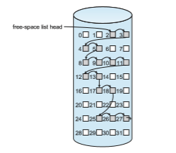

## Free-Space Management

Since storage space is limited, we need to reuse the space from deleted files for new files, if possible. (Write-once optical disks allow only one write to any given sector, and thus reuse is not physically possible.) To keep track of free disk space, the system maintains a **free-space list**. The free-space list records all free device blocks—those not allocated to some file or directory. To create a file, we search the free-space list for the required amount of space and allocate that space to the new file. This space is then removed from the free-space list. When a file is deleted, its space is added to the free-space list. The free-space list, despite its name, is not necessarily implemented as a list, as we discuss next.

### Bit Vector

Frequently, the free-space list is implemented as a **bitmap** or **bit vector**. Each block is represented by 1 bit. If the block is free, the bit is 1; if the block is allocated, the bit is 0.

For example, consider a disk where blocks 2, 3, 4, 5, 8, 9, 10, 11, 12, 13, 17, 18, 25, 26, and 27 are free and the rest of the blocks are allocated. The free-space bitmap would be

001111001111110001100000011100000 ...

The main advantage of this approach is its relative simplicity and its effi- ciency in finding the first free block or _n_ consecutive free blocks on the disk. Indeed,many computers supply bit-manipulation instructions that can be used effectively for that purpose. One technique for finding the first free block on a system that uses a bit vector to allocate space is to sequentially check each word in the bitmap to see whether that value is not 0, since a 0-valued word contains only 0 bits and represents a set of allocated blocks. The first non-0 word is scanned for the first 1 bit, which is the location of the first free block. The calculation of the block number is

(number of bits per word) × (number of 0-value words) + offset of first 1 bit.

Again, we see hardware features driving software functionality. Unfortu- nately, bit vectors are inefficient unless the entire vector is kept inmainmemory (and is written to the device containing the file system occasionally for recov- ery needs). Keeping it in main memory is possible for smaller devices but not necessarily for larger ones. A 1.3-GB disk with 512-byte blocks would need a bitmap of over 332 KB to track its free blocks, although clustering the blocks in groups of four reduces this number to around 83 KB per disk. A 1-TB disk with 4-KB blocks would require 32 MB (240 / 212 = 228 bits = 225 bytes = 25 MB) to store its bitmap. Given that disk size constantly increases, the problemwith bit vectors will continue to escalate as well.

### Linked List

Another approach to free-space management is to link together all the free blocks, keeping a pointer to the first free block in a special location in the file system and caching it in memory. This first block contains a pointer to the next free block, and so on. Recall our earlier example (Section 14.5.1), in which blocks 2, 3, 4, 5, 8, 9, 10, 11, 12, 13, 17, 18, 25, 26, and 27 were free and the rest of the blocks were allocated. In this situation, we would keep a pointer to block 2 as the first free block. Block 2 would contain a pointer to block 3, which would point to block 4, which would point to block 5, which would point to block 8, and so on (Figure 14.9). This scheme is not efficient; to traverse the list, we must read each block, which requires substantial I/O time on HDDs. Fortunately, however, traversing the free list is not a frequent action. Usually,  

**Figure 14.9** Linked free-space list on disk.

the operating system simply needs a free block so that it can allocate that block to a file, so the first block in the free list is used. The FAT method incorporates free-block accounting into the allocation data structure. No separate method is needed.

### Grouping

A modification of the free-list approach stores the addresses of _n_ free blocks in the first free block. The first _n_ −1 of these blocks are actually free. The last block contains the addresses of another _n_ free blocks, and so on. The addresses of a large number of free blocks can now be found quickly, unlike the situation when the standard linked-list approach is used.

### Counting

Another approach takes advantage of the fact that, generally, several contigu- ous blocks may be allocated or freed simultaneously, particularly when space is allocated with the contiguous-allocation algorithm or through clustering. Thus, rather than keeping a list of _n_ free block addresses, we can keep the address of the first free block and the number (_n_) of free contiguous blocks that follow the first block. Each entry in the free-space list then consists of a device address and a count. Although each entry requires more space than would a simple disk address, the overall list is shorter, as long as the count is generally greater than 1. Note that this method of tracking free space is similar to the extent method of allocating blocks. These entries can be stored in a balanced tree, rather than a linked list, for efficient lookup, insertion, and deletion.  

### Space Maps

Oracle’s **ZFS** file system (found in Solaris and some other operating systems) was designed to encompass huge numbers of files, directories, and even file systems (in ZFS, we can create file-system hierarchies). On these scales, meta- data I/O can have a large performance impact. Consider, for example, that if the free-space list is implemented as a bitmap, bitmaps must be modified both when blocks are allocated and when they are freed. Freeing 1 GB of data on a 1-TB disk could cause thousands of blocks of bitmaps to be updated, because those data blocks could be scattered over the entire disk. Clearly, the data structures for such a system could be large and inefficient.

In its management of free space, ZFS uses a combination of techniques to control the size of data structures and minimize the I/O needed to manage those structures. First, ZFS creates **metaslabs** to divide the space on the device into chunks of manageable size. A given volume may contain hundreds of metaslabs. Each metaslab has an associated space map. ZFS uses the counting algorithm to store information about free blocks. Rather than write counting structures to disk, it uses log-structured file-system techniques to record them. The space map is a log of all block activity (allocating and freeing), in time order, in counting format. When ZFS decides to allocate or free space from a metaslab, it loads the associated space map into memory in a balanced-tree structure (for very efficient operation), indexed by offset, and replays the log into that structure. The in-memory space map is then an accurate representa- tion of the allocated and free space in themetaslab. ZFS also condenses themap as much as possible by combining contiguous free blocks into a single entry. Finally, the free-space list is updated on disk as part of the transaction-oriented operations of ZFS. During the collection and sorting phase, block requests can still occur, and ZFS satisfies these requests from the log. In essence, the log plus the balanced tree **_is_** the free list.

### TRIMing Unused Blocks

HDDs and other storage media that allow blocks to be overwritten for updates need only the free list for managing free space. Blocks do not need to be treated specially when freed. A freed block typically keeps its data (but without any file pointers to the block) until the data are overwritten when the block is next allocated.

Storage devices that do not allow overwrite, such as NVM flash-based storage devices, suffer badly when these same algorithms are applied. Recall from Section 11.1.2 that such devices must be erased before they can again be written to, and that those erases must be made in large chunks (blocks, composed of pages) and take a relatively long time compared with reads or writes.

A new mechanism is needed to allow the file system to inform the storage device that a page is free and can be considered for erasure (once the block con- taining the page is entirely free). That mechanism varies based on the storage controller. For ATA-attached drives, it is TRIM, while for NVMe-based storage, it is the unallocate command. Whatever the specific controller command, this mechanism keeps storage space available for writing. Without such a capabil- ity, the storage device gets full and needs garbage collection and block erasure, leading to decreases in storage I/Owrite performance (knownas “awrite cliff”).  

With the TRIM mechanism and similar capabilities, the garbage collection and erase steps can occur before the device is nearly full, allowing the device to provide more consistent performance.

