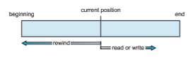
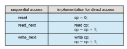

## Access Methods

Files store information. When it is used, this information must be accessed and read into computer memory. The information in the file can be accessed in several ways. Some systems provide only one access method for files. Others (such as mainframe operating systems) support many access methods, and choosing the right one for a particular application is a major design problem.

### Sequential Access

The simplest access method is **sequential access**. Information in the file is processed in order, one record after the other. This mode of access is by far the most common; for example, editors and compilers usually access files in this fashion.

Reads and writes make up the bulk of the operations on a file. A read operation—read next()—reads the next portion of the file and automatically advances a file pointer, which tracks the I/O location. Similarly, the write operation—write next()—appends to the end of the file and advances to the end of the newly written material (the new end of file). Such a file can be reset to the beginning, and on some systems, a programmay be able to skip forward or backward _n_ records for some integer _n_—perhaps only for _n_ \= 1. Sequential access, which is depicted in Figure 13.4, is based on a tape model of a file and works as well on sequential-access devices as it does on random-access ones.

### Direct Access

Another method is **direct access** (or **relative access**). Here, a file is made up of fixed-length **logical records** that allow programs to read and write records rapidly in no particular order. The direct-access method is based on a disk model of a file, since disks allow random access to any file block. For direct access, the file is viewed as a numbered sequence of blocks or records. Thus,

**Figure 13.4** Sequential-access file.  

we may read block 14, then read block 53, and then write block 7. There are no restrictions on the order of reading or writing for a direct-access file.

Direct-access files are of great use for immediate access to large amounts of information. Databases are often of this type. When a query concerning a particular subject arrives, we compute which block contains the answer and then read that block directly to provide the desired information.

As a simple example, on an airline-reservation system, we might store all the information about a particular flight (for example, flight 713) in the block identified by the flight number. Thus, the number of available seats for flight 713 is stored in block 713 of the reservation file. To store information about a larger set, such as people, we might compute a hash function on the people’s names or search a small in-memory index to determine a block to read and search.

For the direct-access method, the file operations must be modified to include the block number as a parameter. Thus, we have read(n), where _n_ is the block number, rather than read next(), and write(n) rather than write next(). An alternative approach is to retain read next() and write next() and to add an operation position file(n) where _n_ is the block number. Then, to effect a read(n), we would position file(n) and then read next().

The block number provided by the user to the operating system is normally a **relative block number**. A relative block number is an index relative to the beginning of the file. Thus, the first relative block of the file is 0, the next is 1, and so on, even though the absolute disk address may be 14703 for the first block and 3192 for the second. The use of relative block numbers allows the operating system to decide where the file should be placed (called the **allocation problem**, as we discuss in Chapter 14) and helps to prevent the user from accessing portions of the file system that may not be part of her file. Some systems start their relative block numbers at 0; others start at 1.

How, then, does the system satisfy a request for record _N_ in a file? Assum- ing we have a logical record length _L,_ the request for record _N_ is turned into an I/O request for _L_ bytes starting at location _L_ ∗ (_N_) within the file (assuming the first record is _N_ \= 0). Since logical records are of a fixed size, it is also easy to read, write, or delete a record.

Not all operating systems support both sequential and direct access for files. Some systems allow only sequential file access; others allow only direct access. Some systems require that a file be defined as sequential or direct when it is created. Such a file can be accessed only in a manner consistent with its declaration. We can easily simulate sequential access on a direct-access file by simply keeping a variable _cp_ that defines our current position, as shown in Figure 13.5. Simulating a direct-access file on a sequential-access file, however, is extremely inefficient and clumsy.

### Other Access Methods

Other access methods can be built on top of a direct-access method. These methods generally involve the construction of an index for the file. The **index**, like an index in the back of a book, contains pointers to the various blocks. To find a record in the file, we first search the index and then use the pointer to access the file directly and to find the desired record.  

**Figure 13.5** Simulation of sequential access on a direct-access file.

For example, a retail-price filemight list the universal product codes (UPCs) for items, with the associated prices. Each record consists of a 10-digit UPC and a 6-digit price, for a 16-byte record. If our disk has 1,024 bytes per block, we can store 64 records per block. A file of 120,000 records would occupy about 2,000 blocks (2 million bytes). By keeping the file sorted by UPC, we can define an index consisting of the first UPC in each block. This index would have 2,000 entries of 10 digits each, or 20,000 bytes, and thus could be kept in memory. To find the price of a particular item, we can make a binary search of the index. From this search, we learn exactly which block contains the desired record and access that block. This structure allows us to search a large file doing little I/O.

With large files, the index file itself may become too large to be kept in memory. One solution is to create an index for the index file. The primary index file contains pointers to secondary index files, which point to the actual data items.

For example, IBM’s indexed sequential-access method (ISAM) uses a small master index that points to disk blocks of a secondary index. The secondary index blocks point to the actual file blocks. The file is kept sorted on a defined key. To find a particular item,we first make a binary search of themaster index, which provides the block number of the secondary index. This block is read in, and again a binary search is used to find the block containing the desired record. Finally, this block is searched sequentially. In this way, any record can be located from its key by at most two direct-access reads. Figure 13.6 shows a similar situation as implemented by OpenVMS index and relative files.
