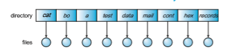
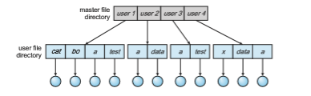
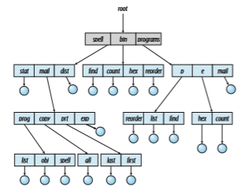
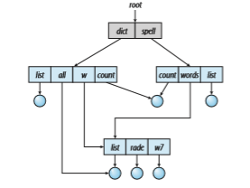

## Directory Structure

The directory can be viewed as a symbol table that translates file names into their file control blocks. If we take such a view, we see that the directory itself can be organized in many ways. The organization must allow us to insert entries, to delete entries, to search for a named entry, and to list all the entries in the directory. In this section, we examine several schemes for defining the logical structure of the directory system.

When considering a particular directory structure,we need to keep inmind the operations that are to be performed on a directory:

• **Search for a fil** . We need to be able to search a directory structure to find the entry for a particular file. Since files have symbolic names, and similar  

**Figure 13.6** Example of index and relative files.

names may indicate a relationship among files, we may want to be able to find all files whose names match a particular pattern.

• **Create a fil** . New files need to be created and added to the directory.

• **Delete a file.** When a file is no longer needed,wewant to be able to remove it from the directory. Note a delete leaves a hole in the directory structure and the file system may have a method to defragement the directory structure.

• **List a directory**. We need to be able to list the files in a directory and the contents of the directory entry for each file in the list.

• **Rename a file.** Because the name of a file represents its contents to its users, we must be able to change the name when the contents or use of the file changes. Renaming a file may also allow its position within the directory structure to be changed.

• **Traverse the file system**. We may wish to access every directory and every file within a directory structure. For reliability, it is a good idea to save the contents and structure of the entire file system at regular intervals. Often, we do this by copying all files tomagnetic tape, other secondary storage, or across a network to another system or the cloud. This technique provides a backup copy in case of system failure. In addition, if a file is no longer in use, the file can be copied the backup target and the disk space of that file released for reuse by another file.

In the following sections, we describe the most common schemes for defining the logical structure of a directory.

### Single-Level Directory

The simplest directory structure is the single-level directory. All files are con- tained in the same directory, which is easy to support and understand (Figure 13.7).  

**Figure 13.7** Single-level directory.

A single-level directory has significant limitations, however, when the number of files increases or when the system has more than one user. Since all files are in the same directory, they must have unique names. If two users call their data file test.txt, then the unique-name rule is violated. For example, in one programming class, 23 students called the program for their second assignment prog2.c; another 11 called it assign2.c. Fortunately, most file systems support file names of up to 255 characters, so it is relatively easy to select unique file names.

Even a single user on a single-level directorymay find it difficult to remem- ber the names of all the files as the number of files increases. It is not uncommon for a user to have hundreds of files on one computer system and an equal number of additional files on another system. Keeping track of so many files is a daunting task.

### Two-Level Directory**

As we have seen, a single-level directory often leads to confusion of file names among different users. The standard solution is to create a separate directory for each user.

In the two-level directory structure, each user has his own **user fil direc- tory** (**UFD**). The UFDs have similar structures, but each lists only the files of a single user. When a user job starts or a user logs in, the system’s **master fil directory** (**MFD**) is searched. The MFD is indexed by user name or account number, and each entry points to the UFD for that user (Figure 13.8).

When a user refers to a particular file, only his own UFD is searched. Thus, different users may have files with the same name, as long as all the file names within each UFD are unique. To create a file for a user, the operating system searches only that user’s UFD to ascertain whether another file of that name

**Figure 13.8** Two-level directory structure.  

exists. To delete a file, the operating system confines its search to the local UFD; thus, it cannot accidentally delete another user’s file that has the same name.

The user directories themselves must be created and deleted as necessary. A special system program is run with the appropriate user name and account information. The program creates a new UFD and adds an entry for it to the MFD. The execution of this program might be restricted to system administra- tors. The allocation of disk space for user directories can be handled with the techniques discussed in Chapter 14 for files themselves.

Although the two-level directory structure solves the name-collision prob- lem, it still has disadvantages. This structure effectively isolates one user from another. Isolation is an advantage when the users are completely independent but is a disadvantage when the users want to cooperate on some task and to access one another’s files. Some systems simply do not allow local user files to be accessed by other users.

If access is to be permitted, one user must have the ability to name a file in another user’s directory. To name a particular file uniquely in a two-level directory, we must give both the user name and the file name. A two-level directory can be thought of as a tree, or an inverted tree, of height 2. The root of the tree is the MFD. Its direct descendants are the UFDs. The descendants of the UFDs are the files themselves. The files are the leaves of the tree. Specifying a user name and a file name defines a path in the tree from the root (the MFD) to a leaf (the specified file). Thus, a user name and a file name define a **path name**. Every file in the system has a path name. To name a file uniquely, a user must know the path name of the file desired.

For example, if user Awishes to access her own test file named test.txt, she can simply refer to test.txt. To access the file named test.txt of user B (with directory-entry name userb), however, she might have to refer to /userb/test.txt. Every system has its own syntax for naming files in direc- tories other than the user’s own.

Additional syntax is needed to specify the volume of a file. For instance, in Windows a volume is specified by a letter followed by a colon. Thus, a file specification might be C:∖userb∖test. Some systems go even further and separate the volume, directory name, and file name parts of the speci- fication. In OpenVMS, for instance, the file login.com might be specified as: u:\[sst.crissmeyer\]login.com;1, where u is the name of the volume, sst is the name of the directory, crissmeyer is the name of the subdirectory, and 1 is the version number. Other systems—such as UNIX and Linux—simply treat the volume name as part of the directory name. The first name given is that of the volume, and the rest is the directory and file. For instance, /u/pgalvin/testmight specify volume u, directory pgalvin, and file test.

A special instance of this situation occurs with the system files. Programs provided as part of the system—loaders, assemblers, compilers, utility rou- tines, libraries, and so on—are generally defined as files.When the appropriate commands are given to the operating system, these files are read by the loader and executed. Many command interpreters simply treat such a command as the name of a file to load and execute. In the directory system as we defined it above, this file name would be searched for in the current UFD. One solution would be to copy the system files into each UFD. However, copying all the system files would waste an enormous amount of space. (If the system files  

require 5 MB, then supporting 12 users would require 5 × 12 = 60 MB just for copies of the system files.)

The standard solution is to complicate the search procedure slightly. A special user directory is defined to contain the system files (for example, user 0). Whenever a file name is given to be loaded, the operating system first searches the local UFD. If the file is found, it is used. If it is not found, the system automatically searches the special user directory that contains the system files. The sequence of directories searched when a file is named is called the **search path**. The search path can be extended to contain an unlimited list of directories to search when a command name is given. This method is the one most used in UNIX and Windows. Systems can also be designed so that each user has his own search path.

### Tree-Structured Directories

Once we have seen how to view a two-level directory as a two-level tree, the natural generalization is to extend the directory structure to a tree of arbitrary height (Figure 13.9). This generalization allows users to create their own subdirectories and to organize their files accordingly. A tree is the most common directory structure. The tree has a root directory, and every file in the system has a unique path name.

A directory (or subdirectory) contains a set of files or subdirectories. In many implementations, a directory is simply another file, but it is treated in a special way. All directories have the same internal format. One bit in each directory entry defines the entry as a file (0) or as a subdirectory (1). Special

**Figure 13.9** Tree-structured directory structure.  

system calls are used to create and delete directories. In this case the operating system (or the file system code) implements another file format, that of a directory.

In normal use, each process has a current directory. The **current directory** should containmost of the files that are of current interest to the process.When reference is made to a file, the current directory is searched. If a file is needed that is not in the current directory, then the user usually must either specify a path name or change the current directory to be the directory holding that file. To change directories, a system call could be provided that takes a directory name as a parameter and uses it to redefine the current directory. Thus, the user can change her current directory whenever she wants. Other systems leave it to the application (say, a shell) to track and operate on a current directory, as each process could have different current directories.

The initial current directory of a user’s login shell is designated when the user job starts or the user logs in. The operating system searches the accounting file (or some other predefined location) to find an entry for this user (for accounting purposes). In the accounting file is a pointer to (or the name of) the user’s initial directory. This pointer is copied to a local variable for this user that specifies the user’s initial current directory. From that shell, other processes can be spawned. The current directory of any subprocess is usually the current directory of the parent when it was spawned.

Path names can be of two types: absolute and relative. In UNIX and Linux, an **absolute path name** begins at the root (which is designated by an initial “/”) and follows a path down to the specified file, giving the directory names on the path. A **relative path name** defines a path from the current directory. For example, in the tree-structuredfile systemof Figure 13.9, if the current directory is /spell/mail, then the relative path name prt/first refers to the same file as does the absolute path name /spell/mail/prt/first.

Allowing a user to define her own subdirectories permits her to impose a structure on her files. This structure might result in separate directories for files associated with different topics (for example, a subdirectory was created to hold the text of this book) or different forms of information. For example, the directory programsmay contain source programs; the directory binmay store all the binaries. (As a side note, executable files were known in many systems as “binaries” which led to them being stored in the bin directory.)

An interesting policy decision in a tree-structured directory concerns how to handle the deletion of a directory. If a directory is empty, its entry in the directory that contains it can simply be deleted. However, suppose the direc- tory to be deleted is not empty but contains several files or subdirectories. One of two approaches can be taken. Some systemswill not delete a directory unless it is empty. Thus, to delete a directory, the user must first delete all the files in that directory. If any subdirectories exist, this procedure must be applied recursively to them, so that they can be deleted also. This approach can result in a substantial amount of work. An alternative approach, such as that taken by the UNIX rm command, is to provide an option: when a request is made to delete a directory, all that directory’s files and subdirectories are also to be deleted. Either approach is fairly easy to implement; the choice is one of policy. The latter policy is more convenient, but it is also more dangerous, because an entire directory structure can be removedwith one command. If that command is issued in error, a large number of files and directorieswill need to be restored (assuming a backup exists).

With a tree-structured directory system, users can be allowed to access, in addition to their files, the files of other users. For example, user B can access a file of user Aby specifying its path name. User B can specify either an absolute or a relative path name. Alternatively, user B can change her current directory to be user A’s directory and access the file by its file name.

### Acyclic-Graph Directories

Consider two programmers who are working on a joint project. The files asso- ciated with that project can be stored in a subdirectory, separating them from other projects and files of the two programmers. But since both programmers are equally responsible for the project, both want the subdirectory to be in their own directories. In this situation, the common subdirectory should be **_shared._** A shared directory or file exists in the file system in two (or more) places at once.

A tree structure prohibits the sharing of files or directories. An **acyclic graph**—that is, a graph with no cycles—allows directories to share subdirec- tories and files (Figure 13.10). The same file or subdirectory may be in two different directories. The acyclic graph is a natural generalization of the tree- structured directory scheme.

It is important to note that a shared file (or directory) is not the same as two copies of the file. With two copies, each programmer can view the copy rather than the original, but if one programmer changes the file, the changes will not appear in the other’s copy. With a shared file, only one actual file exists, so any changes made by one person are immediately visible to the other. Sharing is

**Figure 13.10** Acyclic-graph directory structure.  

particularly important for subdirectories; a new file created by one person will automatically appear in all the shared subdirectories.

When people are working as a team, all the files they want to share can be put into one directory. The home directory of each teammember could contain this directory of shared files as a subdirectory. Even in the case of a single user, the user’s file organization may require that some file be placed in different subdirectories. For example, a program written for a particular project should be both in the directory of all programs and in the directory for that project.

Shared files and subdirectories can be implemented in several ways. A common way, exemplified by UNIX systems, is to create a new directory entry called a link. A **link** is effectively a pointer to another file or subdirectory. For example, a link may be implemented as an absolute or a relative path name. When a reference to a file is made, we search the directory. If the directory entry is marked as a link, then the name of the real file is included in the link information. We **resolve** the link by using that path name to locate the real file. Links are easily identified by their format in the directory entry (or by having a special type on systems that support types) and are effectively indirect pointers. The operating system ignores these links when traversing directory trees to preserve the acyclic structure of the system.

Another common approach to implementing shared files is simply to duplicate all information about them in both sharing directories. Thus, both entries are identical and equal. Consider the difference between this approach and the creation of a link. The link is clearly different from the original directory entry; thus, the two are not equal. Duplicate directory entries, however, make the original and the copy indistinguishable. A major problem with duplicate directory entries is maintaining consistency when a file is modified.

An acyclic-graph directory structure is more flexible than a simple tree structure, but it is also more complex. Several problems must be considered carefully. A file may now have multiple absolute path names. Consequently, distinct file names may refer to the same file. This situation is similar to the aliasing problem for programming languages. If we are trying to traverse the entire file system—to find a file, to accumulate statistics on all files, or to copy all files to backup storage—this problem becomes significant, since we do not want to traverse shared structures more than once.

Another problem involves deletion. When can the space allocated to a shared file be deallocated and reused? One possibility is to remove the file whenever anyone deletes it, but this action may leave dangling pointers to the now-nonexistent file. Worse, if the remaining file pointers contain actual disk addresses, and the space is subsequently reused for other files, these dangling pointers may point into the middle of other files.

In a systemwhere sharing is implemented by symbolic links, this situation is somewhat easier to handle. The deletion of a link need not affect the original file; only the link is removed. If the file entry itself is deleted, the space for the file is deallocated, leaving the links dangling. We can search for these links and remove them as well, but unless a list of the associated links is kept with each file, this search can be expensive. Alternatively, we can leave the links until an attempt is made to use them. At that time, we can determine that the file of the name given by the link does not exist and can fail to resolve the link name; the access is treated just as with any other illegal file name. (In this case, the system designer should consider carefully what to do when a file is deleted and another file of the same name is created, before a symbolic link to the original file is used.) In the case of UNIX, symbolic links are left when a file is deleted, and it is up to the user to realize that the original file is gone or has been replaced. Microsoft Windows uses the same approach.

Another approach to deletion is to preserve the file until all references to it are deleted. To implement this approach, we must have some mechanism for determining that the last reference to the file has been deleted. We could keep a list of all references to a file (directory entries or symbolic links). When a link or a copy of the directory entry is established, a new entry is added to the file-reference list. When a link or directory entry is deleted, we remove its entry on the list. The file is deleted when its file-reference list is empty.

The trouble with this approach is the variable and potentially large size of the file-reference list. However, we really do not need to keep the entire list —we need to keep only a count of the number of references. Adding a new link or directory entry increments the reference count. Deleting a link or entry decrements the count. When the count is 0, the file can be deleted; there are no remaining references to it. The UNIX operating system uses this approach for nonsymbolic links (or **hard links**), keeping a reference count in the file infor- mation block (or inode; see Section C.7.2). By effectively prohibiting multiple references to directories, we maintain an acyclic-graph structure.

To avoid problems such as the ones just discussed, some systems simply do not allow shared directories or links.

### General Graph Directory

Aserious problem with using an acyclic-graph structure is ensuring that there are no cycles. If we start with a two-level directory and allow users to create subdirectories, a tree-structured directory results. It should be fairly easy to see that simply adding new files and subdirectories to an existing tree-structured directory preserves the tree-structured nature. However, when we add links, the tree structure is destroyed, resulting in a simple graph structure (Figure 13.11).

The primary advantage of an acyclic graph is the relative simplicity of the algorithms to traverse the graph and to determine when there are no more references to a file. We want to avoid traversing shared sections of an acyclic graph twice, mainly for performance reasons. If we have just searched a major shared subdirectory for a particular file without finding it, we want to avoid searching that subdirectory again; the second search would be a waste of time.

If cycles are allowed to exist in the directory, we likewise want to avoid searching any component twice, for reasons of correctness as well as perfor- mance.Apoorlydesignedalgorithmmight result in an infinite loop continually searching through the cycle and never terminating. One solution is to limit arbitrarily the number of directories that will be accessed during a search.

A similar problem exists when we are trying to determine when a file can be deleted. With acyclic-graph directory structures, a value of 0 in the reference count means that there are no more references to the file or directory, and the file can be deleted. However, when cycles exist, the reference count may not be 0 even when it is no longer possible to refer to a directory or file. This anomaly results from the possibility of self-referencing (or a cycle) in the directory structure. In this case, we generally need to use a **garbage collection**  

**Figure 13.11** General graph directory.

scheme to determine when the last reference has been deleted and the disk space can be reallocated. Garbage collection involves traversing the entire file system, marking everything that can be accessed. Then, a second pass collects everything that is not marked onto a list of free space. (A similar marking procedure can be used to ensure that a traversal or searchwill cover everything in the file system once and only once.) Garbage collection for a disk-based file system, however, is extremely time consuming and is thus seldom attempted.

Garbage collection is necessary only because of possible cycles in the graph. Thus, an acyclic-graph structure ismuch easier toworkwith. The difficulty is to avoid cycles as new links are added to the structure. How do we knowwhen a new link will complete a cycle? There are algorithms to detect cycles in graphs; however, they are computationally expensive, especially when the graph is on disk storage. A simpler algorithm in the special case of directories and links is to bypass links during directory traversal. Cycles are avoided, and no extra overhead is incurred.
