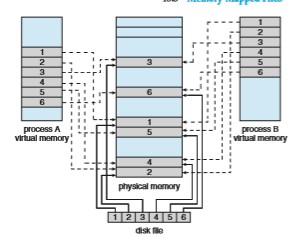
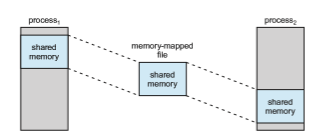
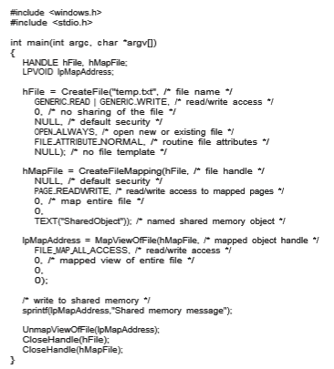
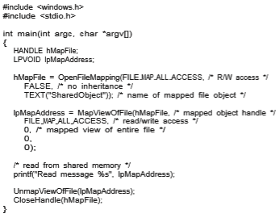

## Memory-Mapped Files

There is one other method of accessing files, and it is very commonly used. Consider a sequential read of a file on disk using the standard system calls open(), read(), and write(). Each file access requires a system call and disk access. Alternatively, we can use the virtual memory techniques discussed in Chapter 10 to treat file I/O as routine memory accesses. This approach, known as **memory mapping** a file, allows a part of the virtual address space to be logically associated with the file. As we shall see, this can lead to significant performance increases.

### Basic Mechanism

Memory mapping a file is accomplished by mapping a disk block to a page (or pages) in memory. Initial access to the file proceeds through ordinary demand paging, resulting in a page fault. However, a page-sized portion of the file is read from the file system into a physical page (some systems may opt to read in more than a page-sized chunk of memory at a time). Subsequent reads and writes to the file are handled as routine memory accesses. Manipulating files through memory rather than incurring the overhead of using the read() and write() system calls simplifies and speeds up file access and usage.

Note that writes to the file mapped in memory are not necessarily imme- diate (synchronous) writes to the file on secondary storage. Generally, systems update the file based on changes to the memory image only when the file is closed. Under memory pressure, systems will have any intermediate changes to swap space to not lose them when freeing memory for other uses. When the file is closed, all the memory-mapped data are written back to the file on secondary storage and removed from the virtual memory of the process.

Some operating systems providememorymapping only through a specific system call and use the standard system calls to perform all other file I/O. However, some systems choose tomemory-map afile regardless ofwhether the file was specified as memory-mapped. Let’s take Solaris as an example. If a file is specified as memory-mapped (using the mmap() system call), Solaris maps the file into the address space of the process. If a file is opened and accessed using ordinary system calls, such as open(), read(), and write(), Solaris still memory-maps the file; however, the file is mapped to the kernel address space. Regardless of how the file is opened, then, Solaris treats all file I/O as memory- mapped, allowing file access to take place via the efficient memory subsystem and avoiding system call overhead caused by each traditional read() and write().

Multiple processes may be allowed to map the same file concurrently, to allow sharing of data. Writes by any of the processes modify the data in virtual memory and can be seen by all others that map the same section of the file. Given our earlier discussions of virtual memory, it should be clear how the sharing of memory-mapped sections of memory is implemented: the virtual memory map of each sharing process points to the same page of physical memory—the page that holds a copy of the disk block. This memory sharing is illustrated in Figure 13.13. Thememory-mapping system calls can also support copy-on-write functionality, allowing processes to share a file in read-only mode but to have their own copies of any data they modify. So that access to the shared data is coordinated, the processes involved might use one of the mechanisms for achieving mutual exclusion described in Chapter 6.

Quite often, shared memory is in fact implemented by memory mapping files. Under this scenario, processes can communicate using shared mem- ory by having the communicating processes memory-map the same file into their virtual address spaces. The memory-mapped file serves as the region of shared memory between the communicating processes (Figure 13.14). We have already seen this in Section 3.5, where a POSIX shared-memory object is created and each communicating process memory-maps the object into its address space. In the following section, we discuss support in the Windows API for shared memory using memory-mapped files.

### Shared Memory in the Windows API

The general outline for creating a region of shared memory using memory- mapped files in the Windows API involves first creating a **fil mapping** for the  

**Figure 13.13** Memory-mapped files.

file to bemapped and then establishing a **view** of themapped file in a process’s virtual address space. A second process can then open and create a view of the mapped file in its virtual address space. The mapped file represents the shared-memory object that will enable communication to take place between the processes.

We next illustrate these steps in more detail. In this example, a producer process first creates a shared-memory object using the memory-mapping fea- tures available in the Windows API. The producer then writes a message to sharedmemory. After that, a consumer process opens amapping to the shared- memory object and reads the message written by the consumer.

**Figure 13.14** Shared memory using memory-mapped I/O.  
To establish a memory-mapped file, a process first opens the file to be mapped with the CreateFile() function, which returns a HANDLE to the opened file. The process then creates a mapping of this file HANDLE using the CreateFileMapping() function. Once the file mapping is done, the process establishes a view of the mapped file in its virtual address space with the MapViewOfFile() function. The view of the mapped file represents the por- tion of the file being mapped in the virtual address space of the process—the entire file or only a portion of it may be mapped. This sequence in the program

**Figure 13.15** Producer writing to shared memory using the Windows API.  

is shown in Figure 13.15. (We eliminate much of the error checking for code brevity.)

The call to CreateFileMapping() creates a **named shared-memory object** called SharedObject. The consumer process will communicate using this shared-memory segment by creating a mapping to the same named object. The producer then creates a view of the memory-mapped file in its virtual address space. By passing the last three parameters the value 0, it indicates that the mapped view is the entire file. It could instead have passed values specifying an offset and size, thus creating a view containing only a subsection of the file. (It is important to note that the entire mapping may not be loaded into memorywhen the mapping is established. Rather, the mapped file may be demand-paged, thus bringing pages into memory only as they are accessed.) The MapViewOfFile() function returns a pointer to the shared-memory object; any accesses to this memory location are thus accesses to the memory-mapped file. In this instance, the producer process writes themessage “Shared memory message” to shared memory.

A program illustrating how the consumer process establishes a view of the named shared-memory object is shown in Figure 13.16. This program is

**Figure 13.16** Consumer reading from shared memory using the Windows API.  

somewhat simpler than the one shown in Figure 13.15, as all that is necessary is for the process to create a mapping to the existing named shared-memory object. The consumer process must also create a view of the mapped file, just as the producer process did in the program in Figure 13.15. The consumer then reads from shared memory the message “Shared memory message” that was written by the producer process.

Finally, both processes remove the view of the mapped file with a call to UnmapViewOfFile(). We provide a programming exercise at the end of this chapter using shared memory with memory mapping in the Windows API.

## Summary

• A file is an abstract data type defined and implemented by the operating system. It is a sequence of logical records. A logical record may be a byte, a line (of fixed or variable length), or a more complex data item. The operating system may specifically support various record types or may leave that support to the application program.

• A major task for the operating system is to map the logical file concept onto physical storage devices such as hard disk or NVM device. Since the physical record size of the devicemay not be the same as the logical record size, it may be necessary to order logical records into physical records. Again, this task may be supported by the operating system or left for the application program.

• Within a file system, it is useful to create directories to allow files to be organized. A single-level directory in a multiuser system causes naming problems, since each file must have a unique name. A two-level directory solves this problem by creating a separate directory for each user’s files. The directory lists the files by name and includes the file’s location on the disk, length, type, owner, time of creation, time of last use, and so on.

• The natural generalization of a two-level directory is a tree-structured directory. A tree-structured directory allows a user to create subdirectories to organize files. Acyclic-graph directory structures enable users to share subdirectories and files but complicate searching and deletion. A general graph structure allows complete flexibility in the sharing of files and direc- tories but sometimes requires garbage collection to recover unused disk space.

• Remote file systems present challenges in reliability, performance, and security. Distributed information systems maintain user, host, and access information so that clients and servers can share state information to man- age use and access.

• Since files are the main information-storage mechanism in most computer systems, file protection is needed on multiuser systems. Access to files can be controlled separately for each type of access—read, write, execute, append, delete, list directory, and so on. File protection can be provided by access lists, passwords, or other techniques.  

**Practice Exercises**

**13.1** Some systems automatically delete all user files when a user logs off or a job terminates, unless the user explicitly requests that they be kept. Other systems keep all files unless the user explicitly deletes them. Discuss the relative merits of each approach.

**13.2** Why do some systems keep track of the type of a file, while still others leave it to the user and others simply do not implement multiple file types? Which system is “better”?

**13.3** Similarly, some systems support many types of structures for a file’s data, while others simply support a stream of bytes. What are the advantages and disadvantages of each approach?

**13.4** Could you simulate a multilevel directory structure with a single-level directory structure inwhich arbitrarily long names can be used? If your answer is yes, explain how you can do so, and contrast this scheme with themultilevel directory scheme. If your answer is no, explainwhat prevents your simulation’s success. Howwould your answer change if file names were limited to seven characters?

**13.5** Explain the purpose of the open() and close() operations.

**13.6** In some systems, a subdirectory can be read and written by an autho- rized user, just as ordinary files can be.

a. Describe the protection problems that could arise.

b. Suggest a scheme for dealing with each of these protection prob- lems.

**13.7** Consider a system that supports 5,000 users. Suppose that you want to allow 4,990 of these users to be able to access one file.

a. How would you specify this protection scheme in UNIX?

b. Can you suggest another protection scheme that can be usedmore effectively for this purpose than the scheme provided by UNIX?

**13.8** Researchers have suggested that, instead of having an access-control list associated with each file (specifying which users can access the file, and how), we should have a **user control list** associated with each user (specifying which files a user can access, and how). Discuss the relative merits of these two schemes.

**Further Reading**

Amultilevel directory structure was first implemented on the MULTICS system (\[Organick (1972)\]). Most operating systems now implement multilevel direc- tory structures. These include Linux (\[Love (2010)\]), macOS (\[Singh (2007)\]), Solaris (\[McDougall and Mauro (2007)\]), and all versions of Windows (\[Russi- novich et al. (2017)\]).  

A general discussion of Solaris file systems is found in the Sun _Sys- tem Administration Guide: Devices and File Systems_ (http://docs.sun.com/app/ docs/doc/817-5093).

The network file system (NFS), designed by Sun Microsystems, allows directory structures to be spread across networked computer systems. NFS Version 4 is described in RFC3505 (http://www.ietf.org/rfc/rfc3530.txt).

Agreat source of themeanings of computer jargon is http://www.catb.org/ esr/jargon/.

## Bibliography

**\[Love (2010)\]** R. Love, _Linux Kernel Development,_ Third Edition, Developer’s Library (2010).

**\[McDougall and Mauro (2007)\]** R. McDougall and J. Mauro, _Solaris Internals,_ Second Edition, Prentice Hall (2007).

**\[Organick (1972)\]** E. I. Organick, _The Multics System: An Examination of Its Struc- ture_, MIT Press (1972).

**\[Russinovich et al. (2017)\]** M.Russinovich,D.A. Solomon, andA. Ionescu,_Win- dows Internals–Part 1,_ Seventh Edition, Microsoft Press (2017).

**\[Singh (2007)\]** A. Singh, _Mac OS X Internals: A Systems Approach_, Addison- Wesley (2007).  

## Exercises

**Chapter 13 Exercises**

**13.9** Consider a file system in which a file can be deleted and its disk space reclaimedwhile links to that file still exist. What problemsmay occur if a new file is created in the same storage area or with the same absolute path name? How can these problems be avoided?

**13.10** The open-file table is used to maintain information about files that are currently open. Should the operating system maintain a separate table for each user or maintain just one table that contains references to files that are currently being accessed by all users? If the same file is being accessed by two different programs or users, should there be separate entries in the open-file table? Explain.

**13.11** What are the advantages and disadvantages of providing mandatory locks instead of advisory locks whose use is left to users’ discretion?

**13.12** Provide examples of applications that typically access files according to the following methods:

• Sequential

• Random

**13.13** Some systems automatically open a filewhen it is referenced for the first time and close the file when the job terminates. Discuss the advantages and disadvantages of this scheme compared with the more traditional one, where the user has to open and close the file explicitly.

**13.14** If the operating system knew that a certain application was going to access file data in a sequential manner, how could it exploit this information to improve performance?

**13.15** Give an example of an application that could benefit from operating- system support for random access to indexed files.

**13.16** Some systems provide file sharing by maintaining a single copy of a file. Other systems maintain several copies, one for each of the users sharing the file. Discuss the relative merits of each approach.

**EX-48**  
