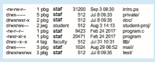

## Protection

When information is stored in a computer system, we want to keep it safe from physical damage (the issue of reliability) and improper access (the issue of protection).

Reliability is generally provided by duplicate copies of files.Many comput- ers have systems programs that automatically (or through computer-operator intervention) copy disk files to tape at regular intervals (once per day or week or month) to maintain a copy should a file system be accidentally destroyed. File systems can be damaged by hardware problems (such as errors in reading or writing), power surges or failures, head crashes, dirt, temperature extremes, and vandalism. Files may be deleted accidentally. Bugs in the file-system soft- ware can also cause file contents to be lost. Reliability was covered in more detail in Chapter 11.

Protection can be provided in many ways. For a laptop system running a modern operating system, we might provide protection by requiring a user name and password authentication to access it, encrypting the secondary stor- age so even someone opening the laptop and removing the drive would have a difficult time accessing its data, and firewalling network access so that when it is in use it is difficult to break in via its network connection. In multiuser system, even valid access of the system needs more advanced mechanisms to allow only valid access of the data.

### Types of Access

The need to protect files is a direct result of the ability to access files. Systems that do not permit access to the files of other users do not need protection. Thus, we could provide complete protection by prohibiting access. Alternatively, we could provide free access with no protection. Both approaches are too extreme for general use. What is needed is controlled access.

Protection mechanisms provide controlled access by limiting the types of file access that can be made. Access is permitted or denied depending on several factors, one of which is the type of access requested. Several different types of operations may be controlled:

• **Read**. Read from the file.

• **Write**. Write or rewrite the file.

• **Execute**. Load the file into memory and execute it.

• **Append**. Write new information at the end of the file.

• **Delete**. Delete the file and free its space for possible reuse.

• **List**. List the name and attributes of the file.

• **Attribute change**. Changing the attributes of the file.

Other operations, such as renaming, copying, and editing the file, may also be controlled. For many systems, however, these higher-level functions may be implemented by a system program that makes lower-level system calls. Protection is provided at only the lower level. For instance, copying a file may be implemented simply by a sequence of read requests. In this case, a user with read access can also cause the file to be copied, printed, and so on.

Many protection mechanisms have been proposed. Each has advantages and disadvantages and must be appropriate for its intended application. A small computer system that is used by only a fewmembers of a research group, for example, may not need the same types of protection as a large corporate computer that is used for research, finance, and personnel operations. We discuss some approaches to protection in the following sections and present a more complete treatment in Chapter 17.  

### Access Control

Themost common approach to the protection problem is tomake access depen- dent on the identity of the user. Different users may need different types of access to a file or directory. The most general scheme to implement identity- dependent access is to associate with each file and directory an **access-control list** (**ACL**) specifying user names and the types of access allowed for each user. When a user requests access to a particular file, the operating system checks the access list associated with that file. If that user is listed for the requested access, the access is allowed. Otherwise, a protection violation occurs, and the user job is denied access to the file.

This approach has the advantage of enabling complex access methodolo- gies. The main problem with access lists is their length. If we want to allow everyone to read a file, we must list all users with read access. This technique has two undesirable consequences:

• Constructing such a list may be a tedious and unrewarding task, especially if we do not know in advance the list of users in the system.

• The directory entry, previously of fixed size, now must be of variable size, resulting in more complicated space management.

These problems can be resolved by use of a condensed version of the access list.

To condense the length of the access-control list, many systems recognize three classifications of users in connection with each file:

• **Owner**. The user who created the file is the owner.

• **Group**. A set of users who are sharing the file and need similar access is a group, or work group.

• **Other**. All other users in the system.

The most common recent approach is to combine access-control lists with themore general (and easier to implement) owner, group, and universe access- control scheme just described. For example, Solaris uses the three categories of access by default but allows access-control lists to be added to specific files and directories when more fine-grained access control is desired.

To illustrate, consider a person, Sara, who is writing a new book. She has hired three graduate students (Jim, Dawn, and Jill) to helpwith the project. The text of the book is kept in a file named book.tex. The protection associated with this file is as follows:

• Sara should be able to invoke all operations on the file.

• Jim, Dawn, and Jill should be able only to read and write the file; they should not be allowed to delete the file.

• All other users should be able to read, but not write, the file. (Sara is interested in letting as many people as possible read the text so that she can obtain feedback.)  

**_PERMISSIONS IN AUNIX SYSTEM_**

In the UNIX system, directory protection and file protection are handled similarly. Associated with each file and directory are three fields—owner, group, and universe—each consisting of the three bits rwx, where r controls **r**ead access, w controls **w**rite access, and x controls e**x**ecution. Thus, a user can list the content of a subdirectory only if the r bit is set in the appropriate field. Similarly, a user can change his current directory to another current directory (say, foo) only if the x bit associated with the foo subdirectory is set in the appropriate field.

A sample directory listing from a UNIX environment is shown in below:

The first field describes the protection of the file or directory. A d as the first character indicates a subdirectory. Also shown are the number of links to the file, the owner’s name, the group’s name, the size of the file in bytes, the date of last modification, and finally the file’s name (with optional extension).

To achieve such protection, we must create a new group—say, text— with members Jim, Dawn, and Jill. The name of the group, text, must then be associated with the file book.tex, and the access rights must be set in accordance with the policy we have outlined.

Now consider a visitor to whom Sara would like to grant temporary access to Chapter 1. The visitor cannot be added to the text group because thatwould give him access to all chapters. Because a file can be in only one group, Sara cannot add another group to Chapter 1. With the addition of access-control- list functionality, though, the visitor can be added to the access control list of Chapter 1.

For this scheme towork properly, permissions and access listsmust be con- trolled tightly. This control can be accomplished in several ways. For example, in the UNIX system, groups can be created and modified only by the manager of the facility (or by any superuser). Thus, control is achieved through human interaction. Access lists are discussed further in Section 17.6.2.

With themore limited protection classification, only three fields are needed to define protection. Often, each field is a collection of bits, and each bit either allows or prevents the access associated with it. For example, the UNIX system defines three fields of three bits each—rwx, where r controls read access, w controls write access, and x controls execution. A separate field is kept for the  

file owner, for the file’s group, and for all other users. In this scheme, nine bits per file are needed to record protection information. Thus, for our example, the protection fields for the file book.tex are as follows: for the owner Sara, all bits are set; for the group text, the r and w bits are set; and for the universe, only the r bit is set.

One difficulty in combining approaches comes in the user interface. Users must be able to tell when the optional ACL permissions are set on a file. In the Solaris example, a “+” is appended to the regular permissions, as in:

19 -rw-r--r--+ 1 jim staff 130 May 25 22:13 file1

A separate set of commands, setfacl and getfacl, is used to manage the ACLs.

Windows users typically manage access-control lists via the GUI. Figure 13.12 shows a file-permission window on Windows 7 NTFS file system. In this example, user “guest” is specifically denied access to the file ListPanel.java.

Another difficulty is assigning precedence when permission and ACLs conflict. For example, if Walter is in a file’s group, which has read permission, but the file has an ACL granting Walter read and write permission, should a write by Walter be granted or denied? Solaris and other operating systems give ACLs precedence (as they are more fine-grained and are not assigned by default). This follows the general rule that specificity should have priority.

### Other Protection Approaches

Another approach to the protection problem is to associate a password with each file. Just as access to the computer system is often controlled by a pass- word, access to each file can be controlled in the same way. If the passwords are chosen randomly and changed often, this scheme may be effective in lim- iting access to a file. The use of passwords has a few disadvantages, however. First, the number of passwords that a user needs to remember may become large, making the scheme impractical. Second, if only one password is used for all the files, then once it is discovered, all files are accessible; protection is on an all-or-none basis. Some systems allow a user to associate a password with a subdirectory, rather than with an individual file, to address this problem. More commonly encryption of a partition or individual files provides strong protection, but password management is key.

In a multilevel directory structure, we need to protect not only individual files but also collections of files in subdirectories; that is, we need to provide a mechanism for directory protection. The directory operations that must be protected are somewhat different from the file operations. We want to control the creation and deletion of files in a directory. In addition, we probably want to control whether a user can determine the existence of a file in a directory. Sometimes, knowledge of the existence and name of a file is significant in itself. Thus, listing the contents of a directory must be a protected operation. Similarly, if a path name refers to a file in a directory, the user must be allowed access to both the directory and the file. In systems where files may have numerous path names (such as acyclic and general graphs), a given user may have different access rights to a particular file, depending on the path name used.  

**Figure 13.12** Windows 10 access-control list management.
