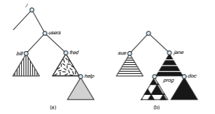
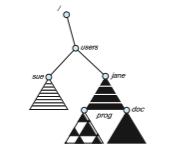

## File-System Mounting

Just as a file must be opened before it can be used, a file system must be mounted before it can be available to processes on the system.More specifically, the directory structure may be built out of multiple file-system-containing volumes, which must be mounted to make them available within the file- system name space.

Themount procedure is straightforward. The operating system is given the name of the device and the **mount point**—the location within the file structure where the file system is to be attached. Some operating systems require that a file-system type be provided, while others inspect the structures of the device  

**Figure 15.2** Solaris file systems.

and determine the type of file system. Typically, a mount point is an empty directory. For instance, on aUNIX system, a file system containing a user’s home directories might be mounted as /home; then, to access the directory structure within that file system, we could precede the directory names with /home, as in /home/jane. Mounting that file system under /users would result in the path name /users/jane, which we could use to reach the same directory.

Next, the operating system verifies that the device contains a valid file system. It does so by asking the device driver to read the device directory and verifying that the directory has the expected format. Finally, the operating system notes in its directory structure that a file system is mounted at the specified mount point. This scheme enables the operating system to traverse its directory structure, switching among file systems, and even file systems of varying types, as appropriate.

To illustrate file mounting, consider the file system depicted in Figure 15.3, where the triangles represent subtrees of directories that are of interest. Figure 15.3(a) shows an existing file system,while Figure 15.3(b) shows anunmounted volume residing on /device/dsk. At this point, only the files on the existing file system can be accessed. Figure 15.4 shows the effects of mounting the volume residing on /device/dsk over /users. If the volume is unmounted, the file system is restored to the situation depicted in Figure 15.3.

Systems impose semantics to clarify functionality. For example, a system may disallow a mount over a directory that contains files; or it may make the  

**Figure 15.3** File system. 
mounted file system available at that directory and obscure the directory’s existing files until the file system is unmounted, terminating the use of the file system and allowing access to the original files in that directory. As another example, a system may allow the same file system to be mounted repeatedly, at different mount points; or it may only allow one mount per file system.

Consider the actions of the macOS operating system.Whenever the system encounters a disk for the first time (either at boot time or while the system is running), the macOS operating system searches for a file system on the device. If it finds one, it automatically mounts the file system under the /Volumes directory, adding a folder icon labeled with the name of the file system (as stored in the device directory). The user is then able to click on the icon and thus display the newly mounted file system.

The Microsoft Windows family of operating systems maintains an extended two-level directory structure, with devices and volumes assigned drive letters. Each volume has a general graph directory structure associated

**Figure 15.4** Volume mounted at /users.  

with its drive letter. The path to a specific file takes the form drive- letter:∖path∖to∖file. The more recent versions of Windows allow a file system to be mounted anywhere in the directory tree, just as UNIX does. Windows operating systems automatically discover all devices and mount all located file systems at boot time. In some systems, like UNIX, the mount commands are explicit. A system configuration file contains a list of devices and mount points for automatic mounting at boot time, but other mounts may be executed manually.

Issues concerning file system mounting are further discussed in Section 15.3 and in Section C.7.5.
