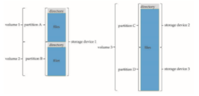

## File Systems

Certainly, no general-purpose computer stores just one file. There are typically thousands, millions, even billions of files within a computer. Files are stored on random-access storage devices, including hard disk drives, optical disks, and nonvolatile memory devices.

As you have seen in the preceding chapters, a general-purpose computer system can have multiple storage devices, and those devices can be sliced up into partitions, which hold volumes, which in turn hold file systems. Depend- ing on the volume manager, a volume may span multiple partitions as well. Figure 15.1 shows a typical file-system organization.

Computer systems may also have varying numbers of file systems, and the file systems may be of varying types. For example, a typical Solaris system may have dozens of file systems of a dozen different types, as shown in the file-system list in Figure 15.2.

In this book, we consider only general-purpose file systems. It is worth noting, though, that there are many special-purpose file systems. Consider the types of file systems in the Solaris example mentioned above:

**Figure 15.1** A typical storage device organization.

• **tmpfs**—a “temporary” file system that is created in volatile main memory and has its contents erased if the system reboots or crashes

• **objfs**—a “virtual” file system (essentially an interface to the kernel that looks like a file system) that gives debuggers access to kernel symbols

• **ctfs**—a virtual file system that maintains “contract” information to man- age which processes start when the system boots andmust continue to run during operation

• **lofs**—a “loop back” file system that allows one file system to be accessed in place of another one

• **procfs**—a virtual file system that presents information on all processes as a file system

• **ufs, zfs**—general-purpose file systems

The file systems of computers, then, can be extensive. Even within a file system, it is useful to segregate files into groups and manage and act on those groups. This organization involves the use of directories (see Section 14.3).
