  

Part Four

_Memory Management_

The main purpose of a computer system is to execute programs. These programs, together with the data they access, must be at least partially in main memory during execution.

Modern computer systems maintain several processes in memory during system execution. Many memory-management schemes exist, reflecting various approaches, and the effectiveness of each algorithm varieswith the situation. Selection of amemory-management scheme for a system depends onmany factors, especially on the system’s _hardware_ design. Most algorithms require some form of hardware support.  

# Main Memory

In Chapter 5, we showed how the CPU can be shared by a set of processes. As a result of CPU scheduling, we can improve both the utilization of the CPU and the speed of the computer’s response to its users. To realize this increase in performance, however, we must keepmany processes in memory—that is, we must share memory.

In this chapter, we discuss various ways to manage memory. The memory- management algorithms vary from a primitive bare-machine approach to a strategy that uses paging. Each approach has its own advantages and disad- vantages. Selection of a memory-management method for a specific system depends on many factors, especially on the hardware design of the system. As we shall see, most algorithms require hardware support, leading many systems to have closely integrated hardware and operating-system memory management.

**CHAPTER OBJECTIVES**

• Explain the difference between a logical and a physical address and the role of the memory management unit (MMU) in translating addresses.

• Apply first-, best-, and worst-fit strategies for allocating memory contigu- ously.

• Explain the distinction between internal and external fragmentation.

• Translate logical to physical addresses in a paging system that includes a translation look-aside buffer (TLB).

• Describe hierarchical paging, hashed paging, and inverted page tables.

• Describe address translation for IA-32, x86-64, and ARMv8 architectures.

## Background

As we saw in Chapter 1, memory is central to the operation of a modern computer system. Memory consists of a large array of bytes, each with its own address. The CPU fetches instructions from memory according to the value of

the program counter. These instructions may cause additional loading from and storing to specific memory addresses.

A typical instruction-execution cycle, for example, first fetches an instruc- tion from memory. The instruction is then decoded and may cause operands to be fetched from memory. After the instruction has been executed on the operands, results may be stored back in memory. The memory unit sees only a stream of memory addresses; it does not know how they are generated (by the instruction counter, indexing, indirection, literal addresses, and so on) or what they are for (instructions or data). Accordingly, we can ignore **_how_** a program generates amemory address.We are interested only in the sequence ofmemory addresses generated by the running program.

We begin our discussion by covering several issues that are pertinent to managing memory: basic hardware, the binding of symbolic (or virtual) mem- ory addresses to actual physical addresses, and the distinction between logical and physical addresses. We conclude the section with a discussion of dynamic linking and shared libraries.

### Basic Hardware

Main memory and the registers built into each processing core are the only general-purpose storage that the CPU can access directly. There are machine instructions that take memory addresses as arguments, but none that take disk addresses. Therefore, any instructions in execution, and any data being used by the instructions, must be in one of these direct-access storage devices. If the data are not in memory, they must be moved there before the CPU can operate on them.

Registers that are built into each CPU core are generally accessible within one cycle of the CPU clock. Some CPU cores can decode instructions and per- form simple operations on register contents at the rate of one or more opera- tions per clock tick. The same cannot be said ofmainmemory,which is accessed via a transaction on the memory bus. Completing a memory access may take many cycles of the CPU clock. In such cases, the processor normally needs to **stall**, since it does not have the data required to complete the instruction that it is executing. This situation is intolerable because of the frequency of memory accesses. The remedy is to add fast memory between the CPU and main mem- ory, typically on the CPU chip for fast access. Such a **cache** was described in Section 1.5.5. Tomanage a cache built into the CPU, the hardware automatically speeds up memory access without any operating-system control. (Recall from Section 5.5.2 that during a memory stall, a multithreaded core can switch from the stalled hardware thread to another hardware thread.)

Not only are we concerned with the relative speed of accessing physi- cal memory, but we also must ensure correct operation. For proper system operation, we must protect the operating system from access by user pro- cesses, as well as protect user processes from one another. This protectionmust be provided by the hardware, because the operating system doesn’t usually intervene between the CPU and its memory accesses (because of the resulting performance penalty). Hardware implements this production in several differ- ent ways, as we show throughout the chapter. Here, we outline one possible implementation.  
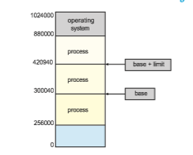
**Figure 9.1** A base and a limit register define a logical address space.

We first need to make sure that each process has a separate memory space. Separate per-processmemory space protects the processes from each other and is fundamental to having multiple processes loaded in memory for concurrent execution. To separate memory spaces, we need the ability to determine the range of legal addresses that the process may access and to ensure that the process can access only these legal addresses. We can provide this protection by using two registers, usually a base and a limit, as illustrated in Figure 9.1. The **base register** holds the smallest legal physical memory address; the **limit register** specifies the size of the range. For example, if the base register holds 300040 and the limit register is 120900, then the program can legally access all addresses from 300040 through 420939 (inclusive).

Protection of memory space is accomplished by having the CPU hardware compare every address generated in usermodewith the registers. Any attempt by a program executing in user mode to access operating-system memory or other users’ memory results in a trap to the operating system, which treats the attempt as a fatal error (Figure 9.2). This scheme prevents a user program from (accidentally or deliberately) modifying the code or data structures of either the operating system or other users.

The base and limit registers can be loaded only by the operating system, which uses a special privileged instruction. Since privileged instructions can be executed only in kernel mode, and since only the operating system executes in kernelmode, only the operating system can load the base and limit registers. This scheme allows the operating system to change the value of the registers but prevents user programs from changing the registers’ contents.

The operating system, executing in kernel mode, is given unrestricted access to both operating-system memory and users’ memory. This provision allows the operating system to load users’ programs into users’ memory, to dump out those programs in case of errors, to access and modify parameters of system calls, to perform I/O to and from user memory, and to provide many other services. Consider, for example, that an operating system for a  
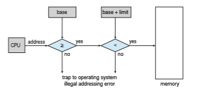

**Figure 9.2** Hardware address protection with base and limit registers.

multiprocessing systemmust execute context switches, storing the state of one process from the registers into main memory before loading the next process’s context from main memory into the registers.

### Address Binding

Usually, a program resides on a disk as a binary executable file. To run, the program must be brought into memory and placed within the context of a process (as described in Section 2.5), where it becomes eligible for execution on an available CPU. As the process executes, it accesses instructions and data frommemory. Eventually, the process terminates, and its memory is reclaimed for use by other processes.

Most systems allow a user process to reside in any part of the physical memory. Thus, although the address space of the computer may start at 00000, the first address of the user process need not be 00000. You will see later how the operating system actually places a process in physical memory.

In most cases, a user program goes through several steps—some of which may be optional—before being executed (Figure 9.3). Addressesmay be repre- sented in different ways during these steps. Addresses in the source program are generally symbolic (such as the variable count). Acompiler typically **binds** these symbolic addresses to relocatable addresses (such as “14 bytes from the beginning of this module”). The linker or loader (see Section 2.5) in turn binds the relocatable addresses to absolute addresses (such as 74014). Each binding is a mapping from one address space to another.

Classically, the binding of instructions and data to memory addresses can be done at any step along the way:

• **Compile time**. If you know at compile timewhere the processwill reside in memory, then **absolute code** can be generated. For example, if you know that a user process will reside starting at location _R,_ then the generated compiler code will start at that location and extend up from there. If, at some later time, the starting location changes, then it will be necessary to recompile this code.  

**Figure 9.3** Multistep processing of a user program.

• **Load time**. If it is not known at compile time where the process will reside in memory, then the compiler must generate **relocatable code**. In this case, final binding is delayed until load time. If the starting address changes, we need only reload the user code to incorporate this changed value.

• **Execution time**. If the process can be moved during its execution from one memory segment to another, then binding must be delayed until run time. Special hardware must be available for this scheme to work, as will be discussed in Section 9.1.3. Most operating systems use this method.

Amajor portion of this chapter is devoted to showing how these various bind- ings can be implemented effectively in a computer system and to discussing appropriate hardware support.

### Logical Versus Physical Address Space

An address generated by the CPU is commonly referred to as a **logical address**, whereas an address seen by the memory unit—that is, the one loaded into  


**Figure 9.4** Memory management unit (MMU).

the **memory-address register** of the memory—is commonly referred to as a **physical address**.

Binding addresses at either compile or load time generates identical logical and physical addresses. However, the execution-time address-binding scheme results in differing logical and physical addresses. In this case, we usually refer to the logical address as a **virtual address**. We use **_logical address_** and **_virtual address_** interchangeably in this text. The set of all logical addresses generated by a program is a **logical address space**. The set of all physical addresses corresponding to these logical addresses is a **physical address space**. Thus, in the execution-time address-binding scheme, the logical and physical address spaces differ.

The run-time mapping from virtual to physical addresses is done by a hardware device called the **memory-management unit** (**MMU**) (Figure 9.4). We can choose from many different methods to accomplish such mapping, as we discuss in Section 9.2 through Section 9.3. For the time being, we illustrate this mapping with a simple MMU scheme that is a generalization of the base- register scheme described in Section 9.1.1. The base register is now called a **relocation register**. The value in the relocation register is added to every address generated by a user process at the time the address is sent to memory (see Figure 9.5). For example, if the base is at 14000, then an attempt by the user to address location 0 is dynamically relocated to location 14000; an access to location 346 is mapped to location 14346.

The user program never accesses the real physical addresses. The program can create a pointer to location 346, store it in memory, manipulate it, and com- pare it with other addresses—all as the number 346. Only when it is used as a memory address (in an indirect load or store, perhaps) is it relocated relative to the base register. The user program deals with logical addresses. The memory- mapping hardware converts logical addresses into physical addresses. This form of execution-time binding was discussed in Section 9.1.2. The final loca- tion of a referenced memory address is not determined until the reference is made.

We now have two different types of addresses: logical addresses (in the range 0 to_max_) and physical addresses (in the range _R_ \+ 0 to _R_ +_max_ for a base value _R_). The user program generates only logical addresses and thinks that the process runs in memory locations from 0 to _max._ However, these logical addresses must be mapped to physical addresses before they are used. The  

**Figure 9.5** Dynamic relocation using a relocation register.

concept of a logical address space that is bound to a separate physical address space is central to proper memory management.

### Dynamic Loading

In our discussion so far, it has been necessary for the entire program and all data of a process to be in physical memory for the process to execute. The size of a process has thus been limited to the size of physical memory. To obtain better memory-space utilization, we can use **dynamic loading**. With dynamic loading, a routine is not loaded until it is called. All routines are kept on disk in a relocatable load format. The main program is loaded into memory and is executed. When a routine needs to call another routine, the calling routine first checks to see whether the other routine has been loaded. If it has not, the relocatable linking loader is called to load the desired routine intomemory and to update the program’s address tables to reflect this change. Then control is passed to the newly loaded routine.

The advantage of dynamic loading is that a routine is loaded only when it is needed. This method is particularly useful when large amounts of code are needed to handle infrequently occurring cases, such as error routines. In such a situation, although the total program size may be large, the portion that is used (and hence loaded) may be much smaller.

Dynamic loading does not require special support from the operating system. It is the responsibility of the users to design their programs to take advantage of such a method. Operating systems may help the programmer, however, by providing library routines to implement dynamic loading.

### Dynamic Linking and Shared Libraries

**Dynamically linked libraries** (**DLLs**) are system libraries that are linked to user programswhen the programs are run (refer back to Figure 9.3). Some operating systems support only **static linking**, in which system libraries are treated like any other object module and are combined by the loader into the binary program image. Dynamic linking, in contrast, is similar to dynamic loading. Here, though, linking, rather than loading, is postponed until execution time. This feature is usually used with system libraries, such as the standard C language library.Without this facility, each programon a systemmust include a copy of its language library (or at least the routines referenced by the program) in the executable image. This requirement not only increases the size of an executable image but also may waste main memory. A second advantage of DLLs is that these libraries can be shared among multiple processes, so that only one instance of the DLL in main memory. For this reason, DLLs are also known as **shared libraries**, and are used extensively in Windows and Linux systems.

When a program references a routine that is in a dynamic library, the loader locates the DLL, loading it into memory if necessary. It then adjusts addresses that reference functions in the dynamic library to the location inmemorywhere the DLL is stored.

Dynamically linked libraries can be extended to library updates (such as bug fixes). In addition, a library may be replaced by a new version, and all programs that reference the library will automatically use the new version. Without dynamic linking, all such programs would need to be relinked to gain access to the new library. So that programs will not accidentally execute new, incompatible versions of libraries, version information is included in both the program and the library. More than one version of a library may be loaded into memory, and each program uses its version information to decide which copy of the library to use. Versions with minor changes retain the same version number, whereas versions with major changes increment the number. Thus, only programs that are compiled with the new library version are affected by any incompatible changes incorporated in it. Other programs linked before the new library was installed will continue using the older library.

Unlike dynamic loading, dynamic linking and shared libraries generally require help from the operating system. If the processes in memory are pro- tected from one another, then the operating system is the only entity that can check to see whether the needed routine is in another process’s memory space or that can allow multiple processes to access the same memory addresses. We elaborate on this concept, as well as how DLLs can be shared by multiple processes, when we discuss paging in Section 9.3.4.

## Contiguous Memory Allocation

The main memory must accommodate both the operating system and the various user processes. We therefore need to allocate main memory in the most efficientway possible. This section explains one earlymethod, contiguous memory allocation.

The memory is usually divided into two partitions: one for the operating system and one for the user processes. We can place the operating system in either low memory addresses or high memory addresses. This decision depends onmany factors, such as the location of the interrupt vector. However, many operating systems (including Linux and Windows) place the operating system in high memory, and therefore we discuss only that situation.  

We usually want several user processes to reside in memory at the same time. We therefore need to consider how to allocate available memory to the processes that are waiting to be brought into memory. In **contiguous mem- ory allocation**, each process is contained in a single section of memory that is contiguous to the section containing the next process. Before discussing this memory allocation scheme further, though, we must address the issue of memory protection.

### Memory Protection

We can prevent a process from accessing memory that it does not own by combining two ideas previously discussed. If we have a system with a relo- cation register (Section 9.1.3), together with a limit register (Section 9.1.1), we accomplish our goal. The relocation register contains the value of the smallest physical address; the limit register contains the range of logical addresses (for example, relocation = 100040 and limit = 74600). Each logical address must fall within the range specified by the limit register. The MMU maps the log- ical address dynamically by adding the value in the relocation register. This mapped address is sent to memory (Figure 9.6).

When the CPU scheduler selects a process for execution, the dispatcher loads the relocation and limit registers with the correct values as part of the context switch. Because every address generated by a CPU is checked against these registers, we can protect both the operating system and the other users’ programs and data from being modified by this running process.

The relocation-register scheme provides an effectiveway to allow the oper- ating system’s size to change dynamically. This flexibility is desirable in many situations. For example, the operating system contains code and buffer space for device drivers. If a device driver is not currently in use, it makes little sense to keep it in memory; instead, it can be loaded into memory only when it is needed. Likewise, when the device driver is no longer needed, it can be removed and its memory allocated for other needs.
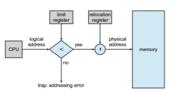

**Figure 9.6** Hardware support for relocation and limit registers.  

### Memory Allocation

Nowweare ready to turn tomemory allocation.One of the simplestmethods of allocating memory is to assign processes to variably sized partitions in mem- ory, where each partition may contain exactly one process. In this **variable- partition** scheme, the operating system keeps a table indicating which parts of memory are available andwhich are occupied. Initially, all memory is available for user processes and is considered one large block of available memory, a **hole**. Eventually, as you will see, memory contains a set of holes of various sizes.

Figure 9.7 depicts this scheme. Initially, the memory is fully utilized, con- taining processes 5, 8, and 2. After process 8 leaves, there is one contiguous hole. Later on, process 9 arrives and is allocated memory. Then process 5 departs, resulting in two noncontiguous holes.

As processes enter the system, the operating system takes into account the memory requirements of each process and the amount of available memory space in determining which processes are allocated memory. When a process is allocated space, it is loaded into memory, where it can then compete for CPU time. When a process terminates, it releases its memory, which the operating system may then provide to another process.

What happens when there isn’t sufficient memory to satisfy the demands of an arriving process? One option is to simply reject the process and provide an appropriate error message. Alternatively, we can place such processes into a wait queue. When memory is later released, the operating system checks the wait queue to determine if it will satisfy the memory demands of a waiting process.

In general, as mentioned, the memory blocks available comprise a **_set_** of holes of various sizes scattered throughout memory. When a process arrives and needs memory, the system searches the set for a hole that is large enough for this process. If the hole is too large, it is split into two parts. One part is allocated to the arriving process; the other is returned to the set of holes. When a process terminates, it releases its block of memory, which is then placed back in the set of holes. If the newhole is adjacent to other holes, these adjacent holes are merged to form one larger hole.

This procedure is a particular instance of the general **dynamic storage- allocation problem**, which concerns how to satisfy a request of size _n_ from a list of free holes. There aremany solutions to this problem. The **first-fit, best-fi** , and **worst-fi** strategies are the ones most commonly used to select a free hole from the set of available holes.
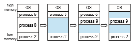
**Figure 9.7** Variable partition.  

• **First fit.** Allocate the first hole that is big enough. Searching can start either at the beginning of the set of holes or at the location where the previous first-fit search ended. We can stop searching as soon as we find a free hole that is large enough.

• **Best fi** . Allocate the smallest hole that is big enough. We must search the entire list, unless the list is ordered by size. This strategy produces the smallest leftover hole.

• **Worst fit.** Allocate the largest hole. Again, we must search the entire list, unless it is sorted by size. This strategy produces the largest leftover hole, which may be more useful than the smaller leftover hole from a best-fit approach.

Simulations have shown that both first fit and best fit are better than worst fit in terms of decreasing time and storage utilization. Neither first fit nor best fit is clearly better than the other in terms of storage utilization, but first fit is generally faster.

### Fragmentation

Both the first-fit and best-fit strategies for memory allocation suffer from **exter- nal fragmentation**. As processes are loaded and removed from memory, the free memory space is broken into little pieces. External fragmentation exists when there is enough total memory space to satisfy a request but the available spaces are not contiguous: storage is fragmented into a large number of small holes. This fragmentation problem can be severe. In the worst case, we could have a block of free (or wasted) memory between every two processes. If all these small pieces of memory were in one big free block instead, we might be able to run several more processes.

Whether we are using the first-fit or best-fit strategy can affect the amount of fragmentation. (First fit is better for some systems, whereas best fit is better for others.) Another factor is which end of a free block is allocated. (Which is the leftover piece—the one on the top or the one on the bottom?) No matter which algorithm is used, however, external fragmentation will be a problem.

Depending on the total amount ofmemory storage and the average process size, external fragmentation may be a minor or a major problem. Statistical analysis of first fit, for instance, reveals that, even with some optimization, given _N_ allocated blocks, another 0.5 _N_ blocks will be lost to fragmentation. That is, one-third of memory may be unusable! This property is known as the **50-percent rule**.

Memory fragmentation can be internal as well as external. Consider a multiple-partition allocation scheme with a hole of 18,464 bytes. Suppose that the next process requests 18,462 bytes. If we allocate exactly the requested block, we are left with a hole of 2 bytes. The overhead to keep track of this hole will be substantially larger than the hole itself. The general approach to avoiding this problem is to break the physical memory into fixed-sized blocks and allocate memory in units based on block size. With this approach, the memory allocated to a process may be slightly larger than the requested memory. The difference between these two numbers is **internal fragmentation** —unused memory that is internal to a partition.  

One solution to the problem of external fragmentation is **compaction**. The goal is to shuffle the memory contents so as to place all free memory together in one large block. Compaction is not always possible, however. If relocation is static and is done at assembly or load time, compaction cannot be done. It is possible only if relocation is dynamic and is done at execution time. If addresses are relocated dynamically, relocation requires only moving the program and data and then changing the base register to reflect the new base address. When compaction is possible, we must determine its cost. The simplest compaction algorithm is tomove all processes toward one end ofmemory; all holesmove in the other direction, producing one large hole of availablememory. This scheme can be expensive.

Another possible solution to the external-fragmentation problem is to per- mit the logical address space of processes to be noncontiguous, thus allowing a process to be allocated physical memory wherever such memory is available. This is the strategy used in **_paging,_** the most common memory-management technique for computer systems. We describe paging in the following section.

Fragmentation is a general problem in computing that can occur wherever we must manage blocks of data. We discuss the topic further in the storage management chapters (Chapter 11 through Chapter 15).

## Paging

Memory management discussed thus far has required the physical address space of a process to be contiguous. We now introduce **paging**, a memory- management scheme that permits a process’s physical address space to be non- contiguous. Paging avoids external fragmentation and the associated need for compaction, two problems that plague contiguousmemory allocation. Because it offers numerous advantages, paging in its various forms is used inmost oper- ating systems, from those for large servers through those for mobile devices. Paging is implemented through cooperation between the operating systemand the computer hardware.

### Basic Method

The basic method for implementing paging involves breaking physical mem- ory into fixed-sized blocks called **frames** and breaking logical memory into blocks of the same size called **pages**. When a process is to be executed, its pages are loaded into any availablememory frames from their source (a file system or the backing store). The backing store is divided into fixed-sized blocks that are the same size as the memory frames or clusters of multiple frames. This rather simple idea has great functionality and wide ramifications. For example, the logical address space is now totally separate from the physical address space, so a process can have a logical 64-bit address space even though the system has less than 264 bytes of physical memory.

Every address generated by the CPU is divided into two parts: a **page number** (**p**) and a **page offset** (**d**):

**Figure 9.8** Paging hardware.

The page number is used as an index into a per-process **page table**. This is illustrated in Figure 9.8. The page table contains the base address of each frame in physical memory, and the offset is the location in the frame being referenced. Thus, the base address of the frame is combined with the page offset to define the physicalmemory address. The pagingmodel ofmemory is shown in Figure 9.9.

The following outlines the steps taken by the MMU to translate a logical address generated by the CPU to a physical address:

**1\.** Extract the page number _p_ and use it as an index into the page table.

**2\.** Extract the corresponding frame number _f_ from the page table.

**3\.** Replace the page number _p_ in the logical address with the frame number _f_ .

As the offset _d_ does not change, it is not replaced, and the frame number and offset now comprise the physical address.

The page size (like the frame size) is defined by the hardware. The size of a page is a power of 2, typically varying between 4 KB and 1 GB per page, depending on the computer architecture. The selection of a power of 2 as a page size makes the translation of a logical address into a page number and page offset particularly easy. If the size of the logical address space is 2_m_, and a page size is 2_n_ bytes, then the high-order_m_−_n_ bits of a logical address designate the page number, and the _n_ low-order bits designate the page offset. Thus, the logical address is as follows:

**Figure 9.9** Paging model of logical and physical memory.

where _p_ is an index into the page table and _d_ is the displacement within the page.

As a concrete (although minuscule) example, consider the memory in Figure 9.10. Here, in the logical address, _n_ \= 2 and _m_ \= 4. Using a page size of 4 bytes and a physical memory of 32 bytes (8 pages), we show how the programmer’s view of memory can be mapped into physical memory. Logical address 0 is page 0, offset 0. Indexing into the page table, we find that page 0 is in frame 5. Thus, logical address 0 maps to physical address 20 \[= (5 × 4) + 0\]. Logical address 3 (page 0, offset 3) maps to physical address 23 \[= (5 × 4) + 3\]. Logical address 4 is page 1, offset 0; according to the page table, page 1 is mapped to frame 6. Thus, logical address 4 maps to physical address 24 \[= (6 × 4) + 0\]. Logical address 13 maps to physical address 9.

You may have noticed that paging itself is a form of dynamic relocation. Every logical address is bound by the paging hardware to some physical address. Using paging is similar to using a table of base (or relocation) registers, one for each frame of memory.

When we use a paging scheme, we have no external fragmentation: any free frame can be allocated to a process that needs it. However, we may have some internal fragmentation. Notice that frames are allocated as units. If the memory requirements of a process do not happen to coincidewith page bound- aries, the last frame allocated may not be completely full. For example, if page size is 2,048 bytes, a process of 72,766 bytes will need 35 pages plus 1,086 bytes. It will be allocated 36 frames, resulting in internal fragmentation of 2,048 − 1,086 = 962 bytes. In the worst case, a process would need _n_ pages plus 1 byte. It would be allocated _n_ \+ 1 frames, resulting in internal fragmentation of almost an entire frame.  


**Figure 9.10** Paging example for a 32-byte memory with 4-byte pages.

If process size is independent of page size, we expect internal fragmen- tation to average one-half page per process. This consideration suggests that small page sizes are desirable. However, overhead is involved in each page- table entry, and this overhead is reduced as the size of the pages increases. Also, disk I/O is more efficient when the amount of data being transferred is larger (Chapter 11). Generally, page sizes have grown over time as processes, data sets, and main memory have become larger. Today, pages are typically either 4 KB or 8 KB in size, and some systems support even larger page sizes. Some CPUs and operating systems even support multiple page sizes. For instance, on x86-64 systems, Windows 10 supports page sizes of 4 KB and 2 MB. Linux also supports twopage sizes: a default page size (typically 4 KB) and an architecture- dependent larger page size called **huge pages**.

Frequently, on a 32-bit CPU, each page-table entry is 4 bytes long, but that size can vary as well. A 32-bit entry can point to one of 232 physical page frames. If the frame size is 4 KB (212), then a system with 4-byte entries can address 244 bytes (or 16 TB) of physical memory. We should note here that the size of physical memory in a paged memory system is typically different from the maximum logical size of a process. As we further explore paging, we will  

**_OBTAINING THE PAGE SIZE ON LINUX SYSTEMS_**

On a Linux system, the page size varies according to architecture, and there are several ways of obtaining the page size. One approach is to use the system call getpagesize(). Another strategy is to enter the following command on the command line:

getconf PAGESIZE

Each of these techniques returns the page size as a number of bytes.

introduce other information that must be kept in the page-table entries. That information reduces the number of bits available to address page frames. Thus, a systemwith 32-bit page-table entries may address less physical memory than the possible maximum.

When a process arrives in the system to be executed, its size, expressed in pages, is examined. Each page of the process needs one frame. Thus, if the process requires _n_ pages, at least _n_ frames must be available in memory. If _n_ frames are available, they are allocated to this arriving process. The first page of the process is loaded into one of the allocated frames, and the frame number is put in the page table for this process. The next page is loaded into another frame, its frame number is put into the page table, and so on (Figure 9.11).

An important aspect of paging is the clear separation between the pro- grammer’s view of memory and the actual physical memory. The programmer views memory as one single space, containing only this one program. In fact, the user program is scattered throughout physical memory, which also holds
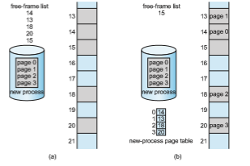
**Figure 9.11** Free frames (a) before allocation and (b) after allocation.  

other programs. The difference between the programmer’s view of memory and the actual physical memory is reconciled by the address-translation hard- ware. The logical addresses are translated into physical addresses. This map- ping is hidden from the programmer and is controlled by the operating system. Notice that the user process by definition is unable to access memory it does not own. It has no way of addressingmemory outside of its page table, and the table includes only those pages that the process owns.

Since the operating system ismanaging physical memory, it must be aware of the allocation details of physical memory—which frames are allocated, which frames are available, how many total frames there are, and so on. This information is generally kept in a single, system-wide data structure called a **frame table**. The frame table has one entry for each physical page frame, indicating whether the latter is free or allocated and, if it is allocated, to which page of which process (or processes).

In addition, the operating system must be aware that user processes oper- ate in user space, and all logical addressesmust bemapped to produce physical addresses. If a user makes a system call (to do I/O, for example) and provides an address as a parameter (a buffer, for instance), that addressmust bemapped to produce the correct physical address. The operating systemmaintains a copy of the page table for each process, just as it maintains a copy of the instruction counter and register contents. This copy is used to translate logical addresses to physical addresseswhenever the operating systemmust map a logical address to a physical address manually. It is also used by the CPU dispatcher to define the hardware page table when a process is to be allocated the CPU. Paging therefore increases the context-switch time.

### Hardware Support

As page tables are per-process data structures, a pointer to the page table is stored with the other register values (like the instruction pointer) in the process control block of each process.When the CPU scheduler selects a process for execution, it must reload the user registers and the appropriate hardware page-table values from the stored user page table.

The hardware implementation of the page table can be done in several ways. In the simplest case, the page table is implemented as a set of dedicated high-speed hardware registers,whichmakes the page-address translation very efficient. However, this approach increases context-switch time, as each one of these registers must be exchanged during a context switch.

The use of registers for the page table is satisfactory if the page table is rea- sonably small (for example, 256 entries). Most contemporary CPUs, however, support much larger page tables (for example, 220 entries). For these machines, the use of fast registers to implement the page table is not feasible. Rather, the page table is kept in main memory, and a **page-table base register** (**PTBR**) points to the page table. Changing page tables requires changing only this one register, substantially reducing context-switch time.

#### Translation Look-Aside Buffer

Although storing the page table in main memory can yield faster context switches, it may also result in slower memory access times. Suppose we want to access location _i._We must first index into the page table, using the value in  

the PTBR offset by the page number for _i_. This task requires onememory access. It provides us with the frame number, which is combined with the page offset to produce the actual address.We can then access the desired place inmemory. With this scheme, **_two_**memory accesses are needed to access data (one for the page-table entry and one for the actual data). Thus,memory access is slowedby a factor of 2, a delay that is considered intolerable under most circumstances.

The standard solution to this problem is to use a special, small, fast-lookup hardware cache called a **translation look-aside buffer** (**TLB**). The TLB is asso- ciative, high-speed memory. Each entry in the TLB consists of two parts: a key (or tag) and a value. When the associative memory is presented with an item, the item is compared with all keys simultaneously. If the item is found, the cor- responding value field is returned. The search is fast; a TLB lookup in modern hardware is part of the instruction pipeline, essentially adding no performance penalty. To be able to execute the search within a pipeline step, however, the TLBmust be kept small. It is typically between 32 and 1,024 entries in size. Some CPUs implement separate instruction and data address TLBs. That can double the number of TLB entries available, because those lookups occur in different pipeline steps. We can see in this development an example of the evolution of CPU technology: systems have evolved fromhaving no TLBs to havingmultiple levels of TLBs, just as they have multiple levels of caches.

The TLB is used with page tables in the following way. The TLB contains only a few of the page-table entries. When a logical address is generated by the CPU, the MMU first checks if its page number is present in the TLB. If the page number is found, its frame number is immediately available and is used to access memory. As just mentioned, these steps are executed as part of the instruction pipeline within the CPU, adding no performance penalty compared with a system that does not implement paging.

If the page number is not in the TLB (known as a **TLB miss**), address translation proceeds following the steps illustrated in Section 9.3.1, where a memory reference to the page table must be made. When the frame number is obtained, we can use it to access memory (Figure 9.12). In addition, we add the page number and frame number to the TLB, so that they will be found quickly on the next reference.

If the TLB is already full of entries, an existing entry must be selected for replacement. Replacement policies range from least recently used (LRU) through round-robin to random. Some CPUs allow the operating system to par- ticipate in LRU entry replacement, while others handle the matter themselves. Furthermore, some TLBs allow certain entries to be **wired down**, meaning that they cannot be removed from the TLB. Typically, TLB entries for key kernel code are wired down.

Some TLBs store **address-space identifier** (**ASIDs**) in each TLB entry. An ASID uniquely identifies each process and is used to provide address-space protection for that process.When the TLB attempts to resolve virtual page num- bers, it ensures that the ASID for the currently running process matches the ASID associated with the virtual page. If the ASIDs do not match, the attempt is treated as a TLB miss. In addition to providing address-space protection, an ASID allows the TLB to contain entries for several different processes simulta- neously. If the TLB does not support separate ASIDs, then every time a new page table is selected (for instance, with each context switch), the TLB must be **flushe** (or erased) to ensure that the next executing process does not use the  
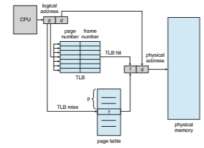
**Figure 9.12** Paging hardware with TLB.

wrong translation information. Otherwise, the TLB could include old entries that contain valid virtual addresses but have incorrect or invalid physical addresses left over from the previous process.

The percentage of times that the page number of interest is found in the TLB is called the **hit ratio**. An 80-percent hit ratio, for example, means that we find the desired page number in the TLB 80 percent of the time. If it takes 10 nanoseconds to access memory, then a mapped-memory access takes 10 nanoseconds when the page number is in the TLB. If we fail to find the page number in the TLB then we must first access memory for the page table and frame number (10 nanoseconds) and then access the desired byte in memory (10 nanoseconds), for a total of 20 nanoseconds. (We are assuming that a page- table lookup takes only one memory access, but it can take more, as we shall see.) To find the **effective memory-access time**, we weight the case by its probability:

effective access time = 0.80 × 10 + 0.20 × 20 = 12 nanoseconds

In this example, we suffer a 20-percent slowdown in average memory-access time (from 10 to 12 nanoseconds). For a 99-percent hit ratio, which is much more realistic, we have

effective access time = 0.99 × 10 + 0.01 × 20 = 10.1 nanoseconds

This increased hit rate produces only a 1 percent slowdown in access time.  

As noted earlier, CPUs todaymay providemultiple levels of TLBs. Calculat- ing memory access times in modern CPUs is therefore much more complicated than shown in the example above. For instance, the Intel Core i7 CPU has a 128-entry L1 instruction TLB and a 64-entry L1 data TLB. In the case of a miss at L1, it takes the CPU six cycles to check for the entry in the L2 512-entry TLB. A miss in L2 means that the CPU must either walk through the page-table entries in memory to find the associated frame address, which can take hundreds of cycles, or interrupt to the operating system to have it do the work.

A complete performance analysis of paging overhead in such a system would require miss-rate information about each TLB tier. We can see from the general information above, however, that hardware features can have a signif- icant effect onmemory performance and that operating-system improvements (such as paging) can result in and, in turn, be affected by hardware changes (such as TLBs). We will further explore the impact of the hit ratio on the TLB in Chapter 10.

TLBs are a hardware feature and thereforewould seem to be of little concern to operating systems and their designers. But the designer needs to understand the function and features of TLBs, which vary by hardware platform. For opti- mal operation, an operating-system design for a given platform must imple- ment paging according to the platform’s TLB design. Likewise, a change in the TLB design (for example, between different generations of Intel CPUs) may necessitate a change in the paging implementation of the operating systems that use it.

### Protection

Memory protection in a paged environment is accomplished by protection bits associated with each frame. Normally, these bits are kept in the page table.

One bit can define a page to be read–write or read-only. Every reference to memory goes through the page table to find the correct frame number. At the same time that the physical address is being computed, the protection bits can be checked to verify that no writes are being made to a read-only page. An attempt to write to a read-only page causes a hardware trap to the operating system (or memory-protection violation).

We can easily expand this approach to provide a finer level of protection. We can create hardware to provide read-only, read–write, or execute-only protection; or, by providing separate protection bits for each kind of access, we can allow any combination of these accesses. Illegal attempts will be trapped to the operating system.

One additional bit is generally attached to each entry in the page table: a **valid–invalid** bit. When this bit is set to _valid,_ the associated page is in the process’s logical address space and is thus a legal (or valid) page. When the bit is set to _invalid,_ the page is not in the process’s logical address space. Illegal addresses are trapped by use of the valid–invalid bit. The operating system sets this bit for each page to allow or disallow access to the page.

Suppose, for example, that in a system with a 14-bit address space (0 to 16383), we have a program that should use only addresses 0 to 10468. Given a page size of 2 KB, we have the situation shown in Figure 9.13. Addresses in pages 0, 1, 2, 3, 4, and 5 are mapped normally through the page table. Any attempt to generate an address in pages 6 or 7, however, will find that the  

**Figure 9.13** Valid (v) or invalid (i) bit in a page table.

valid–invalid bit is set to invalid, and the computer will trap to the operating system (invalid page reference).

Notice that this scheme has created a problem. Because the program extends only to address 10468, any reference beyond that address is illegal. However, references to page 5 are classified as valid, so accesses to addresses up to 12287 are valid. Only the addresses from 12288 to 16383 are invalid. This problem is a result of the 2-KB page size and reflects the internal fragmentation of paging.

Rarely does a process use all its address range. In fact, many processes use only a small fraction of the address space available to them. It would be wasteful in these cases to create a page table with entries for every page in the address range. Most of this table would be unused but would take up valuable memory space. Some systems provide hardware, in the form of a **page-table length register** (**PTLR**), to indicate the size of the page table. This value is checked against every logical address to verify that the address is in the valid range for the process. Failure of this test causes an error trap to the operating system.

### Shared Pages

Anadvantage of paging is the possibility of **_sharing_** common code, a considera- tion that is particularly important in an environment with multiple processes. Consider the standard C library, which provides a portion of the system call interface for many versions of UNIX and Linux. On a typical Linux system, most user processes require the standard C library libc. One option is to have  

each process load its own copy of libc into its address space. If a system has 40 user processes, and the libc library is 2 MB, this would require 80 MB of memory.

If the code is **reentrant code**, however, it can be shared, as shown in Figure 9.14. Here, we see three processes sharing the pages for the standard C library libc. (Although the figure shows the libc library occupying four pages, in reality, it would occupy more.) Reentrant code is non-self-modifying code: it never changes during execution. Thus, two or more processes can execute the same code at the same time. Each process has its own copy of registers and data storage to hold the data for the process’s execution. The data for two different processes will, of course, be different. Only one copy of the standard C library need be kept in physicalmemory, and the page table for each user processmaps onto the same physical copy of libc. Thus, to support 40 processes, we need only one copy of the library, and the total space now required is 2 MB instead of 80 MB—a significant saving!

In addition to run-time libraries such as libc, other heavily used programs can also be shared—compilers, window systems, database systems, and so on. The shared libraries discussed in Section 9.1.5 are typically implemented with shared pages. To be sharable, the code must be reentrant. The read-only nature of shared code should not be left to the correctness of the code; the operating system should enforce this property.
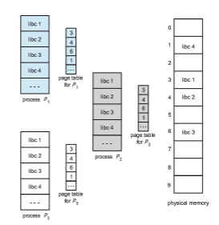
**Figure 9.14** Sharing of standard C library in a paging environment.  

The sharing of memory among processes on a system is similar to the sharing of the address space of a task by threads, described in Chapter 4. Furthermore, recall that in Chapter 3we described sharedmemory as amethod of interprocess communication. Some operating systems implement shared memory using shared pages.

Organizing memory according to pages provides numerous benefits in addition to allowing several processes to share the same physical pages. We cover several other benefits in Chapter 10.

## Structure of the Page Table

In this section,we explore some of themost common techniques for structuring the page table, including hierarchical paging, hashed page tables, and inverted page tables.

### Hierarchical Paging

Most modern computer systems support a large logical address space (232 to 264). In such an environment, the page table itself becomes excessively large. For example, consider a systemwith a 32-bit logical address space. If the page size in such a system is 4 KB (212), then a page table may consist of over 1 million entries (220 = 232/212). Assuming that each entry consists of 4 bytes, each process may need up to 4 MB of physical address space for the page table alone. Clearly, we would not want to allocate the page table contiguously in main memory. One simple solution to this problem is to divide the page table into smaller pieces. We can accomplish this division in several ways.

One way is to use a two-level paging algorithm, in which the page table itself is also paged (Figure 9.15). For example, consider again the system with a 32-bit logical address space and a page size of 4 KB. A logical address is divided into a page number consisting of 20 bits and a page offset consisting of 12 bits. Because we page the page table, the page number is further divided into a 10-bit page number and a 10-bit page offset. Thus, a logical address is as follows:

where _p_1 is an index into the outer page table and _p_2 is the displacement within the page of the inner page table. The address-translationmethod for this architecture is shown in Figure 9.16. Because address translation works from the outer page table inward, this scheme is also known as a **forward-mapped** page table.

For a systemwith a 64-bit logical address space, a two-level paging scheme is no longer appropriate. To illustrate this point, let’s suppose that the page size in such a system is 4 KB (212). In this case, the page table consists of up to 252 entries. If we use a two-level paging scheme, then the inner page tables can conveniently be one page long, or contain 210 4-byte entries. The addresses look like this:  


The outer page table consists of 242 entries, or 244 bytes. The obvious way to avoid such a large table is to divide the outer page table into smaller pieces. (This approach is also used on some 32-bit processors for added flexibility and efficiency.)

We can divide the outer page table in various ways. For example, we can page the outer page table, giving us a three-level paging scheme. Suppose that the outer page table ismade up of standard-size pages (210 entries, or 212 bytes). In this case, a 64-bit address space is still daunting:

The outer page table is still 234 bytes (16 GB) in size. The next stepwould be a four-level paging scheme, where the second-level

outer page table itself is also paged, and so forth. The 64-bit UltraSPARC would require seven levels of paging—a prohibitive number of memory accesses—  


**Figure 9.16** Address translation for a two-level 32-bit paging architecture.

to translate each logical address. You can see from this example why, for 64-bit architectures, hierarchical page tables are generally considered inappropriate.

### Hashed Page Tables

One approach for handling address spaces larger than 32 bits is to use a **hashed page table**, with the hash value being the virtual page number. Each entry in the hash table contains a linked list of elements that hash to the same location (to handle collisions). Each element consists of three fields: (1) the virtual page number, (2) the value of the mapped page frame, and (3) a pointer to the next element in the linked list.

The algorithm works as follows: The virtual page number in the virtual address is hashed into the hash table. The virtual page number is compared with field 1 in the first element in the linked list. If there is a match, the corresponding page frame (field 2) is used to form the desiredphysical address. If there is no match, subsequent entries in the linked list are searched for a matching virtual page number. This scheme is shown in Figure 9.17.
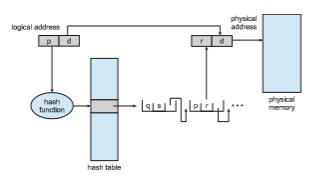
**Figure 9.17** Hashed page table.  

A variation of this scheme that is useful for 64-bit address spaces has been proposed. This variation uses **clustered page tables**, which are similar to hashed page tables except that each entry in the hash table refers to several pages (such as 16) rather than a single page. Therefore, a single page-table entry can store the mappings for multiple physical-page frames. Clustered page tables are particularly useful for **sparse** address spaces, where memory references are noncontiguous and scattered throughout the address space.

### Inverted Page Tables

Usually, each process has an associated page table. The page table has one entry for each page that the process is using (or one slot for each virtual address, regardless of the latter’s validity). This table representation is a natural one, since processes reference pages through the pages’ virtual addresses. The operating system must then translate this reference into a physical memory address. Since the table is sorted by virtual address, the operating system is able to calculate where in the table the associated physical address entry is located and to use that value directly. One of the drawbacks of this method is that each page table may consist of millions of entries. These tables may consume large amounts of physical memory just to keep track of how other physical memory is being used.

To solve this problem, we can use an **inverted page table**. An inverted page table has one entry for each real page (or frame) of memory. Each entry consists of the virtual address of the page stored in that real memory location, with information about the process that owns the page. Thus, only one page table is in the system, and it has only one entry for each page of physical memory. Figure 9.18 shows the operation of an inverted page table. Compare it with Figure 9.8, which depicts a standard page table in operation. Inverted page tables often require that an address-space identifier (Section 9.3.2) be stored in each entry of the page table, since the table usually contains several
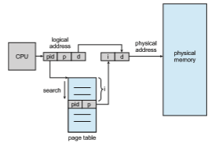
**Figure 9.18** Inverted page table.  

different address spaces mapping physical memory. Storing the address-space identifier ensures that a logical page for a particular process is mapped to the corresponding physical page frame. Examples of systems using inverted page tables include the 64-bit UltraSPARC and PowerPC.

To illustrate this method, we describe a simplified version of the inverted page table used in the IBM RT. IBM was the first major company to use inverted page tables, starting with the IBM System 38 and continuing through the RS/6000 and the current IBM Power CPUs. For the IBM RT, each virtual address in the system consists of a triple:

_<_process-id, page-number, offset_\>_.

Each inverted page-table entry is a pair _<_process-id, page-number_\>_where the process-id assumes the role of the address-space identifier. When a memory reference occurs, part of the virtual address, consisting of _<_process-id, page- number_\>_, is presented to the memory subsystem. The inverted page table is then searched for a match. If a match is found—say, at entry _i_—then the physical address _<i,_ offset_\>_ is generated. If no match is found, then an illegal address access has been attempted.

Although this scheme decreases the amount of memory needed to store each page table, it increases the amount of time needed to search the tablewhen a page reference occurs. Because the inverted page table is sorted by physical address, but lookups occur on virtual addresses, the whole table might need to be searched before a match is found. This search would take far too long. To alleviate this problem, we use a hash table, as described in Section 9.4.2, to limit the search to one—or at most a few—page-table entries. Of course, each access to the hash table adds a memory reference to the procedure, so one virtualmemory reference requires at least two realmemory reads—one for the hash-table entry and one for the page table. (Recall that the TLB is searched first, before the hash table is consulted, offering some performance improvement.)

One interesting issue with inverted page tables involves shared memory. With standard paging, each process has its own page table, which allows multiple virtual addresses to be mapped to the same physical address. This method cannot be used with inverted page tables; because there is only one virtual page entry for every physical page, one physical page cannot have two (or more) shared virtual addresses. Therefore, with inverted page tables, only one mapping of a virtual address to the shared physical address may occur at any given time. A reference by another process sharing the memory will result in a page fault and will replace the mapping with a different virtual address.

### Oracle SPARC Solaris

Consider as a final example a modern 64-bit CPU and operating system that are tightly integrated to provide low-overhead virtual memory. **Solaris** running on the **SPARC** CPU is a fully 64-bit operating system and as such has to solve the problem of virtual memory without using up all of its physical memory by keeping multiple levels of page tables. Its approach is a bit complex but solves the problem efficiently using hashed page tables. There are two hash tables—one for the kernel and one for all user processes. Each maps memory addresses from virtual to physical memory. Each hash-table entry represents a contiguous area of mapped virtual memory, which is more efficient than  

having a separate hash-table entry for each page. Each entry has a base address and a span indicating the number of pages the entry represents.

Virtual-to-physical translationwould take too long if each address required searching through a hash table, so the CPU implements a TLB that holds transla- tion table entries (TTEs) for fast hardware lookups. Acache of these TTEs resides in a translation storage buffer (TSB), which includes an entry per recently accessed page.When a virtual address reference occurs, the hardware searches the TLB for a translation. If none is found, the hardware walks through the in- memory TSB looking for the TTE that corresponds to the virtual address that caused the lookup. This **TLB walk** functionality is found on many modern CPUs. If a match is found in the TSB, the CPU copies the TSB entry into the TLB, and the memory translation completes. If no match is found in the TSB, the kernel is interrupted to search the hash table. The kernel then creates a TTE from the appropriate hash table and stores it in the TSB for automatic loading into the TLB by the CPU memory-management unit. Finally, the interrupt han- dler returns control to the MMU, which completes the address translation and retrieves the requested byte or word from main memory.

## Swapping

Process instructions and the data they operate on must be in memory to be executed. However, a process, or a portion of a process, can be **swapped** temporarily out of memory to a **backing store** and then brought back into memory for continued execution (Figure 9.19). Swapping makes it possible for the total physical address space of all processes to exceed the real physical memory of the system, thus increasing the degree of multiprogramming in a system.
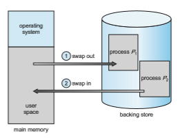
**Figure 9.19** Standard swapping of two processes using a disk as a backing store.  

### Standard Swapping

Standard swapping involves moving entire processes between main memory and a backing store. The backing store is commonly fast secondary storage. It must be large enough to accommodate whatever parts of processes need to be stored and retrieved, and it must provide direct access to these memory images. When a process or part is swapped to the backing store, the data structures associated with the process must be written to the backing store. For a multithreaded process, all per-thread data structures must be swapped as well. The operating system must also maintain metadata for processes that have been swapped out, so they can be restored when they are swapped back in to memory.

The advantage of standard swapping is that it allows physical memory to be oversubscribed, so that the system can accommodate more processes than there is actual physical memory to store them. Idle or mostly idle processes are good candidates for swapping; any memory that has been allocated to these inactive processes can then be dedicated to active processes. If an inactive process that has been swapped out becomes active once again, it must then be swapped back in. This is illustrated in Figure 9.19.

### Swapping with Paging

Standard swappingwas used in traditional UNIX systems, but it is generally no longer used in contemporary operating systems, because the amount of time required to move entire processes between memory and the backing store is prohibitive. (An exception to this is Solaris,which still uses standard swapping, however only under dire circumstances when available memory is extremely low.)

Most systems, including Linux andWindows, nowuse a variation of swap- ping in which pages of a process—rather than an entire process—can be swapped. This strategy still allows physical memory to be oversubscribed, but does not incur the cost of swapping entire processes, as presumably only a small number of pageswill be involved in swapping. In fact, the term **_swapping_** now generally refers to standard swapping, and **_paging_** refers to swapping with paging. A **page out** operation moves a page from memory to the backing store; the reverse process is known as a **page in**. Swappingwith paging is illus- trated in Figure 9.20 where a subset of pages for processes _A_ and _B_ are being paged-out and paged-in respectively. As we shall see in Chapter 10, swapping with paging works well in conjunction with virtual memory.

### Swapping on Mobile Systems

Most operating systems for PCs and servers support swapping pages. In con- trast, mobile systems typically do not support swapping in any form. Mobile devices generally use flash memory rather than more spacious hard disks for nonvolatile storage. The resulting space constraint is one reason why mobile operating-systemdesigners avoid swapping. Other reasons include the limited number of writes that flash memory can tolerate before it becomes unreliable and the poor throughput between main memory and flash memory in these devices.  
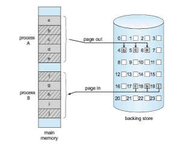
**Figure 9.20** Swapping with paging.

Instead of using swapping, when free memory falls below a certain thresh- old, Apple’s iOS **_asks_** applications to voluntarily relinquish allocated mem- ory. Read-only data (such as code) are removed from main memory and later reloaded from flash memory if necessary. Data that have been modified (such as the stack) are never removed. However, any applications that fail to free up sufficient memory may be terminated by the operating system.

Android adopts a strategy similar to that used by iOS. It may terminate a process if insufficient free memory is available. However, before terminating a process, Android writes its **application state** to flash memory so that it can be quickly restarted.

Because of these restrictions, developers for mobile systemsmust carefully allocate and release memory to ensure that their applications do not use too much memory or suffer from memory leaks.

**_SYSTEM PERFORMANCE UNDER SWAPPING_**

Although swapping pages is more efficient than swapping entire processes, when a system is undergoing _any_ form of swapping, it is often a sign there are more active processes than available physical memory. There are generally two approaches for handling this situation: (1) terminate some processes, or (2) get more physical memory!  


## Example: Intel 32- and 64-bit Architectures

The architecture of Intel chips has dominated the personal computer landscape for decades. The 16-bit Intel 8086 appeared in the late 1970s and was soon followed by another 16-bit chip—the Intel 8088—which was notable for being the chip used in the original IBM PC. Intel later produced a series of 32-bit chips—the IA-32—which included the family of 32-bit Pentium processors. More recently, Intel has produced a series of 64-bit chips based on the x86-64 architecture. Currently, all the most popular PC operating systems run on Intel chips, including Windows, macOS, and Linux (although Linux, of course, runs on several other architectures as well). Notably, however, Intel’s dominance has not spread to mobile systems, where the ARM architecture currently enjoys considerable success (see Section 9.7).

In this section, we examine address translation for both IA-32 and x86-64 architectures. Before we proceed, however, it is important to note that because Intel has released several versions—as well as variations—of its architectures over the years, we cannot provide a complete description of the memory- management structure of all its chips. Nor canwe provide all of the CPU details, as that information is best left to books on computer architecture. Rather, we present the major memory-management concepts of these Intel CPUs.

### IA-32 Architecture

Memory management in IA-32 systems is divided into two components— segmentation and paging—and works as follows: The CPU generates logical addresses, which are given to the segmentation unit. The segmentation unit produces a linear address for each logical address. The linear address is then given to the paging unit, which in turn generates the physical address in main memory. Thus, the segmentation and paging units form the equivalent of the memory-management unit (MMU). This scheme is shown in Figure 9.21.

#### IA-32 Segmentation

The IA-32 architecture allows a segment to be as large as 4 GB, and the max- imum number of segments per process is 16 K. The logical address space of a process is divided into two partitions. The first partition consists of up to 8 K segments that are private to that process. The second partition consists of up to 8 K segments that are shared among all the processes. Information about the first partition is kept in the **local descriptor table** (**LDT**); information about the second partition is kept in the **global descriptor table** (**GDT**). Each entry in the LDT and GDT consists of an 8-byte segment descriptorwith detailed information about a particular segment, including the base location and limit of that segment.
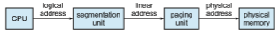
**Figure 9.21** Logical to physical address translation in IA-32.  
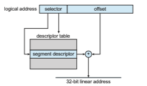

**Figure 9.22** IA-32 segmentation.

The logical address is a pair (selector, offset), where the selector is a 16-bit number:
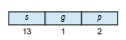
Here, _s_ designates the segment number, _g_ indicates whether the segment is in the GDT or LDT, and _p_ deals with protection. The offset is a 32-bit number specifying the location of the byte within the segment in question.

The machine has six segment registers, allowing six segments to be addressed at any one time by a process. It also has six 8-byte microprogram registers to hold the corresponding descriptors from either the LDT or the GDT. This cache lets the Pentium avoid having to read the descriptor from memory for every memory reference.

The linear address on the IA-32 is 32 bits long and is formed as follows. The segment register points to the appropriate entry in the LDT or GDT. The base and limit information about the segment in question is used to generate a **linear address**. First, the limit is used to check for address validity. If the address is not valid, a memory fault is generated, resulting in a trap to the operating system. If it is valid, then the value of the offset is added to the value of the base, resulting in a 32-bit linear address. This is shown in Figure 9.22. In the following section, we discuss how the paging unit turns this linear address into a physical address.

#### IA-32 Paging

The IA-32 architecture allows a page size of either 4 KB or 4 MB. For 4-KB pages, IA-32 uses a two-level paging scheme in which the division of the 32-bit linear address is as follows:
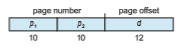

**Figure 9.23** Paging in the IA-32 architecture.

The address-translation scheme for this architecture is similar to the scheme shown in Figure 9.16. The IA-32 address translation is shown in more detail in Figure 9.23. The 10 high-order bits reference an entry in the outermost page table, which IA-32 terms the **page directory**. (The CR3 register points to the page directory for the current process.) The page directory entry points to an inner page table that is indexed by the contents of the innermost 10 bits in the linear address. Finally, the low-order bits 0–11 refer to the offset in the 4-KB page pointed to in the page table.

One entry in the page directory is the Page Size flag, which—if set— indicates that the size of the page frame is 4 MB and not the standard 4 KB. If this flag is set, the page directory points directly to the 4-MB page frame, bypassing the inner page table; and the 22 low-order bits in the linear address refer to the offset in the 4-MB page frame.

To improve the efficiency of physical memory use, IA-32 page tables can be swapped to disk. In this case, an invalid bit is used in the page directory entry to indicate whether the table to which the entry is pointing is in memory or on disk. If the table is on disk, the operating system can use the other 31 bits to specify the disk location of the table. The table can then be brought into memory on demand.

As software developers began to discover the 4-GB memory limitations of 32-bit architectures, Intel adopted a **page address extension** (**PAE**), which allows 32-bit processors to access a physical address space larger than 4 GB. The fundamental difference introduced by PAE support was that paging went from a two-level scheme (as shown in Figure 9.23) to a three-level scheme, where the top two bits refer to a **page directory pointer table**. Figure 9.24 illustrates a PAE system with 4-KB pages. (PAE also supports 2-MB pages.)

PAE also increased the page-directory and page-table entries from 32 to 64 bits in size, which allowed the base address of page tables and page frames to  

**Figure 9.24** Page address extensions.

extend from 20 to 24 bits. Combined with the 12-bit offset, adding PAE support to IA-32 increased the address space to 36 bits, which supports up to 64 GB of physical memory. It is important to note that operating system support is required to use PAE. Both Linux and macOS support PAE. However, 32-bit versions of Windows desktop operating systems still provide support for only 4 GB of physical memory, even if PAE is enabled.

### x86-64

Intel has had an interesting history of developing 64-bit architectures. Its ini- tial entry was the IA-64 (later named **Itanium**) architecture, but that architec- ture was not widely adopted. Meanwhile, another chip manufacturer—AMD — began developing a 64-bit architecture known as x86-64 that was based on extending the existing IA-32 instruction set. The x86-64 supported much larger logical and physical address spaces, as well as several other architec- tural advances. Historically, AMD had often developed chips based on Intel’s architecture, but now the roles were reversed as Intel adopted AMD’s x86-64 architecture. In discussing this architecture, rather than using the commercial names **AMD64** and **Intel 64**, we will use the more general term **x86-64**.

Support for a 64-bit address space yields an astonishing 264 bytes of addressable memory—a number greater than 16 quintillion (or 16 exabytes). However, even though 64-bit systems can potentially address this much mem- ory, in practice far fewer than 64 bits are used for address representation in current designs. The x86-64 architecture currently provides a 48-bit virtual address with support for page sizes of 4 KB, 2 MB, or 1 GB using four levels of paging hierarchy. The representation of the linear address appears in Figure 9.25. Because this addressing scheme can use PAE, virtual addresses are 48 bits in size but support 52-bit physical addresses (4,096 terabytes).
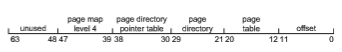
**Figure 9.25** x86-64 linear address.  

## Example: ARMv8 Architecture

Although Intel chips have dominated the personal computer market for more than 30 years, chips for mobile devices such as smartphones and tablet com- puters often instead run on ARM processors. Interestingly, whereas Intel both designs and manufactures chips, ARM only designs them. It then licenses its architectural designs to chip manufacturers. Apple has licensed the ARM design for its iPhone and iPadmobile devices, andmost Android-based smart- phones use ARM processors as well. In addition to mobile devices, ARM also provides architecture designs for real-time embedded systems. Because of the abundance of devices that run on the ARM architecture, over 100 billion ARM processors have been produced, making it the most widely used architecture when measured in the quantity of chips produced. In this section, we describe the 64-bit ARMv8 architecture.

The ARMv8 has three different **translation granules**: 4 KB, 16 KB, and 64 KB. Each translation granule provides different page sizes, as well as larger sections of contiguous memory, known as **regions**. The page and region sizes for the different translation granules are shown below:

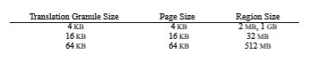
For 4-KB and 16-KB granules, up to four levels of paging may be used, with up to three levels of paging for 64-KB granules. Figure 9.26 illustrates the ARMv8 address structure for the 4-KB translation granule with up to four levels of paging. (Notice that although ARMv8 is a 64-bit architecture, only 48 bits are currently used.) The four-level hierarchical paging structure for the 4-KB translation granule is illustrated in Figure 9.27. (The TTBR register is the **translation table base register** and points to the level 0 table for the current thread.)

If all four levels are used, the offset (bits 0–11 in Figure 9.26) refers to the offset within a 4-KB page. However, notice that the table entries for level 1 and

**_64-BIT COMPUTING_**

History has taught us that even though memory capacities, CPU speeds, and similar computer capabilities seem large enough to satisfy demand for the foreseeable future, the growth of technology ultimately absorbs available capacities, andwe find ourselves in need of additional memory or processing power, often sooner thanwe think.Whatmight the future of technology bring that would make a 64-bit address space seem too small?  

**Figure 9.26** ARM 4-KB translation granule.

level 2 may refer either to another table or to a 1-GB region (level-1 table) or 2-MB region (level-2 table). As an example, if the level-1 table refers to a 1-GB region rather than a level-2 table, the low-order 30 bits (bits 0–29 in Figure 9.26) are used as an offset into this 1-GB region. Similarly, if the level-2 table refers to a 2-MB region rather than a level-3 table, the low-order 21 bits (bits 0–20 in Figure 9.26) refer to the offset within this 2-MB region.

The ARM architecture also supports two levels of TLBs. At the inner level are two **micro TLBs**—a TLB for data and another for instructions. The micro TLB supports ASIDs as well. At the outer level is a single **main TLB**. Address translation begins at the micro-TLB level. In the case of a miss, the main TLB is then checked. If both TLBs yield misses, a page table walk must be performed in hardware.

## Summary

• Memory is central to the operation of a modern computer system and consists of a large array of bytes, each with its own address.

• One way to allocate an address space to each process is through the use of base and limit registers. The base register holds the smallest legal physical memory address, and the limit specifies the size of the range.
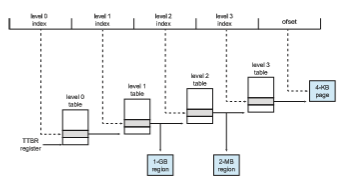
**Figure 9.27** ARM four-level hierarchical paging.  

• Binding symbolic address references to actual physical addresses may occur during (1) compile, (2) load, or (3) execution time.

• An address generated by the CPU is known as a logical address, which the memory management unit (MMU) translates to a physical address in memory.

• One approach to allocating memory is to allocate partitions of contiguous memory of varying sizes. These partitionsmay be allocated based on three possible strategies: (1) first fit, (2) best fit, and (3) worst fit.

• Modern operating systems use paging to manage memory. In this process, physical memory is divided into fixed-sized blocks called frames and logical memory into blocks of the same size called pages.

• When paging is used, a logical address is divided into two parts: a page number and a page offset. The page number serves as an index into a per- process page table that contains the frame in physical memory that holds the page. The offset is the specific location in the frame being referenced.

• A translation look-aside buffer (TLB) is a hardware cache of the page table. Each TLB entry contains a page number and its corresponding frame.

• Using a TLB in address translation for paging systems involves obtaining the page number from the logical address and checking if the frame for the page is in the TLB. If it is, the frame is obtained from the TLB. If the frame is not present in the TLB, it must be retrieved from the page table.

• Hierarchical paging involves dividing a logical address intomultiple parts, each referring to different levels of page tables. As addresses expand beyond 32 bits, the number of hierarchical levels may become large. Two strategies that address this problem are hashed page tables and inverted page tables.

• Swapping allows the system to move pages belonging to a process to disk to increase the degree of multiprogramming.

• The Intel 32-bit architecture has two levels of page tables and supports either 4-KB or 4-MB page sizes. This architecture also supports page- address extension, which allows 32-bit processors to access a physical address space larger than 4 GB. The x86-64 and ARMv9 architectures are 64-bit architectures that use hierarchical paging.

**Practice Exercises**

**9.1** Name two differences between logical and physical addresses.

**9.2** Why are page sizes always powers of 2?

**9.3** Consider a system in which a program can be separated into two parts: code and data. The CPU knows whether it wants an instruction (instruc- tion fetch) or data (data fetch or store). Therefore, two base–limit register pairs are provided: one for instructions and one for data. The instruction  

base–limit register pair is automatically read-only, so programs can be shared among different users. Discuss the advantages and disadvan- tages of this scheme.

**9.4** Consider a logical address space of 64 pages of 1,024 words each, mapped onto a physical memory of 32 frames.

a. How many bits are there in the logical address?

b. How many bits are there in the physical address?

**9.5** What is the effect of allowing two entries in a page table to point to the same page frame in memory? Explain how this effect could be used to decrease the amount of time needed to copy a large amount of memory fromone place to another.What effect would updating some byte on one page have on the other page?

**9.6** Given six memory partitions of 300 KB, 600 KB, 350 KB, 200 KB, 750 KB, and 125 KB (in order), how would the first-fit, best-fit, and worst-fit algorithms place processes of size 115 KB, 500 KB, 358 KB, 200 KB, and 375 KB (in order)?

**9.7** Assuming a 1-KB page size, what are the page numbers and offsets for the following address references (provided as decimal numbers):

a. 3085

b. 42095

c. 215201

d. 650000

e. 2000001

**9.8** The BTV operating system has a 21-bit virtual address, yet on certain embedded devices, it has only a 16-bit physical address. It also has a 2-KB page size. How many entries are there in each of the following?

a. A conventional, single-level page table

b. An inverted page table

What is the maximum amount of physical memory in the BTV operating system?

**9.9** Consider a logical address space of 256 pages with a 4-KB page size, mapped onto a physical memory of 64 frames.

a. How many bits are required in the logical address?

b. How many bits are required in the physical address?

**9.10** Consider a computer systemwith a 32-bit logical address and 4-KB page size. The system supports up to 512 MB of physical memory. Howmany entries are there in each of the following?

a. A conventional, single-level page table

b. An inverted page table  

**Further Reading**

The concept of paging can be credited to the designers of the Atlas system, which has been described by \[Kilburn et al. (1961)\] and by \[Howarth et al. (1961)\].

\[Hennessy and Patterson (2012)\] explain the hardware aspects of TLBs, caches, andMMUs. \[Jacob andMudge (2001)\] describe techniques formanaging the TLB. \[Fang et al. (2001)\] evaluate support for large pages.

PAE support forWindows systems.is discussed in http://msdn.microsoft.co m/en-us/library/windows/hardware/gg487512.aspx An overview of the ARM architecture is provided in http://www.arm.com/products/processors/cortex- a/cortex-a9.php

## Bibliography

**\[Fang et al. (2001)\]** Z. Fang, L. Zhang, J. B. Carter, W. C. Hsieh, and S. A. McKee, “Reevaluating Online Superpage Promotion with Hardware Support”, _Proceed- ings of the International Symposium on High-Performance Computer Architecture_, Volume 50, Number 5 (2001).

**\[Hennessy and Patterson (2012)\]** J. Hennessy andD. Patterson, _Computer Archi- tecture: A Quantitative Approach,_ Fifth Edition, Morgan Kaufmann (2012).

**\[Howarth et al. (1961)\]** D. J. Howarth, R. B. Payne, and F. H. Sumner, “The Manchester University Atlas Operating System, Part II: User’s Description”, _Computer Journal_, Volume 4, Number 3 (1961), pages 226–229.

**\[Jacob and Mudge (2001)\]** B. Jacob and T. Mudge, “Uniprocessor Virtual Mem- oryWithout TLBs”, _IEEE Transactions onComputers_, Volume 50,Number 5 (2001).

**\[Kilburn et al. (1961)\]** T. Kilburn, D. J. Howarth, R. B. Payne, and F. H. Sumner, “The Manchester University Atlas Operating System, Part I: Internal Organiza- tion”, _Computer Journal_, Volume 4, Number 3 (1961), pages 222–225.  

**Exercises**

**9.11** Explain the difference between internal and external fragmentation.

**9.12** Consider the following process for generating binaries. A compiler is used to generate the object code for individual modules, and a linker is used to combine multiple object modules into a single program binary. Howdoes the linker change the binding of instructions anddata tomem- ory addresses? What information needs to be passed from the compiler to the linker to facilitate the memory-binding tasks of the linker?

**9.13** Given six memory partitions of 100 MB, 170 MB, 40 MB, 205 MB, 300 MB, and 185 MB (in order), how would the first-fit, best-fit, and worst-fit algorithms place processes of size 200 MB, 15 MB, 185 MB, 75 MB, 175 MB, and 80 MB (in order)? Indicate which—if any—requests cannot be satisfied. Comment on how efficiently each of the algorithms manages memory.

**9.14** Most systems allow a program to allocate more memory to its address space during execution. Allocation of data in the heap segments of programs is an example of such allocated memory. What is required to support dynamic memory allocation in the following schemes?

a. Contiguous memory allocation

b. Paging

**9.15** Compare thememory organization schemes of contiguousmemory allo- cation and paging with respect to the following issues:

a. External fragmentation

b. Internal fragmentation

c. Ability to share code across processes

**9.16** On a system with paging, a process cannot access memory that it does not own. Why? How could the operating system allow access to addi- tional memory? Why should it or should it not?

**9.17** Explain why mobile operating systems such as iOS and Android do not support swapping.

**9.18** Although Android does not support swapping on its boot disk, it is possible to set up a swap space using a separate SD nonvolatile memory card. Why would Android disallow swapping on its boot disk yet allow it on a secondary disk?

**9.19** Explain why address-space identifiers (ASIDs) are used in TLBs.

**9.20** Program binaries in many systems are typically structured as follows. Code is stored starting with a small, fixed virtual address, such as 0. The code segment is followed by the data segment, which is used for storing the program variables. When the program starts executing, the stack is allocated at the other end of the virtual address space and is allowed to grow toward lower virtual addresses. What is the significance of this structure for the following schemes?

**EX-32**  

a. Contiguous memory allocation

b. Paging

**9.21** Assuming a 1-KB page size, what are the page numbers and offsets for the following address references (provided as decimal numbers)?

a. 21205

b. 164250

c. 121357

d. 16479315

e. 27253187

**9.22** The MPV operating system is designed for embedded systems and has a 24-bit virtual address, a 20-bit physical address, and a 4-KB page size. How many entries are there in each of the following?

a. A conventional, single-level page table

b. An inverted page table

What is themaximum amount of physical memory in the MPV operating system?

**9.23** Consider a logical address space of 2,048 pages with a 4-KB page size, mapped onto a physical memory of 512 frames.

a. How many bits are required in the logical address?

b. How many bits are required in the physical address?

**9.24** Consider a computer systemwith a 32-bit logical address and 8-KB page size. The system supports up to 1 GB of physical memory. How many entries are there in each of the following?

a. A conventional, single-level page table

b. An inverted page table

**9.25** Consider a paging system with the page table stored in memory.

a. If a memory reference takes 50 nanoseconds, how long does a paged memory reference take?

b. If we add TLBs, and if 75 percent of all page-table references are found in the TLBs, what is the effective memory reference time? (Assume that finding a page-table entry in the TLBs takes 2 nanoseconds, if the entry is present.)

**9.26** What is the purpose of paging the page tables?

**9.27** Consider the IA-32 address-translation scheme shown in Figure 9.22.

a. Describe all the steps taken by the IA-32 in translating a logical address into a physical address.

b. What are the advantages to the operating system of hardware that provides such complicated memory translation?

**EX-33**  

**Exercises**

c. Are there any disadvantages to this address-translation system? If so, what are they? If not, why is this scheme not used by every manufacturer?

**EX-34**  

**Programming Projects**

**Programming Problems**

**9.28** Assume that a system has a 32-bit virtual address with a 4-KB page size. Write a C program that is passed a virtual address (in decimal) on the command line and have it output the page number and offset for the given address. As an example, your program would run as follows:

./addresses 19986

Your program would output:

The address 19986 contains: page number = 4 offset = 3602

Writing this program will require using the appropriate data type to store 32 bits. We encourage you to use unsigned data types as well.

**Programming Projects**

**Contiguous Memory Allocation**

In Section 9.2, we presented different algorithms for contiguous memory allo- cation. This project will involve managing a contiguous region of memory of size_MAX_where addresses may range from 0 ..._MAX_− 1. Your program must respond to four different requests:

**1\.** Request for a contiguous block of memory

**2\.** Release of a contiguous block of memory

**3\.** Compact unused holes of memory into one single block

**4\.** Report the regions of free and allocated memory

Your program will be passed the initial amount of memory at startup. For example, the following initializes the program with 1 MB (1,048,576 bytes) of memory:

./allocator 1048576

Once your program has started, it will present the user with the following prompt:

allocator>

It will then respond to the following commands: RQ (request), RL (release), C (compact), STAT (status report), and X (exit).

A request for 40,000 bytes will appear as follows:

allocator>RQ P0 40000 W

**P-48**  

**Chapter 9 Main Memory**

Similarly, a release will appear as:

allocator>RL P0

This command will release the memory that has been allocated to process P0. The command for compaction is entered as:

allocator>C

This command will compact unused holes of memory into one region. Finally, the STAT command for reporting the status of memory is entered

as:

allocator>STAT

Given this command, your programwill report the regions of memory that are allocated and the regions that are unused. For example, one possible arrange- ment of memory allocation would be as follows:

Addresses \[0:315000\] Process P1 Addresses \[315001: 512500\] Process P3 Addresses \[512501:625575\] Unused Addresses \[625575:725100\] Process P6 Addresses \[725001\] . . .

**Allocating Memory**

Your program will allocate memory using one of the three approaches high- lighted in Section 9.2.2, depending on the flag that is passed to the RQ com- mand. The flags are:

• F—first fit

• B—best fit

• W—worst fit

This will require that your program keep track of the different holes repre- senting available memory. When a request for memory arrives, it will allocate the memory from one of the available holes based on the allocation strategy. If there is insufficient memory to allocate to a request, it will output an error message and reject the request.

Your program will also need to keep track of which region of memory has been allocated to which process. This is necessary to support the STAT

The first parameter to the RQ command is the new process that requires the memory, followed by the amount of memory being requested, and finally the strategy. (In this situation, “W” refers to worst fit.)

command and is also needed when memory is released via the RL command, as the process releasingmemory is passed to this command. If a partition being released is adjacent to an existing hole, be sure to combine the two holes into a single hole.

**P-49**  

**Bibliography**

**Compaction**

If the user enters the C command, your program will compact the set of holes into one larger hole. For example, if you have four separate holes of size 550 KB, 375 KB, 1,900 KB, and 4,500 KB, your programwill combine these four holes into one large hole of size 7,325 KB.

There are several strategies for implementing compaction, one of which is suggested in Section 9.2.3. Be sure to update the beginning address of any processes that have been affected by compaction.

**P-50**  
# Virtual Memory

In Chapter 9, we discussed various memory-management strategies used in computer systems. All these strategies have the same goal: to keep many processes in memory simultaneously to allow multiprogramming. However, they tend to require that an entire process be in memory before it can execute.

Virtual memory is a technique that allows the execution of processes that are not completely inmemory. Onemajor advantage of this scheme is that pro- grams can be larger than physical memory. Further, virtual memory abstracts main memory into an extremely large, uniform array of storage, separating logical memory as viewed by the programmer from physical memory. This technique frees programmers from the concerns of memory-storage limita- tions. Virtual memory also allows processes to share files and libraries, and to implement shared memory. In addition, it provides an efficient mechanism for process creation. Virtual memory is not easy to implement, however, and may substantially decrease performance if it is used carelessly. In this chap- ter, we provide a detailed overview of virtual memory, examine how it is implemented, and explore its complexity and benefits.

**CHAPTER OBJECTIVES**

• Define virtual memory and describe its benefits.

• Illustrate how pages are loaded into memory using demand paging.

• Apply the FIFO, optimal, and LRU page-replacement algorithms.

• Describe the working set of a process, and explain how it is related to program locality.

• Describe how Linux, Windows 10, and Solaris manage virtual memory.

• Design a virtual memory manager simulation in the C programming lan- guage.

## Background

The memory-management algorithms outlined in Chapter 9 are necessary because of one basic requirement: the instructions being executed must be in physical memory. The first approach to meeting this requirement is to place the entire logical address space in physical memory. Dynamic linking can help to ease this restriction, but it generally requires special precautions and extra work by the programmer.

The requirement that instructions must be in physical memory to be exe- cuted seems both necessary and reasonable; but it is also unfortunate, since it limits the size of a program to the size of physical memory. In fact, an exami- nation of real programs shows us that, in many cases, the entire program is not needed. For instance, consider the following:

• Programs often have code to handle unusual error conditions. Since these errors seldom, if ever, occur in practice, this code is almost never executed.

• Arrays, lists, and tables are often allocated more memory than they actu- ally need. An array may be declared 100 by 100 elements, even though it is seldom larger than 10 by 10 elements.

• Certain options and features of a programmay be used rarely. For instance, the routines on U.S. government computers that balance the budget have not been used in many years.

Even in those cases where the entire program is needed, it may not all be needed at the same time.

The ability to execute a program that is only partially in memory would confer many benefits:

• A program would no longer be constrained by the amount of physical memory that is available. Users would be able to write programs for an extremely large **_virtual_** address space, simplifying the programming task.

• Because each program could take less physical memory, more programs could be run at the same time,with a corresponding increase in CPUutiliza- tion and throughput but with no increase in response time or turnaround time.

• Less I/O would be needed to load or swap portions of programs into memory, so each program would run faster.

Thus, running a program that is not entirely in memorywould benefit both the system and its users.

**Virtual memory** involves the separation of logical memory as perceived by developers from physical memory. This separation allows an extremely large virtual memory to be provided for programmers when only a smaller physical memory is available (Figure 10.1). Virtual memory makes the task of programming much easier, because the programmer no longer needs to worry about the amount of physical memory available; she can concentrate instead on programming the problem that is to be solved.

The **virtual address space** of a process refers to the logical (or virtual) view of how a process is stored in memory. Typically, this view is that a process begins at a certain logical address—say, address 0—and exists in contiguous memory, as shown in Figure 10.2. Recall from Chapter 9, though, that in fact physical memory is organized in page frames and that the physical page frames assigned to a process may not be contiguous. It is up to the memory-  

**Figure 10.1** Diagram showing virtual memory that is larger than physical memory.

management unit (MMU) to map logical pages to physical page frames in memory.

Note in Figure 10.2 that we allow the heap to grow upward in memory as it is used for dynamic memory allocation. Similarly, we allow for the stack to grow downward inmemory through successive function calls. The large blank space (or hole) between the heap and the stack is part of the virtual address space but will require actual physical pages only if the heap or stack grows. Virtual address spaces that include holes are known as **sparse** address spaces. Using a sparse address space is beneficial because the holes can be filled as the stack or heap segments grow or if we wish to dynamically link libraries (or possibly other shared objects) during program execution.

**Figure 10.2** Virtual address space of a process in memory.  

**Figure 10.3** Shared library using virtual memory.

In addition to separating logical memory from physical memory, virtual memory allows files and memory to be shared by two or more processes through page sharing (Section 9.3.4). This leads to the following benefits:

• System libraries such as the standard C library can be shared by several processes through mapping of the shared object into a virtual address space. Although each process considers the libraries to be part of its vir- tual address space, the actual pages where the libraries reside in physical memory are shared by all the processes (Figure 10.3). Typically, a library is mapped read-only into the space of each process that is linked with it.

• Similarly, processes can share memory. Recall from Chapter 3 that two or more processes can communicate through the use of shared memory. Virtualmemory allows one process to create a region ofmemory that it can share with another process. Processes sharing this region consider it part of their virtual address space, yet the actual physical pages of memory are shared, much as is illustrated in Figure 10.3.

• Pages can be shared during process creation with the fork() system call, thus speeding up process creation.

We further explore these—and other—benefits of virtual memory later in this chapter. First, though, we discuss implementing virtual memory through demand paging.

## Demand Paging

Consider how an executable programmight be loaded from secondary storage into memory. One option is to load the entire program in physical memory at program execution time. However, a problem with this approach is that  

we may not initially **_need_** the entire program in memory. Suppose a program starts with a list of available options from which the user is to select. Loading the entire program into memory results in loading the executable code for **_all_** options, regardless of whether or not an option is ultimately selected by the user.

An alternative strategy is to load pages only as they are needed. This tech- nique is known as **demand paging** and is commonly used in virtual memory systems. With demand-paged virtual memory, pages are loaded only when they are **_demanded_** during program execution. Pages that are never accessed are thus never loaded into physical memory. Ademand-paging system is simi- lar to a paging system with swapping (Section 9.5.2) where processes reside in secondary memory (usually an HDD or NVM device). Demand paging explains one of the primary benefits of virtual memory—by loading only the portions of programs that are needed, memory is used more efficiently.

### Basic Concepts

The general concept behind demand paging, as mentioned, is to load a page in memory only when it is needed. As a result, while a process is executing, some pageswill be inmemory, and somewill be in secondary storage. Thus, we need some form of hardware support to distinguish between the two. The valid– invalid bit scheme described in Section 9.3.3 can be used for this purpose. This

**Figure 10.4** Page table when some pages are not in main memory.  

time, however, when the bit is set to “valid,” the associated page is both legal and in memory. If the bit is set to “invalid,” the page either is not valid (that is, not in the logical address space of the process) or is valid but is currently in secondary storage. The page-table entry for a page that is brought intomemory is set as usual, but the page-table entry for a page that is not currently in memory is simply marked invalid. This situation is depicted in Figure 10.4. (Notice that marking a page invalid will have no effect if the process never attempts to access that page.)

But what happens if the process tries to access a page that was not brought intomemory? Access to a pagemarked invalid causes a **page fault**. The paging hardware, in translating the address through the page table, will notice that the invalid bit is set, causing a trap to the operating system. This trap is the result of the operating system’s failure to bring the desired page into memory. The procedure for handling this page fault is straightforward (Figure 10.5):

**1\.** We check an internal table (usually kept with the process control block) for this process to determine whether the reference was a valid or an invalid memory access.

**2\.** If the reference was invalid, we terminate the process. If it was valid but we have not yet brought in that page, we now page it in.

**3\.** We find a free frame (by taking one from the free-frame list, for example).

**Figure 10.5** Steps in handling a page fault.  

**4\.** We schedule a secondary storage operation to read the desired page into the newly allocated frame.

**5\.** When the storage read is complete,wemodify the internal table keptwith the process and the page table to indicate that the page is now inmemory.

**6\.** We restart the instruction that was interrupted by the trap. The process can now access the page as though it had always been in memory.

In the extreme case, we can start executing a process with **_no_** pages in memory. When the operating system sets the instruction pointer to the first instruction of the process,which is on a non-memory-resident page, the process immediately faults for the page. After this page is brought into memory, the process continues to execute, faulting as necessary until every page that it needs is in memory. At that point, it can execute with no more faults. This scheme is **pure demand paging**: never bring a page into memory until it is required.

Theoretically, some programs could access several new pages of memory with each instruction execution (one page for the instruction and many for data), possibly causing multiple page faults per instruction. This situation would result in unacceptable system performance. Fortunately, analysis of running processes shows that this behavior is exceedingly unlikely. Programs tend to have **locality of reference**, described in Section 10.6.1, which results in reasonable performance from demand paging.

The hardware to support demand paging is the same as the hardware for paging and swapping:

• **Page table**. This table has the ability to mark an entry invalid through a valid–invalid bit or a special value of protection bits.

• **Secondary memory**. This memory holds those pages that are not present in main memory. The secondary memory is usually a high-speed disk or NVM device. It is known as the swap device, and the section of storage used for this purpose is known as **swap space**. Swap-space allocation is discussed in Chapter 11.

A crucial requirement for demand paging is the ability to restart any instruction after a page fault. Because we save the state (registers, condi- tion code, instruction counter) of the interrupted process when the page fault occurs, we must be able to restart the process in **_exactly_** the same place and state, except that the desired page is now in memory and is accessible. In most cases, this requirement is easy to meet. A page fault may occur at any memory reference. If the page fault occurs on the instruction fetch, we can restart by fetching the instruction again. If a page fault occurs while we are fetching an operand, we must fetch and decode the instruction again and then fetch the operand.

As a worst-case example, consider a three-address instruction such as ADD the content of A to B, placing the result in C. These are the steps to execute this instruction:

**1\.** Fetch and decode the instruction (ADD).

**2\.** Fetch A.  

**396 Chapter 10 Virtual Memory**

**3\.** Fetch B.

**4\.** Add A and B.

**5\.** Store the sum in C.

If we fault when we try to store in C (because C is in a page not currently in memory), we will have to get the desired page, bring it in, correct the page table, and restart the instruction. The restart will require fetching the instruction again, decoding it again, fetching the two operands again, and then adding again. However, there is not much repeated work (less than one complete instruction), and the repetition is necessary only when a page fault occurs.

The major difficulty arises when one instruction may modify several dif- ferent locations. For example, consider the IBM System 360/370 MVC (move character) instruction, which can move up to 256 bytes from one location to another (possibly overlapping) location. If either block (source or destination) straddles a page boundary, a page fault might occur after the move is par- tially done. In addition, if the source and destination blocks overlap, the source block may have been modified, in which case we cannot simply restart the instruction.

This problem can be solved in two different ways. In one solution, the microcode computes and attempts to access both ends of both blocks. If a page fault is going to occur, it will happen at this step, before anything is modified. The move can then take place; we know that no page fault can occur, since all the relevant pages are in memory. The other solution uses temporary registers to hold the values of overwritten locations. If there is a page fault, all the old values arewritten back intomemory before the trap occurs. This action restores memory to its state before the instruction was started, so that the instruction can be repeated.

This is by no means the only architectural problem resulting from adding paging to an existing architecture to allow demand paging, but it illustrates some of the difficulties involved. Paging is added between the CPU and the memory in a computer system. It should be entirely transparent to a process. Thus, people often assume that paging can be added to any system. Although this assumption is true for a non-demand-paging environment, where a page fault represents a fatal error, it is not true where a page fault means only that an additional page must be brought into memory and the process restarted.

### Free-Frame List

When a page fault occurs, the operating system must bring the desired page from secondary storage into main memory. To resolve page faults, most oper- ating systems maintain a **free-frame list**, a pool of free frames for satisfying such requests (Figure 10.6). (Free frames must also be allocated when the stack or heap segments from a process expand.) Operating systems typically allo-

**Figure 10.6** List of free frames.  

cate free frames using a technique known as **zero-fill-on-deman** . Zero-fill- on-demand frames are “zeroed-out” before being allocated, thus erasing their previous contents. (Consider the potential security implications of **_not_** clearing out the contents of a frame before reassigning it.)

When a system starts up, all available memory is placed on the free-frame list. As free frames are requested (for example, through demand paging), the size of the free-frame list shrinks. At some point, the list either falls to zero or falls below a certain threshold, at which point it must be repopulated.We cover strategies for both of these situations in Section 10.4.

### Performance of Demand Paging

Demand paging can significantly affect the performance of a computer system. To see why, let’s compute the **effective access time** for a demand-paged mem- ory. Assume the memory-access time, denoted _ma,_ is 10 nanoseconds. As long as we have no page faults, the effective access time is equal to the memory access time. If, however, a page fault occurs, we must first read the relevant page from secondary storage and then access the desired word.

Let _p_ be the probability of a page fault (0 ≤ _p_ ≤ 1). We would expect _p_ to be close to zero—that is, we would expect to have only a few page faults. The effective access time is then

effective access time = (1 − _p_) × _ma_ \+ _p_ × page fault time.

To compute the effective access time, we must know how much time is needed to service a page fault. A page fault causes the following sequence to occur:

**1\.** Trap to the operating system.

**2\.** Save the registers and process state.

**3\.** Determine that the interrupt was a page fault.

**4\.** Check that the page referencewas legal, and determine the location of the page in secondary storage.

**5\.** Issue a read from the storage to a free frame:

a. Wait in a queue until the read request is serviced.

b. Wait for the device seek and/or latency time.

c. Begin the transfer of the page to a free frame.

**6\.** While waiting, allocate the CPU core to some other process.

**7\.** Receive an interrupt from the storage I/O subsystem (I/O completed).

**8\.** Save the registers and process state for the other process (if step 6 is executed).

**9\.** Determine that the interrupt was from the secondary storage device.

**10\.** Correct the page table and other tables to show that the desired page is now in memory.

**11\.** Wait for the CPU core to be allocated to this process again.  

**12\.** Restore the registers, process state, and new page table, and then resume the interrupted instruction.

Not all of these steps are necessary in every case. For example,we are assuming that, in step 6, the CPU is allocated to another process while the I/O occurs. This arrangement allows multiprogramming to maintain CPU utilization but requires additional time to resume the page-fault service routine when the I/O transfer is complete.

In any case, there are threemajor task components of the page-fault service time:

**1\.** Service the page-fault interrupt.

**2\.** Read in the page.

**3\.** Restart the process.

The first and third tasks can be reduced, with careful coding, to several hundred instructions. These tasks may take from 1 to 100 microseconds each. Let’s consider the case of HDDs being used as the paging device. The page- switch time will probably be close to 8 milliseconds. (A typical hard disk has an average latency of 3 milliseconds, a seek of 5 milliseconds, and a transfer time of 0.05 milliseconds. Thus, the total paging time is about 8 milliseconds, including hardware and software time.) Remember also that we are looking at only the device-service time. If a queue of processes is waiting for the device, we have to add queuing time as we wait for the paging device to be free to service our request, increasing even more the time to page in.

With an average page-fault service time of 8 milliseconds and a memory- access time of 200 nanoseconds, the effective access time in nanoseconds is

effective access time = (1 − _p_) × (200) + _p_ (8 milliseconds) = (1 − _p_) × 200 + _p_ × 8,000,000 = 200 + 7,999,800 × _p._

We see, then, that the effective access time is directly proportional to the **page-fault rate**. If one access out of 1,000 causes a page fault, the effective access time is 8.2 microseconds. The computer will be slowed down by a factor of 40 because of demandpaging! Ifwewant performance degradation to be less than 10 percent, we need to keep the probability of page faults at the following level:

220 _\>_ 200 + 7,999,800 × _p,_ 20 _\>_ 7,999,800 × _p_, _p <_ 0.0000025.

That is, to keep the slowdown due to paging at a reasonable level, we can allow fewer that one memory access out of 399,990 to page-fault. In sum, it is impor- tant to keep the page-fault rate low in a demand-paging system. Otherwise, the effective access time increases, slowing process execution dramatically.

An additional aspect of demand paging is the handling and overall use of swap space. I/O to swap space is generally faster than that to the file system. It is faster because swap space is allocated inmuch larger blocks, and file lookups and indirect allocation methods are not used (Chapter 11). One option for the  


system to gain better paging throughput is by copying an entire file image into the swap space at process startup and then performing demand paging from the swap space. The obvious disadvantage of this approach is the copying of the file image at program start-up. A second option—and one practiced by several operating systems, including Linux andWindows—is to demand-page from the file system initially but to write the pages to swap space as they are replaced. This approach will ensure that only needed pages are read from the file system but that all subsequent paging is done from swap space.

Some systems attempt to limit the amount of swap space used through demand paging of binary executable files. Demand pages for such files are brought directly from the file system. However, when page replacement is called for, these frames can simply be overwritten (because they are never modified), and the pages can be read in from the file system again if needed. Using this approach, the file system itself serves as the backing store. However, swap space must still be used for pages not associated with a file (known as **anonymous memory**); these pages include the stack and heap for a process. This method appears to be a good compromise and is used in several systems, including Linux and BSD UNIX.

As described in Section 9.5.3, mobile operating systems typically do not support swapping. Instead, these systems demand-page from the file sys- tem and reclaim read-only pages (such as code) from applications if memory becomes constrained. Such data can be demand-paged from the file system if it is later needed. Under iOS, anonymous memory pages are never reclaimed from an application unless the application is terminated or explicitly releases the memory. In Section 10.7, we cover compressed memory, a commonly used alternative to swapping in mobile systems.

## Copy-on-Write

In Section 10.2, we illustrated how a process can start quickly by demand- paging in the page containing the first instruction. However, process creation using the fork() system call may initially bypass the need for demand paging by using a technique similar to page sharing (covered in Section 9.3.4). This technique provides rapid process creation and minimizes the number of new pages that must be allocated to the newly created process.

Recall that the fork() system call creates a child process that is a duplicate of its parent. Traditionally, fork() worked by creating a copy of the parent’s address space for the child, duplicating the pages belonging to the parent. However, considering thatmany child processes invoke the exec() system call immediately after creation, the copying of the parent’s address space may be unnecessary. Instead, we can use a technique known as **copy-on-write**, which works by allowing the parent and child processes initially to share the same pages. These shared pages are marked as copy-on-write pages, meaning that if either process writes to a shared page, a copy of the shared page is created. Copy-on-write is illustrated in Figures 10.7 and 10.8, which show the contents of the physical memory before and after process 1 modifies page C.

For example, assume that the child process attempts to modify a page containing portions of the stack, with the pages set to be copy-on-write. The operating system will obtain a frame from the free-frame list and create a copy  

**Figure 10.7** Before process 1 modifies page C.

of this page, mapping it to the address space of the child process. The child process will then modify its copied page and not the page belonging to the parent process. Obviously, when the copy-on-write technique is used, only the pages that are modified by either process are copied; all unmodified pages can be shared by the parent and child processes. Note, too, that only pages that can be modified need be marked as copy-on-write. Pages that cannot be modified (pages containing executable code) can be shared by the parent and child. Copy-on-write is a common technique used by several operating systems, including Windows, Linux, and macOS.

Several versions of UNIX (including Linux, macOS, and BSD UNIX) provide a variation of the fork() system call—vfork() (for **virtual memory fork**)— that operates differently from fork() with copy-on-write. With vfork(), the parent process is suspended, and the child process uses the address space of the parent. Because vfork() does not use copy-on-write, if the child process changes any pages of the parent’s address space, the altered pages will be visible to the parent once it resumes. Therefore, vfork() must be used with caution to ensure that the child process does not modify the address space of the parent. vfork() is intended to be usedwhen the child process calls exec() immediately after creation. Because no copying of pages takes place, vfork()
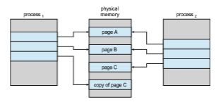
**Figure 10.8** After process 1 modifies page C.  

is an extremely efficient method of process creation and is sometimes used to implement UNIX command-line shell interfaces.

## Page Replacement

In our earlier discussion of the page-fault rate, we assumed that each page faults at most once, when it is first referenced. This representation is not strictly accurate, however. If a process of ten pages actually uses only half of them, then demand paging saves the I/O necessary to load the five pages that are never used. We could also increase our degree of multiprogramming by running twice as many processes. Thus, if we had forty frames, we could run eight processes, rather than the four that could run if each required ten frames (five of which were never used).

If we increase our degree of multiprogramming, we are **over-allocating** memory. If we run six processes, each of which is ten pages in size but actually uses only five pages, we have higher CPU utilization and throughput, with ten frames to spare. It is possible, however, that each of these processes, for a particular data set, may suddenly try to use all ten of its pages, resulting in a need for sixty frames when only forty are available.

Further, consider that systemmemory is not usedonly for holding program pages. Buffers for I/O also consume a considerable amount ofmemory. This use can increase the strain on memory-placement algorithms. Deciding howmuch memory to allocate to I/O and how much to program pages is a significant challenge. Some systems allocate a fixed percentage of memory for I/O buffers, whereas others allow both processes and the I/O subsystem to compete for all systemmemory. Section 14.6 discusses the integrated relationship between I/O buffers and virtual memory techniques.

Over-allocation of memory manifests itself as follows. While a process is executing, a page fault occurs. The operating system determines where the desired page is residing on secondary storage but then finds that there are **_no_** free frames on the free-frame list; all memory is in use. This situation is illustrated in Figure 10.9, where the fact that there are no free frames is depicted by a question mark.

The operating system has several options at this point. It could terminate the process. However, demand paging is the operating system’s attempt to improve the computer system’s utilization and throughput. Users should not be aware that their processes are running on a paged system—paging should be logically transparent to the user. So this option is not the best choice.

The operating system could instead use standard swapping and swap out a process, freeing all its frames and reducing the level of multiprogram- ming. However, as discussed in Section 9.5, standard swapping is no longer used by most operating systems due to the overhead of copying entire pro- cesses between memory and swap space. Most operating systems now com- bine swapping pageswith **page replacement**, a techniquewe describe in detail in the remainder of this section.

### Basic Page Replacement

Page replacement takes the following approach. If no frame is free, we find one that is not currently being used and free it. We can free a frame by writing its  

**Figure 10.9** Need for page replacement.

contents to swap space and changing the page table (and all other tables) to indicate that the page is no longer in memory (Figure 10.10). We can now use the freed frame to hold the page for which the process faulted. We modify the page-fault service routine to include page replacement:

**1\.** Find the location of the desired page on secondary storage.

**2\.** Find a free frame:

a. If there is a free frame, use it.

b. If there is no free frame, use a page-replacement algorithm to select a **victim frame**.

c. Write the victim frame to secondary storage (if necessary); change the page and frame tables accordingly.

**3\.** Read the desired page into the newly freed frame; change the page and frame tables.

**4\.** Continue the process from where the page fault occurred.

Notice that, if no frames are free, **_two_** page transfers (one for the page-out and one for the page-in) are required. This situation effectively doubles the page-fault service time and increases the effective access time accordingly.

We can reduce this overhead by using a **modify bit** (or **dirty bit**).When this scheme is used, each page or frame has a modify bit associated with it in the hardware. The modify bit for a page is set by the hardware whenever any byte in the page is written into, indicating that the page has been modified. When we select a page for replacement, we examine its modify bit. If the bit is set,  
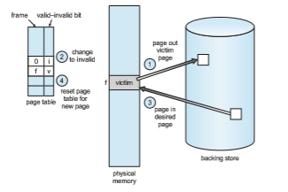
**Figure 10.10** Page replacement.

we know that the page has been modified since it was read in from secondary storage. In this case, we must write the page to storage. If the modify bit is not set, however, the page has **_not_** beenmodified since it was read into memory. In this case, we need notwrite thememory page to storage: it is already there. This technique also applies to read-only pages (for example, pages of binary code). Such pages cannot be modified; thus, they may be discarded when desired. This scheme can significantly reduce the time required to service a page fault, since it reduces I/O time by one-half **_if_** the page has not been modified.

Page replacement is basic to demand paging. It completes the separation between logical memory and physical memory.With this mechanism, an enor- mous virtual memory can be provided for programmers on a smaller physical memory. With no demand paging, logical addresses are mapped into physical addresses, and the two sets of addresses can be different. All the pages of a process still must be in physical memory, however. With demand paging, the size of the logical address space is no longer constrained by physical memory. If we have a process of twenty pages, we can execute it in ten frames simply by using demand paging and using a replacement algorithm to find a free frame whenever necessary. If a page that has been modified is to be replaced, its contents are copied to secondary storage. A later reference to that page will cause a page fault. At that time, the page will be brought back into memory, perhaps replacing some other page in the process.

Wemust solve twomajor problems to implement demandpaging:wemust develop a **frame-allocation algorithm** and a **page-replacement algorithm**. That is, if we have multiple processes in memory, we must decide how many frames to allocate to each process; and when page replacement is required, we must select the frames that are to be replaced. Designing appropriate algo- rithms to solve these problems is an important task, because secondary storage  

I/O is so expensive. Even slight improvements in demand-paging methods yield large gains in system performance.

There are many different page-replacement algorithms. Every operating system probably has its own replacement scheme. How do we select a par- ticular replacement algorithm? In general, we want the one with the lowest page-fault rate.

We evaluate an algorithm by running it on a particular string of memory references and computing the number of page faults. The string of memory references is called a **reference string**. We can generate reference strings arti- ficially (by using a random-number generator, for example), or we can trace a given system and record the address of each memory reference. The latter choice produces a large number of data (on the order of 1 million addresses per second). To reduce the number of data, we use two facts.

First, for a given page size (and the page size is generally fixed by the hard- ware or system), we need to consider only the page number, rather than the entire address. Second, if we have a reference to a page _p,_ then any references to page _p_ that **_immediately_** follow will never cause a page fault. Page _p_ will be in memory after the first reference, so the immediately following references will not fault.

For example, if we trace a particular process, wemight record the following address sequence:

0100, 0432, 0101, 0612, 0102, 0103, 0104, 0101, 0611, 0102, 0103, 0104, 0101, 0610, 0102, 0103, 0104, 0101, 0609, 0102, 0105

At 100 bytes per page, this sequence is reduced to the following reference string:

1, 4, 1, 6, 1, 6, 1, 6, 1, 6, 1

To determine the number of page faults for a particular reference string and page-replacement algorithm, we also need to know the number of page frames available. Obviously, as the number of frames available increases, the number of page faults decreases. For the reference string considered previously, for example, if we had three or more frames, we would have only three faults— one fault for the first reference to each page. In contrast, with only one frame available, we would have a replacement with every reference, resulting in eleven faults. In general, we expect a curve such as that in Figure 10.11. As the number of frames increases, the number of page faults drops to some minimal level. Of course, adding physical memory increases the number of frames.

We next illustrate several page-replacement algorithms. In doing so, we use the reference string

7, 0, 1, 2, 0, 3, 0, 4, 2, 3, 0, 3, 2, 1, 2, 0, 1, 7, 0, 1

for a memory with three frames.

### FIFO Page Replacement

The simplest page-replacement algorithm is a first-in, first-out (FIFO) algo- rithm. A FIFO replacement algorithm associates with each page the time when that page was brought into memory. When a page must be replaced, the oldest page is chosen. Notice that it is not strictly necessary to record the time when a  


**Figure 10.11** Graph of page faults versus number of frames.

page is brought in. We can create a FIFO queue to hold all pages in memory.We replace the page at the head of the queue.When a page is brought intomemory, we insert it at the tail of the queue.

For our example reference string, our three frames are initially empty. The first three references (7, 0, 1) cause page faults and are brought into these empty frames. The next reference (2) replaces page 7, because page 7 was brought in first. Since 0 is the next reference and 0 is already in memory, we have no fault for this reference. The first reference to 3 results in replacement of page 0, since it is now first in line. Because of this replacement, the next reference, to 0, will fault. Page 1 is then replaced by page 0. This process continues as shown in Figure 10.12. Every time a fault occurs, we show which pages are in our three frames. There are fifteen faults altogether.

The FIFO page-replacement algorithm is easy to understand and program. However, its performance is not always good. On the one hand, the page replaced may be an initialization module that was used a long time ago and is no longer needed. On the other hand, it could contain a heavily used variable that was initialized early and is in constant use.

Notice that, even if we select for replacement a page that is in active use, everything still works correctly. After we replace an active page with a new
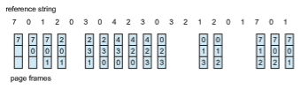

**Figure 10.12** FIFO page-replacement algorithm.  
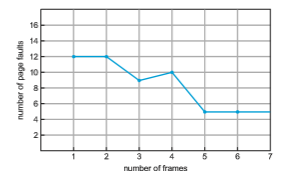
**Figure 10.13** Page-fault curve for FIFO replacement on a reference string.

one, a fault occurs almost immediately to retrieve the active page. Some other page must be replaced to bring the active page back into memory. Thus, a bad replacement choice increases the page-fault rate and slows process execution. It does not, however, cause incorrect execution.

To illustrate the problems that are possible with a FIFO page-replacement algorithm, consider the following reference string:

1, 2, 3, 4, 1, 2, 5, 1, 2, 3, 4, 5

Figure 10.13 shows the curve of page faults for this reference string versus the number of available frames. Notice that the number of faults for four frames (ten) is **_greater_** than the number of faults for three frames (nine)! This most unexpected result is known as **Belady’s anomaly**: for some page-replacement algorithms, the page-fault rate may **_increase_** as the number of allocated frames increases. We would expect that giving more memory to a process would improve its performance. In some early research, investigators noticed that this assumption was not always true. Belady’s anomaly was discovered as a result.

### Optimal Page Replacement

One result of the discovery of Belady’s anomaly was the search for an **optimal page-replacement algorithm**—the algorithm that has the lowest page-fault rate of all algorithms and will never suffer from Belady’s anomaly. Such an algorithm does exist and has been called OPT or MIN. It is simply this:

Replace the page that will not be used for the longest period of time.

Use of this page-replacement algorithm guarantees the lowest possible page- fault rate for a fixed number of frames.

For example, on our sample reference string, the optimal page-replacement algorithmwould yield nine page faults, as shown in Figure 10.14. The first three references cause faults that fill the three empty frames. The reference to page 2 replaces page 7, because page 7 will not be used until reference 18, whereas  

**Figure 10.14** Optimal page-replacement algorithm.

page 0 will be used at 5, and page 1 at 14. The reference to page 3 replaces page 1, as page 1 will be the last of the three pages in memory to be referenced again. With only nine page faults, optimal replacement is much better than a FIFO algorithm, which results in fifteen faults. (If we ignore the first three, which all algorithms must suffer, then optimal replacement is twice as good as FIFO replacement.) In fact, no replacement algorithm can process this reference string in three frames with fewer than nine faults.

Unfortunately, the optimal page-replacement algorithm is difficult to implement, because it requires future knowledge of the reference string. (We encountered a similar situation with the SJF CPU-scheduling algorithm in Section 5.3.2.) As a result, the optimal algorithm is usedmainly for comparison studies. For instance, it may be useful to know that, although a new algorithm is not optimal, it is within 12.3 percent of optimal at worst and within 4.7 percent on average.

### LRU Page Replacement

If the optimal algorithm is not feasible, perhaps an approximation of the opti- mal algorithm is possible. The key distinction between the FIFO and OPT algo- rithms (other than looking backward versus forward in time) is that the FIFO algorithm uses the time when a page was brought into memory, whereas the OPT algorithm uses the timewhen a page is to be **_used._** If we use the recent past as an approximation of the near future, then we can replace the page that **_has not been used_** for the longest period of time. This approach is the **least recently used (LRU) algorithm**.

LRU replacement associates with each page the time of that page’s last use. When a page must be replaced, LRU chooses the page that has not been used for the longest period of time. We can think of this strategy as the optimal page-replacement algorithm looking backward in time, rather than forward. (Strangely, if we let _SR_ be the reverse of a reference string _S,_ then the page-fault rate for the OPT algorithm on _S_ is the same as the page-fault rate for the OPT algorithm on _SR_. Similarly, the page-fault rate for the LRU algorithm on _S_ is the same as the page-fault rate for the LRU algorithm on _SR_.)

The result of applying LRU replacement to our example reference string is shown in Figure 10.15. The LRU algorithm produces twelve faults. Notice that the first five faults are the same as those for optimal replacement. When the reference to page 4 occurs, however, LRU replacement sees that, of the three frames in memory, page 2 was used least recently. Thus, the LRU algorithm replaces page 2, not knowing that page 2 is about to be used.When it then faults  
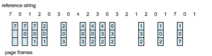
**Figure 10.15** LRU page-replacement algorithm.

for page 2, the LRU algorithm replaces page 3, since it is now the least recently used of the three pages in memory. Despite these problems, LRU replacement with twelve faults is much better than FIFO replacement with fifteen.

The LRU policy is often used as a page-replacement algorithm and is con- sidered to be good. The major problem is **_how_** to implement LRU replacement. An LRU page-replacement algorithm may require substantial hardware assis- tance. The problem is to determine an order for the frames defined by the time of last use. Two implementations are feasible:

• **Counters**. In the simplest case, we associate with each page-table entry a time-of-use field and add to the CPU a logical clock or counter. The clock is incremented for every memory reference. Whenever a reference to a page is made, the contents of the clock register are copied to the time-of-use field in the page-table entry for that page. In this way, we always have the “time” of the last reference to each page. We replace the page with the smallest time value. This scheme requires a search of the page table to find the LRU page and a write to memory (to the time-of-use field in the page table) for each memory access. The times must also be maintained when page tables are changed (due to CPU scheduling). Overflow of the clock must be considered.

• **Stack**. Another approach to implementing LRU replacement is to keep a stack of page numbers. Whenever a page is referenced, it is removed from the stack and put on the top. In this way, the most recently used page is always at the top of the stack, and the least recently used page is always at the bottom (Figure 10.16). Because entries must be removed from the middle of the stack, it is best to implement this approach by using a doubly linked list with a head pointer and a tail pointer. Removing a page and putting it on the top of the stack then requires changing six pointers at worst. Each update is a little more expensive, but there is no search for a replacement; the tail pointer points to the bottom of the stack, which is the LRU page. This approach is particularly appropriate for software or microcode implementations of LRU replacement.

Like optimal replacement, LRU replacement does not suffer from Belady’s anomaly. Both belong to a class of page-replacement algorithms, called **stack algorithms**, that can never exhibit Belady’s anomaly. A stack algorithm is an algorithm for which it can be shown that the set of pages in memory for _n_ frames is always a **_subset_** of the set of pages that would be in memory with _n_  
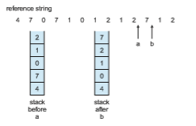
**Figure 10.16** Use of a stack to record the most recent page references.

\+ 1 frames. For LRU replacement, the set of pages in memory would be the _n_ most recently referenced pages. If the number of frames is increased, these _n_ pages will still be the most recently referenced and so will still be in memory.

Note that neither implementation of LRU would be conceivable without hardware assistance beyond the standard TLB registers. The updating of the clock fields or stack must be done for **_every_** memory reference. If we were to use an interrupt for every reference to allow software to update such data structures, it would slow every memory reference by a factor of at least ten, hence slowing every process by a factor of ten. Few systems could tolerate that level of overhead for memory management.

### LRU-Approximation Page Replacement

Not many computer systems provide sufficient hardware support for true LRU page replacement. In fact, some systems provide no hardware support, and other page-replacement algorithms (such as a FIFO algorithm) must be used. Many systems provide some help, however, in the form of a **reference bit**. The reference bit for a page is set by the hardware whenever that page is referenced (either a read or a write to any byte in the page). Reference bits are associated with each entry in the page table.

Initially, all bits are cleared (to 0) by the operating system. As a process executes, the bit associated with each page referenced is set (to 1) by the hardware. After some time,we can determinewhich pages have been used and which have not been used by examining the reference bits, although we do not know the **_order_** of use. This information is the basis formany page-replacement algorithms that approximate LRU replacement.

#### Additional-Reference-Bits Algorithm

We can gain additional ordering information by recording the reference bits at regular intervals. We can keep an 8-bit byte for each page in a table in memory. At regular intervals (say, every 100 milliseconds), a timer interrupt transfers control to the operating system. The operating system shifts the reference bit for each page into the high-order bit of its 8-bit byte, shifting the other bits right  

by 1 bit and discarding the low-order bit. These 8-bit shift registers contain the history of page use for the last eight time periods. If the shift register contains 00000000, for example, then the page has not been used for eight time periods. A page that is used at least once in each period has a shift register value of 11111111. A page with a history register value of 11000100 has been used more recently than one with a value of 01110111. If we interpret these 8-bit bytes as unsigned integers, the page with the lowest number is the LRU page, and it can be replaced.Notice that the numbers are not guaranteed to be unique, however. We can either replace (swap out) all pages with the smallest value or use the FIFO method to choose among them.

The number of bits of history included in the shift register can be varied, of course, and is selected (depending on the hardware available) to make the updating as fast as possible. In the extreme case, the number can be reduced to zero, leaving only the reference bit itself. This algorithm is called the **second- chance page-replacement algorithm**.

#### Second-Chance Algorithm

The basic algorithm of second-chance replacement is a FIFO replacement algo- rithm. When a page has been selected, however, we inspect its reference bit. If the value is 0, we proceed to replace this page; but if the reference bit is set to 1, we give the page a second chance and move on to select the next FIFO page. When a page gets a second chance, its reference bit is cleared, and its arrival time is reset to the current time. Thus, a page that is given a second chance will not be replaced until all other pages have been replaced (or given second chances). In addition, if a page is used often enough to keep its reference bit set, it will never be replaced.

One way to implement the second-chance algorithm (sometimes referred to as the **clock** algorithm) is as a circular queue. A pointer (that is, a hand on the clock) indicates which page is to be replaced next. When a frame is needed, the pointer advances until it finds a page with a 0 reference bit. As it advances, it clears the reference bits (Figure 10.17). Once a victim page is found, the page is replaced, and the new page is inserted in the circular queue in that position. Notice that, in the worst case, when all bits are set, the pointer cycles through the whole queue, giving each page a second chance. It clears all the reference bits before selecting the next page for replacement. Second-chance replacement degenerates to FIFO replacement if all bits are set.

#### Enhanced Second-Chance Algorithm

We can enhance the second-chance algorithm by considering the reference bit and the modify bit (described in Section 10.4.1) as an ordered pair. With these two bits, we have the following four possible classes:

**1\.** (0, 0) neither recently used nor modified—best page to replace

**2\.** (0, 1) not recently used butmodified—not quite as good, because the page will need to be written out before replacement

**3\.** (1, 0) recently used but clean—probably will be used again soon  
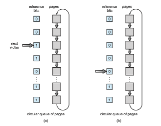
**Figure 10.17** Second-chance (clock) page-replacement algorithm.

**4\.** (1, 1) recently used andmodified—probablywill be used again soon, and the page will be need to be written out to secondary storage before it can be replaced

Each page is in one of these four classes. When page replacement is called for, we use the same scheme as in the clock algorithm; but instead of examining whether the page to which we are pointing has the reference bit set to 1, we examine the class to which that page belongs. We replace the first page encountered in the lowest nonempty class. Notice that wemay have to scan the circular queue several times before we find a page to be replaced. The major difference between this algorithm and the simpler clock algorithm is that here we give preference to those pages that have been modified in order to reduce the number of I/Os required.

### Counting-Based Page Replacement

There are many other algorithms that can be used for page replacement. For example, we can keep a counter of the number of references that have been made to each page and develop the following two schemes.

• The **least frequently used** (**LFU**) page-replacement algorithm requires that the pagewith the smallest count be replaced. The reason for this selection is that an actively used page should have a large reference count. A problem arises, however, when a page is used heavily during the initial phase of  

a process but then is never used again. Since it was used heavily, it has a large count and remains in memory even though it is no longer needed. One solution is to shift the counts right by 1 bit at regular intervals, forming an exponentially decaying average usage count.

• The **most frequently used** (**MFU**) page-replacement algorithm is based on the argument that the page with the smallest count was probably just brought in and has yet to be used.

As youmight expect, neither MFU nor LFU replacement is common. The imple- mentation of these algorithms is expensive, and they do not approximate OPT replacement well.

### Page-Buffering Algorithms

Other procedures are often used in addition to a specific page-replacement algorithm. For example, systems commonly keep a pool of free frames. When a page fault occurs, a victim frame is chosen as before. However, the desired page is read into a free frame from the pool before the victim iswritten out. This procedure allows the process to restart as soon as possible, without waiting for the victim page to bewritten out.When the victim is later written out, its frame is added to the free-frame pool.

An expansion of this idea is to maintain a list of modified pages.Whenever the pagingdevice is idle, amodifiedpage is selected and iswritten to secondary storage. Its modify bit is then reset. This scheme increases the probability that a page will be clean when it is selected for replacement and will not need to be written out.

Another modification is to keep a pool of free frames but to remember which pagewas in each frame. Since the frame contents are not modifiedwhen a frame iswritten to secondary storage, the oldpage can be reuseddirectly from the free-frame pool if it is needed before that frame is reused. No I/O is needed in this case. When a page fault occurs, we first check whether the desired page is in the free-frame pool. If it is not, we must select a free frame and read into it.

Some versions of the UNIX system use this method in conjunction with the second-chance algorithm. It can be a useful augmentation to any page- replacement algorithm, to reduce the penalty incurred if thewrong victimpage is selected. We describe these—and other—modifications in Section 10.5.3.

### Applications and Page Replacement

In certain cases, applications accessing data through the operating system’s vir- tual memory perform worse than if the operating system provided no buffer- ing at all. A typical example is a database, which provides its own memory management and I/O buffering. Applications like this understand their mem- ory use and storage use better than does an operating system that is implement- ing algorithms for general-purpose use. Furthermore, if the operating system is buffering I/O and the application is doing so as well, then twice the memory is being used for a set of I/O.

In another example, data warehouses frequently performmassive sequen- tial storage reads, followed by computations and writes. The LRU algorithm would be removing old pages and preserving new ones, while the applica- tion would more likely be reading older pages than newer ones (as it starts its sequential reads again). Here, MFU would actually be more efficient than LRU.

Because of such problems, some operating systems give special programs the ability to use a secondary storage partition as a large sequential array of logical blocks, without any file-system data structures. This array is some- times called the **raw disk**, and I/O to this array is termed raw I/O. Raw I/O bypasses all the file-system services, such as file I/O demand paging, file locking, prefetching, space allocation, file names, and directories. Note that although certain applications are more efficient when implementing their own special-purpose storage services on a raw partition, most applications perform better when they use the regular file-system services.

## Allocation of Frames

We turn next to the issue of allocation. How dowe allocate the fixed amount of free memory among the various processes? If we have 93 free frames and two processes, how many frames does each process get?

Consider a simple case of a system with 128 frames. The operating system may take 35, leaving 93 frames for the user process. Under pure demand paging, all 93 frames would initially be put on the free-frame list. When a user process started execution, it would generate a sequence of page faults. The first 93 page faults would all get free frames from the free-frame list. When the free-frame list was exhausted, a page-replacement algorithm would be used to select one of the 93 in-memory pages to be replaced with the 94th, and so on. When the process terminated, the 93 frames would once again be placed on the free-frame list.

There are many variations on this simple strategy. We can require that the operating system allocate all its buffer and table space from the free-frame list. When this space is not in use by the operating system, it can be used to support user paging.We can try to keep three free frames reserved on the free-frame list at all times. Thus, when a page fault occurs, there is a free frame available to page into. While the page swap is taking place, a replacement can be selected, which is then written to the storage device as the user process continues to execute. Other variants are also possible, but the basic strategy is clear: the user process is allocated any free frame.

### Minimum Number of Frames

Our strategies for the allocation of frames are constrained in various ways. We cannot, for example, allocate more than the total number of available frames (unless there is page sharing). Wemust also allocate at least a minimum number of frames. Here, we look more closely at the latter requirement.

One reason for allocating at least a minimum number of frames involves performance. Obviously, as the number of frames allocated to each process decreases, the page-fault rate increases, slowing process execution. In addi- tion, remember that, when a page fault occurs before an executing instruction is complete, the instruction must be restarted. Consequently, we must have enough frames to hold all the different pages that any single instruction can reference.  

For example, consider a machine in which all memory-reference instruc- tionsmay reference only onememory address. In this case, we need at least one frame for the instruction and one frame for the memory reference. In addition, if one-level indirect addressing is allowed (for example, a load instruction on frame 16 can refer to an address on frame 0, which is an indirect reference to frame 23), then paging requires at least three frames per process. (Think about what might happen if a process had only two frames.)

The minimum number of frames is defined by the computer architecture. For example, if the move instruction for a given architecture includes more than one word for some addressing modes, the instruction itself may straddle two frames. In addition, if each of its two operands may be indirect references, a total of six frames are required. As another example, the move instruction for Intel 32- and 64-bit architectures allows data to move only from register to register and between registers and memory; it does not allow direct memory- to-memory movement, thereby limiting the required minimum number of frames for a process.

Whereas the minimum number of frames per process is defined by the architecture, the maximum number is defined by the amount of available physical memory. In between, we are still left with significant choice in frame allocation.

### Allocation Algorithms

The easiest way to split _m_ frames among _n_ processes is to give everyone an equal share, _m_/_n_ frames (ignoring frames needed by the operating system for the moment). For instance, if there are 93 frames and 5 processes, each process will get 18 frames. The 3 leftover frames can be used as a free-frame buffer pool. This scheme is called **equal allocation**.

An alternative is to recognize that various processes will need differing amounts of memory. Consider a system with a 1-KB frame size. If a small student process of 10 KB and an interactive database of 127 KB are the only two processes running in a system with 62 free frames, it does not make much sense to give each process 31 frames. The student process does not need more than 10 frames, so the other 21 are, strictly speaking, wasted.

To solve this problem, we can use **proportional allocation**, in which we allocate available memory to each process according to its size. Let the size of the virtual memory for process _pi_ be _si_, and define

_S_ \= ∑_si_.

Then, if the total number of available frames is _m,_ we allocate _ai_ frames to process _pi_, where _ai_ is approximately

_ai_ \= _si_/_S_ × _m_.

Of course, we must adjust each _ai_ to be an integer that is greater than the minimum number of frames required by the instruction set, with a sum not exceeding _m._

With proportional allocation, we would split 62 frames between two pro- cesses, one of 10 pages and one of 127 pages, by allocating 4 frames and 57 frames, respectively, since  

10/137 × 62 ≈ 4 and 127/137 × 62 ≈ 57.

In this way, both processes share the available frames according to their “needs,” rather than equally.

In both equal and proportional allocation, of course, the allocation may vary according to the multiprogramming level. If the multiprogramming level is increased, each processwill lose some frames to provide thememory needed for the new process. Conversely, if the multiprogramming level decreases, the frames that were allocated to the departed process can be spread over the remaining processes.

Notice that, with either equal or proportional allocation, a high-priority process is treated the same as a low-priority process. By its definition, however, we may want to give the high-priority process more memory to speed its execution, to the detriment of low-priority processes. One solution is to use a proportional allocation scheme wherein the ratio of frames depends not on the relative sizes of processes but rather on the priorities of processes or on a combination of size and priority.

### Global versus Local Allocation

Another important factor in the way frames are allocated to the various pro- cesses is page replacement. With multiple processes competing for frames, we can classify page-replacement algorithms into two broad categories: **global replacement** and **local replacement**. Global replacement allows a process to select a replacement frame from the set of all frames, even if that frame is currently allocated to some other process; that is, one process can take a frame from another. Local replacement requires that each process select from only its own set of allocated frames.

For example, consider an allocation scheme wherein we allow high- priority processes to select frames from low-priority processes for replacement. A process can select a replacement from among its own frames or the frames of any lower-priority process. This approach allows a high-priority process to increase its frame allocation at the expense of a low-priority process. Whereas with a local replacement strategy, the number of frames allocated to a process does not change, with global replacement, a process may happen to select only frames allocated to other processes, thus increasing the number of frames allocated to it (assuming that other processes do not choose **_its_** frames for replacement).

One problem with a global replacement algorithm is that the set of pages in memory for a process depends not only on the paging behavior of that pro- cess, but also on the paging behavior of other processes. Therefore, the same process may perform quite differently (for example, taking 0.5 seconds for one execution and 4.3 seconds for the next execution) because of totally external circumstances. Such is not the case with a local replacement algorithm. Under local replacement, the set of pages in memory for a process is affected by the paging behavior of only that process. Local replacement might hinder a pro- cess, however, by not making available to it other, less used pages of memory. Thus, global replacement generally results in greater system throughput. It is therefore the more commonly used method.  

**_MAJOR ANDMINOR PAGE FAULTS_**

As described in Section 10.2.1, a page fault occurs when a page does not have a valid mapping in the address space of a process. Operating systems generally distinguish between two types of page faults: **major** and **minor** faults. (Windows refers to major and minor faults as **hard** and **soft** faults, respectively.) A major page fault occurs when a page is referenced and the page is not in memory. Servicing a major page fault requires reading the desired page from the backing store into a free frame and updating the page table. Demand paging typically generates an initially high rate of major page faults.

Minor page faults occur when a process does not have a logical mapping to a page, yet that page is in memory. Minor faults can occur for one of two reasons. First, a process may reference a shared library that is in memory, but the process does not have a mapping to it in its page table. In this instance, it is only necessary to update the page table to refer to the existing page in memory. A second cause of minor faults occurs when a page is reclaimed from a process and placed on the free-frame list, but the page has not yet been zeroed out and allocated to another process. When this kind of fault occurs, the frame is removed from the free-frame list and reassigned to the process. Asmight be expected, resolving aminor page fault is typically much less time consuming than resolving a major page fault.

You can observe the number of major and minor page faults in a Linux system using the command ps -eo min flt,maj flt,cmd, which outputs the number of minor and major page faults, as well as the command that launched the process.An example output of this ps commandappears below:

MINFL MAJFL CMD 186509 32 /usr/lib/systemd/systemd-logind 76822 9 /usr/sbin/sshd -D 1937 0 vim 10.tex 699 14 /sbin/auditd -n

Here, it is interesting to note that, for most commands, the number of major page faults is generally quite low,whereas the number ofminor faults ismuch higher. This indicates that Linux processes likely take significant advantage of shared libraries as, once a library is loaded in memory, subsequent page faults are only minor faults.

Next, we focus on one possible strategy that we can use to implement a global page-replacement policy. With this approach, we satisfy all memory requests from the free-frame list, but rather than waiting for the list to drop to zero before we begin selecting pages for replacement, we trigger page replace- ment when the list falls below a certain threshold. This strategy attempts to ensure there is always sufficient free memory to satisfy new requests.

Such a strategy is depicted in Figure 10.18. The strategy’s purpose is to keep the amount of free memory above a minimum threshold. When it drops  
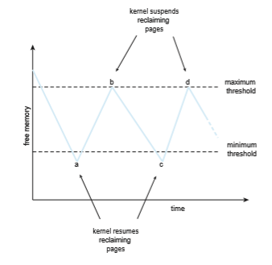
**Figure 10.18** Reclaiming pages.

below this threshold, a kernel routine is triggered that begins reclaiming pages from all processes in the system (typically excluding the kernel). Such kernel routines are often known as **reapers**, and they may apply any of the page- replacement algorithms covered in Section 10.4. When the amount of free memory reaches themaximum threshold, the reaper routine is suspended, only to resume once free memory again falls below the minimum threshold.

In Figure 10.18, we see that at point a the amount of free memory drops below the minimum threshold, and the kernel begins reclaiming pages and adding them to the free-frame list. It continues until the maximum threshold is reached (point b). Over time, there are additional requests for memory, and at point c the amount of free memory again falls below the minimum threshold. Page reclamation resumes, only to be suspended when the amount of free memory reaches the maximum threshold (point d). This process continues as long as the system is running.

As mentioned above, the kernel reaper routine may adopt any page- replacement algorithm, but typically it uses some form of LRU approximation. Consider what may happen, though, if the reaper routine is unable to maintain the list of free frames below the minimum threshold. Under these circum-  

stances, the reaper routine may begin to reclaim pages more aggressively. For example, perhaps it will suspend the second-chance algorithm and use pure FIFO. Another, more extreme, example occurs in Linux; when the amount of free memory falls to **_very_** low levels, a routine known as the **out-of-memory** (**OOM**) **killer** selects a process to terminate, thereby freeing its memory. How does Linux determine which process to terminate? Each process has what is known as an OOM score, with a higher score increasing the likelihood that the process could be terminated by the OOM killer routine. OOM scores are calcu- lated according to the percentage of memory a process is using—the higher the percentage, the higher the OOM score. (OOM scores can be viewed in the /proc file system, where the score for a process with pid 2500 can be viewed as /proc/2500/oom score.)

In general, not only can reaper routines vary how aggressively they reclaim memory, but the values of the minimum and maximum thresholds can be varied as well. These values can be set to default values, but some systems may allow a system administrator to configure them based on the amount of physical memory in the system.

### Non-Uniform Memory Access

Thus far in our coverage of virtual memory, we have assumed that all main memory is created equal—or at least that it is accessed equally. On **non- uniform memory access** (**NUMA**) systems with multiple CPUs (Section 1.3.2), that is not the case. On these systems, a given CPU can access some sections of main memory faster than it can access others. These performance differences are caused by how CPUs and memory are interconnected in the system. Such a system is made up of multiple CPUs, each with its own local memory (Figure 10.19). The CPUs are organized using a shared system interconnect, and as you might expect, a CPU can access its local memory faster than memory local to another CPU. NUMA systems are without exception slower than systems in which all accesses to main memory are treated equally. However, as described in Section 1.3.2, NUMA systems can accommodate more CPUs and therefore achieve greater levels of throughput and parallelism.
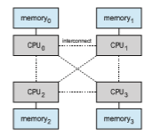
**Figure 10.19** NUMA multiprocessing architecture.  

Managing which page frames are stored at which locations can signifi- cantly affect performance in NUMA systems. If we treat memory as uniform in such a system, CPUs may wait significantly longer for memory access than if we modify memory allocation algorithms to take NUMA into account. We described some of these modifications in Section 5.5.4. Their goal is to have memory frames allocated “as close as possible” to the CPU onwhich the process is running. (The definition of **_close_** is “with minimum latency,” which typically means on the same system board as the CPU). Thus, when a process incurs a page fault, a NUMA-aware virtual memory system will allocate that process a frame as close as possible to the CPU on which the process is running.

To take NUMA into account, the scheduler must track the last CPU on which each process ran. If the scheduler tries to schedule each process onto its previous CPU, and the virtual memory system tries to allocate frames for the process close to the CPU on which it is being scheduled, then improved cache hits and decreased memory access times will result.

The picture is more complicated once threads are added. For example, a process with many running threads may end up with those threads scheduled onmany different system boards. How should the memory be allocated in this case?

As we discussed in Section 5.7.1, Linux manages this situation by having the kernel identify a hierarchy of scheduling domains. The Linux CFS scheduler does not allow threads to migrate across different domains and thus incur memory access penalties. Linux also has a separate free-frame list for each NUMAnode, thereby ensuring that a thread will be allocated memory from the node on which it is running. Solaris solves the problem similarly by creating **lgroups** (for “locality groups”) in the kernel. Each lgroup gathers together CPUs and memory, and each CPU in that group can access any memory in the group within a defined latency interval. In addition, there is a hierarchy of lgroups based on the amount of latency between the groups, similar to the hierarchy of scheduling domains in Linux. Solaris tries to schedule all threads of a process and allocate all memory of a process within an lgroup. If that is not possible, it picks nearby lgroups for the rest of the resources needed. This practiceminimizes overall memory latency andmaximizes CPU cache hit rates.

## Thrashing

Consider what occurs if a process does not have “enough” frames—that is, it does not have the minimum number of frames it needs to support pages in the working set. The process will quickly page-fault. At this point, it must replace some page. However, since all its pages are in active use, it must replace a page that will be needed again right away. Consequently, it quickly faults again, and again, and again, replacing pages that it must bring back in immediately.

This high paging activity is called **thrashing**. A process is thrashing if it is spending more time paging than executing. As you might expect, thrashing results in severe performance problems.

### Cause of Thrashing

Consider the following scenario, which is based on the actual behavior of early paging systems. The operating systemmonitors CPU utilization. If CPU utilization is too low, we increase the degree of multiprogramming by introducing a new process to the system. A global page-replacement algorithm is used; it replaces pages without regard to the process to which they belong. Now suppose that a process enters a new phase in its execution and needs more frames. It starts faulting and taking frames away from other processes. These processes need those pages, however, and so they also fault, taking frames from other processes. These faulting processes must use the paging device to swap pages in and out. As they queue up for the paging device, the ready queue empties. As processes wait for the paging device, CPU utilization decreases.

The CPU scheduler sees the decreasing CPU utilization and **_increases_** the degree ofmultiprogramming as a result. The new process tries to get started by taking frames from running processes, causing more page faults and a longer queue for the paging device. As a result, CPU utilization drops even further, and the CPU scheduler tries to increase the degree of multiprogramming even more. Thrashing has occurred, and system throughput plunges. The page- fault rate increases tremendously. As a result, the effectivememory-access time increases. Nowork is getting done, because the processes are spending all their time paging.

This phenomenon is illustrated in Figure 10.20, in which CPU utilization is plotted against the degree of multiprogramming. As the degree of multi- programming increases, CPU utilization also increases, although more slowly, until a maximum is reached. If the degree of multiprogramming is increased further, thrashing sets in, and CPU utilization drops sharply. At this point, to increase CPU utilization and stop thrashing, we must **_decrease_** the degree of multiprogramming.

We can limit the effects of thrashing by using a **local replacement algo- rithm** (or **priority replacement algorithm**). Asmentioned earlier, local replace- ment requires that each process select from only its own set of allocated frames. Thus, if one process starts thrashing, it cannot steal frames from another pro- cess and cause the latter to thrash as well. However, the problem is not entirely solved. If processes are thrashing, they will be in the queue for the paging device most of the time. The average service time for a page fault will increase
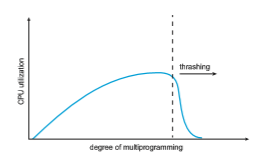
**Figure 10.20** Thrashing.  

because of the longer average queue for the paging device. Thus, the effective access time will increase even for a process that is not thrashing.

To prevent thrashing, we must provide a process with as many frames as it needs. But how do we know how many frames it “needs”? One strategy starts by looking at howmany frames a process is actually using. This approach defines the **locality model** of process execution.

The locality model states that, as a process executes, it moves from locality to locality. A locality is a set of pages that are actively used together. A running program is generally composed of several different localities, which may over- lap. For example, when a function is called, it defines a new locality. In this

**Figure 10.21** Locality in a memory-reference pattern.  
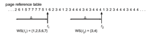
**Figure 10.22** Working-set model.

locality, memory references are made to the instructions of the function call, its local variables, and a subset of the global variables. When we exit the function, the process leaves this locality, since the local variables and instructions of the function are no longer in active use. We may return to this locality later.

Figure 10.21 illustrates the concept of locality and how a process’s locality changes over time. At time (_a_), the locality is the set of pages {18, 19, 20, 21, 22, 23, 24, 29, 30, 33}. At time (_b_), the locality changes to {18, 19, 20, 24, 25, 26, 27, 28, 29, 31, 32, 33}. Notice the overlap, as some pages (for example, 18, 19, and 20) are part of both localities.

Thus, we see that localities are defined by the program structure and its data structures. The locality model states that all programs will exhibit this basic memory reference structure. Note that the locality model is the unstated principle behind the caching discussions so far in this book. If accesses to any types of data were random rather than patterned, caching would be useless.

Suppose we allocate enough frames to a process to accommodate its cur- rent locality. It will fault for the pages in its locality until all these pages are in memory; then, it will not fault again until it changes localities. If we do not allocate enough frames to accommodate the size of the current locality, the process will thrash, since it cannot keep in memory all the pages that it is actively using.

### Working-Set Model

The **working-set model** is based on the assumption of locality. This model uses a parameter,Δ, to define the **working-set window**. The idea is to examine the most recent Δ page references. The set of pages in the most recent Δ page references is the**working set** (Figure 10.22). If a page is in active use, it will be in the working set. If it is no longer being used, it will drop from the working set Δ time units after its last reference. Thus, the working set is an approximation of the program’s locality.

For example, given the sequence of memory references shown in Figure 10.22, if Δ = 10 memory references, then the working set at time _t_1 is _{_1, 2, 5, 6, 7_}_. By time _t_2, the working set has changed to _{_3, 4_}_.

The accuracy of the working set depends on the selection of Δ. If Δ is too small, it will not encompass the entire locality; if Δ is too large, it may overlap several localities. In the extreme, if Δ is infinite, the working set is the set of pages touched during the process execution.

The most important property of the working set, then, is its size. If we compute the working-set size, _WSSi_, for each process in the system, we can then consider that  

_D_ \= ∑_WSSi_,

where_D_ is the total demand for frames. Each process is actively using the pages in its working set. Thus, process _i_ needs _WSSi_ frames. If the total demand is greater than the total number of available frames (_D >m_), thrashing will occur, because some processes will not have enough frames.

Once Δ has been selected, use of the working-set model is simple. The operating system monitors the working set of each process and allocates to that working set enough frames to provide it with its working-set size. If there are enough extra frames, another process can be initiated. If the sum of the working-set sizes increases, exceeding the total number of available frames, the operating system selects a process to suspend. The process’s pages are written out (swapped), and its frames are reallocated to other processes. The suspended process can be restarted later.

This working-set strategy prevents thrashing while keeping the degree of multiprogramming as high as possible. Thus, it optimizes CPU utilization. The difficulty with the working-set model is keeping track of the working set. The

**_WORKING SETS AND PAGE-FAULT RATES_**

There is a direct relationship between the working set of a process and its page-fault rate. Typically, as shown in Figure 10.22, the working set of a process changes over time as references to data and code sections move from one locality to another. Assuming there is sufficient memory to store the working set of a process (that is, the process is not thrashing), the page-fault rate of the process will transition between peaks and valleys over time. This general behavior is shown below:

Apeak in the page-fault rate occurs whenwe begin demand-paging a new locality. However, once the working set of this new locality is in memory, the page-fault rate falls. When the processmoves to a newworking set, the page- fault rate rises toward a peak once again, returning to a lower rate once the new working set is loaded into memory. The span of time between the start of one peak and the start of the next peak represents the transition from one working set to another.  

working-set window is a moving window. At each memory reference, a new reference appears at one end, and the oldest reference drops off the other end. A page is in the working set if it is referenced anywhere in the working-set window.

We can approximate the working-set model with a fixed-interval timer interrupt and a reference bit. For example, assume that Δ equals 10,000 ref- erences and that we can cause a timer interrupt every 5,000 references. When we get a timer interrupt, we copy and clear the reference-bit values for each page. Thus, if a page fault occurs, we can examine the current reference bit and two in-memory bits to determine whether a page was used within the last 10,000 to 15,000 references. If it was used, at least one of these bits will be on. If it has not been used, these bits will be off. Pages with at least one bit on will be considered to be in the working set.

Note that this arrangement is not entirely accurate, because we cannot tell where, within an interval of 5,000, a reference occurred. We can reduce the uncertainty by increasing the number of history bits and the frequency of inter- rupts (for example, 10 bits and interrupts every 1,000 references). However, the cost to service these more frequent interrupts will be correspondingly higher.

### Page-Fault Frequency

The working-set model is successful, and knowledge of the working set can be useful for prepaging (Section 10.9.1), but it seems a clumsy way to control thrashing. A strategy that uses the **page-fault frequency** (**PFF**) takes a more direct approach.

The specific problem is how to prevent thrashing. Thrashing has a high page-fault rate. Thus, we want to control the page-fault rate. When it is too high, we know that the process needs more frames. Conversely, if the page- fault rate is too low, then the process may have too many frames. We can establish upper and lower bounds on the desired page-fault rate (Figure 10.23). If the actual page-fault rate exceeds the upper limit, we allocate the process

**Figure 10.23** Page-fault frequency.  

another frame. If the page-fault rate falls below the lower limit, we remove a frame from the process. Thus, we can directly measure and control the page- fault rate to prevent thrashing.

Aswith theworking-set strategy, wemay have to swap out a process. If the page-fault rate increases and no free frames are available, we must select some process and swap it out to backing store. The freed frames are then distributed to processes with high page-fault rates.

### Current Practice

Practically speaking, thrashing and the resulting swapping have a disagreeably high impact on performance. The current best practice in implementing a computer system is to include enough physical memory, whenever possible, to avoid thrashing and swapping. From smartphones through large servers, providing enough memory to keep all working sets in memory concurrently, except under extreme conditions, provides the best user experience.

## Memory Compression

An alternative to paging is **memory compression**. Here, rather than paging out modified frames to swap space, we compress several frames into a single frame, enabling the system to reduce memory usage without resorting to swapping pages.

In Figure 10.24, the free-frame list contains six frames. Assume that this number of free frames falls below a certain threshold that triggers page replace- ment. The replacement algorithm (say, an LRUapproximation algorithm) selects four frames—15, 3, 35, and 26—to place on the free-frame list. It first places these frames on amodified-frame list. Typically, the modified-frame list would next be written to swap space, making the frames available to the free-frame list. An alternative strategy is to compress a number of frames—say, three— and store their compressed versions in a single page frame.

In Figure 10.25, frame 7 is removed from the free-frame list. Frames 15, 3, and 35 are compressed and stored in frame 7, which is then stored in the list of compressed frames. The frames 15, 3, and 35 can now be moved to the free-frame list. If one of the three compressed frames is later referenced, a page fault occurs, and the compressed frame is decompressed, restoring the three pages 15, 3, and 35 in memory.

**Figure 10.24** Free-frame list before compression.  

**Figure 10.25** Free-frame list after compression

As we have noted, mobile systems generally do not support either stan- dard swapping or swapping pages. Thus, memory compression is an integral part of the memory-management strategy for most mobile operating systems, including Android and iOS. In addition, both Windows 10 and macOS support memory compression. For Windows 10, Microsoft developed the **Universal Windows Platform** (**UWP**) architecture, which provides a common app plat- form for devices that run Windows 10, including mobile devices. UWP apps running on mobile devices are candidates for memory compression. macOS first supported memory compression with Version 10.9 of the operating sys- tem, first compressing LRU pages when free memory is short and then paging if that doesn’t solve the problem. Performance tests indicate that memory com- pression is faster than paging even to SSD secondary storage on laptop and desktop macOS systems.

Although memory compression does require allocating free frames to hold the compressed pages, a significant memory saving can be realized, depending on the reductions achieved by the compression algorithm. (In the example above, the three frames were reduced to one-third of their original size.) As with any form of data compression, there is contention between the speed of the compression algorithm and the amount of reduction that can be achieved (known as the **compression ratio**). In general, higher compression ratios (greater reductions) can be achieved by slower, more computationally expensive algorithms. Most algorithms in use today balance these two factors, achieving relatively high compression ratios using fast algorithms. In addition, compression algorithms have improved by taking advantage of multiple com- puting cores and performing compression in parallel. For example,Microsoft’s Xpress and Apple’s WKdm compression algorithms are considered fast, and they report compressing pages to 30 to 50 percent of their original size.

## Allocating Kernel Memory

When a process running in user mode requests additional memory, pages are allocated from the list of free page frames maintained by the kernel. This list is typically populated using a page-replacement algorithm such as those dis- cussed in Section 10.4 andmost likely contains free pages scattered throughout physical memory, as explained earlier. Remember, too, that if a user process requests a single byte of memory, internal fragmentation will result, as the process will be granted an entire page frame.  

Kernel memory is often allocated from a free-memory pool different from the list used to satisfy ordinary user-mode processes. There are two primary reasons for this:

**1\.** The kernel requests memory for data structures of varying sizes, some of which are less than a page in size.As a result, the kernelmust usememory conservatively and attempt tominimizewaste due to fragmentation. This is especially important because many operating systems do not subject kernel code or data to the paging system.

**2\.** Pages allocated to user-mode processes do not necessarily have to be in contiguous physicalmemory.However, certain hardware devices interact directly with physical memory—without the benefit of a virtual memory interface—and consequentlymay requirememory residing in physically contiguous pages.

In the following sections,we examine two strategies formanaging freememory that is assigned to kernel processes: the “buddy system” and slab allocation.

### Buddy System

The buddy system allocates memory from a fixed-size segment consisting of physically contiguous pages. Memory is allocated from this segment using a **power-of-2 allocator**, which satisfies requests in units sized as a power of 2 (4 KB, 8 KB, 16 KB, and so forth). A request in units not appropriately sized is rounded up to the next highest power of 2. For example, a request for 11 KB is satisfied with a 16-KB segment.

Let’s consider a simple example. Assume the size of a memory segment is initially 256 KB and the kernel requests 21 KB of memory. The segment is initially divided into two **buddies**—which we will call _AL_ and _AR_—each 128 KB in size. One of these buddies is further divided into two 64-KB buddies—_BL_ and _BR_. However, the next-highest power of 2 from 21 KB is 32 KB so either _BL_ or _BR_ is again divided into two 32-KB buddies,_CL_ and _CR_. One of these buddies is used to satisfy the 21-KB request. This scheme is illustrated in Figure 10.26, where _CL_ is the segment allocated to the 21-KB request.

An advantage of the buddy system is how quickly adjacent buddies can be combined to form larger segments using a technique known as **coalescing**. In Figure 10.26, for example, when the kernel releases the _CL_ unit it was allocated, the system can coalesce _CL_ and _CR_ into a 64-KB segment. This segment, _BL_, can in turn be coalesced with its buddy _BR_ to form a 128-KB segment. Ultimately, we can end up with the original 256-KB segment.

The obvious drawback to the buddy system is that rounding up to the next highest power of 2 is very likely to cause fragmentation within allocated seg- ments. For example, a 33-KB request can only be satisfiedwith a 64-KB segment. In fact, we cannot guarantee that less than 50 percent of the allocated unit will be wasted due to internal fragmentation. In the following section, we explore a memory allocation scheme where no space is lost due to fragmentation.

### Slab Allocation

Asecond strategy for allocating kernel memory is known as **slab allocation**. A **slab** is made up of one or more physically contiguous pages. A **cache** consists  

**Figure 10.26** Buddy system allocation.

of one or more slabs. There is a single cache for each unique kernel data struc- ture—for example, a separate cache for the data structure representing process descriptors, a separate cache for file objects, a separate cache for semaphores, and so forth. Each cache is populated with **objects** that are instantiations of the kernel data structure the cache represents. For example, the cache represent- ing semaphores stores instances of semaphore objects, the cache representing process descriptors stores instances of process descriptor objects, and so forth. The relationship among slabs, caches, and objects is shown in Figure 10.27. The figure shows two kernel objects 3 KB in size and three objects 7 KB in size, each stored in a separate cache.
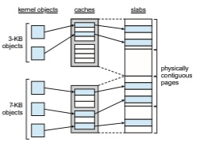
**Figure 10.27** Slab allocation.  

The slab-allocation algorithm uses caches to store kernel objects. When a cache is created, a number of objects—which are initiallymarked as free—are allocated to the cache. The number of objects in the cache depends on the size of the associated slab. For example, a 12-KB slab (made up of three contiguous 4-KB pages) could store six 2-KB objects. Initially, all objects in the cache are marked as free. When a new object for a kernel data structure is needed, the allocator can assign any free object from the cache to satisfy the request. The object assigned from the cache is marked as used.

Let’s consider a scenario in which the kernel requests memory from the slab allocator for an object representing a process descriptor. In Linux sys- tems, a process descriptor is of the type struct task struct, which requires approximately 1.7 KB of memory. When the Linux kernel creates a new task, it requests the necessary memory for the struct task struct object from its cache. The cache will fulfill the request using a struct task struct object that has already been allocated in a slab and is marked as free.

In Linux, a slab may be in one of three possible states:

**1\. Full**. All objects in the slab are marked as used.

**2\. Empty**. All objects in the slab are marked as free.

**3\. Partial**. The slab consists of both used and free objects.

The slab allocator first attempts to satisfy the request with a free object in a partial slab. If none exists, a free object is assigned from an empty slab. If no empty slabs are available, a new slab is allocated from contiguous physical pages and assigned to a cache; memory for the object is allocated from this slab.

The slab allocator provides two main benefits:

**1\.** No memory is wasted due to fragmentation. Fragmentation is not an issue because each unique kernel data structure has an associated cache, and each cache is made up of one or more slabs that are divided into chunks the size of the objects being represented. Thus, when the kernel requestsmemory for an object, the slab allocator returns the exact amount of memory required to represent the object.

**2\.** Memory requests can be satisfied quickly. The slab allocation scheme is thus particularly effective for managing memory when objects are fre- quently allocated and deallocated, as is often the case with requests from the kernel. The act of allocating—and releasing—memory can be a time- consuming process. However, objects are created in advance and thus can be quickly allocated from the cache. Furthermore, when the kernel has finished with an object and releases it, it is marked as free and returned to its cache, thusmaking it immediately available for subsequent requests from the kernel.

The slab allocator first appeared in the Solaris 2.4 kernel. Because of its general-purpose nature, this allocator is now also used for certain user-mode memory requests in Solaris. Linux originally used the buddy system; however, beginning with Version 2.2, the Linux kernel adopted the slab allocator. Linux  
refers to its slab implementation as SLAB. Recent distributions of Linux include two other kernel memory allocators—the SLOB and SLUB allocators.

The SLOB allocator is designed for systems with a limited amount of mem- ory, such as embedded systems. SLOB (which stands for “simple list of blocks”) maintains three lists of objects: **_small_** (for objects less than 256 bytes), **_medium_** (for objects less than 1,024 bytes), and **_large_** (for all other objects less than the size of a page). Memory requests are allocated from an object on the appropri- ate list using a first-fit policy.

Beginning with Version 2.6.24, the SLUB allocator replaced SLAB as the default allocator for the Linux kernel. SLUB reduced much of the overhead required by the SLAB allocator. For instance, whereas SLAB stores certain meta- data with each slab, SLUB stores these data in the page structure the Linux kernel uses for each page. Additionally, SLUB does not include the per-CPU queues that the SLAB allocator maintains for objects in each cache. For systems with a large number of processors, the amount of memory allocated to these queues is significant. Thus, SLUB provides better performance as the number of processors on a system increases.

## Other Considerations

The major decisions that we make for a paging system are the selections of a replacement algorithm and an allocation policy, which we discussed earlier in this chapter. There are many other considerations as well, and we discuss several of them here.

### Prepaging

An obvious property of pure demand paging is the large number of page faults that occur when a process is started. This situation results from trying to get the initial locality into memory. **Prepaging** is an attempt to prevent this high level of initial paging. The strategy is to bring some—or all—of the pages that will be needed into memory at one time.

In a system using the working-set model, for example, we could keep with each process a list of the pages in its working set. If we must suspend a process (due to a lack of free frames), we remember the working set for that process. When the process is to be resumed (because I/O has finished or enough free frames have become available), we automatically bring back into memory its entire working set before restarting the process.

Prepaging may offer an advantage in some cases. The question is simply whether the cost of using prepaging is less than the cost of servicing the corresponding page faults. It may well be the case that many of the pages brought back into memory by prepaging will not be used.

Assume that _s_ pages are prepaged and a fraction α of these _s_ pages is actually used (0 ≤ α ≤ 1). The question is whether the cost of the _s_ \* α saved page faults is greater or less than the cost of prepaging _s_ \* (1 − α) unnecessary pages. If α is close to 0, prepaging loses; if α is close to 1, prepaging wins.

Note also that prepaging an executable program may be difficult, as it may be unclear exactly what pages should be brought in. Prepaging a file may be more predictable, since files are often accessed sequentially. The Linux  

readahead() system call prefetches the contents of a file into memory so that subsequent accesses to the file will take place in main memory.

### Page Size

The designers of an operating system for an existing machine seldom have a choice concerning the page size. However, when new machines are being designed, a decision regarding the best page size must be made. As you might expect, there is no single best page size. Rather, there is a set of factors that support various sizes. Page sizes are invariably powers of 2, generally ranging from 4,096 (212) to 4,194,304 (222) bytes.

How dowe select a page size? One concern is the size of the page table. For a given virtual memory space, decreasing the page size increases the number of pages and hence the size of the page table. For a virtualmemory of 4MB (222), for example, there would be 4,096 pages of 1,024 bytes but only 512 pages of 8,192 bytes. Because each active process must have its own copy of the page table, a large page size is desirable.

Memory is better utilized with smaller pages, however. If a process is allocatedmemory starting at location 00000 and continuing until it has asmuch as it needs, it probably will not end exactly on a page boundary. Thus, a part of the final page must be allocated (because pages are the units of allocation) but will be unused (creating internal fragmentation). Assuming independence of process size and page size, we can expect that, on the average, half of the final page of each process will be wasted. This loss is only 256 bytes for a page of 512 bytes but is 4,096 bytes for a page of 8,192 bytes. To minimize internal fragmentation, then, we need a small page size.

Another problem is the time required to read or write a page. As you will see in Section 11.1, when the storage device is an HDD, I/O time is composed of seek, latency, and transfer times. Transfer time is proportional to the amount transferred (that is, the page size)—a fact that would seem to argue for a small page size. However, latency and seek time normally dwarf transfer time. At a transfer rate of 50 MB per second, it takes only 0.01 milliseconds to transfer 512 bytes. Latency time, though, is perhaps 3 milliseconds, and seek time 5 milliseconds. Of the total I/O time (8.01 milliseconds), therefore, only about 0.1 percent is attributable to the actual transfer. Doubling the page size increases I/O time to only 8.02 milliseconds. It takes 8.02 milliseconds to read a single page of 1,024 bytes but 16.02 milliseconds to read the same amount as two pages of 512 bytes each. Thus, a desire to minimize I/O time argues for a larger page size.

With a smaller page size, though, total I/O should be reduced, since locality will be improved. A smaller page size allows each page to match program locality more accurately. For example, consider a process 200 KB in size, of which only half (100 KB) is actually used in an execution. If we have only one large page, we must bring in the entire page, a total of 200 KB transferred and allocated. If instead we had pages of only 1 byte, then we could bring in only the 100 KB that are actually used, resulting in only 100 KB transferred and allocated. With a smaller page size, then, we have better **resolution**, allowing us to isolate only the memory that is actually needed. With a larger page size, we must allocate and transfer not only what is needed but also anything else that happens to be in the page, whether it is needed or not. Thus, a smaller page size should result in less I/O and less total allocated memory.

But did you notice that with a page size of 1 byte, we would have a page fault for **_each_** byte? A process of 200 KB that used only half of that memory would generate only one page fault with a page size of 200 KB but 102,400 page faults with a page size of 1 byte. Each page fault generates the large amount of overhead needed for processing the interrupt, saving registers, replacing a page, queuing for the paging device, and updating tables. To minimize the number of page faults, we need to have a large page size.

Other factors must be considered as well (such as the relationship between page size and sector size on the paging device). The problem has no best answer. As we have seen, some factors (internal fragmentation, locality) argue for a small page size, whereas others (table size, I/O time) argue for a large page size. Nevertheless, the historical trend is toward larger page sizes, even for mobile systems. Indeed, the first edition of_Operating System Concepts_ (1983) used 4,096 bytes as the upper bound on page sizes, and this valuewas themost common page size in 1990. Modern systems may now use much larger page sizes, as you will see in the following section.

### TLB Reach

In Chapter 9, we introduced the **hit ratio** of the TLB. Recall that the hit ratio for the TLB refers to the percentage of virtual address translations that are resolved in the TLB rather than the page table. Clearly, the hit ratio is related to the number of entries in the TLB, and the way to increase the hit ratio is by increasing the number of entries. This, however, does not come cheaply, as the associative memory used to construct the TLB is both expensive and power hungry.

Related to the hit ratio is a similar metric: the **TLB reach**. The TLB reach refers to the amount of memory accessible from the TLB and is simply the number of entries multiplied by the page size. Ideally, the working set for a process is stored in the TLB. If it is not, the process will spend a considerable amount of time resolving memory references in the page table rather than the TLB. If we double the number of entries in the TLB, we double the TLB reach. However, for some memory-intensive applications, this may still prove insufficient for storing the working set.

Another approach for increasing the TLB reach is to either increase the size of the page or provide multiple page sizes. If we increase the page size—say, from 4 KB to 16 KB—we quadruple the TLB reach. However, this may lead to an increase in fragmentation for some applications that do not require such a large page size. Alternatively, most architectures provide support for more than one page size, and an operating system can be configured to take advantage of this support. For example, the default page size on Linux systems is 4 KB; however, Linux also provides **huge pages**, a feature that designates a region of physical memory where larger pages (for example, 2 MB) may be used.

Recall from Section 9.7 that the ARMv8 architecture provides support for pages and regions of different sizes. Additionally, each TLB entry in the ARMv8 contains a **contiguous bit**. If this bit is set for a particular TLB entry, that entry maps contiguous (adjacent) blocks of memory. Three possible arrangements of  

contiguous blocks can be mapped in a single TLB entry, thereby increasing the TLB reach:

**1\.** 64-KB TLB entry comprising 16 × 4 KB adjacent blocks.

**2\.** 1-GB TLB entry comprising 32 × 32 MB adjacent blocks.

**3\.** 2-MB TLB entry comprising either 32 × 64 KB adjacent blocks, or 128 × 16 KB adjacent blocks.

Providing support for multiple page sizes may require the operating sys- tem—rather than hardware—tomanage the TLB. For example, one of the fields in a TLB entry must indicate the size of the page frame corresponding to the entry—or, in the case of ARM architectures, must indicate that the entry refers to a contiguous block of memory. Managing the TLB in software and not hard- ware comes at a cost in performance. However, the increased hit ratio and TLB reach offset the performance costs.

### Inverted Page Tables

Section 9.4.3 introduced the concept of the inverted page table. The purpose of this form of page management is to reduce the amount of physical memory needed to track virtual-to-physical address translations. We accomplish this savings by creating a table that has one entry per page of physical memory, indexed by the pair _<_process-id, page-number_\>_.

Because they keep information about which virtual memory page is stored in each physical frame, inverted page tables reduce the amount of physical memory needed to store this information. However, the inverted page table no longer contains complete information about the logical address space of a process, and that information is required if a referenced page is not currently in memory. Demand paging requires this information to process page faults. For the information to be available, an external page table (one per process) must be kept. Each such table looks like the traditional per-process page table and contains information on where each virtual page is located.

But do external page tables negate the utility of inverted page tables? Since these tables are referenced only when a page fault occurs, they do not need to be available quickly. Instead, they are themselves paged in and out of memory as necessary. Unfortunately, a page fault may now cause the virtual memory manager to generate another page fault as it pages in the external page table it needs to locate the virtual page on the backing store. This special case requires careful handling in the kernel and a delay in the page-lookup processing.

### Program Structure

Demand paging is designed to be transparent to the user program. In many cases, the user is completely unaware of the paged nature of memory. In other cases, however, system performance can be improved if the user (or compiler) has an awareness of the underlying demand paging.

Let’s look at a contrived but informative example. Assume that pages are 128 words in size. Consider a C program whose function is to initialize to 0 each element of a 128-by-128 array. The following code is typical:  
```
int i, j; int\[128\]\[128\] data;

for (j = 0; j < 128; j++) for (i = 0; i < 128; i++)

data\[i\]\[j\] = 0;
```
Notice that the array is stored row major; that is, the array is stored data\[0\]\[0\], data\[0\]\[1\], · · ·, data\[0\]\[127\], data\[1\]\[0\], data\[1\]\[1\], · · ·, data\[127\]\[127\]. For pages of 128 words, each row takes one page. Thus, the preceding code zeros one word in each page, then another word in each page, and so on. If the operating system allocates fewer than 128 frames to the entire program, then its execution will result in 128 × 128 = 16,384 page faults.

In contrast, suppose we change the code to
```
int i, j; int\[128\]\[128\] data;

for (i = 0; i < 128; i++) for (j = 0; j < 128; j++)

data\[i\]\[j\] = 0;
```
This code zeros all the words on one page before starting the next page, reducing the number of page faults to 128.

Careful selection of data structures and programming structures can increase locality and hence lower the page-fault rate and the number of pages in the working set. For example, a stack has good locality, since access is always made to the top. A hash table, in contrast, is designed to scatter references, producing bad locality. Of course, locality of reference is just one measure of the efficiency of the use of a data structure. Other heavily weighted factors include search speed, total number of memory references, and total number of pages touched.

At a later stage, the compiler and loader can have a significant effect on paging. Separating code and data and generating reentrant code means that code pages can be read-only and hence will never be modified. Clean pages do not have to be paged out to be replaced. The loader can avoid placing routines across page boundaries, keeping each routine completely in one page. Routines that call each other many times can be packed into the same page. This packaging is a variant of the bin-packing problem of operations research: try to pack the variable-sized load segments into the fixed-sized pages so that interpage references areminimized. Such an approach is particularly useful for large page sizes.

### I/O Interlock and Page Locking

When demand paging is used, we sometimes need to allow some of the pages to be **locked** in memory. One such situation occurs when I/O is done to or from user (virtual) memory. I/O is often implemented by a separate I/O processor. For example, a controller for a USB storage device is generally given the number of bytes to transfer and a memory address for the buffer (Figure 10.28). When the transfer is complete, the CPU is interrupted.

Wemust be sure the following sequence of events does not occur: Aprocess issues an I/O request and is put in a queue for that I/O device. Meanwhile, the CPU is given to other processes. These processes cause page faults, and one of them, using a global replacement algorithm, replaces the page containing the memory buffer for the waiting process. The pages are paged out. Some time later, when the I/O request advances to the head of the device queue, the I/O occurs to the specified address. However, this frame is now being used for a different page belonging to another process.

There are two common solutions to this problem. One solution is never to execute I/O to user memory. Instead, data are always copied between system memory and user memory. I/O takes place only between system memory and the I/O device. Thus, to write a block on tape, we first copy the block to system memory and then write it to tape. This extra copying may result in unacceptably high overhead.

Another solution is to allow pages to be locked into memory. Here, a lock bit is associated with every frame. If the frame is locked, it cannot be selected for replacement. Under this approach, to write a block to disk, we lock into memory the pages containing the block. The system can then continue as usual. Locked pages cannot be replaced. When the I/O is complete, the pages are unlocked.

Lock bits are used in various situations. Frequently, some or all of the operating-system kernel is locked into memory. Many operating systems can- not tolerate a page fault caused by the kernel or by a specific kernel module, including the one performing memory management. User processes may also need to lock pages into memory. A database process may want to manage a chunk of memory, for example, moving blocks between secondary storage and
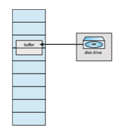

**Figure 10.28** The reason why frames used for I/O must be in memory.  
memory itself because it has the best knowledge of how it is going to use its data. Such **pinning** of pages in memory is fairly common, and most operating systems have a system call allowing an application to request that a region of its logical address space be pinned. Note that this feature could be abused and could cause stress on the memory-management algorithms. Therefore, an application frequently requires special privileges to make such a request.

Another use for a lock bit involves normal page replacement. Consider the following sequence of events: A low-priority process faults. Selecting a replacement frame, the paging system reads the necessary page into memory. Ready to continue, the low-priority process enters the ready queue and waits for the CPU. Since it is a low-priority process, it may not be selected by the CPU scheduler for a time. While the low-priority process waits, a high-priority process faults. Looking for a replacement, the paging system sees a page that is in memory but has not been referenced or modified: it is the page that the low-priority process just brought in. This page looks like a perfect replacement. It is clean and will not need to be written out, and it apparently has not been used for a long time.

Whether the high-priority process should be able to replace the low- priority process is a policy decision. After all, we are simply delaying the low-priority process for the benefit of the high-priority process. However, we are wasting the effort spent to bring in the page for the low-priority process. If we decide to prevent replacement of a newly brought-in page until it can be used at least once, then we can use the lock bit to implement this mechanism. When a page is selected for replacement, its lock bit is turned on. It remains on until the faulting process is again dispatched.

Using a lock bit can be dangerous: the lock bit may get turned on but never turned off. Should this situation occur (because of a bug in the operating system, for example), the locked frame becomes unusable. For instance, Solaris allows locking “hints,” but it is free to disregard these hints if the free-frame pool becomes too small or if an individual process requests that toomanypages be locked in memory.

## Operating-System Examples

In this section, we describe how Linux, Windows and Solaris manage virtual memory.

### Linux

In Section 10.8.2, we discussed how Linux manages kernel memory using slab allocation. We now cover how Linux manages virtual memory. Linux uses demand paging, allocating pages from a list of free frames. In addition, it uses a global page-replacement policy similar to the LRU-approximation clock algo- rithm described in Section 10.4.5.2. To manage memory, Linux maintains two types of page lists: an active list and an inactive list. The active list contains the pages that are considered in use, while the inactive list con- tains pages that have not recently been referenced and are eligible to be reclaimed.  


**Figure 10.29** The Linux active list and inactive list structures.

Each page has an **_accessed_** bit that is set whenever the page is referenced. (The actual bits used to mark page access vary by architecture.) When a page is first allocated, its accessed bit is set, and it is added to the rear of the active list. Similarly, whenever a page in the active list is referenced, its accessed bit is set, and the page moves to the rear of the list. Periodically, the accessed bits for pages in the active list are reset. Over time, the least recently used page will be at the front of the active list. From there, it may migrate to the rear of the inactive list. If a page in the inactive list is referenced, it moves back to the rear of the active list. This pattern is illustrated in Figure 10.29.

The two lists are kept in relative balance, andwhen the active list grows much larger than the inactive list, pages at the front of the active list move to the inactive list, where they become eligible for reclamation. The Linux kernel has a page-out daemon process kswapd that periodically awak- ens and checks the amount of free memory in the system. If free memory falls below a certain threshold, kswapd begins scanning pages in the inac- tive list and reclaiming them for the free list. Linux virtual memory man- agement is discussed in greater detail in Chapter 20.

### Windows

Windows 10 supports 32- and 64-bit systems running on Intel (IA-32 and x86- 64) and ARM architectures. On 32-bit systems, the default virtual address space of a process is 2 GB, although it can be extended to 3 GB. 32-bit systems support 4 GB of physical memory. On 64-bit systems, Windows 10 has a 128-TB vir- tual address space and supports up to 24 TB of physical memory. (Versions of Windows Server support up to 128 TB of physicalmemory.)Windows 10 imple- ments most of the memory-management features described thus far, including shared libraries, demand paging, copy-on-write, paging, and memory com- pression.  

Windows 10 implements virtual memory using demand paging with **clus- tering**, a strategy that recognizes locality of memory references and therefore handles page faults by bringing in not only the faulting page but also several pages immediately preceding and following the faulting page. The size of a cluster varies by page type. For a data page, a cluster contains three pages(the page before and the page after the faulting page); all other page faults have a cluster size of seven.

A key component of virtual memory management in Windows 10 is working-set management. When a process is created, it is assigned a working- set minimum of 50 pages and a working-set maximum of 345 pages. The **working-set minimum** is the minimum number of pages the process is guar- anteed to have in memory; if sufficient memory is available, a process may be assigned as many pages as its **working-set maximum**. Unless a process is con- figured with **hard working-set limits**, these values may be ignored. A process can grow beyond its working-set maximum if sufficient memory is available. Similarly, the amount of memory allocated to a process can shrink below the minimum in periods of high demand for memory.

Windows uses the LRU-approximation clock algorithm, as described in Sec- tion 10.4.5.2, with a combination of local and global page-replacement policies. The virtual memory manager maintains a list of free page frames. Associated with this list is a threshold value that indicates whether sufficient free memory is available. If a page fault occurs for a process that is below its working- set maximum, the virtual memory manager allocates a page from the list of free pages. If a process that is at its working-set maximum incurs a page fault and sufficient memory is available, the process is allocated a free page, which allows it to grow beyond its working-setmaximum. If the amount of freemem- ory is insufficient, however, the kernel must select a page from the process’s working set for replacement using a local LRU page-replacement policy.

When the amount of free memory falls below the threshold, the vir- tual memory manager uses a global replacement tactic known as **automatic working-set trimming** to restore the value to a level above the threshold. Automatic working-set trimming works by evaluating the number of pages allocated to processes. If a process has been allocated more pages than its working-set minimum, the virtual memory manager removes pages from the working set until either there is sufficient memory available or the process has reached its working-set minimum. Larger processes that have been idle are targeted before smaller, active processes. The trimming procedure continues until there is sufficient free memory, even if it is necessary to remove pages from a process already below its working set minimum. Windows performs working-set trimming on both user-mode and system processes.

### Solaris

In Solaris, when a thread incurs a page fault, the kernel assigns a page to the faulting thread from the list of free pages it maintains. Therefore, it is imperative that the kernel keep a sufficient amount of free memory available. Associated with this list of free pages is a parameter—lotsfree—that repre- sents a threshold to begin paging. The lotsfree parameter is typically set to 1∕64 the size of the physical memory. Four times per second, the kernel checks whether the amount of free memory is less than lotsfree. If the number of  

free pages falls below lotsfree, a process known as a **pageout** starts up. The pageout process is similar to the second-chance algorithm described in Section 10.4.5.2, except that it uses two hands while scanning pages, rather than one.

The pageout process works as follows: The front hand of the clock scans all pages in memory, setting the reference bit to 0. Later, the back hand of the clock examines the reference bit for the pages inmemory, appending each page whose reference bit is still set to 0 to the free list and writing its contents to secondary storage if it has been modified. Solaris also manages minor page faults by allowing a process to reclaim a page from the free list if the page is accessed before being reassigned to another process.

The pageout algorithm uses several parameters to control the rate at which pages are scanned (known as the scanrate). The scanrate is expressed in pages per second and ranges from slowscan to fastscan. When free memory falls below lotsfree, scanning occurs at slowscan pages per second and progresses to fastscan, depending on the amount of free memory available. The default value of slowscan is 100 pages per second. Fastscan is typically set to the value (total physical pages)/2 pages per second, with a maximum of 8,192 pages per second. This is shown in Figure 10.30 (with fastscan set to the maximum).

The distance (in pages) between the hands of the clock is determined by a system parameter, handspread. The amount of time between the front hand’s clearing a bit and the back hand’s investigating its value depends on the scanrate and the handspread. If scanrate is 100 pages per second and handspread is 1,024 pages, 10 seconds can pass between the time a bit is set by the front hand and the time it is checked by the back hand. However, because of the demands placed on thememory system, a scanrate of several thousand is not uncommon. This means that the amount of time between clearing and investigating a bit is often a few seconds.
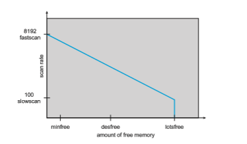
**Figure 10.30** Solaris page scanner.  

As mentioned above, the pageout process checks memory four times per second. However, if free memory falls below the value of desfree (the desired amount of free memory in the system), pageout will run a hundred times per second with the intention of keeping at least desfree free memory available (Figure 10.30). If the pageout process is unable to keep the amount of free memory at desfree for a 30-second average, the kernel begins swapping processes, thereby freeing all pages allocated to swapped processes. In general, the kernel looks for processes that have been idle for long periods of time. If the system is unable to maintain the amount of free memory at minfree, the pageout process is called for every request for a new page.

The page-scanning algorithm skips pages belonging to libraries that are being shared by several processes, even if they are eligible to be claimed by the scanner. The algorithm also distinguishes between pages allocated to processes and pages allocated to regular data files. This is known as **priority paging** and is covered in Section 14.6.2.

## Summary

• Virtual memory abstracts physical memory into an extremely large uni- form array of storage.

• The benefits of virtual memory include the following: (1) a program can be larger than physical memory, (2) a program does not need to be entirely in memory, (3) processes can share memory, and (4) processes can be created more efficiently.

• Demand paging is a technique whereby pages are loaded only when they are demanded during program execution. Pages that are never demanded are thus never loaded into memory.

• A page fault occurs when a page that is currently not in memory is accessed. The page must be brought from the backing store into an avail- able page frame in memory.

• Copy-on-write allows a child process to share the same address space as its parent. If either the child or the parent process writes (modifies) a page, a copy of the page is made.

• When available memory runs low, a page-replacement algorithm selects an existing page in memory to replace with a new page. Page- replacement algorithms include FIFO, optimal, and LRU. Pure LRU algorithms are impractical to implement, and most systems instead use LRU-approximation algorithms.

• Global page-replacement algorithms select a page from any process in the system for replacement, while local page-replacement algorithms select a page from the faulting process.

• Thrashing occurs when a system spendsmore time paging than executing.

• A locality represents a set of pages that are actively used together. As a process executes, it moves from locality to locality. Aworking set is based on locality and is defined as the set of pages currently in use by a process.  

• Memory compression is a memory-management technique that com- presses a number of pages into a single page. Compressed memory is an alternative to paging and is used on mobile systems that do not support paging.

• Kernelmemory is allocated differently than user-mode processes; it is allo- cated in contiguous chunks of varying sizes. Two common techniques for allocating kernel memory are (1) the buddy system and (2) slab allocation.

• TLB reach refers to the amount of memory accessible from the TLB and is equal to the number of entries in the TLB multiplied by the page size. One technique for increasing TLB reach is to increase the size of pages.

• Linux, Windows, and Solaris manage virtual memory similarly, using demand paging and copy-on-write, among other features. Each system also uses a variation of LRU approximation known as the clock algorithm.

**Practice Exercises**

**10.1** Under what circumstances do page faults occur? Describe the actions taken by the operating system when a page fault occurs.

**10.2** Assume that you have a page-reference string for a process with _m_ frames (initially all empty). The page-reference string has length _p_, and _n_ distinct page numbers occur in it. Answer these questions for any page-replacement algorithms:

a. What is a lower bound on the number of page faults?

b. What is an upper bound on the number of page faults?

**10.3** Consider the following page-replacement algorithms. Rank these algo- rithms on a five-point scale from “bad” to “perfect” according to their page-fault rate. Separate those algorithms that suffer from Belady’s anomaly from those that do not.

a. LRU replacement

b. FIFO replacement

c. Optimal replacement

d. Second-chance replacement

**10.4** An operating system supports a paged virtual memory. The central processor has a cycle time of 1 microsecond. It costs an additional 1 microsecond to access a page other than the current one. Pages have 1,000 words, and the paging device is a drum that rotates at 3,000 revolutions per minute and transfers 1 million words per second. The following statistical measurements were obtained from the system:

• One percent of all instructions executed accessed a page other than the current page.

• Of the instructions that accessed another page, 80 percent accessed a page already in memory.  


• When a new page was required, the replaced page was modified 50 percent of the time.

Calculate the effective instruction time on this system, assuming that the system is running one process only and that the processor is idle during drum transfers.

**10.5** Consider the page table for a system with 12-bit virtual and physical addresses and 256-byte pages.
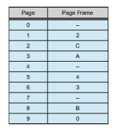
The list of free page frames is_D_, _E_, _F_ (that is,_D_ is at the head of the list, _E_ is second, and _F_ is last). A dash for a page frame indicates that the page is not in memory.

Convert the following virtual addresses to their equivalent physical addresses in hexadecimal. All numbers are given in hexadecimal.

• 9EF

• 111

• 700

• 0FF

**10.6** Discuss the hardware functions required to support demand paging.

**10.7** Consider the two-dimensional array A:

int A\[\]\[\] = new int\[100\]\[100\];

where A\[0\]\[0\] is at location 200 in a pagedmemory systemwith pages of size 200. A small process that manipulates the matrix resides in page 0 (locations 0 to 199). Thus, every instruction fetch will be from page 0. For three page frames, how many page faults are generated by the

following array-initialization loops? Use LRU replacement, and assume  

that page frame 1 contains the process and the other two are initially empty.

a. for (int j = 0; j < 100; j++) for (int i = 0; i < 100; i++)

A\[i\]\[j\] = 0;

b. for (int i = 0; i < 100; i++) for (int j = 0; j < 100; j++)

A\[i\]\[j\] = 0;

**10.8** Consider the following page reference string:

1, 2, 3, 4, 2, 1, 5, 6, 2, 1, 2, 3, 7, 6, 3, 2, 1, 2, 3, 6.

How many page faults would occur for the following replacement algorithms, assuming one, two, three, four, five, six, and seven frames? Remember that all frames are initially empty, so your first unique pages will cost one fault each.

• LRU replacement

• FIFO replacement

• Optimal replacement

**10.9** Consider the following page reference string:

7, 2, 3, 1, 2, 5, 3, 4, 6, 7, 7, 1, 0, 5, 4, 6, 2, 3, 0 , 1.

Assuming demand paging with three frames, how many page faults would occur for the following replacement algorithms?

• LRU replacement

• FIFO replacement

• Optimal replacement

**10.10** Suppose that you want to use a paging algorithm that requires a ref- erence bit (such as second-chance replacement or working-set model), but the hardware does not provide one. Sketch how you could simu- late a reference bit even if one were not provided by the hardware, or explain why it is not possible to do so. If it is possible, calculate what the cost would be.

**10.11** You have devised a new page-replacement algorithm that you think may be optimal. In some contorted test cases, Belady’s anomaly occurs. Is the new algorithm optimal? Explain your answer.

**10.12** Segmentation is similar to paging but uses variable-sized “pages.” Define two segment-replacement algorithms, one based on the FIFO page-replacement scheme and the other on the LRU page-replacement scheme. Remember that since segments are not the same size, the seg- ment that is chosen for replacement may be too small to leave enough  


consecutive locations for the needed segment. Consider strategies for systemswhere segments cannot be relocated and strategies for systems where they can.

**10.13** Consider a demand-paged computer systemwhere the degree ofmulti- programming is currently fixed at four. The system was recently mea- sured to determine utilization of the CPU and the paging disk. Three alternative results are shown below. For each case, what is happening? Can the degree of multiprogramming be increased to increase the CPU utilization? Is the paging helping?

a. CPU utilization 13 percent; disk utilization 97 percent

b. CPU utilization 87 percent; disk utilization 3 percent

c. CPU utilization 13 percent; disk utilization 3 percent

**10.14** We have an operating system for a machine that uses base and limit registers, but we have modified the machine to provide a page table. Can the page table be set up to simulate base and limit registers? How can it be, or why can it not be?

**Further Reading**

The working-set model was developed by \[Denning (1968)\]. The enhanced clock algorithm is discussed by \[Carr and Hennessy (1981)\]. \[Russinovich et al. (2017)\] describe how Windows implements vir- tual memory and memory compression. Compressed memory in Windows 10 is further discussed in http://www.makeuseof.com/ tag/ram-compression-improves-memory-responsiveness-windows-10.

\[McDougall and Mauro (2007)\] discuss virtual memory in Solaris. Virtual memory techniques in Linux are described in \[Love (2010)\] and \[Mauerer (2008)\]. FreeBSD is described in \[McKusick et al. (2015)\].

**Bibliography**

**\[Carr and Hennessy (1981)\]** W. R. Carr and J. L. Hennessy, “WSClock—A Sim- ple and Effective Algorithm for Virtual Memory Management”, _Proceedings of the ACM Symposium on Operating Systems Principles_ (1981), pages 87–95.

**\[Denning (1968)\]** P. J. Denning, “TheWorking SetModel for ProgramBehavior”, _Communications of the ACM_, Volume 11, Number 5 (1968), pages 323–333.

**\[Love (2010)\]** R. Love, _Linux Kernel Development,_ Third Edition, Developer’s Library (2010).

**\[Mauerer (2008)\]** W. Mauerer, _Professional Linux Kernel Architecture_, John Wiley and Sons (2008).

**\[McDougall and Mauro (2007)\]** R. McDougall and J. Mauro, _Solaris Internals,_ Second Edition, Prentice Hall (2007).  

**Bibliography 445**

**\[McKusick et al. (2015)\]** M. K. McKusick, G. V. Neville-Neil, and R. N. M. Wat- son,_The Design and Implementation of the FreeBSDUNIXOperating System–Second Edition_, Pearson (2015).

**\[Russinovich et al. (2017)\]** M.Russinovich,D.A. Solomon, andA. Ionescu,_Win- dows Internals–Part 1,_ Seventh Edition, Microsoft Press (2017).  

**Chapter 10 Exercises**

**10.15** Assume that a program has just referenced an address in virtual mem- ory. Describe a scenario in which each of the following can occur. (If no such scenario can occur, explain why.)

• TLB miss with no page fault

• TLB miss with page fault

• TLB hit with no page fault

• TLB hit with page fault

**10.16** Asimplified view of thread states is **_ready_**, **_running_**, and **_blocked_**, where a thread is either ready and waiting to be scheduled, is running on the processor, or is blocked (for example, waiting for I/O).
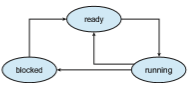
Assuming a thread is in the **_running_** state, answer the following ques- tions, and explain your answers:

a. Will the thread change state if it incurs a page fault? If so, to what state will it change?

b. Will the thread change state if it generates a TLB miss that is resolved in the page table? If so, to what state will it change?

c. Will the thread change state if an address reference is resolved in the page table? If so, to what state will it change?

**10.17** Consider a system that uses pure demand paging.

a. When a process first starts execution, howwould you characterize the page-fault rate?

b. Once the working set for a process is loaded into memory, how would you characterize the page-fault rate?

c. Assume that a process changes its locality and the size of the new working set is too large to be stored in available free memory. Identify some options system designers could choose from to handle this situation.

**10.18** The following is a page table for a system with 12-bit virtual and physical addresses and 256-byte pages. Free page frames are to be allocated in the order 9, F, D. A dash for a page frame indicates that the page is not in memory.

**EX-35**  

**Exercises**
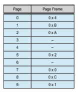
Convert the following virtual addresses to their equivalent physical addresses in hexadecimal. All numbers are given in hexadecimal. In the case of a page fault, you must use one of the free frames to update the page table and resolve the logical address to its corresponding physical address.

• 0x2A1

• 0x4E6

• 0x94A

• 0x316

**10.19** What is the copy-on-write feature, and under what circumstances is its use beneficial? What hardware support is required to implement this feature?

**10.20** A certain computer provides its users with a virtual memory space of 232 bytes. The computer has 222 bytes of physical memory. The virtual memory is implemented by paging, and the page size is 4,096 bytes. A user process generates the virtual address 11123456. Explain how the system establishes the corresponding physical location. Distinguish between software and hardware operations.

**10.21** Assume that we have a demand-paged memory. The page table is held in registers. It takes 8 milliseconds to service a page fault if an empty frame is available or if the replaced page is not modified and 20 milliseconds if the replaced page is modified. Memory-access time is 100 nanoseconds.

Assume that the page to be replaced is modified 70 percent of the time. What is the maximum acceptable page-fault rate for an effective access time of no more than 200 nanoseconds?

**10.22** Consider the page table for a system with 16-bit virtual and physical addresses and 4,096-byte pages.

**EX-36**  
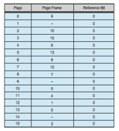

The reference bit for a page is set to 1 when the page has been ref- erenced. Periodically, a thread zeroes out all values of the reference bit. A dash for a page frame indicates that the page is not in memory. The page-replacement algorithm is localized LRU, and all numbers are provided in decimal.

a. Convert the following virtual addresses (in hexadecimal) to the equivalent physical addresses. Youmayprovide answers in either hexadecimal or decimal. Also set the reference bit for the appro- priate entry in the page table.

• 0x621C

• 0xF0A3

• 0xBC1A

• 0x5BAA

• 0x0BA1

b. Using the above addresses as a guide, provide an example of a logical address (in hexadecimal) that results in a page fault.

c. From what set of page frames will the LRU page-replacement algorithm choose in resolving a page fault?

**10.23** When a page fault occurs, the process requesting the page must block while waiting for the page to be brought from disk into physical mem- ory. Assume that there exists a process with five user-level threads and that the mapping of user threads to kernel threads is many to one. If

**EX-37**  

**Exercises**

one user thread incurs a page fault while accessing its stack, would the other user threads belonging to the same process also be affected by the page fault—that is, would they also have to wait for the faulting page to be brought into memory? Explain.

**10.24** Apply the (1) FIFO, (2) LRU, and (3) optimal (OPT) replacement algo- rithms for the following page-reference strings:

• 2, 6, 9, 2, 4, 2, 1, 7, 3, 0, 5, 2, 1, 2, 9, 5, 7, 3, 8, 5

• 0, 6, 3, 0, 2, 6, 3, 5, 2, 4, 1, 3, 0, 6, 1, 4, 2, 3, 5, 7

• 3, 1, 4, 2, 5, 4, 1, 3, 5, 2, 0, 1, 1, 0, 2, 3, 4, 5, 0, 1

• 4, 2, 1, 7, 9, 8, 3, 5, 2, 6, 8, 1, 0, 7, 2, 4, 1, 3, 5, 8

• 0, 1, 2, 3, 4, 4, 3, 2, 1, 0, 0, 1, 2, 3, 4, 4, 3, 2, 1, 0

Indicate the number of page faults for each algorithm assuming demand paging with three frames.

**10.25** Assume that you are monitoring the rate at which the pointer in the clock algorithm moves. (The pointer indicates the candidate page for replacement.) What can you say about the system if you notice the following behavior:

a. Pointer is moving fast.

b. Pointer is moving slow.

**10.26** Discuss situations in which the least frequently used (LFU) page- replacement algorithm generates fewer page faults than the least recently used (LRU) page-replacement algorithm. Also discuss under what circumstances the opposite holds.

**10.27** Discuss situations in which the most frequently used (MFU) page- replacement algorithm generates fewer page faults than the least recently used (LRU) page-replacement algorithm. Also discuss under what circumstances the opposite holds.

**10.28** The KHIE (pronounced “k-hi”) operating system uses a FIFO replace- ment algorithm for resident pages and a free-frame pool of recently used pages. Assume that the free-frame pool is managed using the LRU replacement policy. Answer the following questions:

a. If a page fault occurs and the page does not exist in the free-frame pool, how is free space generated for the newly requested page?

b. If a page fault occurs and the page exists in the free-frame pool, how are the resident page set and the free-frame pool managed to make space for the requested page?

c. To what does the system degenerate if the number of resident pages is set to one?

d. To what does the system degenerate if the number of pages in the free-frame pool is zero?

**EX-38**  

**10.29** Consider a demand-paging system with the following time-measured utilizations:

CPU utilization 20% Paging disk 97.7% Other I/O devices 5%

For each of the following, indicate whether it will (or is likely to) improve CPU utilization. Explain your answers.

a. Install a faster CPU.

b. Install a bigger paging disk.

c. Increase the degree of multiprogramming.

d. Decrease the degree of multiprogramming.

e. Install more main memory.

f. Install a faster hard disk or multiple controllers with multiple hard disks.

g. Add prepaging to the page-fetch algorithms.

h. Increase the page size.

**10.30** Explainwhyminor page faults take less time to resolve thanmajor page faults.

**10.31** Explain why compressed memory is used in operating systems for mobile devices.

**10.32** Suppose that a machine provides instructions that can access mem- ory locations using the one-level indirect addressing scheme. What sequence of page faults is incurred when all of the pages of a program are currently nonresident and the first instruction of the program is an indirect memory-load operation? What happens when the operating system is using a per-process frame allocation technique and only two pages are allocated to this process?

**10.33** Consider the page references:

**EX-39**  

**Exercises**

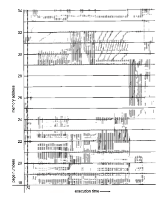
What pages represent the locality at time (_X_)?

**10.34** Suppose that your replacement policy (in a paged system) is to examine each page regularly and to discard that page if it has not been used since the last examination. What would you gain and what would you lose by using this policy rather than LRU or second-chance replacement?

**10.35** A page-replacement algorithm should minimize the number of page faults. We can achieve this minimization by distributing heavily used pages evenly over all of memory, rather than having them compete for a small number of page frames. We can associate with each page frame a counter of the number of pages associated with that frame. Then,

**EX-40**  

to replace a page, we can search for the page frame with the smallest counter.

a. Define a page-replacement algorithmusing this basic idea. Specif- ically address these problems:

• What is the initial value of the counters? • When are counters increased? • When are counters decreased? • How is the page to be replaced selected?

b. Howmany page faults occur for your algorithm for the following reference string with four page frames?

1, 2, 3, 4, 5, 3, 4, 1, 6, 7, 8, 7, 8, 9, 7, 8, 9, 5, 4, 5, 4, 2.

c. What is the minimum number of page faults for an optimal page- replacement strategy for the reference string in part b with four page frames?

**10.36** Consider a demand-paging system with a paging disk that has an average access and transfer time of 20 milliseconds. Addresses are translated through a page table in main memory, with an access time of 1 microsecond per memory access. Thus, each memory reference through the page table takes two accesses. To improve this time, we have added an associative memory that reduces access time to one memory reference if the page-table entry is in the associative memory.

Assume that 80 percent of the accesses are in the associativememory and that, of those remaining, 10 percent (or 2 percent of the total) cause page faults. What is the effective memory access time?

**10.37** What is the cause of thrashing? How does the system detect thrashing? Once it detects thrashing, what can the system do to eliminate this problem?

**10.38** Is it possible for a process to have two working sets, one representing data and another representing code? Explain.

**10.39** Consider the parameter Δ used to define the working-set window in the working-set model. When Δ is set to a low value, what is the effect on the page-fault frequency and the number of active (nonsuspended) processes currently executing in the system?What is the effect when Δ is set to a very high value?

**10.40** In a 1,024-KB segment, memory is allocated using the buddy system. Using Figure 10.26 as a guide, drawa tree illustratinghow the following memory requests are allocated:

• Request 5-KB

• Request 135 KB.

• Request 14 KB.

• Request 3 KB.

**EX-41**  

**Exercises**

• Request 12 KB.

Next, modify the tree for the following releases of memory. Perform coalescing whenever possible:

• Release 3 KB.

• Release 5 KB.

• Release 14 KB.

• Release 12 KB.

**10.41** Asystem provides support for user-level and kernel-level threads. The mapping in this system is one to one (there is a corresponding kernel thread for each user thread). Does a multithreaded process consist of (a) a working set for the entire process or (b) a working set for each thread? Explain

**10.42** The slab-allocation algorithm uses a separate cache for each different object type. Assuming there is one cache per object type, explain why this scheme doesn’t scale well with multiple CPUs. What could be done to address this scalability issue?

**10.43** Consider a system that allocates pages of different sizes to its processes. What are the advantages of such a paging scheme? What modifica- tions to the virtual memory system would be needed to provide this functionality?

**EX-42**  

**Programming Problems**

**Programming Problems**

**10.44** Write a program that implements the FIFO, LRU, and optimal (OPT) page-replacement algorithms presented in Section 10.4. Have your pro- gram initially generate a random page-reference string where page numbers range from 0 to 9. Apply the random page-reference string to each algorithm, and record the number of page faults incurred by each algorithm. Pass the number of page frames to the program at startup. You may implement this program in any programming language of your choice. (You may find your implementation of either FIFO or LRU to be helpful in the virtual memory manager programming project.)

**Programming Projects**

**Designing a Virtual Memory Manager**

This project consists of writing a program that translates logical to physical addresses for a virtual address space of size 216 = 65,536 bytes. Your program will read from a file containing logical addresses and, using a TLB and a page table, will translate each logical address to its corresponding physical address and output the value of the byte stored at the translated physical address. Your learning goal is to use simulation to understand the steps involved in translating logical to physical addresses. Thiswill include resolving page faults using demand paging,managing a TLB, and implementing a page-replacement algorithm.

**Specific**

Your program will read a file containing several 32-bit integer numbers that represent logical addresses. However, you need only be concerned with 16- bit addresses, so you must mask the rightmost 16 bits of each logical address. These 16 bits are divided into (1) an 8-bit page number and (2) an 8-bit page offset. Hence, the addresses are structured as shown as:

offset

078151631

page number

Other specifics include the following:

• 28 entries in the page table

• Page size of 28 bytes

• 16 entries in the TLB

• Frame size of 28 bytes

• 256 frames

• Physical memory of 65,536 bytes (256 frames × 256-byte frame size)

**P-51**  

**Chapter 10 Virtual Memory**

Additionally, your program need only be concerned with reading logical addresses and translating them to their corresponding physical addresses. You do not need to support writing to the logical address space.

**Address Translation**

Your programwill translate logical to physical addresses using a TLB and page table as outlined in Section 9.3. First, the page number is extracted from the logical address, and the TLB is consulted. In the case of a TLB hit, the frame number is obtained from the TLB. In the case of a TLB miss, the page table must be consulted. In the latter case, either the frame number is obtained from the page table, or a page fault occurs. A visual representation of the address- translation process is:
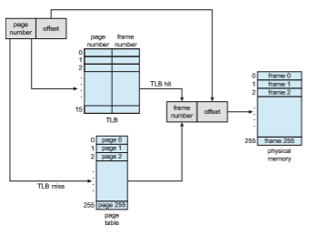
**Handling Page Faults**

Your programwill implement demand paging as described in Section 10.2. The backing store is represented by the file BACKING STORE.bin, a binary file of size 65,536 bytes. When a page fault occurs, you will read in a 256-byte page from the file BACKING STORE and store it in an available page frame in physical memory. For example, if a logical address with page number 15 resulted in a page fault, your programwould read in page 15 from BACKING STORE (remem- ber that pages begin at 0 and are 256 bytes in size) and store it in a page frame in physical memory. Once this frame is stored (and the page table and TLB are updated), subsequent accesses to page 15 will be resolved by either the TLB or the page table.

**P-52**  

**Programming Projects**

You will need to treat BACKING STORE.bin as a random-access file so that you can randomly seek to certain positions of the file for reading. We suggest using the standard C library functions for performing I/O, including fopen(), fread(), fseek(), and fclose().

The size of physical memory is the same as the size of the virtual address space—65,536 bytes—so you do not need to be concerned about page replace- ments during a page fault. Later, we describe a modification to this project using a smaller amount of physical memory; at that point, a page-replacement strategy will be required.

**Test File**

We provide the file addresses.txt, which contains integer values represent- ing logical addresses ranging from 0_to_65535 (the size of the virtual address space). Your programwill open this file, read each logical address and translate it to its corresponding physical address, and output the value of the signed byte at the physical address.

**How to Begin**

First, write a simple program that extracts the page number and offset based on:

offset

078151631

page number

from the following integer numbers:

1, 256, 32768, 32769, 128, 65534, 33153

Perhaps the easiest way to do this is by using the operators for bit-masking and bit-shifting. Once you can correctly establish the page number and offset from an integer number, you are ready to begin.

Initially, we suggest that you bypass the TLB and use only a page table. You can integrate the TLB once your page table is working properly. Remember, address translation can work without a TLB; the TLB just makes it faster. When you are ready to implement the TLB, recall that it has only sixteen entries, so you will need to use a replacement strategy when you update a full TLB. You may use either a FIFO or an LRU policy for updating your TLB.

**How to Run Your Program**

Your program should run as follows:

./a.out addresses.txt

Your programwill read in the file addresses.txt, which contains 1,000 logical addresses ranging from 0 to 65535. Your program is to translate each logical address to a physical address and determine the contents of the signed byte stored at the correct physical address. (Recall that in the C language, the char data type occupies a byte of storage, so we suggest using char values.)

**P-53**  

**Chapter 10 Virtual Memory**

Your program is to output the following values:

**1\.** The logical address being translated (the integer value being read from addresses.txt).

**2\.** The corresponding physical address (what your program translates the logical address to).

**3\.** The signed byte value stored in physical memory at the translated phys- ical address.

We also provide the file correct.txt, which contains the correct output values for the file addresses.txt. You should use this file to determine if your program is correctly translating logical to physical addresses.

**Statistics**

After completion, your program is to report the following statistics:

**1\.** Page-fault rate—The percentage of address references that resulted in page faults.

**2\.** TLB hit rate—The percentage of address references that were resolved in the TLB.

Since the logical addresses in addresses.txt were generated randomly and do not reflect any memory access locality, do not expect to have a high TLB hit rate.

**Page Replacement**

Thus far, this project has assumed that physical memory is the same size as the virtual address space. In practice, physical memory is typically much smaller than a virtual address space. This phase of the project now assumes using a smaller physical address space with 128 page frames rather than 256. This change will require modifying your program so that it keeps track of free page frames as well as implementing a page-replacement policy using either FIFO or LRU (Section 10.4) to resolve page faults when there is no free memory.

**P-54**