  

Part One

**_Overview_**
 An _operating system_ acts as an intermediary between the user of a com- puter and the computer hardware. The purpose of an operating system is to provide an environment in which a user can execute programs in a _convenient_ and _efficient_ manner.

An operating system is software that manages the computer hard- ware. The hardwaremust provide appropriatemechanisms to ensure the correct operation of the computer system and to prevent programs from interfering with the proper operation of the system.

Internally, operating systems vary greatly in their makeup, since they are organized along many different lines. The design of a new operating system is a major task, and it is important that the goals of the system be well defined before the design begins.

Because an operating system is large and complex, it must be cre- ated piece by piece. Each of these pieces should be a well-delineated portion of the system, with carefully defined inputs, outputs, and func- tions.  

_1_ **CHAPTER**

# Introduction

An **operating system** is software that manages a computer’s hardware. It also provides a basis for application programs and acts as an intermediary between the computer user and the computer hardware. An amazing aspect of operating systems is how they vary in accomplishing these tasks in a wide variety of computing environments. Operating systems are everywhere, from cars and home appliances that include “Internet of Things” devices, to smart phones, personal computers, enterprise computers, and cloud computing envi- ronments.

In order to explore the role of an operating system in a modern computing environment, it is important first to understand the organization and architec- ture of computer hardware. This includes the CPU, memory, and I/O devices, as well as storage. A fundamental responsibility of an operating system is to allocate these resources to programs.

Because an operating system is large and complex, it must be created piece by piece. Each of these pieces should be a well-delineated portion of the system, with carefully defined inputs, outputs, and functions. In this chapter, we provide a general overview of the major components of a contemporary computer system as well as the functions provided by the operating system. Additionally, we cover several topics to help set the stage for the remainder of the text: data structures used in operating systems, computing environments, and open-source and free operating systems.

**CHAPTER OBJECTIVES**

• Describe the general organization of a computer system and the role of interrupts.

• Describe the components in a modern multiprocessor computer system.

• Illustrate the transition from user mode to kernel mode.

• Discuss how operating systems are used in various computing environ- ments.

• Provide examples of free and open-source operating systems.


## What Operating Systems Do

We begin our discussion by looking at the operating system’s role in the overall computer system. A computer system can be divided roughly into four components: the **_hardware,_** the **_operating system,_** the **_application programs,_** and a **_user_** (Figure 1.1).

The **hardware**—the central processing unit (CPU), the memory, and the input/output (I/O) devices—provides the basic computing resources for the system. The **application programs**—such as word processors, spreadsheets, compilers, and web browsers—define the ways in which these resources are used to solve users’ computing problems. The operating system controls the hardware and coordinates its use among the various application programs for the various users.

We can also view a computer system as consisting of hardware, software, and data. The operating system provides the means for proper use of these resources in the operation of the computer system. An operating system is similar to a government. Like a government, it performs no useful function by itself. It simply provides an **_environment_** within which other programs can do useful work.

To understand more fully the operating system’s role, we next explore operating systems from two viewpoints: that of the user and that of the system.

### User View

The user’s view of the computer varies according to the interface being used. Many computer users sit with a laptop or in front of a PC consisting of a monitor, keyboard, and mouse. Such a system is designed for one user to monopolize its resources. The goal is to maximize the work (or play) that the user is performing. In this case, the operating system is designed mostly for **ease of use**, with some attention paid to performance and security and none paid to **resource utilization**—how various hardware and software resources are shared.

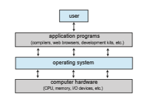
**Figure 1.1** Abstract view of the components of a computer system.  
Increasingly, many users interact withmobile devices such as smartphones and tablets—devices that are replacing desktop and laptop computer systems for some users. These devices are typically connected to networks through cellular or other wireless technologies. The user interface formobile computers generally features a **touch screen**, where the user interacts with the system by pressing and swiping fingers across the screen rather than using a physical keyboard andmouse.Manymobile devices also allowusers to interact through a **voice recognition** interface, such as Apple’s **Siri**.

Some computers have little or no user view. For example, **embedded com- puters** in home devices and automobiles may have numeric keypads and may turn indicator lights on or off to show status, but they and their operating sys- tems and applications are designed primarily to runwithout user intervention.

### System View

From the computer’s point of view, the operating system is the program most intimately involved with the hardware. In this context, we can view an oper- ating system as a **resource allocator**. A computer system has many resources that may be required to solve a problem: CPU time, memory space, storage space, I/Odevices, and so on. The operating systemacts as themanager of these resources. Facing numerous and possibly conflicting requests for resources, the operating system must decide how to allocate them to specific programs and users so that it can operate the computer system efficiently and fairly.

A slightly different view of an operating system emphasizes the need to control the various I/O devices and user programs. An operating system is a control program. A **control program** manages the execution of user programs to prevent errors and improper use of the computer. It is especially concerned with the operation and control of I/O devices.

### Defining Operating Systems

By now, you can probably see that the term **_operating system_** covers many roles and functions. That is the case, at least in part, because of the myriad designs and uses of computers. Computers are present within toasters, cars, ships, spacecraft, homes, and businesses. They are the basis for gamemachines, cable TV tuners, and industrial control systems.

To explain this diversity, we can turn to the history of computers. Although computers have a relatively short history, they have evolved rapidly. Comput- ing started as an experiment to determine what could be done and quickly moved to fixed-purpose systems for military uses, such as code breaking and trajectory plotting, and governmental uses, such as census calculation. Those early computers evolved into general-purpose,multifunctionmainframes, and that’s when operating systemswere born. In the 1960s, **Moore’s Law** predicted that the number of transistors on an integrated circuit would double every 18 months, and that prediction has held true. Computers gained in functionality and shrank in size, leading to a vast number of uses and a vast number and variety of operating systems. (See Appendix A for more details on the history of operating systems.)

How, then, can we definewhat an operating system is? In general, we have no completely adequate definition of an operating system. Operating systems exist because they offer a reasonable way to solve the problem of creating a usable computing system. The fundamental goal of computer systems is to execute programs and to make solving user problems easier. Computer hardware is constructed toward this goal. Since bare hardware alone is not particularly easy to use, application programs are developed. These programs require certain common operations, such as those controlling the I/O devices. The common functions of controlling and allocating resources are then brought together into one piece of software: the operating system.

In addition, we have no universally accepted definition of what is part of the operating system. A simple viewpoint is that it includes everything a ven- dor ships when you order “the operating system.” The features included, how- ever, vary greatly across systems. Some systems take up less than a megabyte of space and lack even a full-screen editor, whereas others require gigabytes of space and are based entirely on graphical windowing systems. Amore com- mon definition, and the one that we usually follow, is that the operating system is the one program running at all times on the computer—usually called the **kernel**. Along with the kernel, there are two other types of programs: **system programs**, which are associated with the operating system but are not neces- sarily part of the kernel, and application programs, which include all programs not associated with the operation of the system.

The matter of what constitutes an operating system became increasingly important as personal computers becamemore widespread and operating sys- tems grew increasingly sophisticated. In 1998, the United States Department of Justice filed suit against Microsoft, in essence claiming that Microsoft included toomuch functionality in its operating systems and thus prevented application vendors from competing. (For example, a web browser was an integral part of Microsoft’s operating systems.)As a result,Microsoftwas found guilty of using its operating-system monopoly to limit competition.

Today, however, if we look at operating systems for mobile devices, we see that once again the number of features constituting the operating system is increasing. Mobile operating systems often include not only a core kernel but also **middleware**—a set of software frameworks that provide additional services to application developers. For example, each of the two most promi- nentmobile operating systems—Apple’s iOS andGoogle’s Android—features

**_WHY STUDY OPERATING SYSTEMS?_**

Although there are many practitioners of computer science, only a small per- centage of themwill be involved in the creation or modification of an operat- ing system. Why, then, study operating systems and how they work? Simply because, as almost all code runs on top of an operating system, knowledge of how operating systems work is crucial to proper, efficient, effective, and secure programming.Understanding the fundamentals of operating systems, how they drive computer hardware, andwhat they provide to applications is not only essential to those who program them but also highly useful to those who write programs on them and use them.  
a core kernel alongwithmiddleware that supports databases, multimedia, and graphics (to name only a few).
In summary, for our purposes, the operating system includes the always- running kernel, middleware frameworks that ease application development and provide features, and system programs that aid in managing the system while it is running. Most of this text is concerned with the kernel of general- purpose operating systems, but other components are discussed as needed to fully explain operating system design and operation.

## Computer-System Organization

Amodern general-purpose computer system consists of one or more CPUs and a number of device controllers connected through a common **bus** that provides access between components and shared memory (Figure 1.2). Each device controller is in charge of a specific type of device (for example, a disk drive, audio device, or graphics display). Depending on the controller, more than one device may be attached. For instance, one system USB port can connect to a USB hub, to which several devices can connect. A device controller maintains some local buffer storage and a set of special-purpose registers. The device controller is responsible for moving the data between the peripheral devices that it controls and its local buffer storage.

Typically, operating systems have a **device driver** for each device con- troller. This device driver understands the device controller and provides the rest of the operating systemwith a uniform interface to the device. The CPU and the device controllers can execute in parallel, competing for memory cycles. To ensure orderly access to the sharedmemory, amemory controller synchronizes access to the memory.

In the following subsections, we describe some basics of how such a system operates, focusing on three key aspects of the system. We start with interrupts, which alert the CPU to events that require attention. We then discuss storage structure and I/O structure.

**Figure 1.2** A typical PC computer system.  


### Interrupts

Consider a typical computer operation: a program performing I/O. To start an I/O operation, the device driver loads the appropriate registers in the device controller. The device controller, in turn, examines the contents of these reg- isters to determine what action to take (such as “read a character from the keyboard”). The controller starts the transfer of data from the device to its local buffer. Once the transfer of data is complete, the device controller informs the device driver that it has finished its operation. The device driver then gives control to other parts of the operating system, possibly returning the data or a pointer to the data if the operation was a read. For other operations, the device driver returns status information such as “write completed successfully” or “device busy”. But how does the controller inform the device driver that it has finished its operation? This is accomplished via an **interrupt**.

#### Overview

Hardware may trigger an interrupt at any time by sending a signal to the CPU, usually by way of the system bus. (There may be many buses within a computer system, but the system bus is the main communications path between the major components.) Interrupts are used for many other purposes as well and are a key part of how operating systems and hardware interact.

When the CPU is interrupted, it stops what it is doing and immediately transfers execution to a fixed location. The fixed location usually contains the starting address where the service routine for the interrupt is located. The interrupt service routine executes; on completion, the CPU resumes the interrupted computation. A timeline of this operation is shown in Figure 1.3. To run the animation assicated with this figure please click **here**.

Interrupts are an important part of a computer architecture. Each computer design has its own interrupt mechanism, but several functions are common. The interruptmust transfer control to the appropriate interrupt service routine. The straightforward method for managing this transfer would be to invoke a generic routine to examine the interrupt information. The routine, in turn,
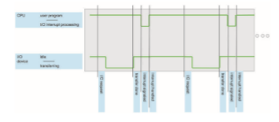
**Figure 1.3** Interrupt timeline for a single program doing output.  
would call the interrupt-specific handler.However, interruptsmust be handled quickly, as they occur very frequently. A table of pointers to interrupt routines can be used instead to provide the necessary speed. The interrupt routine is called indirectly through the table, with no intermediate routine needed. Generally, the table of pointers is stored in lowmemory (the first hundred or so locations). These locations hold the addresses of the interrupt service routines for the various devices. This array, or **interrupt vector**, of addresses is then indexed by a unique number, given with the interrupt request, to provide the address of the interrupt service routine for the interrupting device. Operating systems as different as Windows and UNIX dispatch interrupts in this manner.

The interrupt architecturemust also save the state information of whatever was interrupted, so that it can restore this information after servicing the interrupt. If the interrupt routine needs to modify the processor state—for instance, bymodifying register values—itmust explicitly save the current state and then restore that state before returning. After the interrupt is serviced, the saved return address is loaded into the program counter, and the interrupted computation resumes as though the interrupt had not occurred.

#### Implementation

The basic interrupt mechanism works as follows. The CPU hardware has a wire called the **interrupt-request line** that the CPU senses after executing every instruction. When the CPU detects that a controller has asserted a signal on the interrupt-request line, it reads the interrupt number and jumps to the **interrupt-handler routine** by using that interrupt number as an index into the interrupt vector. It then starts execution at the address associated with that index. The interrupt handler saves any state it will be changing during its operation, determines the cause of the interrupt, performs the necessary processing, performs a state restore, and executes a return from interrupt instruction to return the CPU to the execution state prior to the interrupt. We say that the device controller **_raises_** an interrupt by asserting a signal on the interrupt request line, the CPU **_catches_** the interrupt and **_dispatches_** it to the interrupt handler, and the handler **_clears_** the interrupt by servicing the device. Figure 1.4 summarizes the interrupt-driven I/O cycle.

The basic interruptmechanism just described enables the CPU to respond to an asynchronous event, as when a device controller becomes ready for service. In amodern operating system, however,we needmore sophisticated interrupt- handling features.

**1\.** We need the ability to defer interrupt handling during critical processing.

**2\.** We need an efficient way to dispatch to the proper interrupt handler for a device.

**3\.** We need multilevel interrupts, so that the operating system can distin- guish between high- and low-priority interrupts and can respond with the appropriate degree of urgency.

In modern computer hardware, these three features are provided by the CPU and the **interrupt-controller hardware**.  


**Figure 1.4** Interrupt-driven I/O cycle.

Most CPUs have two interrupt request lines. One is the **nonmaskable interrupt**, which is reserved for events such as unrecoverable memory errors. The second interrupt line is **maskable**: it can be turned off by the CPU before the execution of critical instruction sequences thatmust not be interrupted. The maskable interrupt is used by device controllers to request service.

Recall that the purpose of a vectored interrupt mechanism is to reduce the need for a single interrupt handler to search all possible sources of interrupts to determine which one needs service. In practice, however, computers have more devices (and, hence, interrupt handlers) than they have address elements in the interrupt vector. A commonway to solve this problem is to use **interrupt chaining**, in which each element in the interrupt vector points to the head of a list of interrupt handlers. When an interrupt is raised, the handlers on the corresponding list are called one by one, until one is found that can service the request. This structure is a compromise between the overhead of a huge interrupt table and the inefficiency of dispatching to a single interrupt handler.

Figure 1.5 illustrates the design of the interrupt vector for Intel processors. The events from 0 to 31, which are nonmaskable, are used to signal various error conditions. The events from 32 to 255, which are maskable, are used for purposes such as device-generated interrupts.

The interrupt mechanism also implements a system of **interrupt priority levels**. These levels enable the CPU to defer the handling of low-priority inter-  

**Figure 1.5** Intel processor event-vector table.

rupts without masking all interrupts and makes it possible for a high-priority interrupt to preempt the execution of a low-priority interrupt.

In summary, interrupts are used throughout modern operating systems to handle asynchronous events (and for other purposes we will discuss through- out the text). Device controllers and hardware faults raise interrupts. To enable the most urgent work to be done first, modern computers use a system of interrupt priorities. Because interrupts are used so heavily for time-sensitive processing, efficient interrupt handling is required for good system perfor- mance.

### Storage Structure

The CPU can load instructions only from memory, so any programs must first be loaded into memory to run. General-purpose computers run most of their programs from rewritable memory, called main memory (also called **random-access memory**, or **RAM**).Mainmemory commonly is implemented in a semiconductor technology called **dynamic random-access memory** (**DRAM**).

Computers use other forms of memory as well. For example, the first pro- gram to run on computer power-on is a **bootstrap program**, which then loads the operating system. Since RAM is **volatile**—loses its content when power is turned off or otherwise lost—we cannot trust it to hold the bootstrap pro- gram. Instead, for this and some other purposes, the computer uses electri- cally erasable programmable read-only memory (EEPROM) and other forms of **firmwar** —storage that is infrequently written to and is nonvolatile. EEPROM  


**_STORAGE DEFINITIONS AND NOTATION_**

The basic unit of computer storage is the **bit**. A bit can contain one of two values, 0 and 1. All other storage in a computer is based on collections of bits. Given enough bits, it is amazing howmany things a computer can represent: numbers, letters, images,movies, sounds, documents, andprograms, to name a few. A **byte** is 8 bits, and on most computers it is the smallest convenient chunk of storage. For example, most computers don’t have an instruction to move a bit but do have one to move a byte. A less common term is **word**, which is a given computer architecture’s native unit of data. Aword is made up of one ormore bytes. For example, a computer that has 64-bit registers and 64-bit memory addressing typically has 64-bit (8-byte) words. A computer executes many operations in its native word size rather than a byte at a time.

Computer storage, along with most computer throughput, is generally measured and manipulated in bytes and collections of bytes. A **kilobyte**, or **KB**, is 1,024 bytes; a **megabyte**, or **MB**, is 1,0242 bytes; a **gigabyte**, or **GB**, is 1,0243 bytes; a **terabyte**, or **TB**, is 1,0244 bytes; and a **petabyte**, or **PB**, is 1,0245

bytes. Computer manufacturers often round off these numbers and say that a megabyte is 1 million bytes and a gigabyte is 1 billion bytes. Networking measurements are an exception to this general rule; they are given in bits (because networks move data a bit at a time).

can be changed but cannot be changed frequently. In addition, it is low speed, and so it contains mostly static programs and data that aren’t frequently used. For example, the iPhone uses EEPROM to store serial numbers and hardware information about the device.

All forms of memory provide an array of bytes. Each byte has its own address. Interaction is achieved through a sequence of load or store instruc- tions to specificmemory addresses. The load instructionmoves a byte or word from main memory to an internal register within the CPU, whereas the store instructionmoves the content of a register tomainmemory. Aside from explicit loads and stores, the CPU automatically loads instructions from main memory for execution from the location stored in the program counter.

A typical instruction–execution cycle, as executed on a system with a **von Neumann architecture**, first fetches an instruction from memory and stores that instruction in the **instruction register**. The instruction is then decoded and may cause operands to be fetched from memory and stored in some internal register. After the instruction on the operands has been executed, the result may be stored back in memory. Notice that the memory unit sees only a stream of memory addresses. It does not know how they are generated (by the instruction counter, indexing, indirection, literal addresses, or some other means) or what they are for (instructions or data). Accordingly, we can ignore **_how_** a memory address is generated by a program. We are interested only in the sequence of memory addresses generated by the running program.

Ideally, we want the programs and data to reside in main memory per- manently. This arrangement usually is not possible on most systems for two reasons:  


**1\.** Main memory is usually too small to store all needed programs and data permanently.

**2\.** Mainmemory, asmentioned, is volatile—it loses its contentswhenpower is turned off or otherwise lost.

Thus, most computer systems provide **secondary storage** as an extension of main memory. The main requirement for secondary storage is that it be able to hold large quantities of data permanently.

The most common secondary-storage devices are **hard-disk drives** (**HDDs**) and **nonvolatile memory** (**NVM**) **devices**, which provide storage for both programs and data. Most programs (system and application) are stored in secondary storage until they are loaded intomemory.Many programs then use secondary storage as both the source and the destination of their processing. Secondary storage is also much slower than main memory. Hence, the proper management of secondary storage is of central importance to a computer sys- tem, as we discuss in Chapter 11.

In a larger sense, however, the storage structure that we have described —consisting of registers, main memory, and secondary storage—is only one of many possible storage system designs. Other possible components include cache memory, CD-ROM or blu-ray, magnetic tapes, and so on. Those that are slow enough and large enough that they are used only for special purposes —to store backup copies of material stored on other devices, for example— are called **tertiary storage**. Each storage system provides the basic functions of storing a datum and holding that datum until it is retrieved at a later time. The main differences among the various storage systems lie in speed, size, and volatility.

Thewide variety of storage systems can be organized in a hierarchy (Figure 1.6) according to storage capacity and access time. As a general rule, there is a
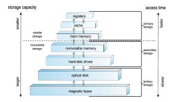
**Figure 1.6** Storage-device hierarchy.  


trade-off between size and speed, with smaller and faster memory closer to the CPU. As shown in the figure, in addition to differing in speed and capacity, the various storage systems are either volatile or nonvolatile. Volatile storage, as mentioned earlier, loses its contents when the power to the device is removed, so data must be written to nonvolatile storage for safekeeping.

The top four levels of memory in the figure are constructed using **semi- conductor memory**, which consists of semiconductor-based electronic circuits. NVM devices, at the fourth level, have several variants but in general are faster than hard disks. Themost common form of NVMdevice is flashmemory,which is popular in mobile devices such as smartphones and tablets. Increasingly, flash memory is being used for long-term storage on laptops, desktops, and servers as well.

Since storage plays an important role in operating-system structure, we will refer to it frequently in the text. In general, we will use the following terminology:

• Volatile storagewill be referred to simply as**memory**. If we need to empha- size a particular type of storage device (for example, a register),we will do so explicitly.

• Nonvolatile storage retains its contents when power is lost. It will be referred to as **NVS**. The vast majority of the time we spend on NVS will be on secondary storage. This type of storage can be classified into two distinct types:

◦ **Mechanical**. A few examples of such storage systems are HDDs, optical disks, holographic storage, andmagnetic tape. If we need to emphasize a particular type of mechanical storage device (for example, magnetic tape), we will do so explicitly.

◦ **Electrical**. A few examples of such storage systems are flash memory, FRAM, NRAM, and SSD. Electrical storage will be referred to as **NVM**. If we need to emphasize a particular type of electrical storage device (for example, SSD), we will do so explicitly.

Mechanical storage is generally larger and less expensive per byte than electrical storage. Conversely, electrical storage is typically costly, smaller, and faster than mechanical storage.

The design of a complete storage system must balance all the factors just discussed: it must use only as much expensive memory as necessary while providing as much inexpensive, nonvolatile storage as possible. Caches can be installed to improve performance where a large disparity in access time or transfer rate exists between two components.

### I/O Structure

A large portion of operating system code is dedicated to managing I/O, both because of its importance to the reliability and performance of a system and because of the varying nature of the devices.

Recall from the beginning of this section that a general-purpose computer system consists of multiple devices, all of which exchange data via a common  


**Figure 1.7** How a modern computer system works.

bus. The form of interrupt-driven I/O described in Section 1.2.1 is fine for moving small amounts of data but can produce high overhead when used for bulk data movement such as NVS I/O. To solve this problem, **direct memory access** (**DMA**) is used. After setting up buffers, pointers, and counters for the I/O device, the device controller transfers an entire block of data directly to or from the device and main memory, with no intervention by the CPU. Only one interrupt is generated per block, to tell the device driver that the operation has completed, rather than the one interrupt per byte generated for low-speed devices. While the device controller is performing these operations, the CPU is available to accomplish other work.

Some high-end systems use switch rather than bus architecture. On these systems, multiple components can talk to other components concurrently, rather than competing for cycles on a shared bus. In this case, DMA is even more effective. Figure 1.7 shows the interplay of all components of a computer system.

## Computer-System Architecture

In Section 1.2, we introduced the general structure of a typical computer sys- tem. A computer system can be organized in a number of different ways, which we can categorize roughly according to the number of general-purpose processors used.

### Single-Processor Systems

Many years ago, most computer systems used a single processor containing one CPU with a single processing core. The **core** is the component that exe- cutes instructions and registers for storing data locally. The one main CPU with its core is capable of executing a general-purpose instruction set, including instructions from processes. These systems have other special-purpose processors as well. They may come in the form of device-specific processors, such as disk, keyboard, and graphics controllers.

All of these special-purpose processors run a limited instruction set and do not run processes. Sometimes, they are managed by the operating system, in that the operating system sends them information about their next task and monitors their status. For example, a disk-controller microprocessor receives a sequence of requests from the main CPU core and implements its own disk queue and scheduling algorithm. This arrangement relieves the main CPU of the overhead of disk scheduling. PCs contain a microprocessor in the keyboard to convert the keystrokes into codes to be sent to the CPU. In other systems or circumstances, special-purpose processors are low-level components built into the hardware. The operating system cannot communicate with these proces- sors; they do their jobs autonomously. The use of special-purposemicroproces- sors is common anddoes not turn a single-processor system into amultiproces- sor. If there is only one general-purpose CPUwith a single processing core, then the system is a single-processor system. According to this definition, however, very few contemporary computer systems are single-processor systems.

### Multiprocessor Systems

On modern computers, from mobile devices to servers, **multiprocessor sys- tems** now dominate the landscape of computing. Traditionally, such systems have two (or more) processors, each with a single-core CPU. The proces- sors share the computer bus and sometimes the clock, memory, and periph- eral devices. The primary advantage of multiprocessor systems is increased throughput. That is, by increasing the number of processors, we expect to get more work done in less time. The speed-up ratio with _N_ processors is not _N,_ however; it is less than _N._Whenmultiple processors cooperate on a task, a cer- tain amount of overhead is incurred in keeping all the parts working correctly. This overhead, plus contention for shared resources, lowers the expected gain from additional processors.

The most common multiprocessor systems use **symmetric multiprocess- ing** (**SMP**), in which each peer CPU processor performs all tasks, including operating-system functions and user processes. Figure 1.8 illustrates a typical SMP architecture with two processors, each with its own CPU. Notice that each CPU processor has its own set of registers, as well as a private—or local— cache. However, all processors share physical memory over the system bus.

The benefit of this model is that many processes can run simultaneously —_N_ processes can run if there are _N_ CPUs—without causing performance to deteriorate significantly. However, since the CPUs are separate, one may be sitting idle while another is overloaded, resulting in inefficiencies. These inefficiencies can be avoided if the processors share certain data structures. A multiprocessor system of this form will allow processes and resources—such as memory—to be shared dynamically among the various processors and can lower the workload variance among the processors. Such a system must be written carefully, as we shall see in Chapter 5 and Chapter 6.

The definition of **_multiprocessor_** has evolved over time and now includes **multicore** systems, in which multiple computing cores reside on a single chip. Multicore systems can be more efficient than multiple chips with single cores because on-chip communication is faster than between-chip communication.  


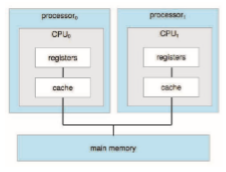
**Figure 1.8** Symmetric multiprocessing architecture.

In addition, one chip with multiple cores uses significantly less power than multiple single-core chips, an important issue for mobile devices as well as laptops.

In Figure 1.9, we show a dual-core design with two cores on the same pro- cessor chip. In this design, each core has its own register set, as well as its own local cache, often known as a level 1, or L1, cache. Notice, too, that a level 2 (L2) cache is local to the chip but is shared by the two processing cores. Most archi- tectures adopt this approach, combining local and shared caches, where local, lower-level caches are generally smaller and faster than higher-level shared

**Figure 1.9** A dual-core design with two cores on the same chip.  


**_DEFINITIONS OF COMPUTER SYSTEM COMPONENTS_**

• **CPU**—The hardware that executes instructions.

• **Processor**—Aphysical chip that contains one or more CPUs.

• **Core**—The basic computation unit of the CPU.

• **Multicore**—Including multiple computing cores on the same CPU.

• **Multiprocessor**—Including multiple processors.

Although virtually all systems are now multicore, we use the general term **_CPU_** when referring to a single computational unit of a computer system and **_core_** as well as **_multicore_** when specifically referring to one or more cores on a CPU.

caches. Aside from architectural considerations, such as cache, memory, and bus contention, amulticore processorwith_N_ cores appears to the operating sys- tem as _N_ standard CPUs. This characteristic puts pressure on operating-system designers—and application programmers—tomake efficient use of these pro- cessing cores, an issue we pursue in Chapter 4. Virtually all modern operating systems—including Windows, macOS, and Linux, as well as Android and iOS mobile systems—support multicore SMP systems.

Adding additional CPUs to a multiprocessor system will increase comput- ing power; however, as suggested earlier, the concept does not scale very well, and once we add too many CPUs, contention for the system bus becomes a bottleneck and performance begins to degrade. An alternative approach is instead to provide each CPU (or group of CPUs) with its own local memory that is accessed via a small, fast local bus. The CPUs are connected by a **shared system interconnect**, so that all CPUs share one physical address space. This approach—known as **non-uniform memory access**, or **NUMA**—is illustrated in Figure 1.10. The advantage is that, when a CPU accesses its local memory, not only is it fast, but there is also no contention over the system interconnect. Thus, NUMA systems can scale more effectively as more processors are added.

Apotential drawbackwith a NUMAsystem is increased latencywhen a CPU must access remotememory across the system interconnect, creating a possible performance penalty. In other words, for example, CPU0 cannot access the local memory of CPU3 as quickly as it can access its own localmemory, slowing down performance. Operating systems can minimize this NUMA penalty through careful CPU scheduling andmemorymanagement, as discussed in Section 5.5.2 and Section 10.5.4. Because NUMA systems can scale to accommodate a large number of processors, they are becoming increasingly popular on servers as well as high-performance computing systems.

Finally, **blade servers** are systems in which multiple processor boards, I/O boards, and networking boards are placed in the same chassis. The differ- ence between these and traditional multiprocessor systems is that each blade- processor board boots independently and runs its own operating system. Some blade-server boards are multiprocessor as well, which blurs the lines between  

**Figure 1.10** NUMA multiprocessing architecture.

types of computers. In essence, these servers consist of multiple independent multiprocessor systems.

### Clustered Systems

Another type of multiprocessor system is a **clustered system**, which gath- ers together multiple CPUs. Clustered systems differ from the multiprocessor systems described in Section 1.3.2 in that they are composed of two or more individual systems—or nodes—joined together; each node is typically a mul- ticore system. Such systems are considered **loosely coupled**. We should note that the definition of **_clustered_** is not concrete; many commercial and open- source packages wrestle to define what a clustered system is and why one form is better than another. The generally accepted definition is that clustered computers share storage and are closely linked via a local-area network LAN (as described in Chapter 19) or a faster interconnect, such as InfiniBand.

Clustering is usually used to provide **high-availability service**—that is, service that will continue even if one or more systems in the cluster fail. Generally, we obtain high availability by adding a level of redundancy in the system. A layer of cluster software runs on the cluster nodes. Each node can monitor one ormore of the others (over the network). If themonitoredmachine fails, the monitoring machine can take ownership of its storage and restart the applications that were running on the failed machine. The users and clients of the applications see only a brief interruption of service.

High availability provides increased reliability, which is crucial in many applications. The ability to continue providing service proportional to the level of surviving hardware is called **graceful degradation**. Some systemsgo beyond graceful degradation and are called **fault tolerant**, because they can suffer a failure of any single component and still continue operation. Fault tolerance requires a mechanism to allow the failure to be detected, diagnosed, and, if possible, corrected.

Clustering can be structured asymmetrically or symmetrically. In **asym- metric clustering**, one machine is in **hot-standby mode** while the other is run- ning the applications. The hot-standby host machine does nothing but monitor the active server. If that server fails, the hot-standby host becomes the active  


**_PC MOTHERBOARD_**

Consider the desktop PC motherboardwith a processor socket shown below:
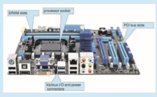
This board is a fully functioning computer, once its slots are populated. It consists of a processor socket containing a CPU, DRAM sockets, PCIe bus slots, and I/O connectors of various types. Even the lowest-cost general- purpose CPU contains multiple cores. Some motherboards contain multiple processor sockets. More advanced computers allow more than one system board, creating NUMA systems.

server. In **symmetric clustering**, two or more hosts are running applications and are monitoring each other. This structure is obviously more efficient, as it uses all of the available hardware. However, it does require that more than one application be available to run.

Since a cluster consists of several computer systems connected via a net- work, clusters can also be used to provide **high-performance computing** envi- ronments. Such systems can supply significantly greater computational power than single-processor or even SMP systems because they can run an application concurrently on all computers in the cluster. The application must have been written specifically to take advantage of the cluster, however. This involves a technique known as **parallelization**, which divides a program into separate components that run in parallel on individual cores in a computer or comput- ers in a cluster. Typically, these applications are designed so that once each computing node in the cluster has solved its portion of the problem, the results from all the nodes are combined into a final solution.

Other forms of clusters include parallel clusters and clustering over a wide-area network (WAN) (as described in Chapter 19). Parallel clusters allow multiple hosts to access the same data on shared storage. Because most oper-  

**Figure 1.11** General structure of a clustered system.

ating systems lack support for simultaneous data access by multiple hosts, parallel clusters usually require the use of special versions of software and special releases of applications. For example, Oracle Real Application Cluster is a version of Oracle’s database that has been designed to run on a parallel cluster. Each machine runs Oracle, and a layer of software tracks access to the shared disk. Eachmachine has full access to all data in the database. To provide this shared access, the system must also supply access control and locking to ensure that no conflicting operations occur. This function, commonly known as a **distributed lock manager** (**DLM**), is included in some cluster technology.

Cluster technology is changing rapidly. Some cluster products support thousands of systems in a cluster, as well as clustered nodes that are separated by miles. Many of these improvements are made possible by **storage-area networks** (**SANs**), as described in Section 11.7.4, which allow many systems to attach to a pool of storage. If the applications and their data are stored on the SAN, then the cluster software can assign the application to run on any host that is attached to the SAN. If the host fails, then any other host can take over. In a database cluster, dozens of hosts can share the same database, greatly increasing performance and reliability. Figure 1.11 depicts the general structure of a clustered system.

## Operating-System Operations

Now that we have discussed basic information about computer-system organi- zation and architecture, we are ready to talk about operating systems. An oper- ating system provides the environment within which programs are executed. Internally, operating systems vary greatly, since they are organized alongmany different lines. There are, however, many commonalities, which we consider in this section.

For a computer to start running—for instance, when it is powered up or rebooted—it needs to have an initial program to run. As noted earlier, this initial program, or bootstrap program, tends to be simple. Typically, it is stored within the computer hardware in firmware. It initializes all aspects of the system, from CPU registers to device controllers to memory contents. The bootstrap program must know how to load the operating system and how to  


**_HADOOP_**

Hadoop is an open-source software framework that is used for distributed processing of large data sets (known as **big data**) in a clustered system con- taining simple, low-cost hardware components. Hadoop is designed to scale from a single system to a cluster containing thousands of computing nodes. Tasks are assigned to a node in the cluster, andHadoop arranges communica- tion between nodes to manage parallel computations to process and coalesce results. Hadoop also detects and manages failures in nodes, providing an efficient and highly reliable distributed computing service.

Hadoop is organized around the following three components:

**1\.** Adistributed file system that manages data and files across distributed com- puting nodes.

**2\.** The YARN (“Yet Another Resource Negotiator”) framework, which manages resources within the cluster as well as scheduling tasks on nodes in the cluster.

**3\.** The **MapReduce** system, which allows parallel processing of data across nodes in the cluster.

Hadoop is designed to run on Linux systems, and Hadoop applications can be written using several programming languages, including scripting languages such as PHP, Perl, and Python. Java is a popular choice for developing Hadoop applications, as Hadoop has several Java libraries that support MapReduce. More information on MapReduce and Hadoop can be found at https://hadoop.apache.org/docs/r1.2.1/mapred tutorial.html and https://hadoop.apache.org

start executing that system. To accomplish this goal, the bootstrap program must locate the operating-system kernel and load it into memory.

Once the kernel is loaded and executing, it can start providing services to the system and its users. Some services are provided outside of the kernel by system programs that are loaded into memory at boot time to become **system daemons**, which run the entire time the kernel is running. On Linux, the first system program is “systemd,” and it starts many other daemons. Once this phase is complete, the system is fully booted, and the system waits for some event to occur.

If there are no processes to execute, no I/O devices to service, and no users towhom to respond, an operating systemwill sit quietly,waiting for something to happen. Events are almost always signaled by the occurrence of an interrupt. In Section 1.2.1 we described hardware interrupts. Another form of interrupt is a **trap** (or an **exception**), which is a software-generated interrupt caused either by an error (for example, division by zero or invalid memory access) or by a specific request from a user program that an operating-system service be performed by executing a special operation called a **system call**.  

### Multiprogramming and Multitasking

One of the most important aspects of operating systems is the ability to run multiple programs, as a single program cannot, in general, keep either the CPU or the I/O devices busy at all times. Furthermore, users typically _want_ to run more than one program at a time as well. **Multiprogramming** increases CPU utilization, as well as keeping users satisfied, by organizing programs so that the CPU always has one to execute. In a multiprogrammed system, a program in execution is termed a **process**.

The idea is as follows: The operating system keeps several processes in memory simultaneously (Figure 1.12). The operating system picks and begins to execute one of these processes. Eventually, the process may have to wait for some task, such as an I/O operation, to complete. In a non-multiprogrammed system, the CPU would sit idle. In a multiprogrammed system, the operating system simply switches to, and executes, another process. When **_that_** process needs to wait, the CPU switches to **_another_** process, and so on. Eventually, the first process finishes waiting and gets the CPU back. As long as at least one process needs to execute, the CPU is never idle.

This idea is common in other life situations. A lawyer does not work for only one client at a time, for example. While one case is waiting to go to trial or have papers typed, the lawyer can work on another case. If she has enough clients, the lawyer will never be idle for lack of work. (Idle lawyers tend to become politicians, so there is a certain social value in keeping lawyers busy.)

**Multitasking** is a logical extension of multiprogramming. In multitasking systems, the CPU executes multiple processes by switching among them, but the switches occur frequently, providing the user with a fast **response time**. Consider that when a process executes, it typically executes for only a short time before it either finishes or needs to perform I/O. I/O may be interactive; that is, output goes to a display for the user, and input comes from a user keyboard, mouse, or touch screen. Since interactive I/O typically runs at “peo- ple speeds,” it may take a long time to complete. Input, for example, may be


**Figure 1.12** Memory layout for a multiprogramming system.  
bounded by the user’s typing speed; seven characters per second is fast for people but incredibly slow for computers. Rather than let the CPU sit idle as this interactive input takes place, the operating system will rapidly switch the CPU to another process.

Having several processes in memory at the same time requires some form of memory management, which we cover in Chapter 9 and Chapter 10. In addition, if several processes are ready to run at the same time, the systemmust choose which process will run next. Making this decision is **CPU scheduling**, which is discussed in Chapter 5. Finally, running multiple processes concur- rently requires that their ability to affect one another be limited in all phases of the operating system, including process scheduling, disk storage, andmemory management. We discuss these considerations throughout the text.

In a multitasking system, the operating system must ensure reasonable response time. A common method for doing so is **virtual memory**, a tech- nique that allows the execution of a process that is not completely in memory (Chapter 10). The main advantage of this scheme is that it enables users to run programs that are larger than actual **physical memory**. Further, it abstracts main memory into a large, uniform array of storage, separating **logical mem- ory** as viewed by the user from physical memory. This arrangement frees programmers from concern over memory-storage limitations.

Multiprogramming and multitasking systems must also provide a file sys- tem (Chapter 13, Chapter 14, and Chapter 15). The file system resides on a secondary storage; hence, storagemanagementmust be provided (Chapter 11). In addition, a system must protect resources from inappropriate use (Chapter 17). To ensure orderly execution, the systemmust also providemechanisms for process synchronization and communication (Chapter 6 and Chapter 7), and it may ensure that processes do not get stuck in a deadlock, forever waiting for one another (Chapter 8).

### Dual-Mode and Multimode Operation

Since the operating system and its users share the hardware and software resources of the computer system, a properly designed operating systemmust ensure that an incorrect (or malicious) program cannot cause other programs —or the operating system itself—to execute incorrectly. In order to ensure the proper execution of the system, we must be able to distinguish between the execution of operating-system code and user-defined code. The approach taken by most computer systems is to provide hardware support that allows differentiation among various modes of execution.

At the very least, we need two separate **_modes_** of operation: **user mode** and **kernel mode** (also called **supervisor mode**, **system mode**, or **privileged mode**). A bit, called the **mode bit**, is added to the hardware of the computer to indicate the current mode: kernel (0) or user (1). With the mode bit, we can distinguish between a task that is executed on behalf of the operating system and one that is executed on behalf of the user. When the computer system is executing on behalf of a user application, the system is in usermode. However, when a user application requests a service from the operating system (via a system call), the system must transition from user to kernel mode to fulfill  
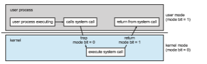
**Figure 1.13** Transition from user to kernel mode.

the request. This is shown in Figure 1.13. As we shall see, this architectural enhancement is useful for many other aspects of system operation as well.

At system boot time, the hardware starts in kernel mode. The operating system is then loaded and starts user applications in user mode. Whenever a trap or interrupt occurs, the hardware switches fromusermode to kernelmode (that is, changes the state of the mode bit to 0). Thus, whenever the operating system gains control of the computer, it is in kernel mode. The system always switches to user mode (by setting the mode bit to 1) before passing control to a user program.

The dual mode of operation provides us with the means for protecting the operating system from errant users—and errant users from one another. We accomplish this protection by designating some of the machine instructions that may cause harm as **privileged instructions**. The hardware allows privi- leged instructions to be executed only in kernel mode. If an attempt is made to execute a privileged instruction in user mode, the hardware does not execute the instruction but rather treats it as illegal and traps it to the operating system.

The instruction to switch to kernel mode is an example of a privileged instruction. Some other examples include I/O control, timer management, and interrupt management. Many additional privileged instructions are discussed throughout the text.

The concept of modes can be extended beyond two modes. For example, Intel processors have four separate **protection rings**, where ring 0 is kernel mode and ring 3 is user mode. (Although rings 1 and 2 could be used for vari- ous operating-systemservices, in practice they are rarely used.) ARMv8 systems have seven modes. CPUs that support virtualization (Section 18.1) frequently have a separate mode to indicate when the **virtual machine manager** (**VMM**) is in control of the system. In this mode, the VMM has more privileges than user processes but fewer than the kernel. It needs that level of privilege so it can create and manage virtual machines, changing the CPU state to do so.

We can now better understand the life cycle of instruction execution in a computer system. Initial control resides in the operating system,where instruc- tions are executed in kernel mode. When control is given to a user applica- tion, the mode is set to user mode. Eventually, control is switched back to the operating system via an interrupt, a trap, or a system call. Most contem- porary operating systems—such as Microsoft Windows, Unix, and Linux take advantage of this dual-mode feature and provide greater protection for the operating system.

System calls provide the means for a user program to ask the operating system to perform tasks reserved for the operating system on the user pro- gram’s behalf. A system call is invoked in a variety of ways, depending on the functionality provided by the underlying processor. In all forms, it is the method used by a process to request action by the operating system. A system call usually takes the form of a trap to a specific location in the interrupt vector. This trap can be executed by a generic trap instruction, although some systems have a specific syscall instruction to invoke a system call.

When a system call is executed, it is typically treated by the hardware as a software interrupt. Control passes through the interrupt vector to a service routine in the operating system, and the mode bit is set to kernel mode. The system-call service routine is a part of the operating system. The kernel exam- ines the interrupting instruction to determine what system call has occurred; a parameter indicates what type of service the user program is requesting. Additional information needed for the request may be passed in registers, on the stack, or in memory (with pointers to the memory locations passed in reg- isters). The kernel verifies that the parameters are correct and legal, executes the request, and returns control to the instruction following the system call. We describe system calls more fully in Section 2.3.

Once hardware protection is in place, it detects errors that violate modes. These errors are normally handled by the operating system. If a user program fails in some way—such as by making an attempt either to execute an illegal instruction or to access memory that is not in the user’s address space—then the hardware traps to the operating system. The trap transfers control through the interrupt vector to the operating system, just as an interrupt does. When a program error occurs, the operating system must terminate the program abnormally. This situation is handled by the same code as a user-requested abnormal termination. An appropriate errormessage is given, and thememory of the programmay be dumped. The memory dump is usually written to a file so that the user or programmer can examine it and perhaps correct it and restart the program.

### Timer

We must ensure that the operating system maintains control over the CPU. We cannot allow a user program to get stuck in an infinite loop or to fail to call system services and never return control to the operating system. To accomplish this goal, we can use a **timer**. A timer can be set to interrupt the computer after a specified period. The period may be fixed (for example, 1/60 second) or variable (for example, from 1 millisecond to 1 second). A **variable timer** is generally implemented by a fixed-rate clock and a counter. The operating system sets the counter. Every time the clock ticks, the counter is decremented. When the counter reaches 0, an interrupt occurs. For instance, a 10-bit counter with a 1-millisecond clock allows interrupts at intervals from 1 millisecond to 1,024 milliseconds, in steps of 1 millisecond.

Before turning over control to the user, the operating system ensures that the timer is set to interrupt. If the timer interrupts, control transfers automati- cally to the operating system, which may treat the interrupt as a fatal error or  


**_LINUX TIMERS_**

On Linux systems, the kernel configuration parameter HZ specifies the fre- quency of timer interrupts. An HZ value of 250means that the timer generates 250 interrupts per second, or one interrupt every 4 milliseconds. The value of HZ depends upon how the kernel is configured, as well the machine type and architecture on which it is running. A related kernel variable is jiffies, which represent the number of timer interrupts that have occurred since the system was booted. A programming project in Chapter 2 further explores timing in the Linux kernel.

may give the programmore time. Clearly, instructions that modify the content of the timer are privileged.

## Resource Management

Aswehave seen, an operating system is a **resource manager**. The system’s CPU, memory space, file-storage space, and I/O devices are among the resources that the operating system must manage.

### Process Management

A program can do nothing unless its instructions are executed by a CPU. A program in execution, asmentioned, is a process. Aprogram such as a compiler is a process, and a word-processing program being run by an individual user on a PC is a process. Similarly, a social media app on a mobile device is a process. For now, you can consider a process to be an instance of a program in execution, but later you will see that the concept is more general. As described in Chapter 3, it is possible to provide system calls that allow processes to create subprocesses to execute concurrently.

Aprocess needs certain resources—including CPU time,memory, files, and I/O devices—to accomplish its task. These resources are typically allocated to the process while it is running. In addition to the various physical and logical resources that a process obtains when it is created, various initialization data (input) may be passed along. For example, consider a process running a web browser whose function is to display the contents of a web page on a screen. The process will be given the URL as an input and will execute the appropriate instructions and system calls to obtain and display the desired information on the screen.When the process terminates, the operating systemwill reclaim any reusable resources.

We emphasize that a program by itself is not a process. A program is a **_passive_** entity, like the contents of a file stored on disk, whereas a process is an **_active_** entity. A single-threaded process has one **program counter** specifying the next instruction to execute. (Threads are covered in Chapter 4.) The exe- cution of such a process must be sequential. The CPU executes one instruction of the process after another, until the process completes. Further, at any time, one instruction at most is executed on behalf of the process. Thus, although  


two processes may be associated with the same program, they are nevertheless considered two separate execution sequences. A multithreaded process has multiple program counters, each pointing to the next instruction to execute for a given thread.

A process is the unit of work in a system. A system consists of a collec- tion of processes, some of which are operating-system processes (those that execute system code) and the rest of which are user processes (those that exe- cute user code). All these processes can potentially execute concurrently—by multiplexing on a single CPU core—or in parallel across multiple CPU cores.

The operating system is responsible for the following activities in connec- tion with process management:

• Creating and deleting both user and system processes

• Scheduling processes and threads on the CPUs

• Suspending and resuming processes

• Providing mechanisms for process synchronization

• Providing mechanisms for process communication

We discuss process-management techniques in Chapter 3 through Chapter 7.

### Memory Management

As discussed in Section 1.2.2, the main memory is central to the operation of a modern computer system. Main memory is a large array of bytes, ranging in size from hundreds of thousands to billions. Each byte has its own address. Main memory is a repository of quickly accessible data shared by the CPU and I/O devices. The CPU reads instructions from main memory during the instruction-fetch cycle and both reads and writes data from main memory during the data-fetch cycle (on a von Neumann architecture). As noted earlier, the main memory is generally the only large storage device that the CPU is able to address and access directly. For example, for the CPU to process data from disk, those data must first be transferred to main memory by CPU-generated I/O calls. In the same way, instructions must be in memory for the CPU to execute them.

For a program to be executed, it must bemapped to absolute addresses and loaded intomemory. As the program executes, it accesses program instructions and data from memory by generating these absolute addresses. Eventually, the program terminates, its memory space is declared available, and the next program can be loaded and executed.

To improve both the utilization of the CPU and the speed of the computer’s response to its users, general-purpose computers must keep several programs inmemory, creating a need formemorymanagement.Many differentmemory- management schemes are used. These schemes reflect various approaches, and the effectiveness of any given algorithmdepends on the situation. In selecting a memory-management scheme for a specific system, wemust take into account many factors—especially the **_hardware_** design of the system. Each algorithm requires its own hardware support.  


The operating system is responsible for the following activities in connec- tion with memory management:

• Keeping track of which parts of memory are currently being used and which process is using them

• Allocating and deallocating memory space as needed

• Deciding which processes (or parts of processes) and data to move into and out of memory

Memory-management techniques are discussed in Chapter 9 and Chapter 10.

### File-System Management

To make the computer system convenient for users, the operating system provides a uniform, logical view of information storage. The operating system abstracts from the physical properties of its storage devices to define a logical storage unit, the **fil** . The operating systemmaps files onto physical media and accesses these files via the storage devices.

File management is one of the most visible components of an operating system. Computers can store information on several different types of physi- cal media. Secondary storage is the most common, but tertiary storage is also possible. Each of these media has its own characteristics and physical orga- nization. Most are controlled by a device, such as a disk drive, that also has its own unique characteristics. These properties include access speed, capacity, data-transfer rate, and access method (sequential or random).

A file is a collection of related information defined by its creator. Com- monly, files represent programs (both source and object forms) and data. Data files may be numeric, alphabetic, alphanumeric, or binary. Files may be free- form (for example, text files), or they may be formatted rigidly (for example, fixed fields such as an mp3 music file). Clearly, the concept of a file is an extremely general one.

The operating system implements the abstract concept of a file by manag- ing mass storage media and the devices that control them. In addition, files are normally organized into directories to make them easier to use. Finally, when multiple users have access to files, it may be desirable to control which user may access a file and how that user may access it (for example, read, write, append).

The operating system is responsible for the following activities in connec- tion with file management:

• Creating and deleting files

• Creating and deleting directories to organize files

• Supporting primitives for manipulating files and directories

• Mapping files onto mass storage

• Backing up files on stable (nonvolatile) storage media  


File-management techniques are discussed in Chapter 13, Chapter 14, and Chapter 15.

### Mass-Storage Management

Aswehave already seen, the computer systemmust provide secondary storage to back up main memory. Most modern computer systems use HDDs and NVM devices as the principal on-line storage media for both programs and data. Most programs—including compilers, web browsers, word processors, and games—are stored on these devices until loaded into memory. The programs then use the devices as both the source and the destination of their processing. Hence, the proper management of secondary storage is of central importance to a computer system. The operating system is responsible for the following activities in connection with secondary storage management:

• Mounting and unmounting

• Free-space management

• Storage allocation

• Disk scheduling

• Partitioning

• Protection

Because secondary storage is used frequently and extensively, it must be used efficiently. The entire speedof operation of a computermayhinge on the speeds of the secondary storage subsystem and the algorithms that manipulate that subsystem.

At the same time, there are many uses for storage that is slower and lower in cost (and sometimes higher in capacity) than secondary storage. Backups of disk data, storage of seldom-used data, and long-term archival storage are some examples.Magnetic tape drives and their tapes and CD DVD and Blu-ray drives and platters are typical tertiary storage devices.

Tertiary storage is not crucial to system performance, but it still must be managed. Some operating systems take on this task, while others leave tertiary-storage management to application programs. Some of the functions that operating systems can provide include mounting and unmounting media in devices, allocating and freeing the devices for exclusive use by processes, and migrating data from secondary to tertiary storage.

Techniques for secondary storage and tertiary storage management are discussed in Chapter 11.

### Cache Management

**Caching** is an important principle of computer systems. Here’s how it works. Information is normally kept in some storage system (such as main memory). As it is used, it is copied into a faster storage system—the cache—on a tem- porary basis. When we need a particular piece of information, we first check whether it is in the cache. If it is, we use the information directly from the cache.  


**Figure 1.14** Characteristics of various types of storage.

If it is not, we use the information from the source, putting a copy in the cache under the assumption that we will need it again soon.

In addition, internal programmable registers provide a high-speed cache for main memory. The programmer (or compiler) implements the register- allocation and register-replacement algorithms to decide which information to keep in registers and which to keep in main memory.

Other caches are implemented totally in hardware. For instance, most systems have an instruction cache to hold the instructions expected to be executed next. Without this cache, the CPU would have to wait several cycles while an instruction was fetched frommainmemory. For similar reasons, most systems have one ormore high-speed data caches in thememory hierarchy.We are not concerned with these hardware-only caches in this text, since they are outside the control of the operating system.

Because caches have limited size, **cache management** is an important design problem. Careful selection of the cache size and of a replacement policy can result in greatly increasedperformance, as you can see by examining Figure 1.14. Replacement algorithms for software-controlled caches are discussed in Chapter 10.

Themovement of information between levels of a storage hierarchymay be either explicit or implicit, depending on the hardware design and the control- ling operating-system software. For instance, data transfer from cache to CPU and registers is usually a hardware function, with no operating-system inter- vention. In contrast, transfer of data from disk to memory is usually controlled by the operating system.

In a hierarchical storage structure, the same data may appear in different levels of the storage system. For example, suppose that an integer A that is to be incremented by 1 is located in file B, and file B resides on hard disk. The increment operation proceeds by first issuing an I/O operation to copy the disk block on which A resides to main memory. This operation is followed by copying A to the cache and to an internal register. Thus, the copy of A appears in several places: on the hard disk, in main memory, in the cache, and in an internal register (see Figure 1.15). Once the increment takes place in the internal register, the value of A differs in the various storage systems. The value of A  


**Figure 1.15** Migration of integer A from disk to register.

becomes the same only after the new value of A is written from the internal register back to the hard disk.

In a computing environment where only one process executes at a time, this arrangement poses no difficulties, since an access to integer Awill always be to the copy at the highest level of the hierarchy. However, in a multitasking environment, where the CPU is switched back and forth among various pro- cesses, extreme care must be taken to ensure that, if several processes wish to access A, then each of these processes will obtain the most recently updated value of A.

The situation becomes more complicated in a multiprocessor environment where, in addition to maintaining internal registers, each of the CPUs also contains a local cache (refer back to Figure 1.8). In such an environment, a copy of A may exist simultaneously in several caches. Since the various CPUs can all execute in parallel, we must make sure that an update to the value of A in one cache is immediately reflected in all other caches where A resides. This situation is called **cache coherency**, and it is usually a hardware issue (handled below the operating-system level).

In a distributed environment, the situation becomes even more complex. In this environment, several copies (or replicas) of the same file can be kept on different computers. Since the various replicas may be accessed and updated concurrently, some distributed systems ensure that, when a replica is updated in one place, all other replicas are brought up to date as soon as possible. There are various ways to achieve this guarantee, as we discuss in Chapter 19.

### I/O System Management

One of the purposes of an operating system is to hide the peculiarities of specific hardware devices from the user. For example, in UNIX, the peculiarities of I/O devices are hidden from the bulk of the operating system itself by the **I/O subsystem**. The I/O subsystem consists of several components:

• Amemory-management component that includes buffering, caching, and spooling

• A general device-driver interface

• Drivers for specific hardware devices

Only the device driver knows the peculiarities of the specific device to which it is assigned.

We discussed earlier in this chapter how interrupt handlers and device drivers are used in the construction of efficient I/O subsystems. In Chapter 12, we discuss how the I/O subsystem interfaces to the other system components, manages devices, transfers data, and detects I/O completion.  

## Security and Protection

If a computer system has multiple users and allows the concurrent execution of multiple processes, then access to data must be regulated. For that purpose, mechanisms ensure that files, memory segments, CPU, and other resources can be operated on by only those processes that have gained proper authoriza- tion from the operating system. For example, memory-addressing hardware ensures that a process can execute only within its own address space. The timer ensures that no process can gain control of the CPU without eventually relinquishing control. Device-control registers are not accessible to users, so the integrity of the various peripheral devices is protected.

**Protection**, then, is any mechanism for controlling the access of processes or users to the resources defined by a computer system. This mechanism must providemeans to specify the controls to be imposed and to enforce the controls.

Protection can improve reliability by detecting latent errors at the interfaces between component subsystems. Early detection of interface errors can often prevent contamination of a healthy subsystem by another subsystem that is malfunctioning. Furthermore, an unprotected resource cannot defend against use (or misuse) by an unauthorized or incompetent user. Aprotection-oriented system provides a means to distinguish between authorized and unauthorized usage, as we discuss in Chapter 17.

A system can have adequate protection but still be prone to failure and allow inappropriate access. Consider a user whose authentication information (her means of identifying herself to the system) is stolen. Her data could be copied or deleted, even though file and memory protection are working. It is the job of **security** to defend a system from external and internal attacks. Such attacks spread across a huge range and include viruses and worms, denial-of- service attacks (which use all of a system’s resources and so keep legitimate users out of the system), identity theft, and theft of service (unauthorized use of a system). Prevention of some of these attacks is considered an operating- system function on some systems, while other systems leave it to policy or additional software. Due to the alarming rise in security incidents, operating- system security features are a fast-growing area of research and implementa- tion. We discuss security in Chapter 16.

Protection and security require the system to be able to distinguish among all its users. Most operating systems maintain a list of user names and asso- ciated **user identifier** (**user IDs**). In Windows parlance, this is a **security ID** (**SID**). These numerical IDs are unique, one per user. When a user logs in to the system, the authentication stage determines the appropriate user ID for the user. That user ID is associated with all of the user’s processes and threads. When an ID needs to be readable by a user, it is translated back to the user name via the user name list.

In some circumstances, we wish to distinguish among sets of users rather than individual users. For example, the owner of a file on a UNIX systemmay be allowed to issue all operations on that file, whereas a selected set of users may be allowed only to read the file. To accomplish this, we need to define a group name and the set of users belonging to that group. Group functionality can be implemented as a system-wide list of group names and **group identifier** . A user can be in one or more groups, depending on operating-system design  
decisions. The user’s group IDs are also included in every associated process and thread.

In the course of normal system use, the user ID and group ID for a user are sufficient. However, a user sometimes needs to **escalate privileges** to gain extra permissions for an activity. The user may need access to a device that is restricted, for example. Operating systems provide various methods to allow privilege escalation. On UNIX, for instance, the _setuid_ attribute on a program causes that program to run with the user ID of the owner of the file, rather than the current user’s ID. The process runs with this **effective UID** until it turns off the extra privileges or terminates.

## Virtualization

**Virtualization** is a technology that allows us to abstract the hardware of a sin- gle computer (the CPU, memory, disk drives, network interface cards, and so forth) into several different execution environments, thereby creating the illu- sion that each separate environment is running on its own private computer. These environments can be viewed as different individual operating systems (for example, Windows and UNIX) that may be running at the same time and may interact with each other. A user of a **virtual machine** can switch among the various operating systems in the same way a user can switch among the various processes running concurrently in a single operating system.

Virtualization allows operating systems to run as applications within other operating systems. At first blush, there seems to be little reason for such func- tionality. But the virtualization industry is vast and growing, which is a testa- ment to its utility and importance.

Broadly speaking, virtualization software is onemember of a class that also includes emulation. **Emulation**, which involves simulating computer hard- ware in software, is typically used when the source CPU type is different from the target CPU type. For example, when Apple switched from the IBM Power CPU to the Intel x86 CPU for its desktop and laptop computers, it included an emulation facility called “Rosetta,” which allowed applications compiled for the IBMCPU to run on the Intel CPU. That same concept can be extended to allow an entire operating system written for one platform to run on another. Emula- tion comes at a heavy price, however. Everymachine-level instruction that runs natively on the source system must be translated to the equivalent function on the target system, frequently resulting in several target instructions. If the source and target CPUs have similar performance levels, the emulated code may run much more slowly than the native code.

With virtualization, in contrast, an operating system that is natively com- piled for a particular CPU architecture runs within another operating system also native to that CPU. Virtualization first came about on IBM mainframes as a method for multiple users to run tasks concurrently. Running multiple vir- tual machines allowed (and still allows) many users to run tasks on a system designed for a single user. Later, in response to problemswith runningmultiple Microsoft Windows applications on the Intel x86 CPU, VMware created a new virtualization technology in the form of an application that ran on Windows. That application ran one or more **guest** copies of Windows or other native x86 operating systems, each running its own applications. (See Figure 1.16.)  


**Figure 1.16** A computer running (a) a single operating system and (b) three virtual machines.

Windows was the **host** operating system, and the VMware application was the **virtual machine manager** (**VMM**). The VMM runs the guest operating systems, manages their resource use, and protects each guest from the others.

Even thoughmodern operating systems are fully capable of runningmulti- ple applications reliably, the use of virtualization continues to grow.On laptops and desktops, a VMM allows the user to install multiple operating systems for exploration or to run applications written for operating systems other than the native host. For example, an Apple laptop running macOS on the x86 CPU can run a Windows 10 guest to allow execution of Windows applications. Com- panies writing software for multiple operating systems can use virtualization to run all of those operating systems on a single physical server for develop- ment, testing, and debugging. Within data centers, virtualization has become a commonmethod of executing and managing computing environments. VMMs like VMware ESXand Citrix XenServer no longer run on host operating systems but rather **_are_** the host operating systems, providing services and resource management to virtual machine processes.

With this text, we provide a Linux virtual machine that allows you to run Linux—as well as the development tools we provide—on your personal system regardless of your host operating system. Full details of the features and implementation of virtualization can be found in Chapter 18.

## Distributed Systems

A distributed system is a collection of physically separate, possibly heteroge- neous computer systems that are networked to provide users with access to the various resources that the system maintains. Access to a shared resource increases computation speed, functionality, data availability, and reliability. Some operating systems generalize network access as a form of file access, with the details of networking contained in the network interface’s device driver.  
Others make users specifically invoke network functions. Generally, systems contain a mix of the two modes—for example FTP and NFS. The protocols that create a distributed system can greatly affect that system’s utility and popularity.

A**network**, in the simplest terms, is a communication path between two or more systems. Distributed systems depend on networking for their functional- ity. Networks vary by the protocols used, the distances between nodes, and the transport media. **TCP/IP** is the most common network protocol, and it provides the fundamental architecture of the Internet. Most operating systems support TCP/IP, including all general-purpose ones. Some systems support proprietary protocols to suit their needs. For an operating system, it is necessary only that a network protocol have an interface device—a network adapter, for example —with a device driver to manage it, as well as software to handle data. These concepts are discussed throughout this book.

Networks are characterized based on the distances between their nodes. A **local-area network** (**LAN**) connects computers within a room, a building, or a campus. A **wide-area network** (**WAN**) usually links buildings, cities, or countries. Aglobal companymay have aWAN to connect its offices worldwide, for example. These networks may run one protocol or several protocols. The continuing advent of new technologies brings about new forms of networks. For example, a **metropolitan-area network** (**MAN**) could link buildings within a city. BlueTooth and 802.11 devices use wireless technology to communicate over a distance of several feet, in essence creating a **personal-area network** (**PAN**) between a phone and a headset or a smartphone and adesktop computer.

Themedia to carry networks are equally varied. They include copperwires, fiber strands, andwireless transmissions between satellites,microwave dishes, and radios. When computing devices are connected to cellular phones, they create a network. Even very short-range infrared communication can be used for networking. At a rudimentary level, whenever computers communicate, they use or create a network. These networks also vary in their performance and reliability.

Some operating systems have taken the concept of networks and dis- tributed systems further than the notion of providing network connectivity. A **network operating system** is an operating system that provides features such as file sharing across the network, along with a communication scheme that allows different processes on different computers to exchange messages. A computer running a network operating system acts autonomously from all other computers on the network, although it is aware of the network and is able to communicate with other networked computers. A distributed operat- ing system provides a less autonomous environment. The different computers communicate closely enough to provide the illusion that only a single operat- ing system controls the network.We cover computer networks and distributed systems in Chapter 19.

## Kernel Data Structures

We turn next to a topic central to operating-system implementation: the way data are structured in the system. In this section, we briefly describe several fundamental data structures used extensively in operating systems. Readers  


**Figure 1.17** Singly linked list.

who require further details on these structures, aswell as others, should consult the bibliography at the end of the chapter.

### Lists, Stacks, and Queues

An array is a simple data structure in which each element can be accessed directly. For example, main memory is constructed as an array. If the data item being stored is larger than one byte, then multiple bytes can be allocated to the item, and the item is addressed as “item number × item size.” But what about storing an itemwhose size may vary? And what about removing an item if the relative positions of the remaining itemsmust be preserved? In such situations, arrays give way to other data structures.

After arrays, lists are perhaps themost fundamental data structures in com- puter science. Whereas each item in an array can be accessed directly, the items in a list must be accessed in a particular order. That is, a **list** represents a collec- tion of data values as a sequence. Themost commonmethod for implementing this structure is a **linked list**, in which items are linked to one another. Linked lists are of several types:

• In a **_singly linked list,_** each item points to its successor, as illustrated in Figure 1.17.

• In a **_doubly linked list,_** a given item can refer either to its predecessor or to its successor, as illustrated in Figure 1.18.

• In a **_circularly linked list,_** the last element in the list refers to the first element, rather than to null, as illustrated in Figure 1.19.

Linked lists accommodate items of varying sizes and allow easy insertion and deletion of items. One potential disadvantage of using a list is that per- formance for retrieving a specified item in a list of size _n_ is linear—_O_(_n_), as it requires potentially traversing all _n_ elements in the worst case. Lists are some- times used directly by kernel algorithms. Frequently, though, they are used for constructing more powerful data structures, such as stacks and queues.

A **stack** is a sequentially ordered data structure that uses the last in, first out (**LIFO**) principle for adding and removing items, meaning that the last item
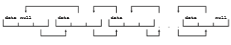
**Figure 1.18** Doubly linked list.  


**Figure 1.19** Circularly linked list.

placed onto a stack is the first item removed. The operations for inserting and removing items from a stack are known as **_push_** and **_pop_**, respectively. An operating system often uses a stack when invoking function calls. Parameters, local variables, and the return address are pushed onto the stack when a function is called; returning from the function call pops those items off the stack.

A **queue**, in contrast, is a sequentially ordered data structure that uses the first in, first out (**FIFO**) principle: items are removed from a queue in the order in which they were inserted. There are many everyday examples of queues, including shoppers waiting in a checkout line at a store and cars waiting in line at a traffic signal. Queues are also quite common in operating systems—jobs that are sent to a printer are typically printed in the order in which they were submitted, for example. As we shall see in Chapter 5, tasks that are waiting to be run on an available CPU are often organized in queues.

### Trees

A **tree** is a data structure that can be used to represent data hierarchically. Data values in a tree structure are linked through parent–child relationships. In a **general tree**, a parent may have an unlimited number of children. In a **binary tree**, a parent may have at most two children, which we term the **_left child_** and the **_right child_**. A **binary search tree** additionally requires an ordering between the parent’s two children in which _left child <_\= _right child_. Figure 1.20 provides an example of a binary search tree. When we search for an item in a binary search tree, the worst-case performance is _O_(_n_) (consider how this can occur). To remedy this situation, we can use an algorithm to create a **balanced binary search tree**. Here, a tree containing _n_ items has at most _lg n_ levels, thus ensuring worst-case performance of _O_(_lg n_). We shall see in Section 5.7.1 that Linux uses a balanced binary search tree (known as a **red-black tree**) as part its CPU-scheduling algorithm.

### Hash Functions and Maps

A **hash function** takes data as its input, performs a numeric operation on the data, and returns a numeric value. This numeric value can then be used as an index into a table (typically an array) to quickly retrieve the data. Whereas searching for a data item through a list of size _n_ can require up to_O_(_n_) compar- isons, using a hash function for retrieving data from a table can be as good as _O_(1), depending on implementation details. Because of this performance, hash functions are used extensively in operating systems.

One potential difficulty with hash functions is that two unique inputs can result in the same output value—that is, they can link to the same table  


**Figure 1.20** Binary search tree.

location. We can accommodate this **_hash collision_** by having a linked list at the table location that contains all of the itemswith the same hash value. Of course, the more collisions there are, the less efficient the hash function is.

One use of a hash function is to implement a **hash map**, which associates (or **_maps_**) \[key:value\] pairs using a hash function. Once the mapping is estab- lished, we can apply the hash function to the key to obtain the value from the hash map (Figure 1.21). For example, suppose that a user name is mapped to a password. Password authentication then proceeds as follows: a user enters her user name and password. The hash function is applied to the user name, which is then used to retrieve the password. The retrieved password is then compared with the password entered by the user for authentication.

### Bitmaps

A**bitmap** is a string of _n_ binary digits that can be used to represent the status of _n_ items. For example, suppose we have several resources, and the availability of each resource is indicated by the value of a binary digit: 0 means that the resource is available, while 1 indicates that it is unavailable (or vice versa). The
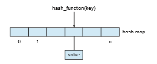
**Figure 1.21** Hash map.  


**_LINUX KERNEL DATA STRUCTURES_**

The data structures used in the Linux kernel are available in the kernel source code. The **_include_** file _<_linux/list.h_\>_ provides details of the linked-list data structure used throughout the kernel. A queue in Linux is known as a kfifo, and its implementation can be found in the kfifo.c file in the kernel directory of the source code. Linux also provides a balancedbinary search tree implementation using **_red-black trees_**. Details can be found in the include file _<_linux/rbtree.h_\>_.

value of the _ith_ position in the bitmap is associated with the _ith_ resource. As an example, consider the bitmap shown below:

0 0 1 0 1 1 1 0 1

Resources 2, 4, 5, 6, and 8 are unavailable; resources 0, 1, 3, and 7 are available. The power of bitmaps becomes apparent when we consider their space

efficiency. If we were to use an eight-bit Boolean value instead of a single bit, the resulting data structure would be eight times larger. Thus, bitmaps are commonly used when there is a need to represent the availability of a large number of resources. Disk drives provide a nice illustration. Amedium-sized disk drivemight be divided into several thousand individual units, called **disk blocks**. A bitmap can be used to indicate the availability of each disk block.

In summary, data structures are pervasive in operating system implemen- tations. Thus, we will see the structures discussed here, along with others, throughout this text as we explore kernel algorithms and their implementa- tions.

## Computing Environments

So far, we have briefly described several aspects of computer systems and the operating systems that manage them. We turn now to a discussion of how operating systems are used in a variety of computing environments.

### Traditional Computing

As computing has matured, the lines separating many of the traditional com- puting environments have blurred. Consider the “typical office environment.” Just a few years ago, this environment consisted of PCs connected to a network, with servers providing file and print services. Remote access was awkward, and portability was achieved by use of laptop computers.

Today, web technologies and increasing WAN bandwidth are stretching the boundaries of traditional computing. Companies establish **portals**, which pro- vide web accessibility to their internal servers. **Network computers** (or **thin clients**)—which are essentially terminals that understand web-based comput- ing—are used in place of traditional workstations where more security or easier maintenance is desired. Mobile computers can synchronize with PCs to allow very portable use of company information. Mobile devices can also  connect to **wireless networks** and cellular data networks to use the company’s web portal (as well as the myriad other web resources).

At home, most users once had a single computer with a slow modem con- nection to the office, the Internet, or both. Today, network-connection speeds once available only at great cost are relatively inexpensive in many places, giving home users more access to more data. These fast data connections are allowing home computers to serve up web pages and to run networks that include printers, client PCs, and servers. Many homes use **firewall** to pro- tect their networks from security breaches. Firewalls limit the communications between devices on a network.

In the latter half of the 20th century, computing resources were relatively scarce. (Before that, they were nonexistent!) For a period of time, systems were either batch or interactive. Batch systems processed jobs in bulk, with prede- termined input from files or other data sources. Interactive systems waited for input from users. To optimize the use of the computing resources, multiple users shared time on these systems. These time-sharing systems used a timer and scheduling algorithms to cycle processes rapidly through the CPU, giving each user a share of the resources.

Traditional time-sharing systems are rare today. The same scheduling tech- nique is still in use on desktop computers, laptops, servers, and even mobile computers, but frequently all the processes are owned by the same user (or a single user and the operating system). User processes, and system processes that provide services to the user, are managed so that each frequently gets a slice of computer time. Consider the windows created while a user is working on a PC, for example, and the fact that they may be performing different tasks at the same time. Even a web browser can be composed of multiple processes, one for each website currently being visited, with time sharing applied to each web browser process.

### Mobile Computing

**Mobile computing** refers to computing on handheld smartphones and tablet computers. These devices share the distinguishing physical features of being portable and lightweight. Historically, compared with desktop and laptop computers, mobile systems gave up screen size, memory capacity, and overall functionality in return for handheld mobile access to services such as e-mail and web browsing. Over the past few years, however, features on mobile devices have become so rich that the distinction in functionality between, say, a consumer laptop and a tablet computer may be difficult to discern. In fact, we might argue that the features of a contemporary mobile device allow it to provide functionality that is either unavailable or impractical on a desktop or laptop computer.

Today, mobile systems are used not only for e-mail and web browsing but also for playing music and video, reading digital books, taking photos, and recording and editing high-definition video. Accordingly, tremendous growth continues in the wide range of applications that run on such devices. Many developers are now designing applications that take advantage of the unique features of mobile devices, such as global positioning system (GPS) chips, accelerometers, and gyroscopes.An embeddedGPS chip allows amobile device to use satellites to determine its precise location on Earth. That functionality is especially useful in designing applications that provide navigation—for exam- ple, telling users which way to walk or drive or perhaps directing them to nearby services, such as restaurants. An accelerometer allows a mobile device to detect its orientation with respect to the ground and to detect certain other forces, such as tilting and shaking. In several computer games that employ accelerometers, players interface with the system not by using a mouse or a keyboard but rather by tilting, rotating, and shaking themobile device! Perhaps more a practical use of these features is found in **_augmented-reality_** appli- cations, which overlay information on a display of the current environment. It is difficult to imagine how equivalent applications could be developed on traditional laptop or desktop computer systems.

To provide access to on-line services, mobile devices typically use either IEEE standard 802.11 wireless or cellular data networks. The memory capacity and processing speed of mobile devices, however, are more limited than those of PCs. Whereas a smartphone or tablet may have 256 GB in storage, it is not uncommon to find 8 TB in storage on a desktop computer. Similarly, because power consumption is such a concern, mobile devices often use processors that are smaller, are slower, and offer fewer processing cores than processors found on traditional desktop and laptop computers.

Two operating systems currently dominate mobile computing: **Apple iOS** and **Google Android**. iOS was designed to run on Apple iPhone and iPad mobile devices. Android powers smartphones and tablet computers available frommanymanufacturers. We examine these twomobile operating systems in further detail in Chapter 2.

### Client–Server Computing

Contemporary network architecture features arrangements in which **server systems** satisfy requests generated by **client systems**. This form of specialized distributed system, called a **client–server** system, has the general structure depicted in Figure 1.22.

Server systems can be broadly categorized as compute servers and file servers:

• The **compute-server system** provides an interface to which a client can send a request to perform an action (for example, read data). In response, the server executes the action and sends the results to the client. 

**Figure 1.22** General structure of a client–server system.  
running a database that responds to client requests for data is an example of such a system.

• The **file-serve system** provides a file-system interface where clients can create, update, read, and delete files. An example of such a system is a web server that delivers files to clients running web browsers. The actual contents of the files can vary greatly, ranging from traditional web pages to rich multimedia content such as high-definition video.

### Peer-to-Peer Computing

Another structure for a distributed system is the peer-to-peer (P2P) system model. In this model, clients and servers are not distinguished from one another. Instead, all nodes within the system are considered peers, and each may act as either a client or a server, depending on whether it is requesting or providing a service. Peer-to-peer systems offer an advantage over traditional client–server systems. In a client–server system, the server is a bottleneck; but in a peer-to-peer system, services can be provided by several nodes distributed throughout the network.

To participate in a peer-to-peer system, a node must first join the network of peers. Once a node has joined the network, it can begin providing services to—and requesting services from—other nodes in the network. Determining what services are available is accomplished in one of two general ways:

• When a node joins a network, it registers its service with a centralized lookup service on the network. Any node desiring a specific service first contacts this centralized lookup service to determinewhich node provides the service. The remainder of the communication takes place between the client and the service provider.

• An alternative scheme uses no centralized lookup service. Instead, a peer acting as a client must discover what node provides a desired service by broadcasting a request for the service to all other nodes in the network. The node (or nodes) providing that service responds to the peer making the request. To support this approach, a **_discovery protocol_** must be pro- vided that allows peers to discover services provided by other peers in the network. Figure 1.23 illustrates such a scenario.

Peer-to-peer networks gainedwidespread popularity in the late 1990s with several file-sharing services, such as Napster and Gnutella, that enabled peers to exchange fileswith one another. TheNapster system used an approach simi- lar to the first type described above: a centralized servermaintained an index of all files stored on peer nodes in the Napster network, and the actual exchange of files took place between the peer nodes. The Gnutella system used a tech- nique similar to the second type: a client broadcast file requests to other nodes in the system, and nodes that could service the request responded directly to the client. Peer-to-peer networks can be used to exchange copyrighted mate- rials (music, for example) anonymously, and there are laws governing the distribution of copyrighted material. Notably, Napster ran into legal trouble for copyright infringement, and its services were shut down in 2001. For this reason, the future of exchanging files remains uncertain.  


**Figure 1.23** Peer-to-peer system with no centralized service.

Skype is another example of peer-to-peer computing. It allows clients to make voice calls and video calls and to send text messages over the Internet using a technology known as **voice over IP** (**VoIP**). Skype uses a hybrid peer- to-peer approach. It includes a centralized login server, but it also incorporates decentralized peers and allows two peers to communicate.

### Cloud Computing

**Cloud computing** is a type of computing that delivers computing, storage, and even applications as a service across a network. In some ways, it’s a logical extension of virtualization, because it uses virtualization as a base for its functionality. For example, theAmazon Elastic Compute Cloud (**ec2**) facility has thousands of servers,millions of virtualmachines, and petabytes of storage available for use by anyone on the Internet. Users pay per month based on how much of those resources they use. There are actually many types of cloud computing, including the following:

• **Public cloud**—a cloud available via the Internet to anyone willing to pay for the services

• **Private cloud**—a cloud run by a company for that company’s own use

• **Hybrid cloud**—a cloud that includes both public and private cloud com- ponents

• Software as a service (**SaaS**)—one or more applications (such as word processors or spreadsheets) available via the Internet

• Platform as a service (**PaaS**)—a software stack ready for application use via the Internet (for example, a database server)

• Infrastructure as a service (**IaaS**)—servers or storage available over the Internet (for example, storage available for making backup copies of pro- duction data)  


**Figure 1.24** Cloud computing.

These cloud-computing types are not discrete, as a cloud computing environ- ment may provide a combination of several types. For example, an organiza- tion may provide both SaaS and IaaS as publicly available services.

Certainly, there are traditional operating systems within many of the types of cloud infrastructure. Beyond those are the VMMs that manage the virtual machines in which the user processes run. At a higher level, the VMMs them- selves are managed by cloud management tools, such as VMware vCloud Director and the open-source Eucalyptus toolset. These tools manage the resourceswithin a given cloud and provide interfaces to the cloud components, making a good argument for considering them a new type of operating system.

Figure 1.24 illustrates a public cloud providing IaaS. Notice that both the cloud services and the cloud user interface are protected by a firewall.

### Real-Time Embedded Systems

Embedded computers are the most prevalent form of computers in existence. These devices are found everywhere, from car engines and manufacturing robots to optical drives and microwave ovens. They tend to have very specific tasks. The systems they run on are usually primitive, and so the operating systems provide limited features. Usually, they have little or no user interface, preferring to spend their time monitoring and managing hardware devices, such as automobile engines and robotic arms.

These embedded systems vary considerably. Some are general-purpose computers, running standard operating systems—such as Linux—with special-purpose applications to implement the functionality. Others are hardware devices with a special-purpose embedded operating system providing just the functionality desired. Yet others are hardware devices with application-specific integrated circuits (**ASICs**) that perform their tasks without an operating system.

The use of embedded systems continues to expand. The power of these devices, both as standalone units and as elements of networks and the web, is sure to increase as well. Even now, entire houses can be computerized, so that a central computer—either a general-purpose computer or an embedded system —can control heating and lighting, alarm systems, and even coffee makers. Web access can enable a home owner to tell the house to heat up before she arrives home. Someday, the refrigerator will be able to notify the grocery store when it notices the milk is gone.

Embedded systems almost always run **real-time operating systems**. Areal- time system is used when rigid time requirements have been placed on the operation of a processor or the flow of data; thus, it is often used as a control device in a dedicated application. Sensors bring data to the computer. The com- puter must analyze the data and possibly adjust controls to modify the sensor inputs. Systems that control scientific experiments, medical imaging systems, industrial control systems, and certain display systems are real-time systems. Some automobile-engine fuel-injection systems, home-appliance controllers, and weapon systems are also real-time systems.

A real-time system has well-defined, fixed time constraints. Processing **_must_** be done within the defined constraints, or the system will fail. For instance, it would not do for a robot arm to be instructed to halt **_after_** it had smashed into the car it was building. A real-time system functions correctly only if it returns the correct result within its time constraints. Contrast this sys- tem with a traditional laptop system where it is desirable (but not mandatory) to respond quickly.

In Chapter 5, we consider the scheduling facility needed to implement real- time functionality in an operating system, and in Chapter 20 we describe the real-time components of Linux.

## Free and Open-Source Operating Systems

The study of operating systems has been made easier by the avail- ability of a vast number of free software and open-source releases. Both **free operating systems** and **open-source operating systems** are available in source-code format rather than as compiled binary code. Note, though, that free software and open-source software are two different ideas championed by different groups of people (see http://gnu.org/philosophy/open-source-misses-the-point.html/ for a discussion on the topic). Free software (sometimes referred to as **_free/libre software_**) not only makes source code available but also is licensed to allow no-cost use, redistribution, and modification. Open-source software does not necessarily offer such licensing. Thus, although all free software is open source, some open-source software is not “free.” GNU/Linux is the most famous open-source operating system, with some distributions free and others open source only (http://www.gnu.org/distros/). Microsoft Windows is a well-known example of the opposite **closed-source** approach. Windows is **proprietary** software—Microsoft owns it, restricts its use, and carefully protects its source code. Apple’s macOS operating system comprises a hybrid approach. It contains an open-source kernel named Darwin but includes proprietary, closed-source components as well.

Starting with the source code allows the programmer to produce binary code that can be executed on a system. Doing the opposite—**reverse engi- neering** the source code from the binaries—is quite a lot of work, and useful items such as comments are never recovered. Learning operating systems by examining the source code has other benefits as well. With the source code in hand, a student can modify the operating system and then compile and run the code to try out those changes, which is an excellent learning tool. This text includes projects that involve modifying operating-system source code, while also describing algorithms at a high level to be sure all important operating-system topics are covered. Throughout the text, we provide pointers to examples of open-source code for deeper study.

There are many benefits to open-source operating systems, including a community of interested (and usually unpaid) programmerswho contribute to the code by helping to write it, debug it, analyze it, provide support, and sug- gest changes. Arguably, open-source code is more secure than closed-source code because many more eyes are viewing the code. Certainly, open-source code has bugs, but open-source advocates argue that bugs tend to be found and fixed faster owing to the number of people using and viewing the code. Companies that earn revenue from selling their programs often hesitate to open-source their code, but RedHat and amyriad of other companies are doing just that and showing that commercial companies benefit, rather than suffer, when they open-source their code. Revenue can be generated through support contracts and the sale of hardware on which the software runs, for example.

### History

In the early days of modern computing (that is, the 1950s), software generally came with source code. The original hackers (computer enthusiasts) at MIT’s TechModel Railroad Club left their programs in drawers for others towork on. “Homebrew” user groups exchanged code during their meetings. Company- specific user groups, such asDigital EquipmentCorporation’s DECUS, accepted contributions of source-code programs, collected them onto tapes, and dis- tributed the tapes to interested members. In 1970, Digital’s operating systems were distributed as source code with no restrictions or copyright notice.

Computer and software companies eventually sought to limit the use of their software to authorized computers and paying customers. Releasing only the binary files compiled from the source code, rather than the source code itself, helped them to achieve this goal, aswell as protecting their code and their ideas from their competitors. Although theHomebrewuser groups of the 1970s exchanged code during their meetings, the operating systems for hobbyist machines (such as CPM) were proprietary. By 1980, proprietary software was the usual case.

### Free Operating Systems

To counter the move to limit software use and redistribution, Richard Stallman in 1984 started developing a free, UNIX-compatible operating system called GNU(which is a recursive acronym for “GNU’s Not Unix!”). To Stallman, “free” refers to freedom of use, not price. The free-softwaremovement does not object to trading a copy for an amount of money but holds that users are entitled to four certain freedoms: (1) to freely run the program, (2) to study and change the source code, and to give or sell copies either (3) with or (4) without changes. In 1985, Stallman published the GNUManifesto, which argues that all software should be free. He also formed the **Free Software Foundation** (**FSF**) with the goal of encouraging the use and development of free software.

The FSF uses the copyrights on its programs to implement “copyleft,” a form of licensing invented by Stallman. Copylefting a work gives anyone that possesses a copy of the work the four essential freedoms that make the work free, with the condition that redistribution must preserve these freedoms. The **GNU General Public License** (**GPL**) is a common license under which free software is released. Fundamentally, the GPL requires that the source code be distributed with any binaries and that all copies (including modified versions) be released under the same GPL license. The Creative Commons “Attribution Sharealike” license is also a copyleft license; “sharealike” is another way of stating the idea of copyleft.

### GNU/Linux

As an example of a free and open-source operating system, consider **GNU/Linux**. By 1991, the GNU operating system was nearly complete. The GNU Project had developed compilers, editors, utilities, libraries, and games — whatever parts it could not find elsewhere. However, the GNU kernel never became ready for prime time. In 1991, a student in Finland, Linus Torvalds, released a rudimentary UNIX-like kernel using the GNU compilers and tools and invited contributions worldwide. The advent of the Internet meant that anyone interested could download the source code, modify it, and submit changes to Torvalds. Releasing updates once a week allowed this so-called “Linux” operating system to grow rapidly, enhanced by several thousand programmers. In 1991, Linux was not free software, as its license permitted only noncommercial redistribution. In 1992, however, Torvalds rereleased Linux under the GPL, making it free software (and also, to use a term coined later, “open source”).

The resulting GNU/Linux operating system (with the kernel properly called Linux but the full operating system including GNU tools called GNU/Linux) has spawned hundreds of unique **distributions**, or custom builds, of the system. Major distributions include Red Hat, SUSE, Fedora, Debian, Slackware, and Ubuntu. Distributions vary in function, utility, installed applications, hardware support, user interface, and purpose. For example, Red Hat Enterprise Linux is geared to large commercial use. PCLinuxOS is a **live CD**—an operating system that can be booted and run from a CD-ROM without being installed on a system’s boot disk. A variant of PCLinuxOS—called PCLinuxOS Supergamer DVD—is a **live DVD** that includes graphics drivers and games. A gamer can run it on any compatible system simply by booting from the DVD. When the gamer is finished, a reboot of the system resets it to its installed operating system.

You can run Linux on a Windows (or other) system using the following simple, free approach:  


**1\.** Download the free Virtualbox VMM tool from

https://www.virtualbox.org/

and install it on your system.

**2\.** Choose to install an operating system from scratch, based on an installation image like a CD, or choose pre-built operating-system images that can be installed and run more quickly from a site like

http://virtualboxes.org/images/

These images are preinstalled with operating systems and applications and include many flavors of GNU/Linux.

**3\.** Boot the virtual machine within Virtualbox.

An alternative to using Virtualbox is to use the free program Qemu (http://wiki.qemu.org/Download/), which includes the qemu-img command for converting Virtualbox images to Qemu images to easily import them.

With this text, we provide a virtual machine image of GNU/Linux running the Ubuntu release. This image contains the GNU/Linux source code as well as tools for software development. We cover examples involving the GNU/Linux image throughout this text, as well as in a detailed case study in Chapter 20.

### BSD UNIX

**BSD UNIX** has a longer and more complicated history than Linux. It started in 1978 as a derivative of AT&T’s UNIX. Releases from the University of California at Berkeley (UCB) came in source and binary form, but they were not open source because a license fromAT&Twas required. BSDUNIX’s developmentwas slowed by a lawsuit by AT&T, but eventually a fully functional, open-source version, 4.4BSD-lite, was released in 1994.

Just as with Linux, there are many distributions of BSD UNIX, including FreeBSD, NetBSD, OpenBSD, and DragonflyBSD. To explore the source code of FreeBSD, simply download the virtual machine image of the version of interest and boot it within Virtualbox, as described above for Linux. The source code comes with the distribution and is stored in /usr/src/. The kernel source code is in /usr/src/sys. For example, to examine the vir- tual memory implementation code in the FreeBSD kernel, see the files in /usr/src/sys/vm. Alternatively, you can simply view the source code online at https://svnweb.freebsd.org.

As with many open-source projects, this source code is contained in and controlled by a **version control system**—in this case, “subversion” (https://subversion.apache.org/source-code). Version control systems allow a user to “pull” an entire source code tree to his computer and “push” any changes back into the repository for others to then pull. These systems also provide other features, including an entire history of each file and a conflict resolution feature in case the same file is changed concurrently. Another version control system is **git**, which is used for GNU/Linux, as well as other programs (http://www.git-scm.com).

Darwin, the core kernel component of macOS, is based on BSD UNIX and is open-sourced as well. That source code is available from http://www.opensource.apple.com/. Every macOS release has its open-source components posted at that site. The name of the package that contains the kernel begins with “xnu.” Apple also provides extensive developer tools, documentation, and support at http://developer.apple.com.

**_THE STUDY OF OPERATING SYSTEMS_**

There has never been a more interesting time to study operating systems, and it has never been easier. The open-sourcemovement has overtaken oper- ating systems, causing many of them to bemade available in both source and binary (executable) format. The list of operating systems available in both formats includes Linux, BSD UNIX, Solaris, and part of macOS. The availabil- ity of source code allows us to study operating systems from the inside out. Questions that we could once answer only by looking at documentation or the behavior of an operating system we can now answer by examining the code itself.

Operating systems that are no longer commercially viable have been open-sourced as well, enabling us to study how systems operated in a time of fewer CPU, memory, and storage resources. An extensive but incomplete list of open-source operating-system projects is available from http://dmoz.org/Computers/Software/Operating Systems/Open Source/.

In addition, the rise of virtualization as a mainstream (and frequently free) computer function makes it possible to run many operating systems on top of one core system. For example, VMware (http://www.vmware.com) pro- vides a free “player” for Windows on which hundreds of free “virtual appli- ances” can run. Virtualbox (http://www.virtualbox.com) provides a free, open-source virtual machine manager on many operating systems. Using such tools, students can try out hundreds of operating systems without ded- icated hardware.

In some cases, simulators of specific hardware are also available, allow- ing the operating system to run on “native” hardware, all within the con- fines of a modern computer and modern operating system. For example, a DECSYSTEM-20 simulator running on macOS can boot TOPS-20, load the source tapes, and modify and compile a new TOPS-20 kernel. An interested student can search the Internet to find the original papers that describe the operating system, as well as the original manuals.

The advent of open-source operating systems has also made it easier to make the move from student to operating-system developer. With some knowledge, some effort, and an Internet connection, a student can even create a new operating-system distribution. Not so many years ago, it was difficult or impossible to get access to source code. Now, such access is limited only by how much interest, time, and disk space a student has.  


### Solaris

**Solaris** is the commercial UNIX-based operating system of Sun Microsystems. Originally, Sun’s **SunOS** operating systemwas based on BSD UNIX. Sunmoved to AT&T’s System V UNIX as its base in 1991. In 2005, Sun open-sourced most of the Solaris code as the OpenSolaris project. The purchase of Sun by Oracle in 2009, however, left the state of this project unclear.

Several groups interested in usingOpenSolaris have expanded its features, and their working set is Project Illumos, which has expanded from the Open- Solaris base to include more features and to be the basis for several products. Illumos is available at http://wiki.illumos.org.

### Open-Source Systems as Learning Tools

The free-software movement is driving legions of programmers to create thousands of open-source projects, including operating systems. Sites like http://freshmeat.net/ and http://distrowatch.com/ provide portals to many of these projects. As we stated earlier, open-source projects enable students to use source code as a learning tool. They can modify programs and test them, help find and fix bugs, and otherwise explore mature, full-featured operating systems, compilers, tools, user interfaces, and other types of programs. The availability of source code for historic projects, such as Multics, can help stu- dents to understand those projects and to build knowledge that will help in the implementation of new projects.

Another advantage ofworkingwith open-source operating systems is their diversity. GNU/Linux and BSD UNIX are both open-source operating systems, for instance, but each has its own goals, utility, licensing, and purpose. Some- times, licenses are not mutually exclusive and cross-pollination occurs, allow- ing rapid improvements in operating-system projects. For example, several major components of OpenSolaris have been ported to BSD UNIX. The advan- tages of free software and open sourcing are likely to increase the number and quality of open-source projects, leading to an increase in the number of individuals and companies that use these projects.

## Summary

• An operating system is software that manages the computer hardware, as well as providing an environment for application programs to run.

• Interrupts are a key way in which hardware interacts with the operating system. Ahardware device triggers an interrupt by sending a signal to the CPU to alert the CPU that some event requires attention. The interrupt is managed by the interrupt handler.

• For a computer to do its job of executing programs, the programs must be in main memory, which is the only large storage area that the processor can access directly.

• Themainmemory is usually a volatile storage device that loses its contents when power is turned off or lost.  

• Nonvolatile storage is an extension of main memory and is capable of holding large quantities of data permanently.

• The most common nonvolatile storage device is a hard disk, which can provide storage of both programs and data.

• Thewide variety of storage systems in a computer system can be organized in a hierarchy according to speed and cost. The higher levels are expensive, but they are fast. Aswemove down the hierarchy, the cost per bit generally decreases, whereas the access time generally increases.

• Modern computer architectures are multiprocessor systems in which each CPU contains several computing cores.

• To best utilize the CPU, modern operating systems employ multiprogram- ming, which allows several jobs to be in memory at the same time, thus ensuring that the CPU always has a job to execute.

• Multitasking is an extension of multiprogramming wherein CPU schedul- ing algorithms rapidly switch between processes, providing users with a fast response time.

• To prevent user programs from interfering with the proper operation of the system, the system hardware has two modes: user mode and kernel mode.

• Various instructions are privileged and can be executed only in kernel mode. Examples include the instruction to switch to kernel mode, I/O control, timer management, and interrupt management.

• A process is the fundamental unit of work in an operating system. Pro- cess management includes creating and deleting processes and providing mechanisms for processes to communicate and synchronize with each other.

• An operating system manages memory by keeping track of what parts of memory are being used and by whom. It is also responsible for dynami- cally allocating and freeing memory space.

• Storage space ismanaged by the operating system; this includes providing file systems for representing files and directories and managing space on mass-storage devices.

• Operating systems provide mechanisms for protecting and securing the operating system and users. Protection measures control the access of processes or users to the resourcesmade available by the computer system.

• Virtualization involves abstracting a computer’s hardware into several different execution environments.

• Data structures that are used in an operating system include lists, stacks, queues, trees, and maps.

• Computing takes place in a variety of environments, including traditional computing, mobile computing, client–server systems, peer-to-peer sys- tems, cloud computing, and real-time embedded systems.  

• Free and open-source operating systems are available in source-code for- mat. Free software is licensed to allow no-cost use, redistribution, and modification. GNU/Linux, FreeBSD, and Solaris are examples of popular open-source systems.

**Practice Exercises**

**1.1** What are the three main purposes of an operating system?

**1.2** We have stressed the need for an operating system to make efficient use of the computing hardware. When is it appropriate for the operating system to forsake this principle and to “waste” resources? Why is such a system not really wasteful?

**1.3** What is themain difficulty that a programmermust overcome inwriting an operating system for a real-time environment?

**1.4** Keeping in mind the various definitions of **_operating system,_** consider whether the operating system should include applications such as web browsers and mail programs. Argue both that it should and that it should not, and support your answers.

**1.5** How does the distinction between kernel mode and user mode function as a rudimentary form of protection (security)?

**1.6** Which of the following instructions should be privileged?

a. Set value of timer.

b. Read the clock.

c. Clear memory.

d. Issue a trap instruction.

e. Turn off interrupts.

f. Modify entries in device-status table.

g. Switch from user to kernel mode.

h. Access I/O device.

**1.7** Some early computers protected the operating system by placing it in a memory partition that could not be modified by either the user job or the operating system itself. Describe two difficulties that you think could arise with such a scheme.

**1.8** Some CPUs provide formore than twomodes of operation.What are two possible uses of these multiple modes?

**1.9** Timers could be used to compute the current time. Provide a short description of how this could be accomplished.

**1.10** Give two reasons why caches are useful. What problems do they solve? What problems do they cause? If a cache can be made as large as the device for which it is caching (for instance, a cache as large as a disk), why not make it that large and eliminate the device?

**1.11** Distinguish between the client–server and peer-to-peer models of dis- tributed systems.

**Further Reading**

Many general textbooks cover operating systems, including \[Stallings (2017)\] and \[Tanenbaum (2014)\]. \[Hennessy and Patterson (2012)\] provide coverage of I/O systems and buses and of system architecture in general. \[Kurose and Ross (2017)\] provides a general overview of computer networks.

\[Russinovich et al. (2017)\] give an overviewofMicrosoftWindows and cov- ers considerable technical detail about the system internals and components. \[McDougall and Mauro (2007)\] cover the internals of the Solaris operating system. The macOS and iOS internals are discussed in \[Levin (2013)\]. \[Levin (2015)\] covers the internals of Android. \[Love (2010)\] provides an overview of the Linux operating system and great detail about data structures used in the Linux kernel. The Free Software Foundation has published its philosophy at http://www.gnu.org/philosophy/free-software-for-freedom.html.

**Bibliography**

**\[Hennessy and Patterson (2012)\]** J. Hennessy andD. Patterson, _Computer Archi- tecture: A Quantitative Approach,_ Fifth Edition, Morgan Kaufmann (2012).

**\[Kurose and Ross (2017)\]** J. Kurose and K. Ross, _Computer Networking—A Top– Down Approach,_ Seventh Edition, Addison-Wesley (2017).

**\[Levin (2013)\]** J. Levin, _Mac OS X and iOS Internals to the Apple’s Core_, Wiley (2013).

**\[Levin (2015)\]** J. Levin, _Android Internals–A Confectioner’s Cookbook. Volume I_ (2015).

**\[Love (2010)\]** R. Love, _Linux Kernel Development,_ Third Edition, Developer’s Library (2010).

**\[McDougall and Mauro (2007)\]** R. McDougall and J. Mauro, _Solaris Internals,_ Second Edition, Prentice Hall (2007).

**\[Russinovich et al. (2017)\]** M.Russinovich,D.A. Solomon, andA. Ionescu,_Win- dows Internals–Part 1,_ Seventh Edition, Microsoft Press (2017).

**\[Stallings (2017)\]** W. Stallings, _Operating Systems, Internals and Design Principles (9th Edition)_ Ninth Edition, Prentice Hall (2017).

**\[Tanenbaum (2014)\]** A. S. Tanenbaum,_Modern Operating Systems_, Prentice Hall (2014).  

**Chapter 1 Exercises**

**1.12** How do clustered systems differ from multiprocessor systems? What is required for twomachines belonging to a cluster to cooperate to provide a highly available service?

**1.13** Consider a computing cluster consisting of two nodes running a database. Describe two ways in which the cluster software can manage access to the data on the disk. Discuss the benefits and disadvantages of each.

**1.14** What is the purpose of interrupts? How does an interrupt differ from a trap? Can traps be generated intentionally by a user program? If so, for what purpose?

**1.15** Explain how the Linux kernel variables HZ and jiffies can be used to determine the number of seconds the system has been running since it was booted.

**1.16** Direct memory access is used for high-speed I/O devices in order to avoid increasing the CPU’s execution load.

a. How does the CPU interface with the device to coordinate the transfer?

b. How does the CPU know when the memory operations are com- plete?

c. The CPU is allowed to execute other programs while the DMA controller is transferring data. Does this process interfere with the execution of the user programs? If so, describe what forms of interference are caused.

**EX-1**

**1.17** Some computer systems do not provide a privileged mode of operation in hardware. Is it possible to construct a secure operating system for these computer systems? Give arguments both that it is and that it is not possible.

**1.18** Many SMP systems have different levels of caches; one level is local to each processing core, and another level is shared among all processing cores. Why are caching systems designed this way?

**1.19** Rank the following storage systems from slowest to fastest:

a. Hard-disk drives

b. Registers

c. Optical disk

d. Main memory

e. Nonvolatile memory

f. Magnetic tapes

g. Cache  

**Exercises**

**1.20** Consider an SMP system similar to the one shown in Figure 1.8. Illustrate with an example how data residing in memory could in fact have a different value in each of the local caches.

**1.21** Discuss, with examples, how the problem of maintaining coherence of cached data manifests itself in the following processing environments:

a. Single-processor systems

b. Multiprocessor systems

c. Distributed systems

**1.22** Describe a mechanism for enforcing memory protection in order to prevent a program from modifying the memory associated with other programs.

**1.23** Which network configuration—LAN or WAN—would best suit the fol- lowing environments?

a. A campus student union

b. Several campus locations across a statewide university system

c. A neighborhood

**1.24** Describe some of the challenges of designing operating systems for mobile devices compared with designing operating systems for tradi- tional PCs.

**1.25** What are some advantages of peer-to-peer systems over client–server systems?

**1.26** Describe some distributed applications that would be appropriate for a peer-to-peer system.

**EX-2**

**1.27** Identify several advantages and several disadvantages of open-source operating systems. Identify the types of people who would find each aspect to be an advantage or a disadvantage.  

_2_**CHAPTER**
# Operating - System Structures

An operating system provides the environment within which programs are executed. Internally, operating systems vary greatly in theirmakeup, since they are organized alongmany different lines. The design of a newoperating system is a major task. It is important that the goals of the system be well defined before the design begins. These goals form the basis for choices among various algorithms and strategies.

We can view an operating system from several vantage points. One view focuses on the services that the system provides; another, on the interface that it makes available to users and programmers; a third, on its components and their interconnections. In this chapter, we explore all three aspects of operating systems, showing the viewpoints of users, programmers, and operating system designers. We consider what services an operating system provides, how they are provided, how they are debugged, and what the various methodologies are for designing such systems. Finally, we describe how operating systems are created and how a computer starts its operating system.

**CHAPTER OBJECTIVES**

• Identify services provided by an operating system.

• Illustrate how system calls are used to provide operating system services.

• Compare and contrast monolithic, layered, microkernel, modular, and hybrid strategies for designing operating systems.

• Illustrate the process for booting an operating system.

• Apply tools for monitoring operating system performance.

• Design and implement kernel modules for interacting with a Linux kernel.

## Operating-System Services

An operating system provides an environment for the execution of programs. It makes certain services available to programs and to the users of those pro- grams. The specific services provided, of course, differ from one operating


**Figure 2.1** A view of operating system services.

system to another, but we can identify common classes. Figure 2.1 shows one view of the various operating-system services and how they interrelate. Note that these services alsomake the programming task easier for the programmer.

One set of operating system services provides functions that are helpful to the user.

• **User interface**. Almost all operating systems have a **user interface** (**UI**). This interface can take several forms. Most commonly, a **graphical user interface** (**GUI**) is used. Here, the interface is a window system with a mouse that serves as a pointing device to direct I/O, choose from menus, and make selections and a keyboard to enter text. Mobile systems such as phones and tablets provide a **touch-screen interface**, enabling users to slide their fingers across the screen or press buttons on the screen to select choices. Another option is a **command-line interface** (**CLI**), which uses text commands and a method for entering them (say, a keyboard for typing in commands in a specific format with specific options). Some systems provide two or all three of these variations.

• **Program execution**. The systemmust be able to load a program into mem- ory and to run that program. The program must be able to end its execu- tion, either normally or abnormally (indicating error).

• **I/O operations**. A running program may require I/O, which may involve a file or an I/O device. For specific devices, special functions may be desired (such as reading from a network interface or writing to a file system). For efficiency and protection, users usually cannot control I/O devices directly. Therefore, the operating system must provide a means to do I/O.

• **File-system manipulation**. The file system is of particular interest. Obvi- ously, programsneed to read andwrite files anddirectories. They also need to create and delete them by name, search for a given file, and list file infor- mation. Finally, some operating systems include permissionsmanagement to allowor deny access to files or directories based on file ownership.Many operating systems provide a variety of file systems, sometimes to allow personal choice and sometimes to provide specific features or performance characteristics.

• **Communications**. There are many circumstances in which one process needs to exchange informationwith another process. Such communication may occur between processes that are executing on the same computer or between processes that are executing on different computer systems tied together by a network. Communications may be implemented via **shared memory**, inwhich two ormore processes read andwrite to a shared section ofmemory, or **message passing**, inwhich packets of information in predefined formats aremoved between processes by the operating system.

• **Error detection**. The operating systemneeds to be detecting and correcting errors constantly. Errorsmay occur in the CPU andmemoryhardware (such as amemory error or a power failure), in I/O devices (such as a parity error on disk, a connection failure on a network, or lack of paper in the printer), and in the user program (such as an arithmetic overflow or an attempt to access an illegal memory location). For each type of error, the operating system should take the appropriate action to ensure correct and consistent computing. Sometimes, it has no choice but to halt the system. At other times, it might terminate an error-causing process or return an error code to a process for the process to detect and possibly correct.

Another set of operating-system functions exists not for helping the user but rather for ensuring the efficient operation of the system itself. Systems with multiple processes can gain efficiency by sharing the computer resources among the different processes.

• **Resource allocation**. When there are multiple processes running at the same time, resources must be allocated to each of them. The operating system manages many different types of resources. Some (such as CPU cycles, main memory, and file storage) may have special allocation code, whereas others (such as I/O devices)may havemuchmore general request and release code. For instance, in determining how best to use the CPU, operating systems have CPU-scheduling routines that take into account the speed of the CPU, the process that must be executed, the number of processing cores on the CPU, and other factors. There may also be routines to allocate printers, USB storage drives, and other peripheral devices.

• **Logging**. We want to keep track of which programs use how much and what kinds of computer resources. This record keeping may be used for accounting (so that users can be billed) or simply for accumulating usage statistics. Usage statistics may be a valuable tool for system administrators who wish to reconfigure the system to improve computing services.

• **Protection and security**. The owners of information stored in a multiuser or networked computer system may want to control use of that informa- tion. When several separate processes execute concurrently, it should not be possible for one process to interfere with the others or with the oper- ating system itself. Protection involves ensuring that all access to system resources is controlled. Security of the system from outsiders is also impor- tant. Such security starts with requiring each user to authenticate himself or herself to the system, usually by means of a password, to gain access to system resources. It extends to defending external I/O devices, includ- ing network adapters, from invalid access attempts and recording all such connections for detection of break-ins. If a system is to be protected and secure, precautions must be instituted throughout it. A chain is only as strong as its weakest link.

## User and Operating-System Interface

We mentioned earlier that there are several ways for users to interface with the operating system. Here, we discuss three fundamental approaches. One provides a command-line interface, or **command interpreter**, that allows users to directly enter commands to be performedby the operating system. The other two allow users to interface with the operating system via a graphical user interface, or GUI.

### Command Interpreters

Most operating systems, including Linux, UNIX, and Windows, treat the com- mand interpreter as a special program that is running when a process is ini- tiated or when a user first logs on (on interactive systems). On systems with multiple command interpreters to choose from, the interpreters are known as **shells**. For example, onUNIX andLinux systems, a usermay choose among sev- eral different shells, including the **_C shell_**, **_Bourne-Again shell_**, **_Korn shell_**, and others. Third-party shells and free user-written shells are also available. Most shells provide similar functionality, and a user’s choice of which shell to use is generally based on personal preference. Figure 2.2 shows the Bourne-Again (or bash) shell command interpreter being used on macOS.

Themain function of the command interpreter is to get and execute the next user-specified command. Many of the commands given at this level manipu- late files: create, delete, list, print, copy, execute, and so on. The various shells available on UNIX systems operate in this way. These commands can be imple- mented in two general ways.

In one approach, the command interpreter itself contains the code to exe- cute the command. For example, a command to delete a file may cause the command interpreter to jump to a section of its code that sets up the parameters and makes the appropriate system call. In this case, the number of commands that can be given determines the size of the command interpreter, since each command requires its own implementing code.

An alternative approach—used by UNIX, among other operating systems —implements most commands through system programs. In this case, the command interpreter does not understand the command in any way; it merely uses the command to identify a file to be loaded into memory and executed. Thus, the UNIX command to delete a file

**Figure 2.2** The bash shell command interpreter in macOS.

defined completely by the code in the file rm. In this way, programmers can add new commands to the system easily by creating new files with the proper program logic. The command-interpreter program, which can be small, does not have to be changed for new commands to be added.

### Graphical User Interface

A second strategy for interfacing with the operating system is through a user- friendly graphical user interface, or GUI. Here, rather than entering commands directly via a command-line interface, users employ a mouse-based window- and-menu system characterized by a **desktop** metaphor. The user moves the mouse to position its pointer on images, or **icons**, on the screen (the desktop) that represent programs, files, directories, and system functions. Depending on the mouse pointer’s location, clicking a button on the mouse can invoke a program, select a file or directory—known as a **folder**—or pull down a menu that contains commands.

Graphical user interfaces first appeared due in part to research taking place in the early 1970s at Xerox PARC research facility. The first GUI appeared on the Xerox Alto computer in 1973. However, graphical interfaces became more widespread with the advent of Apple Macintosh computers in the 1980s. The user interface for the Macintosh operating system has undergone various changes over the years, the most significant being the adoption of the **_Aqua_** interface that appeared with macOS. Microsoft’s first version of Windows— Version 1.0—was based on the addition of a GUI interface to the MS-DOS operating system. Later versions ofWindows havemade significant changes in the appearance of the GUI along with several enhancements in its functionality.  


Traditionally, UNIX systems have been dominated by command-line inter- faces. Various GUI interfaces are available, however, with significant develop- ment in GUI designs from various open-source projects, such as **_K Desktop Environment_** (or **_KDE_**) and the **_GNOME_** desktop by the GNU project. Both the KDE and GNOME desktops run on Linux and various UNIX systems and are available under open-source licenses, which means their source code is readily available for reading and for modification under specific license terms.

### Touch-Screen Interface

Because a either a command-line interface or a mouse-and-keyboard system is impractical for most mobile systems, smartphones and handheld tablet com- puters typically use a touch-screen interface. Here, users interact by making **gestures** on the touch screen—for example, pressing and swiping fingers across the screen. Although earlier smartphones included a physical keyboard, most smartphones and tablets now simulate a keyboard on the touch screen. Figure 2.3 illustrates the touch screen of the Apple iPhone. Both the iPad and the iPhone use the **Springboard** touch-screen interface.

### Choice of Interface

The choice of whether to use a command-line or GUI interface is mostly one of personal preference. **System administrators** who manage computers and **power users** who have deep knowledge of a system frequently use the

**Figure 2.3** The iPhone touch screen.  
command-line interface. For them, it is more efficient, giving them faster access to the activities they need to perform. Indeed, on some systems, only a subset of system functions is available via the GUI, leaving the less common tasks to those who are command-line knowledgeable. Further, command-line inter- faces usually make repetitive tasks easier, in part because they have their own programmability. For example, if a frequent task requires a set of command- line steps, those steps can be recorded into a file, and that file can be run just like a program. The program is not compiled into executable code but rather is interpreted by the command-line interface. These **shell scripts** are very common on systems that are command-line oriented, such as UNIX and Linux.

In contrast, most Windows users are happy to use the Windows GUI envi- ronment and almost never use the shell interface. Recent versions of the Win- dows operating system provide both a standard GUI for desktop and tradi- tional laptops and a touch screen for tablets. The various changes undergone by the Macintosh operating systems also provide a nice study in contrast. His- torically, Mac OS has not provided a command-line interface, always requiring its users to interfacewith the operating systemusing its GUI. However,with the release of macOS (which is in part implemented using a UNIX kernel), the oper- ating system now provides both an Aqua GUI and a command-line interface. Figure 2.4 is a screenshot of the macOS GUI.

Although there are apps that provide a command-line interface for iOS and Android mobile systems, they are rarely used. Instead, almost all users of mobile systems interact with their devices using the touch-screen interface.

The user interface can vary from system to system and even from user to user within a system; however, it typically is substantially removed from the actual system structure. The design of a useful and intuitive user interface is therefore not a direct function of the operating system. In this book, we concentrate on the fundamental problems of providing adequate service to
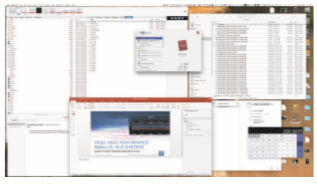
**Figure 2.4** The macOS GUI.  


user programs. From the point of view of the operating system, we do not distinguish between user programs and system programs.

## System Calls

**System calls** provide an interface to the services made available by an operat- ing system. These calls are generally available as functions written in C and C++, although certain low-level tasks (for example, tasks where hardware must be accessed directly) may have to be written using assembly-language instructions.

### Example

Before we discuss how an operating systemmakes system calls available, let’s first use an example to illustrate how system calls are used: writing a simple program to read data from one file and copy them to another file. The first input that the program will need is the names of the two files: the input file and the output file. These names can be specified in many ways, depending on the operating-system design. One approach is to pass the names of the two files as part of the command—for example, the UNIX cp command:

cp in.txt out.txt

This command copies the input file in.txt to the output file out.txt. A sec- ond approach is for the program to ask the user for the names. In an interactive system, this approach will require a sequence of system calls, first to write a prompting message on the screen and then to read from the keyboard the characters that define the two files. On mouse-based and icon-based systems, a menu of file names is usually displayed in a window. The user can then use the mouse to select the source name, and a window can be opened for the destination name to be specified. This sequence requiresmany I/O system calls.

Once the two file names have been obtained, the program must open the input file and create and open the output file. Each of these operations requires another system call. Possible error conditions for each system call must be handled. For example, when the program tries to open the input file, it may find that there is no file of that name or that the file is protected against access. In these cases, the program should output an error message (another sequence of system calls) and then terminate abnormally (another system call). If the input file exists, then we must create a new output file. We may find that there is already an output file with the same name. This situation may cause the program to abort (a system call), or we may delete the existing file (another system call) and create a new one (yet another system call). Another option, in an interactive system, is to ask the user (via a sequence of system calls to output the prompting message and to read the response from the terminal) whether to replace the existing file or to abort the program.

When both files are set up, we enter a loop that reads from the input file (a system call) and writes to the output file (another system call). Each read andwrite must return status information regarding various possible error conditions. On input, the program may find that the end of the file has been Example System-Call Sequence Acquire input file name Write prompt to screen Accept input Acquire output file name Write prompt to screen Accept input Open the input file if file doesn't exist, abort Create output file if file exists, abort Loop Read from input file Write to output file Until read fails Close output file Write completion message to screen Terminate normally

**Figure 2.5** Example of how system calls are used.

reached or that there was a hardware failure in the read (such as a parity error). The write operation may encounter various errors, depending on the output device (for example, no more available disk space).

Finally, after the entire file is copied, the program may close both files (two system calls), write a message to the console or window (more system calls), and finally terminate normally (the final system call). This system-call sequence is shown in Figure 2.5.

### Application Programming Interface

As you can see, even simple programs may make heavy use of the operat- ing system. Frequently, systems execute thousands of system calls per second. Most programmers never see this level of detail, however. Typically, applica- tion developers design programs according to an **application programming interface** (**API**). The API specifies a set of functions that are available to an appli- cation programmer, including the parameters that are passed to each function and the return values the programmer can expect. Three of the most common APIs available to application programmers are the Windows API for Windows systems, the POSIX API for POSIX-based systems (which include virtually all versions of UNIX, Linux, and macOS), and the Java API for programs that run on the Java virtualmachine. Aprogrammer accesses an API via a library of code provided by the operating system. In the case of UNIX and Linux for programs written in the C language, the library is called **libc**. Note that—unless specified —the system-call names used throughout this text are generic examples. Each operating system has its own name for each system call.

Behind the scenes, the functions that make up an API typically invoke the actual system calls on behalf of the application programmer. For example, the Windows function CreateProcess() (which, unsurprisingly, is used to create  


**_EXAMPLE OF STANDARD API_**

As an example of a standard API, consider the read() function that is avail- able in UNIX and Linux systems. The API for this function is obtained from the man page by invoking the command

man read

on the command line. A description of this API appears below:
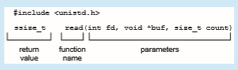
Aprogram that uses the read() functionmust include the unistd.h header file, as this file defines the ssize t and size t data types (among other things). The parameters passed to read() are as follows:

• int fd—the file descriptor to be read

• void \*buf—a buffer into which the data will be read

• size t count—the maximum number of bytes to be read into the buffer

On a successful read, the number of bytes read is returned. A return value of 0 indicates end of file. If an error occurs, read() returns −1.

a new process) actually invokes the NTCreateProcess() system call in the Windows kernel.

Why would an application programmer prefer programming according to an API rather than invoking actual system calls? There are several reasons for doing so. One benefit concerns program portability. An application program- mer designing a program using an API can expect her program to compile and run on any system that supports the sameAPI (although, in reality, architectural differences often make this more difficult than it may appear). Furthermore, actual system calls can often be more detailed and difficult to work with than the API available to an application programmer.Nevertheless, there often exists a strong correlation between a function in the API and its associated system call within the kernel. In fact, many of the POSIX and Windows APIs are similar to the native system calls provided by the UNIX, Linux, and Windows operating systems.

Another important factor in handling system calls is the **run-time envi- ronment** (**RTE**)—the full suite of software needed to execute applications writ- ten in a given programming language, including its compilers or interpreters as well as other software, such as libraries and loaders. The RTE provides a  


**Figure 2.6** The handling of a user application invoking the open() system call.

**system-call interface** that serves as the link to system calls made available by the operating system. The system-call interface intercepts function calls in the API and invokes the necessary system calls within the operating system. Typically, a number is associated with each system call, and the system-call interface maintains a table indexed according to these numbers. The system- call interface then invokes the intended system call in the operating-system kernel and returns the status of the system call.

The caller need know nothing about how the system call is implemented or what it does during execution. Rather, the caller need only obey the API and understand what the operating system will do as a result of the execution of that system call. Thus, most of the details of the operating-system interface are hidden from the programmer by the API and are managed by the RTE. The relationship among an API, the system-call interface, and the operating system is shown in Figure 2.6, which illustrates how the operating system handles a user application invoking the open() system call.

System calls occur in different ways, depending on the computer in use. Often, more information is required than simply the identity of the desired system call. The exact type and amount of information vary according to the particular operating system and call. For example, to get input, we may need to specify the file or device to use as the source, as well as the address and length of the memory buffer into which the input should be read. Of course, the device or file and length may be implicit in the call.

Three general methods are used to pass parameters to the operating sys- tem. The simplest approach is to pass the parameters in registers. In some cases, however, there may be more parameters than registers. In these cases, the parameters are generally stored in a block, or table, in memory, and the address of the block is passed as a parameter in a register (Figure 2.7). Linux uses a combination of these approaches. If there are five or fewer parameters,  


**Figure 2.7** Passing of parameters as a table.

registers are used. If there are more than five parameters, the block method is used. Parameters also can be placed, or **pushed**, onto a **stack** by the program and **popped** off the stack by the operating system. Some operating systems prefer the block or stack method because those approaches do not limit the number or length of parameters being passed.

### Types of System Calls

System calls can be grouped roughly into six major categories: **process control**, **fil management**, **device management**, **information maintenance**, **communi- cations**, and **protection**. Below, we briefly discuss the types of system calls that may be provided by an operating system. Most of these system calls support, or are supported by, concepts and functions that are discussed in later chap- ters. Figure 2.8 summarizes the types of system calls normally provided by an operating system. As mentioned, in this text, we normally refer to the system calls by generic names. Throughout the text, however, we provide examples of the actual counterparts to the system calls for UNIX, Linux, and Windows systems.

#### Process Control

A running program needs to be able to halt its execution either normally (end()) or abnormally (abort()). If a system call is made to terminate the currently running program abnormally, or if the program runs into a problem and causes an error trap, a dump of memory is sometimes taken and an error message generated. The dump is written to a special log file on disk and may be examined by a **debugger**—a system program designed to aid the programmer in finding and correcting errors, or **bugs**—to determine the cause of the problem. Under either normal or abnormal circumstances, the operating system must transfer control to the invoking command interpreter. The command interpreter then reads the next command. In an interactive system, the command interpreter simply continues with the next command; it is assumed that the user will issue an appropriate command to respond to  


• Process control

◦ create process, terminate process

◦ load, execute

◦ get process attributes, set process attributes

◦ wait event, signal event

◦ allocate and free memory

• File management ◦ create file, delete file

◦ open, close

◦ read, write, reposition

◦ get file attributes, set file attributes

• Device management ◦ request device, release device

◦ read, write, reposition

◦ get device attributes, set device attributes

◦ logically attach or detach devices

• Information maintenance ◦ get time or date, set time or date

◦ get system data, set system data

◦ get process, file, or device attributes

◦ set process, file, or device attributes

• Communications ◦ create, delete communication connection

◦ send, receive messages

◦ transfer status information

◦ attach or detach remote devices

• Protection ◦ get file permissions

◦ set file permissions

**Figure 2.8** Types of system calls.  


**_EXAMPLES OFWINDOWS AND UNIX SYSTEM CALLS_**

The following illustrates various equivalent system calls for Windows and UNIX operating systems.

any error. In a GUI system, a pop-up window might alert the user to the error and ask for guidance. Some systems may allow for special recovery actions in case an error occurs. If the program discovers an error in its input and wants to terminate abnormally, it may also want to define an error level. More severe errors can be indicated by a higher-level error parameter. It is then possible to combine normal and abnormal termination by defining a normal termination as an error at level 0. The command interpreter or a following program can use this error level to determine the next action automatically.

A process executing one program may want to load() and execute() another program. This feature allows the command interpreter to execute a program as directed by, for example, a user command or the click of a mouse. An interesting question is where to return control when the loaded program terminates. This question is related to whether the existing program is lost, saved, or allowed to continue execution concurrently with the new program.

If control returns to the existing program when the new program termi- nates, we must save the memory image of the existing program; thus, we have  


**_THE STANDARD C LIBRARY_**

The standard C library provides a portion of the system-call interface for many versions of UNIX and Linux. As an example, let’s assume a C pro- gram invokes the printf() statement. The C library intercepts this call and invokes the necessary system call (or calls) in the operating system—in this instance, the write() system call. The C library takes the value returned by write() and passes it back to the user program:


effectively created a mechanism for one program to call another program. If both programs continue concurrently, we have created a new process to be multiprogrammed. Often, there is a system call specifically for this purpose (create process()).

If we create a new process, or perhaps even a set of processes, we should be able to control its execution. This control requires the ability to determine and reset the attributes of a process, including the process’s priority, its max- imum allowable execution time, and so on (get process attributes() and set process attributes()). We may also want to terminate a process that we created (terminate process()) if we find that it is incorrect or is no longer needed.

Having created new processes, we may need to wait for them to finish their execution. We may want to wait for a certain amount of time to pass (wait time()). More probably, we will want to wait for a specific event to occur (wait event()). The processes should then signal when that event has occurred (signal event()).

Quite often, two or more processes may share data. To ensure the integrity of the data being shared, operating systems often provide system calls allowing  


**Figure 2.9** Arduino execution. (a) At system startup. (b) Running a sketch.

a process to **lock** shared data. Then, no other process can access the data until the lock is released. Typically, such system calls include acquire lock() and release lock(). System calls of these types, dealing with the coordination of concurrent processes, are discussed in great detail in Chapter 6 and Chapter 7.

There are so many facets of and variations in process control that we next use two examples—one involving a single-tasking system and the other a multitasking system—to clarify these concepts. The Arduino is a simple hardware platform consisting of a microcontroller along with input sensors that respond to a variety of events, such as changes to light, temperature, and barometric pressure, to just name a few. Towrite a program for theArduino,we first write the program on a PC and then upload the compiled program (known as a **sketch**) from the PC to the Arduino’s flash memory via a USB connection. The standardArduino platformdoes not provide an operating system; instead, a small piece of software known as a **boot loader** loads the sketch into a specific region in the Arduino’s memory (Figure 2.9). Once the sketch has been loaded, it begins running, waiting for the events that it is programmed to respond to. For example, if the Arduino’s temperature sensor detects that the temperature has exceeded a certain threshold, the sketch may have the Arduino start the motor for a fan. An Arduino is considered a single-tasking system, as only one sketch can be present in memory at a time; if another sketch is loaded, it replaces the existing sketch. Furthermore, the Arduino provides no user interface beyond hardware input sensors.

FreeBSD (derived from Berkeley UNIX) is an example of a multitasking system. When a user logs on to the system, the shell of the user’s choice is run, awaiting commands and running programs the user requests. However, since FreeBSD is a multitasking system, the command interpreter may continue running while another program is executed (Figure 2.10). To start a new pro- cess, the shell executes a fork() system call. Then, the selected program is loaded into memory via an exec() system call, and the program is executed. Depending on how the commandwas issued, the shell then eitherwaits for the process to finish or runs the process “in the background.” In the latter case, the shell immediately waits for another command to be entered.When a process is running in the background, it cannot receive input directly from the keyboard, because the shell is using this resource. I/O is therefore done through files or through a GUI interface. Meanwhile, the user is free to ask the shell to run other programs, to monitor the progress of the running process, to change that program’s priority, and so on. When the process is done, it executes an exit()  


**Figure 2.10** FreeBSD running multiple programs.

system call to terminate, returning to the invoking process a status code of 0 or a nonzero error code. This status or error code is then available to the shell or other programs. Processes are discussed in Chapter 3 with a program example using the fork() and exec() system calls.

#### File Management

The file system is discussed in more detail in Chapter 13 through Chapter 15. Here, we identify several common system calls dealing with files.

We first need to be able to create() and delete() files. Either system call requires the name of the file and perhaps some of the file’s attributes. Once the file is created, we need to open() it and to use it. We may also read(), write(), or reposition() (rewind or skip to the end of the file, for example). Finally, we need to close() the file, indicating that we are no longer using it.

We may need these same sets of operations for directories if we have a directory structure for organizing files in the file system. In addition, for either files or directories, we need to be able to determine the values of various attributes and perhaps to set them if necessary. File attributes include the file name, file type, protection codes, accounting information, and so on. At least two system calls, get file attributes() and set file attributes(), are required for this function. Some operating systems provide many more calls, such as calls for file move() and copy(). Others might provide an API that performs those operations using code and other system calls, and others might provide system programs to perform the tasks. If the system programs are callable by other programs, then each can be considered an API by other system programs.

#### Device Management

Aprocess may need several resources to execute—main memory, disk drives, access to files, and so on. If the resources are available, they can be granted, and control can be returned to the user process. Otherwise, the process will have to wait until sufficient resources are available.  
The various resources controlled by the operating system can be thought of as devices. Some of these devices are physical devices (for example, disk drives), while others can be thought of as abstract or virtual devices (for example, files). Asystemwithmultiple usersmay require us to first request() a device, to ensure exclusive use of it. After we are finished with the device, we release() it. These functions are similar to the open() and close() system calls for files. Other operating systems allow unmanaged access to devices. The hazard then is the potential for device contention and perhaps deadlock,which are described in Chapter 8.

Once the device has been requested (and allocated to us), we can read(), write(), and (possibly) reposition() the device, just as we can with files. In fact, the similarity between I/O devices and files is so great thatmany operating systems, including UNIX, merge the two into a combined file–device structure. In this case, a set of system calls is used on both files and devices. Sometimes, I/O devices are identified by special file names, directory placement, or file attributes.

The user interface can alsomake files and devices appear to be similar, even though the underlying system calls are dissimilar. This is another example of the many design decisions that go into building an operating system and user interface.

#### Information Maintenance

Many system calls exist simply for the purpose of transferring information between the user program and the operating system. For example, most sys- tems have a system call to return the current time() and date(). Other system calls may return information about the system, such as the version number of the operating system, the amount of free memory or disk space, and so on.

Another set of system calls is helpful in debugging a program. Many systems provide system calls to dump() memory. This provision is useful for debugging. The program strace, which is available on Linux systems, lists each system call as it is executed. Even microprocessors provide a CPU mode, known as **single step**, in which a trap is executed by the CPU after every instruction. The trap is usually caught by a debugger.

Many operating systems provide a time profile of a program to indicate the amount of time that the program executes at a particular location or set of locations. A time profile requires either a tracing facility or regular timer interrupts. At every occurrence of the timer interrupt, the value of the program counter is recorded. With sufficiently frequent timer interrupts, a statistical picture of the time spent on various parts of the program can be obtained.

In addition, the operating system keeps information about all its processes, and system calls are used to access this information. Generally, calls are also used to get and set the process information (get process attributes() and set process attributes()). In Section 3.1.3, we discuss what information is normally kept.

#### Communication

There are two common models of interprocess communication: the message- passingmodel and the shared-memorymodel. In the **message-passing model**, the communicating processes exchange messages with one another to transfer information. Messages can be exchanged between the processes either directly or indirectly through a common mailbox. Before communication can take place, a connection must be opened. The name of the other communica- tor must be known, be it another process on the same system or a process on another computer connected by a communications network. Each computer in a network has a **host name** by which it is commonly known. A host also has a network identifier, such as an IP address. Similarly, each process has a **process name**, and this name is translated into an identifier by which the operating system can refer to the process. The get hostid() and get processid() system calls do this translation. The identifiers are then passed to the general- purpose open() and close() calls provided by the file system or to specific open connection() and close connection() system calls, depending on the system’s model of communication. The recipient process usually must give its permission for communication to take placewith an accept connection() call. Most processes that will be receiving connections are special-purpose **dae- mons**, which are system programs provided for that purpose. They execute a wait for connection() call and are awakened when a connection is made. The source of the communication, known as the **client**, and the receiving dae- mon, known as a **server**, then exchange messages by using read message() and write message() system calls. The close connection() call terminates the communication.

In the **shared-memory model**, processes use shared memory create() and shared memory attach() system calls to create and gain access to regions of memory owned by other processes. Recall that, normally, the operating system tries to prevent one process from accessing another process’s memory. Shared memory requires that two or more processes agree to remove this restriction. They can then exchange information by reading and writing data in the shared areas. The form of the data is determined by the processes and is not under the operating system’s control. The processes are also responsible for ensuring that they are notwriting to the same location simultaneously. Such mechanisms are discussed in Chapter 6. In Chapter 4, we look at a variation of the process scheme—threads—in which some memory is shared by default.

Both of the models just discussed are common in operating systems, and most systems implement both. Message passing is useful for exchanging smaller amounts of data, because no conflicts need be avoided. It is also eas- ier to implement than is shared memory for intercomputer communication. Shared memory allows maximum speed and convenience of communication, since it can be done at memory transfer speeds when it takes place within a computer. Problems exist, however, in the areas of protection and synchroniza- tion between the processes sharing memory.

#### Protection

Protection provides a mechanism for controlling access to the resources pro- vided by a computer system. Historically, protection was a concern only on multiprogrammed computer systems with several users. However, with the advent of networking and the Internet, all computer systems, from servers to mobile handheld devices, must be concerned with protection.

Typically, system calls providing protection include set permission() and get permission(), which manipulate the permission settings of  


resources such as files and disks. The allow user() and deny user() system calls specify whether particular users can—or cannot—be allowed access to certain resources. We cover protection in Chapter 17 and the much larger issue of security—which involves using protection against external threats— in Chapter 16.

## System Services

Another aspect of a modern system is its collection of system services. Recall Figure 1.1, which depicted the logical computer hierarchy. At the lowest level is hardware. Next is the operating system, then the system services, and finally the application programs. **System services**, also known as **system utilities**, provide a convenient environment for program development and execution. Some of them are simply user interfaces to system calls. Others are consider- ably more complex. They can be divided into these categories:

• **File management**. These programs create, delete, copy, rename, print, list, and generally access and manipulate files and directories.

• **Status information**. Some programs simply ask the system for the date, time, amount of available memory or disk space, number of users, or similar status information. Others are more complex, providing detailed performance, logging, and debugging information. Typically, these pro- grams format and print the output to the terminal or other output devices or files or display it in a window of the GUI. Some systems also support a **registry**, which is used to store and retrieve configuration information.

• **File modificatio** . Several text editorsmay be available to create andmod- ify the content of files stored on disk or other storage devices. There may also be special commands to search contents of files or perform transfor- mations of the text.

• **Programming-language support**. Compilers, assemblers, debuggers, and interpreters for common programming languages (such as C, C++, Java, and Python) are often provided with the operating system or available as a separate download.

• **Program loading and execution**. Once a program is assembled or com- piled, it must be loaded into memory to be executed. The system may provide absolute loaders, relocatable loaders, linkage editors, and overlay loaders. Debugging systems for either higher-level languages or machine language are needed as well.

• **Communications**. These programs provide the mechanism for creating virtual connections among processes, users, and computer systems. They allow users to send messages to one another’s screens, to browse web pages, to send e-mail messages, to log in remotely, or to transfer files from one machine to another.

• **Background services**. All general-purpose systems have methods for launching certain system-program processes at boot time. Some of these processes terminate after completing their tasks, while others continue to run until the system is halted. Constantly running system-program pro- cesses are known as **services**, **subsystems**, or daemons. One example is the network daemon discussed in Section 2.3.3.5. In that example, a sys- tem needed a service to listen for network connections in order to connect those requests to the correct processes. Other examples include process schedulers that start processes according to a specified schedule, system error monitoring services, and print servers. Typical systems have dozens of daemons. In addition, operating systems that run important activities in user context rather than in kernel context may use daemons to run these activities.

Along with system programs, most operating systems are supplied with programs that are useful in solving common problems or performing common operations. Such **application programs** include web browsers, word proces- sors and text formatters, spreadsheets, database systems, compilers, plotting and statistical-analysis packages, and games.

The view of the operating system seen by most users is defined by the application and system programs, rather than by the actual system calls. Con- sider a user’s PC. When a user’s computer is running the macOS operating system, the user might see the GUI, featuring a mouse-and-windows interface. Alternatively, or even in one of the windows, the user might have a command- line UNIX shell. Both use the same set of system calls, but the system calls look different and act in different ways. Further confusing the user view, consider the user dual-booting from macOS into Windows. Now the same user on the same hardware has two entirely different interfaces and two sets of applica- tions using the same physical resources. On the same hardware, then, a user can be exposed to multiple user interfaces sequentially or concurrently.

## Linkers and Loaders

Usually, a program resides on disk as a binary executable file—for example, a.out or prog.exe. To run on a CPU, the programmust be brought into mem- ory and placed in the context of a process. In this section, we describe the steps in this procedure, from compiling a program to placing it in memory, where it becomes eligible to run on an available CPU core. The steps are highlighted in Figure 2.11.

Source files are compiled into object files that are designed to be loaded into any physical memory location, a format known as an **relocatable object fil** . Next, the **linker** combines these relocatable object files into a single binary **executable** file. During the linking phase, other object files or libraries may be included aswell, such as the standard C ormath library (specifiedwith the flag -lm).

A **loader** is used to load the binary executable file into memory, where it is eligible to run on a CPU core. An activity associated with linking and loading is **relocation**, which assigns final addresses to the program parts and adjusts code and data in the program tomatch those addresses so that, for example, the code can call library functions and access its variables as it executes. In Figure 2.11, we see that to run the loader, all that is necessary is to enter the name of the executable file on the command line. When a program name is entered on the  

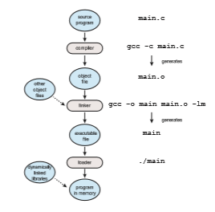
**Figure 2.11** The role of the linker and loader.

command line on UNIX systems—for example, ./main—the shell first creates a new process to run the program using the fork() system call. The shell then invokes the loader with the exec() system call, passing exec() the name of the executable file. The loader then loads the specified program into memory using the address space of the newly created process. (When a GUI interface is used, double-clicking on the icon associated with the executable file invokes the loader using a similar mechanism.)

The process described thus far assumes that all libraries are linked into the executable file and loaded into memory. In reality, most systems allow a program to dynamically link libraries as the program is loaded. Windows, for instance, supports dynamically linked libraries (**DLLs**). The benefit of this approach is that it avoids linking and loading libraries that may end up not being used into an executable file. Instead, the library is conditionally linked and is loaded if it is required during program run time. For example, in Figure 2.11, the math library is not linked into the executable file main. Rather, the linker inserts relocation information that allows it to be dynamically linked and loaded as the program is loaded. We shall see in Chapter 9 that it is possible for multiple processes to share dynamically linked libraries, resulting in a significant savings in memory use.

Object files and executable files typically have standard formats that include the compiled machine code and a symbol table containing metadata about functions and variables that are referenced in the program. For UNIX and Linux systems, this standard format is known as ELF (for **Executable and Linkable Format**). There are separate ELF formats for relocatable and  


**_ELF FORMAT_**

Linux provides various commands to identify and evaluate ELF files. For example, the file command determines a file type. If main.o is an object file, and main is an executable file, the command

file main.o

will report that main.o is an ELF relocatable file, while the command

file main

will report that main is an ELF executable. ELF files are divided into a number of sections and can be evaluated using the readelf command.

executable files. One piece of information in the ELF file for executable files is the program’s **_entry point,_** which contains the address of the first instruction to be executed when the program runs. Windows systems use the **Portable Executable** (PE) format, and macOS uses the **Mach-O** format.

## Why Applications Are Operating-System Specific

Fundamentally, applications compiled on one operating system are not exe- cutable on other operating systems. If they were, the world would be a better place, and our choice of what operating system to use would depend on utility and features rather than which applications were available.

Based on our earlier discussion, we can now see part of the problem—each operating system provides a unique set of system calls. System calls are part of the set of services provided by operating systems for use by applications. Even if system calls were somehow uniform, other barriers would make it difficult for us to execute application programs on different operating systems. But if you have used multiple operating systems, you may have used some of the same applications on them. How is that possible?

An application can bemade available to run onmultiple operating systems in one of three ways:

**1\.** The application can bewritten in an interpreted language (such as Python or Ruby) that has an interpreter available for multiple operating systems. The interpreter reads each line of the source program, executes equivalent instructions on the native instruction set, and calls native operating sys- tem calls. Performance suffers relative to that for native applications, and the interpreter provides only a subset of each operating system’s features, possibly limiting the feature sets of the associated applications.

**2\.** The application can be written in a language that includes a virtual machine containing the running application. The virtual machine is part of the language’s full RTE. One example of thismethod is Java. Java has an RTE that includes a loader, byte-code verifier, and other components that load the Java application into the Java virtual machine. This RTE has been  


**ported**, or developed, for many operating systems, from mainframes to smartphones, and in theory any Java app can runwithin the RTEwherever it is available. Systems of this kind have disadvantages similar to those of interpreters, discussed above.

**3\.** The application developer can use a standard language or API in which the compiler generates binaries in a machine- and operating-system- specific language. The application must be ported to each operating sys- tem on which it will run. This porting can be quite time consuming and must be done for each new version of the application, with subsequent testing and debugging. Perhaps the best-known example is the POSIX API and its set of standards for maintaining source-code compatibility between different variants of UNIX-like operating systems.

In theory, these three approaches seemingly provide simple solutions for developing applications that can run across different operating systems. How- ever, the general lack of application mobility has several causes, all of which still make developing cross-platform applications a challenging task. At the application level, the libraries providedwith the operating system contain APIs to provide features like GUI interfaces, and an application designed to call one set of APIs (say, those available from iOS on the Apple iPhone) will not work on an operating system that does not provide those APIs (such as Android). Other challenges exist at lower levels in the system, including the following.

• Each operating system has a binary format for applications that dictates the layout of the header, instructions, and variables. Those components need to be at certain locations in specified structures within an executable file so the operating system can open the file and load the application for proper execution.

• CPUs have varying instruction sets, and only applications containing the appropriate instructions can execute correctly.

• Operating systems provide system calls that allow applications to request various activities, such as creating files and opening network connec- tions. Those system calls vary among operating systems in many respects, including the specific operands and operand ordering used, how an appli- cation invokes the system calls, their numbering and number, their mean- ings, and their return of results.

There are some approaches that have helped address, though not com- pletely solve, these architectural differences. For example, Linux—and almost every UNIX system—has adopted the ELF format for binary executable files. Although ELF provides a common standard across Linux and UNIX systems, the ELF format is not tied to any specific computer architecture, so it does not guarantee that an executable file will run across different hardware platforms.

APIs, as mentioned above, specify certain functions at the application level. At the architecture level, an **application binary interface** (ABI) is used to define how different components of binary code can interface for a given operating system on a given architecture. An ABI specifies low-level details, including addresswidth,methods of passing parameters to system calls, the organization of the run-time stack, the binary format of system libraries, and the size of data types, just to name a few. Typically, an ABI is specified for a given architecture (for example, there is an ABI for the ARMv8 processor). Thus, an ABI is the architecture-level equivalent of an API. If a binary executable file has been compiled and linked according to a particular ABI, it should be able to run on different systems that support that ABI. However, because a particular ABI is defined for a certain operating system running on a given architecture, ABIs do little to provide cross-platform compatibility.

In sum, all of these differences mean that unless an interpreter, RTE, or binary executable file iswritten for and compiled on a specific operating system on a specific CPU type (such as Intel x86 or ARMv8), the application will fail to run. Imagine the amount of work that is required for a program such as the Firefox browser to run on Windows, macOS, various Linux releases, iOS, and Android, sometimes on various CPU architectures.

## Operating-System Design and Implementation

In this section, we discuss problemswe face in designing and implementing an operating system. There are, of course, no complete solutions to such problems, but there are approaches that have proved successful.

### Design Goals

The first problem in designing a system is to define goals and specifications. At the highest level, the design of the systemwill be affected by the choice of hard- ware and the type of system: traditional desktop/laptop, mobile, distributed, or real time.

Beyond this highest design level, the requirements may be much harder to specify. The requirements can, however, be divided into two basic groups: **user goals** and **system goals**.

Users want certain obvious properties in a system. The system should be convenient to use, easy to learn and to use, reliable, safe, and fast. Of course, these specifications are not particularly useful in the system design, since there is no general agreement on how to achieve them.

A similar set of requirements can be defined by the developers who must design, create, maintain, and operate the system. The system should be easy to design, implement, and maintain; and it should be flexible, reliable, error free, and efficient. Again, these requirements are vague and may be interpreted in various ways.

There is, in short, no unique solution to the problemof defining the require- ments for an operating system. The wide range of systems in existence shows that different requirements can result in a large variety of solutions for different environments. For example, the requirements for Wind River VxWorks, a real- time operating system for embedded systems, must have been substantially different from those for Windows Server, a large multiaccess operating system designed for enterprise applications.

Specifying and designing an operating system is a highly creative task. Although no textbook can tell you how to do it, general principles have been developed in the field of **software engineering**, and we turn now to a discus- sion of some of these principles.

### Mechanisms and Policies

One important principle is the separation of **policy** from **mechanism**. Mecha- nisms determine **_how_** to do something; policies determine **_what_** will be done. For example, the timer construct (see Section 1.4.3) is amechanism for ensuring CPU protection, but deciding how long the timer is to be set for a particular user is a policy decision.

The separation of policy andmechanism is important for flexibility. Policies are likely to change across places or over time. In the worst case, each change in policy would require a change in the underlying mechanism. A general mechanism flexible enough to work across a range of policies is preferable. A change in policy would then require redefinition of only certain parameters of the system. For instance, consider a mechanism for giving priority to certain types of programs over others. If the mechanism is properly separated from policy, it can be used either to support a policy decision that I/O-intensive programs should have priority over CPU-intensive ones or to support the opposite policy.

Microkernel-based operating systems (discussed in Section 2.8.3) take the separation of mechanism and policy to one extreme by implementing a basic set of primitive building blocks. These blocks are almost policy free, allowing more advanced mechanisms and policies to be added via user-created kernel modules or user programs themselves. In contrast, consider Windows, an enormously popular commercial operating system available for over three decades. Microsoft has closely encoded both mechanism and policy into the system to enforce a global look and feel across all devices that run theWindows operating system.All applications have similar interfaces, because the interface itself is built into the kernel and system libraries. Apple has adopted a similar strategy with its macOS and iOS operating systems.

We can make a similar comparison between commercial and open-source operating systems. For instance, contrast Windows, discussed above, with Linux, an open-source operating system that runs on a wide range of com- puting devices and has been available for over 25 years. The “standard” Linux kernel has a specific CPU scheduling algorithm (covered in Section 5.7.1), which is a mechanism that supports a certain policy. However, anyone is free to modify or replace the scheduler to support a different policy.

Policy decisions are important for all resource allocation. Whenever it is necessary to decidewhether or not to allocate a resource, a policy decisionmust be made. Whenever the question is **_how_** rather than **_what_**, it is a mechanism that must be determined.

### Implementation

Once an operating system is designed, it must be implemented. Because oper- ating systems are collections of many programs, written by many people over a long period of time, it is difficult to make general statements about how they are implemented.

Early operating systems were written in assembly language. Now, most are written in higher-level languages such as C or C++, with small amounts of the system written in assembly language. In fact, more than one higher- level language is often used. The lowest levels of the kernel might be written in assembly language and C. Higher-level routines might be written in C and C++, and system libraries might be written in C++ or even higher-level lan- guages. Android provides a nice example: its kernel is writtenmostly in Cwith some assembly language. Most Android system libraries are written in C or C++, and its application frameworks—which provide the developer interface to the system—are written mostly in Java. We cover Android’s architecture in more detail in Section 2.8.5.2.

The advantages of using a higher-level language, or at least a systems- implementation language, for implementing operating systems are the same as those gained when the language is used for application programs: the code can be written faster, is more compact, and is easier to understand and debug. In addition, improvements in compiler technology will improve the gener- ated code for the entire operating system by simple recompilation. Finally, an operating system is far easier to port to other hardware if it is written in a higher-level language. This is particularly important for operating systems that are intended to run on several different hardware systems, such as small embedded devices, Intel x86 systems, and ARM chips running on phones and tablets.

The only possible disadvantages of implementing an operating system in a higher-level language are reduced speed and increased storage requirements. This, however, is not a major issue in today’s systems. Although an expert assembly-language programmer can produce efficient small routines, for large programs amodern compiler can perform complex analysis and apply sophis- ticated optimizations that produce excellent code. Modern processors have deep pipelining and multiple functional units that can handle the details of complex dependencies much more easily than can the human mind.

As is true in other systems, major performance improvements in operating systems aremore likely to be the result of better data structures and algorithms than of excellent assembly-language code. In addition, although operating sys- tems are large, only a small amount of the code is critical to high performance; the interrupt handlers, I/O manager, memory manager, and CPU scheduler are probably the most critical routines. After the system is written and is working correctly, bottlenecks can be identified and can be refactored to operate more efficiently.

## Operating-System Structure

A system as large and complex as a modern operating system must be engi- neered carefully if it is to function properly and be modified easily. A common approach is to partition the task into small components, or modules, rather than have one single system. Each of these modules should be a well-defined portion of the system,with carefully defined interfaces and functions. Youmay use a similar approach when you structure your programs: rather than placing all of your code in the main() function, you instead separate logic into a num- ber of functions, clearly articulate parameters and return values, and then call those functions from main().  


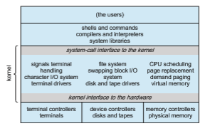
**Figure 2.12** Traditional UNIX system structure.

We briefly discussed the common components of operating systems in Chapter 1. In this section,we discuss how these components are interconnected and melded into a kernel.

### Monolithic Structure

The simplest structure for organizing an operating system is no structure at all. That is, place all of the functionality of the kernel into a single, static binary file that runs in a single address space. This approach—known as a **monolithic** structure—is a common technique for designing operating systems.

An example of such limited structuring is the original UNIX operating system, which consists of two separable parts: the kernel and the system programs. The kernel is further separated into a series of interfaces and device drivers, which have been added and expanded over the years as UNIX has evolved. We can view the traditional UNIX operating system as being layered to some extent, as shown in Figure 2.12. Everything below the system-call interface and above the physical hardware is the kernel. The kernel provides the file system, CPU scheduling, memory management, and other operating- system functions through system calls. Taken in sum, that is an enormous amount of functionality to be combined into one single address space.

The Linux operating system is based on UNIX and is structured similarly, as shown in Figure 2.13. Applications typically use the glibc standard C library when communicating with the system call interface to the kernel. The Linux kernel is monolithic in that it runs entirely in kernel mode in a single address space, but as we shall see in Section 2.8.4, it does have a modular design that allows the kernel to be modified during run time.

Despite the apparent simplicity of monolithic kernels, they are difficult to implement and extend. Monolithic kernels do have a distinct performance advantage, however: there is very little overhead in the system-call interface, and communication within the kernel is fast. Therefore, despite the drawbacks  


**Figure 2.13** Linux system structure.

of monolithic kernels, their speed and efficiency explains why we still see evidence of this structure in the UNIX, Linux, andWindows operating systems.

### Layered Approach

The monolithic approach is often known as a **tightly coupled** system because changes to one part of the system can have wide-ranging effects on other parts. Alternatively, we could design a **loosely coupled** system. Such a system is divided into separate, smaller components that have specific and limited func- tionality. All these components together comprise the kernel. The advantage of this modular approach is that changes in one component affect only that component, and no others, allowing system implementers more freedom in creating and changing the inner workings of the system.

A system can be made modular in many ways. One method is the **layered approach**, in which the operating system is broken into a number of layers (levels). The bottom layer (layer 0) is the hardware; the highest (layer _N_) is the user interface. This layering structure is depicted in Figure 2.14.

An operating-system layer is an implementation of an abstract object made up of data and the operations that can manipulate those data. A typical operating-system layer—say, layer _M_—consists of data structures and a set of functions that can be invoked by higher-level layers. Layer _M,_ in turn, can invoke operations on lower-level layers.

The main advantage of the layered approach is simplicity of construction and debugging. The layers are selected so that each uses functions (operations)  


**Figure 2.14** A layered operating system.

and services of only lower-level layers. This approach simplifies debugging and system verification. The first layer can be debugged without any concern for the rest of the system, because, by definition, it uses only the basic hardware (which is assumed correct) to implement its functions. Once the first layer is debugged, its correct functioning can be assumed while the second layer is debugged, and so on. If an error is found during the debugging of a particular layer, the error must be on that layer, because the layers below it are already debugged. Thus, the design and implementation of the system are simplified.

Each layer is implemented only with operations provided by lower-level layers. A layer does not need to know how these operations are implemented; it needs to know only what these operations do. Hence, each layer hides the existence of certain data structures, operations, and hardware from higher- level layers.

Layered systems have been successfully used in computer networks (such as TCP/IP) and web applications. Nevertheless, relatively few operating sys- tems use a pure layered approach. One reason involves the challenges of appropriately defining the functionality of each layer. In addition, the overall performance of such systems is poor due to the overhead of requiring a user program to traverse throughmultiple layers to obtain an operating-system ser- vice. **_Some_** layering is common in contemporary operating systems, however. Generally, these systems have fewer layers with more functionality, providing most of the advantages of modularized code while avoiding the problems of layer definition and interaction.

### Microkernels

We have already seen that the original UNIX system had a monolithic struc- ture. As UNIX expanded, the kernel became large and difficult to manage. In the mid-1980s, researchers at Carnegie Mellon University developed an operating system called **Mach** that modularized the kernel using the **micro- kernel** approach. This method structures the operating system by removing  
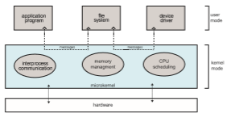
**Figure 2.15** Architecture of a typical microkernel.

all nonessential components from the kernel and implementing them as user- level programs that reside in separate address spaces. The result is a smaller kernel. There is little consensus regarding which services should remain in the kernel and which should be implemented in user space. Typically, however, microkernels provide minimal process and memory management, in addition to a communication facility. Figure 2.15 illustrates the architecture of a typical microkernel.

The main function of the microkernel is to provide communication between the client program and the various services that are also running in user space. Communication is provided through message passing, which was described in Section 2.3.3.5. For example, if the client programwishes to access a file, it must interact with the file server. The client program and service never interact directly. Rather, they communicate indirectly by exchanging messages with the microkernel.

One benefit of the microkernel approach is that it makes extending the operating system easier. All new services are added to user space and conse- quently do not requiremodification of the kernel.When the kernel does have to be modified, the changes tend to be fewer, because the microkernel is a smaller kernel. The resulting operating system is easier to port from one hardware design to another. The microkernel also provides more security and reliability, since most services are running as user—rather than kernel—processes. If a service fails, the rest of the operating system remains untouched.

Perhaps the best-known illustration of a microkernel operating system is **_Darwin_**, the kernel component of the macOS and iOS operating systems. Darwin, in fact, consists of two kernels, one of which is the Mach microkernel. We will cover the macOS and iOS systems in further detail in Section 2.8.5.1.

Another example is QNX, a real-time operating system for embedded sys- tems. The QNX Neutrino microkernel provides services for message passing and process scheduling. It also handles low-level network communication and hardware interrupts. All other services in QNX are provided by standard pro- cesses that run outside the kernel in user mode.

Unfortunately, the performance ofmicrokernels can suffer due to increased system-function overhead. When two user-level services must communicate, messages must be copied between the services, which reside in separate address spaces. In addition, the operating system may have to switch from one process to the next to exchange the messages. The overhead involved in copying messages and switching between processes has been the largest impediment to the growth of microkernel-based operating systems. Consider the history of Windows NT: The first release had a layered microkernel organi- zation. This version’s performance was low compared with that of Windows 95. Windows NT 4.0 partially corrected the performance problem by moving layers from user space to kernel space and integrating them more closely. By the time Windows XP was designed, Windows architecture had become more monolithic than microkernel. Section 2.8.5.1 will describe how macOS addresses the performance issues of the Mach microkernel.

### Modules

Perhaps the best current methodology for operating-system design involves using **loadable kernel modules** (**LKMs**). Here, the kernel has a set of core components and can link in additional services viamodules, either at boot time or during run time. This type of design is common inmodern implementations of UNIX, such as Linux, macOS, and Solaris, as well as Windows.

The idea of the design is for the kernel to provide core services, while other services are implemented dynamically, as the kernel is running. Linking services dynamically is preferable to adding new features directly to the kernel, which would require recompiling the kernel every time a change was made. Thus, for example, we might build CPU scheduling and memory management algorithms directly into the kernel and then add support for different file systems by way of loadable modules.

The overall result resembles a layered system in that each kernel section has defined, protected interfaces; but it is more flexible than a layered system, because any module can call any other module. The approach is also similar to the microkernel approach in that the primary module has only core functions and knowledge of how to load and communicate with other modules; but it is more efficient, because modules do not need to invoke message passing in order to communicate.

Linux uses loadable kernel modules, primarily for supporting device drivers and file systems. LKMs can be “inserted” into the kernel as the sys- tem is started (or **_booted_**) or during run time, such as when a USB device is plugged into a running machine. If the Linux kernel does not have the nec- essary driver, it can be dynamically loaded. LKMs can be removed from the kernel during run time as well. For Linux, LKMs allow a dynamic andmodular kernel, while maintaining the performance benefits of a monolithic system.We cover creating LKMs in Linux in several programming exercises at the end of this chapter.

### Hybrid Systems

In practice, very few operating systems adopt a single, strictly defined struc- ture. Instead, they combine different structures, resulting in hybrid systems that address performance, security, and usability issues. For example, Linux is monolithic, because having the operating system in a single address space provides very efficient performance. However, it also modular, so that new functionality can be dynamically added to the kernel. Windows is largely monolithic as well (again primarily for performance reasons), but it retains some behavior typical of microkernel systems, including providing support for separate subsystems (known as operating-system **_personalities_**) that run as user-mode processes. Windows systems also provide support for dynamically loadable kernel modules. We provide case studies of Linux and Windows 10 in Chapter 20 and Chapter 21, respectively. In the remainder of this section, we explore the structure of three hybrid systems: the Apple macOS operat- ing system and the two most prominent mobile operating systems—iOS and Android.

#### macOS and iOS

Apple’s macOS operating system is designed to run primarily on desktop and laptop computer systems, whereas iOS is a mobile operating system designed for the iPhone smartphone and iPad tablet computer. Architecturally, macOS and iOS have much in common, and so we present them together, highlighting what they share as well as how they differ from each other. The general archi- tecture of these two systems is shown in Figure 2.16. Highlights of the various layers include the following:

• **User experience layer**. This layer defines the software interface that allows users to interact with the computing devices. macOS uses the **_Aqua_** user interface, which is designed for a mouse or trackpad, whereas iOS uses the **_Springboard_** user interface, which is designed for touch devices.

• **Application frameworks layer**. This layer includes the **_Cocoa_** and **_Cocoa Touch_** frameworks, which provide an API for the Objective-C and Swift programming languages. The primary difference between Cocoa and Cocoa Touch is that the former is used for developingmacOS applications, and the latter by iOS to provide support for hardware features unique to mobile devices, such as touch screens.

• **Core frameworks**. This layer defines frameworks that support graphics and media including, Quicktime and OpenGL.
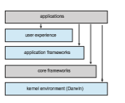
**Figure 2.16** Architecture of Apple’s macOS and iOS operating systems.  


• **Kernel environment**. This environment, also known as **Darwin**, includes the Mach microkernel and the BSD UNIX kernel. We will elaborate on Darwin shortly.

As shown in Figure 2.16, applications can be designed to take advantage of user-experience features or to bypass them and interact directly with either the application framework or the core framework. Additionally, an application can forego frameworks entirely and communicate directly with the kernel environment. (An example of this latter situation is a C program written with no user interface that makes POSIX system calls.)

Some significant distinctions between macOS and iOS include the follow- ing:

• Because macOS is intended for desktop and laptop computer systems, it is compiled to run on Intel architectures. iOS is designed for mobile devices and thus is compiled for ARM-based architectures. Similarly, the iOS ker- nel has been modified somewhat to address specific features and needs of mobile systems, such as power management and aggressive memory management. Additionally, iOS has more stringent security settings than macOS.

• The iOS operating system is generally much more restricted to developers than macOS and may even be closed to developers. For example, iOS restricts access to POSIX and BSD APIs on iOS, whereas they are openly available to developers on macOS.

We now focus on Darwin, which uses a hybrid structure. Darwin is a layered system that consists primarily of the Mach microkernel and the BSD UNIX kernel. Darwin’s structure is shown in Figure 2.17.

Whereas most operating systems provide a single system-call interface to the kernel—such as through the standardC library on UNIX and Linux systems —Darwin provides **_two_** system-call interfaces: Mach system calls (known as

**Figure 2.17** The structure of Darwin.  

**traps**) and BSD system calls (which provide POSIX functionality). The interface to these system calls is a rich set of libraries that includes not only the standard C library but also libraries that provide networking, security, and progamming language support (to name just a few).

Beneath the system-call interface, Mach provides fundamental operating- system services, including memory management, CPU scheduling, and inter- process communication (IPC) facilities such as message passing and remote procedure calls (RPCs).Much of the functionality providedbyMach is available through **kernel abstractions**, which include tasks (a Mach process), threads, memory objects, and ports (used for IPC). As an example, an application may create a new process using the BSD POSIX fork() system call. Mach will, in turn, use a task kernel abstraction to represent the process in the kernel.

In addition to Mach and BSD, the kernel environment provides an I/O kit for development of device drivers and dynamically loadable modules (which macOS refers to as **kernel extensions**, or **kexts**).

In Section 2.8.3, we described how the overhead of message passing betweendifferent services running in user space compromises the performance of microkernels. To address such performance problems, Darwin combines Mach, BSD, the I/O kit, and any kernel extensions into a single address space. Thus, Mach is not a pure microkernel in the sense that various subsystems run in user space. Message passing within Mach still does occur, but no copying is necessary, as the services have access to the same address space.

Apple has released the Darwin operating system as open source. As a result, various projects have added extra functionality toDarwin, such as the X- 11 windowing system and support for additional file systems. Unlike Darwin, however, the Cocoa interface, as well as other proprietary Apple frameworks available for developing macOS applications, are closed.

#### Android

The Android operating system was designed by the Open Handset Alliance (led primarily by Google) and was developed for Android smartphones and tablet computers. Whereas iOS is designed to run on Apple mobile devices and is close-sourced, Android runs on a variety of mobile platforms and is open- sourced, partly explaining its rapid rise in popularity. The structure of Android appears in Figure 2.18.

Android is similar to iOS in that it is a layered stack of software that provides a rich set of frameworks supporting graphics, audio, and hardware features. These features, in turn, provide a platform for developing mobile applications that run on a multitude of Android-enabled devices.

Software designers for Android devices develop applications in the Java language, but they do not generally use the standard Java API. Google has designed a separate Android API for Java development. Java applications are compiled into a form that can execute on the Android RunTime ART, a virtual machine designed for Android and optimized for mobile devices with limited memory and CPU processing capabilities. Java programs are first compiled to a Java bytecode .class file and then translated into an executable .dex file. Whereas many Java virtual machines perform just-in-time (JIT) compilation to improve application efficiency, ART performs **ahead-of-time** (**AOT**) compila-  


**Figure 2.18** Architecture of Google’s Android.

tion. Here, .dex files are compiled into native machine code when they are installed on a device, from which they can execute on the ART. AOT compi- lation allows more efficient application execution as well as reduced power consumption, features that are crucial for mobile systems.

Android developers can also write Java programs that use the Java native interface—or JNI—which allows developers to bypass the virtual machine and instead write Java programs that can access specific hardware features. Programs written using JNI are generally not portable from one hardware device to another.

The set of native libraries available for Android applications includes frameworks for developing web browsers (webkit), database support (SQLite), and network support, such as secure sockets (SSLs).

Because Android can run on an almost unlimited number of hardware devices, Google has chosen to abstract the physical hardware through the hard- ware abstraction layer, or HAL. By abstracting all hardware, such as the camera, GPS chip, and other sensors, the HAL provides applications with a consistent view independent of specific hardware. This feature, of course, allows devel- opers to write programs that are portable across different hardware platforms.

The standardC library used by Linux systems is the GNUC library (glibc). Google instead developed the **Bionic** standard C library for Android. Not only does Bionic have a smaller memory footprint than glibc, but it also has been designed for the slower CPUs that characterize mobile devices. (In addition, Bionic allows Google to bypass GPL licensing of glibc.)  


At the bottom of Android’s software stack is the Linux kernel. Google has modified the Linux kernel used in Android in a variety of areas to support the special needs of mobile systems, such as power management. It has also made changes in memory management and allocation and has added a new form of IPC known as **_Binder_** (which we will cover in Section 3.8.2.1).

**_WINDOWS SUBSYSTEM FOR LINUX_**

Windows uses a hybrid architecture that provides subsystems to emu- late different operating-system environments. These user-mode subsystems communicate with the Windows kernel to provide actual services. Windows 10 adds a Windows subsystem for Linux (**WSL**), which allows native Linux applications (specified as ELF binaries) to run on Windows 10. The typical operation is for a user to start the Windows application bash.exe, which presents the user with a bash shell running Linux. Internally, theWSL creates a **Linux instance** consisting of the init process, which in turn creates the bash shell running the native Linux application /bin/bash. Each of these processes runs in a Windows **Pico** process. This special process loads the native Linux binary into the process’s own address space, thus providing an environment in which a Linux application can execute.

Pico processes communicate with the kernel services LXCore and LXSS to translate Linux system calls, if possible using native Windows system calls. When the Linux application makes a system call that has no Windows equivalent, the LXSS service must provide the equivalent functionality. When there is a one-to-one relationship between the Linux and Windows system calls, LXSS forwards the Linux system call directly to the equivalent call in the Windows kernel. In some situations, Linux and Windows have system calls that are similar but not identical. When this occurs, LXSS will provide some of the functionality and will invoke the similar Windows system call to provide the remainder of the functionality. The Linux fork() provides an illustration of this: TheWindows CreateProcess() system call is similar to fork() but does not provide exactly the same functionality. When fork() is invoked in WSL, the LXSS service does some of the initial work of fork() and then calls CreateProcess() to do the remainder of thework. The figure below illustrates the basic behavior of WSL.


## Building and Booting an Operating System

It is possible to design, code, and implement an operating system specifically for one specific machine configuration. More commonly, however, operating systems are designed to run on any of a class of machines with a variety of peripheral configurations.

### Operating-System Generation

Most commonly, a computer system,when purchased, has an operating system already installed. For example, youmay purchase a new laptop withWindows or macOS preinstalled. But suppose you wish to replace the preinstalled oper- ating system or add additional operating systems. Or suppose you purchase a computer without an operating system. In these latter situations, you have a few options for placing the appropriate operating system on the computer and configuring it for use.

If you are generating (or building) an operating system from scratch, you must follow these steps:

**1\.** Write the operating system source code (or obtain previously written source code).

**2\.** Configure the operating system for the system on which it will run.

**3\.** Compile the operating system.

**4\.** Install the operating system.

**5\.** Boot the computer and its new operating system.

Configuring the system involves specifying which features will be included, and this varies by operating system. Typically, parameters describing how the system is configured is stored in a configuration file of some type, and once this file is created, it can be used in several ways.

At one extreme, a system administrator can use it to modify a copy of the operating-system source code. Then the operating system is completely compiled (known as a **system build**). Data declarations, initializations, and constants, along with compilation, produce an output-object version of the operating system that is tailored to the system described in the configuration file.

At a slightly less tailored level, the system description can lead to the selec- tion of precompiled objectmodules from an existing library. Thesemodules are linked together to form the generated operating system. This process allows the library to contain the device drivers for all supported I/O devices, but only those needed are selected and linked into the operating system. Because the system is not recompiled, system generation is faster, but the resulting system may be overly general andmay not support different hardware configurations.

At the other extreme, it is possible to construct a system that is completely modular. Here, selection occurs at execution time rather than at compile or link time. System generation involves simply setting the parameters that describe the system configuration.  


The major differences among these approaches are the size and generality of the generated system and the ease of modifying it as the hardware configu- ration changes. For embedded systems, it is not uncommon to adopt the first approach and create an operating system for a specific, static hardware config- uration. However, most modern operating systems that support desktop and laptop computers aswell asmobile devices have adopted the second approach. That is, the operating system is still generated for a specific hardware config- uration, but the use of techniques such as loadable kernel modules provides modular support for dynamic changes to the system.

We now illusrate how to build a Linux system from scratch, where it is typically necessary to perform the following steps:

**1\.** Download the Linux source code from http://www.kernel.org.

**2\.** Configure the kernel using the “make menuconfig” command. This step generates the .config configuration file.

**3\.** Compile themain kernel using the “make” command. The make command compiles the kernel based on the configuration parameters identified in the .config file, producing the file vmlinuz, which is the kernel image.

**4\.** Compile the kernel modules using the “make modules” command. Just as with compiling the kernel, module compilation depends on the con- figuration parameters specified in the .config file.

**5\.** Use the command “make modules install” to install the kernel mod- ules into vmlinuz.

**6\.** Install the new kernel on the system by entering the “make install” command.

When the system reboots, it will begin running this new operating system. Alternatively, it is possible to modify an existing system by installing a

Linux virtual machine. This will allow the host operating system (such as Windows or macOS) to run Linux. (We introduced virtualization in Section 1.7 and cover the topic more fully in Chapter 18.)

There are a few options for installing Linux as a virtual machine. One alternative is to build a virtual machine from scratch. This option is similar to building a Linux system from scratch; however, the operating system does not need to be compiled. Another approach is to use a Linux virtual machine appliance, which is an operating system that has already been built and con- figured. This option simply requires downloading the appliance and installing it using virtualization software such as VirtualBox or VMware. For example, to build the operating system used in the virtual machine provided with this text, the authors did the following:

**1\.** Downloaded the Ubuntu ISO image from https://www.ubuntu.com/

**2\.** Instructed the virtual machine software VirtualBox to use the ISO as the bootable medium and booted the virtual machine

**3\.** Answered the installation questions and then installed and booted the operating system as a virtual machine  


### System Boot

After an operating system is generated, it must be made available for use by the hardware. But how does the hardware know where the kernel is or how to load that kernel? The process of starting a computer by loading the kernel is known as **booting** the system. On most systems, the boot process proceeds as follows:

**1\.** A small piece of code known as the **bootstrap program** or **boot loader** locates the kernel.

**2\.** The kernel is loaded into memory and started.

**3\.** The kernel initializes hardware.

**4\.** The root file system is mounted.

In this section, we briefly describe the boot process in more detail. Some computer systems use amultistage boot process:When the computer

is first powered on, a small boot loader located in nonvolatile firmware known as **BIOS** is run. This initial boot loader usually does nothing more than load a second boot loader, which is located at a fixed disk location called the **boot block**. The program stored in the boot block may be sophisticated enough to load the entire operating system into memory and begin its execution. More typically, it is simple code (as it must fit in a single disk block) and knows only the address on disk and the length of the remainder of the bootstrap program.

Many recent computer systems have replaced the BIOS-based boot process with **UEFI** (UnifiedExtensible Firmware Interface). UEFI has several advantages over BIOS, including better support for 64-bit systems and larger disks. Perhaps the greatest advantage is that UEFI is a single, complete boot manager and therefore is faster than the multistage BIOS boot process.

Whether booting from BIOS or UEFI, the bootstrap program can perform a variety of tasks. In addition to loading the file containing the kernel program into memory, it also runs diagnostics to determine the state of the machine —for example, inspecting memory and the CPUand discovering devices. If the diagnostics pass, the program can continue with the booting steps. The bootstrap can also initialize all aspects of the system, from CPU registers to device controllers and the contents of main memory. Sooner or later, it starts the operating system and mounts the root file system. It is only at this point is the system said to be **running**.

**GRUB** is an open-source bootstrap program for Linux and UNIX systems. Boot parameters for the system are set in a GRUB configuration file, which is loaded at startup. GRUB is flexible and allows changes to be made at boot time, including modifying kernel parameters and even selecting among different kernels that can be booted. As an example, the following are kernel parameters from the special Linux file /proc/cmdline, which is used at boot time:

BOOT IMAGE=/boot/vmlinuz-4.4.0-59-generic root=UUID=5f2e2232-4e47-4fe8-ae94-45ea749a5c92

BOOT IMAGE is the name of the kernel image to be loaded into memory, and root specifies a unique identifier of the root file system.  


To save space as well as decrease boot time, the Linux kernel image is a compressed file that is extracted after it is loaded intomemory. During the boot process, the boot loader typically creates a temporary RAM file system, known as initramfs. This file system contains necessary drivers and kernel modules that must be installed to support the **_real_** root file system (which is not in main memory). Once the kernel has started and the necessary drivers are installed, the kernel switches the root file system from the temporary RAM location to the appropriate root file system location. Finally, Linux creates the systemd process, the initial process in the system, and then starts other services (for example, a web server and/or database). Ultimately, the system will present the user with a login prompt. In Section 11.5.2, we describe the boot process for Windows.

It is worthwhile to note that the booting mechanism is not independent from the boot loader. Therefore, there are specific versions of the GRUB boot loader for BIOS and UEFI, and the firmware must know as well which specific bootloader is to be used.

The boot process for mobile systems is slightly different from that for traditional PCs. For example, although its kernel is Linux-based, Android does not use GRUB and instead leaves it up to vendors to provide boot loaders. The most common Android boot loader is LK (for “little kernel”). Android systems use the same compressed kernel image as Linux, as well as an initial RAM file system. However, whereas Linux discards the initramfs once all necessary drivers have been loaded, Androidmaintains initramfs as the root file system for the device. Once the kernel has been loaded and the root file system mounted, Android starts the init process and creates a number of services before displaying the home screen.

Finally, boot loaders for most operating systems—including Windows, Linux, and macOS, as well as both iOS and Android—provide booting into **recovery mode** or **single-user mode** for diagnosing hardware issues, fixing corrupt file systems, and even reinstalling the operating system. In addition to hardware failures, computer systems can suffer from software errors and poor operating-system performance, which we consider in the following section.

## Operating-System Debugging

We havementioned debugging from time to time in this chapter. Here, we take a closer look. Broadly, **debugging** is the activity of finding and fixing errors in a system, both in hardware and in software. Performance problems are considered bugs, so debugging can also include **performance tuning**, which seeks to improve performance by removing processing **bottlenecks**. In this section, we explore debugging process and kernel errors and performance problems. Hardware debugging is outside the scope of this text.

### Failure Analysis

If a process fails, most operating systems write the error information to a **log fil** to alert system administrators or users that the problem occurred. The operating system can also take a **core dump**—a capture of the memory of the process—and store it in a file for later analysis. (Memorywas referred to as the  


“core” in the early days of computing.) Running programs and core dumps can be probed by a debugger, which allows a programmer to explore the code and memory of a process at the time of failure.

Debugging user-level process code is a challenge. Operating-system kernel debugging is even more complex because of the size and complexity of the kernel, its control of the hardware, and the lack of user-level debugging tools. A failure in the kernel is called a **crash**. When a crash occurs, error information is saved to a log file, and the memory state is saved to a **crash dump**.

Operating-system debugging and process debugging frequently use dif- ferent tools and techniques due to the very different nature of these two tasks. Consider that a kernel failure in the file-system code would make it risky for the kernel to try to save its state to a file on the file system before rebooting. A common technique is to save the kernel’s memory state to a section of disk set aside for this purpose that contains no file system. If the kernel detects an unrecoverable error, it writes the entire contents of memory, or at least the kernel-owned parts of the system memory, to the disk area. When the system reboots, a process runs to gather the data from that area and write it to a crash dump file within a file system for analysis. Obviously, such strategies would be unnecessary for debugging ordinary user-level processes.

### Performance Monitoring and Tuning

We mentioned earlier that performance tuning seeks to improve performance by removing processing bottlenecks. To identify bottlenecks, we must be able to monitor system performance. Thus, the operating system must have some means of computing and displaying measures of system behavior. Tools may be characterized as providing either **_per-process_** or **_system-wide_** observations. To make these observations, tools may use one of two approaches—**_counters_** or **_tracing_**. We explore each of these in the following sections.

#### Counters

Operating systems keep track of system activity through a series of counters, such as the number of system calls made or the number of operations performed to a network device or disk. The following are examples of Linux tools that use counters:


**Figure 2.19** The Windows 10 task manager.

Most of the counter-based tools on Linux systems read statistics from the /proc file system. /proc is a “pseudo” file system that exists only in kernel memory and is used primarily for querying various per-process as well as kernel statistics. The /proc file system is organized as a directory hierarchy, with the process (a unique integer value assigned to each process) appearing as a subdirectory below /proc. For example, the directory entry /proc/2155 would contain per-process statistics for the process with an ID of 2155. There are /proc entries for various kernel statistics as well. In both this chapter and Chapter 3, we provide programming projects where you will create and access the /proc file system.

Windows systems provide the **Windows Task Manager**, a tool that includes information for current applications as well as processes, CPU and memory usage, and networking statistics. A screen shot of the task manager in Windows 10 appears in Figure 2.19.

### Tracing

Whereas counter-based tools simply inquire on the current value of certain statistics that are maintained by the kernel, tracing tools collect data for a specific event—such as the steps involved in a system-call invocation.

The following are examples of Linux tools that trace events:

**Per-Process**

• strace—traces system calls invoked by a process

• gdb—a source-level debugger

**System-Wide**

• perf—a collection of Linux performance tools

• tcpdump—collects network packets  


**_Kernighan’s Law_**

“Debugging is twice as hard as writing the code in the first place. Therefore, if you write the code as cleverly as possible, you are, by definition, not smart enough to debug it.”

Making operating systems easier to understand, debug, and tune as they run is an active area of research and practice. A new generation of kernel- enabled performance analysis tools hasmade significant improvements in how this goal can be achieved. Next, we discuss BCC, a toolkit for dynamic kernel tracing in Linux.

### BCC

Debugging the interactions between user-level and kernel code is nearly impossible without a toolset that understands both sets of code and can instru- ment their interactions. For that toolset to be truly useful, it must be able to debug any area of a system, including areas that were not written with debug- ging in mind, and do so without affecting system reliability. This toolset must also have a minimal performance impact—ideally it should have no impact when not in use and a proportional impact during use. The BCC toolkit meets these requirements and provides a dynamic, secure, low-impact debugging environment.

**BCC** (BPF Compiler Collection) is a rich toolkit that provides tracing fea- tures for Linux systems. BCC is a front-end interface to the eBPF (extended Berkeley Packet Filter) tool. The BPF technology was developed in the early 1990s for filtering traffic across a computer network. The “extended” BPF (eBPF) added various features to BPF. eBPF programs are written in a subset of C and are compiled into eBPF instructions, which can be dynamically inserted into a running Linux system. The eBPF instructions can be used to capture specific events (such as a certain system call being invoked) or to monitor system per- formance (such as the time required to perform disk I/O). To ensure that eBPF instructions are well behaved, they are passed through a **verifie** before being inserted into the running Linux kernel. The verifier checks to make sure that the instructions do not affect system performance or security.

Although eBPF provides a rich set of features for tracing within the Linux kernel, it traditionally has been very difficult to develop programs using its C interface. BCC was developed to make it easier to write tools using eBPF by providing a front-end interface in Python. A BCC tool is written in Python and it embeds C code that interfaces with the eBPF instrumentation, which in turn interfaces with the kernel. The BCC tool also compiles the C program into eBPF instructions and inserts it into the kernel using either probes or tracepoints, two techniques that allow tracing events in the Linux kernel.

The specifics of writing custom BCC tools are beyond the scope of this text, but the BCC package (which is installed on the Linux virtual machine we provide) provides a number of existing tools that monitor several areas  


of activity in a running Linux kernel. As an example, the BCC disksnoop tool traces disk I/O activity. Entering the command

./disksnoop.py

generates the following example output:

TIME(s) T BYTES LAT(ms) 1946.29186700 R 8 0.27 1946.33965000 R 8 0.26 1948.34585000 W 8192 0.96 1950.43251000 R 4096 0.56 1951.74121000 R 4096 0.35

This output tells us the timestamp when the I/O operation occurred, whether the I/O was a Read or Write operation, and how many bytes were involved in the I/O. The final column reflects the duration (expressed as latency or LAT) in milliseconds of the I/O.

Many of the tools provided by BCC can be used for specific applications, such as MySQL databases, as well as Java and Python programs. Probes can also be placed to monitor the activity of a specific process. For example, the command

./opensnoop -p 1225

will trace open() system calls performed only by the process with an identifier of 1225.

**Figure 2.20** The BCC and eBPF tracing tools.  
What makes BCC especially powerful is that its tools can be used on live production systems that are running critical applications without causing harm to the system. This is particularly useful for system administrators who must monitor system performance to identify possible bottlenecks or security exploits. Figure 2.20 illustrates the wide range of tools currently provided by BCC and eBPF and their ability to trace essentially any area of the Linux operat- ing system. BCC is a rapidly changing technology with new features constantly being added.

## Summary

• An operating system provides an environment for the execution of pro- grams by providing services to users and programs.

• The three primary approaches for interacting with an operating system are (1) command interpreters, (2) graphical user interfaces, and (3) touch- screen interfaces.

• System calls provide an interface to the servicesmade available by an oper- ating system. Programmers use a system call’s application programming interface (API) for accessing system-call services.

• System calls can be divided into six major categories: (1) process control, (2) filemanagement, (3) devicemanagement, (4) informationmaintenance, (5) communications, and (6) protection.

• The standard C library provides the system-call interface for UNIX and Linux systems.

• Operating systems also include a collection of system programs that pro- vide utilities to users.

• A linker combines several relocatable object modules into a single binary executable file. A loader loads the executable file into memory, where it becomes eligible to run on an available CPU.

• There are several reasons why applications are operating-system specific. These include different binary formats for program executables, different instruction sets for different CPUs, and system calls that vary from one operating system to another.

• An operating system is designed with specific goals in mind. These goals ultimately determine the operating system’s policies. An operating system implements these policies through specific mechanisms.

• A monolithic operating system has no structure; all functionality is pro- vided in a single, static binary file that runs in a single address space. Although such systems are difficult to modify, their primary benefit is efficiency.

• A layered operating system is divided into a number of discrete layers, where the bottom layer is the hardware interface and the highest layer is the user interface. Although layered software systems have had some suc-  

**Further Reading 101**

cess, this approach is generally not ideal for designing operating systems due to performance problems.

• Themicrokernel approach for designing operating systems uses aminimal kernel; most services run as user-level applications. Communication takes place via message passing.

• Amodular approach for designing operating systems provides operating- system services through modules that can be loaded and removed during run time.Many contemporary operating systems are constructed as hybrid systems using a combination of a monolithic kernel and modules.

• Aboot loader loads an operating system into memory, performs initializa- tion, and begins system execution.

• The performance of an operating system can be monitored using either counters or tracing. Counters are a collection of system-wide or per- process statistics, while tracing follows the execution of a program through the operating system.

**Practice Exercises**

**2.1** What is the purpose of system calls?

**2.2** What is the purpose of the command interpreter? Why is it usually separate from the kernel?

**2.3** What system calls have to be executed by a command interpreter or shell in order to start a new process on a UNIX system?

**2.4** What is the purpose of system programs?

**2.5** What is the main advantage of the layered approach to system design? What are the disadvantages of the layered approach?

**2.6** List five services providedby an operating system, and explainhow each creates convenience for users. In which cases would it be impossible for user-level programs to provide these services? Explain your answer.

**2.7** Why do some systems store the operating system in firmware, while others store it on disk?

**2.8** How could a system be designed to allow a choice of operating systems from which to boot? What would the bootstrap program need to do?

**Further Reading**

\[Bryant and O’Hallaron (2015)\] provide an overview of computer systems, including the role of the linker and loader. \[Atlidakis et al. (2016)\] discuss POSIX system calls and how they relate to modern operating systems. \[Levin (2013)\] covers the internals of bothmacOS and iOS, and \[Levin (2015)\] describes details of the Android system.Windows 10 internals are covered in \[Russinovich et al. (2017)\]. BSD UNIX is described in \[McKusick et al. (2015)\]. \[Love (2010)\] and  


\[Mauerer (2008)\] thoroughly discuss the Linux kernel. Solaris is fully described in \[McDougall and Mauro (2007)\].

Linux source code is available at http://www.kernel.org. The Ubuntu ISO image is available from https://www.ubuntu.com/.

Comprehensive coverage of Linux kernel modules can be found at http://www.tldp.org/LDP/lkmpg/2.6/lkmpg.pdf. \[Ward (2015)\] and http://www .ibm.com/developerworks/linux/library/l-linuxboot/ describe the Linux boot process using GRUB. Performance tuning—with a focus on Linux and Solaris systems—is covered in \[Gregg (2014)\]. Details for the BCC toolkit can be found at https://github.com/iovisor/bcc/#tools.

**Bibliography**

**\[Atlidakis et al. (2016)\]** V. Atlidakis, J. Andrus, R. Geambasu, D. Mitropoulos, and J. Nieh, “POSIX Abstractions in Modern Operating Systems: The Old, the New, and the Missing” (2016), pages 19:1–19:17.

**\[Bryant and O’Hallaron (2015)\]** R. Bryant andD.O’Hallaron,_Computer Systems: A Programmer’s Perspective,_ Third Edition (2015).

**\[Gregg (2014)\]** B. Gregg, _Systems Performance–Enterprise and the Cloud_, Pearson (2014).

**\[Levin (2013)\]** J. Levin, _Mac OS X and iOS Internals to the Apple’s Core_, Wiley (2013).

**\[Levin (2015)\]** J. Levin, _Android Internals–A Confectioner’s Cookbook. Volume I_ (2015).

**\[Love (2010)\]** R. Love, _Linux Kernel Development,_ Third Edition, Developer’s Library (2010).

**\[Mauerer (2008)\]** W. Mauerer, _Professional Linux Kernel Architecture_, John Wiley and Sons (2008).

**\[McDougall and Mauro (2007)\]** R. McDougall and J. Mauro, _Solaris Internals,_ Second Edition, Prentice Hall (2007).

**\[McKusick et al. (2015)\]** M. K. McKusick, G. V. Neville-Neil, and R. N. M. Wat- son,_The Design and Implementation of the FreeBSDUNIXOperating System–Second Edition_, Pearson (2015).

**\[Russinovich et al. (2017)\]** M.Russinovich,D.A. Solomon, andA. Ionescu,_Win- dows Internals–Part 1,_ Seventh Edition, Microsoft Press (2017).

**\[Ward (2015)\]** B. Ward, _How LINUX Works–What Every Superuser Should Know,_ Second Edition, No Starch Press (2015).  

**Chapter 2 Exercises**

**2.9** The services and functions provided by an operating system can be divided into two main categories. Briefly describe the two categories, and discuss how they differ.

**2.10** Describe three general methods for passing parameters to the operating system.

**2.11** Describe how you could obtain a statistical profile of the amount of time a program spends executing different sections of its code. Discuss the importance of obtaining such a statistical profile.

**2.12** What are the advantages and disadvantages of using the same system- call interface for manipulating both files and devices?

**2.13** Would it be possible for the user to develop a new command interpreter using the system-call interface provided by the operating system?

**2.14** DescribewhyAndroid uses ahead-of-time (AOT) rather than just-in-time (JIT) compilation.

**2.15** What are the two models of interprocess communication? What are the strengths and weaknesses of the two approaches?

**2.16** Contrast and compare an application programming interface (API) and an application binary interface (ABI).

**2.17** Why is the separation of mechanism and policy desirable?

**2.18** It is sometimes difficult to achieve a layered approach if two components of the operating system are dependent on each other. Identify a scenario in which it is unclear how to layer two system components that require tight coupling of their functionalities.

**2.19** What is the main advantage of the microkernel approach to system design? How do user programs and system services interact in a micro- kernel architecture? What are the disadvantages of using the microker- nel approach?

**2.20** What are the advantages of using loadable kernel modules?

**2.21** How are iOS and Android similar? How are they different?

**2.22** Explain why Java programs running on Android systems do not use the standard Java API and virtual machine.

**2.23** The experimental Synthesis operating system has an assembler incor- porated in the kernel. To optimize system-call performance, the kernel assembles routineswithin kernel space tominimize the path that the sys- tem call must take through the kernel. This approach is the antithesis of the layered approach, in which the path through the kernel is extended to make building the operating system easier. Discuss the pros and cons of the Synthesis approach to kernel design and system-performance optimization.

**EX-3**  

 2 Op

**Programming Problems**

**2.24** In Section 2.3, we described a program that copies the contents of one file to a destination file. This program works by first prompting the user for the name of the source and destination files. Write this program using either the POSIX or Windows API. Be sure to include all necessary error checking, including ensuring that the source file exists.

Once youhave correctly designedand tested the program, if youused a system that supports it, run the program using a utility that traces sys- tem calls. Linux systems provide the strace utility, and macOS systems use the dtruss command. (The dtruss command, which actually is a front end to dtrace, requires admin privileges, so it must be run using sudo.) These tools can be used as follows (assume that the name of the executable file is FileCopy:

**Linux:**

strace ./FileCopy

**macOS:**

sudo dtruss ./FileCopy

Since Windows systems do not provide such a tool, you will have to trace through the Windows version of this program using a debugger.

**Programming Projects**

**Introduction to Linux Kernel Modules** In this project, youwill learn how to create a kernel module and load it into the Linux kernel. Youwill thenmodify the kernelmodule so that it creates an entry in the /proc file system. The project can be completed using the Linux virtual machine that is available with this text. Although you may use any text editor to write these C programs, you will have to use the **_terminal_** application to compile the programs, and you will have to enter commands on the command line to manage the modules in the kernel.

As you’ll discover, the advantage of developing kernel modules is that it is a relatively easy method of interacting with the kernel, thus allowing you to write programs that directly invoke kernel functions. It is important for you to keep in mind that you are indeed writing **_kernel code_** that directly interacts with the kernel. That normally means that any errors in the code could crash the system! However, since you will be using a virtual machine, any failures will at worst only require rebooting the system.

**P-1**  

**Programming Projects**

**I. Kernel Modules Overview**

The first part of this project involves following a series of steps for creating and inserting a module into the Linux kernel.

You can list all kernel modules that are currently loaded by entering the command

lsmod

This command will list the current kernel modules in three columns: name, size, and where the module is being used.
```
#include <linux/init.h> #include <linux/kernel.h> #include <linux/module.h>

/\* This function is called when the module is loaded. \*/ int simple init(void) _{_

**printk**(KERN INFO "Loading Kernel Module∖n");

return 0; _}_

/\* This function is called when the module is removed. \*/ void simple exit(void) _{_

**printk**(KERN INFO "Removing Kernel Module∖n"); _}_

/\* Macros for registering module entry and exit points. \*/ **module init**(simple init); **module exit**(simple exit);

MODULE LICENSE("GPL"); MODULE DESCRIPTION("Simple Module"); MODULE AUTHOR("SGG");
```
**Figure 2.21** Kernel module simple.c.

The program in Figure 2.21 (named simple.c and available with the source code for this text) illustrates a very basic kernel module that prints appropriate messages when it is loaded and unloaded.

The function simple init() is the **module entry point**, which represents the function that is invoked when the module is loaded into the kernel. Simi- larly, the simple exit() function is the **module exit point**—the function that is called when the module is removed from the kernel.

**P-2**  

ing-System Structures**

The module entry point function must return an integer value, with 0 representing success and any other value representing failure. Themodule exit point function returns void. Neither the module entry point nor the module exit point is passed any parameters. The two following macros are used for registering the module entry and exit points with the kernel:

module init(simple init)

module exit(simple exit)

Notice in the figure how the module entry and exit point functions make calls to the printk() function. printk() is the kernel equivalent of printf(), but its output is sent to a kernel log buffer whose contents can be read by the dmesg command. One difference between printf() and printk() is that printk() allows us to specify a priority flag, whose values are given in the <linux/printk.h> include file. In this instance, the priority is KERN INFO, which is defined as an **_informational_**message.

The final lines—MODULE LICENSE(), MODULE DESCRIPTION(), and MOD- ULE AUTHOR()—represent details regarding the software license, description of the module, and author. For our purposes, we do not require this infor- mation, but we include it because it is standard practice in developing kernel modules.

This kernel module simple.c is compiled using the Makefile accom- panying the source code with this project. To compile the module, enter the following on the command line:
make the compilation produces several files. The file simple.ko represents the compiled kernel module. The following step illustrates inserting this module into the Linux kernel.

**II. Loading and Removing Kernel Modules**

Kernel modules are loaded using the insmod command, which is run as fol- lows:

sudo insmod simple.ko

To checkwhether themodule has loaded, enter the lsmod command and search for themodule simple. Recall that themodule entry point is invokedwhen the module is inserted into the kernel. To check the contents of this message in the kernel log buffer, enter the command

dmesg

You should see the message "Loading Module." Removing the kernel module involves invoking the rmmod command

(notice that the .ko suffix is unnecessary):

sudo rmmod simple

**P-3**  

**Programming Projects**

Be sure to check with the dmesg command to ensure the module has been removed.

Because the kernel log buffer can fill up quickly, it often makes sense to clear the buffer periodically. This can be accomplished as follows:

sudo dmesg -c

Proceed through the steps described above to create the kernelmodule and to load and unload the module. Be sure to check the contents of the kernel log buffer using dmesg to ensure that you have followed the steps properly.

As kernel modules are running within the kernel, it is possible to obtain values and call functions that are available only in the kernel and not to regular user applications. For example, the Linux include file <linux/hash.h>defines several hashing functions for use within the kernel. This file also defines the constant value GOLDEN RATIO PRIME (which is defined as an unsigned long). This value can be printed out as follows:

printk(KERN INFO "%lu∖n", GOLDEN RATIO PRIME);

As another example, the include file <linux/gcd.h> defines the following function

unsigned long gcd(unsigned long a, unsigned b);

which returns the greatest common divisor of the parameters a and b. Once you are able to correctly load and unload your module, complete the

following additional steps:

**1\.** Print out the value of GOLDEN RATIO PRIME in the simple init() func- tion.

**2\.** Print out the greatest common divisor of 3,300 and 24 in the sim- ple exit() function.

As compiler errors are not often helpfulwhen performing kernel development, it is important to compile your program often by running make regularly. Be sure to load and remove the kernel module and check the kernel log buffer using dmesg to ensure that your changes to simple.c are working properly.

In Section 1.4.3, we described the role of the timer as well as the timer interrupt handler. In Linux, the rate at which the timer ticks (the **tick rate**) is the value HZ defined in <asm/param.h>. The value of HZ determines the frequency of the timer interrupt, and its value varies by machine type and architecture. For example, if the value of HZ is 100, a timer interrupt occurs 100 times per second, or every 10 milliseconds. Additionally, the kernel keeps track of the global variable jiffies, which maintains the number of timer interrupts that have occurred since the system was booted. The jiffies variable is declared in the file <linux/jiffies.h>.

**1\.** Print out the values of jiffies and HZ in the simple init() function.

**2\.** Print out the value of jiffies in the simple exit() function.

**P-4**  

 2 Op

Before proceeding to the next set of exercises, consider how you can use the different values of jiffies in simple init() and simple exit() to determine the number of seconds that have elapsed since the time the kernel module was loaded and then removed.

**III. The** /proc **File System**

The /proc file system is a “pseudo” file system that exists only in kernel mem- ory and is usedprimarily for querying various kernel and per-process statistics.
```
#include <linux/init.h> #include <linux/kernel.h> #include <linux/module.h> #include <linux/proc fs.h> #include <asm/uaccess.h>

#define BUFFER SIZE 128 #define PROC NAME "hello"

ssize t proc read(struct file \*file, char user \*usr buf, size t count, loff t \*pos);

static struct file operations proc ops = _{_ .owner = THIS MODULE, .read = proc read,

_}_;

/\* This function is called when the module is loaded. \*/ int proc init(void) _{_

/\* creates the /proc/hello entry \*/ **proc create**(PROC NAME, 0666, NULL, &proc ops);

return 0; _}_

/\* This function is called when the module is removed. \*/ void proc exit(void) _{_

/\* removes the /proc/hello entry \*/ **remove proc entry**(PROC NAME, NULL);

_}_
```
**Figure 2.22** The /proc file-system kernel module, Part 1

This exercise involves designing kernel modules that create additional entries in the /procfile system involving both kernel statistics and information related

**P-5**  

**Programming Projects**

to specific processes. The entire program is included in Figure 2.22 and Figure 2.23.

We begin by describing how to create a new entry in the /proc file sys- tem. The following program example (named hello.c and available with the source code for this text) creates a /proc entry named /proc/hello. If a user enters the command

cat /proc/hello

the infamous Hello Worldmessage is returned.
```
/\* This function is called each time /proc/hello is read \*/ ssize t proc read(struct file \*file, char user \*usr buf,

size t count, loff t \*pos) _{_

int rv = 0; char buffer\[BUFFER SIZE\]; static int completed = 0;

if (completed) _{_ completed = 0; return 0;

_}_

completed = 1;

rv = sprintf(buffer, "Hello World∖n");

/\* copies kernel space buffer to user space usr buf \*/ **copy to user**(usr buf, buffer, rv);

return rv; _}_ module init(proc init); module exit(proc exit);

MODULE LICENSE("GPL"); MODULE DESCRIPTION("Hello Module"); MODULE AUTHOR("SGG");
```
**Figure 2.23** The /proc file system kernel module, Part 2

In the module entry point proc init(), we create the new /proc/hello entry using the proc create() function. This function is passed proc ops, which contains a reference to a struct file operations. This struct initial-

**P-6**  

 2 Op

izes the .owner and .read members. The value of .read is the name of the function proc read() that is to be called whenever /proc/hello is read.

Examining this proc read() function, we see that the string "Hello World∖n" iswritten to the variable bufferwhere buffer exists in kernelmem- ory. Since /proc/hello can be accessed from user space, we must copy the contents of buffer to user space using the kernel function copy to user(). This function copies the contents of kernel memory buffer to the variable usr buf, which exists in user space.

Each time the /proc/hello file is read, the proc read() function is called repeatedly until it returns 0, so there must be logic to ensure that this func- tion returns 0 once it has collected the data (in this case, the string "Hello World∖n") that is to go into the corresponding /proc/hello file.

Finally, notice that the /proc/hello file is removed in the module exit point proc exit() using the function remove proc entry().

**IV. Assignment**

This assignment will involve designing two kernel modules:

**1\.** Design a kernel module that creates a /proc file named /proc/jiffies that reports the current value of jiffies when the /proc/jiffies file is read, such as with the command

cat /proc/jiffies

Be sure to remove /proc/jiffieswhen the module is removed.

**2\.** Design a kernel module that creates a proc file named /proc/seconds that reports the number of elapsed seconds since the kernel module was loaded. This will involve using the value of jiffies as well as the HZ rate. When a user enters the command

cat /proc/seconds

your kernel module will report the number of seconds that have elapsed since the kernel module was first loaded. Be sure to remove /proc/secondswhen the module is removed.

**P-7**