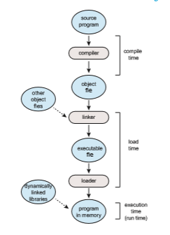
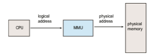
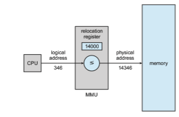

# Background

As we saw in Chapter 1, memory is central to the operation of a modern computer system. Memory consists of a large array of bytes, each with its own address. The CPU fetches instructions from memory according to the value of the program counter. These instructions may cause additional loading from and storing to specific memory addresses.

A typical instruction-execution cycle, for example, first fetches an instruc- tion from memory. The instruction is then decoded and may cause operands to be fetched from memory. After the instruction has been executed on the operands, results may be stored back in memory. The memory unit sees only a stream of memory addresses; it does not know how they are generated (by the instruction counter, indexing, indirection, literal addresses, and so on) or what they are for (instructions or data). Accordingly, we can ignore **_how_** a program generates amemory address.We are interested only in the sequence ofmemory addresses generated by the running program.

We begin our discussion by covering several issues that are pertinent to managing memory: basic hardware, the binding of symbolic (or virtual) mem- ory addresses to actual physical addresses, and the distinction between logical and physical addresses. We conclude the section with a discussion of dynamic linking and shared libraries.

## Basic Hardware

Main memory and the registers built into each processing core are the only general-purpose storage that the CPU can access directly. There are machine instructions that take memory addresses as arguments, but none that take disk addresses. Therefore, any instructions in execution, and any data being used by the instructions, must be in one of these direct-access storage devices. If the data are not in memory, they must be moved there before the CPU can operate on them.

Registers that are built into each CPU core are generally accessible within one cycle of the CPU clock. Some CPU cores can decode instructions and per- form simple operations on register contents at the rate of one or more opera- tions per clock tick. The same cannot be said of main memory,which is accessed via a transaction on the memory bus. Completing a memory access may take many cycles of the CPU clock. In such cases, the processor normally needs to **stall**, since it does not have the data required to complete the instruction that it is executing. This situation is intolerable because of the frequency of memory accesses. The remedy is to add fast memory between the CPU and main mem- ory, typically on the CPU chip for fast access. Such a **cache** was described in Section 1.5.5. Tomanage a cache built into the CPU, the hardware automatically speeds up memory access without any operating-system control. (Recall from Section 5.5.2 that during a memory stall, a multithreaded core can switch from the stalled hardware thread to another hardware thread.)

Not only are we concerned with the relative speed of accessing physi- cal memory, but we also must ensure correct operation. For proper system operation, we must protect the operating system from access by user pro- cesses, as well as protect user processes from one another. This protectionmust be provided by the hardware, because the operating system doesn’t usually intervene between the CPU and its memory accesses (because of the resulting performance penalty). Hardware implements this production in several differ- ent ways, as we show throughout the chapter. Here, we outline one possible implementation.  

**Figure 9.1** A base and a limit register define a logical address space.

We first need to make sure that each process has a separate memory space. Separate per-processmemory space protects the processes from each other and is fundamental to having multiple processes loaded in memory for concurrent execution. To separate memory spaces, we need the ability to determine the range of legal addresses that the process may access and to ensure that the process can access only these legal addresses. We can provide this protection by using two registers, usually a base and a limit, as illustrated in Figure 9.1. The **base register** holds the smallest legal physical memory address; the **limit register** specifies the size of the range. For example, if the base register holds 300040 and the limit register is 120900, then the program can legally access all addresses from 300040 through 420939 (inclusive).

Protection of memory space is accomplished by having the CPU hardware compare every address generated in usermodewith the registers. Any attempt by a program executing in user mode to access operating-system memory or other users’ memory results in a trap to the operating system, which treats the attempt as a fatal error (Figure 9.2). This scheme prevents a user program from (accidentally or deliberately) modifying the code or data structures of either the operating system or other users.

The base and limit registers can be loaded only by the operating system, which uses a special privileged instruction. Since privileged instructions can be executed only in kernel mode, and since only the operating system executes in kernelmode, only the operating system can load the base and limit registers. This scheme allows the operating system to change the value of the registers but prevents user programs from changing the registers’ contents.

The operating system, executing in kernel mode, is given unrestricted access to both operating-system memory and users’ memory. This provision allows the operating system to load users’ programs into users’ memory, to dump out those programs in case of errors, to access and modify parameters of system calls, to perform I/O to and from user memory, and to provide many other services. Consider, for example, that an operating system for a  

**Figure 9.2** Hardware address protection with base and limit registers.

multiprocessing systemmust execute context switches, storing the state of one process from the registers into main memory before loading the next process’s context from main memory into the registers.

## Address Binding

Usually, a program resides on a disk as a binary executable file. To run, the program must be brought into memory and placed within the context of a process (as described in Section 2.5), where it becomes eligible for execution on an available CPU. As the process executes, it accesses instructions and data frommemory. Eventually, the process terminates, and its memory is reclaimed for use by other processes.

Most systems allow a user process to reside in any part of the physical memory. Thus, although the address space of the computer may start at 00000, the first address of the user process need not be 00000. You will see later how the operating system actually places a process in physical memory.

In most cases, a user program goes through several steps—some of which may be optional—before being executed (Figure 9.3). Addressesmay be repre- sented in different ways during these steps. Addresses in the source program are generally symbolic (such as the variable count). Acompiler typically **binds** these symbolic addresses to relocatable addresses (such as “14 bytes from the beginning of this module”). The linker or loader (see Section 2.5) in turn binds the relocatable addresses to absolute addresses (such as 74014). Each binding is a mapping from one address space to another.

Classically, the binding of instructions and data to memory addresses can be done at any step along the way:

• **Compile time**. If you know at compile timewhere the processwill reside in memory, then **absolute code** can be generated. For example, if you know that a user process will reside starting at location _R,_ then the generated compiler code will start at that location and extend up from there. If, at some later time, the starting location changes, then it will be necessary to recompile this code.  

**Figure 9.3** Multistep processing of a user program.

• **Load time**. If it is not known at compile time where the process will reside in memory, then the compiler must generate **relocatable code**. In this case, final binding is delayed until load time. If the starting address changes, we need only reload the user code to incorporate this changed value.

• **Execution time**. If the process can be moved during its execution from one memory segment to another, then binding must be delayed until run time. Special hardware must be available for this scheme to work, as will be discussed in Section 9.1.3. Most operating systems use this method.

Amajor portion of this chapter is devoted to showing how these various bind- ings can be implemented effectively in a computer system and to discussing appropriate hardware support.

## Logical Versus Physical Address Space

An address generated by the CPU is commonly referred to as a **logical address**, whereas an address seen by the memory unit—that is, the one loaded into  

**Figure 9.4** Memory management unit (MMU).

the **memory-address register** of the memory—is commonly referred to as a **physical address**.

Binding addresses at either compile or load time generates identical logical and physical addresses. However, the execution-time address-binding scheme results in differing logical and physical addresses. In this case, we usually refer to the logical address as a **virtual address**. We use **_logical address_** and **_virtual address_** interchangeably in this text. The set of all logical addresses generated by a program is a **logical address space**. The set of all physical addresses corresponding to these logical addresses is a **physical address space**. Thus, in the execution-time address-binding scheme, the logical and physical address spaces differ.

The run-time mapping from virtual to physical addresses is done by a hardware device called the **memory-management unit** (**MMU**) (Figure 9.4). We can choose from many different methods to accomplish such mapping, as we discuss in Section 9.2 through Section 9.3. For the time being, we illustrate this mapping with a simple MMU scheme that is a generalization of the base- register scheme described in Section 9.1.1. The base register is now called a **relocation register**. The value in the relocation register is added to every address generated by a user process at the time the address is sent to memory (see Figure 9.5). For example, if the base is at 14000, then an attempt by the user to address location 0 is dynamically relocated to location 14000; an access to location 346 is mapped to location 14346.

The user program never accesses the real physical addresses. The program can create a pointer to location 346, store it in memory, manipulate it, and com- pare it with other addresses—all as the number 346. Only when it is used as a memory address (in an indirect load or store, perhaps) is it relocated relative to the base register. The user program deals with logical addresses. The memory- mapping hardware converts logical addresses into physical addresses. This form of execution-time binding was discussed in Section 9.1.2. The final loca- tion of a referenced memory address is not determined until the reference is made.

We now have two different types of addresses: logical addresses (in the range 0 to_max_) and physical addresses (in the range _R_ \+ 0 to _R_ +_max_ for a base value _R_). The user program generates only logical addresses and thinks that the process runs in memory locations from 0 to _max._ However, these logical addresses must be mapped to physical addresses before they are used. The  

**Figure 9.5** Dynamic relocation using a relocation register.

concept of a logical address space that is bound to a separate physical address space is central to proper memory management.

## Dynamic Loading

In our discussion so far, it has been necessary for the entire program and all data of a process to be in physical memory for the process to execute. The size of a process has thus been limited to the size of physical memory. To obtain better memory-space utilization, we can use **dynamic loading**. With dynamic loading, a routine is not loaded until it is called. All routines are kept on disk in a relocatable load format. The main program is loaded into memory and is executed. When a routine needs to call another routine, the calling routine first checks to see whether the other routine has been loaded. If it has not, the relocatable linking loader is called to load the desired routine intomemory and to update the program’s address tables to reflect this change. Then control is passed to the newly loaded routine.

The advantage of dynamic loading is that a routine is loaded only when it is needed. This method is particularly useful when large amounts of code are needed to handle infrequently occurring cases, such as error routines. In such a situation, although the total program size may be large, the portion that is used (and hence loaded) may be much smaller.

Dynamic loading does not require special support from the operating system. It is the responsibility of the users to design their programs to take advantage of such a method. Operating systems may help the programmer, however, by providing library routines to implement dynamic loading.

## Dynamic Linking and Shared Libraries

**Dynamically linked libraries** (**DLLs**) are system libraries that are linked to user programswhen the programs are run (refer back to Figure 9.3). Some operating systems support only **static linking**, in which system libraries are treated like any other object module and are combined by the loader into the binary program image. Dynamic linking, in contrast, is similar to dynamic loading. Here, though, linking, rather than loading, is postponed until execution time. This feature is usually used with system libraries, such as the standard C language library.Without this facility, each programon a systemmust include a copy of its language library (or at least the routines referenced by the program) in the executable image. This requirement not only increases the size of an executable image but also may waste main memory. A second advantage of DLLs is that these libraries can be shared among multiple processes, so that only one instance of the DLL in main memory. For this reason, DLLs are also known as **shared libraries**, and are used extensively in Windows and Linux systems.

When a program references a routine that is in a dynamic library, the loader locates the DLL, loading it into memory if necessary. It then adjusts addresses that reference functions in the dynamic library to the location inmemorywhere the DLL is stored.

Dynamically linked libraries can be extended to library updates (such as bug fixes). In addition, a library may be replaced by a new version, and all programs that reference the library will automatically use the new version. Without dynamic linking, all such programs would need to be relinked to gain access to the new library. So that programs will not accidentally execute new, incompatible versions of libraries, version information is included in both the program and the library. More than one version of a library may be loaded into memory, and each program uses its version information to decide which copy of the library to use. Versions with minor changes retain the same version number, whereas versions with major changes increment the number. Thus, only programs that are compiled with the new library version are affected by any incompatible changes incorporated in it. Other programs linked before the new library was installed will continue using the older library.

Unlike dynamic loading, dynamic linking and shared libraries generally require help from the operating system. If the processes in memory are pro- tected from one another, then the operating system is the only entity that can check to see whether the needed routine is in another process’s memory space or that can allow multiple processes to access the same memory addresses. We elaborate on this concept, as well as how DLLs can be shared by multiple processes, when we discuss paging in Section 9.3.4.