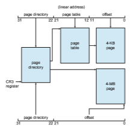

# Example: Intel 32- and 64-bit Architectures

The architecture of Intel chips has dominated the personal computer landscape for decades. The 16-bit Intel 8086 appeared in the late 1970s and was soon followed by another 16-bit chip—the Intel 8088—which was notable for being the chip used in the original IBM PC. Intel later produced a series of 32-bit chips—the IA-32—which included the family of 32-bit Pentium processors. More recently, Intel has produced a series of 64-bit chips based on the x86-64 architecture. Currently, all the most popular PC operating systems run on Intel chips, including Windows, macOS, and Linux (although Linux, of course, runs on several other architectures as well). Notably, however, Intel’s dominance has not spread to mobile systems, where the ARM architecture currently enjoys considerable success (see Section 9.7).

In this section, we examine address translation for both IA-32 and x86-64 architectures. Before we proceed, however, it is important to note that because Intel has released several versions—as well as variations—of its architectures over the years, we cannot provide a complete description of the memory- management structure of all its chips. Nor canwe provide all of the CPU details, as that information is best left to books on computer architecture. Rather, we present the major memory-management concepts of these Intel CPUs.

## IA-32 Architecture

Memory management in IA-32 systems is divided into two components— segmentation and paging—and works as follows: The CPU generates logical addresses, which are given to the segmentation unit. The segmentation unit produces a linear address for each logical address. The linear address is then given to the paging unit, which in turn generates the physical address in main memory. Thus, the segmentation and paging units form the equivalent of the memory-management unit (MMU). This scheme is shown in Figure 9.21.

### IA-32 Segmentation

The IA-32 architecture allows a segment to be as large as 4 GB, and the max- imum number of segments per process is 16 K. The logical address space of a process is divided into two partitions. The first partition consists of up to 8 K segments that are private to that process. The second partition consists of up to 8 K segments that are shared among all the processes. Information about the first partition is kept in the **local descriptor table** (**LDT**); information about the second partition is kept in the **global descriptor table** (**GDT**). Each entry in the LDT and GDT consists of an 8-byte segment descriptorwith detailed information about a particular segment, including the base location and limit of that segment.

**Figure 9.21** Logical to physical address translation in IA-32.  

**Figure 9.22** IA-32 segmentation.

The logical address is a pair (selector, offset), where the selector is a 16-bit number:

Here, _s_ designates the segment number, _g_ indicates whether the segment is in the GDT or LDT, and _p_ deals with protection. The offset is a 32-bit number specifying the location of the byte within the segment in question.

The machine has six segment registers, allowing six segments to be addressed at any one time by a process. It also has six 8-byte microprogram registers to hold the corresponding descriptors from either the LDT or the GDT. This cache lets the Pentium avoid having to read the descriptor from memory for every memory reference.

The linear address on the IA-32 is 32 bits long and is formed as follows. The segment register points to the appropriate entry in the LDT or GDT. The base and limit information about the segment in question is used to generate a **linear address**. First, the limit is used to check for address validity. If the address is not valid, a memory fault is generated, resulting in a trap to the operating system. If it is valid, then the value of the offset is added to the value of the base, resulting in a 32-bit linear address. This is shown in Figure 9.22. In the following section, we discuss how the paging unit turns this linear address into a physical address.

### IA-32 Paging

The IA-32 architecture allows a page size of either 4 KB or 4 MB. For 4-KB pages, IA-32 uses a two-level paging scheme in which the division of the 32-bit linear address is as follows:

**Figure 9.23** Paging in the IA-32 architecture.

The address-translation scheme for this architecture is similar to the scheme shown in Figure 9.16. The IA-32 address translation is shown in more detail in Figure 9.23. The 10 high-order bits reference an entry in the outermost page table, which IA-32 terms the **page directory**. (The CR3 register points to the page directory for the current process.) The page directory entry points to an inner page table that is indexed by the contents of the innermost 10 bits in the linear address. Finally, the low-order bits 0–11 refer to the offset in the 4-KB page pointed to in the page table.

One entry in the page directory is the Page Size flag, which—if set— indicates that the size of the page frame is 4 MB and not the standard 4 KB. If this flag is set, the page directory points directly to the 4-MB page frame, bypassing the inner page table; and the 22 low-order bits in the linear address refer to the offset in the 4-MB page frame.

To improve the efficiency of physical memory use, IA-32 page tables can be swapped to disk. In this case, an invalid bit is used in the page directory entry to indicate whether the table to which the entry is pointing is in memory or on disk. If the table is on disk, the operating system can use the other 31 bits to specify the disk location of the table. The table can then be brought into memory on demand.

As software developers began to discover the 4-GB memory limitations of 32-bit architectures, Intel adopted a **page address extension** (**PAE**), which allows 32-bit processors to access a physical address space larger than 4 GB. The fundamental difference introduced by PAE support was that paging went from a two-level scheme (as shown in Figure 9.23) to a three-level scheme, where the top two bits refer to a **page directory pointer table**. Figure 9.24 illustrates a PAE system with 4-KB pages. (PAE also supports 2-MB pages.)

PAE also increased the page-directory and page-table entries from 32 to 64 bits in size, which allowed the base address of page tables and page frames to  

**Figure 9.24** Page address extensions.

extend from 20 to 24 bits. Combined with the 12-bit offset, adding PAE support to IA-32 increased the address space to 36 bits, which supports up to 64 GB of physical memory. It is important to note that operating system support is required to use PAE. Both Linux and macOS support PAE. However, 32-bit versions of Windows desktop operating systems still provide support for only 4 GB of physical memory, even if PAE is enabled.

## x86-64

Intel has had an interesting history of developing 64-bit architectures. Its ini- tial entry was the IA-64 (later named **Itanium**) architecture, but that architec- ture was not widely adopted. Meanwhile, another chip manufacturer—AMD — began developing a 64-bit architecture known as x86-64 that was based on extending the existing IA-32 instruction set. The x86-64 supported much larger logical and physical address spaces, as well as several other architec- tural advances. Historically, AMD had often developed chips based on Intel’s architecture, but now the roles were reversed as Intel adopted AMD’s x86-64 architecture. In discussing this architecture, rather than using the commercial names **AMD64** and **Intel 64**, we will use the more general term **x86-64**.

Support for a 64-bit address space yields an astonishing 264 bytes of addressable memory—a number greater than 16 quintillion (or 16 exabytes). However, even though 64-bit systems can potentially address this much mem- ory, in practice far fewer than 64 bits are used for address representation in current designs. The x86-64 architecture currently provides a 48-bit virtual address with support for page sizes of 4 KB, 2 MB, or 1 GB using four levels of paging hierarchy. The representation of the linear address appears in Figure 9.25. Because this addressing scheme can use PAE, virtual addresses are 48 bits in size but support 52-bit physical addresses (4,096 terabytes).

**Figure 9.25** x86-64 linear address.