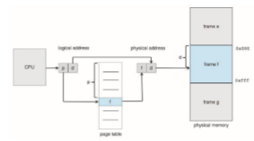
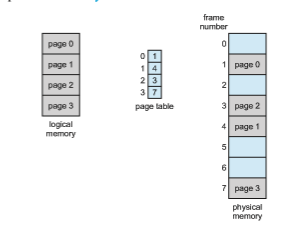
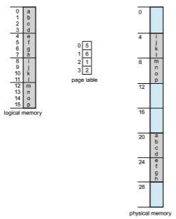
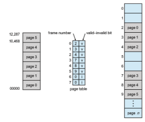

# Paging

Memory management discussed thus far has required the physical address space of a process to be contiguous. We now introduce **paging**, a memory- management scheme that permits a process’s physical address space to be non- contiguous. Paging avoids external fragmentation and the associated need for compaction, two problems that plague contiguousmemory allocation. Because it offers numerous advantages, paging in its various forms is used inmost oper- ating systems, from those for large servers through those for mobile devices. Paging is implemented through cooperation between the operating systemand the computer hardware.

## Basic Method

The basic method for implementing paging involves breaking physical mem- ory into fixed-sized blocks called **frames** and breaking logical memory into blocks of the same size called **pages**. When a process is to be executed, its pages are loaded into any availablememory frames from their source (a file system or the backing store). The backing store is divided into fixed-sized blocks that are the same size as the memory frames or clusters of multiple frames. This rather simple idea has great functionality and wide ramifications. For example, the logical address space is now totally separate from the physical address space, so a process can have a logical 64-bit address space even though the system has less than 264 bytes of physical memory.

Every address generated by the CPU is divided into two parts: a **page number** (**p**) and a **page offset** (**d**):

**Figure 9.8** Paging hardware.

The page number is used as an index into a per-process **page table**. This is illustrated in Figure 9.8. The page table contains the base address of each frame in physical memory, and the offset is the location in the frame being referenced. Thus, the base address of the frame is combined with the page offset to define the physicalmemory address. The pagingmodel ofmemory is shown in Figure 9.9.

The following outlines the steps taken by the MMU to translate a logical address generated by the CPU to a physical address:

**1\.** Extract the page number _p_ and use it as an index into the page table.

**2\.** Extract the corresponding frame number _f_ from the page table.

**3\.** Replace the page number _p_ in the logical address with the frame number _f_ .

As the offset _d_ does not change, it is not replaced, and the frame number and offset now comprise the physical address.

The page size (like the frame size) is defined by the hardware. The size of a page is a power of 2, typically varying between 4 KB and 1 GB per page, depending on the computer architecture. The selection of a power of 2 as a page size makes the translation of a logical address into a page number and page offset particularly easy. If the size of the logical address space is 2 _m_, and a page size is 2 _n_ bytes, then the high-order _m_ − _n_ bits of a logical address designate the page number, and the _n_ low-order bits designate the page offset. Thus, the logical address is as follows:

**Figure 9.9** Paging model of logical and physical memory.

where _p_ is an index into the page table and _d_ is the displacement within the page.

As a concrete (although minuscule) example, consider the memory in Figure 9.10. Here, in the logical address, _n_ \= 2 and _m_ \= 4. Using a page size of 4 bytes and a physical memory of 32 bytes (8 pages), we show how the programmer’s view of memory can be mapped into physical memory. Logical address 0 is page 0, offset 0. Indexing into the page table, we find that page 0 is in frame 5. Thus, logical address 0 maps to physical address 20 \[= (5 × 4) + 0\]. Logical address 3 (page 0, offset 3) maps to physical address 23 \[= (5 × 4) + 3\]. Logical address 4 is page 1, offset 0; according to the page table, page 1 is mapped to frame 6. Thus, logical address 4 maps to physical address 24 \[= (6 × 4) + 0\]. Logical address 13 maps to physical address 9.

You may have noticed that paging itself is a form of dynamic relocation. Every logical address is bound by the paging hardware to some physical address. Using paging is similar to using a table of base (or relocation) registers, one for each frame of memory.

When we use a paging scheme, we have no external fragmentation: any free frame can be allocated to a process that needs it. However, we may have some internal fragmentation. Notice that frames are allocated as units. If the memory requirements of a process do not happen to coincidewith page bound- aries, the last frame allocated may not be completely full. For example, if page size is 2,048 bytes, a process of 72,766 bytes will need 35 pages plus 1,086 bytes. It will be allocated 36 frames, resulting in internal fragmentation of 2,048 − 1,086 = 962 bytes. In the worst case, a process would need _n_ pages plus 1 byte. It would be allocated _n_ \+ 1 frames, resulting in internal fragmentation of almost an entire frame.  

**Figure 9.10** Paging example for a 32-byte memory with 4-byte pages.

If process size is independent of page size, we expect internal fragmen- tation to average one-half page per process. This consideration suggests that small page sizes are desirable. However, overhead is involved in each page- table entry, and this overhead is reduced as the size of the pages increases. Also, disk I/O is more efficient when the amount of data being transferred is larger (Chapter 11). Generally, page sizes have grown over time as processes, data sets, and main memory have become larger. Today, pages are typically either 4 KB or 8 KB in size, and some systems support even larger page sizes. Some CPUs and operating systems even support multiple page sizes. For instance, on x86-64 systems, Windows 10 supports page sizes of 4 KB and 2 MB. Linux also supports twopage sizes: a default page size (typically 4 KB) and an architecture- dependent larger page size called **huge pages**.

Frequently, on a 32-bit CPU, each page-table entry is 4 bytes long, but that size can vary as well. A 32-bit entry can point to one of 232 physical page frames. If the frame size is 4 KB (212), then a system with 4-byte entries can address 244 bytes (or 16 TB) of physical memory. We should note here that the size of physical memory in a paged memory system is typically different from the maximum logical size of a process. As we further explore paging, we will  

**_OBTAINING THE PAGE SIZE ON LINUX SYSTEMS_**

On a Linux system, the page size varies according to architecture, and there are several ways of obtaining the page size. One approach is to use the system call getpagesize(). Another strategy is to enter the following command on the command line:

getconf PAGESIZE

Each of these techniques returns the page size as a number of bytes.

introduce other information that must be kept in the page-table entries. That information reduces the number of bits available to address page frames. Thus, a systemwith 32-bit page-table entries may address less physical memory than the possible maximum.

When a process arrives in the system to be executed, its size, expressed in pages, is examined. Each page of the process needs one frame. Thus, if the process requires _n_ pages, at least _n_ frames must be available in memory. If _n_ frames are available, they are allocated to this arriving process. The first page of the process is loaded into one of the allocated frames, and the frame number is put in the page table for this process. The next page is loaded into another frame, its frame number is put into the page table, and so on (Figure 9.11).

An important aspect of paging is the clear separation between the pro- grammer’s view of memory and the actual physical memory. The programmer views memory as one single space, containing only this one program. In fact, the user program is scattered throughout physical memory, which also holds

**Figure 9.11** Free frames (a) before allocation and (b) after allocation.  

other programs. The difference between the programmer’s view of memory and the actual physical memory is reconciled by the address-translation hard- ware. The logical addresses are translated into physical addresses. This map- ping is hidden from the programmer and is controlled by the operating system. Notice that the user process by definition is unable to access memory it does not own. It has no way of addressingmemory outside of its page table, and the table includes only those pages that the process owns.

Since the operating system ismanaging physical memory, it must be aware of the allocation details of physical memory—which frames are allocated, which frames are available, how many total frames there are, and so on. This information is generally kept in a single, system-wide data structure called a **frame table**. The frame table has one entry for each physical page frame, indicating whether the latter is free or allocated and, if it is allocated, to which page of which process (or processes).

In addition, the operating system must be aware that user processes oper- ate in user space, and all logical addressesmust bemapped to produce physical addresses. If a user makes a system call (to do I/O, for example) and provides an address as a parameter (a buffer, for instance), that addressmust bemapped to produce the correct physical address. The operating systemmaintains a copy of the page table for each process, just as it maintains a copy of the instruction counter and register contents. This copy is used to translate logical addresses to physical addresseswhenever the operating systemmust map a logical address to a physical address manually. It is also used by the CPU dispatcher to define the hardware page table when a process is to be allocated the CPU. Paging therefore increases the context-switch time.

## Hardware Support

As page tables are per-process data structures, a pointer to the page table is stored with the other register values (like the instruction pointer) in the process control block of each process.When the CPU scheduler selects a process for execution, it must reload the user registers and the appropriate hardware page-table values from the stored user page table.

The hardware implementation of the page table can be done in several ways. In the simplest case, the page table is implemented as a set of dedicated high-speed hardware registers,whichmakes the page-address translation very efficient. However, this approach increases context-switch time, as each one of these registers must be exchanged during a context switch.

The use of registers for the page table is satisfactory if the page table is rea- sonably small (for example, 256 entries). Most contemporary CPUs, however, support much larger page tables (for example, 220 entries). For these machines, the use of fast registers to implement the page table is not feasible. Rather, the page table is kept in main memory, and a **page-table base register** (**PTBR**) points to the page table. Changing page tables requires changing only this one register, substantially reducing context-switch time.

#### Translation Look-Aside Buffer

Although storing the page table in main memory can yield faster context switches, it may also result in slower memory access times. Suppose we want to access location _i._We must first index into the page table, using the value in  

the PTBR offset by the page number for _i_. This task requires onememory access. It provides us with the frame number, which is combined with the page offset to produce the actual address.We can then access the desired place inmemory. With this scheme, **_two_** memory accesses are needed to access data (one for the page-table entry and one for the actual data). Thus,memory access is slowedby a factor of 2, a delay that is considered intolerable under most circumstances.

The standard solution to this problem is to use a special, small, fast-lookup hardware cache called a **translation look-aside buffer** (**TLB**). The TLB is asso- ciative, high-speed memory. Each entry in the TLB consists of two parts: a key (or tag) and a value. When the associative memory is presented with an item, the item is compared with all keys simultaneously. If the item is found, the cor- responding value field is returned. The search is fast; a TLB lookup in modern hardware is part of the instruction pipeline, essentially adding no performance penalty. To be able to execute the search within a pipeline step, however, the TLB must be kept small. It is typically between 32 and 1,024 entries in size. Some CPUs implement separate instruction and data address TLBs. That can double the number of TLB entries available, because those lookups occur in different pipeline steps. We can see in this development an example of the evolution of CPU technology: systems have evolved fromhaving no TLBs to havingmultiple levels of TLBs, just as they have multiple levels of caches.

The TLB is used with page tables in the following way. The TLB contains only a few of the page-table entries. When a logical address is generated by the CPU, the MMU first checks if its page number is present in the TLB. If the page number is found, its frame number is immediately available and is used to access memory. As just mentioned, these steps are executed as part of the instruction pipeline within the CPU, adding no performance penalty compared with a system that does not implement paging.

If the page number is not in the TLB (known as a **TLB miss**), address translation proceeds following the steps illustrated in Section 9.3.1, where a memory reference to the page table must be made. When the frame number is obtained, we can use it to access memory (Figure 9.12). In addition, we add the page number and frame number to the TLB, so that they will be found quickly on the next reference.

If the TLB is already full of entries, an existing entry must be selected for replacement. Replacement policies range from least recently used (LRU) through round-robin to random. Some CPUs allow the operating system to par- ticipate in LRU entry replacement, while others handle the matter themselves. Furthermore, some TLBs allow certain entries to be **wired down**, meaning that they cannot be removed from the TLB. Typically, TLB entries for key kernel code are wired down.

Some TLBs store **address-space identifier** (**ASIDs**) in each TLB entry. An ASID uniquely identifies each process and is used to provide address-space protection for that process.When the TLB attempts to resolve virtual page num- bers, it ensures that the ASID for the currently running process matches the ASID associated with the virtual page. If the ASIDs do not match, the attempt is treated as a TLB miss. In addition to providing address-space protection, an ASID allows the TLB to contain entries for several different processes simulta- neously. If the TLB does not support separate ASIDs, then every time a new page table is selected (for instance, with each context switch), the TLB must be **flushe** (or erased) to ensure that the next executing process does not use the  

**Figure 9.12** Paging hardware with TLB.

wrong translation information. Otherwise, the TLB could include old entries that contain valid virtual addresses but have incorrect or invalid physical addresses left over from the previous process.

The percentage of times that the page number of interest is found in the TLB is called the **hit ratio**. An 80-percent hit ratio, for example, means that we find the desired page number in the TLB 80 percent of the time. If it takes 10 nanoseconds to access memory, then a mapped-memory access takes 10 nanoseconds when the page number is in the TLB. If we fail to find the page number in the TLB then we must first access memory for the page table and frame number (10 nanoseconds) and then access the desired byte in memory (10 nanoseconds), for a total of 20 nanoseconds. (We are assuming that a page- table lookup takes only one memory access, but it can take more, as we shall see.) To find the **effective memory-access time**, we weight the case by its probability:

effective access time = 0.80 × 10 + 0.20 × 20 = 12 nanoseconds

In this example, we suffer a 20-percent slowdown in average memory-access time (from 10 to 12 nanoseconds). For a 99-percent hit ratio, which is much more realistic, we have

effective access time = 0.99 × 10 + 0.01 × 20 = 10.1 nanoseconds

This increased hit rate produces only a 1 percent slowdown in access time.  

As noted earlier, CPUs todaymay providemultiple levels of TLBs. Calculat- ing memory access times in modern CPUs is therefore much more complicated than shown in the example above. For instance, the Intel Core i7 CPU has a 128-entry L1 instruction TLB and a 64-entry L1 data TLB. In the case of a miss at L1, it takes the CPU six cycles to check for the entry in the L2 512-entry TLB. A miss in L2 means that the CPU must either walk through the page-table entries in memory to find the associated frame address, which can take hundreds of cycles, or interrupt to the operating system to have it do the work.

A complete performance analysis of paging overhead in such a system would require miss-rate information about each TLB tier. We can see from the general information above, however, that hardware features can have a signif- icant effect onmemory performance and that operating-system improvements (such as paging) can result in and, in turn, be affected by hardware changes (such as TLBs). We will further explore the impact of the hit ratio on the TLB in Chapter 10.

TLBs are a hardware feature and thereforewould seem to be of little concern to operating systems and their designers. But the designer needs to understand the function and features of TLBs, which vary by hardware platform. For opti- mal operation, an operating-system design for a given platform must imple- ment paging according to the platform’s TLB design. Likewise, a change in the TLB design (for example, between different generations of Intel CPUs) may necessitate a change in the paging implementation of the operating systems that use it.

## Protection

Memory protection in a paged environment is accomplished by protection bits associated with each frame. Normally, these bits are kept in the page table.

One bit can define a page to be read–write or read-only. Every reference to memory goes through the page table to find the correct frame number. At the same time that the physical address is being computed, the protection bits can be checked to verify that no writes are being made to a read-only page. An attempt to write to a read-only page causes a hardware trap to the operating system (or memory-protection violation).

We can easily expand this approach to provide a finer level of protection. We can create hardware to provide read-only, read–write, or execute-only protection; or, by providing separate protection bits for each kind of access, we can allow any combination of these accesses. Illegal attempts will be trapped to the operating system.

One additional bit is generally attached to each entry in the page table: a **valid–invalid** bit. When this bit is set to _valid,_ the associated page is in the process’s logical address space and is thus a legal (or valid) page. When the bit is set to _invalid,_ the page is not in the process’s logical address space. Illegal addresses are trapped by use of the valid–invalid bit. The operating system sets this bit for each page to allow or disallow access to the page.

Suppose, for example, that in a system with a 14-bit address space (0 to 16383), we have a program that should use only addresses 0 to 10468. Given a page size of 2 KB, we have the situation shown in Figure 9.13. Addresses in pages 0, 1, 2, 3, 4, and 5 are mapped normally through the page table. Any attempt to generate an address in pages 6 or 7, however, will find that the  

**Figure 9.13** Valid (v) or invalid (i) bit in a page table.

valid–invalid bit is set to invalid, and the computer will trap to the operating system (invalid page reference).

Notice that this scheme has created a problem. Because the program extends only to address 10468, any reference beyond that address is illegal. However, references to page 5 are classified as valid, so accesses to addresses up to 12287 are valid. Only the addresses from 12288 to 16383 are invalid. This problem is a result of the 2-KB page size and reflects the internal fragmentation of paging.

Rarely does a process use all its address range. In fact, many processes use only a small fraction of the address space available to them. It would be wasteful in these cases to create a page table with entries for every page in the address range. Most of this table would be unused but would take up valuable memory space. Some systems provide hardware, in the form of a **page-table length register** (**PTLR**), to indicate the size of the page table. This value is checked against every logical address to verify that the address is in the valid range for the process. Failure of this test causes an error trap to the operating system.

## Shared Pages

Anadvantage of paging is the possibility of **_sharing_** common code, a considera- tion that is particularly important in an environment with multiple processes. Consider the standard C library, which provides a portion of the system call interface for many versions of UNIX and Linux. On a typical Linux system, most user processes require the standard C library libc. One option is to have  

each process load its own copy of libc into its address space. If a system has 40 user processes, and the libc library is 2 MB, this would require 80 MB of memory.

If the code is **reentrant code**, however, it can be shared, as shown in Figure 9.14. Here, we see three processes sharing the pages for the standard C library libc. (Although the figure shows the libc library occupying four pages, in reality, it would occupy more.) Reentrant code is non-self-modifying code: it never changes during execution. Thus, two or more processes can execute the same code at the same time. Each process has its own copy of registers and data storage to hold the data for the process’s execution. The data for two different processes will, of course, be different. Only one copy of the standard C library need be kept in physicalmemory, and the page table for each user processmaps onto the same physical copy of libc. Thus, to support 40 processes, we need only one copy of the library, and the total space now required is 2 MB instead of 80 MB—a significant saving!

In addition to run-time libraries such as libc, other heavily used programs can also be shared—compilers, window systems, database systems, and so on. The shared libraries discussed in Section 9.1.5 are typically implemented with shared pages. To be sharable, the code must be reentrant. The read-only nature of shared code should not be left to the correctness of the code; the operating system should enforce this property.

**Figure 9.14** Sharing of standard C library in a paging environment.  

The sharing of memory among processes on a system is similar to the sharing of the address space of a task by threads, described in Chapter 4. Furthermore, recall that in Chapter 3we described sharedmemory as amethod of interprocess communication. Some operating systems implement shared memory using shared pages.

Organizing memory according to pages provides numerous benefits in addition to allowing several processes to share the same physical pages. We cover several other benefits in Chapter 10.