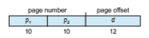
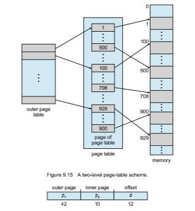
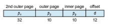
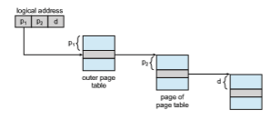

# Structure of the Page Table

In this section,we explore some of themost common techniques for structuring the page table, including hierarchical paging, hashed page tables, and inverted page tables.

## Hierarchical Paging

Most modern computer systems support a large logical address space (232 to 264). In such an environment, the page table itself becomes excessively large. For example, consider a systemwith a 32-bit logical address space. If the page size in such a system is 4 KB (212), then a page table may consist of over 1 million entries (220 = 232/212). Assuming that each entry consists of 4 bytes, each process may need up to 4 MB of physical address space for the page table alone. Clearly, we would not want to allocate the page table contiguously in main memory. One simple solution to this problem is to divide the page table into smaller pieces. We can accomplish this division in several ways.

One way is to use a two-level paging algorithm, in which the page table itself is also paged (Figure 9.15). For example, consider again the system with a 32-bit logical address space and a page size of 4 KB. A logical address is divided into a page number consisting of 20 bits and a page offset consisting of 12 bits. Because we page the page table, the page number is further divided into a 10-bit page number and a 10-bit page offset. Thus, a logical address is as follows:

where _p_1 is an index into the outer page table and _p_2 is the displacement within the page of the inner page table. The address-translationmethod for this architecture is shown in Figure 9.16. Because address translation works from the outer page table inward, this scheme is also known as a **forward-mapped** page table.

For a systemwith a 64-bit logical address space, a two-level paging scheme is no longer appropriate. To illustrate this point, let’s suppose that the page size in such a system is 4 KB (212). In this case, the page table consists of up to 252 entries. If we use a two-level paging scheme, then the inner page tables can conveniently be one page long, or contain 210 4-byte entries. The addresses look like this:  

The outer page table consists of 242 entries, or 244 bytes. The obvious way to avoid such a large table is to divide the outer page table into smaller pieces. (This approach is also used on some 32-bit processors for added flexibility and efficiency.)

We can divide the outer page table in various ways. For example, we can page the outer page table, giving us a three-level paging scheme. Suppose that the outer page table ismade up of standard-size pages (210 entries, or 212 bytes). In this case, a 64-bit address space is still daunting:

The outer page table is still 234 bytes (16 GB) in size. The next stepwould be a four-level paging scheme, where the second-level

outer page table itself is also paged, and so forth. The 64-bit UltraSPARC would require seven levels of paging—a prohibitive number of memory accesses—  

**Figure 9.16** Address translation for a two-level 32-bit paging architecture.

to translate each logical address. You can see from this example why, for 64-bit architectures, hierarchical page tables are generally considered inappropriate.

## Hashed Page Tables

One approach for handling address spaces larger than 32 bits is to use a **hashed page table**, with the hash value being the virtual page number. Each entry in the hash table contains a linked list of elements that hash to the same location (to handle collisions). Each element consists of three fields: (1) the virtual page number, (2) the value of the mapped page frame, and (3) a pointer to the next element in the linked list.

The algorithm works as follows: The virtual page number in the virtual address is hashed into the hash table. The virtual page number is compared with field 1 in the first element in the linked list. If there is a match, the corresponding page frame (field 2) is used to form the desiredphysical address. If there is no match, subsequent entries in the linked list are searched for a matching virtual page number. This scheme is shown in Figure 9.17.

**Figure 9.17** Hashed page table.  

A variation of this scheme that is useful for 64-bit address spaces has been proposed. This variation uses **clustered page tables**, which are similar to hashed page tables except that each entry in the hash table refers to several pages (such as 16) rather than a single page. Therefore, a single page-table entry can store the mappings for multiple physical-page frames. Clustered page tables are particularly useful for **sparse** address spaces, where memory references are noncontiguous and scattered throughout the address space.

## Inverted Page Tables

Usually, each process has an associated page table. The page table has one entry for each page that the process is using (or one slot for each virtual address, regardless of the latter’s validity). This table representation is a natural one, since processes reference pages through the pages’ virtual addresses. The operating system must then translate this reference into a physical memory address. Since the table is sorted by virtual address, the operating system is able to calculate where in the table the associated physical address entry is located and to use that value directly. One of the drawbacks of this method is that each page table may consist of millions of entries. These tables may consume large amounts of physical memory just to keep track of how other physical memory is being used.

To solve this problem, we can use an **inverted page table**. An inverted page table has one entry for each real page (or frame) of memory. Each entry consists of the virtual address of the page stored in that real memory location, with information about the process that owns the page. Thus, only one page table is in the system, and it has only one entry for each page of physical memory. Figure 9.18 shows the operation of an inverted page table. Compare it with Figure 9.8, which depicts a standard page table in operation. Inverted page tables often require that an address-space identifier (Section 9.3.2) be stored in each entry of the page table, since the table usually contains several

**Figure 9.18** Inverted page table.  

different address spaces mapping physical memory. Storing the address-space identifier ensures that a logical page for a particular process is mapped to the corresponding physical page frame. Examples of systems using inverted page tables include the 64-bit Ultra SPARC and PowerPC.

To illustrate this method, we describe a simplified version of the inverted page table used in the IBM RT. IBM was the first major company to use inverted page tables, starting with the IBM System 38 and continuing through the RS/6000 and the current IBM Power CPUs. For the IBM RT, each virtual address in the system consists of a triple:

_<_process-id, page-number, offset_\>_.

Each inverted page-table entry is a pair _<_process-id, page-number_\>_where the process-id assumes the role of the address-space identifier. When a memory reference occurs, part of the virtual address, consisting of _<_process-id, page- number_\>_, is presented to the memory subsystem. The inverted page table is then searched for a match. If a match is found—say, at entry _i_—then the physical address _<i,_ offset_\>_ is generated. If no match is found, then an illegal address access has been attempted.

Although this scheme decreases the amount of memory needed to store each page table, it increases the amount of time needed to search the tablewhen a page reference occurs. Because the inverted page table is sorted by physical address, but lookups occur on virtual addresses, the whole table might need to be searched before a match is found. This search would take far too long. To alleviate this problem, we use a hash table, as described in Section 9.4.2, to limit the search to one—or at most a few—page-table entries. Of course, each access to the hash table adds a memory reference to the procedure, so one virtualmemory reference requires at least two realmemory reads—one for the hash-table entry and one for the page table. (Recall that the TLB is searched first, before the hash table is consulted, offering some performance improvement.)

One interesting issue with inverted page tables involves shared memory. With standard paging, each process has its own page table, which allows multiple virtual addresses to be mapped to the same physical address. This method cannot be used with inverted page tables; because there is only one virtual page entry for every physical page, one physical page cannot have two (or more) shared virtual addresses. Therefore, with inverted page tables, only one mapping of a virtual address to the shared physical address may occur at any given time. A reference by another process sharing the memory will result in a page fault and will replace the mapping with a different virtual address.

## Oracle SPARC Solaris

Consider as a final example a modern 64-bit CPU and operating system that are tightly integrated to provide low-overhead virtual memory. **Solaris** running on the **SPARC** CPU is a fully 64-bit operating system and as such has to solve the problem of virtual memory without using up all of its physical memory by keeping multiple levels of page tables. Its approach is a bit complex but solves the problem efficiently using hashed page tables. There are two hash tables—one for the kernel and one for all user processes. Each maps memory addresses from virtual to physical memory. Each hash-table entry represents a contiguous area of mapped virtual memory, which is more efficient than  

having a separate hash-table entry for each page. Each entry has a base address and a span indicating the number of pages the entry represents.

Virtual-to-physical translationwould take too long if each address required searching through a hash table, so the CPU implements a TLB that holds transla- tion table entries (TTEs) for fast hardware lookups. Acache of these TTEs resides in a translation storage buffer (TSB), which includes an entry per recently accessed page.When a virtual address reference occurs, the hardware searches the TLB for a translation. If none is found, the hardware walks through the in- memory TSB looking for the TTE that corresponds to the virtual address that caused the lookup. This **TLB walk** functionality is found on many modern CPUs. If a match is found in the TSB, the CPU copies the TSB entry into the TLB, and the memory translation completes. If no match is found in the TSB, the kernel is interrupted to search the hash table. The kernel then creates a TTE from the appropriate hash table and stores it in the TSB for automatic loading into the TLB by the CPU memory-management unit. Finally, the interrupt han- dler returns control to the MMU, which completes the address translation and retrieves the requested byte or word from main memory.