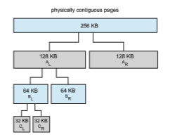

# Allocating Kernel Memory

When a process running in user mode requests additional memory, pages are allocated from the list of free page frames maintained by the kernel. This list is typically populated using a page-replacement algorithm such as those dis- cussed in Section 10.4 andmost likely contains free pages scattered throughout physical memory, as explained earlier. Remember, too, that if a user process requests a single byte of memory, internal fragmentation will result, as the process will be granted an entire page frame.  

Kernel memory is often allocated from a free-memory pool different from the list used to satisfy ordinary user-mode processes. There are two primary reasons for this:

**1\.** The kernel requests memory for data structures of varying sizes, some of which are less than a page in size.As a result, the kernelmust usememory conservatively and attempt tominimizewaste due to fragmentation. This is especially important because many operating systems do not subject kernel code or data to the paging system.

**2\.** Pages allocated to user-mode processes do not necessarily have to be in contiguous physicalmemory.However, certain hardware devices interact directly with physical memory—without the benefit of a virtual memory interface—and consequentlymay requirememory residing in physically contiguous pages.

In the following sections,we examine two strategies formanaging freememory that is assigned to kernel processes: the “buddy system” and slab allocation.

## Buddy System

The buddy system allocates memory from a fixed-size segment consisting of physically contiguous pages. Memory is allocated from this segment using a **power-of-2 allocator**, which satisfies requests in units sized as a power of 2 (4 KB, 8 KB, 16 KB, and so forth). A request in units not appropriately sized is rounded up to the next highest power of 2. For example, a request for 11 KB is satisfied with a 16-KB segment.

Let’s consider a simple example. Assume the size of a memory segment is initially 256 KB and the kernel requests 21 KB of memory. The segment is initially divided into two **buddies**—which we will call _AL_ and _AR_—each 128 KB in size. One of these buddies is further divided into two 64-KB buddies—_BL_ and _BR_. However, the next-highest power of 2 from 21 KB is 32 KB so either _BL_ or _BR_ is again divided into two 32-KB buddies,_CL_ and _CR_. One of these buddies is used to satisfy the 21-KB request. This scheme is illustrated in Figure 10.26, where _CL_ is the segment allocated to the 21-KB request.

An advantage of the buddy system is how quickly adjacent buddies can be combined to form larger segments using a technique known as **coalescing**. In Figure 10.26, for example, when the kernel releases the _CL_ unit it was allocated, the system can coalesce _CL_ and _CR_ into a 64-KB segment. This segment, _BL_, can in turn be coalesced with its buddy _BR_ to form a 128-KB segment. Ultimately, we can end up with the original 256-KB segment.

The obvious drawback to the buddy system is that rounding up to the next highest power of 2 is very likely to cause fragmentation within allocated seg- ments. For example, a 33-KB request can only be satisfiedwith a 64-KB segment. In fact, we cannot guarantee that less than 50 percent of the allocated unit will be wasted due to internal fragmentation. In the following section, we explore a memory allocation scheme where no space is lost due to fragmentation.

## Slab Allocation

Asecond strategy for allocating kernel memory is known as **slab allocation**. A **slab** is made up of one or more physically contiguous pages. A **cache** consists  

**Figure 10.26** Buddy system allocation.

of one or more slabs. There is a single cache for each unique kernel data struc- ture—for example, a separate cache for the data structure representing process descriptors, a separate cache for file objects, a separate cache for semaphores, and so forth. Each cache is populated with **objects** that are instantiations of the kernel data structure the cache represents. For example, the cache represent- ing semaphores stores instances of semaphore objects, the cache representing process descriptors stores instances of process descriptor objects, and so forth. The relationship among slabs, caches, and objects is shown in Figure 10.27. The figure shows two kernel objects 3 KB in size and three objects 7 KB in size, each stored in a separate cache.

**Figure 10.27** Slab allocation.  

The slab-allocation algorithm uses caches to store kernel objects. When a cache is created, a number of objects—which are initiallymarked as free—are allocated to the cache. The number of objects in the cache depends on the size of the associated slab. For example, a 12-KB slab (made up of three contiguous 4-KB pages) could store six 2-KB objects. Initially, all objects in the cache are marked as free. When a new object for a kernel data structure is needed, the allocator can assign any free object from the cache to satisfy the request. The object assigned from the cache is marked as used.

Let’s consider a scenario in which the kernel requests memory from the slab allocator for an object representing a process descriptor. In Linux sys- tems, a process descriptor is of the type struct task struct, which requires approximately 1.7 KB of memory. When the Linux kernel creates a new task, it requests the necessary memory for the struct task struct object from its cache. The cache will fulfill the request using a struct task struct object that has already been allocated in a slab and is marked as free.

In Linux, a slab may be in one of three possible states:

**1\. Full**. All objects in the slab are marked as used.

**2\. Empty**. All objects in the slab are marked as free.

**3\. Partial**. The slab consists of both used and free objects.

The slab allocator first attempts to satisfy the request with a free object in a partial slab. If none exists, a free object is assigned from an empty slab. If no empty slabs are available, a new slab is allocated from contiguous physical pages and assigned to a cache; memory for the object is allocated from this slab.

The slab allocator provides two main benefits:

**1\.** No memory is wasted due to fragmentation. Fragmentation is not an issue because each unique kernel data structure has an associated cache, and each cache is made up of one or more slabs that are divided into chunks the size of the objects being represented. Thus, when the kernel requestsmemory for an object, the slab allocator returns the exact amount of memory required to represent the object.

**2\.** Memory requests can be satisfied quickly. The slab allocation scheme is thus particularly effective for managing memory when objects are fre- quently allocated and deallocated, as is often the case with requests from the kernel. The act of allocating—and releasing—memory can be a time- consuming process. However, objects are created in advance and thus can be quickly allocated from the cache. Furthermore, when the kernel has finished with an object and releases it, it is marked as free and returned to its cache, thusmaking it immediately available for subsequent requests from the kernel.

The slab allocator first appeared in the Solaris 2.4 kernel. Because of its general-purpose nature, this allocator is now also used for certain user-mode memory requests in Solaris. Linux originally used the buddy system; however, beginning with Version 2.2, the Linux kernel adopted the slab allocator. Linux  
refers to its slab implementation as SLAB. Recent distributions of Linux include two other kernel memory allocators—the SLOB and SLUB allocators.

The SLOB allocator is designed for systems with a limited amount of mem- ory, such as embedded systems. SLOB (which stands for “simple list of blocks”) maintains three lists of objects: **_small_** (for objects less than 256 bytes), **_medium_** (for objects less than 1,024 bytes), and **_large_** (for all other objects less than the size of a page). Memory requests are allocated from an object on the appropri- ate list using a first-fit policy.

Beginning with Version 2.6.24, the SLUB allocator replaced SLAB as the default allocator for the Linux kernel. SLUB reduced much of the overhead required by the SLAB allocator. For instance, whereas SLAB stores certain meta- data with each slab, SLUB stores these data in the page structure the Linux kernel uses for each page. Additionally, SLUB does not include the per-CPU queues that the SLAB allocator maintains for objects in each cache. For systems with a large number of processors, the amount of memory allocated to these queues is significant. Thus, SLUB provides better performance as the number of processors on a system increases.