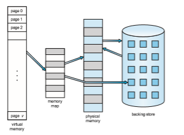
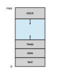
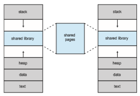

# Background

The memory-management algorithms outlined in Chapter 9 are necessary because of one basic requirement: the instructions being executed must be in physical memory. The first approach to meeting this requirement is to place the entire logical address space in physical memory. Dynamic linking can help to ease this restriction, but it generally requires special precautions and extra work by the programmer.

The requirement that instructions must be in physical memory to be exe- cuted seems both necessary and reasonable; but it is also unfortunate, since it limits the size of a program to the size of physical memory. In fact, an exami- nation of real programs shows us that, in many cases, the entire program is not needed. For instance, consider the following:

• Programs often have code to handle unusual error conditions. Since these errors seldom, if ever, occur in practice, this code is almost never executed.

• Arrays, lists, and tables are often allocated more memory than they actu- ally need. An array may be declared 100 by 100 elements, even though it is seldom larger than 10 by 10 elements.

• Certain options and features of a programmay be used rarely. For instance, the routines on U.S. government computers that balance the budget have not been used in many years.

Even in those cases where the entire program is needed, it may not all be needed at the same time.

The ability to execute a program that is only partially in memory would confer many benefits:

• A program would no longer be constrained by the amount of physical memory that is available. Users would be able to write programs for an extremely large **_virtual_** address space, simplifying the programming task.

• Because each program could take less physical memory, more programs could be run at the same time,with a corresponding increase in CPUutiliza- tion and throughput but with no increase in response time or turnaround time.

• Less I/O would be needed to load or swap portions of programs into memory, so each program would run faster.

Thus, running a program that is not entirely in memorywould benefit both the system and its users.

**Virtual memory** involves the separation of logical memory as perceived by developers from physical memory. This separation allows an extremely large virtual memory to be provided for programmers when only a smaller physical memory is available (Figure 10.1). Virtual memory makes the task of programming much easier, because the programmer no longer needs to worry about the amount of physical memory available; she can concentrate instead on programming the problem that is to be solved.

The **virtual address space** of a process refers to the logical (or virtual) view of how a process is stored in memory. Typically, this view is that a process begins at a certain logical address—say, address 0—and exists in contiguous memory, as shown in Figure 10.2. Recall from Chapter 9, though, that in fact physical memory is organized in page frames and that the physical page frames assigned to a process may not be contiguous. It is up to the memory-  

**Figure 10.1** Diagram showing virtual memory that is larger than physical memory.

management unit (MMU) to map logical pages to physical page frames in memory.

Note in Figure 10.2 that we allow the heap to grow upward in memory as it is used for dynamic memory allocation. Similarly, we allow for the stack to grow downward inmemory through successive function calls. The large blank space (or hole) between the heap and the stack is part of the virtual address space but will require actual physical pages only if the heap or stack grows. Virtual address spaces that include holes are known as **sparse** address spaces. Using a sparse address space is beneficial because the holes can be filled as the stack or heap segments grow or if we wish to dynamically link libraries (or possibly other shared objects) during program execution.

**Figure 10.2** Virtual address space of a process in memory.  

**Figure 10.3** Shared library using virtual memory.

In addition to separating logical memory from physical memory, virtual memory allows files and memory to be shared by two or more processes through page sharing (Section 9.3.4). This leads to the following benefits:

• System libraries such as the standard C library can be shared by several processes through mapping of the shared object into a virtual address space. Although each process considers the libraries to be part of its vir- tual address space, the actual pages where the libraries reside in physical memory are shared by all the processes (Figure 10.3). Typically, a library is mapped read-only into the space of each process that is linked with it.

• Similarly, processes can share memory. Recall from Chapter 3 that two or more processes can communicate through the use of shared memory. Virtualmemory allows one process to create a region ofmemory that it can share with another process. Processes sharing this region consider it part of their virtual address space, yet the actual physical pages of memory are shared, much as is illustrated in Figure 10.3.

• Pages can be shared during process creation with the fork() system call, thus speeding up process creation.

We further explore these—and other—benefits of virtual memory later in this chapter. First, though, we discuss implementing virtual memory through demand paging.