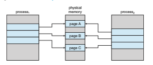

# Copy-on-Write

In Section 10.2, we illustrated how a process can start quickly by demand- paging in the page containing the first instruction. However, process creation using the fork() system call may initially bypass the need for demand paging by using a technique similar to page sharing (covered in Section 9.3.4). This technique provides rapid process creation and minimizes the number of new pages that must be allocated to the newly created process.

Recall that the fork() system call creates a child process that is a duplicate of its parent. Traditionally, fork() worked by creating a copy of the parent’s address space for the child, duplicating the pages belonging to the parent. However, considering thatmany child processes invoke the exec() system call immediately after creation, the copying of the parent’s address space may be unnecessary. Instead, we can use a technique known as **copy-on-write**, which works by allowing the parent and child processes initially to share the same pages. These shared pages are marked as copy-on-write pages, meaning that if either process writes to a shared page, a copy of the shared page is created. Copy-on-write is illustrated in Figures 10.7 and 10.8, which show the contents of the physical memory before and after process 1 modifies page C.

For example, assume that the child process attempts to modify a page containing portions of the stack, with the pages set to be copy-on-write. The operating system will obtain a frame from the free-frame list and create a copy  

**Figure 10.7** Before process 1 modifies page C.

of this page, mapping it to the address space of the child process. The child process will then modify its copied page and not the page belonging to the parent process. Obviously, when the copy-on-write technique is used, only the pages that are modified by either process are copied; all unmodified pages can be shared by the parent and child processes. Note, too, that only pages that can be modified need be marked as copy-on-write. Pages that cannot be modified (pages containing executable code) can be shared by the parent and child. Copy-on-write is a common technique used by several operating systems, including Windows, Linux, and macOS.

Several versions of UNIX (including Linux, macOS, and BSD UNIX) provide a variation of the fork() system call—vfork() (for **virtual memory fork**)— that operates differently from fork() with copy-on-write. With vfork(), the parent process is suspended, and the child process uses the address space of the parent. Because vfork() does not use copy-on-write, if the child process changes any pages of the parent’s address space, the altered pages will be visible to the parent once it resumes. Therefore, vfork() must be used with caution to ensure that the child process does not modify the address space of the parent. vfork() is intended to be usedwhen the child process calls exec() immediately after creation. Because no copying of pages takes place, vfork()

**Figure 10.8** After process 1 modifies page C.  

is an extremely efficient method of process creation and is sometimes used to implement UNIX command-line shell interfaces.