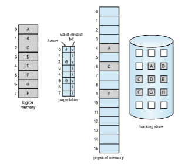
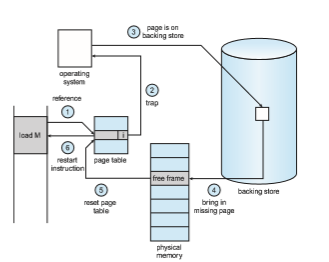

# Demand Paging

Consider how an executable programmight be loaded from secondary storage into memory. One option is to load the entire program in physical memory at program execution time. However, a problem with this approach is that  

we may not initially **_need_** the entire program in memory. Suppose a program starts with a list of available options from which the user is to select. Loading the entire program into memory results in loading the executable code for **_all_** options, regardless of whether or not an option is ultimately selected by the user.

An alternative strategy is to load pages only as they are needed. This tech- nique is known as **demand paging** and is commonly used in virtual memory systems. With demand-paged virtual memory, pages are loaded only when they are **_demanded_** during program execution. Pages that are never accessed are thus never loaded into physical memory. Ademand-paging system is simi- lar to a paging system with swapping (Section 9.5.2) where processes reside in secondary memory (usually an HDD or NVM device). Demand paging explains one of the primary benefits of virtual memory—by loading only the portions of programs that are needed, memory is used more efficiently.

## Basic Concepts

The general concept behind demand paging, as mentioned, is to load a page in memory only when it is needed. As a result, while a process is executing, some pageswill be inmemory, and somewill be in secondary storage. Thus, we need some form of hardware support to distinguish between the two. The valid– invalid bit scheme described in Section 9.3.3 can be used for this purpose. This

**Figure 10.4** Page table when some pages are not in main memory.  

time, however, when the bit is set to “valid,” the associated page is both legal and in memory. If the bit is set to “invalid,” the page either is not valid (that is, not in the logical address space of the process) or is valid but is currently in secondary storage. The page-table entry for a page that is brought intomemory is set as usual, but the page-table entry for a page that is not currently in memory is simply marked invalid. This situation is depicted in Figure 10.4. (Notice that marking a page invalid will have no effect if the process never attempts to access that page.)

But what happens if the process tries to access a page that was not brought intomemory? Access to a pagemarked invalid causes a **page fault**. The paging hardware, in translating the address through the page table, will notice that the invalid bit is set, causing a trap to the operating system. This trap is the result of the operating system’s failure to bring the desired page into memory. The procedure for handling this page fault is straightforward (Figure 10.5):

**1\.** We check an internal table (usually kept with the process control block) for this process to determine whether the reference was a valid or an invalid memory access.

**2\.** If the reference was invalid, we terminate the process. If it was valid but we have not yet brought in that page, we now page it in.

**3\.** We find a free frame (by taking one from the free-frame list, for example).

**Figure 10.5** Steps in handling a page fault.  

**4\.** We schedule a secondary storage operation to read the desired page into the newly allocated frame.

**5\.** When the storage read is complete,wemodify the internal table keptwith the process and the page table to indicate that the page is now inmemory.

**6\.** We restart the instruction that was interrupted by the trap. The process can now access the page as though it had always been in memory.

In the extreme case, we can start executing a process with **_no_** pages in memory. When the operating system sets the instruction pointer to the first instruction of the process,which is on a non-memory-resident page, the process immediately faults for the page. After this page is brought into memory, the process continues to execute, faulting as necessary until every page that it needs is in memory. At that point, it can execute with no more faults. This scheme is **pure demand paging**: never bring a page into memory until it is required.

Theoretically, some programs could access several new pages of memory with each instruction execution (one page for the instruction and many for data), possibly causing multiple page faults per instruction. This situation would result in unacceptable system performance. Fortunately, analysis of running processes shows that this behavior is exceedingly unlikely. Programs tend to have **locality of reference**, described in Section 10.6.1, which results in reasonable performance from demand paging.

The hardware to support demand paging is the same as the hardware for paging and swapping:

• **Page table**. This table has the ability to mark an entry invalid through a valid–invalid bit or a special value of protection bits.

• **Secondary memory**. This memory holds those pages that are not present in main memory. The secondary memory is usually a high-speed disk or NVM device. It is known as the swap device, and the section of storage used for this purpose is known as **swap space**. Swap-space allocation is discussed in Chapter 11.

A crucial requirement for demand paging is the ability to restart any instruction after a page fault. Because we save the state (registers, condi- tion code, instruction counter) of the interrupted process when the page fault occurs, we must be able to restart the process in **_exactly_** the same place and state, except that the desired page is now in memory and is accessible. In most cases, this requirement is easy to meet. A page fault may occur at any memory reference. If the page fault occurs on the instruction fetch, we can restart by fetching the instruction again. If a page fault occurs while we are fetching an operand, we must fetch and decode the instruction again and then fetch the operand.

As a worst-case example, consider a three-address instruction such as ADD the content of A to B, placing the result in C. These are the steps to execute this instruction:

**1\.** Fetch and decode the instruction (ADD).

**2\.** Fetch A.  

**396 Chapter 10 Virtual Memory**

**3\.** Fetch B.

**4\.** Add A and B.

**5\.** Store the sum in C.

If we fault when we try to store in C (because C is in a page not currently in memory), we will have to get the desired page, bring it in, correct the page table, and restart the instruction. The restart will require fetching the instruction again, decoding it again, fetching the two operands again, and then adding again. However, there is not much repeated work (less than one complete instruction), and the repetition is necessary only when a page fault occurs.

The major difficulty arises when one instruction may modify several dif- ferent locations. For example, consider the IBM System 360/370 MVC (move character) instruction, which can move up to 256 bytes from one location to another (possibly overlapping) location. If either block (source or destination) straddles a page boundary, a page fault might occur after the move is par- tially done. In addition, if the source and destination blocks overlap, the source block may have been modified, in which case we cannot simply restart the instruction.

This problem can be solved in two different ways. In one solution, the microcode computes and attempts to access both ends of both blocks. If a page fault is going to occur, it will happen at this step, before anything is modified. The move can then take place; we know that no page fault can occur, since all the relevant pages are in memory. The other solution uses temporary registers to hold the values of overwritten locations. If there is a page fault, all the old values arewritten back intomemory before the trap occurs. This action restores memory to its state before the instruction was started, so that the instruction can be repeated.

This is by no means the only architectural problem resulting from adding paging to an existing architecture to allow demand paging, but it illustrates some of the difficulties involved. Paging is added between the CPU and the memory in a computer system. It should be entirely transparent to a process. Thus, people often assume that paging can be added to any system. Although this assumption is true for a non-demand-paging environment, where a page fault represents a fatal error, it is not true where a page fault means only that an additional page must be brought into memory and the process restarted.

## Free-Frame List

When a page fault occurs, the operating system must bring the desired page from secondary storage into main memory. To resolve page faults, most oper- ating systems maintain a **free-frame list**, a pool of free frames for satisfying such requests (Figure 10.6). (Free frames must also be allocated when the stack or heap segments from a process expand.) Operating systems typically allo-

**Figure 10.6** List of free frames.  

cate free frames using a technique known as **zero-fill-on-deman** . Zero-fill- on-demand frames are “zeroed-out” before being allocated, thus erasing their previous contents. (Consider the potential security implications of **_not_** clearing out the contents of a frame before reassigning it.)

When a system starts up, all available memory is placed on the free-frame list. As free frames are requested (for example, through demand paging), the size of the free-frame list shrinks. At some point, the list either falls to zero or falls below a certain threshold, at which point it must be repopulated.We cover strategies for both of these situations in Section 10.4.

## Performance of Demand Paging

Demand paging can significantly affect the performance of a computer system. To see why, let’s compute the **effective access time** for a demand-paged mem- ory. Assume the memory-access time, denoted _ma,_ is 10 nanoseconds. As long as we have no page faults, the effective access time is equal to the memory access time. If, however, a page fault occurs, we must first read the relevant page from secondary storage and then access the desired word.

Let _p_ be the probability of a page fault (0 ≤ _p_ ≤ 1). We would expect _p_ to be close to zero—that is, we would expect to have only a few page faults. The effective access time is then

effective access time = (1 − _p_) × _ma_ \+ _p_ × page fault time.

To compute the effective access time, we must know how much time is needed to service a page fault. A page fault causes the following sequence to occur:

**1\.** Trap to the operating system.

**2\.** Save the registers and process state.

**3\.** Determine that the interrupt was a page fault.

**4\.** Check that the page referencewas legal, and determine the location of the page in secondary storage.

**5\.** Issue a read from the storage to a free frame:

a. Wait in a queue until the read request is serviced.

b. Wait for the device seek and/or latency time.

c. Begin the transfer of the page to a free frame.

**6\.** While waiting, allocate the CPU core to some other process.

**7\.** Receive an interrupt from the storage I/O subsystem (I/O completed).

**8\.** Save the registers and process state for the other process (if step 6 is executed).

**9\.** Determine that the interrupt was from the secondary storage device.

**10\.** Correct the page table and other tables to show that the desired page is now in memory.

**11\.** Wait for the CPU core to be allocated to this process again.  

**12\.** Restore the registers, process state, and new page table, and then resume the interrupted instruction.

Not all of these steps are necessary in every case. For example,we are assuming that, in step 6, the CPU is allocated to another process while the I/O occurs. This arrangement allows multiprogramming to maintain CPU utilization but requires additional time to resume the page-fault service routine when the I/O transfer is complete.

In any case, there are threemajor task components of the page-fault service time:

**1\.** Service the page-fault interrupt.

**2\.** Read in the page.

**3\.** Restart the process.

The first and third tasks can be reduced, with careful coding, to several hundred instructions. These tasks may take from 1 to 100 microseconds each. Let’s consider the case of HDDs being used as the paging device. The page- switch time will probably be close to 8 milliseconds. (A typical hard disk has an average latency of 3 milliseconds, a seek of 5 milliseconds, and a transfer time of 0.05 milliseconds. Thus, the total paging time is about 8 milliseconds, including hardware and software time.) Remember also that we are looking at only the device-service time. If a queue of processes is waiting for the device, we have to add queuing time as we wait for the paging device to be free to service our request, increasing even more the time to page in.

With an average page-fault service time of 8 milliseconds and a memory- access time of 200 nanoseconds, the effective access time in nanoseconds is

effective access time = (1 − _p_) × (200) + _p_ (8 milliseconds) = (1 − _p_) × 200 + _p_ × 8,000,000 = 200 + 7,999,800 × _p._

We see, then, that the effective access time is directly proportional to the **page-fault rate**. If one access out of 1,000 causes a page fault, the effective access time is 8.2 microseconds. The computer will be slowed down by a factor of 40 because of demandpaging! Ifwewant performance degradation to be less than 10 percent, we need to keep the probability of page faults at the following level:

220 _\>_ 200 + 7,999,800 × _p,_ 20 _\>_ 7,999,800 × _p_, _p <_ 0.0000025.

That is, to keep the slowdown due to paging at a reasonable level, we can allow fewer that one memory access out of 399,990 to page-fault. In sum, it is impor- tant to keep the page-fault rate low in a demand-paging system. Otherwise, the effective access time increases, slowing process execution dramatically.

An additional aspect of demand paging is the handling and overall use of swap space. I/O to swap space is generally faster than that to the file system. It is faster because swap space is allocated inmuch larger blocks, and file lookups and indirect allocation methods are not used (Chapter 11). One option for the  

system to gain better paging throughput is by copying an entire file image into the swap space at process startup and then performing demand paging from the swap space. The obvious disadvantage of this approach is the copying of the file image at program start-up. A second option—and one practiced by several operating systems, including Linux andWindows—is to demand-page from the file system initially but to write the pages to swap space as they are replaced. This approach will ensure that only needed pages are read from the file system but that all subsequent paging is done from swap space.

Some systems attempt to limit the amount of swap space used through demand paging of binary executable files. Demand pages for such files are brought directly from the file system. However, when page replacement is called for, these frames can simply be overwritten (because they are never modified), and the pages can be read in from the file system again if needed. Using this approach, the file system itself serves as the backing store. However, swap space must still be used for pages not associated with a file (known as **anonymous memory**); these pages include the stack and heap for a process. This method appears to be a good compromise and is used in several systems, including Linux and BSD UNIX.

As described in Section 9.5.3, mobile operating systems typically do not support swapping. Instead, these systems demand-page from the file sys- tem and reclaim read-only pages (such as code) from applications if memory becomes constrained. Such data can be demand-paged from the file system if it is later needed. Under iOS, anonymous memory pages are never reclaimed from an application unless the application is terminated or explicitly releases the memory. In Section 10.7, we cover compressed memory, a commonly used alternative to swapping in mobile systems.