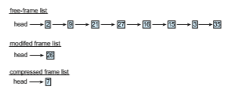

# Memory Compression

An alternative to paging is **memory compression**. Here, rather than paging out modified frames to swap space, we compress several frames into a single frame, enabling the system to reduce memory usage without resorting to swapping pages.

In Figure 10.24, the free-frame list contains six frames. Assume that this number of free frames falls below a certain threshold that triggers page replace- ment. The replacement algorithm (say, an LRUapproximation algorithm) selects four frames—15, 3, 35, and 26—to place on the free-frame list. It first places these frames on amodified-frame list. Typically, the modified-frame list would next be written to swap space, making the frames available to the free-frame list. An alternative strategy is to compress a number of frames—say, three— and store their compressed versions in a single page frame.

In Figure 10.25, frame 7 is removed from the free-frame list. Frames 15, 3, and 35 are compressed and stored in frame 7, which is then stored in the list of compressed frames. The frames 15, 3, and 35 can now be moved to the free-frame list. If one of the three compressed frames is later referenced, a page fault occurs, and the compressed frame is decompressed, restoring the three pages 15, 3, and 35 in memory.

**Figure 10.24** Free-frame list before compression.  

**Figure 10.25** Free-frame list after compression

As we have noted, mobile systems generally do not support either stan- dard swapping or swapping pages. Thus, memory compression is an integral part of the memory-management strategy for most mobile operating systems, including Android and iOS. In addition, both Windows 10 and macOS support memory compression. For Windows 10, Microsoft developed the **Universal Windows Platform** (**UWP**) architecture, which provides a common app plat- form for devices that run Windows 10, including mobile devices. UWP apps running on mobile devices are candidates for memory compression. macOS first supported memory compression with Version 10.9 of the operating sys- tem, first compressing LRU pages when free memory is short and then paging if that doesn’t solve the problem. Performance tests indicate that memory com- pression is faster than paging even to SSD secondary storage on laptop and desktop macOS systems.

Although memory compression does require allocating free frames to hold the compressed pages, a significant memory saving can be realized, depending on the reductions achieved by the compression algorithm. (In the example above, the three frames were reduced to one-third of their original size.) As with any form of data compression, there is contention between the speed of the compression algorithm and the amount of reduction that can be achieved (known as the **compression ratio**). In general, higher compression ratios (greater reductions) can be achieved by slower, more computationally expensive algorithms. Most algorithms in use today balance these two factors, achieving relatively high compression ratios using fast algorithms. In addition, compression algorithms have improved by taking advantage of multiple com- puting cores and performing compression in parallel. For example,Microsoft’s Xpress and Apple’s WKdm compression algorithms are considered fast, and they report compressing pages to 30 to 50 percent of their original size.