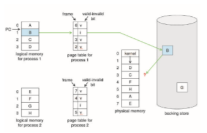
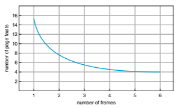
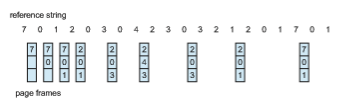

# Page Replacement

In our earlier discussion of the page-fault rate, we assumed that each page faults at most once, when it is first referenced. This representation is not strictly accurate, however. If a process of ten pages actually uses only half of them, then demand paging saves the I/O necessary to load the five pages that are never used. We could also increase our degree of multiprogramming by running twice as many processes. Thus, if we had forty frames, we could run eight processes, rather than the four that could run if each required ten frames (five of which were never used).

If we increase our degree of multiprogramming, we are **over-allocating** memory. If we run six processes, each of which is ten pages in size but actually uses only five pages, we have higher CPU utilization and throughput, with ten frames to spare. It is possible, however, that each of these processes, for a particular data set, may suddenly try to use all ten of its pages, resulting in a need for sixty frames when only forty are available.

Further, consider that systemmemory is not usedonly for holding program pages. Buffers for I/O also consume a considerable amount ofmemory. This use can increase the strain on memory-placement algorithms. Deciding howmuch memory to allocate to I/O and how much to program pages is a significant challenge. Some systems allocate a fixed percentage of memory for I/O buffers, whereas others allow both processes and the I/O subsystem to compete for all systemmemory. Section 14.6 discusses the integrated relationship between I/O buffers and virtual memory techniques.

Over-allocation of memory manifests itself as follows. While a process is executing, a page fault occurs. The operating system determines where the desired page is residing on secondary storage but then finds that there are **_no_** free frames on the free-frame list; all memory is in use. This situation is illustrated in Figure 10.9, where the fact that there are no free frames is depicted by a question mark.

The operating system has several options at this point. It could terminate the process. However, demand paging is the operating system’s attempt to improve the computer system’s utilization and throughput. Users should not be aware that their processes are running on a paged system—paging should be logically transparent to the user. So this option is not the best choice.

The operating system could instead use standard swapping and swap out a process, freeing all its frames and reducing the level of multiprogram- ming. However, as discussed in Section 9.5, standard swapping is no longer used by most operating systems due to the overhead of copying entire pro- cesses between memory and swap space. Most operating systems now com- bine swapping pageswith **page replacement**, a techniquewe describe in detail in the remainder of this section.

## Basic Page Replacement

Page replacement takes the following approach. If no frame is free, we find one that is not currently being used and free it. We can free a frame by writing its  

**Figure 10.9** Need for page replacement.

contents to swap space and changing the page table (and all other tables) to indicate that the page is no longer in memory (Figure 10.10). We can now use the freed frame to hold the page for which the process faulted. We modify the page-fault service routine to include page replacement:

**1\.** Find the location of the desired page on secondary storage.

**2\.** Find a free frame:

a. If there is a free frame, use it.

b. If there is no free frame, use a page-replacement algorithm to select a **victim frame**.

c. Write the victim frame to secondary storage (if necessary); change the page and frame tables accordingly.

**3\.** Read the desired page into the newly freed frame; change the page and frame tables.

**4\.** Continue the process from where the page fault occurred.

Notice that, if no frames are free, **_two_** page transfers (one for the page-out and one for the page-in) are required. This situation effectively doubles the page-fault service time and increases the effective access time accordingly.

We can reduce this overhead by using a **modify bit** (or **dirty bit**).When this scheme is used, each page or frame has a modify bit associated with it in the hardware. The modify bit for a page is set by the hardware whenever any byte in the page is written into, indicating that the page has been modified. When we select a page for replacement, we examine its modify bit. If the bit is set,  

**Figure 10.10** Page replacement.

we know that the page has been modified since it was read in from secondary storage. In this case, we must write the page to storage. If the modify bit is not set, however, the page has **_not_** beenmodified since it was read into memory. In this case, we need notwrite thememory page to storage: it is already there. This technique also applies to read-only pages (for example, pages of binary code). Such pages cannot be modified; thus, they may be discarded when desired. This scheme can significantly reduce the time required to service a page fault, since it reduces I/O time by one-half **_if_** the page has not been modified.

Page replacement is basic to demand paging. It completes the separation between logical memory and physical memory.With this mechanism, an enor- mous virtual memory can be provided for programmers on a smaller physical memory. With no demand paging, logical addresses are mapped into physical addresses, and the two sets of addresses can be different. All the pages of a process still must be in physical memory, however. With demand paging, the size of the logical address space is no longer constrained by physical memory. If we have a process of twenty pages, we can execute it in ten frames simply by using demand paging and using a replacement algorithm to find a free frame whenever necessary. If a page that has been modified is to be replaced, its contents are copied to secondary storage. A later reference to that page will cause a page fault. At that time, the page will be brought back into memory, perhaps replacing some other page in the process.

Wemust solve twomajor problems to implement demandpaging:wemust develop a **frame-allocation algorithm** and a **page-replacement algorithm**. That is, if we have multiple processes in memory, we must decide how many frames to allocate to each process; and when page replacement is required, we must select the frames that are to be replaced. Designing appropriate algo- rithms to solve these problems is an important task, because secondary storage  

I/O is so expensive. Even slight improvements in demand-paging methods yield large gains in system performance.

There are many different page-replacement algorithms. Every operating system probably has its own replacement scheme. How do we select a par- ticular replacement algorithm? In general, we want the one with the lowest page-fault rate.

We evaluate an algorithm by running it on a particular string of memory references and computing the number of page faults. The string of memory references is called a **reference string**. We can generate reference strings arti- ficially (by using a random-number generator, for example), or we can trace a given system and record the address of each memory reference. The latter choice produces a large number of data (on the order of 1 million addresses per second). To reduce the number of data, we use two facts.

First, for a given page size (and the page size is generally fixed by the hard- ware or system), we need to consider only the page number, rather than the entire address. Second, if we have a reference to a page _p,_ then any references to page _p_ that **_immediately_** follow will never cause a page fault. Page _p_ will be in memory after the first reference, so the immediately following references will not fault.

For example, if we trace a particular process, wemight record the following address sequence:

0100, 0432, 0101, 0612, 0102, 0103, 0104, 0101, 0611, 0102, 0103, 0104, 0101, 0610, 0102, 0103, 0104, 0101, 0609, 0102, 0105

At 100 bytes per page, this sequence is reduced to the following reference string:

1, 4, 1, 6, 1, 6, 1, 6, 1, 6, 1

To determine the number of page faults for a particular reference string and page-replacement algorithm, we also need to know the number of page frames available. Obviously, as the number of frames available increases, the number of page faults decreases. For the reference string considered previously, for example, if we had three or more frames, we would have only three faults— one fault for the first reference to each page. In contrast, with only one frame available, we would have a replacement with every reference, resulting in eleven faults. In general, we expect a curve such as that in Figure 10.11. As the number of frames increases, the number of page faults drops to some minimal level. Of course, adding physical memory increases the number of frames.

We next illustrate several page-replacement algorithms. In doing so, we use the reference string

7, 0, 1, 2, 0, 3, 0, 4, 2, 3, 0, 3, 2, 1, 2, 0, 1, 7, 0, 1

for a memory with three frames.

## FIFO Page Replacement

The simplest page-replacement algorithm is a first-in, first-out (FIFO) algo- rithm. A FIFO replacement algorithm associates with each page the time when that page was brought into memory. When a page must be replaced, the oldest page is chosen. Notice that it is not strictly necessary to record the time when a  

**Figure 10.11** Graph of page faults versus number of frames.

page is brought in. We can create a FIFO queue to hold all pages in memory.We replace the page at the head of the queue.When a page is brought intomemory, we insert it at the tail of the queue.

For our example reference string, our three frames are initially empty. The first three references (7, 0, 1) cause page faults and are brought into these empty frames. The next reference (2) replaces page 7, because page 7 was brought in first. Since 0 is the next reference and 0 is already in memory, we have no fault for this reference. The first reference to 3 results in replacement of page 0, since it is now first in line. Because of this replacement, the next reference, to 0, will fault. Page 1 is then replaced by page 0. This process continues as shown in Figure 10.12. Every time a fault occurs, we show which pages are in our three frames. There are fifteen faults altogether.

The FIFO page-replacement algorithm is easy to understand and program. However, its performance is not always good. On the one hand, the page replaced may be an initialization module that was used a long time ago and is no longer needed. On the other hand, it could contain a heavily used variable that was initialized early and is in constant use.

Notice that, even if we select for replacement a page that is in active use, everything still works correctly. After we replace an active page with a new

**Figure 10.12** FIFO page-replacement algorithm.  

**Figure 10.13** Page-fault curve for FIFO replacement on a reference string.

one, a fault occurs almost immediately to retrieve the active page. Some other page must be replaced to bring the active page back into memory. Thus, a bad replacement choice increases the page-fault rate and slows process execution. It does not, however, cause incorrect execution.

To illustrate the problems that are possible with a FIFO page-replacement algorithm, consider the following reference string:

1, 2, 3, 4, 1, 2, 5, 1, 2, 3, 4, 5

Figure 10.13 shows the curve of page faults for this reference string versus the number of available frames. Notice that the number of faults for four frames (ten) is **_greater_** than the number of faults for three frames (nine)! This most unexpected result is known as **Belady’s anomaly**: for some page-replacement algorithms, the page-fault rate may **_increase_** as the number of allocated frames increases. We would expect that giving more memory to a process would improve its performance. In some early research, investigators noticed that this assumption was not always true. Belady’s anomaly was discovered as a result.

## Optimal Page Replacement

One result of the discovery of Belady’s anomaly was the search for an **optimal page-replacement algorithm**—the algorithm that has the lowest page-fault rate of all algorithms and will never suffer from Belady’s anomaly. Such an algorithm does exist and has been called OPT or MIN. It is simply this:

Replace the page that will not be used for the longest period of time.

Use of this page-replacement algorithm guarantees the lowest possible page- fault rate for a fixed number of frames.

For example, on our sample reference string, the optimal page-replacement algorithmwould yield nine page faults, as shown in Figure 10.14. The first three references cause faults that fill the three empty frames. The reference to page 2 replaces page 7, because page 7 will not be used until reference 18, whereas  

**Figure 10.14** Optimal page-replacement algorithm.

page 0 will be used at 5, and page 1 at 14. The reference to page 3 replaces page 1, as page 1 will be the last of the three pages in memory to be referenced again. With only nine page faults, optimal replacement is much better than a FIFO algorithm, which results in fifteen faults. (If we ignore the first three, which all algorithms must suffer, then optimal replacement is twice as good as FIFO replacement.) In fact, no replacement algorithm can process this reference string in three frames with fewer than nine faults.

Unfortunately, the optimal page-replacement algorithm is difficult to implement, because it requires future knowledge of the reference string. (We encountered a similar situation with the SJF CPU-scheduling algorithm in Section 5.3.2.) As a result, the optimal algorithm is usedmainly for comparison studies. For instance, it may be useful to know that, although a new algorithm is not optimal, it is within 12.3 percent of optimal at worst and within 4.7 percent on average.

## LRU Page Replacement

If the optimal algorithm is not feasible, perhaps an approximation of the opti- mal algorithm is possible. The key distinction between the FIFO and OPT algo- rithms (other than looking backward versus forward in time) is that the FIFO algorithm uses the time when a page was brought into memory, whereas the OPT algorithm uses the timewhen a page is to be **_used._** If we use the recent past as an approximation of the near future, then we can replace the page that **_has not been used_** for the longest period of time. This approach is the **least recently used (LRU) algorithm**.

LRU replacement associates with each page the time of that page’s last use. When a page must be replaced, LRU chooses the page that has not been used for the longest period of time. We can think of this strategy as the optimal page-replacement algorithm looking backward in time, rather than forward. (Strangely, if we let _SR_ be the reverse of a reference string _S,_ then the page-fault rate for the OPT algorithm on _S_ is the same as the page-fault rate for the OPT algorithm on _SR_. Similarly, the page-fault rate for the LRU algorithm on _S_ is the same as the page-fault rate for the LRU algorithm on _SR_.)

The result of applying LRU replacement to our example reference string is shown in Figure 10.15. The LRU algorithm produces twelve faults. Notice that the first five faults are the same as those for optimal replacement. When the reference to page 4 occurs, however, LRU replacement sees that, of the three frames in memory, page 2 was used least recently. Thus, the LRU algorithm replaces page 2, not knowing that page 2 is about to be used.When it then faults  

**Figure 10.15** LRU page-replacement algorithm.

for page 2, the LRU algorithm replaces page 3, since it is now the least recently used of the three pages in memory. Despite these problems, LRU replacement with twelve faults is much better than FIFO replacement with fifteen.

The LRU policy is often used as a page-replacement algorithm and is con- sidered to be good. The major problem is **_how_** to implement LRU replacement. An LRU page-replacement algorithm may require substantial hardware assis- tance. The problem is to determine an order for the frames defined by the time of last use. Two implementations are feasible:

• **Counters**. In the simplest case, we associate with each page-table entry a time-of-use field and add to the CPU a logical clock or counter. The clock is incremented for every memory reference. Whenever a reference to a page is made, the contents of the clock register are copied to the time-of-use field in the page-table entry for that page. In this way, we always have the “time” of the last reference to each page. We replace the page with the smallest time value. This scheme requires a search of the page table to find the LRU page and a write to memory (to the time-of-use field in the page table) for each memory access. The times must also be maintained when page tables are changed (due to CPU scheduling). Overflow of the clock must be considered.

• **Stack**. Another approach to implementing LRU replacement is to keep a stack of page numbers. Whenever a page is referenced, it is removed from the stack and put on the top. In this way, the most recently used page is always at the top of the stack, and the least recently used page is always at the bottom (Figure 10.16). Because entries must be removed from the middle of the stack, it is best to implement this approach by using a doubly linked list with a head pointer and a tail pointer. Removing a page and putting it on the top of the stack then requires changing six pointers at worst. Each update is a little more expensive, but there is no search for a replacement; the tail pointer points to the bottom of the stack, which is the LRU page. This approach is particularly appropriate for software or microcode implementations of LRU replacement.

Like optimal replacement, LRU replacement does not suffer from Belady’s anomaly. Both belong to a class of page-replacement algorithms, called **stack algorithms**, that can never exhibit Belady’s anomaly. A stack algorithm is an algorithm for which it can be shown that the set of pages in memory for _n_ frames is always a **_subset_** of the set of pages that would be in memory with _n_  

**Figure 10.16** Use of a stack to record the most recent page references.

\+ 1 frames. For LRU replacement, the set of pages in memory would be the _n_ most recently referenced pages. If the number of frames is increased, these _n_ pages will still be the most recently referenced and so will still be in memory.

Note that neither implementation of LRU would be conceivable without hardware assistance beyond the standard TLB registers. The updating of the clock fields or stack must be done for **_every_** memory reference. If we were to use an interrupt for every reference to allow software to update such data structures, it would slow every memory reference by a factor of at least ten, hence slowing every process by a factor of ten. Few systems could tolerate that level of overhead for memory management.

## LRU-Approximation Page Replacement

Not many computer systems provide sufficient hardware support for true LRU page replacement. In fact, some systems provide no hardware support, and other page-replacement algorithms (such as a FIFO algorithm) must be used. Many systems provide some help, however, in the form of a **reference bit**. The reference bit for a page is set by the hardware whenever that page is referenced (either a read or a write to any byte in the page). Reference bits are associated with each entry in the page table.

Initially, all bits are cleared (to 0) by the operating system. As a process executes, the bit associated with each page referenced is set (to 1) by the hardware. After some time,we can determinewhich pages have been used and which have not been used by examining the reference bits, although we do not know the **_order_** of use. This information is the basis formany page-replacement algorithms that approximate LRU replacement.

### Additional-Reference-Bits Algorithm

We can gain additional ordering information by recording the reference bits at regular intervals. We can keep an 8-bit byte for each page in a table in memory. At regular intervals (say, every 100 milliseconds), a timer interrupt transfers control to the operating system. The operating system shifts the reference bit for each page into the high-order bit of its 8-bit byte, shifting the other bits right  

by 1 bit and discarding the low-order bit. These 8-bit shift registers contain the history of page use for the last eight time periods. If the shift register contains 00000000, for example, then the page has not been used for eight time periods. A page that is used at least once in each period has a shift register value of 11111111. A page with a history register value of 11000100 has been used more recently than one with a value of 01110111. If we interpret these 8-bit bytes as unsigned integers, the page with the lowest number is the LRU page, and it can be replaced.Notice that the numbers are not guaranteed to be unique, however. We can either replace (swap out) all pages with the smallest value or use the FIFO method to choose among them.

The number of bits of history included in the shift register can be varied, of course, and is selected (depending on the hardware available) to make the updating as fast as possible. In the extreme case, the number can be reduced to zero, leaving only the reference bit itself. This algorithm is called the **second- chance page-replacement algorithm**.

### Second-Chance Algorithm

The basic algorithm of second-chance replacement is a FIFO replacement algo- rithm. When a page has been selected, however, we inspect its reference bit. If the value is 0, we proceed to replace this page; but if the reference bit is set to 1, we give the page a second chance and move on to select the next FIFO page. When a page gets a second chance, its reference bit is cleared, and its arrival time is reset to the current time. Thus, a page that is given a second chance will not be replaced until all other pages have been replaced (or given second chances). In addition, if a page is used often enough to keep its reference bit set, it will never be replaced.

One way to implement the second-chance algorithm (sometimes referred to as the **clock** algorithm) is as a circular queue. A pointer (that is, a hand on the clock) indicates which page is to be replaced next. When a frame is needed, the pointer advances until it finds a page with a 0 reference bit. As it advances, it clears the reference bits (Figure 10.17). Once a victim page is found, the page is replaced, and the new page is inserted in the circular queue in that position. Notice that, in the worst case, when all bits are set, the pointer cycles through the whole queue, giving each page a second chance. It clears all the reference bits before selecting the next page for replacement. Second-chance replacement degenerates to FIFO replacement if all bits are set.

### Enhanced Second-Chance Algorithm

We can enhance the second-chance algorithm by considering the reference bit and the modify bit (described in Section 10.4.1) as an ordered pair. With these two bits, we have the following four possible classes:

**1\.** (0, 0) neither recently used nor modified—best page to replace

**2\.** (0, 1) not recently used butmodified—not quite as good, because the page will need to be written out before replacement

**3\.** (1, 0) recently used but clean—probably will be used again soon  

**Figure 10.17** Second-chance (clock) page-replacement algorithm.

**4\.** (1, 1) recently used andmodified—probablywill be used again soon, and the page will be need to be written out to secondary storage before it can be replaced

Each page is in one of these four classes. When page replacement is called for, we use the same scheme as in the clock algorithm; but instead of examining whether the page to which we are pointing has the reference bit set to 1, we examine the class to which that page belongs. We replace the first page encountered in the lowest nonempty class. Notice that wemay have to scan the circular queue several times before we find a page to be replaced. The major difference between this algorithm and the simpler clock algorithm is that here we give preference to those pages that have been modified in order to reduce the number of I/Os required.

## Counting-Based Page Replacement

There are many other algorithms that can be used for page replacement. For example, we can keep a counter of the number of references that have been made to each page and develop the following two schemes.

• The **least frequently used** (**LFU**) page-replacement algorithm requires that the pagewith the smallest count be replaced. The reason for this selection is that an actively used page should have a large reference count. A problem arises, however, when a page is used heavily during the initial phase of  

a process but then is never used again. Since it was used heavily, it has a large count and remains in memory even though it is no longer needed. One solution is to shift the counts right by 1 bit at regular intervals, forming an exponentially decaying average usage count.

• The **most frequently used** (**MFU**) page-replacement algorithm is based on the argument that the page with the smallest count was probably just brought in and has yet to be used.

As youmight expect, neither MFU nor LFU replacement is common. The imple- mentation of these algorithms is expensive, and they do not approximate OPT replacement well.

## Page-Buffering Algorithms

Other procedures are often used in addition to a specific page-replacement algorithm. For example, systems commonly keep a pool of free frames. When a page fault occurs, a victim frame is chosen as before. However, the desired page is read into a free frame from the pool before the victim iswritten out. This procedure allows the process to restart as soon as possible, without waiting for the victim page to bewritten out.When the victim is later written out, its frame is added to the free-frame pool.

An expansion of this idea is to maintain a list of modified pages.Whenever the pagingdevice is idle, amodifiedpage is selected and iswritten to secondary storage. Its modify bit is then reset. This scheme increases the probability that a page will be clean when it is selected for replacement and will not need to be written out.

Another modification is to keep a pool of free frames but to remember which pagewas in each frame. Since the frame contents are not modifiedwhen a frame iswritten to secondary storage, the oldpage can be reuseddirectly from the free-frame pool if it is needed before that frame is reused. No I/O is needed in this case. When a page fault occurs, we first check whether the desired page is in the free-frame pool. If it is not, we must select a free frame and read into it.

Some versions of the UNIX system use this method in conjunction with the second-chance algorithm. It can be a useful augmentation to any page- replacement algorithm, to reduce the penalty incurred if thewrong victimpage is selected. We describe these—and other—modifications in Section 10.5.3.

## Applications and Page Replacement

In certain cases, applications accessing data through the operating system’s vir- tual memory perform worse than if the operating system provided no buffer- ing at all. A typical example is a database, which provides its own memory management and I/O buffering. Applications like this understand their mem- ory use and storage use better than does an operating system that is implement- ing algorithms for general-purpose use. Furthermore, if the operating system is buffering I/O and the application is doing so as well, then twice the memory is being used for a set of I/O.

In another example, data warehouses frequently performmassive sequen- tial storage reads, followed by computations and writes. The LRU algorithm would be removing old pages and preserving new ones, while the applica- tion would more likely be reading older pages than newer ones (as it starts its sequential reads again). Here, MFU would actually be more efficient than LRU.

Because of such problems, some operating systems give special programs the ability to use a secondary storage partition as a large sequential array of logical blocks, without any file-system data structures. This array is some- times called the **raw disk**, and I/O to this array is termed raw I/O. Raw I/O bypasses all the file-system services, such as file I/O demand paging, file locking, prefetching, space allocation, file names, and directories. Note that although certain applications are more efficient when implementing their own special-purpose storage services on a raw partition, most applications perform better when they use the regular file-system services.