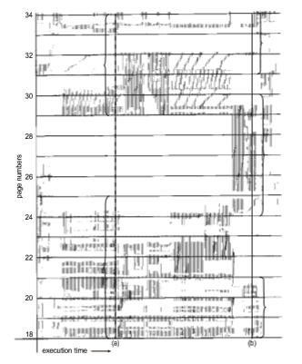
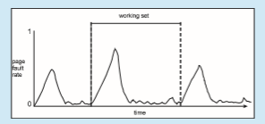
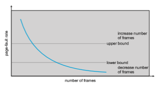

## Thrashing

Consider what occurs if a process does not have “enough” frames—that is, it does not have the minimum number of frames it needs to support pages in the working set. The process will quickly page-fault. At this point, it must replace some page. However, since all its pages are in active use, it must replace a page that will be needed again right away. Consequently, it quickly faults again, and again, and again, replacing pages that it must bring back in immediately.

This high paging activity is called **thrashing**. A process is thrashing if it is spending more time paging than executing. As you might expect, thrashing results in severe performance problems.

### Cause of Thrashing

Consider the following scenario, which is based on the actual behavior of early paging systems. The operating systemmonitors CPU utilization. If CPU utilization is too low, we increase the degree of multiprogramming by introducing a new process to the system. A global page-replacement algorithm is used; it replaces pages without regard to the process to which they belong. Now suppose that a process enters a new phase in its execution and needs more frames. It starts faulting and taking frames away from other processes. These processes need those pages, however, and so they also fault, taking frames from other processes. These faulting processes must use the paging device to swap pages in and out. As they queue up for the paging device, the ready queue empties. As processes wait for the paging device, CPU utilization decreases.

The CPU scheduler sees the decreasing CPU utilization and **_increases_** the degree ofmultiprogramming as a result. The new process tries to get started by taking frames from running processes, causing more page faults and a longer queue for the paging device. As a result, CPU utilization drops even further, and the CPU scheduler tries to increase the degree of multiprogramming even more. Thrashing has occurred, and system throughput plunges. The page- fault rate increases tremendously. As a result, the effectivememory-access time increases. Nowork is getting done, because the processes are spending all their time paging.

This phenomenon is illustrated in Figure 10.20, in which CPU utilization is plotted against the degree of multiprogramming. As the degree of multi- programming increases, CPU utilization also increases, although more slowly, until a maximum is reached. If the degree of multiprogramming is increased further, thrashing sets in, and CPU utilization drops sharply. At this point, to increase CPU utilization and stop thrashing, we must **_decrease_** the degree of multiprogramming.

We can limit the effects of thrashing by using a **local replacement algo- rithm** (or **priority replacement algorithm**). Asmentioned earlier, local replace- ment requires that each process select from only its own set of allocated frames. Thus, if one process starts thrashing, it cannot steal frames from another pro- cess and cause the latter to thrash as well. However, the problem is not entirely solved. If processes are thrashing, they will be in the queue for the paging device most of the time. The average service time for a page fault will increase

**Figure 10.20** Thrashing.  

because of the longer average queue for the paging device. Thus, the effective access time will increase even for a process that is not thrashing.

To prevent thrashing, we must provide a process with as many frames as it needs. But how do we know how many frames it “needs”? One strategy starts by looking at howmany frames a process is actually using. This approach defines the **locality model** of process execution.

The locality model states that, as a process executes, it moves from locality to locality. A locality is a set of pages that are actively used together. A running program is generally composed of several different localities, which may over- lap. For example, when a function is called, it defines a new locality. In this

**Figure 10.21** Locality in a memory-reference pattern.  

**Figure 10.22** Working-set model.

locality, memory references are made to the instructions of the function call, its local variables, and a subset of the global variables. When we exit the function, the process leaves this locality, since the local variables and instructions of the function are no longer in active use. We may return to this locality later.

Figure 10.21 illustrates the concept of locality and how a process’s locality changes over time. At time (_a_), the locality is the set of pages {18, 19, 20, 21, 22, 23, 24, 29, 30, 33}. At time (_b_), the locality changes to {18, 19, 20, 24, 25, 26, 27, 28, 29, 31, 32, 33}. Notice the overlap, as some pages (for example, 18, 19, and 20) are part of both localities.

Thus, we see that localities are defined by the program structure and its data structures. The locality model states that all programs will exhibit this basic memory reference structure. Note that the locality model is the unstated principle behind the caching discussions so far in this book. If accesses to any types of data were random rather than patterned, caching would be useless.

Suppose we allocate enough frames to a process to accommodate its cur- rent locality. It will fault for the pages in its locality until all these pages are in memory; then, it will not fault again until it changes localities. If we do not allocate enough frames to accommodate the size of the current locality, the process will thrash, since it cannot keep in memory all the pages that it is actively using.

### Working-Set Model

The **working-set model** is based on the assumption of locality. This model uses a parameter,Δ, to define the **working-set window**. The idea is to examine the most recent Δ page references. The set of pages in the most recent Δ page references is the**working set** (Figure 10.22). If a page is in active use, it will be in the working set. If it is no longer being used, it will drop from the working set Δ time units after its last reference. Thus, the working set is an approximation of the program’s locality.

For example, given the sequence of memory references shown in Figure 10.22, if Δ = 10 memory references, then the working set at time _t_1 is _{_1, 2, 5, 6, 7_}_. By time _t_2, the working set has changed to _{_3, 4_}_.

The accuracy of the working set depends on the selection of Δ. If Δ is too small, it will not encompass the entire locality; if Δ is too large, it may overlap several localities. In the extreme, if Δ is infinite, the working set is the set of pages touched during the process execution.

The most important property of the working set, then, is its size. If we compute the working-set size, _WSSi_, for each process in the system, we can then consider that  

_D_ \= ∑ _WSSi_,

where_D_ is the total demand for frames. Each process is actively using the pages in its working set. Thus, process _i_ needs _WSSi_ frames. If the total demand is greater than the total number of available frames (_D >m_), thrashing will occur, because some processes will not have enough frames.

Once Δ has been selected, use of the working-set model is simple. The operating system monitors the working set of each process and allocates to that working set enough frames to provide it with its working-set size. If there are enough extra frames, another process can be initiated. If the sum of the working-set sizes increases, exceeding the total number of available frames, the operating system selects a process to suspend. The process’s pages are written out (swapped), and its frames are reallocated to other processes. The suspended process can be restarted later.

This working-set strategy prevents thrashing while keeping the degree of multiprogramming as high as possible. Thus, it optimizes CPU utilization. The difficulty with the working-set model is keeping track of the working set. The

**_WORKING SETS AND PAGE-FAULT RATES_**

There is a direct relationship between the working set of a process and its page-fault rate. Typically, as shown in Figure 10.22, the working set of a process changes over time as references to data and code sections move from one locality to another. Assuming there is sufficient memory to store the working set of a process (that is, the process is not thrashing), the page-fault rate of the process will transition between peaks and valleys over time. This general behavior is shown below:

Apeak in the page-fault rate occurs whenwe begin demand-paging a new locality. However, once the working set of this new locality is in memory, the page-fault rate falls. When the processmoves to a newworking set, the page- fault rate rises toward a peak once again, returning to a lower rate once the new working set is loaded into memory. The span of time between the start of one peak and the start of the next peak represents the transition from one working set to another.  

working-set window is a moving window. At each memory reference, a new reference appears at one end, and the oldest reference drops off the other end. A page is in the working set if it is referenced anywhere in the working-set window.

We can approximate the working-set model with a fixed-interval timer interrupt and a reference bit. For example, assume that Δ equals 10,000 ref- erences and that we can cause a timer interrupt every 5,000 references. When we get a timer interrupt, we copy and clear the reference-bit values for each page. Thus, if a page fault occurs, we can examine the current reference bit and two in-memory bits to determine whether a page was used within the last 10,000 to 15,000 references. If it was used, at least one of these bits will be on. If it has not been used, these bits will be off. Pages with at least one bit on will be considered to be in the working set.

Note that this arrangement is not entirely accurate, because we cannot tell where, within an interval of 5,000, a reference occurred. We can reduce the uncertainty by increasing the number of history bits and the frequency of inter- rupts (for example, 10 bits and interrupts every 1,000 references). However, the cost to service these more frequent interrupts will be correspondingly higher.

### Page-Fault Frequency

The working-set model is successful, and knowledge of the working set can be useful for prepaging (Section 10.9.1), but it seems a clumsy way to control thrashing. A strategy that uses the **page-fault frequency** (**PFF**) takes a more direct approach.

The specific problem is how to prevent thrashing. Thrashing has a high page-fault rate. Thus, we want to control the page-fault rate. When it is too high, we know that the process needs more frames. Conversely, if the page- fault rate is too low, then the process may have too many frames. We can establish upper and lower bounds on the desired page-fault rate (Figure 10.23). If the actual page-fault rate exceeds the upper limit, we allocate the process

**Figure 10.23** Page-fault frequency.  

another frame. If the page-fault rate falls below the lower limit, we remove a frame from the process. Thus, we can directly measure and control the page- fault rate to prevent thrashing.

Aswith theworking-set strategy, wemay have to swap out a process. If the page-fault rate increases and no free frames are available, we must select some process and swap it out to backing store. The freed frames are then distributed to processes with high page-fault rates.

### Current Practice

Practically speaking, thrashing and the resulting swapping have a disagreeably high impact on performance. The current best practice in implementing a computer system is to include enough physical memory, whenever possible, to avoid thrashing and swapping. From smartphones through large servers, providing enough memory to keep all working sets in memory concurrently, except under extreme conditions, provides the best user experience.