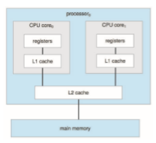

# Computer-System Architecture

In Section 1.2, we introduced the general structure of a typical computer sys- tem. A computer system can be organized in a number of different ways, which we can categorize roughly according to the number of general-purpose processors used.

### Single-Processor Systems

Many years ago, most computer systems used a single processor containing one CPU with a single processing core. The **core** is the component that exe- cutes instructions and registers for storing data locally. The one main CPU with its core is capable of executing a general-purpose instruction set, including instructions from processes. These systems have other special-purpose processors as well. They may come in the form of device-specific processors, such as disk, keyboard, and graphics controllers.

All of these special-purpose processors run a limited instruction set and do not run processes. Sometimes, they are managed by the operating system, in that the operating system sends them information about their next task and monitors their status. For example, a disk-controller microprocessor receives a sequence of requests from the main CPU core and implements its own disk queue and scheduling algorithm. This arrangement relieves the main CPU of the overhead of disk scheduling. PCs contain a microprocessor in the keyboard to convert the keystrokes into codes to be sent to the CPU. In other systems or circumstances, special-purpose processors are low-level components built into the hardware. The operating system cannot communicate with these proces- sors; they do their jobs autonomously. The use of special-purposemicroproces- sors is common anddoes not turn a single-processor system into amultiproces- sor. If there is only one general-purpose CPU with a single processing core, then the system is a single-processor system. According to this definition, however, very few contemporary computer systems are single-processor systems.

### Multiprocessor Systems

On modern computers, from mobile devices to servers, **multiprocessor sys- tems** now dominate the landscape of computing. Traditionally, such systems have two (or more) processors, each with a single-core CPU. The proces- sors share the computer bus and sometimes the clock, memory, and periph- eral devices. The primary advantage of multiprocessor systems is increased throughput. That is, by increasing the number of processors, we expect to get more work done in less time. The speed-up ratio with _N_ processors is not _N,_ however; it is less than _N._Whenmultiple processors cooperate on a task, a cer- tain amount of overhead is incurred in keeping all the parts working correctly. This overhead, plus contention for shared resources, lowers the expected gain from additional processors.

The most common multiprocessor systems use **symmetric multiprocess- ing** (**SMP**), in which each peer CPU processor performs all tasks, including operating-system functions and user processes. Figure 1.8 illustrates a typical SMP architecture with two processors, each with its own CPU. Notice that each CPU processor has its own set of registers, as well as a private—or local— cache. However, all processors share physical memory over the system bus.

The benefit of this model is that many processes can run simultaneously —_N_ processes can run if there are _N_ CPUs—without causing performance to deteriorate significantly. However, since the CPUs are separate, one may be sitting idle while another is overloaded, resulting in inefficiencies. These inefficiencies can be avoided if the processors share certain data structures. A multiprocessor system of this form will allow processes and resources—such as memory—to be shared dynamically among the various processors and can lower the workload variance among the processors. Such a system must be written carefully, as we shall see in Chapter 5 and Chapter 6.

The definition of **_multiprocessor_** has evolved over time and now includes **multicore** systems, in which multiple computing cores reside on a single chip. Multicore systems can be more efficient than multiple chips with single cores because on-chip communication is faster than between-chip communication.  

**Figure 1.8** Symmetric multiprocessing architecture.

In addition, one chip with multiple cores uses significantly less power than multiple single-core chips, an important issue for mobile devices as well as laptops.

In Figure 1.9, we show a dual-core design with two cores on the same pro- cessor chip. In this design, each core has its own register set, as well as its own local cache, often known as a level 1, or L1, cache. Notice, too, that a level 2 (L2) cache is local to the chip but is shared by the two processing cores. Most archi- tectures adopt this approach, combining local and shared caches, where local, lower-level caches are generally smaller and faster than higher-level shared

**Figure 1.9** A dual-core design with two cores on the same chip.  

**_DEFINITIONS OF COMPUTER SYSTEM COMPONENTS_**

• **CPU**—The hardware that executes instructions.

• **Processor**—Aphysical chip that contains one or more CPUs.

• **Core**—The basic computation unit of the CPU.

• **Multicore**—Including multiple computing cores on the same CPU.

• **Multiprocessor**—Including multiple processors.

Although virtually all systems are now multicore, we use the general term **_CPU_** when referring to a single computational unit of a computer system and **_core_** as well as **_multicore_** when specifically referring to one or more cores on a CPU.

caches. Aside from architectural considerations, such as cache, memory, and bus contention, amulticore processorwith_N_ cores appears to the operating sys- tem as _N_ standard CPUs. This characteristic puts pressure on operating-system designers—and application programmers—tomake efficient use of these pro- cessing cores, an issue we pursue in Chapter 4. Virtually all modern operating systems—including Windows, macOS, and Linux, as well as Android and iOS mobile systems—support multicore SMP systems.

Adding additional CPUs to a multiprocessor system will increase comput- ing power; however, as suggested earlier, the concept does not scale very well, and once we add too many CPUs, contention for the system bus becomes a bottleneck and performance begins to degrade. An alternative approach is instead to provide each CPU (or group of CPUs) with its own local memory that is accessed via a small, fast local bus. The CPUs are connected by a **shared system interconnect**, so that all CPUs share one physical address space. This approach—known as **non-uniform memory access**, or **NUMA**—is illustrated in Figure 1.10. The advantage is that, when a CPU accesses its local memory, not only is it fast, but there is also no contention over the system interconnect. Thus, NUMA systems can scale more effectively as more processors are added.

Apotential drawbackwith a NUMAsystem is increased latencywhen a CPU must access remotememory across the system interconnect, creating a possible performance penalty. In other words, for example, CPU0 cannot access the local memory of CPU3 as quickly as it can access its own localmemory, slowing down performance. Operating systems can minimize this NUMA penalty through careful CPU scheduling andmemorymanagement, as discussed in Section 5.5.2 and Section 10.5.4. Because NUMA systems can scale to accommodate a large number of processors, they are becoming increasingly popular on servers as well as high-performance computing systems.

Finally, **blade servers** are systems in which multiple processor boards, I/O boards, and networking boards are placed in the same chassis. The differ- ence between these and traditional multiprocessor systems is that each blade- processor board boots independently and runs its own operating system. Some blade-server boards are multiprocessor as well, which blurs the lines between  

**Figure 1.10** NUMA multiprocessing architecture.

types of computers. In essence, these servers consist of multiple independent multiprocessor systems.

### Clustered Systems

Another type of multiprocessor system is a **clustered system**, which gath- ers together multiple CPUs. Clustered systems differ from the multiprocessor systems described in Section 1.3.2 in that they are composed of two or more individual systems—or nodes—joined together; each node is typically a mul- ticore system. Such systems are considered **loosely coupled**. We should note that the definition of **_clustered_** is not concrete; many commercial and open- source packages wrestle to define what a clustered system is and why one form is better than another. The generally accepted definition is that clustered computers share storage and are closely linked via a local-area network LAN (as described in Chapter 19) or a faster interconnect, such as InfiniBand.

Clustering is usually used to provide **high-availability service**—that is, service that will continue even if one or more systems in the cluster fail. Generally, we obtain high availability by adding a level of redundancy in the system. A layer of cluster software runs on the cluster nodes. Each node can monitor one ormore of the others (over the network). If themonitoredmachine fails, the monitoring machine can take ownership of its storage and restart the applications that were running on the failed machine. The users and clients of the applications see only a brief interruption of service.

High availability provides increased reliability, which is crucial in many applications. The ability to continue providing service proportional to the level of surviving hardware is called **graceful degradation**. Some systemsgo beyond graceful degradation and are called **fault tolerant**, because they can suffer a failure of any single component and still continue operation. Fault tolerance requires a mechanism to allow the failure to be detected, diagnosed, and, if possible, corrected.

Clustering can be structured asymmetrically or symmetrically. In **asym- metric clustering**, one machine is in **hot-standby mode** while the other is run- ning the applications. The hot-standby host machine does nothing but monitor the active server. If that server fails, the hot-standby host becomes the active  

**_PC MOTHERBOARD_**

Consider the desktop PC motherboardwith a processor socket shown below:

This board is a fully functioning computer, once its slots are populated. It consists of a processor socket containing a CPU, DRAM sockets, PCIe bus slots, and I/O connectors of various types. Even the lowest-cost general- purpose CPU contains multiple cores. Some motherboards contain multiple processor sockets. More advanced computers allow more than one system board, creating NUMA systems.

server. In **symmetric clustering**, two or more hosts are running applications and are monitoring each other. This structure is obviously more efficient, as it uses all of the available hardware. However, it does require that more than one application be available to run.

Since a cluster consists of several computer systems connected via a net- work, clusters can also be used to provide **high-performance computing** envi- ronments. Such systems can supply significantly greater computational power than single-processor or even SMP systems because they can run an application concurrently on all computers in the cluster. The application must have been written specifically to take advantage of the cluster, however. This involves a technique known as **parallelization**, which divides a program into separate components that run in parallel on individual cores in a computer or comput- ers in a cluster. Typically, these applications are designed so that once each computing node in the cluster has solved its portion of the problem, the results from all the nodes are combined into a final solution.

Other forms of clusters include parallel clusters and clustering over a wide-area network (WAN) (as described in Chapter 19). Parallel clusters allow multiple hosts to access the same data on shared storage. Because most oper-  

**Figure 1.11** General structure of a clustered system.

ating systems lack support for simultaneous data access by multiple hosts, parallel clusters usually require the use of special versions of software and special releases of applications. For example, Oracle Real Application Cluster is a version of Oracle’s database that has been designed to run on a parallel cluster. Each machine runs Oracle, and a layer of software tracks access to the shared disk. Eachmachine has full access to all data in the database. To provide this shared access, the system must also supply access control and locking to ensure that no conflicting operations occur. This function, commonly known as a **distributed lock manager** (**DLM**), is included in some cluster technology.

Cluster technology is changing rapidly. Some cluster products support thousands of systems in a cluster, as well as clustered nodes that are separated by miles. Many of these improvements are made possible by **storage-area networks** (**SANs**), as described in Section 11.7.4, which allow many systems to attach to a pool of storage. If the applications and their data are stored on the SAN, then the cluster software can assign the application to run on any host that is attached to the SAN. If the host fails, then any other host can take over. In a database cluster, dozens of hosts can share the same database, greatly increasing performance and reliability. Figure 1.11 depicts the general structure of a clustered system.