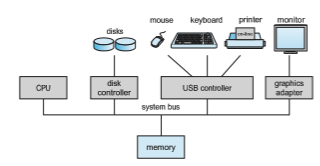
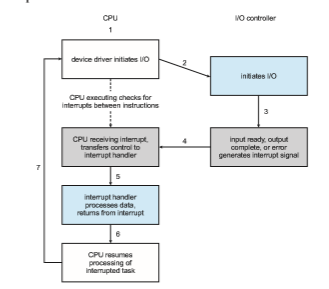
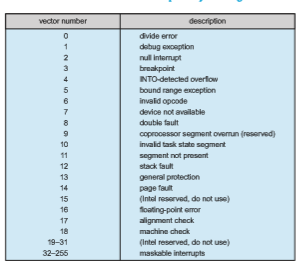
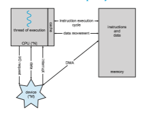

# Computer-System Organization

Amodern general-purpose computer system consists of one or more CPUs and a number of device controllers connected through a common **bus** that provides access between components and shared memory (Figure 1.2). Each device controller is in charge of a specific type of device (for example, a disk drive, audio device, or graphics display). Depending on the controller, more than one device may be attached. For instance, one system USB port can connect to a USB hub, to which several devices can connect. A device controller maintains some local buffer storage and a set of special-purpose registers. The device controller is responsible for moving the data between the peripheral devices that it controls and its local buffer storage.

Typically, operating systems have a **device driver** for each device con- troller. This device driver understands the device controller and provides the rest of the operating systemwith a uniform interface to the device. The CPU and the device controllers can execute in parallel, competing for memory cycles. To ensure orderly access to the sharedmemory, amemory controller synchronizes access to the memory.

In the following subsections, we describe some basics of how such a system operates, focusing on three key aspects of the system. We start with interrupts, which alert the CPU to events that require attention. We then discuss storage structure and I/O structure.

**Figure 1.2** A typical PC computer system.  

### Interrupts

Consider a typical computer operation: a program performing I/O. To start an I/O operation, the device driver loads the appropriate registers in the device controller. The device controller, in turn, examines the contents of these reg- isters to determine what action to take (such as “read a character from the keyboard”). The controller starts the transfer of data from the device to its local buffer. Once the transfer of data is complete, the device controller informs the device driver that it has finished its operation. The device driver then gives control to other parts of the operating system, possibly returning the data or a pointer to the data if the operation was a read. For other operations, the device driver returns status information such as “write completed successfully” or “device busy”. But how does the controller inform the device driver that it has finished its operation? This is accomplished via an **interrupt**.

#### Overview

Hardware may trigger an interrupt at any time by sending a signal to the CPU, usually by way of the system bus. (There may be many buses within a computer system, but the system bus is the main communications path between the major components.) Interrupts are used for many other purposes as well and are a key part of how operating systems and hardware interact.

When the CPU is interrupted, it stops what it is doing and immediately transfers execution to a fixed location. The fixed location usually contains the starting address where the service routine for the interrupt is located. The interrupt service routine executes; on completion, the CPU resumes the interrupted computation. A timeline of this operation is shown in Figure 1.3. To run the animation assicated with this figure please click **here**.

Interrupts are an important part of a computer architecture. Each computer design has its own interrupt mechanism, but several functions are common. The interruptmust transfer control to the appropriate interrupt service routine. The straightforward method for managing this transfer would be to invoke a generic routine to examine the interrupt information. The routine, in turn,

**Figure 1.3** Interrupt timeline for a single program doing output.  
would call the interrupt-specific handler.However, interruptsmust be handled quickly, as they occur very frequently. A table of pointers to interrupt routines can be used instead to provide the necessary speed. The interrupt routine is called indirectly through the table, with no intermediate routine needed. Generally, the table of pointers is stored in lowmemory (the first hundred or so locations). These locations hold the addresses of the interrupt service routines for the various devices. This array, or **interrupt vector**, of addresses is then indexed by a unique number, given with the interrupt request, to provide the address of the interrupt service routine for the interrupting device. Operating systems as different as Windows and UNIX dispatch interrupts in this manner.

The interrupt architecturemust also save the state information of whatever was interrupted, so that it can restore this information after servicing the interrupt. If the interrupt routine needs to modify the processor state—for instance, bymodifying register values—itmust explicitly save the current state and then restore that state before returning. After the interrupt is serviced, the saved return address is loaded into the program counter, and the interrupted computation resumes as though the interrupt had not occurred.

#### Implementation

The basic interrupt mechanism works as follows. The CPU hardware has a wire called the **interrupt-request line** that the CPU senses after executing every instruction. When the CPU detects that a controller has asserted a signal on the interrupt-request line, it reads the interrupt number and jumps to the **interrupt-handler routine** by using that interrupt number as an index into the interrupt vector. It then starts execution at the address associated with that index. The interrupt handler saves any state it will be changing during its operation, determines the cause of the interrupt, performs the necessary processing, performs a state restore, and executes a return from interrupt instruction to return the CPU to the execution state prior to the interrupt. We say that the device controller **_raises_** an interrupt by asserting a signal on the interrupt request line, the CPU **_catches_** the interrupt and **_dispatches_** it to the interrupt handler, and the handler **_clears_** the interrupt by servicing the device. Figure 1.4 summarizes the interrupt-driven I/O cycle.

The basic interruptmechanism just described enables the CPU to respond to an asynchronous event, as when a device controller becomes ready for service. In amodern operating system, however,we needmore sophisticated interrupt- handling features.

**1\.** We need the ability to defer interrupt handling during critical processing.

**2\.** We need an efficient way to dispatch to the proper interrupt handler for a device.

**3\.** We need multilevel interrupts, so that the operating system can distin- guish between high- and low-priority interrupts and can respond with the appropriate degree of urgency.

In modern computer hardware, these three features are provided by the CPU and the **interrupt-controller hardware**.  

**Figure 1.4** Interrupt-driven I/O cycle.

Most CPUs have two interrupt request lines. One is the **nonmaskable interrupt**, which is reserved for events such as unrecoverable memory errors. The second interrupt line is **maskable**: it can be turned off by the CPU before the execution of critical instruction sequences thatmust not be interrupted. The maskable interrupt is used by device controllers to request service.

Recall that the purpose of a vectored interrupt mechanism is to reduce the need for a single interrupt handler to search all possible sources of interrupts to determine which one needs service. In practice, however, computers have more devices (and, hence, interrupt handlers) than they have address elements in the interrupt vector. A commonway to solve this problem is to use **interrupt chaining**, in which each element in the interrupt vector points to the head of a list of interrupt handlers. When an interrupt is raised, the handlers on the corresponding list are called one by one, until one is found that can service the request. This structure is a compromise between the overhead of a huge interrupt table and the inefficiency of dispatching to a single interrupt handler.

Figure 1.5 illustrates the design of the interrupt vector for Intel processors. The events from 0 to 31, which are nonmaskable, are used to signal various error conditions. The events from 32 to 255, which are maskable, are used for purposes such as device-generated interrupts.

The interrupt mechanism also implements a system of **interrupt priority levels**. These levels enable the CPU to defer the handling of low-priority inter-  

**Figure 1.5** Intel processor event-vector table.

rupts without masking all interrupts and makes it possible for a high-priority interrupt to preempt the execution of a low-priority interrupt.

In summary, interrupts are used throughout modern operating systems to handle asynchronous events (and for other purposes we will discuss through- out the text). Device controllers and hardware faults raise interrupts. To enable the most urgent work to be done first, modern computers use a system of interrupt priorities. Because interrupts are used so heavily for time-sensitive processing, efficient interrupt handling is required for good system perfor- mance.

### Storage Structure

The CPU can load instructions only from memory, so any programs must first be loaded into memory to run. General-purpose computers run most of their programs from rewritable memory, called main memory (also called **random-access memory**, or **RAM**).Mainmemory commonly is implemented in a semiconductor technology called **dynamic random-access memory** (**DRAM**).

Computers use other forms of memory as well. For example, the first pro- gram to run on computer power-on is a **bootstrap program**, which then loads the operating system. Since RAM is **volatile**—loses its content when power is turned off or otherwise lost—we cannot trust it to hold the bootstrap pro- gram. Instead, for this and some other purposes, the computer uses electri- cally erasable programmable read-only memory (EEPROM) and other forms of **firmwar** —storage that is infrequently written to and is nonvolatile. EEPROM  

**_STORAGE DEFINITIONS AND NOTATION_**

The basic unit of computer storage is the **bit**. A bit can contain one of two values, 0 and 1. All other storage in a computer is based on collections of bits. Given enough bits, it is amazing howmany things a computer can represent: numbers, letters, images,movies, sounds, documents, andprograms, to name a few. A **byte** is 8 bits, and on most computers it is the smallest convenient chunk of storage. For example, most computers don’t have an instruction to move a bit but do have one to move a byte. A less common term is **word**, which is a given computer architecture’s native unit of data. Aword is made up of one ormore bytes. For example, a computer that has 64-bit registers and 64-bit memory addressing typically has 64-bit (8-byte) words. A computer executes many operations in its native word size rather than a byte at a time.

Computer storage, along with most computer throughput, is generally measured and manipulated in bytes and collections of bytes. A **kilobyte**, or **KB**, is 1,024 bytes; a **megabyte**, or **MB**, is 1,0242 bytes; a **gigabyte**, or **GB**, is 1,0243 bytes; a **terabyte**, or **TB**, is 1,0244 bytes; and a **petabyte**, or **PB**, is 1,0245

bytes. Computer manufacturers often round off these numbers and say that a megabyte is 1 million bytes and a gigabyte is 1 billion bytes. Networking measurements are an exception to this general rule; they are given in bits (because networks move data a bit at a time).

can be changed but cannot be changed frequently. In addition, it is low speed, and so it contains mostly static programs and data that aren’t frequently used. For example, the iPhone uses EEPROM to store serial numbers and hardware information about the device.

All forms of memory provide an array of bytes. Each byte has its own address. Interaction is achieved through a sequence of load or store instruc- tions to specificmemory addresses. The load instructionmoves a byte or word from main memory to an internal register within the CPU, whereas the store instructionmoves the content of a register tomainmemory. Aside from explicit loads and stores, the CPU automatically loads instructions from main memory for execution from the location stored in the program counter.

A typical instruction–execution cycle, as executed on a system with a **von Neumann architecture**, first fetches an instruction from memory and stores that instruction in the **instruction register**. The instruction is then decoded and may cause operands to be fetched from memory and stored in some internal register. After the instruction on the operands has been executed, the result may be stored back in memory. Notice that the memory unit sees only a stream of memory addresses. It does not know how they are generated (by the instruction counter, indexing, indirection, literal addresses, or some other means) or what they are for (instructions or data). Accordingly, we can ignore **_how_** a memory address is generated by a program. We are interested only in the sequence of memory addresses generated by the running program.

Ideally, we want the programs and data to reside in main memory per- manently. This arrangement usually is not possible on most systems for two reasons:  

**1\.** Main memory is usually too small to store all needed programs and data permanently.

**2\.** Mainmemory, asmentioned, is volatile—it loses its contentswhenpower is turned off or otherwise lost.

Thus, most computer systems provide **secondary storage** as an extension of main memory. The main requirement for secondary storage is that it be able to hold large quantities of data permanently.

The most common secondary-storage devices are **hard-disk drives** (**HDDs**) and **nonvolatile memory** (**NVM**) **devices**, which provide storage for both programs and data. Most programs (system and application) are stored in secondary storage until they are loaded intomemory.Many programs then use secondary storage as both the source and the destination of their processing. Secondary storage is also much slower than main memory. Hence, the proper management of secondary storage is of central importance to a computer sys- tem, as we discuss in Chapter 11.

In a larger sense, however, the storage structure that we have described —consisting of registers, main memory, and secondary storage—is only one of many possible storage system designs. Other possible components include cache memory, CD-ROM or blu-ray, magnetic tapes, and so on. Those that are slow enough and large enough that they are used only for special purposes —to store backup copies of material stored on other devices, for example— are called **tertiary storage**. Each storage system provides the basic functions of storing a datum and holding that datum until it is retrieved at a later time. The main differences among the various storage systems lie in speed, size, and volatility.

Thewide variety of storage systems can be organized in a hierarchy (Figure 1.6) according to storage capacity and access time. As a general rule, there is a

**Figure 1.6** Storage-device hierarchy.  

trade-off between size and speed, with smaller and faster memory closer to the CPU. As shown in the figure, in addition to differing in speed and capacity, the various storage systems are either volatile or nonvolatile. Volatile storage, as mentioned earlier, loses its contents when the power to the device is removed, so data must be written to nonvolatile storage for safekeeping.

The top four levels of memory in the figure are constructed using **semi- conductor memory**, which consists of semiconductor-based electronic circuits. NVM devices, at the fourth level, have several variants but in general are faster than hard disks. Themost common form of NVMdevice is flashmemory,which is popular in mobile devices such as smartphones and tablets. Increasingly, flash memory is being used for long-term storage on laptops, desktops, and servers as well.

Since storage plays an important role in operating-system structure, we will refer to it frequently in the text. In general, we will use the following terminology:

• Volatile storagewill be referred to simply as**memory**. If we need to empha- size a particular type of storage device (for example, a register),we will do so explicitly.

• Nonvolatile storage retains its contents when power is lost. It will be referred to as **NVS**. The vast majority of the time we spend on NVS will be on secondary storage. This type of storage can be classified into two distinct types:

◦ **Mechanical**. A few examples of such storage systems are HDDs, optical disks, holographic storage, andmagnetic tape. If we need to emphasize a particular type of mechanical storage device (for example, magnetic tape), we will do so explicitly.

◦ **Electrical**. A few examples of such storage systems are flash memory, FRAM, NRAM, and SSD. Electrical storage will be referred to as **NVM**. If we need to emphasize a particular type of electrical storage device (for example, SSD), we will do so explicitly.

Mechanical storage is generally larger and less expensive per byte than electrical storage. Conversely, electrical storage is typically costly, smaller, and faster than mechanical storage.

The design of a complete storage system must balance all the factors just discussed: it must use only as much expensive memory as necessary while providing as much inexpensive, nonvolatile storage as possible. Caches can be installed to improve performance where a large disparity in access time or transfer rate exists between two components.

### I/O Structure

A large portion of operating system code is dedicated to managing I/O, both because of its importance to the reliability and performance of a system and because of the varying nature of the devices.

Recall from the beginning of this section that a general-purpose computer system consists of multiple devices, all of which exchange data via a common  

**Figure 1.7** How a modern computer system works.

bus. The form of interrupt-driven I/O described in Section 1.2.1 is fine for moving small amounts of data but can produce high overhead when used for bulk data movement such as NVS I/O. To solve this problem, **direct memory access** (**DMA**) is used. After setting up buffers, pointers, and counters for the I/O device, the device controller transfers an entire block of data directly to or from the device and main memory, with no intervention by the CPU. Only one interrupt is generated per block, to tell the device driver that the operation has completed, rather than the one interrupt per byte generated for low-speed devices. While the device controller is performing these operations, the CPU is available to accomplish other work.

Some high-end systems use switch rather than bus architecture. On these systems, multiple components can talk to other components concurrently, rather than competing for cycles on a shared bus. In this case, DMA is even more effective. Figure 1.7 shows the interplay of all components of a computer system.