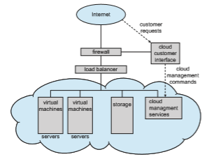

# Computing Environments

So far, we have briefly described several aspects of computer systems and the operating systems that manage them. We turn now to a discussion of how operating systems are used in a variety of computing environments.

### Traditional Computing

As computing has matured, the lines separating many of the traditional com- puting environments have blurred. Consider the “typical office environment.” Just a few years ago, this environment consisted of PCs connected to a network, with servers providing file and print services. Remote access was awkward, and portability was achieved by use of laptop computers.

Today, web technologies and increasing WAN bandwidth are stretching the boundaries of traditional computing. Companies establish **portals**, which pro- vide web accessibility to their internal servers. **Network computers** (or **thin clients**)—which are essentially terminals that understand web-based comput- ing—are used in place of traditional workstations where more security or easier maintenance is desired. Mobile computers can synchronize with PCs to allow very portable use of company information. Mobile devices can also  connect to **wireless networks** and cellular data networks to use the company’s web portal (as well as the myriad other web resources).

At home, most users once had a single computer with a slow modem con- nection to the office, the Internet, or both. Today, network-connection speeds once available only at great cost are relatively inexpensive in many places, giving home users more access to more data. These fast data connections are allowing home computers to serve up web pages and to run networks that include printers, client PCs, and servers. Many homes use **firewall** to pro- tect their networks from security breaches. Firewalls limit the communications between devices on a network.

In the latter half of the 20th century, computing resources were relatively scarce. (Before that, they were nonexistent!) For a period of time, systems were either batch or interactive. Batch systems processed jobs in bulk, with prede- termined input from files or other data sources. Interactive systems waited for input from users. To optimize the use of the computing resources, multiple users shared time on these systems. These time-sharing systems used a timer and scheduling algorithms to cycle processes rapidly through the CPU, giving each user a share of the resources.

Traditional time-sharing systems are rare today. The same scheduling tech- nique is still in use on desktop computers, laptops, servers, and even mobile computers, but frequently all the processes are owned by the same user (or a single user and the operating system). User processes, and system processes that provide services to the user, are managed so that each frequently gets a slice of computer time. Consider the windows created while a user is working on a PC, for example, and the fact that they may be performing different tasks at the same time. Even a web browser can be composed of multiple processes, one for each website currently being visited, with time sharing applied to each web browser process.

### Mobile Computing

**Mobile computing** refers to computing on handheld smartphones and tablet computers. These devices share the distinguishing physical features of being portable and lightweight. Historically, compared with desktop and laptop computers, mobile systems gave up screen size, memory capacity, and overall functionality in return for handheld mobile access to services such as e-mail and web browsing. Over the past few years, however, features on mobile devices have become so rich that the distinction in functionality between, say, a consumer laptop and a tablet computer may be difficult to discern. In fact, we might argue that the features of a contemporary mobile device allow it to provide functionality that is either unavailable or impractical on a desktop or laptop computer.

Today, mobile systems are used not only for e-mail and web browsing but also for playing music and video, reading digital books, taking photos, and recording and editing high-definition video. Accordingly, tremendous growth continues in the wide range of applications that run on such devices. Many developers are now designing applications that take advantage of the unique features of mobile devices, such as global positioning system (GPS) chips, accelerometers, and gyroscopes.An embeddedGPS chip allows amobile device to use satellites to determine its precise location on Earth. That functionality is especially useful in designing applications that provide navigation—for exam- ple, telling users which way to walk or drive or perhaps directing them to nearby services, such as restaurants. An accelerometer allows a mobile device to detect its orientation with respect to the ground and to detect certain other forces, such as tilting and shaking. In several computer games that employ accelerometers, players interface with the system not by using a mouse or a keyboard but rather by tilting, rotating, and shaking themobile device! Perhaps more a practical use of these features is found in **_augmented-reality_** appli- cations, which overlay information on a display of the current environment. It is difficult to imagine how equivalent applications could be developed on traditional laptop or desktop computer systems.

To provide access to on-line services, mobile devices typically use either IEEE standard 802.11 wireless or cellular data networks. The memory capacity and processing speed of mobile devices, however, are more limited than those of PCs. Whereas a smartphone or tablet may have 256 GB in storage, it is not uncommon to find 8 TB in storage on a desktop computer. Similarly, because power consumption is such a concern, mobile devices often use processors that are smaller, are slower, and offer fewer processing cores than processors found on traditional desktop and laptop computers.

Two operating systems currently dominate mobile computing: **Apple iOS** and **Google Android**. iOS was designed to run on Apple iPhone and iPad mobile devices. Android powers smartphones and tablet computers available frommanymanufacturers. We examine these twomobile operating systems in further detail in Chapter 2.

### Client–Server Computing

Contemporary network architecture features arrangements in which **server systems** satisfy requests generated by **client systems**. This form of specialized distributed system, called a **client–server** system, has the general structure depicted in Figure 1.22.

Server systems can be broadly categorized as compute servers and file servers:

• The **compute-server system** provides an interface to which a client can send a request to perform an action (for example, read data). In response, the server executes the action and sends the results to the client. 

**Figure 1.22** General structure of a client–server system.  
running a database that responds to client requests for data is an example of such a system.

• The **file-serve system** provides a file-system interface where clients can create, update, read, and delete files. An example of such a system is a web server that delivers files to clients running web browsers. The actual contents of the files can vary greatly, ranging from traditional web pages to rich multimedia content such as high-definition video.

### Peer-to-Peer Computing

Another structure for a distributed system is the peer-to-peer (P2P) system model. In this model, clients and servers are not distinguished from one another. Instead, all nodes within the system are considered peers, and each may act as either a client or a server, depending on whether it is requesting or providing a service. Peer-to-peer systems offer an advantage over traditional client–server systems. In a client–server system, the server is a bottleneck; but in a peer-to-peer system, services can be provided by several nodes distributed throughout the network.

To participate in a peer-to-peer system, a node must first join the network of peers. Once a node has joined the network, it can begin providing services to—and requesting services from—other nodes in the network. Determining what services are available is accomplished in one of two general ways:

• When a node joins a network, it registers its service with a centralized lookup service on the network. Any node desiring a specific service first contacts this centralized lookup service to determinewhich node provides the service. The remainder of the communication takes place between the client and the service provider.

• An alternative scheme uses no centralized lookup service. Instead, a peer acting as a client must discover what node provides a desired service by broadcasting a request for the service to all other nodes in the network. The node (or nodes) providing that service responds to the peer making the request. To support this approach, a **_discovery protocol_** must be pro- vided that allows peers to discover services provided by other peers in the network. Figure 1.23 illustrates such a scenario.

Peer-to-peer networks gainedwidespread popularity in the late 1990s with several file-sharing services, such as Napster and Gnutella, that enabled peers to exchange fileswith one another. TheNapster system used an approach simi- lar to the first type described above: a centralized servermaintained an index of all files stored on peer nodes in the Napster network, and the actual exchange of files took place between the peer nodes. The Gnutella system used a tech- nique similar to the second type: a client broadcast file requests to other nodes in the system, and nodes that could service the request responded directly to the client. Peer-to-peer networks can be used to exchange copyrighted mate- rials (music, for example) anonymously, and there are laws governing the distribution of copyrighted material. Notably, Napster ran into legal trouble for copyright infringement, and its services were shut down in 2001. For this reason, the future of exchanging files remains uncertain.  

**Figure 1.23** Peer-to-peer system with no centralized service.

Skype is another example of peer-to-peer computing. It allows clients to make voice calls and video calls and to send text messages over the Internet using a technology known as **voice over IP** (**VoIP**). Skype uses a hybrid peer- to-peer approach. It includes a centralized login server, but it also incorporates decentralized peers and allows two peers to communicate.

### Cloud Computing

**Cloud computing** is a type of computing that delivers computing, storage, and even applications as a service across a network. In some ways, it’s a logical extension of virtualization, because it uses virtualization as a base for its functionality. For example, theAmazon Elastic Compute Cloud (**ec2**) facility has thousands of servers,millions of virtualmachines, and petabytes of storage available for use by anyone on the Internet. Users pay per month based on how much of those resources they use. There are actually many types of cloud computing, including the following:

• **Public cloud**—a cloud available via the Internet to anyone willing to pay for the services

• **Private cloud**—a cloud run by a company for that company’s own use

• **Hybrid cloud**—a cloud that includes both public and private cloud com- ponents

• Software as a service (**SaaS**)—one or more applications (such as word processors or spreadsheets) available via the Internet

• Platform as a service (**PaaS**)—a software stack ready for application use via the Internet (for example, a database server)

• Infrastructure as a service (**IaaS**)—servers or storage available over the Internet (for example, storage available for making backup copies of pro- duction data)  

**Figure 1.24** Cloud computing.

These cloud-computing types are not discrete, as a cloud computing environ- ment may provide a combination of several types. For example, an organiza- tion may provide both SaaS and IaaS as publicly available services.

Certainly, there are traditional operating systems within many of the types of cloud infrastructure. Beyond those are the VMMs that manage the virtual machines in which the user processes run. At a higher level, the VMMs them- selves are managed by cloud management tools, such as VMware vCloud Director and the open-source Eucalyptus toolset. These tools manage the resourceswithin a given cloud and provide interfaces to the cloud components, making a good argument for considering them a new type of operating system.

Figure 1.24 illustrates a public cloud providing IaaS. Notice that both the cloud services and the cloud user interface are protected by a firewall.

### Real-Time Embedded Systems

Embedded computers are the most prevalent form of computers in existence. These devices are found everywhere, from car engines and manufacturing robots to optical drives and microwave ovens. They tend to have very specific tasks. The systems they run on are usually primitive, and so the operating systems provide limited features. Usually, they have little or no user interface, preferring to spend their time monitoring and managing hardware devices, such as automobile engines and robotic arms.

These embedded systems vary considerably. Some are general-purpose computers, running standard operating systems—such as Linux—with special-purpose applications to implement the functionality. Others are hardware devices with a special-purpose embedded operating system providing just the functionality desired. Yet others are hardware devices with application-specific integrated circuits (**ASICs**) that perform their tasks without an operating system.

The use of embedded systems continues to expand. The power of these devices, both as standalone units and as elements of networks and the web, is sure to increase as well. Even now, entire houses can be computerized, so that a central computer—either a general-purpose computer or an embedded system —can control heating and lighting, alarm systems, and even coffee makers. Web access can enable a home owner to tell the house to heat up before she arrives home. Someday, the refrigerator will be able to notify the grocery store when it notices the milk is gone.

Embedded systems almost always run **real-time operating systems**. Areal- time system is used when rigid time requirements have been placed on the operation of a processor or the flow of data; thus, it is often used as a control device in a dedicated application. Sensors bring data to the computer. The com- puter must analyze the data and possibly adjust controls to modify the sensor inputs. Systems that control scientific experiments, medical imaging systems, industrial control systems, and certain display systems are real-time systems. Some automobile-engine fuel-injection systems, home-appliance controllers, and weapon systems are also real-time systems.

A real-time system has well-defined, fixed time constraints. Processing **_must_** be done within the defined constraints, or the system will fail. For instance, it would not do for a robot arm to be instructed to halt **_after_** it had smashed into the car it was building. A real-time system functions correctly only if it returns the correct result within its time constraints. Contrast this sys- tem with a traditional laptop system where it is desirable (but not mandatory) to respond quickly.

In Chapter 5, we consider the scheduling facility needed to implement real- time functionality in an operating system, and in Chapter 20 we describe the real-time components of Linux.