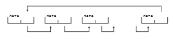

# Kernel Data Structures

We turn next to a topic central to operating-system implementation: the way data are structured in the system. In this section, we briefly describe several fundamental data structures used extensively in operating systems. Readers  

**Figure 1.17** Singly linked list.

who require further details on these structures, aswell as others, should consult the bibliography at the end of the chapter.

### Lists, Stacks, and Queues

An array is a simple data structure in which each element can be accessed directly. For example, main memory is constructed as an array. If the data item being stored is larger than one byte, then multiple bytes can be allocated to the item, and the item is addressed as “item number × item size.” But what about storing an itemwhose size may vary? And what about removing an item if the relative positions of the remaining itemsmust be preserved? In such situations, arrays give way to other data structures.

After arrays, lists are perhaps themost fundamental data structures in com- puter science. Whereas each item in an array can be accessed directly, the items in a list must be accessed in a particular order. That is, a **list** represents a collec- tion of data values as a sequence. Themost commonmethod for implementing this structure is a **linked list**, in which items are linked to one another. Linked lists are of several types:

• In a **_singly linked list,_** each item points to its successor, as illustrated in Figure 1.17.

• In a **_doubly linked list,_** a given item can refer either to its predecessor or to its successor, as illustrated in Figure 1.18.

• In a **_circularly linked list,_** the last element in the list refers to the first element, rather than to null, as illustrated in Figure 1.19.

Linked lists accommodate items of varying sizes and allow easy insertion and deletion of items. One potential disadvantage of using a list is that per- formance for retrieving a specified item in a list of size _n_ is linear—_O_(_n_), as it requires potentially traversing all _n_ elements in the worst case. Lists are some- times used directly by kernel algorithms. Frequently, though, they are used for constructing more powerful data structures, such as stacks and queues.

A **stack** is a sequentially ordered data structure that uses the last in, first out (**LIFO**) principle for adding and removing items, meaning that the last item

**Figure 1.18** Doubly linked list.  

**Figure 1.19** Circularly linked list.

placed onto a stack is the first item removed. The operations for inserting and removing items from a stack are known as **_push_** and **_pop_**, respectively. An operating system often uses a stack when invoking function calls. Parameters, local variables, and the return address are pushed onto the stack when a function is called; returning from the function call pops those items off the stack.

A **queue**, in contrast, is a sequentially ordered data structure that uses the first in, first out (**FIFO**) principle: items are removed from a queue in the order in which they were inserted. There are many everyday examples of queues, including shoppers waiting in a checkout line at a store and cars waiting in line at a traffic signal. Queues are also quite common in operating systems—jobs that are sent to a printer are typically printed in the order in which they were submitted, for example. As we shall see in Chapter 5, tasks that are waiting to be run on an available CPU are often organized in queues.

### Trees

A **tree** is a data structure that can be used to represent data hierarchically. Data values in a tree structure are linked through parent–child relationships. In a **general tree**, a parent may have an unlimited number of children. In a **binary tree**, a parent may have at most two children, which we term the **_left child_** and the **_right child_**. A **binary search tree** additionally requires an ordering between the parent’s two children in which _left child <_\= _right child_. Figure 1.20 provides an example of a binary search tree. When we search for an item in a binary search tree, the worst-case performance is _O_(_n_) (consider how this can occur). To remedy this situation, we can use an algorithm to create a **balanced binary search tree**. Here, a tree containing _n_ items has at most _lg n_ levels, thus ensuring worst-case performance of _O_(_lg n_). We shall see in Section 5.7.1 that Linux uses a balanced binary search tree (known as a **red-black tree**) as part its CPU-scheduling algorithm.

### Hash Functions and Maps

A **hash function** takes data as its input, performs a numeric operation on the data, and returns a numeric value. This numeric value can then be used as an index into a table (typically an array) to quickly retrieve the data. Whereas searching for a data item through a list of size _n_ can require up to_O_(_n_) compar- isons, using a hash function for retrieving data from a table can be as good as _O_(1), depending on implementation details. Because of this performance, hash functions are used extensively in operating systems.

One potential difficulty with hash functions is that two unique inputs can result in the same output value—that is, they can link to the same table  

**Figure 1.20** Binary search tree.

location. We can accommodate this **_hash collision_** by having a linked list at the table location that contains all of the itemswith the same hash value. Of course, the more collisions there are, the less efficient the hash function is.

One use of a hash function is to implement a **hash map**, which associates (or **_maps_**) \[key:value\] pairs using a hash function. Once the mapping is estab- lished, we can apply the hash function to the key to obtain the value from the hash map (Figure 1.21). For example, suppose that a user name is mapped to a password. Password authentication then proceeds as follows: a user enters her user name and password. The hash function is applied to the user name, which is then used to retrieve the password. The retrieved password is then compared with the password entered by the user for authentication.

### Bitmaps

A **bitmap** is a string of _n_ binary digits that can be used to represent the status of _n_ items. For example, suppose we have several resources, and the availability of each resource is indicated by the value of a binary digit: 0 means that the resource is available, while 1 indicates that it is unavailable (or vice versa). The

**Figure 1.21** Hash map.  

**_LINUX KERNEL DATA STRUCTURES_**

The data structures used in the Linux kernel are available in the kernel source code. The **_include_** file _<_linux/list.h_\>_ provides details of the linked-list data structure used throughout the kernel. A queue in Linux is known as a kfifo, and its implementation can be found in the kfifo.c file in the kernel directory of the source code. Linux also provides a balancedbinary search tree implementation using **_red-black trees_**. Details can be found in the include file _<_linux/rbtree.h_\>_.

value of the _ith_ position in the bitmap is associated with the _ith_ resource. As an example, consider the bitmap shown below:

0 0 1 0 1 1 1 0 1

Resources 2, 4, 5, 6, and 8 are unavailable; resources 0, 1, 3, and 7 are available. The power of bitmaps becomes apparent when we consider their space

efficiency. If we were to use an eight-bit Boolean value instead of a single bit, the resulting data structure would be eight times larger. Thus, bitmaps are commonly used when there is a need to represent the availability of a large number of resources. Disk drives provide a nice illustration. Amedium-sized disk drivemight be divided into several thousand individual units, called **disk blocks**. A bitmap can be used to indicate the availability of each disk block.

In summary, data structures are pervasive in operating system implemen- tations. Thus, we will see the structures discussed here, along with others, throughout this text as we explore kernel algorithms and their implementa- tions.