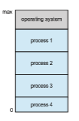

# Operating-System Operations

Now that we have discussed basic information about computer-system organi- zation and architecture, we are ready to talk about operating systems. An oper- ating system provides the environment within which programs are executed. Internally, operating systems vary greatly, since they are organized alongmany different lines. There are, however, many commonalities, which we consider in this section.

For a computer to start running—for instance, when it is powered up or rebooted—it needs to have an initial program to run. As noted earlier, this initial program, or bootstrap program, tends to be simple. Typically, it is stored within the computer hardware in firmware. It initializes all aspects of the system, from CPU registers to device controllers to memory contents. The bootstrap program must know how to load the operating system and how to  

**_HADOOP_**

Hadoop is an open-source software framework that is used for distributed processing of large data sets (known as **big data**) in a clustered system con- taining simple, low-cost hardware components. Hadoop is designed to scale from a single system to a cluster containing thousands of computing nodes. Tasks are assigned to a node in the cluster, andHadoop arranges communica- tion between nodes to manage parallel computations to process and coalesce results. Hadoop also detects and manages failures in nodes, providing an efficient and highly reliable distributed computing service.

Hadoop is organized around the following three components:

**1\.** Adistributed file system that manages data and files across distributed com- puting nodes.

**2\.** The YARN (“Yet Another Resource Negotiator”) framework, which manages resources within the cluster as well as scheduling tasks on nodes in the cluster.

**3\.** The **MapReduce** system, which allows parallel processing of data across nodes in the cluster.

Hadoop is designed to run on Linux systems, and Hadoop applications can be written using several programming languages, including scripting languages such as PHP, Perl, and Python. Java is a popular choice for developing Hadoop applications, as Hadoop has several Java libraries that support MapReduce. More information on MapReduce and Hadoop can be found at https://hadoop.apache.org/docs/r1.2.1/mapred tutorial.html and https://hadoop.apache.org

start executing that system. To accomplish this goal, the bootstrap program must locate the operating-system kernel and load it into memory.

Once the kernel is loaded and executing, it can start providing services to the system and its users. Some services are provided outside of the kernel by system programs that are loaded into memory at boot time to become **system daemons**, which run the entire time the kernel is running. On Linux, the first system program is “systemd,” and it starts many other daemons. Once this phase is complete, the system is fully booted, and the system waits for some event to occur.

If there are no processes to execute, no I/O devices to service, and no users towhom to respond, an operating systemwill sit quietly,waiting for something to happen. Events are almost always signaled by the occurrence of an interrupt. In Section 1.2.1 we described hardware interrupts. Another form of interrupt is a **trap** (or an **exception**), which is a software-generated interrupt caused either by an error (for example, division by zero or invalid memory access) or by a specific request from a user program that an operating-system service be performed by executing a special operation called a **system call**.  

### Multiprogramming and Multitasking

One of the most important aspects of operating systems is the ability to run multiple programs, as a single program cannot, in general, keep either the CPU or the I/O devices busy at all times. Furthermore, users typically _want_ to run more than one program at a time as well. **Multiprogramming** increases CPU utilization, as well as keeping users satisfied, by organizing programs so that the CPU always has one to execute. In a multiprogrammed system, a program in execution is termed a **process**.

The idea is as follows: The operating system keeps several processes in memory simultaneously (Figure 1.12). The operating system picks and begins to execute one of these processes. Eventually, the process may have to wait for some task, such as an I/O operation, to complete. In a non-multiprogrammed system, the CPU would sit idle. In a multiprogrammed system, the operating system simply switches to, and executes, another process. When **_that_** process needs to wait, the CPU switches to **_another_** process, and so on. Eventually, the first process finishes waiting and gets the CPU back. As long as at least one process needs to execute, the CPU is never idle.

This idea is common in other life situations. A lawyer does not work for only one client at a time, for example. While one case is waiting to go to trial or have papers typed, the lawyer can work on another case. If she has enough clients, the lawyer will never be idle for lack of work. (Idle lawyers tend to become politicians, so there is a certain social value in keeping lawyers busy.)

**Multitasking** is a logical extension of multiprogramming. In multitasking systems, the CPU executes multiple processes by switching among them, but the switches occur frequently, providing the user with a fast **response time**. Consider that when a process executes, it typically executes for only a short time before it either finishes or needs to perform I/O. I/O may be interactive; that is, output goes to a display for the user, and input comes from a user keyboard, mouse, or touch screen. Since interactive I/O typically runs at “peo- ple speeds,” it may take a long time to complete. Input, for example, may be

**Figure 1.12** Memory layout for a multiprogramming system.  
bounded by the user’s typing speed; seven characters per second is fast for people but incredibly slow for computers. Rather than let the CPU sit idle as this interactive input takes place, the operating system will rapidly switch the CPU to another process.

Having several processes in memory at the same time requires some form of memory management, which we cover in Chapter 9 and Chapter 10. In addition, if several processes are ready to run at the same time, the systemmust choose which process will run next. Making this decision is **CPU scheduling**, which is discussed in Chapter 5. Finally, running multiple processes concur- rently requires that their ability to affect one another be limited in all phases of the operating system, including process scheduling, disk storage, andmemory management. We discuss these considerations throughout the text.

In a multitasking system, the operating system must ensure reasonable response time. A common method for doing so is **virtual memory**, a tech- nique that allows the execution of a process that is not completely in memory (Chapter 10). The main advantage of this scheme is that it enables users to run programs that are larger than actual **physical memory**. Further, it abstracts main memory into a large, uniform array of storage, separating **logical mem- ory** as viewed by the user from physical memory. This arrangement frees programmers from concern over memory-storage limitations.

Multiprogramming and multitasking systems must also provide a file sys- tem (Chapter 13, Chapter 14, and Chapter 15). The file system resides on a secondary storage; hence, storagemanagementmust be provided (Chapter 11). In addition, a system must protect resources from inappropriate use (Chapter 17). To ensure orderly execution, the systemmust also providemechanisms for process synchronization and communication (Chapter 6 and Chapter 7), and it may ensure that processes do not get stuck in a deadlock, forever waiting for one another (Chapter 8).

### Dual-Mode and Multimode Operation

Since the operating system and its users share the hardware and software resources of the computer system, a properly designed operating systemmust ensure that an incorrect (or malicious) program cannot cause other programs —or the operating system itself—to execute incorrectly. In order to ensure the proper execution of the system, we must be able to distinguish between the execution of operating-system code and user-defined code. The approach taken by most computer systems is to provide hardware support that allows differentiation among various modes of execution.

At the very least, we need two separate **_modes_** of operation: **user mode** and **kernel mode** (also called **supervisor mode**, **system mode**, or **privileged mode**). A bit, called the **mode bit**, is added to the hardware of the computer to indicate the current mode: kernel (0) or user (1). With the mode bit, we can distinguish between a task that is executed on behalf of the operating system and one that is executed on behalf of the user. When the computer system is executing on behalf of a user application, the system is in usermode. However, when a user application requests a service from the operating system (via a system call), the system must transition from user to kernel mode to fulfill  

**Figure 1.13** Transition from user to kernel mode.

the request. This is shown in Figure 1.13. As we shall see, this architectural enhancement is useful for many other aspects of system operation as well.

At system boot time, the hardware starts in kernel mode. The operating system is then loaded and starts user applications in user mode. Whenever a trap or interrupt occurs, the hardware switches fromusermode to kernelmode (that is, changes the state of the mode bit to 0). Thus, whenever the operating system gains control of the computer, it is in kernel mode. The system always switches to user mode (by setting the mode bit to 1) before passing control to a user program.

The dual mode of operation provides us with the means for protecting the operating system from errant users—and errant users from one another. We accomplish this protection by designating some of the machine instructions that may cause harm as **privileged instructions**. The hardware allows privi- leged instructions to be executed only in kernel mode. If an attempt is made to execute a privileged instruction in user mode, the hardware does not execute the instruction but rather treats it as illegal and traps it to the operating system.

The instruction to switch to kernel mode is an example of a privileged instruction. Some other examples include I/O control, timer management, and interrupt management. Many additional privileged instructions are discussed throughout the text.

The concept of modes can be extended beyond two modes. For example, Intel processors have four separate **protection rings**, where ring 0 is kernel mode and ring 3 is user mode. (Although rings 1 and 2 could be used for vari- ous operating-systemservices, in practice they are rarely used.) ARMv8 systems have seven modes. CPUs that support virtualization (Section 18.1) frequently have a separate mode to indicate when the **virtual machine manager** (**VMM**) is in control of the system. In this mode, the VMM has more privileges than user processes but fewer than the kernel. It needs that level of privilege so it can create and manage virtual machines, changing the CPU state to do so.

We can now better understand the life cycle of instruction execution in a computer system. Initial control resides in the operating system,where instruc- tions are executed in kernel mode. When control is given to a user applica- tion, the mode is set to user mode. Eventually, control is switched back to the operating system via an interrupt, a trap, or a system call. Most contem- porary operating systems—such as Microsoft Windows, Unix, and Linux take advantage of this dual-mode feature and provide greater protection for the operating system.

System calls provide the means for a user program to ask the operating system to perform tasks reserved for the operating system on the user pro- gram’s behalf. A system call is invoked in a variety of ways, depending on the functionality provided by the underlying processor. In all forms, it is the method used by a process to request action by the operating system. A system call usually takes the form of a trap to a specific location in the interrupt vector. This trap can be executed by a generic trap instruction, although some systems have a specific syscall instruction to invoke a system call.

When a system call is executed, it is typically treated by the hardware as a software interrupt. Control passes through the interrupt vector to a service routine in the operating system, and the mode bit is set to kernel mode. The system-call service routine is a part of the operating system. The kernel exam- ines the interrupting instruction to determine what system call has occurred; a parameter indicates what type of service the user program is requesting. Additional information needed for the request may be passed in registers, on the stack, or in memory (with pointers to the memory locations passed in reg- isters). The kernel verifies that the parameters are correct and legal, executes the request, and returns control to the instruction following the system call. We describe system calls more fully in Section 2.3.

Once hardware protection is in place, it detects errors that violate modes. These errors are normally handled by the operating system. If a user program fails in some way—such as by making an attempt either to execute an illegal instruction or to access memory that is not in the user’s address space—then the hardware traps to the operating system. The trap transfers control through the interrupt vector to the operating system, just as an interrupt does. When a program error occurs, the operating system must terminate the program abnormally. This situation is handled by the same code as a user-requested abnormal termination. An appropriate errormessage is given, and thememory of the programmay be dumped. The memory dump is usually written to a file so that the user or programmer can examine it and perhaps correct it and restart the program.

### Timer

We must ensure that the operating system maintains control over the CPU. We cannot allow a user program to get stuck in an infinite loop or to fail to call system services and never return control to the operating system. To accomplish this goal, we can use a **timer**. A timer can be set to interrupt the computer after a specified period. The period may be fixed (for example, 1/60 second) or variable (for example, from 1 millisecond to 1 second). A **variable timer** is generally implemented by a fixed-rate clock and a counter. The operating system sets the counter. Every time the clock ticks, the counter is decremented. When the counter reaches 0, an interrupt occurs. For instance, a 10-bit counter with a 1-millisecond clock allows interrupts at intervals from 1 millisecond to 1,024 milliseconds, in steps of 1 millisecond.

Before turning over control to the user, the operating system ensures that the timer is set to interrupt. If the timer interrupts, control transfers automati- cally to the operating system, which may treat the interrupt as a fatal error or  

**_LINUX TIMERS_**

On Linux systems, the kernel configuration parameter HZ specifies the fre- quency of timer interrupts. An HZ value of 250means that the timer generates 250 interrupts per second, or one interrupt every 4 milliseconds. The value of HZ depends upon how the kernel is configured, as well the machine type and architecture on which it is running. A related kernel variable is jiffies, which represent the number of timer interrupts that have occurred since the system was booted. A programming project in Chapter 2 further explores timing in the Linux kernel.

may give the programmore time. Clearly, instructions that modify the content of the timer are privileged.