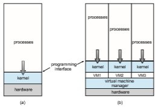

# Virtualization

**Virtualization** is a technology that allows us to abstract the hardware of a sin- gle computer (the CPU, memory, disk drives, network interface cards, and so forth) into several different execution environments, thereby creating the illu- sion that each separate environment is running on its own private computer. These environments can be viewed as different individual operating systems (for example, Windows and UNIX) that may be running at the same time and may interact with each other. A user of a **virtual machine** can switch among the various operating systems in the same way a user can switch among the various processes running concurrently in a single operating system.

Virtualization allows operating systems to run as applications within other operating systems. At first blush, there seems to be little reason for such func- tionality. But the virtualization industry is vast and growing, which is a testa- ment to its utility and importance.

Broadly speaking, virtualization software is onemember of a class that also includes emulation. **Emulation**, which involves simulating computer hard- ware in software, is typically used when the source CPU type is different from the target CPU type. For example, when Apple switched from the IBM Power CPU to the Intel x86 CPU for its desktop and laptop computers, it included an emulation facility called “Rosetta,” which allowed applications compiled for the IBMCPU to run on the Intel CPU. That same concept can be extended to allow an entire operating system written for one platform to run on another. Emula- tion comes at a heavy price, however. Everymachine-level instruction that runs natively on the source system must be translated to the equivalent function on the target system, frequently resulting in several target instructions. If the source and target CPUs have similar performance levels, the emulated code may run much more slowly than the native code.

With virtualization, in contrast, an operating system that is natively com- piled for a particular CPU architecture runs within another operating system also native to that CPU. Virtualization first came about on IBM mainframes as a method for multiple users to run tasks concurrently. Running multiple vir- tual machines allowed (and still allows) many users to run tasks on a system designed for a single user. Later, in response to problemswith runningmultiple Microsoft Windows applications on the Intel x86 CPU, VMware created a new virtualization technology in the form of an application that ran on Windows. That application ran one or more **guest** copies of Windows or other native x86 operating systems, each running its own applications. (See Figure 1.16.)  

**Figure 1.16** A computer running (a) a single operating system and (b) three virtual machines.

Windows was the **host** operating system, and the VMware application was the **virtual machine manager** (**VMM**). The VMM runs the guest operating systems, manages their resource use, and protects each guest from the others.

Even thoughmodern operating systems are fully capable of runningmulti- ple applications reliably, the use of virtualization continues to grow.On laptops and desktops, a VMM allows the user to install multiple operating systems for exploration or to run applications written for operating systems other than the native host. For example, an Apple laptop running macOS on the x86 CPU can run a Windows 10 guest to allow execution of Windows applications. Com- panies writing software for multiple operating systems can use virtualization to run all of those operating systems on a single physical server for develop- ment, testing, and debugging. Within data centers, virtualization has become a commonmethod of executing and managing computing environments. VMMs like VMware ESXand Citrix XenServer no longer run on host operating systems but rather **_are_** the host operating systems, providing services and resource management to virtual machine processes.

With this text, we provide a Linux virtual machine that allows you to run Linux—as well as the development tools we provide—on your personal system regardless of your host operating system. Full details of the features and implementation of virtualization can be found in Chapter 18.