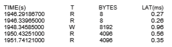

# Operating-System Debugging

We havementioned debugging from time to time in this chapter. Here, we take a closer look. Broadly, **debugging** is the activity of finding and fixing errors in a system, both in hardware and in software. Performance problems are considered bugs, so debugging can also include **performance tuning**, which seeks to improve performance by removing processing **bottlenecks**. In this section, we explore debugging process and kernel errors and performance problems. Hardware debugging is outside the scope of this text.

### Failure Analysis

If a process fails, most operating systems write the error information to a **log fil** to alert system administrators or users that the problem occurred. The operating system can also take a **core dump**—a capture of the memory of the process—and store it in a file for later analysis. (Memorywas referred to as the  

“core” in the early days of computing.) Running programs and core dumps can be probed by a debugger, which allows a programmer to explore the code and memory of a process at the time of failure.

Debugging user-level process code is a challenge. Operating-system kernel debugging is even more complex because of the size and complexity of the kernel, its control of the hardware, and the lack of user-level debugging tools. A failure in the kernel is called a **crash**. When a crash occurs, error information is saved to a log file, and the memory state is saved to a **crash dump**.

Operating-system debugging and process debugging frequently use dif- ferent tools and techniques due to the very different nature of these two tasks. Consider that a kernel failure in the file-system code would make it risky for the kernel to try to save its state to a file on the file system before rebooting. A common technique is to save the kernel’s memory state to a section of disk set aside for this purpose that contains no file system. If the kernel detects an unrecoverable error, it writes the entire contents of memory, or at least the kernel-owned parts of the system memory, to the disk area. When the system reboots, a process runs to gather the data from that area and write it to a crash dump file within a file system for analysis. Obviously, such strategies would be unnecessary for debugging ordinary user-level processes.

### Performance Monitoring and Tuning

We mentioned earlier that performance tuning seeks to improve performance by removing processing bottlenecks. To identify bottlenecks, we must be able to monitor system performance. Thus, the operating system must have some means of computing and displaying measures of system behavior. Tools may be characterized as providing either **_per-process_** or **_system-wide_** observations. To make these observations, tools may use one of two approaches—**_counters_** or **_tracing_**. We explore each of these in the following sections.

#### Counters

Operating systems keep track of system activity through a series of counters, such as the number of system calls made or the number of operations performed to a network device or disk. The following are examples of Linux tools that use counters:

**Figure 2.19** The Windows 10 task manager.

Most of the counter-based tools on Linux systems read statistics from the /proc file system. /proc is a “pseudo” file system that exists only in kernel memory and is used primarily for querying various per-process as well as kernel statistics. The /proc file system is organized as a directory hierarchy, with the process (a unique integer value assigned to each process) appearing as a subdirectory below /proc. For example, the directory entry /proc/2155 would contain per-process statistics for the process with an ID of 2155. There are /proc entries for various kernel statistics as well. In both this chapter and Chapter 3, we provide programming projects where you will create and access the /proc file system.

Windows systems provide the **Windows Task Manager**, a tool that includes information for current applications as well as processes, CPU and memory usage, and networking statistics. A screen shot of the task manager in Windows 10 appears in Figure 2.19.

### Tracing

Whereas counter-based tools simply inquire on the current value of certain statistics that are maintained by the kernel, tracing tools collect data for a specific event—such as the steps involved in a system-call invocation.

The following are examples of Linux tools that trace events:

**Per-Process**

• strace—traces system calls invoked by a process

• gdb—a source-level debugger

**System-Wide**

• perf—a collection of Linux performance tools

• tcpdump—collects network packets  

**_Kernighan’s Law_**

“Debugging is twice as hard as writing the code in the first place. Therefore, if you write the code as cleverly as possible, you are, by definition, not smart enough to debug it.”

Making operating systems easier to understand, debug, and tune as they run is an active area of research and practice. A new generation of kernel- enabled performance analysis tools hasmade significant improvements in how this goal can be achieved. Next, we discuss BCC, a toolkit for dynamic kernel tracing in Linux.

### BCC

Debugging the interactions between user-level and kernel code is nearly impossible without a toolset that understands both sets of code and can instru- ment their interactions. For that toolset to be truly useful, it must be able to debug any area of a system, including areas that were not written with debug- ging in mind, and do so without affecting system reliability. This toolset must also have a minimal performance impact—ideally it should have no impact when not in use and a proportional impact during use. The BCC toolkit meets these requirements and provides a dynamic, secure, low-impact debugging environment.

**BCC** (BPF Compiler Collection) is a rich toolkit that provides tracing fea- tures for Linux systems. BCC is a front-end interface to the eBPF (extended Berkeley Packet Filter) tool. The BPF technology was developed in the early 1990s for filtering traffic across a computer network. The “extended” BPF (eBPF) added various features to BPF. eBPF programs are written in a subset of C and are compiled into eBPF instructions, which can be dynamically inserted into a running Linux system. The eBPF instructions can be used to capture specific events (such as a certain system call being invoked) or to monitor system per- formance (such as the time required to perform disk I/O). To ensure that eBPF instructions are well behaved, they are passed through a **verifie** before being inserted into the running Linux kernel. The verifier checks to make sure that the instructions do not affect system performance or security.

Although eBPF provides a rich set of features for tracing within the Linux kernel, it traditionally has been very difficult to develop programs using its C interface. BCC was developed to make it easier to write tools using eBPF by providing a front-end interface in Python. A BCC tool is written in Python and it embeds C code that interfaces with the eBPF instrumentation, which in turn interfaces with the kernel. The BCC tool also compiles the C program into eBPF instructions and inserts it into the kernel using either probes or tracepoints, two techniques that allow tracing events in the Linux kernel.

The specifics of writing custom BCC tools are beyond the scope of this text, but the BCC package (which is installed on the Linux virtual machine we provide) provides a number of existing tools that monitor several areas  

of activity in a running Linux kernel. As an example, the BCC disksnoop tool traces disk I/O activity. Entering the command

./disksnoop.py

generates the following example output:

TIME(s) T BYTES LAT(ms) 1946.29186700 R 8 0.27 1946.33965000 R 8 0.26 1948.34585000 W 8192 0.96 1950.43251000 R 4096 0.56 1951.74121000 R 4096 0.35

This output tells us the timestamp when the I/O operation occurred, whether the I/O was a Read or Write operation, and how many bytes were involved in the I/O. The final column reflects the duration (expressed as latency or LAT) in milliseconds of the I/O.

Many of the tools provided by BCC can be used for specific applications, such as MySQL databases, as well as Java and Python programs. Probes can also be placed to monitor the activity of a specific process. For example, the command

./opensnoop -p 1225

will trace open() system calls performed only by the process with an identifier of 1225.

**Figure 2.20** The BCC and eBPF tracing tools.  
What makes BCC especially powerful is that its tools can be used on live production systems that are running critical applications without causing harm to the system. This is particularly useful for system administrators who must monitor system performance to identify possible bottlenecks or security exploits. Figure 2.20 illustrates the wide range of tools currently provided by BCC and eBPF and their ability to trace essentially any area of the Linux operat- ing system. BCC is a rapidly changing technology with new features constantly being added.