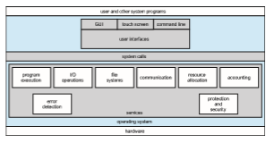

# Operating-System Services

An operating system provides an environment for the execution of programs. It makes certain services available to programs and to the users of those pro- grams. The specific services provided, of course, differ from one operating

**Figure 2.1** A view of operating system services.

system to another, but we can identify common classes. Figure 2.1 shows one view of the various operating-system services and how they interrelate. Note that these services alsomake the programming task easier for the programmer.

One set of operating system services provides functions that are helpful to the user.

• **User interface**. Almost all operating systems have a **user interface** (**UI**). This interface can take several forms. Most commonly, a **graphical user interface** (**GUI**) is used. Here, the interface is a window system with a mouse that serves as a pointing device to direct I/O, choose from menus, and make selections and a keyboard to enter text. Mobile systems such as phones and tablets provide a **touch-screen interface**, enabling users to slide their fingers across the screen or press buttons on the screen to select choices. Another option is a **command-line interface** (**CLI**), which uses text commands and a method for entering them (say, a keyboard for typing in commands in a specific format with specific options). Some systems provide two or all three of these variations.

• **Program execution**. The systemmust be able to load a program into mem- ory and to run that program. The program must be able to end its execu- tion, either normally or abnormally (indicating error).

• **I/O operations**. A running program may require I/O, which may involve a file or an I/O device. For specific devices, special functions may be desired (such as reading from a network interface or writing to a file system). For efficiency and protection, users usually cannot control I/O devices directly. Therefore, the operating system must provide a means to do I/O.

• **File-system manipulation**. The file system is of particular interest. Obvi- ously, programsneed to read andwrite files anddirectories. They also need to create and delete them by name, search for a given file, and list file infor- mation. Finally, some operating systems include permissionsmanagement to allowor deny access to files or directories based on file ownership.Many operating systems provide a variety of file systems, sometimes to allow personal choice and sometimes to provide specific features or performance characteristics.

• **Communications**. There are many circumstances in which one process needs to exchange informationwith another process. Such communication may occur between processes that are executing on the same computer or between processes that are executing on different computer systems tied together by a network. Communications may be implemented via **shared memory**, inwhich two ormore processes read andwrite to a shared section ofmemory, or **message passing**, inwhich packets of information in predefined formats aremoved between processes by the operating system.

• **Error detection**. The operating systemneeds to be detecting and correcting errors constantly. Errorsmay occur in the CPU andmemoryhardware (such as amemory error or a power failure), in I/O devices (such as a parity error on disk, a connection failure on a network, or lack of paper in the printer), and in the user program (such as an arithmetic overflow or an attempt to access an illegal memory location). For each type of error, the operating system should take the appropriate action to ensure correct and consistent computing. Sometimes, it has no choice but to halt the system. At other times, it might terminate an error-causing process or return an error code to a process for the process to detect and possibly correct.

Another set of operating-system functions exists not for helping the user but rather for ensuring the efficient operation of the system itself. Systems with multiple processes can gain efficiency by sharing the computer resources among the different processes.

• **Resource allocation**. When there are multiple processes running at the same time, resources must be allocated to each of them. The operating system manages many different types of resources. Some (such as CPU cycles, main memory, and file storage) may have special allocation code, whereas others (such as I/O devices)may havemuchmore general request and release code. For instance, in determining how best to use the CPU, operating systems have CPU-scheduling routines that take into account the speed of the CPU, the process that must be executed, the number of processing cores on the CPU, and other factors. There may also be routines to allocate printers, USB storage drives, and other peripheral devices.

• **Logging**. We want to keep track of which programs use how much and what kinds of computer resources. This record keeping may be used for accounting (so that users can be billed) or simply for accumulating usage statistics. Usage statistics may be a valuable tool for system administrators who wish to reconfigure the system to improve computing services.

• **Protection and security**. The owners of information stored in a multiuser or networked computer system may want to control use of that informa- tion. When several separate processes execute concurrently, it should not be possible for one process to interfere with the others or with the oper- ating system itself. Protection involves ensuring that all access to system resources is controlled. Security of the system from outsiders is also impor- tant. Such security starts with requiring each user to authenticate himself or herself to the system, usually by means of a password, to gain access to system resources. It extends to defending external I/O devices, includ- ing network adapters, from invalid access attempts and recording all such connections for detection of break-ins. If a system is to be protected and secure, precautions must be instituted throughout it. A chain is only as strong as its weakest link.