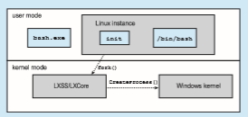

# Operating-System Structure

A system as large and complex as a modern operating system must be engi- neered carefully if it is to function properly and be modified easily. A common approach is to partition the task into small components, or modules, rather than have one single system. Each of these modules should be a well-defined portion of the system,with carefully defined interfaces and functions. Youmay use a similar approach when you structure your programs: rather than placing all of your code in the main() function, you instead separate logic into a num- ber of functions, clearly articulate parameters and return values, and then call those functions from main().  

**Figure 2.12** Traditional UNIX system structure.

We briefly discussed the common components of operating systems in Chapter 1. In this section,we discuss how these components are interconnected and melded into a kernel.

### Monolithic Structure

The simplest structure for organizing an operating system is no structure at all. That is, place all of the functionality of the kernel into a single, static binary file that runs in a single address space. This approach—known as a **monolithic** structure—is a common technique for designing operating systems.

An example of such limited structuring is the original UNIX operating system, which consists of two separable parts: the kernel and the system programs. The kernel is further separated into a series of interfaces and device drivers, which have been added and expanded over the years as UNIX has evolved. We can view the traditional UNIX operating system as being layered to some extent, as shown in Figure 2.12. Everything below the system-call interface and above the physical hardware is the kernel. The kernel provides the file system, CPU scheduling, memory management, and other operating- system functions through system calls. Taken in sum, that is an enormous amount of functionality to be combined into one single address space.

The Linux operating system is based on UNIX and is structured similarly, as shown in Figure 2.13. Applications typically use the glibc standard C library when communicating with the system call interface to the kernel. The Linux kernel is monolithic in that it runs entirely in kernel mode in a single address space, but as we shall see in Section 2.8.4, it does have a modular design that allows the kernel to be modified during run time.

Despite the apparent simplicity of monolithic kernels, they are difficult to implement and extend. Monolithic kernels do have a distinct performance advantage, however: there is very little overhead in the system-call interface, and communication within the kernel is fast. Therefore, despite the drawbacks  

**Figure 2.13** Linux system structure.

of monolithic kernels, their speed and efficiency explains why we still see evidence of this structure in the UNIX, Linux, andWindows operating systems.

### Layered Approach

The monolithic approach is often known as a **tightly coupled** system because changes to one part of the system can have wide-ranging effects on other parts. Alternatively, we could design a **loosely coupled** system. Such a system is divided into separate, smaller components that have specific and limited func- tionality. All these components together comprise the kernel. The advantage of this modular approach is that changes in one component affect only that component, and no others, allowing system implementers more freedom in creating and changing the inner workings of the system.

A system can be made modular in many ways. One method is the **layered approach**, in which the operating system is broken into a number of layers (levels). The bottom layer (layer 0) is the hardware; the highest (layer _N_) is the user interface. This layering structure is depicted in Figure 2.14.

An operating-system layer is an implementation of an abstract object made up of data and the operations that can manipulate those data. A typical operating-system layer—say, layer _M_—consists of data structures and a set of functions that can be invoked by higher-level layers. Layer _M,_ in turn, can invoke operations on lower-level layers.

The main advantage of the layered approach is simplicity of construction and debugging. The layers are selected so that each uses functions (operations)  

**Figure 2.14** A layered operating system.

and services of only lower-level layers. This approach simplifies debugging and system verification. The first layer can be debugged without any concern for the rest of the system, because, by definition, it uses only the basic hardware (which is assumed correct) to implement its functions. Once the first layer is debugged, its correct functioning can be assumed while the second layer is debugged, and so on. If an error is found during the debugging of a particular layer, the error must be on that layer, because the layers below it are already debugged. Thus, the design and implementation of the system are simplified.

Each layer is implemented only with operations provided by lower-level layers. A layer does not need to know how these operations are implemented; it needs to know only what these operations do. Hence, each layer hides the existence of certain data structures, operations, and hardware from higher- level layers.

Layered systems have been successfully used in computer networks (such as TCP/IP) and web applications. Nevertheless, relatively few operating sys- tems use a pure layered approach. One reason involves the challenges of appropriately defining the functionality of each layer. In addition, the overall performance of such systems is poor due to the overhead of requiring a user program to traverse throughmultiple layers to obtain an operating-system ser- vice. **_Some_** layering is common in contemporary operating systems, however. Generally, these systems have fewer layers with more functionality, providing most of the advantages of modularized code while avoiding the problems of layer definition and interaction.

### Microkernels

We have already seen that the original UNIX system had a monolithic struc- ture. As UNIX expanded, the kernel became large and difficult to manage. In the mid-1980s, researchers at Carnegie Mellon University developed an operating system called **Mach** that modularized the kernel using the **micro- kernel** approach. This method structures the operating system by removing  

**Figure 2.15** Architecture of a typical microkernel.

all nonessential components from the kernel and implementing them as user- level programs that reside in separate address spaces. The result is a smaller kernel. There is little consensus regarding which services should remain in the kernel and which should be implemented in user space. Typically, however, microkernels provide minimal process and memory management, in addition to a communication facility. Figure 2.15 illustrates the architecture of a typical microkernel.

The main function of the microkernel is to provide communication between the client program and the various services that are also running in user space. Communication is provided through message passing, which was described in Section 2.3.3.5. For example, if the client programwishes to access a file, it must interact with the file server. The client program and service never interact directly. Rather, they communicate indirectly by exchanging messages with the microkernel.

One benefit of the microkernel approach is that it makes extending the operating system easier. All new services are added to user space and conse- quently do not requiremodification of the kernel.When the kernel does have to be modified, the changes tend to be fewer, because the microkernel is a smaller kernel. The resulting operating system is easier to port from one hardware design to another. The microkernel also provides more security and reliability, since most services are running as user—rather than kernel—processes. If a service fails, the rest of the operating system remains untouched.

Perhaps the best-known illustration of a microkernel operating system is **_Darwin_**, the kernel component of the macOS and iOS operating systems. Darwin, in fact, consists of two kernels, one of which is the Mach microkernel. We will cover the macOS and iOS systems in further detail in Section 2.8.5.1.

Another example is QNX, a real-time operating system for embedded sys- tems. The QNX Neutrino microkernel provides services for message passing and process scheduling. It also handles low-level network communication and hardware interrupts. All other services in QNX are provided by standard pro- cesses that run outside the kernel in user mode.

Unfortunately, the performance ofmicrokernels can suffer due to increased system-function overhead. When two user-level services must communicate, messages must be copied between the services, which reside in separate address spaces. In addition, the operating system may have to switch from one process to the next to exchange the messages. The overhead involved in copying messages and switching between processes has been the largest impediment to the growth of microkernel-based operating systems. Consider the history of Windows NT: The first release had a layered microkernel organi- zation. This version’s performance was low compared with that of Windows 95. Windows NT 4.0 partially corrected the performance problem by moving layers from user space to kernel space and integrating them more closely. By the time Windows XP was designed, Windows architecture had become more monolithic than microkernel. Section 2.8.5.1 will describe how macOS addresses the performance issues of the Mach microkernel.

### Modules

Perhaps the best current methodology for operating-system design involves using **loadable kernel modules** (**LKMs**). Here, the kernel has a set of core components and can link in additional services viamodules, either at boot time or during run time. This type of design is common inmodern implementations of UNIX, such as Linux, macOS, and Solaris, as well as Windows.

The idea of the design is for the kernel to provide core services, while other services are implemented dynamically, as the kernel is running. Linking services dynamically is preferable to adding new features directly to the kernel, which would require recompiling the kernel every time a change was made. Thus, for example, we might build CPU scheduling and memory management algorithms directly into the kernel and then add support for different file systems by way of loadable modules.

The overall result resembles a layered system in that each kernel section has defined, protected interfaces; but it is more flexible than a layered system, because any module can call any other module. The approach is also similar to the microkernel approach in that the primary module has only core functions and knowledge of how to load and communicate with other modules; but it is more efficient, because modules do not need to invoke message passing in order to communicate.

Linux uses loadable kernel modules, primarily for supporting device drivers and file systems. LKMs can be “inserted” into the kernel as the sys- tem is started (or **_booted_**) or during run time, such as when a USB device is plugged into a running machine. If the Linux kernel does not have the nec- essary driver, it can be dynamically loaded. LKMs can be removed from the kernel during run time as well. For Linux, LKMs allow a dynamic andmodular kernel, while maintaining the performance benefits of a monolithic system.We cover creating LKMs in Linux in several programming exercises at the end of this chapter.

### Hybrid Systems

In practice, very few operating systems adopt a single, strictly defined struc- ture. Instead, they combine different structures, resulting in hybrid systems that address performance, security, and usability issues. For example, Linux is monolithic, because having the operating system in a single address space provides very efficient performance. However, it also modular, so that new functionality can be dynamically added to the kernel. Windows is largely monolithic as well (again primarily for performance reasons), but it retains some behavior typical of microkernel systems, including providing support for separate subsystems (known as operating-system **_personalities_**) that run as user-mode processes. Windows systems also provide support for dynamically loadable kernel modules. We provide case studies of Linux and Windows 10 in Chapter 20 and Chapter 21, respectively. In the remainder of this section, we explore the structure of three hybrid systems: the Apple macOS operat- ing system and the two most prominent mobile operating systems—iOS and Android.

#### macOS and iOS

Apple’s macOS operating system is designed to run primarily on desktop and laptop computer systems, whereas iOS is a mobile operating system designed for the iPhone smartphone and iPad tablet computer. Architecturally, macOS and iOS have much in common, and so we present them together, highlighting what they share as well as how they differ from each other. The general archi- tecture of these two systems is shown in Figure 2.16. Highlights of the various layers include the following:

• **User experience layer**. This layer defines the software interface that allows users to interact with the computing devices. macOS uses the **_Aqua_** user interface, which is designed for a mouse or trackpad, whereas iOS uses the **_Springboard_** user interface, which is designed for touch devices.

• **Application frameworks layer**. This layer includes the **_Cocoa_** and **_Cocoa Touch_** frameworks, which provide an API for the Objective-C and Swift programming languages. The primary difference between Cocoa and Cocoa Touch is that the former is used for developingmacOS applications, and the latter by iOS to provide support for hardware features unique to mobile devices, such as touch screens.

• **Core frameworks**. This layer defines frameworks that support graphics and media including, Quicktime and OpenGL.

**Figure 2.16** Architecture of Apple’s macOS and iOS operating systems.  

• **Kernel environment**. This environment, also known as **Darwin**, includes the Mach microkernel and the BSD UNIX kernel. We will elaborate on Darwin shortly.

As shown in Figure 2.16, applications can be designed to take advantage of user-experience features or to bypass them and interact directly with either the application framework or the core framework. Additionally, an application can forego frameworks entirely and communicate directly with the kernel environment. (An example of this latter situation is a C program written with no user interface that makes POSIX system calls.)

Some significant distinctions between macOS and iOS include the follow- ing:

• Because macOS is intended for desktop and laptop computer systems, it is compiled to run on Intel architectures. iOS is designed for mobile devices and thus is compiled for ARM-based architectures. Similarly, the iOS ker- nel has been modified somewhat to address specific features and needs of mobile systems, such as power management and aggressive memory management. Additionally, iOS has more stringent security settings than macOS.

• The iOS operating system is generally much more restricted to developers than macOS and may even be closed to developers. For example, iOS restricts access to POSIX and BSD APIs on iOS, whereas they are openly available to developers on macOS.

We now focus on Darwin, which uses a hybrid structure. Darwin is a layered system that consists primarily of the Mach microkernel and the BSD UNIX kernel. Darwin’s structure is shown in Figure 2.17.

Whereas most operating systems provide a single system-call interface to the kernel—such as through the standardC library on UNIX and Linux systems —Darwin provides **_two_** system-call interfaces: Mach system calls (known as

**Figure 2.17** The structure of Darwin.  

**traps**) and BSD system calls (which provide POSIX functionality). The interface to these system calls is a rich set of libraries that includes not only the standard C library but also libraries that provide networking, security, and progamming language support (to name just a few).

Beneath the system-call interface, Mach provides fundamental operating- system services, including memory management, CPU scheduling, and inter- process communication (IPC) facilities such as message passing and remote procedure calls (RPCs).Much of the functionality providedbyMach is available through **kernel abstractions**, which include tasks (a Mach process), threads, memory objects, and ports (used for IPC). As an example, an application may create a new process using the BSD POSIX fork() system call. Mach will, in turn, use a task kernel abstraction to represent the process in the kernel.

In addition to Mach and BSD, the kernel environment provides an I/O kit for development of device drivers and dynamically loadable modules (which macOS refers to as **kernel extensions**, or **kexts**).

In Section 2.8.3, we described how the overhead of message passing betweendifferent services running in user space compromises the performance of microkernels. To address such performance problems, Darwin combines Mach, BSD, the I/O kit, and any kernel extensions into a single address space. Thus, Mach is not a pure microkernel in the sense that various subsystems run in user space. Message passing within Mach still does occur, but no copying is necessary, as the services have access to the same address space.

Apple has released the Darwin operating system as open source. As a result, various projects have added extra functionality toDarwin, such as the X- 11 windowing system and support for additional file systems. Unlike Darwin, however, the Cocoa interface, as well as other proprietary Apple frameworks available for developing macOS applications, are closed.

#### Android

The Android operating system was designed by the Open Handset Alliance (led primarily by Google) and was developed for Android smartphones and tablet computers. Whereas iOS is designed to run on Apple mobile devices and is close-sourced, Android runs on a variety of mobile platforms and is open- sourced, partly explaining its rapid rise in popularity. The structure of Android appears in Figure 2.18.

Android is similar to iOS in that it is a layered stack of software that provides a rich set of frameworks supporting graphics, audio, and hardware features. These features, in turn, provide a platform for developing mobile applications that run on a multitude of Android-enabled devices.

Software designers for Android devices develop applications in the Java language, but they do not generally use the standard Java API. Google has designed a separate Android API for Java development. Java applications are compiled into a form that can execute on the Android RunTime ART, a virtual machine designed for Android and optimized for mobile devices with limited memory and CPU processing capabilities. Java programs are first compiled to a Java bytecode .class file and then translated into an executable .dex file. Whereas many Java virtual machines perform just-in-time (JIT) compilation to improve application efficiency, ART performs **ahead-of-time** (**AOT**) compila-  

**Figure 2.18** Architecture of Google’s Android.

tion. Here, .dex files are compiled into native machine code when they are installed on a device, from which they can execute on the ART. AOT compi- lation allows more efficient application execution as well as reduced power consumption, features that are crucial for mobile systems.

Android developers can also write Java programs that use the Java native interface—or JNI—which allows developers to bypass the virtual machine and instead write Java programs that can access specific hardware features. Programs written using JNI are generally not portable from one hardware device to another.

The set of native libraries available for Android applications includes frameworks for developing web browsers (webkit), database support (SQLite), and network support, such as secure sockets (SSLs).

Because Android can run on an almost unlimited number of hardware devices, Google has chosen to abstract the physical hardware through the hard- ware abstraction layer, or HAL. By abstracting all hardware, such as the camera, GPS chip, and other sensors, the HAL provides applications with a consistent view independent of specific hardware. This feature, of course, allows devel- opers to write programs that are portable across different hardware platforms.

The standardC library used by Linux systems is the GNUC library (glibc). Google instead developed the **Bionic** standard C library for Android. Not only does Bionic have a smaller memory footprint than glibc, but it also has been designed for the slower CPUs that characterize mobile devices. (In addition, Bionic allows Google to bypass GPL licensing of glibc.)  

At the bottom of Android’s software stack is the Linux kernel. Google has modified the Linux kernel used in Android in a variety of areas to support the special needs of mobile systems, such as power management. It has also made changes in memory management and allocation and has added a new form of IPC known as **_Binder_** (which we will cover in Section 3.8.2.1).

**_WINDOWS SUBSYSTEM FOR LINUX_**

Windows uses a hybrid architecture that provides subsystems to emu- late different operating-system environments. These user-mode subsystems communicate with the Windows kernel to provide actual services. Windows 10 adds a Windows subsystem for Linux (**WSL**), which allows native Linux applications (specified as ELF binaries) to run on Windows 10. The typical operation is for a user to start the Windows application bash.exe, which presents the user with a bash shell running Linux. Internally, theWSL creates a **Linux instance** consisting of the init process, which in turn creates the bash shell running the native Linux application /bin/bash. Each of these processes runs in a Windows **Pico** process. This special process loads the native Linux binary into the process’s own address space, thus providing an environment in which a Linux application can execute.

Pico processes communicate with the kernel services LXCore and LXSS to translate Linux system calls, if possible using native Windows system calls. When the Linux application makes a system call that has no Windows equivalent, the LXSS service must provide the equivalent functionality. When there is a one-to-one relationship between the Linux and Windows system calls, LXSS forwards the Linux system call directly to the equivalent call in the Windows kernel. In some situations, Linux and Windows have system calls that are similar but not identical. When this occurs, LXSS will provide some of the functionality and will invoke the similar Windows system call to provide the remainder of the functionality. The Linux fork() provides an illustration of this: TheWindows CreateProcess() system call is similar to fork() but does not provide exactly the same functionality. When fork() is invoked in WSL, the LXSS service does some of the initial work of fork() and then calls CreateProcess() to do the remainder of thework. The figure below illustrates the basic behavior of WSL.
