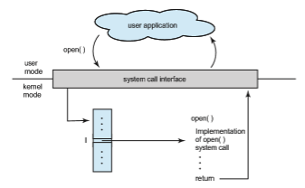
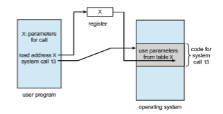
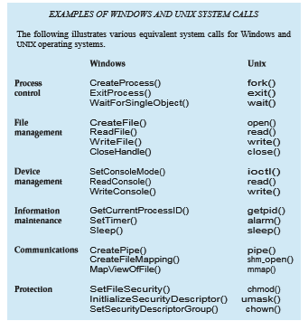
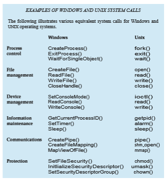
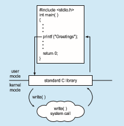

# System Calls

**System calls** provide an interface to the services made available by an operat- ing system. These calls are generally available as functions written in C and C++, although certain low-level tasks (for example, tasks where hardware must be accessed directly) may have to be written using assembly-language instructions.

### Example

Before we discuss how an operating systemmakes system calls available, let’s first use an example to illustrate how system calls are used: writing a simple program to read data from one file and copy them to another file. The first input that the program will need is the names of the two files: the input file and the output file. These names can be specified in many ways, depending on the operating-system design. One approach is to pass the names of the two files as part of the command—for example, the UNIX cp command:

cp in.txt out.txt

This command copies the input file in.txt to the output file out.txt. A sec- ond approach is for the program to ask the user for the names. In an interactive system, this approach will require a sequence of system calls, first to write a prompting message on the screen and then to read from the keyboard the characters that define the two files. On mouse-based and icon-based systems, a menu of file names is usually displayed in a window. The user can then use the mouse to select the source name, and a window can be opened for the destination name to be specified. This sequence requiresmany I/O system calls.

Once the two file names have been obtained, the program must open the input file and create and open the output file. Each of these operations requires another system call. Possible error conditions for each system call must be handled. For example, when the program tries to open the input file, it may find that there is no file of that name or that the file is protected against access. In these cases, the program should output an error message (another sequence of system calls) and then terminate abnormally (another system call). If the input file exists, then we must create a new output file. We may find that there is already an output file with the same name. This situation may cause the program to abort (a system call), or we may delete the existing file (another system call) and create a new one (yet another system call). Another option, in an interactive system, is to ask the user (via a sequence of system calls to output the prompting message and to read the response from the terminal) whether to replace the existing file or to abort the program.

When both files are set up, we enter a loop that reads from the input file (a system call) and writes to the output file (another system call). Each read andwrite must return status information regarding various possible error conditions. On input, the program may find that the end of the file has been Example System-Call Sequence Acquire input file name Write prompt to screen Accept input Acquire output file name Write prompt to screen Accept input Open the input file if file doesn't exist, abort Create output file if file exists, abort Loop Read from input file Write to output file Until read fails Close output file Write completion message to screen Terminate normally

**Figure 2.5** Example of how system calls are used.

reached or that there was a hardware failure in the read (such as a parity error). The write operation may encounter various errors, depending on the output device (for example, no more available disk space).

Finally, after the entire file is copied, the program may close both files (two system calls), write a message to the console or window (more system calls), and finally terminate normally (the final system call). This system-call sequence is shown in Figure 2.5.

### Application Programming Interface

As you can see, even simple programs may make heavy use of the operat- ing system. Frequently, systems execute thousands of system calls per second. Most programmers never see this level of detail, however. Typically, applica- tion developers design programs according to an **application programming interface** (**API**). The API specifies a set of functions that are available to an appli- cation programmer, including the parameters that are passed to each function and the return values the programmer can expect. Three of the most common APIs available to application programmers are the Windows API for Windows systems, the POSIX API for POSIX-based systems (which include virtually all versions of UNIX, Linux, and macOS), and the Java API for programs that run on the Java virtualmachine. Aprogrammer accesses an API via a library of code provided by the operating system. In the case of UNIX and Linux for programs written in the C language, the library is called **libc**. Note that—unless specified —the system-call names used throughout this text are generic examples. Each operating system has its own name for each system call.

Behind the scenes, the functions that make up an API typically invoke the actual system calls on behalf of the application programmer. For example, the Windows function CreateProcess() (which, unsurprisingly, is used to create  

**_EXAMPLE OF STANDARD API_**

As an example of a standard API, consider the read() function that is avail- able in UNIX and Linux systems. The API for this function is obtained from the man page by invoking the command

man read

on the command line. A description of this API appears below:

Aprogram that uses the read() functionmust include the unistd.h header file, as this file defines the ssize t and size t data types (among other things). The parameters passed to read() are as follows:

• int fd—the file descriptor to be read

• void \*buf—a buffer into which the data will be read

• size t count—the maximum number of bytes to be read into the buffer

On a successful read, the number of bytes read is returned. A return value of 0 indicates end of file. If an error occurs, read() returns −1.

a new process) actually invokes the NTCreateProcess() system call in the Windows kernel.

Why would an application programmer prefer programming according to an API rather than invoking actual system calls? There are several reasons for doing so. One benefit concerns program portability. An application program- mer designing a program using an API can expect her program to compile and run on any system that supports the sameAPI (although, in reality, architectural differences often make this more difficult than it may appear). Furthermore, actual system calls can often be more detailed and difficult to work with than the API available to an application programmer.Nevertheless, there often exists a strong correlation between a function in the API and its associated system call within the kernel. In fact, many of the POSIX and Windows APIs are similar to the native system calls provided by the UNIX, Linux, and Windows operating systems.

Another important factor in handling system calls is the **run-time envi- ronment** (**RTE**)—the full suite of software needed to execute applications writ- ten in a given programming language, including its compilers or interpreters as well as other software, such as libraries and loaders. The RTE provides a  

**Figure 2.6** The handling of a user application invoking the open() system call.

**system-call interface** that serves as the link to system calls made available by the operating system. The system-call interface intercepts function calls in the API and invokes the necessary system calls within the operating system. Typically, a number is associated with each system call, and the system-call interface maintains a table indexed according to these numbers. The system- call interface then invokes the intended system call in the operating-system kernel and returns the status of the system call.

The caller need know nothing about how the system call is implemented or what it does during execution. Rather, the caller need only obey the API and understand what the operating system will do as a result of the execution of that system call. Thus, most of the details of the operating-system interface are hidden from the programmer by the API and are managed by the RTE. The relationship among an API, the system-call interface, and the operating system is shown in Figure 2.6, which illustrates how the operating system handles a user application invoking the open() system call.

System calls occur in different ways, depending on the computer in use. Often, more information is required than simply the identity of the desired system call. The exact type and amount of information vary according to the particular operating system and call. For example, to get input, we may need to specify the file or device to use as the source, as well as the address and length of the memory buffer into which the input should be read. Of course, the device or file and length may be implicit in the call.

Three general methods are used to pass parameters to the operating sys- tem. The simplest approach is to pass the parameters in registers. In some cases, however, there may be more parameters than registers. In these cases, the parameters are generally stored in a block, or table, in memory, and the address of the block is passed as a parameter in a register (Figure 2.7). Linux uses a combination of these approaches. If there are five or fewer parameters,  

**Figure 2.7** Passing of parameters as a table.

registers are used. If there are more than five parameters, the block method is used. Parameters also can be placed, or **pushed**, onto a **stack** by the program and **popped** off the stack by the operating system. Some operating systems prefer the block or stack method because those approaches do not limit the number or length of parameters being passed.

### Types of System Calls

System calls can be grouped roughly into six major categories: **process control**, **fil management**, **device management**, **information maintenance**, **communi- cations**, and **protection**. Below, we briefly discuss the types of system calls that may be provided by an operating system. Most of these system calls support, or are supported by, concepts and functions that are discussed in later chap- ters. Figure 2.8 summarizes the types of system calls normally provided by an operating system. As mentioned, in this text, we normally refer to the system calls by generic names. Throughout the text, however, we provide examples of the actual counterparts to the system calls for UNIX, Linux, and Windows systems.

#### Process Control

A running program needs to be able to halt its execution either normally (end()) or abnormally (abort()). If a system call is made to terminate the currently running program abnormally, or if the program runs into a problem and causes an error trap, a dump of memory is sometimes taken and an error message generated. The dump is written to a special log file on disk and may be examined by a **debugger**—a system program designed to aid the programmer in finding and correcting errors, or **bugs**—to determine the cause of the problem. Under either normal or abnormal circumstances, the operating system must transfer control to the invoking command interpreter. The command interpreter then reads the next command. In an interactive system, the command interpreter simply continues with the next command; it is assumed that the user will issue an appropriate command to respond to  

• Process control

◦ create process, terminate process

◦ load, execute

◦ get process attributes, set process attributes

◦ wait event, signal event

◦ allocate and free memory

• File management ◦ create file, delete file

◦ open, close

◦ read, write, reposition

◦ get file attributes, set file attributes

• Device management ◦ request device, release device

◦ read, write, reposition

◦ get device attributes, set device attributes

◦ logically attach or detach devices

• Information maintenance ◦ get time or date, set time or date

◦ get system data, set system data

◦ get process, file, or device attributes

◦ set process, file, or device attributes

• Communications ◦ create, delete communication connection

◦ send, receive messages

◦ transfer status information

◦ attach or detach remote devices

• Protection ◦ get file permissions

◦ set file permissions

**Figure 2.8** Types of system calls.  

**_EXAMPLES OFWINDOWS AND UNIX SYSTEM CALLS_**

The following illustrates various equivalent system calls for Windows and UNIX operating systems.

any error. In a GUI system, a pop-up window might alert the user to the error and ask for guidance. Some systems may allow for special recovery actions in case an error occurs. If the program discovers an error in its input and wants to terminate abnormally, it may also want to define an error level. More severe errors can be indicated by a higher-level error parameter. It is then possible to combine normal and abnormal termination by defining a normal termination as an error at level 0. The command interpreter or a following program can use this error level to determine the next action automatically.

A process executing one program may want to load() and execute() another program. This feature allows the command interpreter to execute a program as directed by, for example, a user command or the click of a mouse. An interesting question is where to return control when the loaded program terminates. This question is related to whether the existing program is lost, saved, or allowed to continue execution concurrently with the new program.

If control returns to the existing program when the new program termi- nates, we must save the memory image of the existing program; thus, we have  

**_THE STANDARD C LIBRARY_**

The standard C library provides a portion of the system-call interface for many versions of UNIX and Linux. As an example, let’s assume a C pro- gram invokes the printf() statement. The C library intercepts this call and invokes the necessary system call (or calls) in the operating system—in this instance, the write() system call. The C library takes the value returned by write() and passes it back to the user program:

effectively created a mechanism for one program to call another program. If both programs continue concurrently, we have created a new process to be multiprogrammed. Often, there is a system call specifically for this purpose (create process()).

If we create a new process, or perhaps even a set of processes, we should be able to control its execution. This control requires the ability to determine and reset the attributes of a process, including the process’s priority, its max- imum allowable execution time, and so on (get process attributes() and set process attributes()). We may also want to terminate a process that we created (terminate process()) if we find that it is incorrect or is no longer needed.

Having created new processes, we may need to wait for them to finish their execution. We may want to wait for a certain amount of time to pass (wait time()). More probably, we will want to wait for a specific event to occur (wait event()). The processes should then signal when that event has occurred (signal event()).

Quite often, two or more processes may share data. To ensure the integrity of the data being shared, operating systems often provide system calls allowing  

**Figure 2.9** Arduino execution. (a) At system startup. (b) Running a sketch.

a process to **lock** shared data. Then, no other process can access the data until the lock is released. Typically, such system calls include acquire lock() and release lock(). System calls of these types, dealing with the coordination of concurrent processes, are discussed in great detail in Chapter 6 and Chapter 7.

There are so many facets of and variations in process control that we next use two examples—one involving a single-tasking system and the other a multitasking system—to clarify these concepts. The Arduino is a simple hardware platform consisting of a microcontroller along with input sensors that respond to a variety of events, such as changes to light, temperature, and barometric pressure, to just name a few. Towrite a program for theArduino,we first write the program on a PC and then upload the compiled program (known as a **sketch**) from the PC to the Arduino’s flash memory via a USB connection. The standardArduino platformdoes not provide an operating system; instead, a small piece of software known as a **boot loader** loads the sketch into a specific region in the Arduino’s memory (Figure 2.9). Once the sketch has been loaded, it begins running, waiting for the events that it is programmed to respond to. For example, if the Arduino’s temperature sensor detects that the temperature has exceeded a certain threshold, the sketch may have the Arduino start the motor for a fan. An Arduino is considered a single-tasking system, as only one sketch can be present in memory at a time; if another sketch is loaded, it replaces the existing sketch. Furthermore, the Arduino provides no user interface beyond hardware input sensors.

FreeBSD (derived from Berkeley UNIX) is an example of a multitasking system. When a user logs on to the system, the shell of the user’s choice is run, awaiting commands and running programs the user requests. However, since FreeBSD is a multitasking system, the command interpreter may continue running while another program is executed (Figure 2.10). To start a new pro- cess, the shell executes a fork() system call. Then, the selected program is loaded into memory via an exec() system call, and the program is executed. Depending on how the commandwas issued, the shell then eitherwaits for the process to finish or runs the process “in the background.” In the latter case, the shell immediately waits for another command to be entered.When a process is running in the background, it cannot receive input directly from the keyboard, because the shell is using this resource. I/O is therefore done through files or through a GUI interface. Meanwhile, the user is free to ask the shell to run other programs, to monitor the progress of the running process, to change that program’s priority, and so on. When the process is done, it executes an exit()  

**Figure 2.10** Free BSD running multiple programs.

system call to terminate, returning to the invoking process a status code of 0 or a nonzero error code. This status or error code is then available to the shell or other programs. Processes are discussed in Chapter 3 with a program example using the fork() and exec() system calls.

#### File Management

The file system is discussed in more detail in Chapter 13 through Chapter 15. Here, we identify several common system calls dealing with files.

We first need to be able to create() and delete() files. Either system call requires the name of the file and perhaps some of the file’s attributes. Once the file is created, we need to open() it and to use it. We may also read(), write(), or reposition() (rewind or skip to the end of the file, for example). Finally, we need to close() the file, indicating that we are no longer using it.

We may need these same sets of operations for directories if we have a directory structure for organizing files in the file system. In addition, for either files or directories, we need to be able to determine the values of various attributes and perhaps to set them if necessary. File attributes include the file name, file type, protection codes, accounting information, and so on. At least two system calls, get file attributes() and set file attributes(), are required for this function. Some operating systems provide many more calls, such as calls for file move() and copy(). Others might provide an API that performs those operations using code and other system calls, and others might provide system programs to perform the tasks. If the system programs are callable by other programs, then each can be considered an API by other system programs.

#### Device Management

Aprocess may need several resources to execute—main memory, disk drives, access to files, and so on. If the resources are available, they can be granted, and control can be returned to the user process. Otherwise, the process will have to wait until sufficient resources are available.  
The various resources controlled by the operating system can be thought of as devices. Some of these devices are physical devices (for example, disk drives), while others can be thought of as abstract or virtual devices (for example, files). Asystemwithmultiple usersmay require us to first request() a device, to ensure exclusive use of it. After we are finished with the device, we release() it. These functions are similar to the open() and close() system calls for files. Other operating systems allow unmanaged access to devices. The hazard then is the potential for device contention and perhaps deadlock,which are described in Chapter 8.

Once the device has been requested (and allocated to us), we can read(), write(), and (possibly) reposition() the device, just as we can with files. In fact, the similarity between I/O devices and files is so great thatmany operating systems, including UNIX, merge the two into a combined file–device structure. In this case, a set of system calls is used on both files and devices. Sometimes, I/O devices are identified by special file names, directory placement, or file attributes.

The user interface can alsomake files and devices appear to be similar, even though the underlying system calls are dissimilar. This is another example of the many design decisions that go into building an operating system and user interface.

#### Information Maintenance

Many system calls exist simply for the purpose of transferring information between the user program and the operating system. For example, most sys- tems have a system call to return the current time() and date(). Other system calls may return information about the system, such as the version number of the operating system, the amount of free memory or disk space, and so on.

Another set of system calls is helpful in debugging a program. Many systems provide system calls to dump() memory. This provision is useful for debugging. The program strace, which is available on Linux systems, lists each system call as it is executed. Even microprocessors provide a CPU mode, known as **single step**, in which a trap is executed by the CPU after every instruction. The trap is usually caught by a debugger.

Many operating systems provide a time profile of a program to indicate the amount of time that the program executes at a particular location or set of locations. A time profile requires either a tracing facility or regular timer interrupts. At every occurrence of the timer interrupt, the value of the program counter is recorded. With sufficiently frequent timer interrupts, a statistical picture of the time spent on various parts of the program can be obtained.

In addition, the operating system keeps information about all its processes, and system calls are used to access this information. Generally, calls are also used to get and set the process information (get process attributes() and set process attributes()). In Section 3.1.3, we discuss what information is normally kept.

#### Communication

There are two common models of interprocess communication: the message- passingmodel and the shared-memorymodel. In the **message-passing model**, the communicating processes exchange messages with one another to transfer information. Messages can be exchanged between the processes either directly or indirectly through a common mailbox. Before communication can take place, a connection must be opened. The name of the other communica- tor must be known, be it another process on the same system or a process on another computer connected by a communications network. Each computer in a network has a **host name** by which it is commonly known. A host also has a network identifier, such as an IP address. Similarly, each process has a **process name**, and this name is translated into an identifier by which the operating system can refer to the process. The get hostid() and get processid() system calls do this translation. The identifiers are then passed to the general- purpose open() and close() calls provided by the file system or to specific open connection() and close connection() system calls, depending on the system’s model of communication. The recipient process usually must give its permission for communication to take placewith an accept connection() call. Most processes that will be receiving connections are special-purpose **dae- mons**, which are system programs provided for that purpose. They execute a wait for connection() call and are awakened when a connection is made. The source of the communication, known as the **client**, and the receiving dae- mon, known as a **server**, then exchange messages by using read message() and write message() system calls. The close connection() call terminates the communication.

In the **shared-memory model**, processes use shared memory create() and shared memory attach() system calls to create and gain access to regions of memory owned by other processes. Recall that, normally, the operating system tries to prevent one process from accessing another process’s memory. Shared memory requires that two or more processes agree to remove this restriction. They can then exchange information by reading and writing data in the shared areas. The form of the data is determined by the processes and is not under the operating system’s control. The processes are also responsible for ensuring that they are notwriting to the same location simultaneously. Such mechanisms are discussed in Chapter 6. In Chapter 4, we look at a variation of the process scheme—threads—in which some memory is shared by default.

Both of the models just discussed are common in operating systems, and most systems implement both. Message passing is useful for exchanging smaller amounts of data, because no conflicts need be avoided. It is also eas- ier to implement than is shared memory for intercomputer communication. Shared memory allows maximum speed and convenience of communication, since it can be done at memory transfer speeds when it takes place within a computer. Problems exist, however, in the areas of protection and synchroniza- tion between the processes sharing memory.

#### Protection

Protection provides a mechanism for controlling access to the resources pro- vided by a computer system. Historically, protection was a concern only on multiprogrammed computer systems with several users. However, with the advent of networking and the Internet, all computer systems, from servers to mobile handheld devices, must be concerned with protection.

Typically, system calls providing protection include set permission() and get permission(), which manipulate the permission settings of  

resources such as files and disks. The allow user() and deny user() system calls specify whether particular users can—or cannot—be allowed access to certain resources. We cover protection in Chapter 17 and the much larger issue of security—which involves using protection against external threats— in Chapter 16.