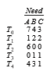
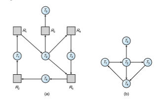
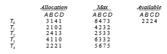

# Deadlocks

In a multiprogramming environment, several threads may compete for a finite number of resources. A thread requests resources; if the resources are not available at that time, the thread enters a waiting state. Sometimes, a waiting thread can never again change state, because the resources it has requested are held by otherwaiting threads. This situation is called a **deadlock**.We discussed this issue briefly in Chapter 6 as a form of liveness failure. There, we defined deadlock as a situation in which _every process in a set of processes is waiting for an event that can be caused only by another process in the set_.

Perhaps the best illustration of a deadlock can be drawn from a law passed by the Kansas legislature early in the 20th century. It said, in part: “When two trains approach each other at a crossing, both shall come to a full stop and neither shall start up again until the other has gone.”

In this chapter, we describe methods that application developers as well as operating-system programmers can use to prevent or deal with dead- locks. Although some applications can identify programs that may dead- lock, operating systems typically do not provide deadlock-prevention facil- ities, and it remains the responsibility of programmers to ensure that they design deadlock-free programs. Deadlock problems—aswell as other liveness failures—are becoming more challenging as demand continues for increased concurrency and parallelism on multicore systems.

**CHAPTER OBJECTIVES**

• Illustrate how deadlock can occur when mutex locks are used.

• Define the four necessary conditions that characterize deadlock.

• Identify a deadlock situation in a resource allocation graph.

• Evaluate the four different approaches for preventing deadlocks.

• Apply the banker’s algorithm for deadlock avoidance.

• Apply the deadlock detection algorithm.

• Evaluate approaches for recovering from deadlock.


## System Model

A system consists of a finite number of resources to be distributed among a number of competing threads. The resources may be partitioned into several types (or classes), each consisting of some number of identical instances. CPU cycles, files, and I/O devices (such as network interfaces and DVD drives) are examples of resource types. If a system has four CPUs, then the resource type _CPU_ has four instances. Similarly, the resource type _network_ may have two instances. If a thread requests an instance of a resource type, the allocation of **_any_** instance of the type should satisfy the request. If it does not, then the instances are not identical, and the resource type classes have not been defined properly.

The various synchronization tools discussed in Chapter 6, such as mutex locks and semaphores, are also system resources; and on contemporary com- puter systems, they are the most common sources of deadlock. However, def- inition is not a problem here. A lock is typically associated with a specific data structure—that is, one lock may be used to protect access to a queue, another to protect access to a linked list, and so forth. For that reason, each instance of a lock is typically assigned its own resource class.

Note that throughout this chapter we discuss kernel resources, but threads may use resources from other processes (for example, via interprocess commu- nication), and those resource uses can also result in deadlock. Such deadlocks are not the concern of the kernel and thus not described here.

A thread must request a resource before using it and must release the resource after using it. A thread may request as many resources as it requires to carry out its designated task. Obviously, the number of resources requested may not exceed the total number of resources available in the system. In other words, a thread cannot request two network interfaces if the system has only one.

Under the normal mode of operation, a thread may utilize a resource in only the following sequence:

**1. Request**. The thread requests the resource. If the request cannot be granted immediately (for example, if a mutex lock is currently held by another thread), then the requesting thread must wait until it can acquire the resource.

**2. Use**. The thread can operate on the resource (for example, if the resource is a mutex lock, the thread can access its critical section).

**3. Release**. The thread releases the resource.

The request and release of resources may be system calls, as explained in Chapter 2. Examples are the request() and release() of a device, open() and close() of a file, and allocate() and free() memory system calls. Similarly, as we saw in Chapter 6, request and release can be accomplished through the wait() and signal() operations on semaphores and through acquire() and release() of a mutex lock. For each use of a kernel-managed resource by a thread, the operating system checks to make sure that the thread has requested and has been allocated the resource. A system table records whether each resource is free or allocated. For each resource that is allocated, the table also records the thread to which it is allocated. If a thread requests a resource that is currently allocated to another thread, it can be added to a queue of threads waiting for this resource.

A set of threads is in a deadlocked statewhen every thread in the set iswait- ing for an event that can be caused only by another thread in the set. The events with which we are mainly concerned here are resource acquisition and release. The resources are typically logical (for example, mutex locks, semaphores, and files); however, other types of events may result in deadlocks, including read- ing from a network interface or the IPC (interprocess communication) facilities discussed in Chapter 3.

To illustrate a deadlocked state, we refer back to the dining-philosophers problem from Section 7.1.3. In this situation, resources are represented by chopsticks. If all the philosophers get hungry at the same time, and each philosopher grabs the chopstick on her left, there are no longer any available chopsticks. Each philosopher is then blocked waiting for her right chopstick to become available.

Developers of multithreaded applications must remain aware of the pos- sibility of deadlocks. The locking tools presented in Chapter 6 are designed to avoid race conditions. However, in using these tools, developers must pay careful attention to how locks are acquired and released. Otherwise, deadlock can occur, as described next.

## Deadlock in Multithreaded Applications

Prior to examining how deadlock issues can be identified and man- aged, we first illustrate how deadlock can occur in a multithreaded Pthread program using POSIX mutex locks. The pthread mutex init() function initializes an unlocked mutex. Mutex locks are acquired and released using pthread mutex lock() and pthread mutex unlock(), respectively. If a thread attempts to acquire a locked mutex, the call to pthread mutex lock() blocks the thread until the owner of the mutex lock invokes pthread mutex unlock().

Two mutex locks are created and initialized in the following code example:
```
pthread mutex t first mutex; pthread mutex t second mutex;

pthread mutex init(&first mutex,NULL); pthread mutex init(&second mutex,NULL);
```
Next, two threads—thread one and thread two—are created, and both these threads have access to both mutex locks. thread one and thread two run in the functions do work one() and do work two(), respectively, as shown in Figure 8.1.

In this example, thread one attempts to acquire the mutex locks in the order (1) first mutex, (2) second mutex. At the same time, thread two attempts to acquire the mutex locks in the order (1) second mutex, (2) first mutex. Deadlock is possible if thread one acquires first mutex while thread two acquires second mutex.  


```
/* thread one runs in this function */ void *do work one(void *param) {

pthread mutex lock(&first mutex); pthread mutex lock(&second mutex);*/ ** * Do some work */

pthread mutex unlock(&second mutex); pthread mutex unlock(&first mutex);

pthread exit(0); }

/* thread two runs in this function */ void *do work two(void *param) {

pthread mutex lock(&second mutex); pthread mutex lock(&first mutex);*/ ** * Do some work */

pthread mutex unlock(&first mutex); pthread mutex unlock(&second mutex);

pthread exit(0); }
```
**Figure 8.1** Deadlock example.

Note that, even though deadlock is possible, it will not occur if thread one can acquire and release the mutex locks for first mutex and second mutex before thread two attempts to acquire the locks. And, of course, the order in which the threads run depends on how they are scheduled by the CPU scheduler. This example illustrates a problem with handling deadlocks: it is difficult to identify and test for deadlocks that may occur only under certain scheduling circumstances.

### Livelock

**Livelock** is another form of liveness failure. It is similar to deadlock; both prevent two or more threads from proceeding, but the threads are unable to proceed for different reasons. Whereas deadlock occurs when every thread in a set is blocked waiting for an event that can be caused only by another thread in the set, livelock occurswhen a thread continuously attempts an action that fails. Livelock is similar to what sometimes happens when two people attempt to pass in a hallway: One moves to his right, the other to her left, still obstructing each other’s progress. Then he moves to his left, and she moves to her right, and so forth. They aren’t blocked, but they aren’t making any progress.

Livelock can be illustrated with the Pthreads pthread mutex trylock() function, which attempts to acquire a mutex lock without blocking. The code example in Figure 8.2 rewrites the example from Figure 8.1 so that it now uses pthread mutex trylock(). This situation can lead to livelock if thread one acquires first mutex, followed by thread two acquiring second mutex. Each thread then invokes pthread mutex trylock(), which fails, releases their respective locks, and repeats the same actions indefinitely.

Livelock typically occurs when threads retry failing operations at the same time. It thus can generally be avoided by having each thread retry the failing operation at random times. This is precisely the approach taken by Ethernet networks when a network collision occurs. Rather than trying to retransmit a packet immediately after a collision occurs, a host involved in a collision will **_backoff_** a random period of time before attempting to transmit again.

Livelock is less common than deadlock but nonetheless is a challenging issue indesigning concurrent applications, and like deadlock, itmay only occur under specific scheduling circumstances.

## Deadlock Characterization

In the previous section we illustrated how deadlock could occur in multi- threaded programming using mutex locks. We now look more closely at con- ditions that characterize deadlock.

### Necessary Conditions

Adeadlock situation can arise if the following four conditions hold simultane- ously in a system:

**1. Mutual exclusion**. At least one resource must be held in a nonsharable mode; that is, only one thread at a time can use the resource. If another thread requests that resource, the requesting threadmust be delayeduntil the resource has been released.

**2. Hold and wait**. A thread must be holding at least one resource and waiting to acquire additional resources that are currently being held by other threads.

**3. No preemption**. Resources cannot be preempted; that is, a resource can be released only voluntarily by the thread holding it, after that thread has completed its task.

**4. Circular wait**. A set _{T_ 0, _T_ 1, ..., _Tn}_ of waiting threadsmust exist such that _T_ 0 is waiting for a resource held by _T_ 1, _T_ 1 is waiting for a resource held by _T_ 2, ..., _Tn_−1 is waiting for a resource held by _Tn_, and _Tn_ is waiting for a resource held by _T_ 0.

We emphasize that all four conditions must hold for a deadlock to occur. The circular-wait condition implies the hold-and-wait condition, so the four  


```
/* thread one runs in this function */ void *do work one(void *param) {

int done = 0;

while (!done) { pthread mutex lock(&first mutex); if (**pthread mutex trylock**(&second mutex)) {

/** * Do some work */

pthread mutex unlock(&second mutex); pthread mutex unlock(&first mutex); done = 1;

} else

pthread mutex unlock(&first mutex); }

pthread exit(0); }

/* thread two runs in this function */ void *do work two(void *param) {

int done = 0;

while (!done) { pthread mutex lock(&second mutex); if (**pthread mutex trylock**(&first mutex)) {

/** * Do some work */

pthread mutex unlock(&first mutex); pthread mutex unlock(&second mutex); done = 1;

} else

pthread mutex unlock(&second mutex); }

pthread exit(0); }
```
**Figure 8.2** Livelock example.  


**Figure 8.3** Resource-allocation graph for program in Figure 8.1.

conditions are not completely independent. We shall see in Section 8.5, how- ever, that it is useful to consider each condition separately.

### Resource-Allocation Graph

Deadlocks can be described more precisely in terms of a directed graph called a **system resource-allocation graph**. This graph consists of a set of vertices _V_ and a set of edges _E_. The set of vertices_V_ is partitioned into two different types of nodes: _T_ = _{T_ 1, _T_ 2, ..., _Tn}_, the set consisting of all the active threads in the system, and _R_ = _{R_ 1, _R_ 2, ..., _Rm}_, the set consisting of all resource types in the system.

A directed edge from thread _Ti_ to resource type _Rj_ is denoted by _Ti_ → _Rj_; it signifies that thread _Ti_ has requested an instance of resource type _Rj_ and is currently waiting for that resource. A directed edge from resource type _Rj_ to thread _Ti_ is denoted by _Rj_ → _Ti_; it signifies that an instance of resource type _Rj_ has been allocated to thread _Ti_. A directed edge _Ti_ → _Rj_ is called a **request edge**; a directed edge _Rj_ → _Ti_ is called an **assignment edge**.

Pictorially, we represent each thread _Ti_ as a circle and each resource type _Rj_ as a rectangle. As a simple example, the resource allocation graph shown in Figure 8.3 illustrates the deadlock situation from the program in Figure 8.1. Since resource type _Rj_ may have more than one instance, we represent each such instance as a dot within the rectangle. Note that a request edge points only to the rectangle _Rj_, whereas an assignment edge must also designate one of the dots in the rectangle.

When thread _Ti_ requests an instance of resource type _Rj_, a request edge is inserted in the resource-allocation graph. When this request can be fulfilled, the request edge is **_instantaneously_** transformed to an assignment edge.When the thread no longer needs access to the resource, it releases the resource. As a result, the assignment edge is deleted.

The resource-allocation graph shown in Figure 8.4 depicts the following situation.

• The sets _T, R,_ and _E_:

◦ _T_ = _{T_ 1, _T_ 2, _T_ 3} ◦ _R_ = _{R_ 1, _R_ 2, _R_ 3, _R_ 4}  


**Figure 8.4** Resource-allocation graph.

◦ _E_ = _{T_ 1 → _R_ 1, _T_ 2 → _R_ 3, _R_ 1 → _T_ 2, _R_ 2 → _T_ 2, _R_ 2 → _T_ 1, _R_ 3 → _T_ 3} • Resource instances:

◦ One instance of resource type _R_ 1

◦ Two instances of resource type _R_ 2

◦ One instance of resource type _R_ 3

◦ Three instances of resource type _R_ 4

• Thread states:

◦ Thread _T_ 1 is holding an instance of resource type _R_ 2 and is waiting for an instance of resource type _R_ 1.

◦ Thread _T_ 2 is holding an instance of _R_ 1 and an instance of _R_ 2 and is waiting for an instance of _R_ 3.

◦ Thread _T_ 3 is holding an instance of _R_ 3.

Given the definition of a resource-allocation graph, it can be shown that, if the graph contains no cycles, then no thread in the system is deadlocked. If the graph does contain a cycle, then a deadlock may exist.

If each resource type has exactly one instance, then a cycle implies that a deadlock has occurred. If the cycle involves only a set of resource types, each of which has only a single instance, then a deadlock has occurred. Each thread involved in the cycle is deadlocked. In this case, a cycle in the graph is both a necessary and a sufficient condition for the existence of deadlock.

If each resource type has several instances, then a cycle does not necessarily imply that a deadlock has occurred. In this case, a cycle in the graph is a necessary but not a sufficient condition for the existence of deadlock.

To illustrate this concept, we return to the resource-allocation graph depicted in Figure 8.4. Suppose that thread _T_ 3 requests an instance of resource type _R_ 2. Since no resource instance is currently available, we add a request  


**Figure 8.5** Resource-allocation graph with a deadlock.

edge _T_ 3 → _R_ 2 to the graph (Figure 8.5). At this point, two minimal cycles exist in the system:

_T_ 1 → _R_ 1 → _T_ 2 → _R_ 3 → _T_ 3 → _R_ 2 → _T_ 1 _T_ 2 → _R_ 3 → _T_ 3 → _R_ 2 → _T_ 2

Threads _T_ 1, _T_ 2, and _T_ 3 are deadlocked. Thread _T_ 2 is waiting for the resource _R_ 3, which is held by thread _T_ 3. Thread _T_ 3 is waiting for either thread _T_ 1 or thread _T_ 2 to release resource _R_ 2. In addition, thread _T_ 1 is waiting for thread _T_ 2 to release resource _R_ 1.

Now consider the resource-allocation graph in Figure 8.6. In this example, we also have a cycle:

**Figure 8.6** Resource-allocation graph with a cycle but no deadlock.  


However, there is no deadlock. Observe that thread _T_ 4 may release its instance of resource type _R_ 2. That resource can then be allocated to _T_ 3, breaking the cycle.

In summary, if a resource-allocation graph does not have a cycle, then the system is **_not_** in a deadlocked state. If there is a cycle, then the system **_may_** or **_may not_** be in a deadlocked state. This observation is important when we deal with the deadlock problem.

## Methods for Handling Deadlocks

Generally speaking, we can deal with the deadlock problem in one of three ways:

• We can ignore the problem altogether and pretend that deadlocks never occur in the system.

• We can use a protocol to prevent or avoid deadlocks, ensuring that the system will **_never_** enter a deadlocked state.

• We can allow the system to enter a deadlocked state, detect it, and recover.

The first solution is the one used by most operating systems, including Linux and Windows. It is then up to kernel and application developers to write programs that handle deadlocks, typically using approaches outlined in the second solution. Some systems—such as databases—adopt the third solution, allowing deadlocks to occur and then managing the recovery.

Next, we elaborate briefly on the three methods for handling deadlocks. Then, in Section 8.5 through Section 8.8, we present detailed algorithms. Before proceeding,we shouldmention that some researchers have argued that none of the basic approaches alone is appropriate for the entire spectrum of resource- allocation problems in operating systems. The basic approaches can be com- bined, however, allowing us to select an optimal approach for each class of resources in a system.

To ensure that deadlocks never occur, the system can use either a deadlock- prevention or a deadlock-avoidance scheme. **Deadlock prevention** provides a set of methods to ensure that at least one of the necessary conditions (Section 8.3.1) cannot hold. These methods prevent deadlocks by constraining how requests for resources can be made. We discuss these methods in Section 8.5.

**Deadlock avoidance** requires that the operating system be given addi- tional information in advance concerningwhich resources a threadwill request and use during its lifetime. With this additional knowledge, the operating sys- tem can decide for each request whether or not the thread should wait. To decide whether the current request can be satisfied or must be delayed, the systemmust consider the resources currently available, the resources currently allocated to each thread, and the future requests and releases of each thread. We discuss these schemes in Section 8.6.

If a system does not employ either a deadlock-prevention or a deadlock- avoidance algorithm, then a deadlock situationmay arise. In this environment, the system can provide an algorithm that examines the state of the system to determine whether a deadlock has occurred and an algorithm to recover from the deadlock (if a deadlock has indeed occurred). We discuss these issues in Section 8.7 and Section 8.8.

In the absence of algorithms to detect and recover from deadlocks, wemay arrive at a situation in which the system is in a deadlocked state yet has no way of recognizing what has happened. In this case, the undetected deadlock will cause the system’s performance to deteriorate, because resources are being held by threads that cannot run and because more and more threads, as they make requests for resources, will enter a deadlocked state. Eventually, the system will stop functioning and will need to be restarted manually.

Although this method may not seem to be a viable approach to the dead- lock problem, it is nevertheless used in most operating systems, as mentioned earlier. Expense is one important consideration. Ignoring the possibility of deadlocks is cheaper than the other approaches. Since in many systems, dead- locks occur infrequently (say, once per month), the extra expense of the other methods may not seem worthwhile.

In addition, methods used to recover from other liveness conditions, such as livelock, may be used to recover from deadlock. In some circumstances, a system is suffering from a liveness failure but is not in a deadlocked state. We see this situation, for example, with a real-time thread running at the highest priority (or any thread running on a nonpreemptive scheduler) and never returning control to the operating system. The systemmust havemanual recoverymethods for such conditions andmay simply use those techniques for deadlock recovery.

## Deadlock Prevention

As we noted in Section 8.3.1, for a deadlock to occur, each of the four neces- sary conditions must hold. By ensuring that at least one of these conditions cannot hold, we can **_prevent_** the occurrence of a deadlock. We elaborate on this approach by examining each of the four necessary conditions separately.

### Mutual Exclusion

The mutual-exclusion condition must hold. That is, at least one resource must be nonsharable. Sharable resources do not require mutually exclusive access and thus cannot be involved in a deadlock. Read-only files are a good example of a sharable resource. If several threads attempt to open a read-only file at the same time, they can be granted simultaneous access to the file. A thread never needs to wait for a sharable resource. In general, however, we cannot prevent deadlocks by denying the mutual-exclusion condition, because some resources are intrinsically nonsharable. For example, a mutex lock cannot be simultaneously shared by several threads.

### Hold and Wait

To ensure that the hold-and-wait condition never occurs in the system,wemust guarantee that, whenever a thread requests a resource, it does not hold any other resources. One protocol that we can use requires each thread to request and be allocated all its resources before it begins execution. This is, of course,impractical for most applications due to the dynamic nature of requesting resources.

An alternative protocol allows a thread to request resources only when it has none. A thread may request some resources and use them. Before it can request any additional resources, it must release all the resources that it is currently allocated.

Both these protocols have two main disadvantages. First, resource utiliza- tionmay be low, since resourcesmay be allocated but unused for a long period. For example, a thread may be allocated a mutex lock for its entire execution, yet only require it for a short duration. Second, starvation is possible. A thread that needs several popular resources may have to wait indefinitely, because at least one of the resources that it needs is always allocated to some other thread.

### No Preemption

The third necessary condition for deadlocks is that there be no preemption of resources that have already been allocated. To ensure that this condition does not hold, we can use the following protocol. If a thread is holding some resources and requests another resource that cannot be immediately allocated to it (that is, the thread must wait), then all resources the thread is currently holding are preempted. In other words, these resources are implicitly released. The preempted resources are added to the list of resources for which the thread iswaiting. The threadwill be restarted onlywhen it can regain its old resources, as well as the new ones that it is requesting.

Alternatively, if a thread requests some resources, we first check whether they are available. If they are, we allocate them. If they are not, we check whether they are allocated to some other thread that is waiting for additional resources. If so, we preempt the desired resources from the waiting thread and allocate them to the requesting thread. If the resources are neither available nor held by a waiting thread, the requesting thread must wait. While it is waiting, some of its resources may be preempted, but only if another thread requests them. A thread can be restarted only when it is allocated the new resources it is requesting and recovers any resources that were preempted while it was waiting.

This protocol is often applied to resources whose state can be easily saved and restored later, such as CPU registers and database transactions. It can- not generally be applied to such resources as mutex locks and semaphores, precisely the type of resources where deadlock occurs most commonly.

### Circular Wait

The three options presented thus far for deadlock prevention are generally impractical in most situations. However, the fourth and final condition for deadlocks — the circular-wait condition — presents an opportunity for a practical solution by invalidating one of the necessary conditions. One way to ensure that this condition never holds is to impose a total ordering of all resource types and to require that each thread requests resources in an increasing order of enumeration.

To illustrate, we let _R_ = _{R_ 1, _R_ 2, ..., _Rm}_ be the set of resource types. We assign to each resource type a unique integer number, which allows us to compare two resources and to determine whether one precedes another in our ordering. Formally,we define a one-to-one function _F_:_R_→_N,_where_N_ is the set of natural numbers. We can accomplish this scheme in an application program by developing an ordering among all synchronization objects in the system. For example, the lock ordering in the Pthread program shown in Figure 8.1 could be _F_(first mutex) = 1 _F_(second mutex) = 5

We can now consider the following protocol to prevent deadlocks: Each thread can request resources only in an increasing order of enumeration. That is, a thread can initially request an instance of a resource—say, _Ri_. After that, the thread can request an instance of resource _Rj_ if and only if _F_(_Rj_) _> F_(_Ri_). For example, using the function defined above, a thread that wants to use both first mutex and second mutex at the same time must first request first mutex and then second mutex. Alternatively, we can require that a thread requesting an instance of resource _Rj_ must have released any resources _Ri_ such that _F_(_Ri_)≥ _F_(_Rj_). Note also that if several instances of the same resource type are needed, a **_single_** request for all of them must be issued.

If these two protocols are used, then the circular-wait condition cannot hold. We can demonstrate this fact by assuming that a circular wait exists (proof by contradiction). Let the set of threads involved in the circular wait be _{T_ 0, _T_ 1, ..., _Tn}_, where _Ti_ is waiting for a resource _Ri_, which is held by thread _Ti_+1. (Modulo arithmetic is used on the indexes, so that _Tn_ is waiting for a resource _Rn_ held by _T_ 0.) Then, since thread _Ti_+1 is holding resource _Ri_ while requesting resource _Ri_+1, we must have _F_(_Ri_) _< F_(_Ri_+1) for all _i._ But this condi- tionmeans that _F_(_R_ 0)_< F_(_R_ 1)< ..._< F_(_Rn_)_< F_(_R_ 0). By transitivity, _F_(_R_ 0) _< F_(_R_ 0), which is impossible. Therefore, there can be no circular wait.

Keep in mind that developing an ordering, or hierarchy, does not in itself prevent deadlock. It is up to application developers to write programs that follow the ordering. However, establishing a lock ordering can be difficult, especially on a system with hundreds—or thousands—of locks. To address this challenge, many Java developers have adopted the strategy of using the method System.identityHashCode(Object) (which returns the default hash code value of the Object parameter it has been passed) as the function for ordering lock acquisition.

It is also important to note that imposing a lock ordering does not guar- antee deadlock prevention if locks can be acquired dynamically. For exam- ple, assume we have a function that transfers funds between two accounts. To prevent a race condition, each account has an associated mutex lock that is obtained from a get lock() function such as that shown in Figure 8.7. Deadlock is possible if two threads simultaneously invoke the transaction() function, transposing different accounts. That is, one thread might invoke

transaction(checking account, savings account, 25.0)

and another might invoke

transaction(savings account, checking account, 50.0)  


```
void transaction(Account from, Account to, double amount) {

mutex lock1, lock2; lock1 = get lock(from); lock2 = get lock(to);

acquire(lock1); acquire(lock2);

withdraw(from, amount); deposit(to, amount);

release(lock2); release(lock1);

}
```
**Figure 8.7** Deadlock example with lock ordering.

## Deadlock Avoidance

Deadlock-prevention algorithms, as discussed in Section 8.5, prevent dead- locks by limiting how requests can be made. The limits ensure that at least one of the necessary conditions for deadlock cannot occur. Possible side effects of preventing deadlocks by this method, however, are low device utilization and reduced system throughput.

An alternative method for avoiding deadlocks is to require additional information about how resources are to be requested. For example, in a system with resources _R_ 1 and _R_ 2, the system might need to know that thread _P_ will request first _R_ 1 and then _R_ 2 before releasing both resources, whereas thread _Q_ will request _R_ 2 and then _R_ 1. With this knowledge of the complete sequence of requests and releases for each thread, the system can decide for each request whether or not the thread should wait in order to avoid a possible future deadlock. Each request requires that in making this decision the system consider the resources currently available, the resources currently allocated to each thread, and the future requests and releases of each thread.

The various algorithms that use this approach differ in the amount and type of information required. The simplest andmost usefulmodel requires that each thread declare the**_maximum number_** of resources of each type that it may need. Given this a priori information, it is possible to construct an algorithm that ensures that the system will never enter a deadlocked state. A deadlock- avoidance algorithm dynamically examines the resource-allocation state to ensure that a circular-wait condition can never exist. The resource-allocation **_state_** is defined by the number of available and allocated resources and the maximum demands of the threads. In the following sections, we explore two deadlock-avoidance algorithms.  


**_LINUX LOCKDEP TOOL_**

Although ensuring that resources are acquired in the proper order is the responsibility of kernel and application developers, certain software can be used to verify that locks are acquired in the proper order. To detect possible deadlocks, Linux provides lockdep, a tool with rich functionality that can be used to verify locking order in the kernel. lockdep is designed to be enabled on a running kernel as it monitors usage patterns of lock acquisitions and releases against a set of rules for acquiring and releasing locks. Two examples follow, but note that lockdep provides significantly more functionality than what is described here:

• The order in which locks are acquired is dynamically maintained by the system. If lockdep detects locks being acquired out of order, it reports a possible deadlock condition.

• In Linux, spinlocks can be used in interrupt handlers. A possible source of deadlock occurs when the kernel acquires a spinlock that is also used in an interrupt handler. If the interrupt occurs while the lock is being held, the interrupt handler preempts the kernel code currently holding the lock and then spins while attempting to acquire the lock, resulting in deadlock. The general strategy for avoiding this situation is to disable interrupts on the current processor before acquiring a spinlock that is also used in an interrupt handler. If lockdep detects that interrupts are enabledwhile kernel code acquires a lock that is also used in an interrupt handler, it will report a possible deadlock scenario.

lockdep was developed to be used as a tool in developing or modifying code in the kernel and not to be used on production systems, as it can significantly slow down a system. Its purpose is to test whether software such as a new device driver or kernel module provides a possible source of deadlock. The designers of lockdep have reported that within a few years of its development in 2006, the number of deadlocks from system reports had been reduced by an order of magnitude.⣞ Although lockdep was originally designed only for use in the kernel, recent revisions of this tool can now be used for detecting deadlocks in user applications using Pthreads mutex locks. Further details on the lockdep tool can be found at https://www.kernel.org/doc/Documentation/locking/lockdep-design.txt.

### Safe State

A state is _safe_ if the system can allocate resources to each thread (up to its maximum) in some order and still avoid a deadlock. More formally, a system is in a safe state only if there exists a **safe sequence**. A sequence of threads _<T_ 1, _T_ 2, ..., _Tn>_ is a safe sequence for the current allocation state if, for each _Ti_, the resource requests that _Ti_ can still make can be satisfied by the currently available resources plus the resources held by all _Tj_, with _j < i._ In this situation, if the resources that _Ti_ needs are not immediately available, then _Ti_ can wait until all _Tj_ have finished. When they have finished, _Ti_ can obtain all of its  


**Figure 8.8** Safe, unsafe, and deadlocked state spaces.

needed resources, complete its designated task, return its allocated resources, and terminate. When _Ti_ terminates, _Ti_+1 can obtain its needed resources, and so on. If no such sequence exists, then the system state is said to be _unsafe._

A safe state is not a deadlocked state. Conversely, a deadlocked state is an unsafe state. Not all unsafe states are deadlocks, however (Figure 8.8). An unsafe state **_may_** lead to a deadlock. As long as the state is safe, the operating system can avoid unsafe (and deadlocked) states. In an unsafe state, the operating system cannot prevent threads from requesting resources in such away that a deadlock occurs. The behavior of the threads controls unsafe states.

To illustrate, consider a system with twelve resources and three threads: _T_ 0, _T_ 1, and _T_ 2. Thread _T_ 0 requires ten resources, thread _T_ 1 may need as many as four, and thread _T_ 2 may need up to nine resources. Suppose that, at time _t_ 0, thread _T_ 0 is holding five resources, thread _T_ 1 is holding two resources, and thread _T_ 2 is holding two resources. (Thus, there are three free resources.)

At time _t_0, the system is in a safe state. The sequence _<T_ 1, _T_ 0, _T_ 2_> satisfies the safety condition. Thread _T_ 1 can immediately be allocated all its resources and then return them (the systemwill then have five available resources); then thread_T_ 0 can get all its resources and return them (the systemwill then have ten available resources); and finally thread _T_ 2 can get all its resources and return them (the system will then have all twelve resources available).

Asystem can go from a safe state to an unsafe state. Suppose that, at time _t_ 1, thread _T_ 2 requests and is allocated one more resource. The system is no longer in a safe state. At this point, only thread _T_ 1 can be allocated all its resources. When it returns them, the system will have only four available resources. Since thread _T_ 0 is allocated five resources but has a maximum of ten, it may request five more resources. If it does so, it will have to wait, because they are unavailable. Similarly, thread _T_ 2 may request six additional resources and have to wait, resulting in a deadlock. Our mistake was in granting the request from thread_T_ 2 for onemore resource. If we hadmade_T_ 2 wait until either of the other  
threads had finished and released its resources, then we could have avoided the deadlock.

Given the concept of a safe state, we can define avoidance algorithms that ensure that the systemwill never deadlock. The idea is simply to ensure that the system will always remain in a safe state. Initially, the system is in a safe state. Whenever a thread requests a resource that is currently available, the system must decide whether the resource can be allocated immediately or the thread must wait. The request is granted only if the allocation leaves the system in a safe state.

In this scheme, if a thread requests a resource that is currently available, it may still have to wait. Thus, resource utilization may be lower than it would otherwise be.

### Resource-Allocation-Graph Algorithm

If we have a resource-allocation systemwith only one instance of each resource type, we can use a variant of the resource-allocation graph defined in Section 8.3.2 for deadlock avoidance. In addition to the request and assignment edges already described, we introduce a new type of edge, called a **claim edge**. A claim edge_Ti_→_Rj_ indicates that thread_Ti_may request resource_Rj_ at some time in the future. This edge resembles a request edge in direction but is represented in the graph by a dashed line. When thread _Ti_ requests resource _Rj_, the claim edge _Ti_ → _Rj_ is converted to a request edge. Similarly, when a resource _Rj_ is released by _Ti_, the assignment edge _Rj_ → _Ti_ is reconverted to a claim edge _Ti_ → _Rj_.

Note that the resources must be claimed a priori in the system. That is, before thread _Ti_ starts executing, all its claim edges must already appear in the resource-allocation graph.We can relax this condition by allowing a claim edge _Ti_ → _Rj_ to be added to the graph only if all the edges associated with thread _Ti_ are claim edges.

Now suppose that thread _Ti_ requests resource _Rj_. The request can be granted only if converting the request edge _Ti_ → _Rj_ to an assignment edge _Rj_ → _Ti_ does not result in the formation of a cycle in the resource-allocation graph. We check for safety by using a cycle-detection algorithm. An algorithm for detecting a cycle in this graph requires an order of _n_ 2 operations, where _n_ is the number of threads in the system.

If no cycle exists, then the allocation of the resource will leave the system in a safe state. If a cycle is found, then the allocation will put the system in an unsafe state. In that case, thread _Ti_ will have to wait for its requests to be satisfied.

To illustrate this algorithm, we consider the resource-allocation graph of Figure 8.9. Suppose that _T_ 2 requests _R_ 2. Although _R_ 2 is currently free, we cannot allocate it to _T_ 2, since this action will create a cycle in the graph (Figure 8.10). A cycle, as mentioned, indicates that the system is in an unsafe state. If _T_ 1 requests _R_ 2, and _T_ 2 requests _R_ 1, then a deadlock will occur.

### Banker’s Algorithm

The resource-allocation-graph algorithm is not applicable to a resource- allocation system with multiple instances of each resource type. The  


**Figure 8.9** Resource-allocation graph for deadlock avoidance.

deadlock-avoidance algorithm that we describe next is applicable to such a system but is less efficient than the resource-allocation graph scheme. This algorithm is commonly known as the **banker’s algorithm**. The name was chosen because the algorithm could be used in a banking system to ensure that the bank never allocated its available cash in such a way that it could no longer satisfy the needs of all its customers.

When a new thread enters the system, it must declare the maximum num- ber of instances of each resource type that it may need. This number may not exceed the total number of resources in the system. When a user requests a set of resources, the system must determine whether the allocation of these resources will leave the system in a safe state. If it will, the resources are allo- cated; otherwise, the threadmust wait until some other thread releases enough resources.

Several data structures must be maintained to implement the banker’s algorithm. These data structures encode the state of the resource-allocation system. We need the following data structures, where _n_ is the number of threads in the system and _m_ is the number of resource types:

• **Available**. Avector of length_m_ indicates the number of available resources of each type. If **_Available_**[_j_] equals _k,_ then _k_ instances of resource type _Rj_ are available.

**Figure 8.10** An unsafe state in a resource-allocation graph.  

• **Max**. An _n_ × _m_ matrix defines the maximum demand of each thread. If **_Max_**[_i_][_j_] equals _k,_ then thread _Ti_ may request at most _k_ instances of resource type _Rj_.

• **Allocation**. An _n_ × _m_matrix defines the number of resources of each type currently allocated to each thread. If **_Allocation_**[_i_][_j_] equals _k,_ then thread _Ti_ is currently allocated _k_ instances of resource type _Rj_.

• **Need**. An _n_ × _m_ matrix indicates the remaining resource need of each thread. If **_Need_**[_i_][_j_] equals _k,_ then thread _Ti_ may need _k_ more instances of resource type _Rj_ to complete its task. Note that **_Need_**[_i_][_j_] equals **_Max_**[_i_][_j_] − **_Allocation_**[_i_][_j_].

These data structures vary over time in both size and value. To simplify the presentation of the banker’s algorithm, we next establish

some notation. Let_X_ and_Y_ be vectors of length _n._We say that_X_ ≤_Y_ if and only if _X_[_i_] ≤ _Y_[_i_] for all _i_ = 1, 2, ..., _n._ For example, if _X_ = (1,7,3,2) and _Y_ = (0,3,2,1), then _Y_ ≤ _X._ In addition, _Y < X_ if _Y_ ≤ _X_ and _Y_ ≠ _X._

We can treat each row in the matrices **_Allocation_** and **_Need_** as vectors and refer to them as **_Allocation_**_i_ and **_Need_**_i**.**_ The vector **_Allocation_**_i_ specifies the resources currently allocated to thread _Ti_; the vector **_Need_**_i_ specifies the additional resources that thread _Ti_ may still request to complete its task.

#### Safety Algorithm

We can now present the algorithm for finding out whether or not a system is in a safe state. This algorithm can be described as follows:

**1.** Let**_Work_** and **_Finish_** be vectors of length _m_ and _n,_ respectively. Initialize **_Work_** = **_Available_** and **_Finish_**[_i_] = **_false_** for _i_ = 0, 1, ..., _n_ − 1.

**2.** Find an index _i_ such that both

a. **_Finish_**[_i_] == **_false_**

b. **_Need_**_i_ ≤**_Work_**

If no such _i_ exists, go to step 4.

**3. _Work_** =**_Work_** + **_Allocation_**_i **Finish**_[_i_] = **_true_** Go to step 2.

**4.** If **_Finish_**[_i_] == **_true_** for all _i,_ then the system is in a safe state.

This algorithmmay require an order of_m_ × _n_2 operations to determinewhether a state is safe.

#### Resource-Request Algorithm

Next, we describe the algorithm for determining whether requests can be safely granted. Let **_Request_**_i_ be the request vector for thread _Ti_. If **_Request_**_i_ [_j_] == _k_, then thread _Ti_ wants _k_ instances of resource type _Rj_. When a request for resources is made by thread _Ti_, the following actions are taken:  


**1.** If**_Request_**_i_ ≤**_Need_**_i_, go to step 2. Otherwise, raise an error condition, since the thread has exceeded its maximum claim.

**2.** If **_Request_**_i_ ≤ **_Available,_** go to step 3. Otherwise, _Ti_ must wait, since the resources are not available.

**3.** Have the system pretend to have allocated the requested resources to thread _Ti_ by modifying the state as follows:

**_Available_** = **_Available_**–**_Request_**_i **Allocation**i_ = **_Allocation_**_i_ + **_Request_**_i **Need**i_ = **_Need_**_i_–**_Request_**_i_

If the resulting resource-allocation state is safe, the transaction is com- pleted, and thread _Ti_ is allocated its resources. However, if the new state is unsafe, then _Ti_ must wait for **_Request_**_i**,**_ and the old resource-allocation state is restored.

#### An Illustrative Example

To illustrate the use of the banker’s algorithm, consider a system with five threads _T_ 0 through _T_ 4 and three resource types _A, B,_ and _C._ Resource type _A_ has ten instances, resource type _B_ has five instances, and resource type _C_ has seven instances. Suppose that the following snapshot represents the current state of the system:

The content of the matrix **_Need_** is defined to be **_Max_** − **_Allocation_** and is as follows:

We claim that the system is currently in a safe state. Indeed, the sequence _<T_ 1, _T_ 3, _T_ 4, _T_ 2, _T_ 0_>_ satisfies the safety criteria. Suppose now that thread _T_ 1 requests one additional instance of resource type _A_ and two instances of resource type _C,_ so **_Request_**1 = (1,0,2). To decide whether this request can be immediately granted, we first check that **_Request_**1 ≤ **_Available_**—that is, that  (1,0,2) ≤ (3,3,2), which is true. We then pretend that this request has been fulfilled, and we arrive at the following new state:

We must determine whether this new system state is safe. To do so, we execute our safety algorithm and find that the sequence _<T_ 1, _T_ 3, _T_ 4, _T_ 0, _T_ 2>

satisfies the safety requirement. Hence, we can immediately grant the request of thread _T_ 1.

You should be able to see, however, that when the system is in this state, a request for (3,3,0) by _T_ 4 cannot be granted, since the resources are not available. Furthermore, a request for (0,2,0) by _T_ 0 cannot be granted, even though the resources are available, since the resulting state is unsafe.

We leave it as a programming exercise for students to implement the banker’s algorithm.

## Deadlock Detection

If a system does not employ either a deadlock-prevention or a deadlock- avoidance algorithm, then a deadlock situationmay occur. In this environment, the system may provide:

• An algorithm that examines the state of the system to determine whether a deadlock has occurred

• An algorithm to recover from the deadlock

Next, we discuss these two requirements as they pertain to systems with only a single instance of each resource type, as well as to systems with sev- eral instances of each resource type. At this point, however, we note that a detection-and-recovery scheme requires overhead that includes not only the run-time costs of maintaining the necessary information and executing the detection algorithm but also the potential losses inherent in recovering from a deadlock.

### Single Instance of Each Resource Type

If all resources have only a single instance, then we can define a deadlock- detection algorithm that uses a variant of the resource-allocation graph, called a **wait-for** graph. We obtain this graph from the resource-allocation graph by removing the resource nodes and collapsing the appropriate edges.

More precisely, an edge from _Ti_ to _Tj_ in a wait-for graph implies that thread _Ti_ is waiting for thread _Tj_ to release a resource that _Ti_ needs. An edge _Ti_ → _Tj_  

**Figure 8.11** (a) Resource-allocation graph. (b) Corresponding wait-for graph.

exists in a wait-for graph if and only if the corresponding resource-allocation graph contains two edges _Ti_ → _Rq_ and _Rq_ → _Tj_ for some resource _Rq_. In Figure 8.11, we present a resource-allocation graph and the corresponding wait-for graph.

As before, a deadlock exists in the system if and only if the wait-for graph contains a cycle. To detect deadlocks, the system needs to **_maintain_** the wait- for graph and periodically **_invoke an algorithm_** that searches for a cycle in the graph. An algorithm to detect a cycle in a graph requires _O_(_n_ 2) operations, where _n_ is the number of vertices in the graph.

The BCC toolkit described in Section 2.10.4 provides a tool that can detect potential deadlocks with Pthreads mutex locks in a user process running on a Linux system. The BCC tool deadlock detector operates by inserting probes which trace calls to the pthread mutex lock() and pthread mutex unlock() functions. When the specified process makes a call to either function, deadlock detector constructs a wait-for graph of mutex locks in that process, and reports the possibility of deadlock if it detects a cycle in the graph.

### Several Instances of a Resource Type

The wait-for graph scheme is not applicable to a resource-allocation system with multiple instances of each resource type. We turn now to a deadlock- detection algorithm that is applicable to such a system. The algorithm employs several time-varying data structures that are similar to those used in the banker’s algorithm (Section 8.6.3):

• **Available**. Avector of length_m_ indicates the number of available resources of each type.  


**_DEADLOCK DETECTION USING JAVATHREAD DUMPS_**

Although Java does not provide explicit support for deadlock detection, a **thread dump** can be used to analyze a running program to determine if there is a deadlock. A thread dump is a useful debugging tool that displays a snapshot of the states of all threads in a Java application. Java thread dumps also show locking information, including which locks a blocked thread is waiting to acquire. When a thread dump is generated, the JVM searches the wait-for graph to detect cycles, reporting anydeadlocks it detects. To generate a thread dump of a running application, from the command line enter:

Ctrl-L (UNIX, Linux, or macOS) Ctrl-Break (Windows)

In the source-code download for this text, we provide a Java example of the program shown in Figure 8.1 and describe how to generate a thread dump that reports the deadlocked Java threads.

• **Allocation**. An _n_ × _m_matrix defines the number of resources of each type currently allocated to each thread.

• **Request**. An _n_ × _m_ matrix indicates the current request of each thread. If **_Request_**[_i_][_j_] equals _k,_ then thread _Ti_ is requesting _k_ more instances of resource type _Rj_.

The ≤ relation between two vectors is defined as in Section 8.6.3. To sim- plify notation, we again treat the rows in the matrices **_Allocation_** and **_Request_** as vectors; we refer to them as **_Allocation_**_i_ and **_Request_**_i**.**_ The detection algo- rithm described here simply investigates every possible allocation sequence for the threads that remain to be completed. Compare this algorithm with the banker’s algorithm of Section 8.6.3.

**1.** Let**_Work_** and **_Finish_** be vectors of length _m_ and _n,_ respectively. Initialize **_Work_** = **_Available._** For _i_ = 0, 1, ..., _n–1,_ if **_Allocation_**_i_ ≠ 0, then **_Finish_**[_i_] = **_false._** Otherwise, **_Finish_**[_i_] = **_true._**

**2.** Find an index _i_ such that both

a. **_Finish_**[_i_] == **_false_**

b. **_Request_**_i_ ≤**_Work_**

If no such _i_ exists, go to step 4.

**3. _Work_** =**_Work_** + **_Allocation_**_i **Finish**_[_i_] = **_true_** Go to step 2.

**4.** If **_Finish_**[_i_] == **_false_** for some _i,_ 0≤ _i< n,_ then the system is in a deadlocked state. Moreover, if **_Finish_**[_i_] == **_false,_** then thread _Ti_ is deadlocked.

This algorithm requires an order of _m_ × _n_2 operations to detect whether the system is in a deadlocked state.  
You may wonder why we reclaim the resources of thread _Ti_ (in step 3) as soon as we determine that **_Request_**_i_ ≤ **_Work_** (in step 2b). We know that _Ti_ is currently **_not_** involved in a deadlock (since **_Request_**_i_ ≤ **_Work_**). Thus, we take an optimistic attitude and assume that _Ti_ will require no more resources to complete its task; it will thus soon return all currently allocated resources to the system. If our assumption is incorrect, a deadlock may occur later. That deadlock will be detected the next time the deadlock-detection algorithm is invoked.

To illustrate this algorithm, we consider a system with five threads _T_ 0 through _T_ 4 and three resource types _A, B,_ and _C._ Resource type _A_ has seven instances, resource type _B_ has two instances, and resource type _C_ has six instances. The following snapshot represents the current state of the system:

We claim that the system is not in a deadlocked state. Indeed, if we execute our algorithm, we will find that the sequence _<T_ 0, _T_ 2, _T_ 3, _T_ 1, _T_ 4> results in **_Finish_**[_i_] == _true_ for all _i._

Suppose now that thread _T_2 makes one additional request for an instance of type _C._ The **_Request_** matrix is modified as follows:

We claim that the system is now deadlocked. Although we can reclaim the resources held by thread _T_ 0, the number of available resources is not sufficient to fulfill the requests of the other threads. Thus, a deadlock exists, consisting of threads _T_ 1, _T_ 2, _T_ 3, and _T_ 4.

### Detection-Algorithm Usage

When should we invoke the detection algorithm? The answer depends on two factors:

**1.** How **_often_** is a deadlock likely to occur?

**2.** How **_many_** threads will be affected by deadlock when it happens?  


**_MANAGING DEADLOCK IN DATABASES_**

Database systems provide a useful illustration of how both open-source and commercial software manage deadlock. Updates to a database may be performed as **_transactions_**, and to ensure data integrity, locks are typically used. A transaction may involve several locks, so it comes as no surprise that deadlocks are possible in a database with multiple concurrent transac- tions. To manage deadlock, most transactional database systems include a deadlock detection and recovery mechanism. The database server will peri- odically search for cycles in the wait-for graph to detect deadlock among a set of transactions. When deadlock is detected, a victim is selected and the transaction is aborted and rolled back, releasing the locks held by the victim transaction and freeing the remaining transactions from deadlock. Once the remaining transactions have resumed, the aborted transaction is reissued. Choice of a victim transaction depends on the database system; for instance, MySQL attempts to select transactions that minimize the number of rows being inserted, updated, or deleted.

If deadlocks occur frequently, then the detection algorithm should be invoked frequently. Resources allocated to deadlocked threads will be idle until the deadlock can be broken. In addition, the number of threads involved in the deadlock cycle may grow.

Deadlocks occur only when some thread makes a request that cannot be granted immediately. This request may be the final request that completes a chain of waiting threads. In the extreme, then, we can invoke the deadlock- detection algorithm every time a request for allocation cannot be granted immediately. In this case,we can identify not only the deadlocked set of threads but also the specific thread that “caused” the deadlock. (In reality, each of the deadlocked threads is a link in the cycle in the resource graph, so all of them, jointly, caused the deadlock.) If there are many different resource types, one request may create many cycles in the resource graph, each cycle completed by the most recent request and “caused” by the one identifiable thread.

Of course, invoking the deadlock-detection algorithm for every resource request will incur considerable overhead in computation time. A less expen- sive alternative is simply to invoke the algorithm at defined intervals—for example, once per hour or whenever CPU utilization drops below 40 percent. (Adeadlock eventually cripples system throughput and causes CPU utilization to drop.) If the detection algorithm is invoked at arbitrary points in time, the resource graph may contain many cycles. In this case, we generally cannot tell which of the many deadlocked threads “caused” the deadlock.

## Recovery from Deadlock

When a detection algorithm determines that a deadlock exists, several alter- natives are available. One possibility is to inform the operator that a deadlock has occurred and to let the operator deal with the deadlock manually. Another possibility is to let the system **recover** from the deadlock automatically. There are two options for breaking a deadlock. One is simply to abort one or more threads to break the circular wait. The other is to preempt some resources from one or more of the deadlocked threads.

### Process and Thread Termination

To eliminate deadlocks by aborting a process or thread, we use one of two methods. In both methods, the system reclaims all resources allocated to the terminated processes.

• **Abort all deadlocked processes**. This method clearly will break the dead- lock cycle, but at great expense. The deadlocked processes may have com- puted for a long time, and the results of these partial computations must be discarded and probably will have to be recomputed later.

• **Abort one process at a time until the deadlock cycle is eliminated**. This method incurs considerable overhead, since after each process is aborted, a deadlock-detection algorithm must be invoked to determine whether any processes are still deadlocked.

Aborting a process may not be easy. If the process was in the midst of updating a file, terminating it may leave that file in an incorrect state. Similarly, if the process was in the midst of updating shared data while holding a mutex lock, the systemmust restore the status of the lock as being available, although no guarantees can be made regarding the integrity of the shared data.

If the partial termination method is used, then we must determine which deadlocked process (or processes) should be terminated. This determination is a policy decision, similar to CPU-scheduling decisions. The question is basically an economic one; we should abort those processes whose termination will incur theminimum cost. Unfortunately, the term**_minimum cost_** is not a precise one. Many factors may affect which process is chosen, including:

**1.** What the priority of the process is

**2.** How long the process has computed and how much longer the process will compute before completing its designated task

**3.** How many and what types of resources the process has used (for exam- ple, whether the resources are simple to preempt)

**4.** How many more resources the process needs in order to complete

**5.** How many processes will need to be terminated

### Resource Preemption

To eliminate deadlocks using resource preemption, we successively preempt some resources fromprocesses and give these resources to other processes until the deadlock cycle is broken.

If preemption is required to deal with deadlocks, then three issues need to be addressed:  

**1. Selecting a victim**. Which resources and which processes are to be pre- empted? As in process termination, we must determine the order of pre- emption to minimize cost. Cost factors may include such parameters as the number of resources a deadlocked process is holding and the amount of time the process has thus far consumed.

**2. Rollback**. If we preempt a resource from a process, what should be done with that process? Clearly, it cannot continue with its normal execution; it is missing some needed resource. We must roll back the process to some safe state and restart it from that state.

Since, in general, it is difficult to determine what a safe state is, the simplest solution is a total rollback: abort the process and then restart it. Although it is more effective to roll back the process only as far as necessary to break the deadlock, this method requires the system to keep more information about the state of all running processes.

**3. Starvation**. Howdowe ensure that starvationwill not occur? That is, how can we guarantee that resources will not always be preempted from the same process?

In a system where victim selection is based primarily on cost factors, it may happen that the same process is always picked as a victim. As a result, this process never completes its designated task, a starvation situation any practical systemmust address. Clearly, wemust ensure that a process can be picked as a victim only a (small) finite number of times. The most common solution is to include the number of rollbacks in the cost factor.

## Summary

• Deadlock occurs in a set of processes when every process in the set is waiting for an event that can only be caused by another process in the set.

• There are four necessary conditions for deadlock: (1) mutual exclusion, (2) hold and wait, (3) no preemption, and (4) circular wait. Deadlock is only possible when all four conditions are present.

• Deadlocks can be modeled with resource-allocation graphs, where a cycle indicates deadlock.

• Deadlocks can be prevented by ensuring that one of the four necessary conditions for deadlock cannot occur. Of the four necessary conditions, eliminating the circular wait is the only practical approach.

• Deadlock can be avoided by using the banker’s algorithm, which does not grant resources if doing so would lead the system into an unsafe state where deadlock would be possible.

• Adeadlock-detection algorithm can evaluate processes and resources on a running system to determine if a set of processes is in a deadlocked state.

• If deadlock does occur, a system can attempt to recover from the deadlock by either aborting one of the processes in the circular wait or preempting resources that have been assigned to a deadlocked process.  


**Practice Exercises**

**8.1** List three examples of deadlocks that are not related to a computer- system environment.

**8.2** Suppose that a system is in an unsafe state. Show that it is possible for the threads to complete their execution without entering a deadlocked state.

**8.3** Consider the following snapshot of a system:

Answer the following questions using the banker’s algorithm:

a. What is the content of the matrix **_Need_**?

b. Is the system in a safe state?

c. If a request from thread _T_1 arrives for (0,4,2,0), can the request be granted immediately?

**8.4** A possible method for preventing deadlocks is to have a single, higher-order resource that must be requested before any other resource. For example, if multiple threads attempt to access the synchronization objects _A_ · · · _E_, deadlock is possible. (Such synchronization objects may include mutexes, semaphores, condition variables, and the like.) We can prevent deadlock by adding a sixth object _F_. Whenever a thread wants to acquire the synchronization lock for any object _A_ · · · _E_, it must first acquire the lock for object _F_. This solution is known as **containment**: the locks for objects _A_ · · · _E_ are contained within the lock for object _F_. Compare this scheme with the circular-wait scheme of Section 8.5.4.

**8.5** Prove that the safety algorithm presented in Section 8.6.3 requires an order of _m_ × _n_2 operations.

**8.6** Consider a computer system that runs 5,000 jobs per month and has no deadlock-prevention or deadlock-avoidance scheme. Deadlocks occur about twice per month, and the operator must terminate and rerun about ten jobs per deadlock. Each job is worth about two dollars (in CPU time), and the jobs terminated tend to be about half done when they are aborted.

A systems programmer has estimated that a deadlock-avoidance algorithm (like the banker’s algorithm) could be installed in the system with an increase of about 10 percent in the average execution time per  

**Practice Exercises 345**

job. Since the machine currently has 30 percent idle time, all 5,000 jobs per month could still be run, although turnaround time would increase by about 20 percent on average.

a. What are the arguments for installing the deadlock-avoidance algorithm?

b. What are the arguments against installing the deadlock-avoidance algorithm?

**8.7** Can a system detect that some of its threads are starving? If you answer “yes,” explain how it can. If you answer “no,” explain how the system can deal with the starvation problem.

**8.8** Consider the following resource-allocation policy. Requests for and releases of resources are allowed at any time. If a request for resources cannot be satisfied because the resources are not available, thenwe check any threads that are blocked waiting for resources. If a blocked thread has the desired resources, then these resources are taken away from it and are given to the requesting thread. The vector of resources for which the blocked thread is waiting is increased to include the resources that were taken away.

For example, a system has three resource types, and the vector**_Avail- able_** is initialized to (4,2,2). If thread _T_0 asks for (2,2,1), it gets them. If _T_1 asks for (1,0,1), it gets them. Then, if _T_0 asks for (0,0,1), it is blocked (resource not available). If _T_2 now asks for (2,0,0), it gets the available one (1,0,0), as well as one that was allocated to _T_0 (since _T_0 is blocked). _T_0’s **_Allocation_** vector goes down to (1,2,1), and its **_Need_** vector goes up to (1,0,1).

a. Can deadlock occur? If you answer “yes,” give an example. If you answer “no,” specify which necessary condition cannot occur.

b. Can indefinite blocking occur? Explain your answer.

**8.9** Consider the following snapshot of a system:


Using the banker’s algorithm, determine whether or not each of the following states is unsafe. If the state is safe, illustrate the order in which the threads may complete. Otherwise, illustrate why the state is unsafe.

a. **_Available_** = (0, 3, 0, 1)

b. **_Available_** = (1, 0, 0, 2)  


**8.10** Suppose that you have coded the deadlock-avoidance safety algorithm that determines if a system is in a safe state or not, and now have been asked to implement the deadlock-detection algorithm. Can you do so by simply using the safety algorithm code and redefiningMaxi =**_Waiting_**_i_ + **_Allocation_**_i_, where **_Waiting_**_i_ is a vector specifying the resources for which thread _i_ is waiting and **_Allocation_**_i_ is as defined in Section 8.6? Explain your answer.

**8.11** Is it possible to have a deadlock involving only one single-threaded process? Explain your answer.

**Further Reading**

Most research involving deadlock was conducted many years ago. [Dijkstra (1965)] was one of the first and most influential contributors in the deadlock area.

Details of how the MySQL database manages deadlock can be found at http://dev.mysql.com/.

Details on the lockdep tool can be found at https://www.kernel.org/doc/ Documentation/locking/lockdep-design.txt.

**Bibliography**

**[Dijkstra (1965)]** E. W. Dijkstra, “Cooperating Sequential Processes”, Technical report, Technological University, Eindhoven, the Netherlands (1965).  

**Chapter 8 Exercises**

**8.12** Consider the traffic deadlock depicted in Figure 8.12.

a. Show that the four necessary conditions for deadlock hold in this example.

b. State a simple rule for avoiding deadlocks in this system.

**8.13** Draw the resource-allocation graph that illustrates deadlock from the program example shown in Figure 8.1 in Section 8.2.

**8.14** In Section 6.8.1, we described a potential deadlock scenario involv- ing processes _P_0 and _P_1 and semaphores S and Q. Draw the resource- allocation graph that illustrates deadlock under the scenario presented in that section.

**8.15** Assume that a multithreaded application uses only reader–writer locks for synchronization. Applying the four necessary conditions for dead- lock, is deadlock still possible if multiple reader–writer locks are used?

**8.16** The program example shown in Figure 8.1 doesn’t always lead to dead- lock. Describe what role the CPU scheduler plays and how it can con- tribute to deadlock in this program.

**8.17** In Section 8.5.4, we described a situation in which we prevent deadlock by ensuring that all locks are acquired in a certain order. However, we also point out that deadlock is possible in this situation if two threads simultaneously invoke the transaction() function. Fix the transac- tion() function to prevent deadlocks.

**Figure 8.11** Traffic deadlock for Exercise 8.12.

**EX-27**  

**Exercises**

**8.18** Which of the six resource-allocation graphs shown in Figure 8.12 illus- trate deadlock? For those situations that are deadlocked, provide the cycle of threads and resources. Where there is not a deadlock situation, illustrate the order in which the threads may complete execution.

**8.19** Compare the circular-wait schemewith the various deadlock-avoidance schemes (like the banker’s algorithm) with respect to the following issues:

a. Runtime overhead

b. System throughput

**8.20** In a real computer system, neither the resources available nor the demands of threads for resources are consistent over long periods (months). Resources break or are replaced, new processes and threads come and go, and new resources are bought and added to the system. If deadlock is controlled by the banker’s algorithm, which of the

**Figure 8.12** Resource-allocation graphs for Exercise 8.18.

**EX-28**  

following changes can be made safely (without introducing the possibility of deadlock), and under what circumstances?

a. Increase **_Available_** (new resources added).

b. Decrease**_Available_** (resource permanently removed from system).

c. Increase **_Max_** for one thread (the thread needs or wants more resources than allowed).

d. Decrease **_Max_** for one thread (the thread decides it does not need that many resources).

e. Increase the number of threads.

f. Decrease the number of threads.

**8.21** Consider the following snapshot of a system:

What are the contents of the **_Need_**matrix?

**8.22** Consider a system consisting of four resources of the same type that are shared by three threads, each of which needs at most two resources. Show that the system is deadlock free.

**8.23** Consider a system consisting of _m_ resources of the same type being shared by _n_ threads. A thread can request or release only one resource at a time. Show that the system is deadlock free if the following two conditions hold:

a. The maximum need of each thread is between one resource and _m_ resources.

b. The sum of all maximum needs is less than _m_ + _n._

**8.24** Consider the version of the dining-philosophers problem in which the chopsticks are placed at the center of the table and any two of them can be used by a philosopher. Assume that requests for chopsticks are made one at a time. Describe a simple rule for determining whether a particular request can be satisfied without causing deadlock given the current allocation of chopsticks to philosophers.

**8.25** Consider again the setting in the preceding exercise. Assume now that each philosopher requires three chopsticks to eat. Resource requests are still issued one at a time. Describe some simple rules for determining whether a particular request can be satisfied without causing deadlock given the current allocation of chopsticks to philosophers.

**EX-29**  

**Exercises**

**8.26** We can obtain the banker’s algorithm for a single resource type from the general banker’s algorithm simply by reducing the dimensionality of the various arrays by 1.

Show through an example that we cannot implement the multiple- resource-type banker’s scheme by applying the single-resource-type scheme to each resource type individually.

**8.27** Consider the following snapshot of a system:

Using the banker’s algorithm, determine whether or not each of the following states is unsafe. If the state is safe, illustrate the order in which the threads may complete. Otherwise, illustrate why the state is unsafe.

a. **_Available_** = (2, 2, 2, 3)

b. **_Available_** = (4, 4, 1, 1)

c. **_Available_** = (3, 0, 1, 4)

d. **_Available_** = (1, 5, 2, 2)

**8.28** Consider the following snapshot of a system:

Answer the following questions using the banker’s algorithm:

a. Illustrate that the system is in a safe state by demonstrating an order in which the threads may complete.

b. If a request from thread _T_4 arrives for (2, 2, 2, 4), can the request be granted immediately?

c. If a request from thread _T_2 arrives for (0, 1, 1, 0), can the request be granted immediately?

d. If a request from thread _T_3 arrives for (2, 2, 1, 2), can the request be granted immediately?

**EX-30**  

**8.29** What is the optimistic assumption made in the deadlock-detection algo- rithm? How can this assumption be violated?

**8.30** A single-lane bridge connects the two Vermont villages of North Tun- bridge and South Tunbridge. Farmers in the two villages use this bridge to deliver their produce to the neighboring town. The bridge can become deadlocked if a northbound and a southbound farmer get on the bridge at the same time. (Vermont farmers are stubborn and are unable to back up.) Using semaphores and/or mutex locks, design an algorithm in pseudocode that prevents deadlock. Initially, do not be concerned about starvation (the situation in which northbound farmers prevent southbound farmers from using the bridge, or vice versa).

**8.31** Modify your solution to Exercise 8.30 so that it is starvation-free.

**EX-31**  

**Chapter 8 Deadlocks**

**Programming Problems**

**8.32** Implement your solution to Exercise 8.30 using POSIX synchronization. In particular, represent northbound and southbound farmers as separate threads. Once a farmer is on the bridge, the associated thread will sleep for a random period of time, representing traveling across the bridge. Design your program so that you can create several threads representing the northbound and southbound farmers.

**8.33** In Figure 8.7, we illustrate a transaction() function that dynamically acquires locks. In the text, we describe how this function presents difficulties for acquiring locks in a way that avoids deadlock. Using the Java implementation of transaction() that is provided in the source-code download for this text, modify it using the Sys- tem.identityHashCode() method so that the locks are acquired in order.

**Programming Projects**

**Banker’s Algorithm**

For this project, you will write a program that implements the banker’s algo- rithm discussed in Section 8.6.3. Customers request and release resources from the bank. The banker will grant a request only if it leaves the system in a safe state. A request that leaves the system in an unsafe state will be denied. Although the code examples that describe this project are illustrated in C, you may also develop a solution using Java.

**The Banker**

The banker will consider requests from _n_ customers for _m_ resources types, as outlined in Section 8.6.3. The banker will keep track of the resources using the following data structures:
```
#define NUMBER OF CUSTOMERS 5 #define NUMBER OF RESOURCES 4

/* the available amount of each resource */ int available[NUMBER OF RESOURCES];

/*the maximum demand of each customer */ int maximum[NUMBER OF CUSTOMERS][NUMBER OF RESOURCES];

/* the amount currently allocated to each customer */ int allocation[NUMBER OF CUSTOMERS][NUMBER OF RESOURCES];

/* the remaining need of each customer */ int need[NUMBER OF CUSTOMERS][NUMBER OF RESOURCES];
```
**P-45**  

**Programming Projects**

The banker will grant a request if it satisfies the safety algorithm outlined in Section 8.6.3.1. If a request does not leave the system in a safe state, the banker will deny it. Function prototypes for requesting and releasing resources are as follows:

int request resources(int customer num, int request[]);

void release resources(int customer num, int release[]);

The request resources() function should return 0 if successful and –1 if unsuccessful.

**Testing Your Implementation**

Design a program that allows the user to interactively enter a request for resources, to release resources, or to output the values of the different data structures (available, maximum, allocation, and need) used with the banker’s algorithm.

You should invoke your program by passing the number of resources of each type on the command line. For example, if there were four resource types, with ten instances of the first type, five of the second type, seven of the third type, and eight of the fourth type, you would invoke your program as follows:

./a.out 10 5 7 8

The available array would be initialized to these values. Your program will initially read in a file containing the maximum number

of requests for each customer. For example, if there are five customers and four resources, the input file would appear as follows:

6,4,7,3
4,2,3,2 
2,5,3,3 
6,3,3,2 
5,6,7,5

where each line in the input file represents the maximum request of each resource type for each customer. Your programwill initialize the maximum array to these values.

Your program will then have the user enter commands responding to a request of resources, a release of resources, or the current values of the different data structures. Use the command ‘RQ’ for requesting resources, ‘RL’ for releas- ing resources, and ‘*’ to output the values of the different data structures. For example, if customer 0 were to request the resources (3, 1, 2, 1), the following command would be entered:

RQ 0 3 1 2 1

Your program would then output whether the request would be satisfied or denied using the safety algorithm outlined in Section 8.6.3.1.

**P-46**  

**Chapter 8 Deadlocks**

Similarly, if customer 4 were to release the resources (1, 2, 3, 1), the user would enter the following command:

RL 4 1 2 3 1

Finally, if the command ‘*’ is entered, your program would output the values of the available, maximum, allocation, and need arrays.
