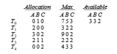

# Deadlock Avoidance

Deadlock-prevention algorithms, as discussed in Section 8.5, prevent dead- locks by limiting how requests can be made. The limits ensure that at least one of the necessary conditions for deadlock cannot occur. Possible side effects of preventing deadlocks by this method, however, are low device utilization and reduced system throughput.

An alternative method for avoiding deadlocks is to require additional information about how resources are to be requested. For example, in a system with resources _R_ 1 and _R_ 2, the system might need to know that thread _P_ will request first _R_ 1 and then _R_ 2 before releasing both resources, whereas thread _Q_ will request _R_ 2 and then _R_ 1. With this knowledge of the complete sequence of requests and releases for each thread, the system can decide for each request whether or not the thread should wait in order to avoid a possible future deadlock. Each request requires that in making this decision the system consider the resources currently available, the resources currently allocated to each thread, and the future requests and releases of each thread.

The various algorithms that use this approach differ in the amount and type of information required. The simplest andmost usefulmodel requires that each thread declare the**_maximum number_** of resources of each type that it may need. Given this a priori information, it is possible to construct an algorithm that ensures that the system will never enter a deadlocked state. A deadlock- avoidance algorithm dynamically examines the resource-allocation state to ensure that a circular-wait condition can never exist. The resource-allocation **_state_** is defined by the number of available and allocated resources and the maximum demands of the threads. In the following sections, we explore two deadlock-avoidance algorithms.  

**_LINUX LOCKDEP TOOL_**

Although ensuring that resources are acquired in the proper order is the responsibility of kernel and application developers, certain software can be used to verify that locks are acquired in the proper order. To detect possible deadlocks, Linux provides lockdep, a tool with rich functionality that can be used to verify locking order in the kernel. lockdep is designed to be enabled on a running kernel as it monitors usage patterns of lock acquisitions and releases against a set of rules for acquiring and releasing locks. Two examples follow, but note that lockdep provides significantly more functionality than what is described here:

• The order in which locks are acquired is dynamically maintained by the system. If lockdep detects locks being acquired out of order, it reports a possible deadlock condition.

• In Linux, spinlocks can be used in interrupt handlers. A possible source of deadlock occurs when the kernel acquires a spinlock that is also used in an interrupt handler. If the interrupt occurs while the lock is being held, the interrupt handler preempts the kernel code currently holding the lock and then spins while attempting to acquire the lock, resulting in deadlock. The general strategy for avoiding this situation is to disable interrupts on the current processor before acquiring a spinlock that is also used in an interrupt handler. If lockdep detects that interrupts are enabledwhile kernel code acquires a lock that is also used in an interrupt handler, it will report a possible deadlock scenario.

lockdep was developed to be used as a tool in developing or modifying code in the kernel and not to be used on production systems, as it can significantly slow down a system. Its purpose is to test whether software such as a new device driver or kernel module provides a possible source of deadlock. The designers of lockdep have reported that within a few years of its development in 2006, the number of deadlocks from system reports had been reduced by an order of magnitude.⣞ Although lockdep was originally designed only for use in the kernel, recent revisions of this tool can now be used for detecting deadlocks in user applications using Pthreads mutex locks. Further details on the lockdep tool can be found at https://www.kernel.org/doc/Documentation/locking/lockdep-design.txt.

## Safe State

A state is _safe_ if the system can allocate resources to each thread (up to its maximum) in some order and still avoid a deadlock. More formally, a system is in a safe state only if there exists a **safe sequence**. A sequence of threads _<T_ 1, _T_ 2, ..., _Tn>_ is a safe sequence for the current allocation state if, for each _Ti_, the resource requests that _Ti_ can still make can be satisfied by the currently available resources plus the resources held by all _Tj_, with _j < i._ In this situation, if the resources that _Ti_ needs are not immediately available, then _Ti_ can wait until all _Tj_ have finished. When they have finished, _Ti_ can obtain all of its  

**Figure 8.8** Safe, unsafe, and deadlocked state spaces.

needed resources, complete its designated task, return its allocated resources, and terminate. When _Ti_ terminates, _Ti_+1 can obtain its needed resources, and so on. If no such sequence exists, then the system state is said to be _unsafe._

A safe state is not a deadlocked state. Conversely, a deadlocked state is an unsafe state. Not all unsafe states are deadlocks, however (Figure 8.8). An unsafe state **_may_** lead to a deadlock. As long as the state is safe, the operating system can avoid unsafe (and deadlocked) states. In an unsafe state, the operating system cannot prevent threads from requesting resources in such away that a deadlock occurs. The behavior of the threads controls unsafe states.

To illustrate, consider a system with twelve resources and three threads: _T_ 0, _T_ 1, and _T_ 2. Thread _T_ 0 requires ten resources, thread _T_ 1 may need as many as four, and thread _T_ 2 may need up to nine resources. Suppose that, at time _t_ 0, thread _T_ 0 is holding five resources, thread _T_ 1 is holding two resources, and thread _T_ 2 is holding two resources. (Thus, there are three free resources.)

At time _t_0, the system is in a safe state. The sequence _<T_ 1, _T_ 0, _T_ 2_> satisfies the safety condition. Thread _T_ 1 can immediately be allocated all its resources and then return them (the systemwill then have five available resources); then thread_T_ 0 can get all its resources and return them (the systemwill then have ten available resources); and finally thread _T_ 2 can get all its resources and return them (the system will then have all twelve resources available).

Asystem can go from a safe state to an unsafe state. Suppose that, at time _t_ 1, thread _T_ 2 requests and is allocated one more resource. The system is no longer in a safe state. At this point, only thread _T_ 1 can be allocated all its resources. When it returns them, the system will have only four available resources. Since thread _T_ 0 is allocated five resources but has a maximum of ten, it may request five more resources. If it does so, it will have to wait, because they are unavailable. Similarly, thread _T_ 2 may request six additional resources and have to wait, resulting in a deadlock. Our mistake was in granting the request from thread_T_ 2 for onemore resource. If we hadmade_T_ 2 wait until either of the other  
threads had finished and released its resources, then we could have avoided the deadlock.

Given the concept of a safe state, we can define avoidance algorithms that ensure that the systemwill never deadlock. The idea is simply to ensure that the system will always remain in a safe state. Initially, the system is in a safe state. Whenever a thread requests a resource that is currently available, the system must decide whether the resource can be allocated immediately or the thread must wait. The request is granted only if the allocation leaves the system in a safe state.

In this scheme, if a thread requests a resource that is currently available, it may still have to wait. Thus, resource utilization may be lower than it would otherwise be.

## Resource-Allocation-Graph Algorithm

If we have a resource-allocation systemwith only one instance of each resource type, we can use a variant of the resource-allocation graph defined in Section 8.3.2 for deadlock avoidance. In addition to the request and assignment edges already described, we introduce a new type of edge, called a **claim edge**. A claim edge_Ti_→_Rj_ indicates that thread_Ti_may request resource_Rj_ at some time in the future. This edge resembles a request edge in direction but is represented in the graph by a dashed line. When thread _Ti_ requests resource _Rj_, the claim edge _Ti_ → _Rj_ is converted to a request edge. Similarly, when a resource _Rj_ is released by _Ti_, the assignment edge _Rj_ → _Ti_ is reconverted to a claim edge _Ti_ → _Rj_.

Note that the resources must be claimed a priori in the system. That is, before thread _Ti_ starts executing, all its claim edges must already appear in the resource-allocation graph.We can relax this condition by allowing a claim edge _Ti_ → _Rj_ to be added to the graph only if all the edges associated with thread _Ti_ are claim edges.

Now suppose that thread _Ti_ requests resource _Rj_. The request can be granted only if converting the request edge _Ti_ → _Rj_ to an assignment edge _Rj_ → _Ti_ does not result in the formation of a cycle in the resource-allocation graph. We check for safety by using a cycle-detection algorithm. An algorithm for detecting a cycle in this graph requires an order of _n_ 2 operations, where _n_ is the number of threads in the system.

If no cycle exists, then the allocation of the resource will leave the system in a safe state. If a cycle is found, then the allocation will put the system in an unsafe state. In that case, thread _Ti_ will have to wait for its requests to be satisfied.

To illustrate this algorithm, we consider the resource-allocation graph of Figure 8.9. Suppose that _T_ 2 requests _R_ 2. Although _R_ 2 is currently free, we cannot allocate it to _T_ 2, since this action will create a cycle in the graph (Figure 8.10). A cycle, as mentioned, indicates that the system is in an unsafe state. If _T_ 1 requests _R_ 2, and _T_ 2 requests _R_ 1, then a deadlock will occur.

## Banker’s Algorithm

The resource-allocation-graph algorithm is not applicable to a resource- allocation system with multiple instances of each resource type. The  

**Figure 8.9** Resource-allocation graph for deadlock avoidance.

deadlock-avoidance algorithm that we describe next is applicable to such a system but is less efficient than the resource-allocation graph scheme. This algorithm is commonly known as the **banker’s algorithm**. The name was chosen because the algorithm could be used in a banking system to ensure that the bank never allocated its available cash in such a way that it could no longer satisfy the needs of all its customers.

When a new thread enters the system, it must declare the maximum num- ber of instances of each resource type that it may need. This number may not exceed the total number of resources in the system. When a user requests a set of resources, the system must determine whether the allocation of these resources will leave the system in a safe state. If it will, the resources are allo- cated; otherwise, the threadmust wait until some other thread releases enough resources.

Several data structures must be maintained to implement the banker’s algorithm. These data structures encode the state of the resource-allocation system. We need the following data structures, where _n_ is the number of threads in the system and _m_ is the number of resource types:

• **Available**. Avector of length_m_ indicates the number of available resources of each type. If **_Available_**[_j_] equals _k,_ then _k_ instances of resource type _Rj_ are available.

**Figure 8.10** An unsafe state in a resource-allocation graph.  

• **Max**. An _n_ × _m_ matrix defines the maximum demand of each thread. If **_Max_**[_i_][_j_] equals _k,_ then thread _Ti_ may request at most _k_ instances of resource type _Rj_.

• **Allocation**. An _n_ × _m_matrix defines the number of resources of each type currently allocated to each thread. If **_Allocation_**[_i_][_j_] equals _k,_ then thread _Ti_ is currently allocated _k_ instances of resource type _Rj_.

• **Need**. An _n_ × _m_ matrix indicates the remaining resource need of each thread. If **_Need_**[_i_][_j_] equals _k,_ then thread _Ti_ may need _k_ more instances of resource type _Rj_ to complete its task. Note that **_Need_**[_i_][_j_] equals **_Max_**[_i_][_j_] − **_Allocation_**[_i_][_j_].

These data structures vary over time in both size and value. To simplify the presentation of the banker’s algorithm, we next establish

some notation. Let_X_ and_Y_ be vectors of length _n._We say that_X_ ≤_Y_ if and only if _X_[_i_] ≤ _Y_[_i_] for all _i_ = 1, 2, ..., _n._ For example, if _X_ = (1,7,3,2) and _Y_ = (0,3,2,1), then _Y_ ≤ _X._ In addition, _Y < X_ if _Y_ ≤ _X_ and _Y_ ≠ _X._

We can treat each row in the matrices **_Allocation_** and **_Need_** as vectors and refer to them as **_Allocation_**_i_ and **_Need_**_i**.**_ The vector **_Allocation_**_i_ specifies the resources currently allocated to thread _Ti_; the vector **_Need_**_i_ specifies the additional resources that thread _Ti_ may still request to complete its task.

### Safety Algorithm

We can now present the algorithm for finding out whether or not a system is in a safe state. This algorithm can be described as follows:

**1.** Let**_Work_** and **_Finish_** be vectors of length _m_ and _n,_ respectively. Initialize **_Work_** = **_Available_** and **_Finish_**[_i_] = **_false_** for _i_ = 0, 1, ..., _n_ − 1.

**2.** Find an index _i_ such that both

a. **_Finish_**[_i_] == **_false_**

b. **_Need_**_i_ ≤**_Work_**

If no such _i_ exists, go to step 4.

**3. _Work_** =**_Work_** + **_Allocation_**_i **Finish**_[_i_] = **_true_** Go to step 2.

**4.** If **_Finish_**[_i_] == **_true_** for all _i,_ then the system is in a safe state.

This algorithmmay require an order of_m_ × _n_2 operations to determinewhether a state is safe.

### Resource-Request Algorithm

Next, we describe the algorithm for determining whether requests can be safely granted. Let **_Request_**_i_ be the request vector for thread _Ti_. If **_Request_**_i_ [_j_] == _k_, then thread _Ti_ wants _k_ instances of resource type _Rj_. When a request for resources is made by thread _Ti_, the following actions are taken:  

**1.** If**_Request_**_i_ ≤**_Need_**_i_, go to step 2. Otherwise, raise an error condition, since the thread has exceeded its maximum claim.

**2.** If **_Request_**_i_ ≤ **_Available,_** go to step 3. Otherwise, _Ti_ must wait, since the resources are not available.

**3.** Have the system pretend to have allocated the requested resources to thread _Ti_ by modifying the state as follows:

**_Available_** = **_Available_**–**_Request_**_i **Allocation**i_ = **_Allocation_**_i_ + **_Request_**_i **Need**i_ = **_Need_**_i_–**_Request_**_i_

If the resulting resource-allocation state is safe, the transaction is com- pleted, and thread _Ti_ is allocated its resources. However, if the new state is unsafe, then _Ti_ must wait for **_Request_**_i**,**_ and the old resource-allocation state is restored.

### An Illustrative Example

To illustrate the use of the banker’s algorithm, consider a system with five threads _T_ 0 through _T_ 4 and three resource types _A, B,_ and _C._ Resource type _A_ has ten instances, resource type _B_ has five instances, and resource type _C_ has seven instances. Suppose that the following snapshot represents the current state of the system:

The content of the matrix **_Need_** is defined to be **_Max_** − **_Allocation_** and is as follows:

We claim that the system is currently in a safe state. Indeed, the sequence _<T_ 1, _T_ 3, _T_ 4, _T_ 2, _T_ 0_>_ satisfies the safety criteria. Suppose now that thread _T_ 1 requests one additional instance of resource type _A_ and two instances of resource type _C,_ so **_Request_**1 = (1,0,2). To decide whether this request can be immediately granted, we first check that **_Request_**1 ≤ **_Available_**—that is, that  (1,0,2) ≤ (3,3,2), which is true. We then pretend that this request has been fulfilled, and we arrive at the following new state:

We must determine whether this new system state is safe. To do so, we execute our safety algorithm and find that the sequence _<T_ 1, _T_ 3, _T_ 4, _T_ 0, _T_ 2>

satisfies the safety requirement. Hence, we can immediately grant the request of thread _T_ 1.

You should be able to see, however, that when the system is in this state, a request for (3,3,0) by _T_ 4 cannot be granted, since the resources are not available. Furthermore, a request for (0,2,0) by _T_ 0 cannot be granted, even though the resources are available, since the resulting state is unsafe.

We leave it as a programming exercise for students to implement the banker’s algorithm.