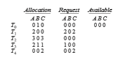
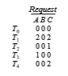

# Deadlock Detection

If a system does not employ either a deadlock-prevention or a deadlock- avoidance algorithm, then a deadlock situationmay occur. In this environment, the system may provide:

• An algorithm that examines the state of the system to determine whether a deadlock has occurred

• An algorithm to recover from the deadlock

Next, we discuss these two requirements as they pertain to systems with only a single instance of each resource type, as well as to systems with sev- eral instances of each resource type. At this point, however, we note that a detection-and-recovery scheme requires overhead that includes not only the run-time costs of maintaining the necessary information and executing the detection algorithm but also the potential losses inherent in recovering from a deadlock.

## Single Instance of Each Resource Type

If all resources have only a single instance, then we can define a deadlock- detection algorithm that uses a variant of the resource-allocation graph, called a **wait-for** graph. We obtain this graph from the resource-allocation graph by removing the resource nodes and collapsing the appropriate edges.

More precisely, an edge from _Ti_ to _Tj_ in a wait-for graph implies that thread _Ti_ is waiting for thread _Tj_ to release a resource that _Ti_ needs. An edge _Ti_ → _Tj_  

**Figure 8.11** (a) Resource-allocation graph. (b) Corresponding wait-for graph.

exists in a wait-for graph if and only if the corresponding resource-allocation graph contains two edges _Ti_ → _Rq_ and _Rq_ → _Tj_ for some resource _Rq_. In Figure 8.11, we present a resource-allocation graph and the corresponding wait-for graph.

As before, a deadlock exists in the system if and only if the wait-for graph contains a cycle. To detect deadlocks, the system needs to **_maintain_** the wait- for graph and periodically **_invoke an algorithm_** that searches for a cycle in the graph. An algorithm to detect a cycle in a graph requires _O_(_n_ 2) operations, where _n_ is the number of vertices in the graph.

The BCC toolkit described in Section 2.10.4 provides a tool that can detect potential deadlocks with Pthreads mutex locks in a user process running on a Linux system. The BCC tool deadlock detector operates by inserting probes which trace calls to the pthread mutex lock() and pthread mutex unlock() functions. When the specified process makes a call to either function, deadlock detector constructs a wait-for graph of mutex locks in that process, and reports the possibility of deadlock if it detects a cycle in the graph.

## Several Instances of a Resource Type

The wait-for graph scheme is not applicable to a resource-allocation system with multiple instances of each resource type. We turn now to a deadlock- detection algorithm that is applicable to such a system. The algorithm employs several time-varying data structures that are similar to those used in the banker’s algorithm (Section 8.6.3):

• **Available**. Avector of length_m_ indicates the number of available resources of each type.  

**_DEADLOCK DETECTION USING JAVATHREAD DUMPS_**

Although Java does not provide explicit support for deadlock detection, a **thread dump** can be used to analyze a running program to determine if there is a deadlock. A thread dump is a useful debugging tool that displays a snapshot of the states of all threads in a Java application. Java thread dumps also show locking information, including which locks a blocked thread is waiting to acquire. When a thread dump is generated, the JVM searches the wait-for graph to detect cycles, reporting anydeadlocks it detects. To generate a thread dump of a running application, from the command line enter:

Ctrl-L (UNIX, Linux, or macOS) Ctrl-Break (Windows)

In the source-code download for this text, we provide a Java example of the program shown in Figure 8.1 and describe how to generate a thread dump that reports the deadlocked Java threads.

• **Allocation**. An _n_ × _m_matrix defines the number of resources of each type currently allocated to each thread.

• **Request**. An _n_ × _m_ matrix indicates the current request of each thread. If **_Request_**[_i_][_j_] equals _k,_ then thread _Ti_ is requesting _k_ more instances of resource type _Rj_.

The ≤ relation between two vectors is defined as in Section 8.6.3. To sim- plify notation, we again treat the rows in the matrices **_Allocation_** and **_Request_** as vectors; we refer to them as **_Allocation_**_i_ and **_Request_**_i**.**_ The detection algo- rithm described here simply investigates every possible allocation sequence for the threads that remain to be completed. Compare this algorithm with the banker’s algorithm of Section 8.6.3.

**1.** Let**_Work_** and **_Finish_** be vectors of length _m_ and _n,_ respectively. Initialize **_Work_** = **_Available._** For _i_ = 0, 1, ..., _n–1,_ if **_Allocation_**_i_ ≠ 0, then **_Finish_**[_i_] = **_false._** Otherwise, **_Finish_**[_i_] = **_true._**

**2.** Find an index _i_ such that both

a. **_Finish_**[_i_] == **_false_**

b. **_Request_**_i_ ≤**_Work_**

If no such _i_ exists, go to step 4.

**3. _Work_** =**_Work_** + **_Allocation_**_i **Finish**_[_i_] = **_true_** Go to step 2.

**4.** If **_Finish_**[_i_] == **_false_** for some _i,_ 0≤ _i< n,_ then the system is in a deadlocked state. Moreover, if **_Finish_**[_i_] == **_false,_** then thread _Ti_ is deadlocked.

This algorithm requires an order of _m_ × _n_2 operations to detect whether the system is in a deadlocked state.  
You may wonder why we reclaim the resources of thread _Ti_ (in step 3) as soon as we determine that **_Request_**_i_ ≤ **_Work_** (in step 2b). We know that _Ti_ is currently **_not_** involved in a deadlock (since **_Request_**_i_ ≤ **_Work_**). Thus, we take an optimistic attitude and assume that _Ti_ will require no more resources to complete its task; it will thus soon return all currently allocated resources to the system. If our assumption is incorrect, a deadlock may occur later. That deadlock will be detected the next time the deadlock-detection algorithm is invoked.

To illustrate this algorithm, we consider a system with five threads _T_ 0 through _T_ 4 and three resource types _A, B,_ and _C._ Resource type _A_ has seven instances, resource type _B_ has two instances, and resource type _C_ has six instances. The following snapshot represents the current state of the system:

We claim that the system is not in a deadlocked state. Indeed, if we execute our algorithm, we will find that the sequence _<T_ 0, _T_ 2, _T_ 3, _T_ 1, _T_ 4> results in **_Finish_**[_i_] == _true_ for all _i._

Suppose now that thread _T_2 makes one additional request for an instance of type _C._ The **_Request_** matrix is modified as follows:

We claim that the system is now deadlocked. Although we can reclaim the resources held by thread _T_ 0, the number of available resources is not sufficient to fulfill the requests of the other threads. Thus, a deadlock exists, consisting of threads _T_ 1, _T_ 2, _T_ 3, and _T_ 4.

## Detection-Algorithm Usage

When should we invoke the detection algorithm? The answer depends on two factors:

**1.** How **_often_** is a deadlock likely to occur?

**2.** How **_many_** threads will be affected by deadlock when it happens?  

**_MANAGING DEADLOCK IN DATABASES_**

Database systems provide a useful illustration of how both open-source and commercial software manage deadlock. Updates to a database may be performed as **_transactions_**, and to ensure data integrity, locks are typically used. A transaction may involve several locks, so it comes as no surprise that deadlocks are possible in a database with multiple concurrent transac- tions. To manage deadlock, most transactional database systems include a deadlock detection and recovery mechanism. The database server will peri- odically search for cycles in the wait-for graph to detect deadlock among a set of transactions. When deadlock is detected, a victim is selected and the transaction is aborted and rolled back, releasing the locks held by the victim transaction and freeing the remaining transactions from deadlock. Once the remaining transactions have resumed, the aborted transaction is reissued. Choice of a victim transaction depends on the database system; for instance, MySQL attempts to select transactions that minimize the number of rows being inserted, updated, or deleted.

If deadlocks occur frequently, then the detection algorithm should be invoked frequently. Resources allocated to deadlocked threads will be idle until the deadlock can be broken. In addition, the number of threads involved in the deadlock cycle may grow.

Deadlocks occur only when some thread makes a request that cannot be granted immediately. This request may be the final request that completes a chain of waiting threads. In the extreme, then, we can invoke the deadlock- detection algorithm every time a request for allocation cannot be granted immediately. In this case,we can identify not only the deadlocked set of threads but also the specific thread that “caused” the deadlock. (In reality, each of the deadlocked threads is a link in the cycle in the resource graph, so all of them, jointly, caused the deadlock.) If there are many different resource types, one request may create many cycles in the resource graph, each cycle completed by the most recent request and “caused” by the one identifiable thread.

Of course, invoking the deadlock-detection algorithm for every resource request will incur considerable overhead in computation time. A less expen- sive alternative is simply to invoke the algorithm at defined intervals—for example, once per hour or whenever CPU utilization drops below 40 percent. (Adeadlock eventually cripples system throughput and causes CPU utilization to drop.) If the detection algorithm is invoked at arbitrary points in time, the resource graph may contain many cycles. In this case, we generally cannot tell which of the many deadlocked threads “caused” the deadlock.