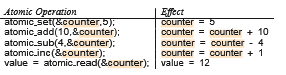

# Synchronization within the Kernel

We next describe the synchronization mechanisms provided by the Windows and Linux operating systems. These two operating systems provide good examples of different approaches to synchronizing the kernel, and as you will  


```
monitor DiningPhilosophers {

enum {THINKING, HUNGRY, EATING} state[5]; condition self[5];

void pickup(int i) { state[i] = HUNGRY; test(i); if (state[i] != EATING)

self[i].wait(); }

void putdown(int i) { state[i] = THINKING; test((i + 4) % 5); test((i + 1) % 5);

}

void test(int i) { if ((state[(i + 4) % 5] != EATING) && (state[i] == HUNGRY) && (state[(i + 1) % 5] != EATING)) {

state[i] = EATING; self[i].signal();

} }

initialization code() { for (int i = 0; i < 5; i++)

state[i] = THINKING; }

}
```
**Figure 7.7** A monitor solution to the dining-philosophers problem.

see, the synchronizationmechanisms available in these systems differ in subtle yet significant ways.

## Synchronization in Windows

The Windows operating system is a multithreaded kernel that provides sup- port for real-time applications and multiple processors. When the Windows kernel accesses a global resource on a single-processor system, it temporar- ily masks interrupts for all interrupt handlers that may also access the global resource. On a multiprocessor system, Windows protects access to global resources using spinlocks, although the kernel uses spinlocks only to protect short code segments. Furthermore, for reasons of efficiency, the kernel ensures that a thread will never be preempted while holding a spinlock.  

For thread synchronization outside the kernel, Windows provides **dis- patcher objects**. Using a dispatcher object, threads synchronize according to several different mechanisms, including mutex locks, semaphores, events, and timers. The system protects shared data by requiring a thread to gain owner- ship of a mutex to access the data and to release ownership when it is finished. Semaphores behave as described in Section 6.6. **Events** are similar to condition variables; that is, they may notify a waiting thread when a desired condition occurs. Finally, timers are used to notify one (or more than one) thread that a specified amount of time has expired.

Dispatcher objects may be in either a signaled state or a nonsignaled state. An object in a **signaled state** is available, and a thread will not block when acquiring the object. An object in a **nonsignaled state** is not available, and a thread will block when attempting to acquire the object. We illustrate the state transitions of a mutex lock dispatcher object in Figure 7.8.

A relationship exists between the state of a dispatcher object and the state of a thread. When a thread blocks on a nonsignaled dispatcher object, its state changes from ready to waiting, and the thread is placed in a waiting queue for that object. When the state for the dispatcher object moves to signaled, the kernel checks whether any threads are waiting on the object. If so, the kernel moves one thread—or possibly more—from the waiting state to the ready state, where they can resume executing. The number of threads the kernel selects from the waiting queue depends on the type of dispatcher object for which each thread is waiting. The kernel will select only one thread from the waiting queue for a mutex, since a mutex object may be “owned” by only a single thread. For an event object, the kernel will select all threads that are waiting for the event.

We can use a mutex lock as an illustration of dispatcher objects and thread states. If a thread tries to acquire a mutex dispatcher object that is in a nonsignaled state, that threadwill be suspended and placed in awaiting queue for the mutex object. When the mutex moves to the signaled state (because another thread has released the lock on the mutex), the thread waiting at the front of the queue will be moved from the waiting state to the ready state and will acquire the mutex lock.

A **critical-section object** is a user-mode mutex that can often be acquired and released without kernel intervention. On a multiprocessor system, a critical-section object first uses a spinlock while waiting for the other thread to release the object. If it spins too long, the acquiring thread will then allocate a kernelmutex and yield its CPU. Critical-section objects are particularly efficient because the kernel mutex is allocated only when there is contention for the object. In practice, there is very little contention, so the savings are significant.


**Figure 7.8** Mutex dispatcher object.  
We provide a programming project at the end of this chapter that uses mutex locks and semaphores in the Windows API.

## Synchronization in Linux

Prior to Version 2.6, Linuxwas a nonpreemptive kernel, meaning that a process running in kernel mode could not be preempted—even if a higher-priority process became available to run. Now, however, the Linux kernel is fully preemptive, so a task can be preempted when it is running in the kernel.

Linux provides several different mechanisms for synchronization in the kernel. As most computer architectures provide instructions for atomic versions of simple math operations, the simplest synchronization technique within the Linux kernel is an atomic integer, which is represented using the opaque data type atomic t. As the name implies, all math operations using atomic integers are performed without interruption. To illustrate, consider a program that consists of an atomic integer counter and an integer value.

atomic_t counter; 
int value;

The following code illustrates the effect of performing various atomic opera- tions:

Atomic integers are particularly efficient in situations where an integer variable—such as a counter—needs to be updated, since atomic operations do not require the overhead of locking mechanisms. However, their use is limited to these sorts of scenarios. In situations where there are several variables contributing to a possible race condition,more sophisticated locking toolsmust be used.

Mutex locks are available in Linux for protecting critical sectionswithin the kernel. Here, a task must invoke the mutex lock() function prior to entering a critical section and the mutex unlock() function after exiting the critical section. If themutex lock is unavailable, a task calling mutex lock() is put into a sleep state and is awakenedwhen the lock’s owner invokes mutex unlock().

Linux also provides spinlocks and semaphores (as well as reader–writer versions of these two locks) for locking in the kernel. On SMPmachines, the fun- damental locking mechanism is a spinlock, and the kernel is designed so that the spinlock is held only for short durations. On single-processor machines, such as embedded systems with only a single processing core, spinlocks are inappropriate for use and are replaced by enabling and disabling kernel pre- emption. That is, on systems with a single processing core, rather than holding a spinlock, the kernel disables kernel preemption; and rather than releasing the spinlock, it enables kernel preemption. This is summarized below:  

In the Linux kernel, both spinlocks and mutex locks are **_nonrecursive_**, which means that if a thread has acquired one of these locks, it cannot acquire the same lock a second time without first releasing the lock. Otherwise, the second attempt at acquiring the lock will block.

Linux uses an interesting approach to disable and enable kernel preemp- tion. It provides two simple system calls—preempt disable() and pre- empt enable()—for disabling and enabling kernel preemption. The kernel is not preemptible, however, if a task running in the kernel is holding a lock. To enforce this rule, each task in the system has a thread-info structure contain- ing a counter, preempt count, to indicate the number of locks being held by the task. When a lock is acquired, preempt count is incremented. It is decre- mented when a lock is released. If the value of preempt count for the task currently running in the kernel is greater than 0, it is not safe to preempt the ker- nel, as this task currently holds a lock. If the count is 0, the kernel can safely be interrupted (assuming there are no outstanding calls to preempt disable()).

Spinlocks—along with enabling and disabling kernel preemption—are used in the kernel only when a lock (or disabling kernel preemption) is held for a short duration.When a lockmust be held for a longer period, semaphores or mutex locks are appropriate for use.