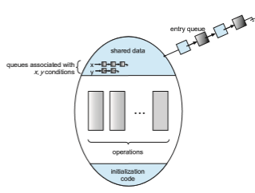

# Synchronization Tools

A **cooperating process** is one that can affect or be affected by other processes executing in the system. Cooperating processes can either directly share a logical address space (that is, both code and data) or be allowed to share data only through sharedmemory or message passing. Concurrent access to shared data may result in data inconsistency, however. In this chapter, we discuss various mechanisms to ensure the orderly execution of cooperating processes that share a logical address space, so that data consistency is maintained.

**CHAPTER OBJECTIVES**

• Describe the critical-section problem and illustrate a race condition.

• Illustrate hardware solutions to the critical-section problem using memory barriers, compare-and-swap operations, and atomic variables.

• Demonstrate how mutex locks, semaphores, monitors, and condition vari- ables can be used to solve the critical-section problem.

• Evaluate tools that solve the critical-section problem in low-, moderate-, and high-contention scenarios.

## Background

We’ve already seen that processes can execute concurrently or in parallel. Sec- tion 3.2.2 introduced the role of process scheduling and described how the CPU scheduler switches rapidly between processes to provide concurrent exe- cution. This means that one process may only partially complete execution before another process is scheduled. In fact, a process may be interrupted at any point in its instruction stream, and the processing core may be assigned to execute instructions of another process. Additionally, Section 4.2 introduced parallel execution, in which two instruction streams (representing different processes) execute simultaneously on separate processing cores. In this chap- ter, we explain how concurrent or parallel execution can contribute to issues involving the integrity of data shared by several processes.

Let’s consider an example of how this can happen. In Chapter 3, we devel- oped a model of a system consisting of cooperating sequential processes or threads, all running asynchronously and possibly sharing data. We illustrated this model with the producer–consumer problem, which is a representative paradigm of many operating system functions. Specifically, in Section 3.5, we described how a bounded buffer could be used to enable processes to share memory.

We now return to our consideration of the bounded buffer. As we pointed out, our original solution allowed at most BUFFER SIZE − 1 items in the buffer at the same time. Suppose we want to modify the algorithm to remedy this deficiency. One possibility is to add an integer variable, count, initialized to 0. count is incremented every time we add a new item to the buffer and is decremented every time we remove one item from the buffer. The code for the producer process can be modified as follows:
```
while (true) {*/ *produce an item in next produced */

while (count == BUFFER SIZE) ;*/ *do nothing */

buffer[in] = next produced; in = (in + 1) % BUFFER SIZE; count++;

}
```
The code for the consumer process can be modified as follows:
```
while (true) { while (count == 0)

;*/ *do nothing */

next consumed = buffer[out]; out = (out + 1) % BUFFER SIZE; count--;

/* consume the item in next consumed */ }
```
Although the producer and consumer routines shown above are correct separately, they may not function correctly when executed concurrently. As an illustration, suppose that the value of the variable count is currently 5 and that the producer and consumer processes concurrently execute the statements “count++” and “count--”. Following the execution of these two statements, the value of the variable countmay be 4, 5, or 6! The only correct result, though, is count == 5, which is generated correctly if the producer and consumer execute separately.  

We can show that the value of count may be incorrect as follows. Note that the statement “count++” may be implemented in machine language (on a typical machine) as follows:

_register_ 1 = count 
_register_ 1 = _register_ 1 + 1 
count = _register_ 1

where _register_1 is one of the local CPU registers. Similarly, the statement “count- -” is implemented as follows:

_register_ 2 = count 
_register_ 2 = _register_ 2 − 1 
count = _register_ 2

where again _register_2 is one of the local CPU registers. Even though _register_1 and _register_2 may be the same physical register, remember that the contents of this register will be saved and restored by the interrupt handler (Section 1.2.3).

The concurrent execution of “count++” and “count--” is equivalent to a sequential execution in which the lower-level statements presented previously are interleaved in some arbitrary order (but the order within each high-level statement is preserved). One such interleaving is the following:


Notice that we have arrived at the incorrect state “count == 4”, indicating that four buffers are full, when, in fact, five buffers are full. If we reversed the order of the statements at _T_4 and _T_5, we would arrive at the incorrect state “count == 6”.

We would arrive at this incorrect state because we allowed both processes to manipulate the variable count concurrently. A situation like this, where several processes access and manipulate the same data concurrently and the outcome of the execution depends on the particular order in which the access takes place, is called a **race condition**. To guard against the race condition above, we need to ensure that only one process at a time can be manipulating the variable count. To make such a guarantee, we require that the processes be synchronized in some way.

Situations such as the one just described occur frequently in operating systems as different parts of the system manipulate resources. Furthermore, as we have emphasized in earlier chapters, the prominence of multicore sys- tems has brought an increased emphasis on developing multithreaded appli- cations. In such applications, several threads—which are quite possibly shar- ing data—are running in parallel on different processing cores. Clearly, we want any changes that result from such activities not to interfere with one another. Because of the importance of this issue, we devote a major portion of this chapter to **process synchronization** and **coordination** among cooperating processes.

## The Critical-Section Problem

We begin our consideration of process synchronization by discussing the so- called critical-section problem. Consider a system consisting of _n_ processes {_P_0,_P_1, _..._,_Pn_−1}. Each process has a segment of code, called a **critical section**, in which the process may be accessing — and updating — data that is shared with at least one other process. The important feature of the system is that, when one process is executing in its critical section, no other process is allowed to execute in its critical section. That is, no two processes are executing in their critical sections at the same time. The **_critical-section problem_** is to design a protocol that the processes can use to synchronize their activity so as to cooperatively share data. Each process must request permission to enter its critical section. The section of code implementing this request is the **entry section**. The critical section may be followed by an **exit section**. The remaining code is the **remainder section**. The general structure of a typical process is shown in Figure 6.1. The entry section and exit section are enclosed in boxes to highlight these important segments of code.

A solution to the critical-section problem must satisfy the following three requirements:

**1. Mutual exclusion**. If process _Pi_ is executing in its critical section, then no other processes can be executing in their critical sections.

**2. Progress**. If no process is executing in its critical section and some pro- cesses wish to enter their critical sections, then only those processes that are not executing in their remainder sections can participate in decid- ing which will enter its critical section next, and this selection cannot be postponed indefinitely.
```
while (true) {

_entry section_

critical section

_exit section_

remainder section

}
```
**Figure 6.1** General structure of a typical process.  

**3. Bounded waiting**. There exists a bound, or limit, on the number of times that other processes are allowed to enter their critical sections after a process has made a request to enter its critical section and before that request is granted.

We assume that each process is executing at a nonzero speed. However, we can make no assumption concerning the relative speed of the _n_ processes.

At a given point in time, many kernel-mode processes may be active in the operating system. As a result, the code implementing an operating system (**_kernel code_**) is subject to several possible race conditions. Consider as an example a kernel data structure that maintains a list of all open files in the system. This list must be modifiedwhen a new file is opened or closed (adding the file to the list or removing it from the list). If two processeswere to open files simultaneously, the separate updates to this list could result in a race condition.

Another example is illustrated in Figure 6.2. In this situation, two pro- cesses, _P_0 and _P_1, are creating child processes using the fork() system call. Recall from Section 3.3.1 that fork() returns the process identifier of the newly created process to the parent process. In this example, there is a race condi- tion on the variable kernel variable next available pid which represents the value of the next available process identifier. Unless mutual exclusion is provided, it is possible the same process identifier number could be assigned to two separate processes.

Other kernel data structures that are prone to possible race conditions include structures for maintaining memory allocation, for maintaining process lists, and for interrupt handling. It is up to kernel developers to ensure that the operating system is free from such race conditions.

The critical-section problem could be solved simply in a single-core envi- ronment if we could prevent interrupts from occurring while a shared variable was being modified. In this way, we could be sure that the current sequence


**Figure 6.2** Race condition when assigning a pid.  of instructions would be allowed to execute in order without preemption. No other instructions would be run, so no unexpected modifications could be made to the shared variable.

Unfortunately, this solution is not as feasible in a multiprocessor environ- ment. Disabling interrupts on a multiprocessor can be time consuming, since the message is passed to all the processors. This message passing delays entry into each critical section, and system efficiency decreases. Also consider the effect on a system’s clock if the clock is kept updated by interrupts.

Two general approaches are used to handle critical sections in operating systems: **preemptive kernels** and **nonpreemptive kernels**. A preemptive ker- nel allows a process to be preempted while it is running in kernel mode. A nonpreemptive kernel does not allow a process running in kernel mode to be preempted; a kernel-mode process will run until it exits kernel mode, blocks, or voluntarily yields control of the CPU.

Obviously, a nonpreemptive kernel is essentially free from race conditions on kernel data structures, as only one process is active in the kernel at a time. We cannot say the same about preemptive kernels, so they must be carefully designed to ensure that shared kernel data are free from race conditions. Pre- emptive kernels are especially difficult to design for SMP architectures, since in these environments it is possible for two kernel-mode processes to run simultaneously on different CPU cores.

Why, then, would anyone favor a preemptive kernel over a nonpreemp- tive one? A preemptive kernel may be more responsive, since there is less risk that a kernel-mode process will run for an arbitrarily long period before relin- quishing the processor to waiting processes. (Of course, this risk can also be minimized by designing kernel code that does not behave in this way.) Fur- thermore, a preemptive kernel is more suitable for real-time programming, as it will allow a real-time process to preempt a process currently running in the kernel.

## Peterson’s Solution

Next, we illustrate a classic software-based solution to the critical-section prob- lem known as **Peterson’s solution**. Because of the way modern computer architectures perform basic machine-language instructions, such as load and store, there are no guarantees that Peterson’s solution will work correctly on such architectures. However, we present the solution because it provides a good algorithmic description of solving the critical-section problem and illus- trates some of the complexities involved in designing software that addresses the requirements of mutual exclusion, progress, and bounded waiting.

Peterson’s solution is restricted to two processes that alternate execution between their critical sections and remainder sections. The processes are num- bered _P_ 0 and _P_ 1. For convenience, when presenting _Pi_, we use _Pj_ to denote the other process; that is, j equals 1 − i.

Peterson’s solution requires the two processes to share two data items:

int turn; boolean flag[2];  
```
while (true) { flag[i] = true; turn = j; while (flag[j] && turn == j)

;

/* critical section */

flag[i] = false;

/*remainder section */ }
```
**Figure 6.3** The structure of process _Pi_ in Peterson’s solution.

The variable turn indicates whose turn it is to enter its critical section. That is, if turn == i, then process _Pi_ is allowed to execute in its critical section. The flag array is used to indicate if a process is ready to enter its critical section. For example, if flag[i] is true, _Pi_ is ready to enter its critical section. With an explanation of these data structures complete, we are now ready to describe the algorithm shown in Figure 6.3.

To enter the critical section, process _Pi_ first sets flag[i] to be true and then sets turn to the value j, thereby asserting that if the other process wishes to enter the critical section, it can do so. If both processes try to enter at the same time, turn will be set to both i and j at roughly the same time. Only one of these assignments will last; the other will occur but will be overwritten imme- diately. The eventual value of turn determines which of the two processes is allowed to enter its critical section first.

We now prove that this solution is correct. We need to show that:

**1.** Mutual exclusion is preserved.

**2.** The progress requirement is satisfied.

**3.** The bounded-waiting requirement is met.

To prove property 1, we note that each _Pi_ enters its critical section only if either flag[j] == false or turn == i. Also note that, if both processes can be executing in their critical sections at the same time, then flag[0] == flag[1] == true. These two observations imply that _P_ 0 and _P_ 1 could not have successfully executed their while statements at about the same time, since the value of turn can be either 0 or 1 but cannot be both. Hence, one of the processes—say, _Pj_—must have successfully executed the while statement, whereas _Pi_ had to execute at least one additional statement (“turn == j”). However, at that time, flag[j] == true and turn == j, and this condition will persist as long as _Pj_ is in its critical section; as a result, mutual exclusion is preserved.  

Toprove properties 2 and 3,we note that a process_Pi_ can be prevented from entering the critical section only if it is stuck in the while loopwith the condition flag[j] == true and turn == j; this loop is the only one possible. If _Pj_ is not ready to enter the critical section, then flag[j] == false, and _Pi_ can enter its critical section. If _Pj_ has set flag[j] to true and is also executing in its while statement, then either turn == i or turn == j. If turn == i, then _Pi_ will enter the critical section. If turn == j, then _Pj_ will enter the critical section. However, once _Pj_ exits its critical section, it will reset flag[j] to false, allowing _Pi_ to enter its critical section. If _Pj_ resets flag[j] to true, it must also set turn to i. Thus, since _Pi_ does not change the value of the variable turn while executing the while statement, _Pi_ will enter the critical section (progress) after at most one entry by _Pj_ (bounded waiting).

As mentioned at the beginning of this section, Peterson’s solution is not guaranteed to work on modern computer architectures for the primary rea- son that, to improve system performance, processors and/or compilers may reorder read and write operations that have no dependencies. For a single- threaded application, this reordering is immaterial as far as program correct- ness is concerned, as the final values are consistent withwhat is expected. (This is similar to balancing a checkbook—the actual order in which credit and debit operations are performed is unimportant, because the final balance will still be the same.) But for amultithreaded applicationwith shared data, the reordering of instructions may render inconsistent or unexpected results.

As an example, consider the following data that are shared between two threads:
```
boolean flag = false; int x = 0;

where Thread 1 performs the statements

while (!flag) ;

print x;

and Thread 2 performs

x = 100; flag = true;
```
The expected behavior is, of course, that Thread 1 outputs the value 100 for variable x. However, as there are no data dependencies between the variables flag and x, it is possible that a processor may reorder the instructions for Thread 2 so that flag is assigned true before assignment of x = 100. In this situation, it is possible that Thread 1 would output 0 for variable x. Less obvious is that the processor may also reorder the statements issued by Thread 1 and load the variable x before loading the value of flag. If this were to occur, Thread 1would output 0 for variable x even if the instructions issuedbyThread 2 were not reordered.  

**Figure 6.4** The effects of instruction reordering in Peterson’s solution.

How does this affect Peterson’s solution? Consider what happens if the assignments of the first two statements that appear in the entry section of Peterson’s solution in Figure 6.3 are reordered; it is possible that both threads may be active in their critical sections at the same time, as shown in Figure 6.4.

As you will see in the following sections, the only way to preserve mutual exclusion is by using proper synchronization tools. Our discussion of these tools begins with primitive support in hardware and proceeds through abstract, high-level, software-based APIs available to both kernel developers and application programmers.

## Hardware Support for Synchronization

Wehave just described one software-based solution to the critical-section prob- lem. (We refer to it as a **_software-based_** solution because the algorithm involves no special support from the operating system or specific hardware instructions to ensure mutual exclusion.) However, as discussed, software-based solutions are not guaranteed to work on modern computer architectures. In this section, we present three hardware instructions that provide support for solving the critical-section problem. These primitive operations can be used directly as synchronization tools, or they can be used to form the foundation of more abstract synchronization mechanisms.

### Memory Barriers

In Section 6.3, we saw that a systemmay reorder instructions, a policy that can lead to unreliable data states. How a computer architecture determines what memory guarantees it will provide to an application program is known as its **memory model**. In general, a memory model falls into one of two categories:

**1. Strongly ordered**, where a memory modification on one processor is immediately visible to all other processors.

**2. Weakly ordered**, where modifications to memory on one processor may not be immediately visible to other processors.

Memorymodels vary by processor type, so kernel developers cannot make any assumptions regarding the visibility of modifications to memory on a shared-memory multiprocessor. To address this issue, computer architectures provide instructions that can _force_ any changes in memory to be propagated to all other processors, thereby ensuring that memorymodifications are visible to threads running on other processors. Such instructions are known as **memory barriers** or **memory fences**. When a memory barrier instruction is performed, the system ensures that all loads and stores are completed before any subse- quent load or store operations are performed. Therefore, even if instructions were reordered, the memory barrier ensures that the store operations are com- pleted in memory and visible to other processors before future load or store operations are performed.

Let’s return to ourmost recent example, inwhich reordering of instructions could have resulted in the wrong output, and use a memory barrier to ensure that we obtain the expected output.

If we add a memory barrier operation to Thread 1
```
while (!flag) memory barrier();

print x;
```
we guarantee that the value of flag is loaded before the value of x. Similarly, if we place a memory barrier between the assignments per-

formed by Thread 2
```
x = 100; memory barrier(); flag = true;
```
we ensure that the assignment to x occurs before the assignment to flag. With respect to Peterson’s solution, we could place a memory barrier

between the first two assignment statements in the entry section to avoid the reordering of operations shown in Figure 6.4. Note that memory barriers are considered very low-level operations and are typically only used by kernel developers when writing specialized code that ensures mutual exclusion.

### Hardware Instructions

Many modern computer systems provide special hardware instructions that allow us either to test andmodify the content of a word or to swap the contents of two words **atomically**—that is, as one uninterruptible unit. We can use these special instructions to solve the critical-section problem in a relatively simple manner. Rather than discussing one specific instruction for one specific machine, we abstract the main concepts behind these types of instructions by describing the test and set() and compare and swap() instructions.
```
boolean test and set(boolean *target) { boolean rv = *target; *target = true;

return rv; }
```
**Figure 6.5** The definition of the atomic test and set() instruction.  
```
do { while (test and set(&lock))

;*/ *do nothing */

/* critical section */

lock = false;

/* remainder section */ } while (true);
```
**Figure 6.6** Mutual-exclusion implementation with test and set().

The test and set() instruction can be defined as shown in Figure 6.5. The important characteristic of this instruction is that it is executed atomi- cally. Thus, if two test and set() instructions are executed simultaneously (each on a different core), they will be executed sequentially in some arbitrary order. If the machine supports the test and set() instruction, then we can implement mutual exclusion by declaring a boolean variable lock, initialized to false. The structure of process _Pi_ is shown in Figure 6.6.

The compare and swap() instruction (CAS), just like the test and set() instruction, operates on two words atomically, but uses a different mechanism that is based on swapping the content of two words.

The CAS instruction operates on three operands and is defined in Figure 6.7. The operand value is set to new value only if the expression (*value == expected) is true. Regardless, CAS always returns the original value of the variable value. The important characteristic of this instruction is that it is executed atomically. Thus, if two CAS instructions are executed simultaneously (each on a different core), they will be executed sequentially in some arbitrary order.

Mutual exclusion using CAS can be provided as follows: A global vari- able (lock) is declared and is initialized to 0. The first process that invokes compare and swap() will set lock to 1. It will then enter its critical section,
```
int compare and swap(int *value, int expected, int new value) { int temp = *value;

if (*value == expected) *value = new value;

return temp; }
```
**Figure 6.7** The definition of the atomic compare and swap() instruction.  
```
while (true) { while (compare and swap(&lock, 0, 1) != 0)

;*/ *do nothing */

/* critical section */

lock = 0;

/* remainder section */ }
```
**Figure 6.8** Mutual exclusion with the compare and swap() instruction.

because the original value of lockwas equal to the expected value of 0. Subse- quent calls to compare and swap()will not succeed, because lock now is not equal to the expected value of 0. When a process exits its critical section, it sets lock back to 0, which allows another process to enter its critical section. The structure of process _Pi_ is shown in Figure 6.8.

Although this algorithm satisfies the mutual-exclusion requirement, it does not satisfy the bounded-waiting requirement. In Figure 6.9, we present
```
while (true) { waiting[i] = true; key = 1; while (waiting[i] && key == 1)

key = compare and swap(&lock,0,1); waiting[i] = false;

/* critical section */

j = (i + 1) % n; while ((j != i) && !waiting[j])

j = (j + 1) % n;

if (j == i) lock = 0;

else waiting[j] = false;

/* remainder section */ }
```
**Figure 6.9** Bounded-waiting mutual exclusion with compare and swap().  

**_MAKING COMPARE-AND-SWAPATOMIC_**

On Intel x86 architectures, the assembly language statement cmpxchg is used to implement the compare and swap() instruction. To enforce atomic execution, the lock prefix is used to lock the bus while the destination operand is being updated. The general form of this instruction appears as:

lock cmpxchg <destination operand>, <source operand>

another algorithm using the compare and swap() instruction that satisfies all the critical-section requirements. The common data structures are
```
boolean waiting[n]; int lock;
```
The elements in the waiting array are initialized to false, and lock is initial- ized to 0. To prove that the mutual-exclusion requirement is met, we note that process _Pi_ can enter its critical section only if either waiting[i] == false or key == 0. The value of key can become 0 only if the compare and swap() is executed. The first process to execute the compare and swap() will find key == 0; all others must wait. The variable waiting[i] can become false only if another process leaves its critical section; only one waiting[i] is set to false, maintaining the mutual-exclusion requirement.

To prove that the progress requirement is met, we note that the arguments presented for mutual exclusion also apply here, since a process exiting the critical section either sets lock to 0 or sets waiting[j] to false. Both allow a process that is waiting to enter its critical section to proceed.

To prove that the bounded-waiting requirement is met, we note that, when a process leaves its critical section, it scans the array waiting in the cyclic ordering (_i_ + 1, _i_ + 2, ..., _n_ − 1, 0, ..., _i_ − 1). It designates the first process in this ordering that is in the entry section (waiting[j] == true) as the next one to enter the critical section. Any process waiting to enter its critical section will thus do so within _n_ − 1 turns.

Details describing the implementation of the atomic test and set() and compare and swap() instructions are discussed more fully in books on com- puter architecture.

### Atomic Variables

Typically, the compare and swap() instruction is not used directly to provide mutual exclusion. Rather, it is used as a basic building block for constructing other tools that solve the critical-section problem. One such tool is an **atomic variable**, which provides atomic operations on basic data types such as integers and booleans.We know from Section 6.1 that incrementing or decrementing an integer value may produce a race condition. Atomic variables can be used in to ensure mutual exclusion in situations where there may be a data race on a single variable while it is being updated, as when a counter is incremented.

Most systems that support atomic variables provide special atomic data types as well as functions for accessing and manipulating atomic variables.  

These functions are often implemented using compare and swap() opera- tions. As an example, the following increments the atomic integer sequence:

increment(&sequence);

where the increment() function is implemented using the CAS instruction:
```
void increment(atomic int *v) {

int temp;

do { temp = *v;

} while (temp != compare and swap(v, temp, temp+1));

}
```
It is important to note that although atomic variables provide atomic updates, they do not entirely solve race conditions in all circumstances. For example, in the bounded-buffer problemdescribed in Section 6.1, we could use an atomic integer for count. This would ensure that the updates to countwere atomic. However, the producer and consumer processes also have while loops whose condition depends on the value of count. Consider a situation in which the buffer is currently empty and two consumers are looping while waiting for count _>_ 0. If a producer entered one item in the buffer, both consumers could exit their while loops (as countwould no longer be equal to 0) and proceed to consume, even though the value of countwas only set to 1.

Atomic variables are commonly used in operating systems as well as con- current applications, although their use is often limited to single updates of shared data such as counters and sequence generators. In the following sec- tions, we explore more robust tools that address race conditions in more gen- eralized situations.

## Mutex Locks

The hardware-based solutions to the critical-section problem presented in Sec- tion 6.4 are complicated as well as generally inaccessible to application pro- grammers. Instead, operating-system designers build higher-level software tools to solve the critical-section problem. The simplest of these tools is the **mutex lock**. (In fact, the term**_mutex_** is short for **_mut_**ual **_ex_**clusion.) We use the mutex lock to protect critical sections and thus prevent race conditions. That is, a process must acquire the lock before entering a critical section; it releases the lock when it exits the critical section. The acquire()function acquires the lock, and the release() function releases the lock, as illustrated in Figure 6.10.

A mutex lock has a boolean variable available whose value indicates if the lock is available or not. If the lock is available, a call to acquire() succeeds, and the lock is then considered unavailable. Aprocess that attempts to acquire an unavailable lock is blocked until the lock is released.  
```
while (true) {

_acquire lock_

critical section

_release lock_

remainder section

}
```
**Figure 6.10** Solution to the critical-section problem using mutex locks.

The definition of acquire() is as follows:
```
acquire() { while (!available)

;*/ *busy wait */ available = false;

}

The definition of release() is as follows:

release() { available = true;

}
```
Calls to either acquire() or release() must be performed atomically. Thus, mutex locks can be implemented using the CAS operation described in Section 6.4, and we leave the description of this technique as an exercise.

**_LOCK CONTENTION_**

Locks are either contended or uncontended. A lock is considered **contended** if a thread blocks while trying to acquire the lock. If a lock is available when a thread attempts to acquire it, the lock is considered **uncontended**. Con- tended locks can experience either **_high contention_** (a relatively large number of threads attempting to acquire the lock) or **_low contention_** (a relatively small number of threads attempting to acquire the lock.) Unsurprisingly, highly contended locks tend to decrease overall performance of concurrent applications.  

**_WHAT IS MEANT BY_** _“**SHORT DURATION**”**?**_

Spinlocks are often identified as the locking mechanism of choice on multi- processor systems when the lock is to be held for a short duration. But what exactly constitutes a _short duration_? Given that waiting on a lock requires two context switches—a context switch to move the thread to the waiting state and a second context switch to restore the waiting thread once the lock becomes available—the general rule is to use a spinlock if the lock will be held for a duration of less than two context switches.

The main disadvantage of the implementation given here is that it requires **busy waiting**. While a process is in its critical section, any other process that tries to enter its critical sectionmust loop continuously in the call to acquire(). This continual looping is clearly a problem in a realmultiprogramming system, where a single CPU core is shared among many processes. Busy waiting also wastes CPU cycles that some other process might be able to use productively. (In Section 6.6, we examine a strategy that avoids busy waiting by temporarily putting the waiting process to sleep and then awakening it once the lock becomes available.)

The type of mutex lock we have been describing is also called a **spin- lock** because the process “spins” while waiting for the lock to become avail- able. (We see the same issue with the code examples illustrating the com- pare and swap() instruction.) Spinlocks do have an advantage, however, in that no context switch is required when a process must wait on a lock, and a context switch may take considerable time. In certain circumstances on multi- core systems, spinlocks are in fact the preferable choice for locking. If a lock is to be held for a short duration, one thread can “spin” on one processing core while another thread performs its critical section on another core. On modern multicore computing systems, spinlocks are widely used in many operating systems.

In Chapter 7 we examine how mutex locks can be used to solve classical synchronization problems. We also discuss howmutex locks and spinlocks are used in several operating systems, as well as in Pthreads.

## Semaphores

Mutex locks, as we mentioned earlier, are generally considered the simplest of synchronization tools. In this section, we examine a more robust tool that can behave similarly to a mutex lock but can also providemore sophisticated ways for processes to synchronize their activities.

A **semaphore** S is an integer variable that, apart from initialization, is accessed only through two standard atomic operations: wait() and signal(). Semaphores were introduced by the Dutch computer scientist Edsger Dijk- stra, and such, the wait() operation was originally termed P (from the Dutch  

**_proberen,_** “to test”); signal()was originally called V (from **_verhogen,_** “to incre- ment”). The definition of wait() is as follows:
```
wait(S) { while (S <= 0)

;*/  busy wait S--;

}
```
The definition of signal() is as follows:
```
signal(S) { S++;

} 
```
All modifications to the integer value of the semaphore in the wait() and

signal() operations must be executed atomically. That is, when one process modifies the semaphore value, no other process can simultaneously modify that same semaphore value. In addition, in the case of wait(S), the testing of the integer value of S (S ≤ 0), as well as its possible modification (S--), must be executed without interruption. We shall see how these operations can be implemented in Section 6.6.2. First, let’s see how semaphores can be used.

### Semaphore Usage

Operating systems often distinguish between counting and binary semaphores. The value of a **counting semaphore** can range over an unrestricted domain. The value of a **binary semaphore** can range only between 0 and 1. Thus, binary semaphores behave similarly to mutex locks. In fact, on systems that do not provide mutex locks, binary semaphores can be used instead for providing mutual exclusion.

Counting semaphores can be used to control access to a given resource consisting of a finite number of instances. The semaphore is initialized to the number of resources available. Each process that wishes to use a resource performs a wait() operation on the semaphore (thereby decrementing the count). When a process releases a resource, it performs a signal() operation (incrementing the count). When the count for the semaphore goes to 0, all resources are being used. After that, processes that wish to use a resource will block until the count becomes greater than 0.

We can also use semaphores to solve various synchronization problems. For example, consider two concurrently running processes:_P_ 1 with a statement _S_ 1 and_P_ 2 with a statement _S_ 2. Supposewe require that _S_ 2 be executed only after _S_ 1 has completed. We can implement this scheme readily by letting _P_ 1 and _P_ 2 share a common semaphore synch, initialized to 0. In process _P_ 1, we insert the statements

_S_ 1; 
signal(synch);  


In process _P_ 2, we insert the statements

wait(synch); 
_S_ 2;

Because synch is initialized to 0, _P_ 2 will execute _S_ 2 only after _P_ 1 has invoked signal(synch), which is after statement _S_ 1 has been executed.

### Semaphore Implementation

Recall that the implementation of mutex locks discussed in Section 6.5 suffers from busy waiting. The definitions of the wait() and signal() semaphore operations just described present the same problem. To overcome this prob- lem, we can modify the definition of the wait() and signal() operations as follows: When a process executes the wait() operation and finds that the semaphore value is not positive, it must wait. However, rather than engaging in busy waiting, the process can suspend itself. The suspend operation places a process into a waiting queue associated with the semaphore, and the state of the process is switched to the waiting state. Then control is transferred to the CPU scheduler, which selects another process to execute.

Aprocess that is suspended,waiting on a semaphore S, should be restarted when some other process executes a signal() operation. The process is restarted by a wakeup() operation,which changes the process from thewaiting state to the ready state. The process is then placed in the ready queue. (The CPU may or may not be switched from the running process to the newly ready process, depending on the CPU-scheduling algorithm.)

To implement semaphores under this definition, we define a semaphore as follows:
```
typedef struct { int value; struct process *list;

} semaphore;
```
Each semaphore has an integer value and a list of processes list. When a process must wait on a semaphore, it is added to the list of processes. A signal() operation removes one process from the list of waiting processes and awakens that process.

Now, the wait() semaphore operation can be defined as
```
wait(semaphore *S) { S->value--; if (S->value < 0) {

add this process to S->list; sleep();

} }  


and the signal() semaphore operation can be defined as

signal(semaphore *S) { S->value++; if (S->value <= 0) {

remove a process _P_ from S->list; wakeup(P);

} }
```
The sleep() operation suspends the process that invokes it. The wakeup(P) operation resumes the execution of a suspended process P. These two opera- tions are provided by the operating system as basic system calls.

Note that in this implementation, semaphore values may be negative, whereas semaphore values are never negative under the classical definition of semaphoreswith busywaiting. If a semaphore value is negative, its magnitude is the number of processes waiting on that semaphore. This fact results from switching the order of the decrement and the test in the implementation of the wait() operation.

The list of waiting processes can be easily implemented by a link field in each process control block (PCB). Each semaphore contains an integer value and a pointer to a list of PCBs. One way to add and remove processes from the list so as to ensure bounded waiting is to use a FIFO queue, where the semaphore contains both head and tail pointers to the queue. In general, however, the list can use any queuing strategy. Correct usage of semaphores does not depend on a particular queuing strategy for the semaphore lists.

As mentioned, it is critical that semaphore operations be executed atomi- cally. We must guarantee that no two processes can execute wait() and sig- nal() operations on the same semaphore at the same time. This is a critical- section problem, and in a single-processor environment, we can solve it by sim- ply inhibiting interrupts during the time the wait() and signal() operations are executing. This scheme works in a single-processor environment because, once interrupts are inhibited, instructions from different processes cannot be interleaved. Only the currently running process executes until interrupts are reenabled and the scheduler can regain control.

In a multicore environment, interrupts must be disabled on every pro- cessing core. Otherwise, instructions from different processes (running on dif- ferent cores) may be interleaved in some arbitrary way. Disabling interrupts on every core can be a difficult task and can seriously diminish performance. Therefore, SMP systems must provide alternative techniques—such as com- pare and swap() or spinlocks—to ensure that wait() and signal() are per- formed atomically.

It is important to admit that we have not completely eliminated busy waiting with this definition of the wait() and signal() operations. Rather, we have moved busy waiting from the entry section to the critical sections of application programs. Furthermore, we have limited busy waiting to the critical sections of the wait() and signal() operations, and these sections are short (if properly coded, they should be no more than about ten instructions). Thus, the critical section is almost never occupied, and busy waiting occurs  


rarely, and then for only a short time. An entirely different situation exists with application programs whose critical sections may be long (minutes or even hours) or may almost always be occupied. In such cases, busy waiting is extremely inefficient.

## Monitors

Although semaphores provide a convenient and effective mechanism for pro- cess synchronization, using them incorrectly can result in timing errors that are difficult to detect, since these errors happen only if particular execution sequences take place, and these sequences do not always occur.

We have seen an example of such errors in the use of a count in our solution to the producer–consumer problem (Section 6.1). In that example, the timing problem happened only rarely, and even then the count value appeared to be reasonable—off by only 1. Nevertheless, the solution is obviously not an acceptable one. It is for this reason that mutex locks and semaphores were introduced in the first place.

Unfortunately, such timing errors can still occur when either mutex locks or semaphores are used. To illustrate how, we review the semaphore solution to the critical-section problem. All processes share a binary semaphore variable mutex, which is initialized to 1. Each processmust execute wait(mutex) before entering the critical section and signal(mutex) afterward. If this sequence is not observed, two processes may be in their critical sections simultaneously. Next, we list several difficulties that may result. Note that these difficulties will arise even if a **_single_** process is not well behaved. This situation may be caused by an honest programming error or an uncooperative programmer.

• Suppose that a program interchanges the order in which the wait() and signal() operations on the semaphore mutex are executed, resulting in the following execution:

signal(mutex); ...

critical section ...

wait(mutex);

In this situation, several processes may be executing in their critical sec- tions simultaneously, violating the mutual-exclusion requirement. This errormay be discovered only if several processes are simultaneously active in their critical sections. Note that this situation may not always be repro- ducible.

• Suppose that a program replaces signal(mutex)with wait(mutex). That is, it executes

wait(mutex); ...

critical section ...

wait(mutex);  


In this case, the process will permanently block on the second call to wait(), as the semaphore is now unavailable.

• Suppose that a process omits the wait(mutex), or the signal(mutex), or both. In this case, either mutual exclusion is violated or the process will permanently block.

These examples illustrate that various types of errors can be generated easily when programmers use semaphores or mutex locks incorrectly to solve the critical-section problem. One strategy for dealing with such errors is to incor- porate simple synchronization tools as high-level language constructs. In this section, we describe one fundamental high-level synchronization construct— the **monitor** type.

### Monitor Usage

An **abstract data type**—or **ADT**—encapsulates data with a set of functions to operate on that data that are independent of any specific implementation of the ADT. A**_monitor type_** is an ADT that includes a set of programmer-defined operations that are provided with mutual exclusion within the monitor. The monitor type also declares the variables whose values define the state of an
```
monitor _monitor name {_

/* shared variable declarations */

function P1 ( . . . ) { . . .

}

function P2 ( . . . ) { . . .

}

.

.

. function Pn ( . . . ) {

. . . }

initialization code ( . . . ) { . . .

} }
```
**Figure 6.11** Pseudocode syntax of a monitor.  


instance of that type, along with the bodies of functions that operate on those variables. The syntax of a monitor type is shown in Figure 6.11. The repre- sentation of a monitor type cannot be used directly by the various processes. Thus, a function defined within a monitor can access only those variables declared locally within the monitor and its formal parameters. Similarly, the local variables of a monitor can be accessed by only the local functions.

The monitor construct ensures that only one process at a time is active within the monitor. Consequently, the programmer does not need to code this synchronization constraint explicitly (Figure 6.12). However, the monitor construct, as defined so far, is not sufficiently powerful for modeling some synchronization schemes. For this purpose, we need to define additional syn- chronization mechanisms. These mechanisms are provided by the condition construct. A programmer who needs to write a tailor-made synchronization scheme can define one or more variables of type _condition_:

**Figure 6.12** Schematic view of a monitor.  
The x.signal() operation resumes exactly one suspended process. If no process is suspended, then the signal() operation has no effect; that is, the state of x is the same as if the operation had never been executed (Figure 6.13). Contrast this operation with the signal() operation associated with semaphores, which always affects the state of the semaphore.

Now suppose that, when the x.signal() operation is invoked by a pro- cess _P_, there exists a suspended process_Q_ associated with condition x. Clearly, if the suspended process _Q_ is allowed to resume its execution, the signaling process _P_ must wait. Otherwise, both _P_ and _Q_ would be active simultane- ously within the monitor. Note, however, that conceptually both processes can continue with their execution. Two possibilities exist:

**1. Signal and wait**. _P_ either waits until _Q_ leaves the monitor or waits for another condition.

**2. Signal and continue**. _Q_ either waits until _P_ leaves the monitor or waits for another condition.

There are reasonable arguments in favor of adopting either option. On the one hand, since _P_ was already executing in the monitor, the **_signal-and- continue_**method seems more reasonable. On the other, if we allow thread _P_ to continue, then by the time_Q_ is resumed, the logical condition for which_Q_was waiting may no longer hold. A compromise between these two choices exists as well: when thread _P_ executes the signal operation, it immediately leaves the monitor. Hence, _Q_ is immediately resumed.

**Figure 6.13** Monitor with condition variables.  


Many programming languages have incorporated the idea of the monitor as described in this section, including Java and C#. Other languages—such as Erlang—provide concurrency support using a similar mechanism.

### Implementing a Monitor Using Semaphores

We now consider a possible implementation of the monitor mechanism using semaphores. For each monitor, a binary semaphore mutex (initialized to 1) is provided to ensure mutual exclusion. A process must execute wait(mutex) before entering the monitor and must execute signal(mutex) after leaving the monitor.

We will use the signal-and-wait scheme in our implementation. Since a signaling process must wait until the resumed process either leaves or waits, an additional binary semaphore, next, is introduced, initialized to 0. The signaling processes can use next to suspend themselves. An integer variable next count is also provided to count the number of processes suspended on next. Thus, each external function F is replaced by
```
wait(mutex); ...

body of F ...

if (next count > 0) signal(next);

else signal(mutex);
```
Mutual exclusion within a monitor is ensured. We can now describe how condition variables are implemented as well.

For each condition x, we introduce a binary semaphore x sem and an integer variable x count, both initialized to 0. The operation x.wait() can now be implemented as
```
x count++; 
if (next count > 0)
signal(next); else
signal(mutex); 
wait(x sem); 
x count--;
```
The operation x.signal() can be implemented as
```
if (x count > 0) { next count++; 
signal(x sem); 
wait(next); 
next count--;

} 
```
This implementation is applicable to the definitions of monitors given by

both Hoare and Brinch-Hansen (see the bibliographical notes at the end of the chapter). In some cases, however, the generality of the implementation is  
```


monitor ResourceAllocator {

boolean busy; condition x;

void acquire(int time) { if (busy)

x.wait(time); busy = true;

}

void release() { busy = false; x.signal();

}

initialization code() { busy = false;

} }
```
**Figure 6.14** A monitor to allocate a single resource.

unnecessary, and a significant improvement in efficiency is possible. We leave this problem to you in Exercise 6.27.

### Resuming Processes within a Monitor

We turn now to the subject of process-resumption order within a monitor. If several processes are suspended on condition x, and an x.signal() opera- tion is executed by some process, then how do we determine which of the suspended processes should be resumed next? One simple solution is to use a first-come, first-served (FCFS) ordering, so that the process that has been wait- ing the longest is resumedfirst. Inmany circumstances, however, such a simple scheduling scheme is not adequate. In these circumstances, the **conditional- wait** construct can be used. This construct has the form

x.wait(c);

where c is an integer expression that is evaluated when the wait() operation is executed. The value of c, which is called a **priority number**, is then stored with the name of the process that is suspended.When x.signal() is executed, the process with the smallest priority number is resumed next.

To illustrate this new mechanism, consider the ResourceAllocatormon- itor shown in Figure 6.14, which controls the allocation of a single resource among competing processes. Each process, when requesting an allocation of this resource, specifies themaximum time it plans to use the resource. Themon- itor allocates the resource to the process that has the shortest time-allocation  


request. A process that needs to access the resource in question must observe the following sequence:

R.acquire(t); ...

access the resource; ...

R.release();

where R is an instance of type ResourceAllocator. Unfortunately, the monitor concept cannot guarantee that the preceding

access sequence will be observed. In particular, the following problems can occur:

• A process might access a resource without first gaining access permission to the resource.

• A process might never release a resource once it has been granted access to the resource.

• A process might attempt to release a resource that it never requested.

• A process might request the same resource twice (without first releasing the resource).

The same difficulties are encountered with the use of semaphores, and these difficulties are similar in nature to those that encouraged us to develop the monitor constructs in the first place. Previously, we had to worry about the correct use of semaphores. Now, we have to worry about the correct use of higher-level programmer-defined operations, with which the compiler can no longer assist us.

One possible solution to the current problem is to include the resource- access operations within the ResourceAllocator monitor. However, using this solution will mean that scheduling is done according to the built-in monitor-scheduling algorithm rather than the one we have coded.

To ensure that the processes observe the appropriate sequences, we must inspect all the programs thatmake use of the ResourceAllocatormonitor and its managed resource. We must check two conditions to establish the correct- ness of this system. First, user processes must always make their calls on the monitor in a correct sequence. Second, we must be sure that an uncooperative process does not simply ignore the mutual-exclusion gateway provided by the monitor and try to access the shared resource directly, without using the access protocols. Only if these two conditions can be ensured can we guarantee that no time-dependent errorswill occur and that the scheduling algorithmwill not be defeated.

Although this inspection may be possible for a small, static system, it is not reasonable for a large system or a dynamic system. This access-control problem can be solved only through the use of the additional mechanisms that are described in Chapter 17.  


## Liveness

One consequence of using synchronization tools to coordinate access to critical sections is the possibility that a process attempting to enter its critical section will wait indefinitely. Recall that in Section 6.2, we outlined three criteria that solutions to the critical-sectionproblemmust satisfy. Indefinitewaiting violates two of these—the progress and bounded-waiting criteria.

**Liveness** refers to a set of properties that a system must satisfy to ensure that processes make progress during their execution life cycle. A process wait- ing indefinitely under the circumstances just described is an example of a “liveness failure.”

There are many different forms of liveness failure; however, all are gen- erally characterized by poor performance and responsiveness. A very simple example of a liveness failure is an infinite loop. A busy wait loop presents the _possibility_ of a liveness failure, especially if a process may loop an arbitrarily long period of time. Efforts at providing mutual exclusion using tools such as mutex locks and semaphores can often lead to such failures in concurrent pro- gramming. In this section, we explore two situations that can lead to liveness failures.

### Deadlock

The implementation of a semaphore with a waiting queue may result in a situation where two or more processes are waiting indefinitely for an event that can be caused only by one of the waiting processes. The event in question is the execution of a signal() operation. When such a state is reached, these processes are said to be **deadlocked**.

To illustrate this, consider a system consisting of two processes, _P_0 and _P_1, each accessing two semaphores, S and Q, set to the value 1:

_P_ 0         _P_ 1

wait(S);     wait(Q);
wait(Q);     wait(S);

.              .

.              .

.              . 
signal(S);   signal(Q); signal(Q);   signal(S);

Suppose that _P_ 0 executes wait(S) and then _P_ 1 executes wait(Q). When _P_ 0 executes wait(Q), it must wait until _P_1 executes signal(Q). Similarly, when _P_ 1 executes wait(S), it must wait until _P_ 0 executes signal(S). Since these signal() operations cannot be executed, _P_ 0 and _P_ 1 are deadlocked.

We say that a set of processes is in a deadlocked state when _every process in the set is waiting for an event that can be caused only by another process in the set_. The “events” with which we are mainly concerned here are the acquisition and release of resources such as mutex locks and semaphores. Other types of events may result in deadlocks, as we show in more detail in Chapter 8. In that chapter, we describe various mechanisms for dealing with the deadlock problem, as well as other forms of liveness failures.

### Priority Inversion

A scheduling challenge arises when a higher-priority process needs to read or modify kernel data that are currently being accessed by a lower-priority process—or a chain of lower-priority processes. Since kernel data are typi- cally protected with a lock, the higher-priority process will have to wait for a lower-priority one to finish with the resource. The situation becomes more complicated if the lower-priority process is preempted in favor of another process with a higher priority.

As an example, assume we have three processes—_L_, _M_, and _H_—whose priorities follow the order _L < M < H_. Assume that process _H_ requires a semaphore _S_, which is currently being accessed by process _L_. Ordinarily, process _H_ would wait for _L_ to finish using resource _S_. However, now suppose that process _M_ becomes runnable, thereby preempting process _L_. Indirectly, a process with a lower priority—process _M_—has affected how long process _H_ must wait for _L_ to relinquish resource _S_.

This liveness problem is known as **priority inversion**, and it can occur only in systems with more than two priorities. Typically, priority inversion is avoided by implementing a **priority-inheritance protocol**. According to this protocol, all processes that are accessing resources needed by a higher-priority process inherit the higher priority until they are finished with the resources in question.When they are finished, their priorities revert to their original values. In the example above, a priority-inheritance protocol would allow process _L_ to temporarily inherit the priority of process _H_, thereby preventing process _M_  frompreempting its execution.Whenprocess _Lhadfinished_ using resource _S_, it would relinquish its inherited priority from _H_ and assume its original priority. Because resource _S_ would now be available, process _H_—not _M_—would run next.

## Evaluation

We have described several different synchronization tools that can be used to solve the critical-section problem. Given correct implementation and usage, these tools can be used effectively to ensuremutual exclusion aswell as address liveness issues. With the growth of concurrent programs that leverage the power of modern multicore computer systems, increasing attention is being paid to the performance of synchronization tools. Trying to identify when to use which tool, however, can be a daunting challenge. In this section, we present some simple strategies for determining when to use specific synchro- nization tools.

The hardware solutions outlined in Section 6.4 are considered very low level and are typically used as the foundations for constructing other synchro- nization tools, such as mutex locks. However, there has been a recent focus on using the CAS instruction to construct **lock-free** algorithms that provide protection from race conditions without requiring the overhead of locking. Although these lock-free solutions are gaining popularity due to low overhead  


**_PRIORITY INVERSION AND THE MARS PATHFINDER_**

Priority inversion can be more than a scheduling inconvenience. On systems with tight time constraints—such as real-time systems—priority inversion can cause a process to take longer than it should to accomplish a task. When that happens, other failures can cascade, resulting in system failure.

Consider theMars Pathfinder, a NASA space probe that landed a robot, the Sojourner rover, on Mars in 1997 to conduct experiments. Shortly after the Sojourner began operating, it started to experience frequent computer resets. Each reset reinitialized all hardware and software, including communica- tions. If the problem had not been solved, the Sojourner would have failed in its mission.

The problem was caused by the fact that one high-priority task, “bc dist,” was taking longer than expected to complete its work. This task was being forced to wait for a shared resource that was held by the lower-priority “ASI/MET” task, which in turn was preempted by multiple medium-priority tasks. The “bc dist” task would stall waiting for the shared resource, and ultimately the “bc sched” task would discover the problem and perform the reset. The Sojourner was suffering from a typical case of priority inversion.

The operating system on the Sojourner was the VxWorks real-time operat- ing system, which had a global variable to enable priority inheritance on all semaphores. After testing, the variable was set on the Sojourner (on Mars!), and the problem was solved.

A full description of the problem, its detection, and its solu- tion was written by the software team lead and is available at http://research.microsoft.com/en-us/um/people/mbj/mars pathfinder/ authoritative account.html.

and ability to scale, the algorithms themselves are often difficult to develop and test. (In the exercises at the end of this chapter, we ask you to evaluate the correctness of a lock-free stack.)

CAS-based approaches are considered an _optimistic_ approach—you opti- mistically first update a variable and then use collision detection to see if another thread is updating the variable concurrently. If so, you repeatedly retry the operation until it is successfully updated without conflict. Mutual- exclusion locking, in contrast, is considered a _pessimistic_ strategy; you assume another thread is concurrently updating the variable, so you pessimistically acquire the lock before making any updates.

The following guidelines identify general rules concerning performance differences between CAS-based synchronization and traditional synchroniza- tion (such as mutex locks and semaphores) under varying contention loads:

• **Uncontended**. Although both options are generally fast, CAS protection will be somewhat faster than traditional synchronization.

• **Moderate contention**. CAS protectionwill be faster—possiblymuch faster —than traditional synchronization.  


• **High contention**. Under very highly contended loads, traditional synchro- nization will ultimately be faster than CAS-based synchronization.

Moderate contention is particularly interesting to examine. In this scenario, the CAS operation succeeds most of the time, and when it fails, it will iterate through the loop shown in Figure 6.8 only a few times before ultimately suc- ceeding. By comparison,withmutual-exclusion locking, _any_ attempt to acquire a contended lockwill result in amore complicated—and time-intensive—code path that suspends a thread and places it on a wait queue, requiring a context switch to another thread.

The choice of a mechanism that addresses race conditions can also greatly affect system performance. For example, atomic integers are much lighter weight than traditional locks, and are generally more appropriate than mutex locks or semaphores for single updates to shared variables such as counters. We also see this in the design of operating systems where spinlocks are used on multiprocessor systems when locks are held for short durations. In general, mutex locks are simpler and require less overhead than semaphores and are preferable to binary semaphores for protecting access to a critical section. However, for some uses—such as controlling access to a finite number of resources—a counting semaphore is generally more appropriate than a mutex lock. Similarly, in some instances, a reader–writer lock may be preferred over a mutex lock, as it allows a higher degree of concurrency (that is, multiple readers).

The appeal of higher-level tools such as monitors and condition variables is based on their simplicity and ease of use. However, such tools may have significant overhead and, depending on their implementation, may be less likely to scale in highly contended situations.

Fortunately, there is much ongoing research toward developing scalable, efficient tools that address the demands of concurrent programming. Some examples include:

• Designing compilers that generate more efficient code.

• Developing languages that provide support for concurrent programming.

• Improving the performance of existing libraries and APIs.

In the next chapter, we examine how various operating systems and APIs available to developers implement the synchronization tools presented in this chapter.

## Summary

• A race condition occurs when processes have concurrent access to shared data and the final result depends on the particular order in which con- current accesses occur. Race conditions can result in corrupted values of shared data.

• A critical section is a section of code where shared data may be manipu- lated and a possible race conditionmay occur. The critical-section problem  

**Practice Exercises 287**

is to design a protocol whereby processes can synchronize their activity to cooperatively share data.

• A solution to the critical-section problem must satisfy the following three requirements: (1) mutual exclusion, (2) progress, and (3) boundedwaiting. Mutual exclusion ensures that only one process at a time is active in its crit- ical section. Progress ensures that programs will cooperatively determine what process will next enter its critical section. Bounded waiting limits how much time a program will wait before it can enter its critical section.

• Software solutions to the critical-section problem, such as Peterson’s solu- tion, do not work well on modern computer architectures.

• Hardware support for the critical-section problem includes memory barri- ers; hardware instructions, such as the compare-and-swap instruction; and atomic variables.

• A mutex lock provides mutual exclusion by requiring that a process acquire a lock before entering a critical section and release the lock on exiting the critical section.

• Semaphores, like mutex locks, can be used to provide mutual exclusion. However, whereas amutex lock has a binary value that indicates if the lock is available or not, a semaphore has an integer value and can therefore be used to solve a variety of synchronization problems.

• A monitor is an abstract data type that provides a high-level form of process synchronization. A monitor uses condition variables that allow processes to wait for certain conditions to become true and to signal one another when conditions have been set to true.

• Solutions to the critical-section problem may suffer from liveness prob- lems, including deadlock.

• The various tools that can be used to solve the critical-section problem as well as to synchronize the activity of processes can be evaluated under varying levels of contention. Some tools work better under certain con- tention loads than others.

**Practice Exercises**

**6.1** In Section 6.4, we mentioned that disabling interrupts frequently can affect the system’s clock. Explain why this can occur and how such effects can be minimized.

**6.2** What is the meaning of the term **_busy waiting_**? What other kinds of waiting are there in an operating system? Can busy waiting be avoided altogether? Explain your answer.

**6.3** Explain why spinlocks are not appropriate for single-processor systems yet are often used in multiprocessor systems.

**6.4** Show that, if the wait() and signal() semaphore operations are not executed atomically, then mutual exclusion may be violated.  


**6.5** Illustrate how a binary semaphore can be used to implement mutual exclusion among _n_ processes.

**6.6** Race conditions are possible in many computer systems. Consider a banking system that maintains an account balance with two functions: deposit(amount) and withdraw(amount). These two functions are passed the amount that is to be deposited or withdrawn from the bank account balance. Assume that a husband and wife share a bank account. Concurrently, the husband calls the withdraw() function, and the wife calls deposit(). Describe how a race condition is possible and what might be done to prevent the race condition from occurring.

**Further Reading**

The mutual-exclusion problem was first discussed in a classic paper by [Dijk- stra (1965)]. The semaphore concept was suggested by [Dijkstra (1965)]. The monitor concept was developed by [Brinch-Hansen (1973)]. [Hoare (1974)] gave a complete description of the monitor.

Formore on theMars Pathfinder problem see http://research.microsoft.co m/en-us/um/people/mbj/mars pathfinder/authoritative account.html

Athorough discussion of memory barriers and cache memory is presented in [Mckenney (2010)]. [Herlihy and Shavit (2012)] presents details on several issues related to multiprocessor programming, including memorymodels and compare-and-swap instructions. [Bahra (2013)] examines nonblocking algo- rithms on modern multicore systems.

**Bibliography**

**[Bahra (2013)]** S. A. Bahra, “Nonblocking Algorithms and Scalable Multicore Programming”, _ACM queue_, Volume 11, Number 5 (2013).

**[Brinch-Hansen (1973)]** P. Brinch-Hansen, _Operating System Principles_, Prentice Hall (1973).

**[Dijkstra (1965)]** E. W. Dijkstra, “Cooperating Sequential Processes”, Technical report, Technological University, Eindhoven, the Netherlands (1965).

**[Herlihy and Shavit (2012)]** M. Herlihy and N. Shavit, _The Art of Multiprocessor Programming,_ Revised First Edition, Morgan Kaufmann Publishers Inc. (2012).

**[Hoare (1974)]** C. A. R. Hoare, “Monitors: An Operating System Structuring Concept”, _Communications of the ACM_, Volume 17, Number 10 (1974), pages 549–557.

**[Mckenney (2010)]** P. E. Mckenney, “Memory Barriers: a Hardware View for Software Hackers” (2010).  

**Chapter 6 Exercises**

**6.7** The pseudocode of Figure 6.15 illustrates the basic push() and pop() operations of an array-based stack. Assuming that this algorithm could be used in a concurrent environment, answer the following questions:

a. What data have a race condition?

b. How could the race condition be fixed?

**6.8** Race conditions are possible in many computer systems. Consider an online auction system where the current highest bid for each item must be maintained. A person who wishes to bid on an item calls the bid(amount) function, which compares the amount being bid to the current highest bid. If the amount exceeds the current highest bid, the highest bid is set to the new amount. This is illustrated below:
```
void bid(double amount) { if (amount > highestBid)

highestBid = amount; }

push(item) { if (top < SIZE) {

stack[top] = item; top++;

} else

ERROR }

pop() { if (!is empty()) {

top--; return stack[top];

} else

ERROR }

is empty() { if (top == 0)

return true; else

return false; }
```
**Figure 6.16** Array-based stack for Exercise 6.12.

**EX-17**  

**Exercises**

**Figure 6.17** Summing an array as a series of partial sums for Exercise 6.14.

Describe how a race condition is possible in this situation and what might be done to prevent the race condition from occurring.

**6.9** The following program example can be used to sum the array values of size_N_ elements in parallel on a system containing_N_ computing cores (there is a separate processor for each array element):
```
for j = 1 to log 2(N) { for k = 1 to N {

if ((k + 1) % pow(2,j) == 0) { values[k] += values[k - pow(2,(j-1))]

} }

}
```
 This has the effect of summing the elements in the array as a series of partial sums, as shown in Figure 6.16. After the code has executed, the sum of all elements in the array is stored in the last array location. Are there any race conditions in the above code example? If so, identify where they occur and illustrate with an example. If not, demonstrate why this algorithm is free from race conditions.

**6.10** The compare and swap() instruction can be used to design lock-free data structures such as stacks, queues, and lists. The program example shown in Figure 6.17 presents a possible solution to a lock-free stack using CAS instructions, where the stack is represented as a linked list of Node elements with top representing the top of the stack. Is this implementation free from race conditions?

**EX-18**  
```
typedef struct node { value t data; struct node *next;

} Node;

Node *top;*/  top of stack

void push(value t item) { Node *old node; Node *new node;

new node = malloc(sizeof(Node)); new node->data = item;

do { old node = top; new node->next = old node;

} while (compare and swap(top,old node,new node) != old node);

}

value t pop() { Node *old node; Node *new node;

do { old node = top; if (old node == NULL)

return NULL; new node = old node->next;

} while (compare and swap(top,old node,new node) != old node);

return old node->data; }
```
**Figure 6.18** Lock-free stack for Exercise 6.15.

**6.11** One approach for using compare and swap() for implementing a spin- lock is as follows:

void lock spinlock(int *lock) { while (compare and swap(lock, 0, 1) != 0)

;*/ *spin */ }

A suggested alternative approach is to use the “compare and compare- and-swap” idiom,which checks the status of the lock before invoking the

**EX-19**  

**Exercises**

compare and swap() operation. (The rationale behind this approach is to invoke compare and swap()only if the lock is currently available.) This strategy is shown below:
```
void lock spinlock(int *lock) { {

while (true) { if (*lock == 0) {

/* lock appears to be available */

if (!compare and swap(lock, 0, 1)) break;

_} }_

}}
``` 
Does this “compare and compare-and-swap” idiom work appropriately for implementing spinlocks? If so, explain. If not, illustrate how the integrity of the lock is compromised.

**6.12** Some semaphore implementations provide a function getValue() that returns the current value of a semaphore. This functionmay, for instance, be invoked prior to calling wait() so that a processwill only call wait() if the value of the semaphore is _>_ 0, thereby preventing blocking while waiting for the semaphore. For example:

if (getValue(&sem) > 0) wait(&sem);

Many developers argue against such a function and discourage its use. Describe a potential problem that could occur when using the function getValue() in this scenario.

**6.13** The first known correct software solution to the critical-section problem for two processes was developed by Dekker. The two processes, _P_0 and _P_1, share the following variables:

boolean flag[2];*/ *initially false */ int turn;

The structure of process _Pi_ (i == 0 or 1) is shown in Figure 6.18. The other process is _Pj_ (j == 1 or 0). Prove that the algorithm satisfies all three requirements for the critical-section problem.

**6.14** The first known correct software solution to the critical-section problem for _n_ processes with a lower bound on waiting of _n_ − 1 turns was presented by Eisenberg andMcGuire. The processes share the following variables:

enum pstate {idle, want in, in cs}; pstate flag[n]; int turn;

**EX-20**  
```
while (true) { flag[i] = true;

while (flag[j]) { if (turn == j) {

flag[i] = false; while (turn == j)

;*/ *do nothing */ flag[i] = true;

_} }_

/* critical section */

turn = j; flag[i] = false;

/* remainder section */ }
```
**Figure 6.19** The structure of process _Pi_ in Dekker’s algorithm.

All the elements of flag are initially idle. The initial value of turn is immaterial (between 0 and n-1). The structure of process _Pi_ is shown in Figure 6.19. Prove that the algorithm satisfies all three requirements for the critical-section problem.

**6.15** Explain why implementing synchronization primitives by disabling interrupts is not appropriate in a single-processor system if the synchro- nization primitives are to be used in user-level programs.

**6.16** Consider how to implement a mutex lock using the com- pare and swap() instruction. Assume that the following structure defining the mutex lock is available:
```
typedef struct { int available;

} lock;
```
The value (available == 0) indicates that the lock is available, and a value of 1 indicates that the lock is unavailable. Using this struct, illustrate how the following functions can be implemented using the compare and swap() instruction:

• void acquire(lock *mutex)

• void release(lock *mutex)

Be sure to include any initialization that may be necessary.

**EX-21**  

**Exercises**
```
while (true) { while (true) {

flag[i] = want in; j = turn;}

while (j != i) { if (flag[j] != idle) {

j = turn; else

j = (j + 1) % n; }

flag[i] = in cs; j = 0;

while ( (j < n) && (j == i || flag[j] != in cs)) j++;

if ( (j >= n) && (turn == i || flag[turn] == idle)) break;

}

/* critical section */

j = (turn + 1) % n;

while (flag[j] == idle) j = (j + 1) % n;

turn = j; flag[i] = idle;

/* remainder section */ }
```
**Figure 6.20** The structure of process _Pi_ in Eisenberg and McGuire’s algorithm.

**6.17** Explain why interrupts are not appropriate for implementing synchro- nization primitives in multiprocessor systems.

**6.18** The implementation of mutex locks provided in Section 6.5 suffers from busy waiting. Describe what changes would be necessary so that a process waiting to acquire a mutex lock would be blocked and placed into a waiting queue until the lock became available.

**6.19** Assume that a system has multiple processing cores. For each of the following scenarios, describe which is a better locking mechanism—a

**EX-22**  

spinlock or a mutex lock where waiting processes sleep while waiting for the lock to become available:

• The lock is to be held for a short duration.

• The lock is to be held for a long duration.

• A thread may be put to sleep while holding the lock.

**6.20** Assume that a context switch takes _T_ time. Suggest an upper bound (in terms of _T_) for holding a spinlock. If the spinlock is held for any longer, a mutex lock (where waiting threads are put to sleep) is a better alternative.

**6.21** A multithreaded web server wishes to keep track of the number of requests it services (known as **_hits_**). Consider the two following strate- gies to prevent a race condition on the variable hits. The first strategy is to use a basic mutex lock when updating hits:

int hits; mutex lock hit lock;

hit lock.acquire(); hits++; hit lock.release();

A second strategy is to use an atomic integer:

atomic t hits; atomic inc(&hits);

Explain which of these two strategies is more efficient.

**6.22** Consider the code example for allocating and releasing processes shown in Figure 6.20.

a. Identify the race condition(s).

b. Assume you have a mutex lock named mutex with the operations acquire() and release(). Indicate where the locking needs to be placed to prevent the race condition(s).

c. Could we replace the integer variable

int number of processes = 0

with the atomic integer

atomic t number of processes = 0

to prevent the race condition(s)?

**6.23** Servers can be designed to limit the number of open connections. For example, a server may wish to have only _N_ socket connections at any point in time. As soon as _N_ connections are made, the server will not accept another incoming connection until an existing connection is

**EX-23**  

**Exercises**
```c
#define MAX PROCESSES 255
int number of processes = 0;

/* the implementation of fork() calls this function */ int allocate process() { int new pid;

if (number of processes == MAX PROCESSES) return -1;

else {*/ *allocate necessary process resources */ ++number of processes;

return new pid; }

}

/* the implementation of exit() calls this function */ void release process() {

/* release process resources */ --number of processes;

}
```
**Figure 6.21** Allocating and releasing processes for Exercise 6.27.

released. Illustrate how semaphores can be used by a server to limit the number of concurrent connections.

**6.24** In Section 6.7, we use the following illustration as an incorrect use of semaphores to solve the critical-section problem:

wait(mutex); ...

critical section ...

wait(mutex);

Explain why this is an example of a liveness failure.

**6.25** Demonstrate that monitors and semaphores are equivalent to the degree that they can be used to implement solutions to the same types of syn- chronization problems.

**6.26** Describe how the signal() operation associated with monitors differs from the corresponding operation defined for semaphores.

**6.27** Suppose the signal() statement can appear only as the last statement in a monitor function. Suggest how the implementation described in Section 6.7 can be simplified in this situation.

**EX-24**  

**6.28** Consider a system consisting of processes_P_1,_P_2, ...,_Pn_, each ofwhich has a unique priority number. Write a monitor that allocates three identical printers to these processes, using the priority numbers for deciding the order of allocation.

**6.29** A file is to be shared among different processes, each of which has a unique number. The file can be accessed simultaneously by several processes, subject to the following constraint: the sum of all unique numbers associated with all the processes currently accessing the file must be less than _n_. Write a monitor to coordinate access to the file.

**6.30** When a signal is performedon a condition inside amonitor, the signaling process can either continue its execution or transfer control to the process that is signaled. Howwould the solution to the preceding exercise differ with these two different ways in which signaling can be performed?

**6.31** Design an algorithm for a monitor that implements an alarm clock that enables a calling program to delay itself for a specified number of time units (_ticks_). You may assume the existence of a real hardware clock that invokes a function tick() in your monitor at regular intervals.

**6.32** Discuss ways in which the priority inversion problem could be addressed in a real-time system. Also discuss whether the solutions could be implemented within the context of a proportional share scheduler.

**EX-25**  

**Chapter 6 Synchronization Tools**

**Programming Problems**

**6.33** Assume that a finite number of resources of a single resource type must bemanaged. Processes may ask for a number of these resources andwill return them once finished. As an example, many commercial software packages provide a given number of **_licenses_**, indicating the number of applications that may run concurrently. When the application is started, the license count is decremented. When the application is terminated, the license count is incremented. If all licenses are in use, requests to start the application are denied. Such a request will be granted only when an existing license holder terminates the application and a license is returned.

The following program segment is used tomanage a finite number of instances of an available resource. The maximum number of resources and the number of available resources are declared as follows:
```
#define MAX RESOURCES 5 int available resources = MAX RESOURCES;

When a process wishes to obtain a number of resources, it invokes the decrease count() function:

/* decrease available resources by count resources /*/ *return 0 if sufficient resources available, /*/ *otherwise return -1 */ int decrease count(int count) {

if (available resources < count) return -1;

else { available resources -= count;

return 0; }

}
```
When a process wants to return a number of resources, it calls the increase count() function:
```
/* increase available resources by count */ int increase count(int count) {

available resources += count;

return 0; }
```
The preceding program segment produces a race condition. Do the fol- lowing:

a. Identify the data involved in the race condition.

**P-32**  

**Programming Problems**

b. Identify the location (or locations) in the code where the race con- dition occurs.

c. Using a semaphore or mutex lock, fix the race condition. It is permissible to modify the decrease count() function so that the calling process is blocked until sufficient resources are available.

**6.34** The decrease count() function in the previous exercise currently returns 0 if sufficient resources are available and −1 otherwise. This leads to awkward programming for a process that wishes to obtain a number of resources:

while (decrease count(count) == -1) ;

Rewrite the resource-manager code segment using a monitor and con- dition variables so that the decrease count() function suspends the process until sufficient resources are available. This will allow a process to invoke decrease count() by simply calling

decrease count(count);

The process will return from this function call only when sufficient resources are available.