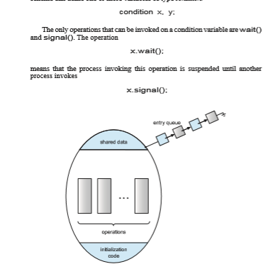

# Monitors

Although semaphores provide a convenient and effective mechanism for pro- cess synchronization, using them incorrectly can result in timing errors that are difficult to detect, since these errors happen only if particular execution sequences take place, and these sequences do not always occur.

We have seen an example of such errors in the use of a count in our solution to the producer–consumer problem (Section 6.1). In that example, the timing problem happened only rarely, and even then the count value appeared to be reasonable—off by only 1. Nevertheless, the solution is obviously not an acceptable one. It is for this reason that mutex locks and semaphores were introduced in the first place.

Unfortunately, such timing errors can still occur when either mutex locks or semaphores are used. To illustrate how, we review the semaphore solution to the critical-section problem. All processes share a binary semaphore variable mutex, which is initialized to 1. Each processmust execute wait(mutex) before entering the critical section and signal(mutex) afterward. If this sequence is not observed, two processes may be in their critical sections simultaneously. Next, we list several difficulties that may result. Note that these difficulties will arise even if a **_single_** process is not well behaved. This situation may be caused by an honest programming error or an uncooperative programmer.

• Suppose that a program interchanges the order in which the wait() and signal() operations on the semaphore mutex are executed, resulting in the following execution:

signal(mutex); ...

critical section ...

wait(mutex);

In this situation, several processes may be executing in their critical sec- tions simultaneously, violating the mutual-exclusion requirement. This errormay be discovered only if several processes are simultaneously active in their critical sections. Note that this situation may not always be repro- ducible.

• Suppose that a program replaces signal(mutex)with wait(mutex). That is, it executes

wait(mutex); ...

critical section ...

wait(mutex);  


In this case, the process will permanently block on the second call to wait(), as the semaphore is now unavailable.

• Suppose that a process omits the wait(mutex), or the signal(mutex), or both. In this case, either mutual exclusion is violated or the process will permanently block.

These examples illustrate that various types of errors can be generated easily when programmers use semaphores or mutex locks incorrectly to solve the critical-section problem. One strategy for dealing with such errors is to incor- porate simple synchronization tools as high-level language constructs. In this section, we describe one fundamental high-level synchronization construct— the **monitor** type.

## Monitor Usage

An **abstract data type**—or **ADT**—encapsulates data with a set of functions to operate on that data that are independent of any specific implementation of the ADT. A**_monitor type_** is an ADT that includes a set of programmer-defined operations that are provided with mutual exclusion within the monitor. The monitor type also declares the variables whose values define the state of an
```
monitor _monitor name {_

/* shared variable declarations */

function P1 ( . . . ) { . . .

}

function P2 ( . . . ) { . . .

}

.

.

. function Pn ( . . . ) {

. . . }

initialization code ( . . . ) { . . .

} }
```
**Figure 6.11** Pseudocode syntax of a monitor.  


instance of that type, along with the bodies of functions that operate on those variables. The syntax of a monitor type is shown in Figure 6.11. The repre- sentation of a monitor type cannot be used directly by the various processes. Thus, a function defined within a monitor can access only those variables declared locally within the monitor and its formal parameters. Similarly, the local variables of a monitor can be accessed by only the local functions.

The monitor construct ensures that only one process at a time is active within the monitor. Consequently, the programmer does not need to code this synchronization constraint explicitly (Figure 6.12). However, the monitor construct, as defined so far, is not sufficiently powerful for modeling some synchronization schemes. For this purpose, we need to define additional syn- chronization mechanisms. These mechanisms are provided by the condition construct. A programmer who needs to write a tailor-made synchronization scheme can define one or more variables of type _condition_:

**Figure 6.12** Schematic view of a monitor.  
The x.signal() operation resumes exactly one suspended process. If no process is suspended, then the signal() operation has no effect; that is, the state of x is the same as if the operation had never been executed (Figure 6.13). Contrast this operation with the signal() operation associated with semaphores, which always affects the state of the semaphore.

Now suppose that, when the x.signal() operation is invoked by a pro- cess _P_, there exists a suspended process_Q_ associated with condition x. Clearly, if the suspended process _Q_ is allowed to resume its execution, the signaling process _P_ must wait. Otherwise, both _P_ and _Q_ would be active simultane- ously within the monitor. Note, however, that conceptually both processes can continue with their execution. Two possibilities exist:

**1. Signal and wait**. _P_ either waits until _Q_ leaves the monitor or waits for another condition.

**2. Signal and continue**. _Q_ either waits until _P_ leaves the monitor or waits for another condition.

There are reasonable arguments in favor of adopting either option. On the one hand, since _P_ was already executing in the monitor, the **_signal-and- continue_**method seems more reasonable. On the other, if we allow thread _P_ to continue, then by the time_Q_ is resumed, the logical condition for which_Q_was waiting may no longer hold. A compromise between these two choices exists as well: when thread _P_ executes the signal operation, it immediately leaves the monitor. Hence, _Q_ is immediately resumed.

**Figure 6.13** Monitor with condition variables.  


Many programming languages have incorporated the idea of the monitor as described in this section, including Java and C#. Other languages—such as Erlang—provide concurrency support using a similar mechanism.

## Implementing a Monitor Using Semaphores

We now consider a possible implementation of the monitor mechanism using semaphores. For each monitor, a binary semaphore mutex (initialized to 1) is provided to ensure mutual exclusion. A process must execute wait(mutex) before entering the monitor and must execute signal(mutex) after leaving the monitor.

We will use the signal-and-wait scheme in our implementation. Since a signaling process must wait until the resumed process either leaves or waits, an additional binary semaphore, next, is introduced, initialized to 0. The signaling processes can use next to suspend themselves. An integer variable next count is also provided to count the number of processes suspended on next. Thus, each external function F is replaced by
```
wait(mutex); ...

body of F ...

if (next count > 0) signal(next);

else signal(mutex);
```
Mutual exclusion within a monitor is ensured. We can now describe how condition variables are implemented as well.

For each condition x, we introduce a binary semaphore x sem and an integer variable x count, both initialized to 0. The operation x.wait() can now be implemented as
```
x count++; 
if (next count > 0)
signal(next); else
signal(mutex); 
wait(x sem); 
x count--;
```
The operation x.signal() can be implemented as
```
if (x count > 0) { next count++; 
signal(x sem); 
wait(next); 
next count--;

} 
```
This implementation is applicable to the definitions of monitors given by

both Hoare and Brinch-Hansen (see the bibliographical notes at the end of the chapter). In some cases, however, the generality of the implementation is  
```


monitor ResourceAllocator {

boolean busy; condition x;

void acquire(int time) { if (busy)

x.wait(time); busy = true;

}

void release() { busy = false; x.signal();

}

initialization code() { busy = false;

} }
```
**Figure 6.14** A monitor to allocate a single resource.

unnecessary, and a significant improvement in efficiency is possible. We leave this problem to you in Exercise 6.27.

## Resuming Processes within a Monitor

We turn now to the subject of process-resumption order within a monitor. If several processes are suspended on condition x, and an x.signal() opera- tion is executed by some process, then how do we determine which of the suspended processes should be resumed next? One simple solution is to use a first-come, first-served (FCFS) ordering, so that the process that has been wait- ing the longest is resumedfirst. Inmany circumstances, however, such a simple scheduling scheme is not adequate. In these circumstances, the **conditional- wait** construct can be used. This construct has the form

x.wait(c);

where c is an integer expression that is evaluated when the wait() operation is executed. The value of c, which is called a **priority number**, is then stored with the name of the process that is suspended.When x.signal() is executed, the process with the smallest priority number is resumed next.

To illustrate this new mechanism, consider the ResourceAllocatormon- itor shown in Figure 6.14, which controls the allocation of a single resource among competing processes. Each process, when requesting an allocation of this resource, specifies themaximum time it plans to use the resource. Themon- itor allocates the resource to the process that has the shortest time-allocation  


request. A process that needs to access the resource in question must observe the following sequence:

R.acquire(t); ...

access the resource; ...

R.release();

where R is an instance of type ResourceAllocator. Unfortunately, the monitor concept cannot guarantee that the preceding

access sequence will be observed. In particular, the following problems can occur:

• A process might access a resource without first gaining access permission to the resource.

• A process might never release a resource once it has been granted access to the resource.

• A process might attempt to release a resource that it never requested.

• A process might request the same resource twice (without first releasing the resource).

The same difficulties are encountered with the use of semaphores, and these difficulties are similar in nature to those that encouraged us to develop the monitor constructs in the first place. Previously, we had to worry about the correct use of semaphores. Now, we have to worry about the correct use of higher-level programmer-defined operations, with which the compiler can no longer assist us.

One possible solution to the current problem is to include the resource- access operations within the ResourceAllocator monitor. However, using this solution will mean that scheduling is done according to the built-in monitor-scheduling algorithm rather than the one we have coded.

To ensure that the processes observe the appropriate sequences, we must inspect all the programs thatmake use of the ResourceAllocatormonitor and its managed resource. We must check two conditions to establish the correct- ness of this system. First, user processes must always make their calls on the monitor in a correct sequence. Second, we must be sure that an uncooperative process does not simply ignore the mutual-exclusion gateway provided by the monitor and try to access the shared resource directly, without using the access protocols. Only if these two conditions can be ensured can we guarantee that no time-dependent errorswill occur and that the scheduling algorithmwill not be defeated.

Although this inspection may be possible for a small, static system, it is not reasonable for a large system or a dynamic system. This access-control problem can be solved only through the use of the additional mechanisms that are described in Chapter 17.