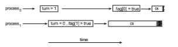

# Peterson’s Solution

Next, we illustrate a classic software-based solution to the critical-section prob- lem known as **Peterson’s solution**. Because of the way modern computer architectures perform basic machine-language instructions, such as load and store, there are no guarantees that Peterson’s solution will work correctly on such architectures. However, we present the solution because it provides a good algorithmic description of solving the critical-section problem and illus- trates some of the complexities involved in designing software that addresses the requirements of mutual exclusion, progress, and bounded waiting.

Peterson’s solution is restricted to two processes that alternate execution between their critical sections and remainder sections. The processes are num- bered _P_ 0 and _P_ 1. For convenience, when presenting _Pi_, we use _Pj_ to denote the other process; that is, j equals 1 − i.

Peterson’s solution requires the two processes to share two data items:

int turn; boolean flag[2];  
```
while (true) { flag[i] = true; turn = j; while (flag[j] && turn == j)

;

/* critical section */

flag[i] = false;

/*remainder section */ }
```
**Figure 6.3** The structure of process _Pi_ in Peterson’s solution.

The variable turn indicates whose turn it is to enter its critical section. That is, if turn == i, then process _Pi_ is allowed to execute in its critical section. The flag array is used to indicate if a process is ready to enter its critical section. For example, if flag[i] is true, _Pi_ is ready to enter its critical section. With an explanation of these data structures complete, we are now ready to describe the algorithm shown in Figure 6.3.

To enter the critical section, process _Pi_ first sets flag[i] to be true and then sets turn to the value j, thereby asserting that if the other process wishes to enter the critical section, it can do so. If both processes try to enter at the same time, turn will be set to both i and j at roughly the same time. Only one of these assignments will last; the other will occur but will be overwritten imme- diately. The eventual value of turn determines which of the two processes is allowed to enter its critical section first.

We now prove that this solution is correct. We need to show that:

**1.** Mutual exclusion is preserved.

**2.** The progress requirement is satisfied.

**3.** The bounded-waiting requirement is met.

To prove property 1, we note that each _Pi_ enters its critical section only if either flag[j] == false or turn == i. Also note that, if both processes can be executing in their critical sections at the same time, then flag[0] == flag[1] == true. These two observations imply that _P_ 0 and _P_ 1 could not have successfully executed their while statements at about the same time, since the value of turn can be either 0 or 1 but cannot be both. Hence, one of the processes—say, _Pj_—must have successfully executed the while statement, whereas _Pi_ had to execute at least one additional statement (“turn == j”). However, at that time, flag[j] == true and turn == j, and this condition will persist as long as _Pj_ is in its critical section; as a result, mutual exclusion is preserved.  

Toprove properties 2 and 3,we note that a process_Pi_ can be prevented from entering the critical section only if it is stuck in the while loopwith the condition flag[j] == true and turn == j; this loop is the only one possible. If _Pj_ is not ready to enter the critical section, then flag[j] == false, and _Pi_ can enter its critical section. If _Pj_ has set flag[j] to true and is also executing in its while statement, then either turn == i or turn == j. If turn == i, then _Pi_ will enter the critical section. If turn == j, then _Pj_ will enter the critical section. However, once _Pj_ exits its critical section, it will reset flag[j] to false, allowing _Pi_ to enter its critical section. If _Pj_ resets flag[j] to true, it must also set turn to i. Thus, since _Pi_ does not change the value of the variable turn while executing the while statement, _Pi_ will enter the critical section (progress) after at most one entry by _Pj_ (bounded waiting).

As mentioned at the beginning of this section, Peterson’s solution is not guaranteed to work on modern computer architectures for the primary rea- son that, to improve system performance, processors and/or compilers may reorder read and write operations that have no dependencies. For a single- threaded application, this reordering is immaterial as far as program correct- ness is concerned, as the final values are consistent withwhat is expected. (This is similar to balancing a checkbook—the actual order in which credit and debit operations are performed is unimportant, because the final balance will still be the same.) But for amultithreaded applicationwith shared data, the reordering of instructions may render inconsistent or unexpected results.

As an example, consider the following data that are shared between two threads:
```
boolean flag = false; int x = 0;

where Thread 1 performs the statements

while (!flag) ;

print x;

and Thread 2 performs

x = 100; flag = true;
```
The expected behavior is, of course, that Thread 1 outputs the value 100 for variable x. However, as there are no data dependencies between the variables flag and x, it is possible that a processor may reorder the instructions for Thread 2 so that flag is assigned true before assignment of x = 100. In this situation, it is possible that Thread 1 would output 0 for variable x. Less obvious is that the processor may also reorder the statements issued by Thread 1 and load the variable x before loading the value of flag. If this were to occur, Thread 1would output 0 for variable x even if the instructions issuedbyThread 2 were not reordered.  

**Figure 6.4** The effects of instruction reordering in Peterson’s solution.

How does this affect Peterson’s solution? Consider what happens if the assignments of the first two statements that appear in the entry section of Peterson’s solution in Figure 6.3 are reordered; it is possible that both threads may be active in their critical sections at the same time, as shown in Figure 6.4.

As you will see in the following sections, the only way to preserve mutual exclusion is by using proper synchronization tools. Our discussion of these tools begins with primitive support in hardware and proceeds through abstract, high-level, software-based APIs available to both kernel developers and application programmers.