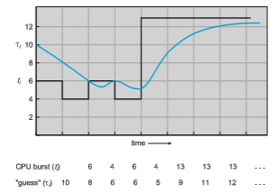
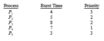
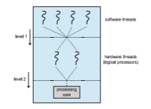
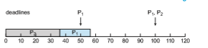
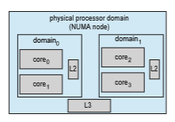
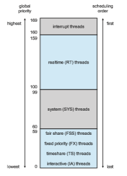
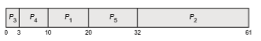
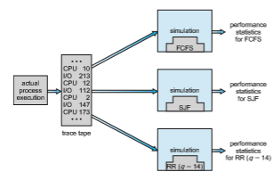
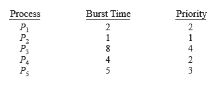
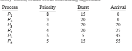

# CPU Scheduling

CPU scheduling is the basis ofmultiprogrammedoperating systems. By switch- ing the CPU among processes, the operating system can make the computer more productive. In this chapter, we introduce basic CPU-scheduling concepts and present several CPU-scheduling algorithms, including real-time systems. We also consider the problem of selecting an algorithm for a particular system.

InChapter 4,we introduced threads to the processmodel.Onmodern oper- ating systems it is kernel-level threads—not processes—that are in fact being scheduled by the operating system. However, the terms "process scheduling" and "thread scheduling" are often used interchangeably. In this chapter, we use **_process scheduling_** when discussing general scheduling concepts and **_thread scheduling_** to refer to thread-specific ideas.

Similarly, in Chapter 1 we describe how a **_core_** is the basic computational unit of a CPU, and that a process executes on a CPU’s core. However, in many instances in this chapter, when we use the general terminology of scheduling a process to "run on a CPU", we are implying that the process is running on a CPU’s core.

**CHAPTER OBJECTIVES**

• Describe various CPU scheduling algorithms.

• Assess CPU scheduling algorithms based on scheduling criteria.

• Explain the issues related to multiprocessor and multicore scheduling.

• Describe various real-time scheduling algorithms.

• Describe the scheduling algorithms used in the Windows, Linux, and Solaris operating systems.

• Apply modeling and simulations to evaluate CPU scheduling algorithms.

• Design a program that implements several different CPU scheduling algo- rithms.

## Basic Concepts

In a system with a single CPU core, only one process can run at a time. Others must wait until the CPU’s core is free and can be rescheduled. The objective of multiprogramming is to have some process running at all times, to maximize CPU utilization. The idea is relatively simple. Aprocess is executed until it must wait, typically for the completion of some I/O request. In a simple computer system, the CPU then just sits idle. All this waiting time is wasted; no useful work is accomplished.Withmultiprogramming,we try to use this timeproduc- tively. Several processes are kept inmemory at one time.When one process has to wait, the operating system takes the CPU away from that process and gives the CPU to another process. This pattern continues. Every time one process has to wait, another process can take over use of the CPU. On a multicore system, this concept of keeping the CPU busy is extended to all processing cores on the system.

Scheduling of this kind is a fundamental operating-system function. Almost all computer resources are scheduled before use. The CPU is, of course, one of the primary computer resources. Thus, its scheduling is central to operating-system design.

**Figure 5.1** Alternating sequence of CPU and I/O bursts.  

### CPU–I/O Burst Cycle

The success of CPU scheduling depends on an observed property of processes: process execution consists of a **cycle** of CPU execution and I/O wait. Processes alternate between these two states. Process execution begins with a **CPU burst**. That is followed by an **I/O burst**, which is followed by another CPU burst, then another I/O burst, and so on. Eventually, the final CPU burst endswith a system request to terminate execution (Figure 5.1).

The durations of CPU bursts have been measured extensively. Although they vary greatly from process to process and from computer to computer, they tend to have a frequency curve similar to that shown in Figure 5.2. The curve is generally characterized as exponential or hyperexponential, with a large number of short CPU bursts and a small number of long CPU bursts. An I/O-bound program typically has many short CPU bursts. A CPU-bound programmight have a few long CPU bursts. This distribution can be important when implementing a CPU-scheduling algorithm.

### CPU Scheduler

Whenever the CPU becomes idle, the operating system must select one of the processes in the ready queue to be executed. The selection process is carried out by the **CPU scheduler**, which selects a process from the processes in memory that are ready to execute and allocates the CPU to that process.

Note that the ready queue is not necessarily a first-in, first-out (FIFO) queue. As we shall see when we consider the various scheduling algorithms, a ready queue can be implemented as a FIFO queue, a priority queue, a tree, or simply an unordered linked list. Conceptually, however, all the processes in the ready queue are lined up waiting for a chance to run on the CPU. The records in the queues are generally process control blocks (PCBs) of the processes.

**Figure 5.2** Histogram of CPU-burst durations.  

### Preemptive and Nonpreemptive Scheduling

CPU-scheduling decisions may take place under the following four circum- stances:

**1\.** When a process switches from the running state to the waiting state (for example, as the result of an I/O request or an invocation of wait() for the termination of a child process)

**2\.** When a process switches from the running state to the ready state (for example, when an interrupt occurs)

**3\.** When a process switches from the waiting state to the ready state (for example, at completion of I/O)

**4\.** When a process terminates

For situations 1 and 4, there is no choice in terms of scheduling. Anew process (if one exists in the ready queue) must be selected for execution. There is a choice, however, for situations 2 and 3.

When scheduling takes place only under circumstances 1 and 4,we say that the scheduling scheme is **nonpreemptive** or **cooperative**. Otherwise, it is **pre- emptive**. Under nonpreemptive scheduling, once the CPU has been allocated to a process, the process keeps the CPU until it releases it either by terminating or by switching to the waiting state. Virtually all modern operating systems includingWindows, macOS, Linux, and UNIX use preemptive scheduling algo- rithms.

Unfortunately, preemptive scheduling can result in race conditions when data are shared among several processes. Consider the case of two processes that share data. While one process is updating the data, it is preempted so that the second process can run. The second process then tries to read the data, which are in an inconsistent state. This issue will be explored in detail in Chapter 6.

Preemption also affects the design of the operating-system kernel. During the processing of a system call, the kernel may be busy with an activity on behalf of a process. Such activities may involve changing important kernel data (for instance, I/O queues). What happens if the process is preempted in the middle of these changes and the kernel (or the device driver) needs to read or modify the same structure? Chaos ensues. As will be discussed in Section 6.2, operating-system kernels can be designed as either nonpreemptive or preemptive. A nonpreemptive kernel will wait for a system call to complete or for a process to block while waiting for I/O to complete to take place before doing a context switch. This scheme ensures that the kernel structure is simple, since the kernel will not preempt a process while the kernel data structures are in an inconsistent state. Unfortunately, this kernel-execution model is a poor one for supporting real-time computing, where tasks must complete execution within a given time frame. In Section 5.6, we explore scheduling demands of real-time systems. A preemptive kernel requires mechanisms such as mutex locks to prevent race conditions when accessing shared kernel data structures. Most modern operating systems are now fully preemptive when running in kernel mode.  

**Figure 5.3** The role of the dispatcher.

Because interrupts can, by definition, occur at any time, and because they cannot always be ignored by the kernel, the sections of code affected by inter- rupts must be guarded from simultaneous use. The operating system needs to accept interrupts at almost all times. Otherwise, input might be lost or output overwritten. So that these sections of code are not accessed concurrently by several processes, they disable interrupts at entry and reenable interrupts at exit. It is important to note that sections of code that disable interrupts do not occur very often and typically contain few instructions.

### Dispatcher

Another component involved in the CPU-scheduling function is the**dispatcher**. The dispatcher is the module that gives control of the CPU’s core to the process selected by the CPU scheduler. This function involves the following:

• Switching context from one process to another

• Switching to user mode

• Jumping to the proper location in the user program to resume that program

Thedispatcher should be as fast as possible, since it is invokedduring every context switch. The time it takes for the dispatcher to stop one process and start another running is known as the **dispatch latency** and is illustrated in Figure 5.3.

An interesting question to consider is, how often do context switches occur? On a system-wide level, the number of context switches can be obtained by using the vmstat command that is available on Linux systems. Below is the output (which has been trimmed) from the command

vmstat 1 3  

This command provides 3 lines of output over a 1-second delay:

------cpu----- 
24 
225 
339

The first line gives the average number of context switches over 1 second since the system booted, and the next two lines give the number of context switches over two 1-second intervals. Since this machine booted, it has aver- aged 24 context switches per second. And in the past second, 225 context switches were made, with 339 context switches in the second prior to that.

We can also use the /proc file system to determine the number of context switches for a given process. For example, the contents of the file /proc/2166/status will list various statistics for the process with pid = 2166. The command

cat /proc/2166/status

provides the following trimmed output:

voluntary ctxt switches 150 nonvoluntary ctxt switches 8

This output shows the number of context switches over the lifetime of the process. Notice the distinction between **_voluntary_** and **_nonvoluntary_** context switches. A voluntary context switch occurs when a process has given up control of the CPU because it requires a resource that is currently unavailable (such as blocking for I/O.) Anonvoluntary context switch occurs when the CPU has been taken away from a process, such as when its time slice has expired or it has been preempted by a higher-priority process.

## Scheduling Criteria

Different CPU-scheduling algorithms have different properties, and the choice of a particular algorithm may favor one class of processes over another. In choosing which algorithm to use in a particular situation, we must consider the properties of the various algorithms.

Many criteria have been suggested for comparing CPU-scheduling algo- rithms. Which characteristics are used for comparison can make a substantial difference in which algorithm is judged to be best. The criteria include the following:

• **CPU utilization**. We want to keep the CPU as busy as possible. Concep- tually, CPU utilization can range from 0 to 100 percent. In a real system, it should range from 40 percent (for a lightly loaded system) to 90 percent (for a heavily loaded system). (CPU utilization can be obtained by using the top command on Linux, macOS, and UNIX systems.)

• **Throughput**. If the CPU is busy executing processes, then work is being done. One measure of work is the number of processes that are completed  per time unit, called **throughput**. For long processes, this rate may be one process over several seconds; for short transactions, it may be tens of processes per second.

• **Turnaround time**. From the point of view of a particular process, the important criterion is how long it takes to execute that process. The interval from the time of submission of a process to the time of completion is the turnaround time. Turnaround time is the sum of the periods spent waiting in the ready queue, executing on the CPU, and doing I/O.

• **Waiting time**. The CPU-scheduling algorithm does not affect the amount of time during which a process executes or does I/O. It affects only the amount of time that a process spends waiting in the ready queue. Waiting time is the sum of the periods spent waiting in the ready queue.

• **Response time**. In an interactive system, turnaround time may not be the best criterion. Often, a process can produce some output fairly early and can continue computing new results while previous results are being output to the user. Thus, another measure is the time from the submission of a request until the first response is produced. This measure, called response time, is the time it takes to start responding, not the time it takes to output the response.

It is desirable tomaximize CPU utilization and throughput and tominimize turnaround time, waiting time, and response time. In most cases, we optimize the average measure. However, under some circumstances, we prefer to opti- mize the minimum or maximum values rather than the average. For example, to guarantee that all users get good service, we may want to minimize the maximum response time.

Investigators have suggested that, for interactive systems (such as a PC desktop or laptop system), it is more important to minimize the variance in the response time than to minimize the average response time. A system with reasonable and predictable response time may be considered more desirable than a system that is faster on the average but is highly variable. However, little work has been done on CPU-scheduling algorithms that minimize variance.

As we discuss various CPU-scheduling algorithms in the following section, we illustrate their operation. An accurate illustration should involve many processes, each a sequence of several hundred CPU bursts and I/O bursts. For simplicity, though, we consider only one CPU burst (in milliseconds) per process in our examples. Our measure of comparison is the average waiting time. More elaborate evaluation mechanisms are discussed in Section 5.8.

## Scheduling Algorithms

CPU scheduling deals with the problem of deciding which of the processes in the ready queue is to be allocated the CPU’s core. There aremany different CPU- scheduling algorithms. In this section, we describe several of them. Although most modern CPU architectures have multiple processing cores, we describe these scheduling algorithms in the context of only one processing core avail- able. That is, a single CPU that has a single processing core, thus the system is  

capable of only running one process at a time. In Section 5.5 we discuss CPU scheduling in the context of multiprocessor systems.

### First-Come, First-Served Scheduling

By far the simplest CPU-scheduling algorithm is the **first-come first-serve** (**FCFS**) scheduling algorithm. With this scheme, the process that requests the CPU first is allocated the CPU first. The implementation of the FCFS policy is easily managed with a FIFO queue. When a process enters the ready queue, its PCB is linked onto the tail of the queue. When the CPU is free, it is allocated to the process at the head of the queue. The running process is then removed from the queue. The code for FCFS scheduling is simple to write and understand.

On the negative side, the average waiting time under the FCFS policy is often quite long. Consider the following set of processes that arrive at time 0, with the length of the CPU burst given in milliseconds:

If the processes arrive in the order _P_1, _P_2, _P_3, and are served in FCFS order, we get the result shown in the following **Gantt chart**, which is a bar chart that illustrates a particular schedule, including the start and finish times of each of the participating processes:

The waiting time is 0 milliseconds for process _P_1, 24 milliseconds for process _P_2, and 27 milliseconds for process _P_3\. Thus, the average waiting time is (0 + 24 + 27)/3 = 17 milliseconds. If the processes arrive in the order _P_2, _P_3, _P_1, however, the results will be as shown in the following Gantt chart:

The average waiting time is now (6 + 0 + 3)/3 = 3 milliseconds. This reduction is substantial. Thus, the average waiting time under an FCFS policy is generally not minimal and may vary substantially if the processes’ CPU burst times vary greatly.

In addition, consider the performance of FCFS scheduling in a dynamic situation. Assume we have one CPU-bound process and many I/O-bound pro- cesses. As the processes flow around the system, the following scenario may result. The CPU-bound process will get and hold the CPU. During this time, all the other processes will finish their I/O and will move into the ready queue, waiting for the CPU. While the processes wait in the ready queue, the I/O  
devices are idle. Eventually, the CPU-bound process finishes its CPU burst and moves to an I/O device. All the I/O-bound processes, which have short CPU bursts, execute quickly and move back to the I/O queues. At this point, the CPU sits idle. The CPU-bound process will then move back to the ready queue and be allocated the CPU. Again, all the I/O processes end up waiting in the ready queue until the CPU-bound process is done. There is a **convoy effect** as all the other processes wait for the one big process to get off the CPU. This effect results in lower CPU and device utilization thanmight be possible if the shorter processes were allowed to go first.

Note also that the FCFS scheduling algorithm is nonpreemptive. Once the CPU has been allocated to a process, that process keeps the CPU until it releases the CPU, either by terminating or by requesting I/O. The FCFS algorithm is thus particularly troublesome for interactive systems, where it is important that each process get a share of the CPU at regular intervals. It would be disastrous to allow one process to keep the CPU for an extended period.

### Shortest-Job-First Scheduling

A different approach to CPU scheduling is the **shortest-job-firs** (**SJF**) schedul- ing algorithm. This algorithm associates with each process the length of the process’s next CPU burst.When the CPU is available, it is assigned to the process that has the smallest next CPU burst. If the next CPU bursts of two processes are the same, FCFS scheduling is used to break the tie. Note that a more appro- priate term for this scheduling method would be the **_shortest-next-CPU-burst_** algorithm, because scheduling depends on the length of the next CPU burst of a process, rather than its total length. We use the term SJF because most people and textbooks use this term to refer to this type of scheduling.

As an example of SJF scheduling, consider the following set of processes, with the length of the CPU burst given in milliseconds:

Using SJF scheduling, we would schedule these processes according to the following Gantt chart:

The waiting time is 3 milliseconds for process _P_1, 16 milliseconds for process _P_2, 9 milliseconds for process _P_3, and 0 milliseconds for process _P_4\. Thus, the average waiting time is (3 + 16 + 9 + 0)/4 = 7 milliseconds. By comparison, if we were using the FCFS scheduling scheme, the average waiting time would be 10.25 milliseconds.

The SJF scheduling algorithm is provably optimal, in that it gives the mini- mum average waiting time for a given set of processes. Moving a short process before a long one decreases the waiting time of the short process more than it increases the waiting time of the long process. Consequently, the average waiting time decreases.

Although the SJF algorithm is optimal, it cannot be implemented at the level of CPU scheduling, as there is no way to know the length of the next CPU burst. One approach to this problem is to try to approximate SJF scheduling. We may not know the length of the next CPU burst, but we may be able to predict its value.We expect that the next CPU burstwill be similar in length to the previous ones. By computing an approximation of the length of the next CPU burst, we can pick the process with the shortest predicted CPU burst.

The next CPU burst is generally predicted as an **exponential average** of the measured lengths of previous CPU bursts. We can define the exponential average with the following formula. Let _tn_ be the length of the _n_th CPU burst, and let τ_n_+1 be our predicted value for the next CPU burst. Then, for α, 0 ≤ α ≤

1, define

τ _n_ +1 = α _tn_ \+ (1 − α)τ _n_ .

The value of _tn_ contains our most recent information, while τ_n_ stores the past history. The parameter α controls the relative weight of recent and past history in our prediction. If α = 0, then τ_n_+1 = τ_n_, and recent history has no effect (current conditions are assumed to be transient). If α = 1, then τ_n_+1 = _tn_, and only the most recent CPU burst matters (history is assumed to be old and irrelevant). More commonly, α = 1/2, so recent history and past history are equally weighted. The initial τ0 can be defined as a constant or as an overall system average. Figure 5.4 shows an exponential average with α = 1/2 and τ0 = 10.

**Figure 5.4** Prediction of the length of the next CPU burst.  
To understand the behavior of the exponential average, we can expand the formula for τ_n_+1 by substituting for τ_n_ to find

τ_n_+1 = α_tn_ \+ (1 − α)α_tn_−1 + · · · + (1 − α)_j_α_tn_−_j_ \+ · · · + (1 − α)_n_+1τ0_._

Typically, α is less than 1. As a result, (1 − α) is also less than 1, and each successive term has less weight than its predecessor.

The SJF algorithm can be either preemptive or nonpreemptive. The choice arises when a new process arrives at the ready queue while a previous pro- cess is still executing. The next CPU burst of the newly arrived process may be shorter than what is left of the currently executing process. A preemptive SJF algorithm will preempt the currently executing process, whereas a non- preemptive SJF algorithm will allow the currently running process to finish its CPU burst. Preemptive SJF scheduling is sometimes called **shortest-remaining- time-firs** scheduling.

As an example, consider the following four processes, with the length of the CPU burst given in milliseconds:

If the processes arrive at the ready queue at the times shown and need the indicated burst times, then the resulting preemptive SJF schedule is as depicted in the following Gantt chart:

Process _P_1 is started at time 0, since it is the only process in the queue. Process _P_2 arrives at time 1. The remaining time for process _P_1 (7 milliseconds) is larger than the time required by process _P_2 (4 milliseconds), so process _P_1 is preempted, and process _P_2 is scheduled. The average waiting time for this example is \[(10 − 1) + (1 − 1) + (17 − 2) + (5 − 3)\]/4 = 26/4 = 6.5 milliseconds. Nonpreemptive SJF scheduling would result in an average waiting time of 7.75 milliseconds.

### Round-Robin Scheduling

The **round-robin** (**RR**) scheduling algorithm is similar to FCFS scheduling, but preemption is added to enable the system to switch between processes. Asmall unit of time, called a **time quantum** or **time slice**, is defined. A time quantum is generally from 10 to 100milliseconds in length. The ready queue is treated as a circular queue. The CPU scheduler goes around the ready queue, allocating the CPU to each process for a time interval of up to 1 time quantum.

To implement RR scheduling, we again treat the ready queue as a FIFO queue of processes. New processes are added to the tail of the ready queue.  

The CPU scheduler picks the first process from the ready queue, sets a timer to interrupt after 1 time quantum, and dispatches the process.

One of two things will then happen. The process may have a CPU burst of less than 1 time quantum. In this case, the process itself will release the CPU voluntarily. The scheduler will then proceed to the next process in the ready queue. If the CPU burst of the currently running process is longer than 1 time quantum, the timer will go off and will cause an interrupt to the operating system. A context switch will be executed, and the process will be put at the tail of the ready queue. The CPU scheduler will then select the next process in the ready queue.

The average waiting time under the RR policy is often long. Consider the following set of processes that arrive at time 0, with the length of the CPU burst given in milliseconds:


If we use a time quantum of 4 milliseconds, then process _P_1 gets the first 4 milliseconds. Since it requires another 20 milliseconds, it is preempted after the first time quantum, and the CPU is given to the next process in the queue, process _P_2\. Process _P_2 does not need 4 milliseconds, so it quits before its time quantum expires. The CPU is then given to the next process, process _P_3\. Once each process has received 1 time quantum, the CPU is returned to process _P_1 for an additional time quantum. The resulting RR schedule is as follows:

Let’s calculate the average waiting time for this schedule. _P_1 waits for 6 mil- liseconds (10 − 4), _P_2 waits for 4 milliseconds, and _P_3 waits for 7 milliseconds. Thus, the average waiting time is 17/3 = 5.66 milliseconds.

In the RR scheduling algorithm, no process is allocated the CPU for more than 1 time quantum in a row (unless it is the only runnable process). If a process’s CPU burst exceeds 1 time quantum, that process is preempted and is put back in the ready queue. The RR scheduling algorithm is thus preemptive.

If there are _n_ processes in the ready queue and the time quantum is _q_, then each process gets 1/_n_ of the CPU time in chunks of at most _q_ time units. Each process must wait no longer than (_n_− 1)× _q_ time units until its next time quan- tum. For example, with five processes and a time quantum of 20 milliseconds, each process will get up to 20 milliseconds every 100 milliseconds.

The performance of the RR algorithm depends heavily on the size of the time quantum. At one extreme, if the time quantum is extremely large, the RR policy is the same as the FCFS policy. In contrast, if the time quantum is extremely small (say, 1 millisecond), the RR approach can result in a large  

**Figure 5.5** How a smaller time quantum increases context switches.

number of context switches. Assume, for example, that we have only one process of 10 time units. If the quantum is 12 time units, the process finishes in less than 1 time quantum, with no overhead. If the quantum is 6 time units, however, the process requires 2 quanta, resulting in a context switch. If the time quantum is 1 time unit, then nine context switches will occur, slowing the execution of the process accordingly (Figure 5.5).

Thus, we want the time quantum to be large with respect to the context- switch time. If the context-switch time is approximately 10 percent of the time quantum, then about 10 percent of the CPU time will be spent in context switching. In practice, most modern systems have time quanta ranging from 10 to 100 milliseconds. The time required for a context switch is typically less than 10 microseconds; thus, the context-switch time is a small fraction of the time quantum.

Turnaround time also depends on the size of the time quantum. As we can see from Figure 5.6, the average turnaround time of a set of processes does not necessarily improve as the time-quantum size increases. In general, the average turnaround time can be improved if most processes finish their next CPU burst in a single time quantum. For example, given three processes of 10 time units each and a quantum of 1 time unit, the average turnaround time is 29. If the time quantum is 10, however, the average turnaround time drops to 20. If context-switch time is added in, the average turnaround time increases even more for a smaller time quantum, since more context switches are required.

Although the time quantum should be large compared with the context- switch time, it should not be too large. As we pointed out earlier, if the time quantum is too large, RR scheduling degenerates to an FCFS policy. A rule of thumb is that 80 percent of the CPU bursts should be shorter than the time quantum.

### Priority Scheduling

The SJF algorithm is a special case of the general**priority-scheduling** algorithm. A priority is associated with each process, and the CPU is allocated to the  

**Figure 5.6** How turnaround time varies with the time quantum.

process with the highest priority. Equal-priority processes are scheduled in FCFS order. An SJF algorithm is simply a priority algorithm where the priority (_p_) is the inverse of the (predicted) next CPU burst. The larger the CPU burst, the lower the priority, and vice versa.

Note that we discuss scheduling in terms of **_high_** priority and **_low_** priority. Priorities are generally indicated by some fixed range of numbers, such as 0 to 7 or 0 to 4,095. However, there is no general agreement on whether 0 is the highest or lowest priority. Some systems use low numbers to represent low priority; others use low numbers for high priority. This difference can lead to confusion. In this text, we assume that low numbers represent high priority.

As an example, consider the following set of processes, assumed to have arrived at time 0 in the order _P_1, _P_2, · · ·, _P_5, with the length of the CPU burst given in milliseconds:

Using priority scheduling, wewould schedule these processes according to the following Gantt chart:  

The average waiting time is 8.2 milliseconds. Priorities can be defined either internally or externally. Internally defined

priorities use some measurable quantity or quantities to compute the priority of a process. For example, time limits, memory requirements, the number of open files, and the ratio of average I/O burst to average CPU burst have been used in computing priorities. External priorities are set by criteria outside the operating system, such as the importance of the process, the type and amount of funds being paid for computer use, the department sponsoring the work, and other, often political, factors.

Priority scheduling can be either preemptive or nonpreemptive. When a process arrives at the ready queue, its priority is compared with the priority of the currently running process. Apreemptivepriority scheduling algorithmwill preempt the CPU if the priority of the newly arrived process is higher than the priority of the currently running process. Anonpreemptive priority scheduling algorithm will simply put the new process at the head of the ready queue.

Amajor problem with priority scheduling algorithms is **indefinit block- ing**, or **starvation**. A process that is ready to run but waiting for the CPU can be considered blocked. A priority scheduling algorithm can leave some low- priority processes waiting indefinitely. In a heavily loaded computer system, a steady stream of higher-priority processes can prevent a low-priority process from ever getting the CPU. Generally, one of two things will happen. Either the process will eventually be run (at 2 A.M. Sunday, when the system is finally lightly loaded), or the computer systemwill eventually crash and lose all unfin- ished low-priority processes. (Rumor has it that when they shut down the IBM 7094 at MIT in 1973, they found a low-priority process that had been submitted in 1967 and had not yet been run.)

Asolution to the problemof indefinite blockage of low-priority processes is **aging**. Aging involves gradually increasing the priority of processes that wait in the system for a long time. For example, if priorities range from 127 (low) to 0 (high), we could periodically (say, every second) increase the priority of a waiting process by 1. Eventually, even a process with an initial priority of 127 would have the highest priority in the system and would be executed. In fact, it would take a little over 2 minutes for a priority-127 process to age to a priority-0 process.

Another option is to combine round-robin and priority scheduling in such a way that the system executes the highest-priority process and runs processes with the same priority using round-robin scheduling. Let’s illustrate with an example using the following set of processes, with the burst time in millisec- onds:

Using priority scheduling with round-robin for processes with equal priority, we would schedule these processes according to the following Gantt chart using a time quantum of 2 milliseconds:

In this example, process _P_4 has the highest priority, so it will run to comple- tion. Processes_P_2 and_P_3 have the next-highest priority, and theywill execute in a round-robin fashion. Notice that when process _P_2 finishes at time 16, process _P_3 is the highest-priority process, so it will run until it completes execution. Now, only processes _P_1 and _P_5 remain, and as they have equal priority, they will execute in round-robin order until they complete.

### Multilevel Queue Scheduling

With both priority and round-robin scheduling, all processes may be placed in a single queue, and the scheduler then selects the process with the highest priority to run. Depending on how the queues are managed, an _O_(_n_) search may be necessary to determine the highest-priority process. In practice, it is often easier to have separate queues for each distinct priority, and priority scheduling simply schedules the process in the highest-priority queue. This is illustrated in Figure 5.7. This approach—known as **multilevel queue**— also works well when priority scheduling is combined with round-robin: if there are multiple processes in the highest-priority queue, they are executed in round-robin order. In the most generalized form of this approach, a priority is assigned statically to each process, and a process remains in the same queue for the duration of its runtime.

**Figure 5.7** Separate queues for each priority.  

**Figure 5.8** Multilevel queue scheduling.

A multilevel queue scheduling algorithm can also be used to partition processes into several separate queues based on the process type (Figure 5.8). For example, a common division is made between **foreground** (interac- tive) processes and **background** (batch) processes. These two types of pro- cesses have different response-time requirements and so may have different scheduling needs. In addition, foreground processes may have priority (exter- nally defined) over background processes. Separate queues might be used for foreground and background processes, and each queue might have its own scheduling algorithm. The foreground queue might be scheduled by an RR algorithm, for example, while the background queue is scheduled by an FCFS algorithm.

In addition, there must be scheduling among the queues, which is com- monly implemented as fixed-priority preemptive scheduling. For example, the real-time queue may have absolute priority over the interactive queue.

Let’s look at an example of a multilevel queue scheduling algorithm with four queues, listed below in order of priority:

**1\.** Real-time processes

**2\.** System processes

**3\.** Interactive processes

**4\.** Batch processes

Each queue has absolute priority over lower-priority queues. No process in the batch queue, for example, could run unless the queues for real-time processes, system processes, and interactive processes were all empty. If an interactive process entered the ready queue while a batch process was running, the batch process would be preempted.

Another possibility is to time-slice among the queues. Here, each queue gets a certain portion of the CPU time,which it can then schedule among its var- ious processes. For instance, in the foreground–background queue example, the foreground queue can be given 80 percent of the CPU time for RR scheduling  

among its processes, while the background queue receives 20 percent of the CPU to give to its processes on an FCFS basis.

### Multilevel Feedback Queue Scheduling

Normally, when the multilevel queue scheduling algorithm is used, processes are permanently assigned to a queue when they enter the system. If there are separate queues for foreground and background processes, for example, processes do not move from one queue to the other, since processes do not change their foreground or background nature. This setup has the advantage of low scheduling overhead, but it is inflexible.

The **multilevel feedback queue** scheduling algorithm, in contrast, allows a process to move between queues. The idea is to separate processes according to the characteristics of their CPU bursts. If a process uses too much CPU time, it will be moved to a lower-priority queue. This scheme leaves I/O-bound and interactive processes—which are typically characterized by short CPU bursts —in the higher-priority queues. In addition, a process that waits too long in a lower-priority queue may be moved to a higher-priority queue. This form of aging prevents starvation.

For example, consider a multilevel feedback queue scheduler with three queues, numbered from 0 to 2 (Figure 5.9). The scheduler first executes all processes in queue 0. Only when queue 0 is empty will it execute processes in queue 1. Similarly, processes in queue 2 will be executed only if queues 0 and 1 are empty. A process that arrives for queue 1 will preempt a process in queue 2. A process in queue 1 will in turn be preempted by a process arriving for queue 0.

An entering process is put in queue 0. A process in queue 0 is given a time quantum of 8 milliseconds. If it does not finish within this time, it is moved to the tail of queue 1. If queue 0 is empty, the process at the head of queue 1 is given a quantum of 16milliseconds. If it does not complete, it is preempted and is put into queue 2. Processes in queue 2 are run on an FCFS basis but are run onlywhen queues 0 and 1 are empty. To prevent starvation, a process that waits too long in a lower-priority queuemay gradually bemoved to a higher-priority queue.

**Figure 5.9** Multilevel feedback queues.  

This scheduling algorithm gives highest priority to any process with a CPU burst of 8 milliseconds or less. Such a process will quickly get the CPU, finish its CPU burst, and go off to its next I/O burst. Processes that need more than 8 but less than 24 milliseconds are also served quickly, although with lower priority than shorter processes. Long processes automatically sink to queue 2 and are served in FCFS order with any CPU cycles left over from queues 0 and 1.

In general, a multilevel feedback queue scheduler is defined by the follow- ing parameters:

• The number of queues

• The scheduling algorithm for each queue

• The method used to determine when to upgrade a process to a higher- priority queue

• The method used to determine when to demote a process to a lower- priority queue

• Themethod used to determinewhich queue a process will enter when that process needs service

The definition of a multilevel feedback queue scheduler makes it the most general CPU-scheduling algorithm. It can be configured to match a specific system under design. Unfortunately, it is also the most complex algorithm, since defining the best scheduler requires somemeans bywhich to select values for all the parameters.

## Thread Scheduling

In Chapter 4, we introduced threads to the process model, distinguishing between **_user-level_** and **_kernel-level_** threads. On most modern operating sys- tems it is kernel-level threads—not processes—that are being scheduled by the operating system. User-level threads are managed by a thread library, and the kernel is unaware of them. To run on a CPU, user-level threads must ulti- mately be mapped to an associated kernel-level thread, although this mapping may be indirect and may use a lightweight process (LWP). In this section, we explore scheduling issues involving user-level and kernel-level threads and offer specific examples of scheduling for Pthreads.

### Contention Scope

One distinction between user-level and kernel-level threads lies in how they are scheduled. On systems implementing the many-to-one (Section 4.3.1) and many-to-many (Section 4.3.3) models, the thread library schedules user- level threads to run on an available LWP. This scheme is known as **process- contention scope** (**PCS**), since competition for the CPU takes place among threads belonging to the same process. (When we say the thread library _sched- ules_ user threads onto available LWPs, we do not mean that the threads are actually _running_ on a CPU as that further requires the operating system to schedule the LWP’s kernel thread onto a physical CPU core.) To decide which kernel-level thread to schedule onto a CPU, the kernel uses **system-contention scope** (**SCS**). Competition for the CPU with SCS scheduling takes place among all threads in the system. Systems using the one-to-one model (Section 4.3.2), such as Windows and Linux schedule threads using only SCS.

Typically, PCS is done according to priority—the scheduler selects the runnable thread with the highest priority to run. User-level thread priorities are set by the programmer and are not adjusted by the thread library, although some thread libraries may allow the programmer to change the priority of a thread. It is important to note that PCS will typically preempt the thread currently running in favor of a higher-priority thread; however, there is no guarantee of time slicing (Section 5.3.3) among threads of equal priority.

### Pthread Scheduling

We provided a sample POSIX Pthread program in Section 4.4.1, along with an introduction to thread creation with Pthreads. Now, we highlight the POSIX Pthread API that allows specifying PCS or SCS during thread creation. Pthreads identifies the following contention scope values:

• PTHREAD SCOPE PROCESS schedules threads using PCS scheduling.

• PTHREAD SCOPE SYSTEM schedules threads using SCS scheduling.

On systems implementing the many-to-many model, the PTHREAD SCOPE PROCESS policy schedules user-level threads onto available LWPs. The number of LWPs is maintained by the thread library, perhaps using scheduler activations (Section 4.6.5). The PTHREAD SCOPE SYSTEM scheduling policy will create and bind an LWP for each user-level thread onmany-to-many systems, effectively mapping threads using the one-to-one policy.

The Pthread IPC (Interprocess Communication) provides two functions for setting—and getting—the contention scope policy:

• pthread attr setscope(pthread attr t \*attr, int scope)

• pthread attr getscope(pthread attr t \*attr, int \*scope)

The first parameter for both functions contains a pointer to the attribute set for the thread. The second parameter for the pthread attr setscope() function is passed either the PTHREAD SCOPE SYSTEM or the PTHREAD SCOPE PROCESS value, indicating how the contention scope is to be set. In the case of pthread attr getscope(), this second parameter contains a pointer to an int value that is set to the current value of the contention scope. If an error occurs, each of these functions returns a nonzero value.

In Figure 5.10, we illustrate a Pthread scheduling API. The pro- gram first determines the existing contention scope and sets it to PTHREAD SCOPE SYSTEM. It then creates five separate threads that will run using the SCS scheduling policy. Note that on some systems, only certain contention scope values are allowed. For example, Linux and macOS systems allow only PTHREAD SCOPE SYSTEM.  

```
#include _<_pthread.h_\>_ #include _<_stdio.h_\>_ #define NUM THREADS 5

int main(int argc, char \*argv\[\]) _{_

int i, scope; pthread t tid\[NUM THREADS\]; pthread attr t attr;

/\* get the default attributes \*/ pthread attr init(&attr);

/\* first inquire on the current scope \*/ if (**pthread attr getscope**(&attr, &scope) != 0)

fprintf(stderr, "Unable to get scheduling scope∖n"); else _{_

if (scope == PTHREAD SCOPE PROCESS) printf("PTHREAD SCOPE PROCESS");

else if (scope == PTHREAD SCOPE SYSTEM) printf("PTHREAD SCOPE SYSTEM");

else fprintf(stderr, "Illegal scope value.∖n");

_}_

/\* set the scheduling algorithm to PCS or SCS \*/ **pthread attr setscope**(&attr, PTHREAD SCOPE SYSTEM);

/\* create the threads \*/ for (i = 0; i < NUM THREADS; i++)

pthread create(&tid\[i\],&attr,runner,NULL);

/\* now join on each thread \*/ for (i = 0; i < NUM THREADS; i++)

pthread join(tid\[i\], NULL); _}_

/\* Each thread will begin control in this function \*/ void \*runner(void \*param) _{_

/\* do some work ... \*/

pthread exit(0); _}_
```
**Figure 5.10** Pthread scheduling API.  


## Multi-Processor Scheduling

Our discussion thus far has focused on the problems of scheduling the CPU in a system with a single processing core. If multiple CPUs are available, **load shar- ing**, where multiple threads may run in parallel, becomes possible, however scheduling issues become correspondingly more complex. Many possibilities have been tried; and as we saw with CPU scheduling with a single-core CPU, there is no one best solution.

Traditionally, the term **multiprocessor** referred to systems that provided multiple physical processors, where each processor contained one single-core CPU. However, the definition of multiprocessor has evolved significantly, and on modern computing systems, **_multiprocessor_** now applies to the following system architectures:

• Multicore CPUs

• Multithreaded cores

• NUMA systems

• Heterogeneous multiprocessing

Here, we discuss several concerns inmultiprocessor scheduling in the con- text of these different architectures. In the first three examples we concentrate on systems in which the processors are identical—homogeneous—in terms of their functionality. We can then use any available CPU to run any process in the queue. In the last example we explore a system where the processors are not identical in their capabilities.

### Approaches to Multiple-Processor Scheduling

One approach to CPU scheduling in amultiprocessor system has all scheduling decisions, I/O processing, and other system activities handled by a single processor — the master server. The other processors execute only user code. This **asymmetric multiprocessing** is simple because only one core accesses the system data structures, reducing the need for data sharing. The downfall of this approach is themaster server becomes a potential bottleneckwhere overall system performance may be reduced.

The standard approach for supporting multiprocessors is **symmetric mul- tiprocessing** (**SMP**), where each processor is self-scheduling. Scheduling pro- ceeds by having the scheduler for each processor examine the ready queue and select a thread to run. Note that this provides two possible strategies for organizing the threads eligible to be scheduled:

**1\.** All threads may be in a common ready queue.

**2\.** Each processor may have its own private queue of threads.

These two strategies are contrasted in Figure 5.11. If we select the first option, we have a possible race condition on the shared ready queue and therefore must ensure that two separate processors do not choose to schedule the same thread and that threads are not lost from the queue. As discussed in  

**Figure 5.11** Organization of ready queues.

Chapter 6, we could use some form of locking to protect the common ready queue from this race condition. Locking would be highly contended, however, as all accesses to the queue would require lock ownership, and accessing the shared queue would likely be a performance bottleneck. The second option permits each processor to schedule threads from its private run queue and therefore does not suffer from the possible performance problems associated with a shared run queue. Thus, it is the most common approach on systems supporting SMP. Additionally, as described in Section 5.5.4, having private, per- processor run queues in fact may lead to more efficient use of cache memory. There are issues with per-processor run queues—most notably, workloads of varying sizes. However, as we shall see, balancing algorithms can be used to equalize workloads among all processors.

Virtually all modern operating systems support SMP, including Windows, Linux, and macOS as well as mobile systems including Android and iOS. In the remainder of this section, we discuss issues concerning SMP systems when designing CPU scheduling algorithms.

### Multicore Processors

Traditionally, SMP systems have allowed several processes to run in parallel by providing multiple physical processors. However, most contemporary com- puter hardware now places multiple computing cores on the same physical chip, resulting in a **multicore processor**. Each core maintains its architectural state and thus appears to the operating system to be a separate logical CPU. SMP systems that use multicore processors are faster and consume less power than systems in which each CPU has its own physical chip.

Multicore processors may complicate scheduling issues. Let’s consider how this can happen. Researchers have discovered that when a processor accesses memory, it spends a significant amount of time waiting for the data to become available. This situation, known as a **memory stall**, occurs primarily because modern processors operate at much faster speeds thanmemory. How- ever, a memory stall can also occur because of a cache miss (accessing data that are not in cache memory). Figure 5.12 illustrates a memory stall. In this scenario, the processor can spend up to 50 percent of its time waiting for data to become available from memory.  

**Figure 5.12** Memory stall.

To remedy this situation, many recent hardware designs have imple- mented multithreaded processing cores in which two (or more) **hardware threads** are assigned to each core. That way, if one hardware thread stalls while waiting for memory, the core can switch to another thread. Figure 5.13 illus- trates a dual-threaded processing core on which the execution of thread 0 and the execution of thread 1 are interleaved. From an operating system perspec- tive, each hardware thread maintains its architectural state, such as instruction pointer and register set, and thus appears as a logical CPU that is available to run a software thread. This technique—known as **chip multithreading** (CMT) —is illustrated in Figure 5.14. Here, the processor contains four computing cores, with each core containing two hardware threads. From the perspective of the operating system, there are eight logical CPUs.

Intel processors use the term **hyper-threading** (also known as **simultane- ous multithreading**or SMT) to describe assigningmultiple hardware threads to a single processing core. Contemporary Intel processors—such as the i7—sup- port two threads per core, while the Oracle Sparc M7 processor supports eight threads per core, with eight cores per processor, thus providing the operating system with 64 logical CPUs.

In general, there are two ways to multithread a processing core: **coarse- grained** and **fine-graine** multithreading. With coarse-grained multithread- ing, a thread executes on a core until a long-latency event such as a memory stall occurs. Because of the delay caused by the long-latency event, the core must switch to another thread to begin execution. However, the cost of switch- ing between threads is high, since the instruction pipeline must be flushed before the other thread can begin execution on the processor core. Once this new thread begins execution, it begins filling the pipeline with its instructions. Fine-grained (or interleaved) multithreading switches between threads at a much finer level of granularity—typically at the boundary of an instruction

**Figure 5.13** Multithreaded multicore system.  

**Figure 5.14** Chip multithreading.

cycle. However, the architectural design of fine-grained systems includes logic for thread switching. As a result, the cost of switching between threads is small.

It is important to note that the resources of the physical core (such as caches and pipelines) must be shared among its hardware threads, and therefore a processing core can only execute one hardware thread at a time. Consequently, a multithreaded, multicore processor actually requires two different levels of scheduling, as shown in Figure 5.15, which illustrates a dual-threaded process- ing core.

On one level are the scheduling decisions that must be made by the oper- ating system as it chooses which software thread to run on each hardware thread (logical CPU). For all practical purposes, such decisions have been the primary focus of this chapter. Therefore, for this level of scheduling, the oper- ating systemmay choose any scheduling algorithm, including those described in Section 5.3.

A second level of scheduling specifies how each core decides which hard- ware thread to run. There are several strategies to adopt in this situation. One approach is to use a simple round-robin algorithm to schedule a hardware thread to the processing core. This is the approach adopted by the UltraSPARC T3. Another approach is used by the Intel Itanium, a dual-core processor with two hardware-managed threads per core. Assigned to each hardware thread is a dynamic **_urgency_** value ranging from 0 to 7, with 0 representing the lowest urgency and 7 the highest. The Itanium identifies five different events that may  

**Figure 5.15** Two levels of scheduling.

trigger a thread switch. When one of these events occurs, the thread-switching logic compares the urgency of the two threads and selects the thread with the highest urgency value to execute on the processor core.

Note that the two different levels of scheduling shown in Figure 5.15 are not necessarily mutually exclusive. In fact, if the operating system scheduler (the first level) is made aware of the sharing of processor resources, it canmake more effective scheduling decisions. As an example, assume that a CPU has two processing cores, and each core has two hardware threads. If two software threads are running on this system, they can be running either on the same core or on separate cores. If they are both scheduled to run on the same core, they have to share processor resources and thus are likely to proceed more slowly than if they were scheduled on separate cores. If the operating system is aware of the level of processor resource sharing, it can schedule software threads onto logical processors that do not share resources.

### Load Balancing

On SMP systems, it is important to keep the workload balanced among all processors to fully utilize the benefits of having more than one processor. Oth- erwise, one or more processors may sit idle while other processors have high workloads, alongwith ready queues of threads awaiting the CPU. **Load balanc- ing** attempts to keep the workload evenly distributed across all processors in an SMP system. It is important to note that load balancing is typically necessary only on systemswhere each processor has its own private ready queue of eligi- ble threads to execute. On systems with a common run queue, load balancing is unnecessary, because once a processor becomes idle, it immediately extracts a runnable thread from the common ready queue.

There are two general approaches to load balancing: push migration and pull migration. With **push migration**, a specific task periodically checks the load on each processor and—if it finds an imbalance—evenly distributes the load by moving (or pushing) threads from overloaded to idle or less-busy processors. **Pull migration** occurs when an idle processor pulls a waiting task from a busy processor. Push and pullmigration need not bemutually exclusive and are, in fact, often implemented in parallel on load-balancing systems. For example, the Linux CFS scheduler (described in Section 5.7.1) and the ULE scheduler available for FreeBSD systems implement both techniques.

The concept of a “balanced load” may have different meanings. One view of a balanced load may require simply that all queues have approximately the same number of threads. Alternatively, balance may require an equal distri- bution of thread priorities across all queues. In addition, in certain situations, neither of these strategiesmay be sufficient. Indeed, theymaywork against the goals of the scheduling algorithm. (We leave further consideration of this as an exercise.)

### Processor Affinity

Considerwhat happens to cachememorywhen a thread has been running on a specific processor. The data most recently accessed by the thread populate the cache for the processor. As a result, successive memory accesses by the thread are often satisfied in cache memory (known as a “warm cache”). Now consider what happens if the thread migrates to another processor—say, due to load balancing. The contents of cache memory must be invalidated for the first pro- cessor, and the cache for the second processor must be repopulated. Because of the high cost of invalidating and repopulating caches, most operating systems with SMP support try to avoidmigrating a thread fromone processor to another and instead attempt to keep a thread running on the same processor and take advantage of a warm cache. This is known as **processor affinit** —that is, a process has an affinity for the processor on which it is currently running.

The two strategies described in Section 5.5.1 for organizing the queue of threads available for scheduling have implications for processor affinity. If we adopt the approach of a common ready queue, a thread may be selected for execution by any processor. Thus, if a thread is scheduled on a new processor, that processor’s cache must be repopulated. With private, per-processor ready queues, a thread is always scheduled on the same processor and can therefore benefit from the contents of a warm cache. Essentially, per-processor ready queues provide processor affinity for free!

Processor affinity takes several forms. When an operating system has a policy of attempting to keep a process running on the same processor—but not guaranteeing that it will do so—we have a situation known as **soft affinit** . Here, the operating systemwill attempt to keep a process on a single processor, but it is possible for a process to migrate between processors during load balancing. In contrast, some systems provide system calls that support **hard affinit** , thereby allowing a process to specify a subset of processors onwhich it can run. Many systems provide both soft and hard affinity. For example, Linux implements soft affinity, but it also provides the sched setaffinity() system call, which supports hard affinity by allowing a thread to specify the set of CPUs on which it is eligible to run.

The main-memory architecture of a system can affect processor affinity issues as well. Figure 5.16 illustrates an architecture featuring non-uniform memory access (NUMA)where there are two physical processor chips eachwith their own CPU and local memory. Although a system interconnect allows all CPUs in a NUMA system to share one physical address space, a CPU has faster access to its localmemory than tomemory local to another CPU. If the operating system’s CPU scheduler and memory-placement algorithms are **_NUMA-aware_**  

**Figure 5.16** NUMA and CPU scheduling.

andwork together, then a thread that has been scheduled onto a particular CPU can be allocated memory closest to where the CPU resides, thus providing the thread the fastest possible memory access.

Interestingly, load balancing often counteracts the benefits of processor affinity. That is, the benefit of keeping a thread running on the same processor is that the thread can take advantage of its data being in that processor’s cache memory. Balancing loads by moving a thread from one processor to another removes this benefit. Similarly, migrating a thread between processors may incur a penalty on NUMAsystems, where a threadmay bemoved to a processor that requires longer memory access times. In other words, there is a natural tension between load balancing and minimizing memory access times. Thus, scheduling algorithms formodernmulticoreNUMAsystems have become quite complex. In Section 5.7.1, we examine the Linux CFS scheduling algorithm and explore how it balances these competing goals.

### Heterogeneous Multiprocessing

In the examples we have discussed so far, all processors are identical in terms of their capabilities, thus allowing any thread to run on any processing core. The only difference being that memory access timesmay vary based upon load balancing and processor affinity policies, as well as on NUMA systems.

Although mobile systems now include multicore architectures, some sys- tems are now designed using cores that run the same instruction set, yet vary in terms of their clock speed and power management, including the ability to adjust the power consumption of a core to the point of idling the core. Such systems are known as **heterogeneous multiprocessing** (HMP). Note this is not a form of asymmetric multiprocessing as described in Section 5.5.1 as both system and user tasks can run on any core. Rather, the intention behind HMP is to better manage power consumption by assigning tasks to certain cores based upon the specific demands of the task.

For ARM processors that support it, this type of architecture is known as **big.LITTLE** where higher-peformance **_big_** cores are combined with energy efficient **_LITTLE_** cores. **_Big_** cores consume greater energy and therefore should only be used for short periods of time. Likewise, **_little_** cores use less energy and can therefore be used for longer periods.

There are several advantages to this approach. By combining a number of slower c
ores with faster ones, a CPU scheduler can assign tasks that do not require high performance, but may need to run for longer periods, (such as background tasks) to little cores, thereby helping to preserve a battery charge. Similarly, interactive applications which require more processing power, but may run for shorter durations, can be assigned to big cores. Additionally, if the mobile device is in a power-saving mode, energy-intensive big cores can be disabled and the system can rely solely on energy-efficient little cores. Win- dows 10 supports HMP scheduling by allowing a thread to select a scheduling policy that best supports its power management demands.

## Real-Time CPU Scheduling

CPU scheduling for real-time operating systems involves special issues. In general, we can distinguish between soft real-time systems and hard real-time systems. **Soft real-time systems** provide no guarantee as to when a critical real-time process will be scheduled. They guarantee only that the process will be given preference over noncritical processes. **Hard real-time systems** have stricter requirements. A task must be serviced by its deadline; service after the deadline has expired is the same as no service at all. In this section, we explore several issues related to process scheduling in both soft and hard real-time operating systems.

### Minimizing Latency

Consider the event-driven nature of a real-time system. The system is typically waiting for an event in real time to occur. Events may arise either in software —as when a timer expires—or in hardware—as when a remote-controlled vehicle detects that it is approaching an obstruction. When an event occurs, the system must respond to and service it as quickly as possible. We refer to **event latency** as the amount of time that elapses fromwhen an event occurs to when it is serviced (Figure 5.17).

**Figure 5.17** Event latency.  
Usually, different events have different latency requirements. For example, the latency requirement for an antilock brake system might be 3 to 5 millisec- onds. That is, from the time a wheel first detects that it is sliding, the system controlling the antilock brakes has 3 to 5milliseconds to respond to and control the situation. Any response that takes longer might result in the automobile’s veering out of control. In contrast, an embedded system controlling radar in an airliner might tolerate a latency period of several seconds.

Two types of latencies affect the performance of real-time systems:

**1\.** Interrupt latency

**2\.** Dispatch latency

**Interrupt latency** refers to the period of time from the arrival of an interrupt at the CPU to the start of the routine that services the interrupt. When an interrupt occurs, the operating system must first complete the instruction it is executing and determine the type of interrupt that occurred. It must then save the state of the current process before servicing the interrupt using the specific interrupt service routine (ISR). The total time required to perform these tasks is the interrupt latency (Figure 5.18).

Obviously, it is crucial for real-time operating systems to minimize inter- rupt latency to ensure that real-time tasks receive immediate attention. Indeed, for hard real-time systems, interrupt latency must not simply be minimized, it must be bounded to meet the strict requirements of these systems.

One important factor contributing to interrupt latency is the amount of time interrupts may be disabled while kernel data structures are being updated. Real-time operating systems require that interrupts be disabled for only very short periods of time.

The amount of time required for the scheduling dispatcher to stop one process and start another is known as **dispatch latency**. Providing real-time

**Figure 5.18** Interrupt latency.  

**Figure 5.19** Dispatch latency.

tasks with immediate access to the CPU mandates that real-time operating systemsminimize this latency aswell. Themost effective technique for keeping dispatch latency low is to provide preemptive kernels. For hard real-time systems, dispatch latency is typically measured in several microseconds.

In Figure 5.19, we diagram the makeup of dispatch latency. The **conflic phase** of dispatch latency has two components:

**1\.** Preemption of any process running in the kernel

**2\.** Release by low-priority processes of resources needed by a high-priority process

Following the conflict phase, the dispatch phase schedules the high-priority process onto an available CPU.

### Priority-Based Scheduling

Themost important feature of a real-time operating system is to respond imme- diately to a real-time process as soon as that process requires the CPU. As a result, the scheduler for a real-time operating system must support a priority- based algorithm with preemption. Recall that priority-based scheduling algo- rithms assign each process a priority based on its importance; more important tasks are assigned higher priorities than those deemed less important. If the scheduler also supports preemption, a process currently running on the CPU will be preempted if a higher-priority process becomes available to run.

Preemptive, priority-based scheduling algorithms are discussed in detail in Section 5.3.4, and Section 5.7 presents examples of the soft real-time schedul- ing features of the Linux, Windows, and Solaris operating systems. Each of these systems assigns real-time processes the highest scheduling priority. For  


**Figure 5.20** Periodic task.

example,Windows has 32 different priority levels. The highest levels—priority values 16 to 31—are reserved for real-time processes. Solaris and Linux have similar prioritization schemes.

Note that providing a preemptive, priority-based scheduler only guaran- tees soft real-time functionality. Hard real-time systemsmust further guarantee that real-time taskswill be serviced in accordwith their deadline requirements, and making such guarantees requires additional scheduling features. In the remainder of this section, we cover scheduling algorithms appropriate for hard real-time systems.

Before we proceed with the details of the individual schedulers, however, wemust define certain characteristics of the processes that are to be scheduled. First, the processes are considered **periodic**. That is, they require the CPU at constant intervals (periods). Once a periodic process has acquired the CPU, it has a fixed processing time _t_, a deadline _d_ by which it must be serviced by the CPU, and a period _p_. The relationship of the processing time, the deadline, and the period can be expressed as 0 ≤ _t_ ≤ _d_ ≤ _p_. The **rate** of a periodic task is 1∕_p_. Figure 5.20 illustrates the execution of a periodic process over time. Schedulers can take advantage of these characteristics and assign priorities according to a process’s deadline or rate requirements.

What is unusual about this form of scheduling is that a processmay have to announce its deadline requirements to the scheduler. Then, using a technique known as an **admission-control** algorithm, the scheduler does one of two things. It either admits the process, guaranteeing that the processwill complete on time, or rejects the request as impossible if it cannot guarantee that the task will be serviced by its deadline.

### Rate-Monotonic Scheduling

The **rate-monotonic** scheduling algorithm schedules periodic tasks using a static priority policy with preemption. If a lower-priority process is run- ning and a higher-priority process becomes available to run, it will preempt the lower-priority process. Upon entering the system, each periodic task is assigned a priority inversely based on its period. The shorter the period, the higher the priority; the longer the period, the lower the priority. The rationale behind this policy is to assign a higher priority to tasks that require the CPU more often. Furthermore, rate-monotonic scheduling assumes that the process-  


**Figure 5.21** Scheduling of tasks when _P_2 has a higher priority than _P_1.

ing time of a periodic process is the same for each CPU burst. That is, every time a process acquires the CPU, the duration of its CPU burst is the same.

Let’s consider an example. We have two processes, _P_1 and _P_2\. The periods for _P_1 and _P_2 are 50 and 100, respectively—that is, _p_1 = 50 and _p_2 = 100. The processing times are _t_1 = 20 for _P_1 and _t_2 = 35 for _P_2\. The deadline for each process requires that it complete its CPU burst by the start of its next period.

We must first ask ourselves whether it is possible to schedule these tasks so that each meets its deadlines. If we measure the CPU utilization of a process _Pi_ as the ratio of its burst to its period—_ti_∕_pi_—the CPU utilization of _P_1 is 20∕50 = 0_._40 and that of _P_2 is 35∕100 = 0_._35, for a total CPU utilization of 75 percent. Therefore, it seems we can schedule these tasks in such a way that both meet their deadlines and still leave the CPU with available cycles.

Suppose we assign _P_2 a higher priority than _P_1\. The execution of _P_1 and _P_2 in this situation is shown in Figure 5.21. As we can see, _P_2 starts execution first and completes at time 35. At this point, _P_1 starts; it completes its CPU burst at time 55. However, the first deadline for _P_1 was at time 50, so the scheduler has caused _P_1 to miss its deadline.

Now suppose we use rate-monotonic scheduling, in which we assign _P_1 a higher priority than _P_2 because the period of _P_1 is shorter than that of _P_2\. The execution of these processes in this situation is shown in Figure 5.22. _P_1 starts first and completes its CPU burst at time 20, thereby meeting its first deadline._P_2 starts running at this point and runs until time 50. At this time, it is preempted by _P_1, although it still has 5milliseconds remaining in its CPU burst. _P_1 completes its CPU burst at time 70, at which point the scheduler resumes _P_2\. _P_2 completes its CPU burst at time 75, alsomeeting its first deadline. The system is idle until time 100, when _P_1 is scheduled again.

Rate-monotonic scheduling is considered optimal in that if a set of pro- cesses cannot be scheduled by this algorithm, it cannot be scheduled by any other algorithm that assigns static priorities. Let’s next examine a set of pro- cesses that cannot be scheduled using the rate-monotonic algorithm.

Assume that process _P_1 has a period of _p_1 = 50 and a CPU burst of _t_1 = 25. For _P_2, the corresponding values are _p_2 = 80 and _t_2 = 35. Rate-monotonic

**Figure 5.22** Rate-monotonic scheduling.  

**Figure 5.23** Missing deadlines with rate-monotonic scheduling.

scheduling would assign process _P_1 a higher priority, as it has the shorter period. The total CPU utilization of the two processes is (25∕50) + (35∕80) = 0_._94, and it therefore seems logical that the two processes could be scheduled and still leave the CPU with 6 percent available time. Figure 5.23 shows the scheduling of processes _P_1 and _P_2\. Initially, _P_1 runs until it completes its CPU burst at time 25. Process _P_2 then begins running and runs until time 50, when it is preempted by _P_1\. At this point, _P_2 still has 10 milliseconds remaining in its CPU burst. Process _P_1 runs until time 75; consequently, P2 finishes its burst at time 85, after the deadline for completion of its CPU burst at time 80.

Despite being optimal, then, rate-monotonic scheduling has a limitation: CPU utilization is bounded, and it is not always possible to maximize CPU resources fully. The worst-case CPU utilization for scheduling _N_ processes is

_N_(21∕_N_ − 1)_._

With one process in the system, CPU utilization is 100 percent, but it falls to approximately 69 percent as the number of processes approaches infinity. With two processes, CPU utilization is bounded at about 83 percent. Combined CPU utilization for the two processes scheduled in Figure 5.21 and Figure 5.22 is 75 percent; therefore, the rate-monotonic scheduling algorithm is guaranteed to schedule them so that they can meet their deadlines. For the two processes scheduled in Figure 5.23, combined CPU utilization is approximately 94 per- cent; therefore, rate-monotonic scheduling cannot guarantee that they can be scheduled so that they meet their deadlines.

### Earliest-Deadline-First Scheduling

**Earliest-deadline-firs** (**EDF**) scheduling assigns priorities dynamically accord- ing to deadline. The earlier the deadline, the higher the priority; the later the deadline, the lower the priority. Under the EDF policy, when a process becomes runnable, it must announce its deadline requirements to the system. Priorities may have to be adjusted to reflect the deadline of the newly runnable process. Note how this differs from rate-monotonic scheduling, where priorities are fixed.

To illustrate EDF scheduling, we again schedule the processes shown in Figure 5.23, which failed to meet deadline requirements under rate-monotonic scheduling. Recall that _P_1 has values of _p_1 = 50 and _t_1 = 25 and that _P_2 has values of _p_2 = 80 and _t_2 = 35. The EDF scheduling of these processes is shown in Figure 5.24. Process_P_1 has the earliest deadline, so its initial priority is higher than that of process _P_2\. Process _P_2 begins running at the end of the CPU burst for _P_1\. However, whereas rate-monotonic scheduling allows _P_1 to preempt _P_2  


**Figure 5.24** Earliest-deadline-first scheduling.

at the beginning of its next period at time 50, EDF scheduling allows process _P_2 to continue running. _P_2 now has a higher priority than _P_1 because its next deadline (at time 80) is earlier than that of _P_1 (at time 100). Thus, both _P_1 and _P_2 meet their first deadlines. Process _P_1 again begins running at time 60 and completes its second CPU burst at time 85, also meeting its second deadline at time 100. _P_2 begins running at this point, only to be preempted by _P_1 at the start of its next period at time 100. _P_2 is preempted because _P_1 has an earlier deadline (time 150) than _P_2 (time 160). At time 125, _P_1 completes its CPU burst and _P_2 resumes execution, finishing at time 145 and meeting its deadline as well. The system is idle until time 150, when _P_1 is scheduled to run once again.

Unlike the rate-monotonic algorithm, EDF scheduling does not require that processes be periodic, nor must a process require a constant amount of CPU time per burst. The only requirement is that a process announce its deadline to the scheduler when it becomes runnable. The appeal of EDF scheduling is that it is theoretically optimal—theoretically, it can schedule processes so that each process can meet its deadline requirements and CPU utilization will be 100 percent. In practice, however, it is impossible to achieve this level of CPU utilization due to the cost of context switching between processes and interrupt handling.

### Proportional Share Scheduling

**Proportional share** schedulers operate by allocating _T_ shares among all appli- cations. An application can receive _N_ shares of time, thus ensuring that the application will have _N_∕_T_ of the total processor time. As an example, assume that a total of _T_ \= 100 shares is to be divided among three processes, _A_, _B_, and _C_. _A_ is assigned 50 shares, _B_ is assigned 15 shares, and _C_ is assigned 20 shares. This scheme ensures that _A_will have 50 percent of total processor time, _B_will have 15 percent, and _C_ will have 20 percent.

Proportional share schedulers must work in conjunction with an admission-control policy to guarantee that an application receives its allocated shares of time. An admission-control policy will admit a client requesting a particular number of shares only if sufficient shares are available. In our current example, we have allocated 50 + 15 + 20 = 85 shares of the total of 100 shares. If a new process _D_ requested 30 shares, the admission controller would deny _D_ entry into the system.

### POSIX Real-Time Scheduling

The POSIX standard also provides extensions for real-time computing— POSIX.1b. Here, we cover some of the POSIX API related to scheduling real-time threads. POSIX defines two scheduling classes for real-time threads:  

• SCHED FIFO

• SCHED RR

SCHED FIFO schedules threads according to a first-come, first-served policy using a FIFO queue as outlined in Section 5.3.1. However, there is no time slic- ing among threads of equal priority. Therefore, the highest-priority real-time thread at the front of the FIFO queue will be granted the CPU until it termi- nates or blocks. SCHED RR uses a round-robin policy. It is similar to SCHED FIFO except that it provides time slicing among threads of equal priority. POSIX provides an additional scheduling class—SCHED OTHER—but its implemen- tation is undefined and system specific; it may behave differently on different systems.

The POSIX API specifies the following two functions for getting and setting the scheduling policy:

• pthread attr getschedpolicy(pthread attr t \*attr, int \*policy)

• pthread attr setschedpolicy(pthread attr t \*attr, int policy)

The first parameter to both functions is a pointer to the set of attributes for the thread. The second parameter is either (1) a pointer to an integer that is set to the current scheduling policy (for pthread attr getsched policy()) or (2) an integer value (SCHED FIFO, SCHED RR, or SCHED OTHER) for the pthread attr setsched policy() function. Both functions return nonzero values if an error occurs.

In Figure 5.25, we illustrate a POSIX Pthread program using this API. This program first determines the current scheduling policy and then sets the scheduling algorithm to SCHED FIFO.

## Operating-System Examples

We turn next to a description of the scheduling policies of the Linux, Win- dows, and Solaris operating systems. It is important to note that we use the term **_process scheduling_** in a general sense here. In fact, we are describing the scheduling of **_kernel threads_** with Solaris and Windows systems and of **_tasks_** with the Linux scheduler.

### Example: Linux Scheduling

Process scheduling in Linux has had an interesting history. Prior to Version 2.5, the Linux kernel ran a variation of the traditional UNIX scheduling algorithm. However, as this algorithm was not designed with SMP systems in mind, it did not adequately support systems with multiple processors. In addition, it resulted in poor performance for systemswith a large number of runnable pro- cesses. With Version 2.5 of the kernel, the scheduler was overhauled to include a scheduling algorithm—known as _O_(1)—that ran in constant time regard- less of the number of tasks in the system. The _O_(1) scheduler also provided  

```
#include _<_pthread.h_\>_ #include _<_stdio.h_\>_ #define NUM THREADS 5

int main(int argc, char \*argv\[\]) _{_

int i, policy; pthread t tid\[NUM THREADS\]; pthread attr t attr;

/\* get the default attributes \*/ pthread attr init(&attr);

/\* get the current scheduling policy \*/ if (**pthread attr getschedpolicy**(&attr, &policy) != 0)

fprintf(stderr, "Unable to get policy.∖n"); else _{_

if (policy == SCHED OTHER) printf("SCHED OTHER∖n");

else if (policy == SCHED RR) printf("SCHED RR∖n");

else if (policy == SCHED FIFO) printf("SCHED FIFO∖n");

_}_

/\* set the scheduling policy - FIFO, RR, or OTHER \*/ if (**pthread attr setschedpolicy**(&attr, SCHED FIFO) != 0)

fprintf(stderr, "Unable to set policy.∖n");

/\* create the threads \*/ for (i = 0; i < NUM THREADS; i++)

pthread create(&tid\[i\],&attr,runner,NULL);

/\* now join on each thread \*/ for (i = 0; i < NUM THREADS; i++)

pthread join(tid\[i\], NULL); _}_

/\* Each thread will begin control in this function \*/ void \*runner(void \*param) _{_

/\* do some work ... \*/

pthread exit(0); _}_
```
**Figure 5.25** POSIX real-time scheduling API.  

increased support for SMP systems, including processor affinity and load bal- ancing between processors. However, in practice, although the _O_(1) scheduler delivered excellent performance on SMP systems, it led to poor response times for the interactive processes that are common on many desktop computer sys- tems. During development of the 2.6 kernel, the scheduler was again revised; and in release 2.6.23 of the kernel, the **_Completely Fair Scheduler_** (CFS) became the default Linux scheduling algorithm.

Scheduling in the Linux system is based on **scheduling classes**. Each class is assigned a specific priority. By using different scheduling classes, the kernel can accommodate different scheduling algorithms based on the needs of the system and its processes. The scheduling criteria for a Linux server, for exam- ple, may be different from those for a mobile device running Linux. To decide which task to run next, the scheduler selects the highest-priority task belong- ing to the highest-priority scheduling class. Standard Linux kernels implement two scheduling classes: (1) a default scheduling class using the CFS scheduling algorithm and (2) a real-time scheduling class. We discuss each of these classes here. New scheduling classes can, of course, be added.

Rather than using strict rules that associate a relative priority value with the length of a time quantum, the CFS scheduler assigns a proportion of CPU processing time to each task. This proportion is calculated based on the **nice value** assigned to each task. Nice values range from −20 to +19, where a numerically lower nice value indicates a higher relative priority. Tasks with lower nice values receive a higher proportion of CPU processing time than tasks with higher nice values. The default nice value is 0. (The term **_nice_** comes from the idea that if a task increases its nice value from, say, 0 to +10, it is being nice to other tasks in the systemby lowering its relative priority. In otherwords, nice processes finish last!) CFS doesn’t use discrete values of time slices and instead identifies a **targeted latency**, which is an interval of time during which every runnable task should run at least once. Proportions of CPU time are allocated from the value of targeted latency. In addition to having default and minimum values, targeted latency can increase if the number of active tasks in the system grows beyond a certain threshold.

The CFS scheduler doesn’t directly assign priorities. Rather, it records how long each task has run by maintaining the **virtual run time** of each task using the per-task variable vruntime. The virtual run time is associated with a decay factor based on the priority of a task: lower-priority tasks have higher rates of decay than higher-priority tasks. For tasks at normal priority (nice values of 0), virtual run time is identical to actual physical run time. Thus, if a task with default priority runs for 200 milliseconds, its vruntime will also be 200 milliseconds. However, if a lower-priority task runs for 200 milliseconds, its vruntime will be higher than 200 milliseconds. Similarly, if a higher-priority task runs for 200 milliseconds, its vruntimewill be less than 200 milliseconds. To decide which task to run next, the scheduler simply selects the task that has the smallest vruntime value. In addition, a higher-priority task that becomes available to run can preempt a lower-priority task.

Let’s examine the CFS scheduler in action: Assume that two tasks have the same nice values. One task is I/O-bound, and the other is CPU-bound. Typically, the I/O-bound taskwill run only for short periods before blocking for additional I/O, and the CPU-bound taskwill exhaust its timeperiodwhenever it has an opportunity to run on a processor. Therefore, the value of vruntimewill  

**_CFS PERFORMANCE_**

The Linux CFS scheduler provides an efficient algorithm for selecting which task to run next. Rather than using a standard queue data structure, each runnable task is placed in a red-black tree—a balanced binary search tree whose key is based on the value of vruntime. This tree is shown below.

When a task becomes runnable, it is added to the tree. If a task on the tree is not runnable (for example, if it is blocked while waiting for I/O), it is removed.Generally speaking, tasks that have been given less processing time (smaller values of vruntime) are toward the left side of the tree, and tasks that have been given more processing time are on the right side. According to the properties of a binary search tree, the leftmost node has the smallest key value, which for the sake of the CFS scheduler means that it is the task with the highest priority. Because the red-black tree is balanced, navigating it to discover the leftmost node will require _O_(_log N_) operations (where _N_ is the number of nodes in the tree). However, for efficiency reasons, the Linux scheduler caches this value in the variable rb leftmost, and thus determiningwhich task to run next requires only retrieving the cached value.

eventually be lower for the I/O-bound task than for the CPU-bound task, giving the I/O-bound task higher priority than the CPU-bound task. At that point, if the CPU-bound task is executing when the I/O-bound task becomes eligible to run (for example, when I/O the task is waiting for becomes available), the I/O-bound task will preempt the CPU-bound task.

Linux also implements real-time scheduling using the POSIX standard as described in Section 5.6.6. Any task scheduled using either the SCHED FIFO or the SCHED RR real-time policy runs at a higher priority than normal (non-real- time) tasks. Linux uses two separate priority ranges, one for real-time tasks and a second for normal tasks. Real-time tasks are assigned static priorities within the range of 0 to 99, and normal tasks are assigned priorities from 100 to 139. These two rangesmap into a global priority schemewherein numerically lower values indicate higher relative priorities. Normal tasks are assigned a priority  

**Figure 5.26** Scheduling priorities on a Linux system.

based on their nice values, where a value of−20maps to priority 100 and a nice value of +19 maps to 139. This scheme is shown in Figure 5.26.

The CFS scheduler also supports load balancing, using a sophisticated technique that equalizes the load among processing cores yet is also NUMA- aware and minimizes the migration of threads. CFS defines the load of each thread as a combination of the thread’s priority and its average rate of CPU utilization. Therefore, a thread that has a high priority, yet is mostly I/O-bound and requires little CPU usage, has a generally low load, similar to the load of a low-priority thread that has high CPU utilization. Using this metric, the load of a queue is the sum of the loads of all threads in the queue, and balancing is simply ensuring that all queues have approximately the same load.

As highlighted in Section 5.5.4, however, migrating a thread may result in a memory access penalty due to either having to invalidate cache con- tents or, on NUMA systems, incurring longer memory access times. To address this problem, Linux identifies a hierarchical system of scheduling domains. A **scheduling domain** is a set of CPU cores that can be balanced against one another. This idea is illustrated in Figure 5.27. The cores in each scheduling domain are grouped according to how they share the resources of the system. For example, although each core shown in Figure 5.27 may have its own level 1 (L1) cache, pairs of cores share a level 2 (L2) cache and are thus organized into separate _domain_0 and _domain_1\. Likewise, these two domains may share a level 3 (L3) cache, and are therefore organized into a processor-level domain (also known as a **NUMA node**). Taking this one-step further, on a NUMAsystem,

**Figure 5.27** NUMA-aware load balancing with Linux CFS scheduler.  
a larger system-level domain would combine separate processor-level NUMA nodes.

The general strategy behind CFS is to balance loads within domains, begin- ning at the lowest level of the hierarchy. Using Figure 5.27 as an example, initially a thread would only migrate between cores on the same domain (i.e. within _domain_0 or _domain_1.) Load balancing at the next level would occur between _domain_0 and _domain_1\. CFS is reluctant to migrate threads between sep- arate NUMA nodes if a thread would be moved farther from its local memory, and such migration would only occur under severe load imbalances. As a general rule, if the overall system is busy, CFS will not load-balance beyond the domain local to each core to avoid the memory latency penalties of NUMA systems.

### Example: Windows Scheduling

Windows schedules threads using a priority-based, preemptive scheduling algorithm. The Windows scheduler ensures that the highest-priority thread will always run. The portion of the Windows kernel that handles scheduling is called the **dispatcher**. A thread selected to run by the dispatcher will run until it is preempted by a higher-priority thread, until it terminates, until its time quantum ends, or until it calls a blocking system call, such as for I/O. If a higher-priority real-time thread becomes ready while a lower-priority thread is running, the lower-priority threadwill be preempted. This preemption gives a real-time thread preferential access to the CPU when the thread needs such access.

The dispatcher uses a 32-level priority scheme to determine the order of thread execution. Priorities are divided into two classes. The **variable class** contains threads having priorities from 1 to 15, and the **real-time class** contains threads with priorities ranging from 16 to 31. (There is also a thread running at priority 0 that is used for memory management.) The dispatcher uses a queue for each scheduling priority and traverses the set of queues from highest to lowest until it finds a thread that is ready to run. If no ready thread is found, the dispatcher will execute a special thread called the **idle thread**.

There is a relationship between the numeric priorities of the Windows kernel and the Windows API. The Windows API identifies the following six priority classes to which a process can belong:

• IDLE PRIORITY CLASS

• BELOW NORMAL PRIORITY CLASS

• NORMAL PRIORITY CLASS

• ABOVE NORMAL PRIORITY CLASS

• HIGH PRIORITY CLASS

• REALTIME PRIORITY CLASS

Processes are typically members of the NORMAL PRIORITY CLASS. A process belongs to this class unless the parent of the process was a member of the IDLE PRIORITY CLASS or unless another class was specified when the process was created. Additionally, the priority class of a process can be altered with the SetPriorityClass() function in theWindows API. Priorities in all classes except the REALTIME PRIORITY CLASS are variable, meaning that the priority of a thread belonging to one of these classes can change.

Athreadwithin a given priority class also has a relative priority. The values for relative priorities include:

• IDLE

• LOWEST

• BELOW NORMAL

• NORMAL

• ABOVE NORMAL

• HIGHEST

• TIME CRITICAL

The priority of each thread is based on both the priority class it belongs to and its relative priority within that class. This relationship is shown in Figure 5.28. The values of the priority classes appear in the top row. The left column contains the values for the relative priorities. For example, if the relative priority of a thread in the ABOVE NORMAL PRIORITY CLASS is NORMAL, the numeric priority of that thread is 10.

Furthermore, each thread has a base priority representing a value in the priority range for the class to which the thread belongs. By default, the base priority is the value of the NORMAL relative priority for that class. The base priorities for each priority class are as follows:

• REALTIME PRIORITY CLASS—24

• HIGH PRIORITY CLASS—13

• ABOVE NORMAL PRIORITY CLASS—10

• NORMAL PRIORITY CLASS—8

**Figure 5.28** Windows thread priorities.  

• BELOW NORMAL PRIORITY CLASS—6

• IDLE PRIORITY CLASS—4

The initial priority of a thread is typically the base priority of the process the thread belongs to, although the SetThreadPriority() function in the Windows API can also be used to modify a thread’s base priority.

When a thread’s time quantum runs out, that thread is interrupted. If the thread is in the variable-priority class, its priority is lowered. The priority is never lowered below the base priority, however. Lowering the priority tends to limit the CPU consumption of compute-bound threads. When a variable- priority thread is released from a wait operation, the dispatcher boosts the priority. The amount of the boost depends on what the thread was waiting for. For example, a thread waiting for keyboard I/O would get a large increase, whereas a thread waiting for a disk operation would get a moderate one. This strategy tends to give good response times to interactive threads that are using the mouse and windows. It also enables I/O-bound threads to keep the I/O devices busy while permitting compute-bound threads to use spare CPU cycles in the background. This strategy is used by several operating systems, including UNIX. In addition, the window with which the user is currently interacting receives a priority boost to enhance its response time.

When a user is running an interactive program, the system needs to pro- vide especially good performance. For this reason, Windows has a special scheduling rule for processes in theNORMAL PRIORITY CLASS.Windows distin- guishes between the **foreground process** that is currently selected on the screen and the **background processes** that are not currently selected. When a process moves into the foreground, Windows increases the scheduling quantum by some factor—typically by 3. This increase gives the foreground process three times longer to run before a time-sharing preemption occurs.

Windows 7 introduced **user-mode scheduling** (**UMS**), which allows appli- cations to create and manage threads independently of the kernel. Thus, an application can create and schedule multiple threads without involving the Windows kernel scheduler. For applications that create a large number of threads, scheduling threads in user mode is much more efficient than kernel- mode thread scheduling, as no kernel intervention is necessary.

Earlier versions of Windows provided a similar feature known as **fiber** , which allowed several user-mode threads (fibers) to be mapped to a single kernel thread. However, fibers were of limited practical use. Afiber was unable to make calls to the Windows API because all fibers had to share the thread environment block (TEB) of the thread on which they were running. This pre- sented a problem if a Windows API function placed state information into the TEB for one fiber, only to have the information overwritten by a different fiber. UMS overcomes this obstacle by providing each user-mode threadwith its own thread context.

In addition, unlike fibers, UMS is not intended to be used directly by the programmer. The details of writing user-mode schedulers can be very chal- lenging, and UMS does not include such a scheduler. Rather, the schedulers come from programming language libraries that build on top of UMS. For example, Microsoft provides **Concurrency Runtime** (ConcRT), a concurrent programming framework for C++ that is designed for task-based parallelism  

(Section 4.2) on multicore processors. ConcRT provides a user-mode scheduler together with facilities for decomposing programs into tasks, which can then be scheduled on the available processing cores.

Windows also supports scheduling on multiprocessor systems as described in Section 5.5 by attempting to schedule a thread on the most optimal processing core for that thread, which includes maintaining a thread’s preferred as well as most recent processor. One technique used by Windows is to create sets of logical processors (known as **SMT sets**). On a hyper-threaded SMT system, hardware threads belonging to the same CPU core would also belong to the same SMT set. Logical processors are numbered, beginning from 0. As an example, a dual-threaded/quad-core system would contain eight logical processors, consisting of the four SMT sets: _{_0, 1_}_, _{_2, 3_}_, _{_4, 5_}_, and _{_6, 7_}_. To avoid cache memory access penalites highlighted in Section 5.5.4, the scheduler attempts to maintain a thread running on logical processors within the same SMT set.

To distribute loads across different logical processors, each thread is assigned an **ideal processor**, which is a number representing a thread’s preferred processor. Each process has an initial seed value identifying the ideal CPU for a thread belonging to that process. This seed is incremented for each new thread created by that process, thereby distributing the load across different logical processors. On SMT systems, the increment for the next ideal processor is in the next SMT set. For example, on a dual-threaded/quad-core system, the ideal processors for threads in a specific process would be assigned 0, 2, 4, 6, 0, 2, .... To avoid the situation wherby the first thread for each process is assigned processor 0, processes are assigned different seed values, thereby distributing the load of threads across all physical processing cores in the system. Continuing our example from above, if the seed for a second process were 1, the ideal processors would be assigned in the order 1, 3, 5, 7, 1, 3, and so forth.

### Example: Solaris Scheduling

Solaris uses priority-based thread scheduling. Each thread belongs to one of six classes:

**1\.** Time sharing (TS)

**2\.** Interactive (IA)

**3\.** Real time (RT)

**4\.** System (SYS)

**5\.** Fair share (FSS)

**6\.** Fixed priority (FP)

Within each class there are different priorities and different scheduling algo- rithms.

The default scheduling class for a process is time sharing. The scheduling policy for the time-sharing class dynamically alters priorities and assigns time slices of different lengths using a multilevel feedback queue. By default, there is an inverse relationship between priorities and time slices. The higher the  

**Figure 5.29** Solaris dispatch table for time-sharing and interactive threads.

priority, the smaller the time slice; and the lower the priority, the larger the time slice. Interactive processes typically have a higher priority; CPU-bound processes, a lower priority. This scheduling policy gives good response time for interactive processes and good throughput for CPU-bound processes. The interactive class uses the same scheduling policy as the time-sharing class, but it gives windowing applications—such as those created by the KDE or GNOME window managers—a higher priority for better performance.

Figure 5.29 shows the simplifieddispatch table for scheduling time-sharing and interactive threads. These two scheduling classes include 60 priority levels, but for brevity, we display only a handful. (To see the full dispatch table on a Solaris system or VM, run dispadmin -c TS -g.) The dispatch table shown in Figure 5.29 contains the following fields:

• **Priority**. The class-dependent priority for the time-sharing and interactive classes. A higher number indicates a higher priority.

• **Time quantum**. The time quantum for the associated priority. This illus- trates the inverse relationship between priorities and time quanta: the lowest priority (priority 0) has the highest time quantum (200 millisec- onds), and the highest priority (priority 59) has the lowest time quantum (20 milliseconds).

• **Time quantum expired**. The new priority of a thread that has used its entire time quantum without blocking. Such threads are considered CPU- intensive. As shown in the table, these threads have their priorities low- ered.  

• **Return from sleep**. The priority of a thread that is returning from sleeping (such as fromwaiting for I/O). As the table illustrates,when I/O is available for a waiting thread, its priority is boosted to between 50 and 59, support- ing the scheduling policy of providing good response time for interactive processes.

Threads in the real-time class are given the highest priority. A real-time process will run before a process in any other class. This assignment allows a real-time process to have a guaranteed response from the system within a bounded period of time. In general, however, few processes belong to the real-time class.

Solaris uses the system class to run kernel threads, such as the scheduler and paging daemon. Once the priority of a system thread is established, it does not change. The system class is reserved for kernel use (user processes running in kernel mode are not in the system class).

The fixed-priority and fair-share classes were introduced with Solaris 9. Threads in the fixed-priority class have the same priority range as those in the time-sharing class; however, their priorities are not dynamically adjusted. The fair-share class uses CPU **shares** instead of priorities to make scheduling decisions. CPU shares indicate entitlement to available CPU resources and are allocated to a set of processes (known as a **project**).

Each scheduling class includes a set of priorities. However, the scheduler converts the class-specific priorities into global priorities and selects the thread with the highest global priority to run. The selected thread runs on the CPU until it (1) blocks, (2) uses its time slice, or (3) is preempted by a higher-priority thread. If there are multiple threads with the same priority, the scheduler uses a round-robin queue. Figure 5.30 illustrates how the six scheduling classes relate to one another and how they map to global priorities. Notice that the kernel maintains ten threads for servicing interrupts. These threads do not belong to any scheduling class and execute at the highest priority (160–169). Asmentioned, Solaris has traditionally used themany-to-manymodel (Section 4.3.3) but switched to the one-to-one model (Section 4.3.2) beginning with Solaris 9.

## Algorithm Evaluation

How do we select a CPU-scheduling algorithm for a particular system? As we saw in Section 5.3, there are many scheduling algorithms, each with its own parameters. As a result, selecting an algorithm can be difficult.

The first problem is defining the criteria to be used in selecting an algo- rithm. As we saw in Section 5.2, criteria are often defined in terms of CPU utilization, response time, or throughput. To select an algorithm, we must first define the relative importance of these elements. Our criteria may include several measures, such as these:

• Maximizing CPU utilization under the constraint that the maximum response time is 300 milliseconds  

**Figure 5.30** Solaris scheduling.

• Maximizing throughput such that turnaround time is (on average) linearly proportional to total execution time

Once the selection criteria have been defined,wewant to evaluate the algo- rithms under consideration. We next describe the various evaluation methods we can use.

### Deterministic Modeling

One major class of evaluation methods is **analytic evaluation**. Analytic evalu- ation uses the given algorithm and the system workload to produce a formula or number to evaluate the performance of the algorithm for that workload.

**Deterministic modeling** is one type of analytic evaluation. This method takes a particular predetermined workload and defines the performance of each algorithm for that workload. For example, assume that we have the workload shown below. All five processes arrive at time 0, in the order given, with the length of the CPU burst given in milliseconds:  

Consider the FCFS, SJF, and RR (quantum = 10 milliseconds) scheduling algo- rithms for this set of processes. Which algorithm would give the minimum average waiting time?

For the FCFS algorithm, we would execute the processes as


The waiting time is 0 milliseconds for process _P_1, 10 milliseconds for process _P_2, 39 milliseconds for process _P_3, 42 milliseconds for process _P_4, and 49 milliseconds for process _P_5\. Thus, the average waiting time is (0 + 10 + 39 + 42 + 49)/5 = 28 milliseconds.

With nonpreemptive SJF scheduling, we execute the processes as

The waiting time is 10 milliseconds for process _P_1, 32 milliseconds for process _P_2, 0 milliseconds for process _P_3, 3 milliseconds for process _P_4, and 20 millisec- onds for process _P_5\. Thus, the average waiting time is (10 + 32 + 0 + 3 + 20)/5 = 13 milliseconds.

With the RR algorithm, we execute the processes as

The waiting time is 0 milliseconds for process _P_1, 32 milliseconds for process _P_2, 20 milliseconds for process _P_3, 23 milliseconds for process _P_4, and 40 milliseconds for process _P_5\. Thus, the average waiting time is (0 + 32 + 20 + 23 + 40)/5 = 23 milliseconds.

We can see that, in this case, the average waiting time obtained with the SJF policy is less than half that obtained with FCFS scheduling; the RR algorithm gives us an intermediate value.

Deterministicmodeling is simple and fast. It gives us exact numbers, allow- ing us to compare the algorithms.However, it requires exact numbers for input, and its answers apply only to those cases. The main uses of deterministic modeling are in describing scheduling algorithms and providing examples. In cases where we are running the same program over and over again and can  

measure the program’s processing requirements exactly, wemay be able to use deterministic modeling to select a scheduling algorithm. Furthermore, over a set of examples, deterministic modeling may indicate trends that can then be analyzed and proved separately. For example, it can be shown that, for the environment described (all processes and their times available at time 0), the SJF policy will always result in the minimum waiting time.

### Queueing Models

On many systems, the processes that are run vary from day to day, so there is no static set of processes (or times) to use for deterministicmodeling.What can be determined, however, is the distribution of CPU and I/O bursts. These dis- tributions can be measured and then approximated or simply estimated. The result is a mathematical formula describing the probability of a particular CPU burst. Commonly, this distribution is exponential and is described by its mean. Similarly, we can describe the distribution of times when processes arrive in the system (the arrival-time distribution). From these two distributions, it is possible to compute the average throughput, utilization, waiting time, and so on for most algorithms.

The computer system is described as a network of servers. Each server has a queue of waiting processes. The CPU is a server with its ready queue, as is the I/O system with its device queues. Knowing arrival rates and service rates, we can compute utilization, average queue length, average wait time, and so on. This area of study is called **queueing-network analysis**.

As an example, let _n_ be the average long-term queue length (excluding the process being serviced), let _W_ be the average waiting time in the queue, and let λ be the average arrival rate for new processes in the queue (such as three processes per second). We expect that during the time _W_ that a process waits, λ ×_W_ new processes will arrive in the queue. If the system is in a steady state, then the number of processes leaving the queue must be equal to the number of processes that arrive. Thus,

_n_ \= λ ×_W_.

This equation, known as **Little’s formula**, is particularly useful because it is valid for any scheduling algorithm and arrival distribution. For example _n_ could be the number of customers in a store.

We can use Little’s formula to compute one of the three variables if we know the other two. For example, if we know that 7 processes arrive every second (on average) and that there are normally 14 processes in the queue, then we can compute the average waiting time per process as 2 seconds.

Queueing analysis can be useful in comparing scheduling algorithms, but it also has limitations. At the moment, the classes of algorithms and distribu- tions that can be handled are fairly limited. The mathematics of complicated algorithms and distributions can be difficult to work with. Thus, arrival and service distributions are often defined in mathematically tractable—but unre- alistic—ways. It is also generally necessary to make a number of indepen- dent assumptions, which may not be accurate. As a result of these difficulties, queueing models are often only approximations of real systems, and the accu- racy of the computed results may be questionable.  

### Simulations

To get a more accurate evaluation of scheduling algorithms, we can use simu- lations. Running simulations involves programming a model of the computer system. Software data structures represent the major components of the sys- tem. The simulator has a variable representing a clock. As this variable’s value is increased, the simulator modifies the system state to reflect the activities of the devices, the processes, and the scheduler. As the simulation executes, statistics that indicate algorithm performance are gathered and printed.

The data to drive the simulation can be generated in severalways. Themost common method uses a random-number generator that is programmed to generate processes, CPU burst times, arrivals, departures, and so on, according to probability distributions. The distributions can be defined mathematically (uniform, exponential, Poisson) or empirically. If a distribution is to be defined empirically, measurements of the actual system under study are taken. The results define the distribution of events in the real system; this distribution can then be used to drive the simulation.

A distribution-driven simulation may be inaccurate, however, because of relationships between successive events in the real system. The frequency distribution indicates only howmany instances of each event occur; it does not indicate anything about the order of their occurrence. To correct this problem, we can use **trace files.** We create a trace by monitoring the real system and recording the sequence of actual events (Figure 5.31).We then use this sequence to drive the simulation. Trace files provide an excellent way to compare two algorithms on exactly the same set of real inputs. This method can produce accurate results for its inputs.

Simulations can be expensive, often requiring many hours of computer time. A more detailed simulation provides more accurate results, but it also

**Figure 5.31** Evaluation of CPU schedulers by simulation.  
takes more computer time. In addition, trace files can require large amounts of storage space. Finally, the design, coding, and debugging of the simulator can be a major task.

### Implementation

Even a simulation is of limited accuracy. The only completely accurate way to evaluate a scheduling algorithm is to code it up, put it in the operating system, and see how it works. This approach puts the actual algorithm in the real system for evaluation under real operating conditions.

This method is not without expense. The expense is incurred in coding the algorithm and modifying the operating system to support it (along with its required data structures). There is also cost in testing the changes, usually in virtual machines rather than on dedicated hardware. **Regression testing** con- firms that the changes haven’t made anything worse, and haven’t caused new bugs or caused old bugs to be recreated (for example because the algorithm being replaced solved some bug and changing it caused that bug to reoccur).

Another difficulty is that the environment in which the algorithm is used will change. The environment will change not only in the usual way, as new programs are written and the types of problems change, but also as a result of the performance of the scheduler. If short processes are given priority, then users may break larger processes into sets of smaller processes. If interactive processes are given priority over noninteractive processes, then users may switch to interactive use. This problem is usually addressed by using tools or scripts that encapsulate complete sets of actions, repeatedly using those tools, and using those tools while measuring the results (and detecting any problems they cause in the new environment).

Of course human or program behavior can attempt to circumvent schedul- ing algorithms. For example, researchers designed one system that classi- fied interactive and noninteractive processes automatically by looking at the amount of terminal I/O. If a process did not input or output to the terminal in a 1-second interval, the process was classified as noninteractive and was moved to a lower-priority queue. In response to this policy, one programmer modified his programs to write an arbitrary character to the terminal at regular intervals of less than 1 second. The system gave his programs a high priority, even though the terminal output was completely meaningless.

In general, most flexible scheduling algorithms are those that can be altered by the system managers or by the users so that they can be tuned for a spe- cific application or set of applications. A workstation that performs high-end graphical applications, for instance, may have scheduling needs different from those of a web server or file server. Some operating systems—particularly sev- eral versions of UNIX—allow the system manager to fine-tune the scheduling parameters for a particular system configuration. For example, Solaris pro- vides the dispadmin command to allow the system administrator to modify the parameters of the scheduling classes described in Section 5.7.3.

Another approach is to use APIs that can modify the priority of a process or thread. The Java, POSIX, and Windows APIs provide such functions. The downfall of this approach is that performance-tuning a system or application most often does not result in improvedperformance inmore general situations.  

## Summary

• CPU scheduling is the task of selecting a waiting process from the ready queue and allocating the CPU to it. The CPU is allocated to the selected process by the dispatcher.

• Scheduling algorithms may be either preemptive (where the CPU can be taken away from a process) or nonpreemptive (where a process must voluntarily relinquish control of the CPU). Almost all modern operating systems are preemptive.

• Scheduling algorithms can be evaluated according to the following five criteria: (1) CPUutilization, (2) throughput, (3) turnaround time, (4)waiting time, and (5) response time.

• First-come, first-served (FCFS) scheduling is the simplest scheduling algo- rithm, but it can cause short processes to wait for very long processes.

• Shortest-job-first (SJF) scheduling is provably optimal, providing the short- est average waiting time. Implementing SJF scheduling is difficult, how- ever, because predicting the length of the next CPU burst is difficult.

• Round-robin (RR) scheduling allocates the CPU to each process for a time quantum. If the process does not relinquish the CPU before its time quan- tum expires, the process is preempted, and another process is scheduled to run for a time quantum.

• Priority scheduling assigns each process a priority, and the CPU is allocated to the process with the highest priority. Processes with the same priority can be scheduled in FCFS order or using RR scheduling.

• Multilevel queue scheduling partitions processes into several separate queues arranged by priority, and the scheduler executes the processes in the highest-priority queue. Different scheduling algorithms may be used in each queue.

• Multilevel feedback queues are similar to multilevel queues, except that a process may migrate between different queues.

• Multicore processors place one or more CPUs on the same physical chip, and each CPU may have more than one hardware thread. From the per- spective of the operating system, each hardware thread appears to be a logical CPU.

• Load balancing on multicore systems equalizes loads between CPU cores, althoughmigrating threads between cores to balance loadsmay invalidate cache contents and therefore may increase memory access times.

• Soft real-time scheduling gives priority to real-time tasks over non-real- time tasks. Hard real-time scheduling provides timing guarantees for real- time tasks,

• Rate-monotonic real-time scheduling schedules periodic tasks using a static priority policy with preemption.  

• Earliest-deadline-first (EDF) scheduling assigns priorities according to deadline. The earlier the deadline, the higher the priority; the later the deadline, the lower the priority.

• Proportional share scheduling allocates _T_ shares among all applications. If an application is allocated _N_ shares of time, it is ensured of having _N_∕_T_ of the total processor time.

• Linux uses the completely fair scheduler (CFS), which assigns a proportion of CPU processing time to each task. The proportion is based on the virtual runtime (vruntime) value associated with each task.

• Windows scheduling uses a preemptive, 32-level priority scheme to deter- mine the order of thread scheduling.

• Solaris identifies six unique scheduling classes that are mapped to a global priority. CPU-intensive threads are generally assigned lower priorities (and longer time quantums), and I/O-bound threads are usually assigned higher priorities (with shorter time quantums.)

• Modeling and simulations can be used to evaluate a CPU scheduling algo- rithm.

**Practice Exercises**

**5.1** ACPU-scheduling algorithm determines an order for the execution of its scheduled processes. Given _n_ processes to be scheduled on one proces- sor, howmany different schedules are possible? Give a formula in terms of _n._

**5.2** Explain the difference betweenpreemptive and nonpreemptive schedul- ing.

**5.3** Suppose that the following processes arrive for execution at the times indicated. Each processwill run for the amount of time listed. In answer- ing the questions, use nonpreemptive scheduling, and base all decisions on the information you have at the time the decision must be made.

a. What is the average turnaround time for these processes with the FCFS scheduling algorithm?

b. What is the average turnaround time for these processes with the SJF scheduling algorithm?

c. The SJF algorithm is supposed to improve performance, but notice that we chose to run process _P_1 at time 0 because we did not know that two shorter processes would arrive soon. Compute what the average turnaround time will be if the CPU is left idle for the first 1 unit and then SJF scheduling is used. Remember that processes _P_1 and _P_2 are waiting during this idle time, so their waiting time may increase. This algorithm could be known as **_future-knowledge scheduling_**.

**5.4** Consider the following set of processes, with the length of the CPU burst time given in milliseconds:


a. Draw four Gantt charts that illustrate the execution of these pro- cesses using the following scheduling algorithms: FCFS, SJF, non- preemptive priority (a larger priority number implies a higher priority), and RR (quantum = 2).

b. What is the turnaround time of each process for each of the scheduling algorithms in part a?

c. What is the waiting time of each process for each of these schedul- ing algorithms?

d. Which of the algorithms results in the minimum average waiting time (over all processes)?

**5.5** The following processes are being scheduled using a preemptive, round- robin scheduling algorithm.

Each process is assigned a numerical priority,with a higher number indi- cating a higher relative priority. In addition to the processes listed below, the system also has an **idle task** (which consumes no CPU resources and is identified as _Pidle_). This task has priority 0 and is scheduled when- ever the system has no other available processes to run. The length of a time quantum is 10 units. If a process is preempted by a higher-priority process, the preempted process is placed at the end of the queue.

a. Show the scheduling order of the processes using a Gantt chart.

b. What is the turnaround time for each process?

c. What is the waiting time for each process?

d. What is the CPU utilization rate?

**5.6** What advantage is there in having different time-quantum sizes at dif- ferent levels of a multilevel queueing system?

**5.7** Many CPU-scheduling algorithms are parameterized. For example, the RR algorithm requires a parameter to indicate the time slice. Multilevel feedback queues require parameters to define the number of queues, the scheduling algorithms for each queue, the criteria used to move processes between queues, and so on. These algorithms are thus really sets of algorithms (for example, the set

of RR algorithms for all time slices, and so on). One set of algorithmsmay include another (for example, the FCFS algorithm is the RR algorithm with an infinite time quantum). What (if any) relation holds between the following pairs of algorithm sets?

a. Priority and SJF

b. Multilevel feedback queues and FCFS

c. Priority and FCFS

d. RR and SJF

**5.8** Suppose that a CPU scheduling algorithm favors those processes that have used the least processor time in the recent past. Why will this algorithm favor I/O-bound programs and yet not permanently starve CPU-bound programs?

**5.9** Distinguish between PCS and SCS scheduling.

**5.10** The traditional UNIX scheduler enforces an inverse relationship between priority numbers and priorities: the higher the number, the lower the priority. The scheduler recalculates process priorities once per second using the following function:

Priority = (recent CPU usage / 2) + base

where base = 60 and _recent CPU usage_ refers to a value indicating how often a process has used the CPU since priorities were last recalculated.

Assume that recent CPU usage for process _P_1 is 40, for process _P_2 is 18, and for process _P_3 is 10. What will be the new priorities for these three processes when priorities are recalculated? Based on this information, does the traditional UNIX scheduler raise or lower the relative priority of a CPU-bound process?  

**Further Reading**

Scheduling policies used in the UNIX FreeBSD 5.2 are presented by \[McKusick et al. (2015)\]; The Linux CFS scheduler is further described in https://www.ibm.com/developerworks/library/l-completely-fair-scheduler/. Solaris scheduling is described by \[Mauro and McDougall (2007)\]. \[Russi- novich et al. (2017)\] discusses scheduling in Windows internals. \[Butenhof (1997)\] and \[Lewis and Berg (1998)\] describe scheduling in Pthreads systems. Multicore scheduling is examined in \[McNairy and Bhatia (2005)\], \[Kongetira et al. (2005)\], and \[Siddha et al. (2007)\] .

**Bibliography**

**\[Butenhof (1997)\]** D. Butenhof, _Programming with POSIX Threads_, Addison- Wesley (1997).

**\[Kongetira et al. (2005)\]** P. Kongetira, K. Aingaran, and K. Olukotun, “Niagara: A 32-Way Multithreaded SPARC Processor”, _IEEE Micro Magazine_, Volume 25, Number 2 (2005), pages 21–29.

**\[Lewis and Berg (1998)\]** B. Lewis and D. Berg, _Multithreaded Programming with Pthreads_, Sun Microsystems Press (1998).

**\[Mauro and McDougall (2007)\]** J. Mauro and R. McDougall, _Solaris Internals: Core Kernel Architecture_, Prentice Hall (2007).

**\[McKusick et al. (2015)\]** M. K. McKusick, G. V. Neville-Neil, and R. N. M. Wat- son,_The Design and Implementation of the FreeBSDUNIXOperating System–Second Edition_, Pearson (2015).

**\[McNairy and Bhatia (2005)\]** C. McNairy and R. Bhatia, “Montecito: A Dual– Core, Dual-Threaded Itanium Processor”, _IEEE Micro Magazine_, Volume 25, Number 2 (2005), pages 10–20.

**\[Russinovich et al. (2017)\]** M.Russinovich,D.A. Solomon, andA. Ionescu,_Win- dows Internals–Part 1,_ Seventh Edition, Microsoft Press (2017).

**\[Siddha et al. (2007)\]** S. Siddha, V. Pallipadi, and A. Mallick, “Process Schedul- ing Challenges in the Era of Multi-Core Processors”, _Intel Technology Journal_, Volume 11, Number 4 (2007).  

**Exercises**

**Chapter 5 Exercises**

**5.11** Of these two types of programs:

a. I/O-bound

b. CPU-bound

which is more likely to have voluntary context switches, and which is more likely to have nonvoluntary context switches? Explain your answer.

**5.12** Discuss how the following pairs of scheduling criteria conflict in certain settings.

a. CPU utilization and response time

b. Average turnaround time and maximum waiting time

c. I/O device utilization and CPU utilization

**5.13** One technique for implementing **lottery scheduling** works by assigning processes lottery tickets, which are used for allocating CPU time. When- ever a scheduling decision has to be made, a lottery ticket is chosen at random, and the process holding that ticket gets the CPU. The BTV oper- ating system implements lottery scheduling by holding a lottery 50 times each second, with each lottery winner getting 20 milliseconds of CPU time (20 milliseconds × 50 = 1 second). Describe how the BTV scheduler can ensure that higher-priority threads receive more attention from the CPU than lower-priority threads.

**5.14** Most scheduling algorithmsmaintain a **run queue**, which lists processes eligible to run on a processor. On multicore systems, there are two general options: (1) each processing core has its own run queue, or (2) a single run queue is shared by all processing cores. What are the advantages and disadvantages of each of these approaches?

**5.15** Consider the exponential average formula used to predict the length of the next CPU burst. What are the implications of assigning the following values to the parameters used by the algorithm?

a. α = 0 and τ0 = 100 milliseconds

b. α = 0_._99 and τ0 = 10 milliseconds

**5.16** A variation of the round-robin scheduler is the **regressive round-robin** scheduler. This scheduler assigns each process a time quantum and a priority. The initial value of a time quantum is 50milliseconds.However, every time a process has been allocated the CPU and uses its entire time quantum (does not block for I/O), 10 milliseconds is added to its time quantum, and its priority level is boosted. (The time quantum for a process can be increased to a maximum of 100 milliseconds.) When a process blocks before using its entire time quantum, its time quantum is reduced by 5 milliseconds, but its priority remains the same. What type of process (CPU-bound or I/O-bound) does the regressive round-robin scheduler favor? Explain.

**EX-12**  

**5.17** Consider the following set of processes, with the length of the CPU burst given in milliseconds:

The processes are assumed to have arrived in the order _P_1, _P_2, _P_3, _P_4, _P_5, all at time 0.

a. Draw four Gantt charts that illustrate the execution of these pro- cesses using the following scheduling algorithms: FCFS, SJF, non- preemptive priority (a larger priority number implies a higher priority), and RR (quantum = 2).

b. What is the turnaround time of each process for each of the scheduling algorithms in part a?

c. What is the waiting time of each process for each of these schedul- ing algorithms?

d. Which of the algorithms results in the minimum average waiting time (over all processes)?

**5.18** The following processes are being scheduled using a preemptive, priority-based, round-robin scheduling algorithm.

Each process is assigned a numerical priority,with a higher number indi- cating a higher relative priority. The scheduler will execute the highest- priority process. For processes with the same priority, a round-robin scheduler will be used with a time quantum of 10 units. If a process is preempted by a higher-priority process, the preempted process is placed at the end of the queue.

a. Show the scheduling order of the processes using a Gantt chart.

b. What is the turnaround time for each process?

c. What is the waiting time for each process?

**5.19** The nice command is used to set the nice value of a process on Linux, as well as on other UNIX systems. Explain why some systemsmay allow any user to assign a process a nice value _\>_\= 0 yet allow only the root (or administrator) user to assign nice values _<_ 0.

**EX-13**  

**Exercises**

**5.20** Which of the following scheduling algorithms could result in starvation?

a. First-come, first-served

b. Shortest job first

c. Round robin

d. Priority

**5.21** Consider a variant of the RR scheduling algorithm in which the entries in the ready queue are pointers to the PCBs.

a. What would be the effect of putting two pointers to the same process in the ready queue?

b. What would be two major advantages and two disadvantages of this scheme?

c. Howwould youmodify the basic RR algorithm to achieve the same effect without the duplicate pointers?

**5.22** Consider a system running ten I/O-bound tasks and one CPU-bound task. Assume that the I/O-bound tasks issue an I/O operation once for every millisecond of CPU computing and that each I/O operation takes 10 milliseconds to complete. Also assume that the context-switching overhead is 0.1millisecond and that all processes are long-running tasks. Describe the CPU utilization for a round-robin scheduler when:

a. The time quantum is 1 millisecond

b. The time quantum is 10 milliseconds

**5.23** Consider a system implementing multilevel queue scheduling. What strategy can a computer user employ to maximize the amount of CPU time allocated to the user’s process?

**5.24** Consider a preemptive priority scheduling algorithm based on dynami- cally changing priorities. Larger priority numbers imply higher priority. When a process is waiting for the CPU (in the ready queue, but not run- ning), its priority changes at a rate α. When it is running, its priority changes at a rate β. All processes are given a priority of 0 when they enter the ready queue. The parameters α and β can be set to give many different scheduling algorithms.

a. What is the algorithm that results from β _\>_ α _\>_ 0?

b. What is the algorithm that results from α _<_ β _<_ 0?

**5.25** Explain the how the following scheduling algorithmsdiscriminate either in favor of or against short processes:

a. FCFS

b. RR

c. Multilevel feedback queues

**EX-14**  

**5.26** Describe why a shared ready queue might suffer from performance problems in an SMP environment.

**5.27** Consider a load-balancing algorithm that ensures that each queue has approximately the same number of threads, independent of priority. How effectively would a priority-based scheduling algorithm handle this situation if one run queue had all high-priority threads and a second queue had all low-priority threads?

**5.28** Assume that an SMP system has private, per-processor run queues. When a new process is created, it can be placed in either the same queue as the parent process or a separate queue.

a. What are the benefits of placing the new process in the same queue as its parent?

b. What are the benefits of placing the new process in a different queue?

**5.29** Assume that a thread has blocked for network I/O and is eligible to run again. Describe why a NUMA-aware scheduling algorithm should reschedule the thread on the same CPU on which it previously ran.

**5.30** Using the Windows scheduling algorithm, determine the numeric pri- ority of each of the following threads.

a. A thread in the REALTIME PRIORITY CLASS with a relative priority of NORMAL

b. A thread in the ABOVE NORMAL PRIORITY CLASS with a relative priority of HIGHEST

c. A thread in the BELOW NORMAL PRIORITY CLASS with a relative priority of ABOVE NORMAL

**5.31** Assuming that no threads belong to the REALTIME PRIORITY CLASS and that none may be assigned a TIME CRITICAL priority, what combination of priority class and priority corresponds to the highest possible relative priority in Windows scheduling?

**5.32** Consider the scheduling algorithm in the Solaris operating system for time-sharing threads.

a. What is the time quantum (in milliseconds) for a thread with pri- ority 15? With priority 40?

b. Assume that a thread with priority 50 has used its entire time quantum without blocking. What new priority will the scheduler assign this thread?

c. Assume that a thread with priority 20 blocks for I/O before its time quantum has expired. What new priority will the scheduler assign this thread?

**EX-15**  

**Exercises**

**5.33** Assume that two tasks,_A_ and _B_, are running on a Linux system. The nice values of_A_ and _B_ are−5 and+5, respectively. Using the CFS scheduler as a guide, describe how the respective values of vruntime vary between the two processes given each of the following scenarios:

• Both _A_ and _B_ are CPU-bound.

• _A_ is I/O-bound, and _B_ is CPU-bound.

• _A_ is CPU-bound, and _B_ is I/O-bound.

**5.34** Provide a specific circumstance that illustrates where rate-monotonic scheduling is inferior to earliest-deadline-first scheduling in meeting real-time process deadlines?

**5.35** Consider two processes, _P_1 and _P_2, where _p_1 = 50, _t_1 = 25, _p_2 = 75, and _t_2 = 30.

a. Can these two processes be scheduled using rate-monotonic scheduling? Illustrate your answer using a Gantt chart such as the ones in Figure 5.21–Figure 5.24.

b. Illustrate the scheduling of these two processes using earliest- deadline-first (EDF) scheduling.

**5.36** Explain why interrupt and dispatch latency times must be bounded in a hard real-time system.

**5.37** Describe the advantages of using heterogeneous multiprocessing in a mobile system.

**EX-16**  

**Chapter 5 CPU Scheduling**

**Programming Projects**

**Scheduling Algorithms**

This project involves implementing several different process scheduling algo- rithms. The scheduler will be assigned a predefined set of tasks and will schedule the tasks based on the selected scheduling algorithm. Each task is assigned a priority and CPU burst. The following scheduling algorithms will be implemented:

• First-come, first-served (FCFS), which schedules tasks in the order inwhich they request the CPU.

• Shortest-job-first (SJF), which schedules tasks in order of the length of the tasks’ next CPU burst.

• Priority scheduling, which schedules tasks based on priority.

• Round-robin (RR) scheduling, where each task is run for a time quantum (or for the remainder of its CPU burst).

• Priority with round-robin, which schedules tasks in order of priority and uses round-robin scheduling for tasks with equal priority.

Priorities range from 1 to 10, where a higher numeric value indicates a higher relative priority. For round-robin scheduling, the length of a time quantum is 10 milliseconds.

**I. Implementation**

The implementation of this project may be completed in either C or Java, and program files supporting both of these languages are provided in the source code download for the text. These supporting files read in the schedule of tasks, insert the tasks into a list, and invoke the scheduler.

The schedule of tasks has the form \[**_task name_**\] \[**_priority_**\] \[**_CPU burst_**\], with the following example format:

T1, 4, 20 T2, 2, 25 T3, 3, 25 T4, 3, 15 T5, 10, 10

Thus, task T1 has priority 4 and a CPU burst of 20 milliseconds, and so forth. It is assumed that all tasks arrive at the same time, so your scheduler algorithms do not have to support higher-priority processes preempting processes with lower priorities. In addition, tasks do not have to be placed into a queue or list in any particular order.

There are a few different strategies for organizing the list of tasks, as first presented in Section 5.1.2. One approach is to place all tasks in a single unordered list, where the strategy for task selection depends on the scheduling

**P-29**  

**Programming Projects**

algorithm. For example, SJF scheduling would search the list to find the task with the shortest next CPU burst. Alternatively, a list could be ordered accord- ing to scheduling criteria (that is, by priority). One other strategy involves having a separate queue for each unique priority, as shown in Figure 5.7. These approaches are briefly discussed in Section 5.3.6. It is also worth highlight- ing that we are using the terms **_list_** and **_queue_** somewhat interchangeably. However, a queue has very specific FIFO functionality, whereas a list does not have such strict insertion and deletion requirements. You are likely to find the functionality of a general list to be more suitable when completing this project.

**II. C Implementation Details**

The file driver.c reads in the schedule of tasks, inserts each task into a linked list, and invokes the process scheduler by calling the schedule() function. The schedule() function executes each task according to the specified scheduling algorithm. Tasks selected for execution on the CPU are determinedby the pick- NextTask() function and are executed by invoking the run() function defined in the CPU.c file. AMakefile is used to determine the specific scheduling algo- rithm that will be invoked by driver. For example, to build the FCFS scheduler, we would enter

make fcfs

and would execute the scheduler (using the schedule of tasks schedule.txt) as follows:

./fcfs schedule.txt

Refer to the README file in the source code download for further details. Before proceeding, be sure to familiarize yourself with the source code provided as well as the Makefile.

**III. Java Implementation Details**

The file Driver.java reads in the schedule of tasks, inserts each task into a Java ArrayList, and invokes the process scheduler by calling the schedule() method. The following interface identifies a generic scheduling algorithm, which the five different scheduling algorithms will implement:

public interface Algorithm _{_

// Implementation of scheduling algorithm public void schedule();

// Selects the next task to be scheduled public Task pickNetTask();

_}_ The schedule()method obtains the next task to be run on the CPU by invok- ing the pickNextTask() method and then executes this Task by calling the static run()method in the CPU.java class.

The program is run as follows:

java Driver fcfs schedule.txt

**P-30**  

**Chapter 5 CPU Scheduling**

Refer to the README file in the source code download for further details. Before proceeding, be sure to familiarize yourself with all Java source files provided in the source code download.

**IV. Further Challenges**

Two additional challenges are presented for this project:

**1\.** Each task provided to the scheduler is assigned a unique task (tid). If a scheduler is running in an SMP environment where each CPU is separately running its own scheduler, there is a possible race condition on the variable that is used to assign task identifiers. Fix this race condition using an atomic integer.

On Linux and macOS systems, the sync fetch and add() function can be used to atomically increment an integer value. As an example, the following code sample atomically increments value by 1:

int value = 0; sync fetch and add(&value,1);

Refer to the Java API for details on how to use the AtomicInteger class for Java programs.

**2\.** Calculate the average turnaround time, waiting time, and response time for each of the scheduling algorithms.

**P-31**