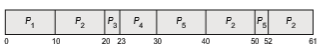

# Algorithm Evaluation

How do we select a CPU-scheduling algorithm for a particular system? As we saw in Section 5.3, there are many scheduling algorithms, each with its own parameters. As a result, selecting an algorithm can be difficult.

The first problem is defining the criteria to be used in selecting an algo- rithm. As we saw in Section 5.2, criteria are often defined in terms of CPU utilization, response time, or throughput. To select an algorithm, we must first define the relative importance of these elements. Our criteria may include several measures, such as these:

• Maximizing CPU utilization under the constraint that the maximum response time is 300 milliseconds  

**Figure 5.30** Solaris scheduling.

• Maximizing throughput such that turnaround time is (on average) linearly proportional to total execution time

Once the selection criteria have been defined,wewant to evaluate the algo- rithms under consideration. We next describe the various evaluation methods we can use.

## Deterministic Modeling

One major class of evaluation methods is **analytic evaluation**. Analytic evalu- ation uses the given algorithm and the system workload to produce a formula or number to evaluate the performance of the algorithm for that workload.

**Deterministic modeling** is one type of analytic evaluation. This method takes a particular predetermined workload and defines the performance of each algorithm for that workload. For example, assume that we have the workload shown below. All five processes arrive at time 0, in the order given, with the length of the CPU burst given in milliseconds:  

Consider the FCFS, SJF, and RR (quantum = 10 milliseconds) scheduling algo- rithms for this set of processes. Which algorithm would give the minimum average waiting time?

For the FCFS algorithm, we would execute the processes as

The waiting time is 0 milliseconds for process _P_1, 10 milliseconds for process _P_2, 39 milliseconds for process _P_3, 42 milliseconds for process _P_4, and 49 milliseconds for process _P_5\. Thus, the average waiting time is (0 + 10 + 39 + 42 + 49)/5 = 28 milliseconds.

With nonpreemptive SJF scheduling, we execute the processes as

The waiting time is 10 milliseconds for process _P_1, 32 milliseconds for process _P_2, 0 milliseconds for process _P_3, 3 milliseconds for process _P_4, and 20 millisec- onds for process _P_5\. Thus, the average waiting time is (10 + 32 + 0 + 3 + 20)/5 = 13 milliseconds.

With the RR algorithm, we execute the processes as

The waiting time is 0 milliseconds for process _P_1, 32 milliseconds for process _P_2, 20 milliseconds for process _P_3, 23 milliseconds for process _P_4, and 40 milliseconds for process _P_5\. Thus, the average waiting time is (0 + 32 + 20 + 23 + 40)/5 = 23 milliseconds.

We can see that, in this case, the average waiting time obtained with the SJF policy is less than half that obtained with FCFS scheduling; the RR algorithm gives us an intermediate value.

Deterministicmodeling is simple and fast. It gives us exact numbers, allow- ing us to compare the algorithms.However, it requires exact numbers for input, and its answers apply only to those cases. The main uses of deterministic modeling are in describing scheduling algorithms and providing examples. In cases where we are running the same program over and over again and can  

measure the program’s processing requirements exactly, wemay be able to use deterministic modeling to select a scheduling algorithm. Furthermore, over a set of examples, deterministic modeling may indicate trends that can then be analyzed and proved separately. For example, it can be shown that, for the environment described (all processes and their times available at time 0), the SJF policy will always result in the minimum waiting time.

## Queueing Models

On many systems, the processes that are run vary from day to day, so there is no static set of processes (or times) to use for deterministicmodeling.What can be determined, however, is the distribution of CPU and I/O bursts. These dis- tributions can be measured and then approximated or simply estimated. The result is a mathematical formula describing the probability of a particular CPU burst. Commonly, this distribution is exponential and is described by its mean. Similarly, we can describe the distribution of times when processes arrive in the system (the arrival-time distribution). From these two distributions, it is possible to compute the average throughput, utilization, waiting time, and so on for most algorithms.

The computer system is described as a network of servers. Each server has a queue of waiting processes. The CPU is a server with its ready queue, as is the I/O system with its device queues. Knowing arrival rates and service rates, we can compute utilization, average queue length, average wait time, and so on. This area of study is called **queueing-network analysis**.

As an example, let _n_ be the average long-term queue length (excluding the process being serviced), let _W_ be the average waiting time in the queue, and let λ be the average arrival rate for new processes in the queue (such as three processes per second). We expect that during the time _W_ that a process waits, λ ×_W_ new processes will arrive in the queue. If the system is in a steady state, then the number of processes leaving the queue must be equal to the number of processes that arrive. Thus,

_n_ \= λ ×_W_.

This equation, known as **Little’s formula**, is particularly useful because it is valid for any scheduling algorithm and arrival distribution. For example _n_ could be the number of customers in a store.

We can use Little’s formula to compute one of the three variables if we know the other two. For example, if we know that 7 processes arrive every second (on average) and that there are normally 14 processes in the queue, then we can compute the average waiting time per process as 2 seconds.

Queueing analysis can be useful in comparing scheduling algorithms, but it also has limitations. At the moment, the classes of algorithms and distribu- tions that can be handled are fairly limited. The mathematics of complicated algorithms and distributions can be difficult to work with. Thus, arrival and service distributions are often defined in mathematically tractable—but unre- alistic—ways. It is also generally necessary to make a number of indepen- dent assumptions, which may not be accurate. As a result of these difficulties, queueing models are often only approximations of real systems, and the accu- racy of the computed results may be questionable.  

## Simulations

To get a more accurate evaluation of scheduling algorithms, we can use simu- lations. Running simulations involves programming a model of the computer system. Software data structures represent the major components of the sys- tem. The simulator has a variable representing a clock. As this variable’s value is increased, the simulator modifies the system state to reflect the activities of the devices, the processes, and the scheduler. As the simulation executes, statistics that indicate algorithm performance are gathered and printed.

The data to drive the simulation can be generated in severalways. Themost common method uses a random-number generator that is programmed to generate processes, CPU burst times, arrivals, departures, and so on, according to probability distributions. The distributions can be defined mathematically (uniform, exponential, Poisson) or empirically. If a distribution is to be defined empirically, measurements of the actual system under study are taken. The results define the distribution of events in the real system; this distribution can then be used to drive the simulation.

A distribution-driven simulation may be inaccurate, however, because of relationships between successive events in the real system. The frequency distribution indicates only howmany instances of each event occur; it does not indicate anything about the order of their occurrence. To correct this problem, we can use **trace files.** We create a trace by monitoring the real system and recording the sequence of actual events (Figure 5.31).We then use this sequence to drive the simulation. Trace files provide an excellent way to compare two algorithms on exactly the same set of real inputs. This method can produce accurate results for its inputs.

Simulations can be expensive, often requiring many hours of computer time. A more detailed simulation provides more accurate results, but it also

**Figure 5.31** Evaluation of CPU schedulers by simulation.  
takes more computer time. In addition, trace files can require large amounts of storage space. Finally, the design, coding, and debugging of the simulator can be a major task.

## Implementation

Even a simulation is of limited accuracy. The only completely accurate way to evaluate a scheduling algorithm is to code it up, put it in the operating system, and see how it works. This approach puts the actual algorithm in the real system for evaluation under real operating conditions.

This method is not without expense. The expense is incurred in coding the algorithm and modifying the operating system to support it (along with its required data structures). There is also cost in testing the changes, usually in virtual machines rather than on dedicated hardware. **Regression testing** con- firms that the changes haven’t made anything worse, and haven’t caused new bugs or caused old bugs to be recreated (for example because the algorithm being replaced solved some bug and changing it caused that bug to reoccur).

Another difficulty is that the environment in which the algorithm is used will change. The environment will change not only in the usual way, as new programs are written and the types of problems change, but also as a result of the performance of the scheduler. If short processes are given priority, then users may break larger processes into sets of smaller processes. If interactive processes are given priority over noninteractive processes, then users may switch to interactive use. This problem is usually addressed by using tools or scripts that encapsulate complete sets of actions, repeatedly using those tools, and using those tools while measuring the results (and detecting any problems they cause in the new environment).

Of course human or program behavior can attempt to circumvent schedul- ing algorithms. For example, researchers designed one system that classi- fied interactive and noninteractive processes automatically by looking at the amount of terminal I/O. If a process did not input or output to the terminal in a 1-second interval, the process was classified as noninteractive and was moved to a lower-priority queue. In response to this policy, one programmer modified his programs to write an arbitrary character to the terminal at regular intervals of less than 1 second. The system gave his programs a high priority, even though the terminal output was completely meaningless.

In general, most flexible scheduling algorithms are those that can be altered by the system managers or by the users so that they can be tuned for a spe- cific application or set of applications. A workstation that performs high-end graphical applications, for instance, may have scheduling needs different from those of a web server or file server. Some operating systems—particularly sev- eral versions of UNIX—allow the system manager to fine-tune the scheduling parameters for a particular system configuration. For example, Solaris pro- vides the dispadmin command to allow the system administrator to modify the parameters of the scheduling classes described in Section 5.7.3.

Another approach is to use APIs that can modify the priority of a process or thread. The Java, POSIX, and Windows APIs provide such functions. The downfall of this approach is that performance-tuning a system or application most often does not result in improvedperformance inmore general situations. 