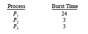
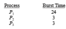
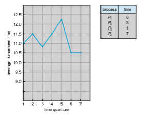
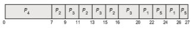

# Scheduling Algorithms

CPU scheduling deals with the problem of deciding which of the processes in the ready queue is to be allocated the CPU’s core. There aremany different CPU- scheduling algorithms. In this section, we describe several of them. Although most modern CPU architectures have multiple processing cores, we describe these scheduling algorithms in the context of only one processing core avail- able. That is, a single CPU that has a single processing core, thus the system is  

capable of only running one process at a time. In Section 5.5 we discuss CPU scheduling in the context of multiprocessor systems.

## First-Come, First-Served Scheduling

By far the simplest CPU-scheduling algorithm is the **first-come first-serve** (**FCFS**) scheduling algorithm. With this scheme, the process that requests the CPU first is allocated the CPU first. The implementation of the FCFS policy is easily managed with a FIFO queue. When a process enters the ready queue, its PCB is linked onto the tail of the queue. When the CPU is free, it is allocated to the process at the head of the queue. The running process is then removed from the queue. The code for FCFS scheduling is simple to write and understand.

On the negative side, the average waiting time under the FCFS policy is often quite long. Consider the following set of processes that arrive at time 0, with the length of the CPU burst given in milliseconds:

If the processes arrive in the order _P_1, _P_2, _P_3, and are served in FCFS order, we get the result shown in the following **Gantt chart**, which is a bar chart that illustrates a particular schedule, including the start and finish times of each of the participating processes:

The waiting time is 0 milliseconds for process _P_1, 24 milliseconds for process _P_2, and 27 milliseconds for process _P_3\. Thus, the average waiting time is (0 + 24 + 27)/3 = 17 milliseconds. If the processes arrive in the order _P_2, _P_3, _P_1, however, the results will be as shown in the following Gantt chart:

The average waiting time is now (6 + 0 + 3)/3 = 3 milliseconds. This reduction is substantial. Thus, the average waiting time under an FCFS policy is generally not minimal and may vary substantially if the processes’ CPU burst times vary greatly.

In addition, consider the performance of FCFS scheduling in a dynamic situation. Assume we have one CPU-bound process and many I/O-bound pro- cesses. As the processes flow around the system, the following scenario may result. The CPU-bound process will get and hold the CPU. During this time, all the other processes will finish their I/O and will move into the ready queue, waiting for the CPU. While the processes wait in the ready queue, the I/O  
devices are idle. Eventually, the CPU-bound process finishes its CPU burst and moves to an I/O device. All the I/O-bound processes, which have short CPU bursts, execute quickly and move back to the I/O queues. At this point, the CPU sits idle. The CPU-bound process will then move back to the ready queue and be allocated the CPU. Again, all the I/O processes end up waiting in the ready queue until the CPU-bound process is done. There is a **convoy effect** as all the other processes wait for the one big process to get off the CPU. This effect results in lower CPU and device utilization thanmight be possible if the shorter processes were allowed to go first.

Note also that the FCFS scheduling algorithm is nonpreemptive. Once the CPU has been allocated to a process, that process keeps the CPU until it releases the CPU, either by terminating or by requesting I/O. The FCFS algorithm is thus particularly troublesome for interactive systems, where it is important that each process get a share of the CPU at regular intervals. It would be disastrous to allow one process to keep the CPU for an extended period.

## Shortest-Job-First Scheduling

A different approach to CPU scheduling is the **shortest-job-firs** (**SJF**) schedul- ing algorithm. This algorithm associates with each process the length of the process’s next CPU burst.When the CPU is available, it is assigned to the process that has the smallest next CPU burst. If the next CPU bursts of two processes are the same, FCFS scheduling is used to break the tie. Note that a more appro- priate term for this scheduling method would be the **_shortest-next-CPU-burst_** algorithm, because scheduling depends on the length of the next CPU burst of a process, rather than its total length. We use the term SJF because most people and textbooks use this term to refer to this type of scheduling.

As an example of SJF scheduling, consider the following set of processes, with the length of the CPU burst given in milliseconds:

Using SJF scheduling, we would schedule these processes according to the following Gantt chart:

The waiting time is 3 milliseconds for process _P_1, 16 milliseconds for process _P_2, 9 milliseconds for process _P_3, and 0 milliseconds for process _P_4\. Thus, the average waiting time is (3 + 16 + 9 + 0)/4 = 7 milliseconds. By comparison, if we were using the FCFS scheduling scheme, the average waiting time would be 10.25 milliseconds.

The SJF scheduling algorithm is provably optimal, in that it gives the mini- mum average waiting time for a given set of processes. Moving a short process before a long one decreases the waiting time of the short process more than it increases the waiting time of the long process. Consequently, the average waiting time decreases.

Although the SJF algorithm is optimal, it cannot be implemented at the level of CPU scheduling, as there is no way to know the length of the next CPU burst. One approach to this problem is to try to approximate SJF scheduling. We may not know the length of the next CPU burst, but we may be able to predict its value.We expect that the next CPU burstwill be similar in length to the previous ones. By computing an approximation of the length of the next CPU burst, we can pick the process with the shortest predicted CPU burst.

The next CPU burst is generally predicted as an **exponential average** of the measured lengths of previous CPU bursts. We can define the exponential average with the following formula. Let _tn_ be the length of the _n_th CPU burst, and let τ_n_+1 be our predicted value for the next CPU burst. Then, for α, 0 ≤ α ≤

1, define

τ _n_ +1 = α _tn_ \+ (1 − α)τ _n_ .

The value of _tn_ contains our most recent information, while τ_n_ stores the past history. The parameter α controls the relative weight of recent and past history in our prediction. If α = 0, then τ_n_+1 = τ_n_, and recent history has no effect (current conditions are assumed to be transient). If α = 1, then τ_n_+1 = _tn_, and only the most recent CPU burst matters (history is assumed to be old and irrelevant). More commonly, α = 1/2, so recent history and past history are equally weighted. The initial τ0 can be defined as a constant or as an overall system average. Figure 5.4 shows an exponential average with α = 1/2 and τ0 = 10.

**Figure 5.4** Prediction of the length of the next CPU burst.  
To understand the behavior of the exponential average, we can expand the formula for τ_n_+1 by substituting for τ_n_ to find

τ_n_+1 = α_tn_ \+ (1 − α)α_tn_−1 + · · · + (1 − α)_j_α_tn_−_j_ \+ · · · + (1 − α)_n_+1τ0_._

Typically, α is less than 1. As a result, (1 − α) is also less than 1, and each successive term has less weight than its predecessor.

The SJF algorithm can be either preemptive or nonpreemptive. The choice arises when a new process arrives at the ready queue while a previous pro- cess is still executing. The next CPU burst of the newly arrived process may be shorter than what is left of the currently executing process. A preemptive SJF algorithm will preempt the currently executing process, whereas a non- preemptive SJF algorithm will allow the currently running process to finish its CPU burst. Preemptive SJF scheduling is sometimes called **shortest-remaining- time-firs** scheduling.

As an example, consider the following four processes, with the length of the CPU burst given in milliseconds:

If the processes arrive at the ready queue at the times shown and need the indicated burst times, then the resulting preemptive SJF schedule is as depicted in the following Gantt chart:

Process _P_1 is started at time 0, since it is the only process in the queue. Process _P_2 arrives at time 1. The remaining time for process _P_1 (7 milliseconds) is larger than the time required by process _P_2 (4 milliseconds), so process _P_1 is preempted, and process _P_2 is scheduled. The average waiting time for this example is \[(10 − 1) + (1 − 1) + (17 − 2) + (5 − 3)\]/4 = 26/4 = 6.5 milliseconds. Nonpreemptive SJF scheduling would result in an average waiting time of 7.75 milliseconds.

## Round-Robin Scheduling

The **round-robin** (**RR**) scheduling algorithm is similar to FCFS scheduling, but preemption is added to enable the system to switch between processes. Asmall unit of time, called a **time quantum** or **time slice**, is defined. A time quantum is generally from 10 to 100milliseconds in length. The ready queue is treated as a circular queue. The CPU scheduler goes around the ready queue, allocating the CPU to each process for a time interval of up to 1 time quantum.

To implement RR scheduling, we again treat the ready queue as a FIFO queue of processes. New processes are added to the tail of the ready queue.  

The CPU scheduler picks the first process from the ready queue, sets a timer to interrupt after 1 time quantum, and dispatches the process.

One of two things will then happen. The process may have a CPU burst of less than 1 time quantum. In this case, the process itself will release the CPU voluntarily. The scheduler will then proceed to the next process in the ready queue. If the CPU burst of the currently running process is longer than 1 time quantum, the timer will go off and will cause an interrupt to the operating system. A context switch will be executed, and the process will be put at the tail of the ready queue. The CPU scheduler will then select the next process in the ready queue.

The average waiting time under the RR policy is often long. Consider the following set of processes that arrive at time 0, with the length of the CPU burst given in milliseconds:

If we use a time quantum of 4 milliseconds, then process _P_1 gets the first 4 milliseconds. Since it requires another 20 milliseconds, it is preempted after the first time quantum, and the CPU is given to the next process in the queue, process _P_2\. Process _P_2 does not need 4 milliseconds, so it quits before its time quantum expires. The CPU is then given to the next process, process _P_3\. Once each process has received 1 time quantum, the CPU is returned to process _P_1 for an additional time quantum. The resulting RR schedule is as follows:

Let’s calculate the average waiting time for this schedule. _P_1 waits for 6 mil- liseconds (10 − 4), _P_2 waits for 4 milliseconds, and _P_3 waits for 7 milliseconds. Thus, the average waiting time is 17/3 = 5.66 milliseconds.

In the RR scheduling algorithm, no process is allocated the CPU for more than 1 time quantum in a row (unless it is the only runnable process). If a process’s CPU burst exceeds 1 time quantum, that process is preempted and is put back in the ready queue. The RR scheduling algorithm is thus preemptive.

If there are _n_ processes in the ready queue and the time quantum is _q_, then each process gets 1/_n_ of the CPU time in chunks of at most _q_ time units. Each process must wait no longer than (_n_− 1)× _q_ time units until its next time quan- tum. For example, with five processes and a time quantum of 20 milliseconds, each process will get up to 20 milliseconds every 100 milliseconds.

The performance of the RR algorithm depends heavily on the size of the time quantum. At one extreme, if the time quantum is extremely large, the RR policy is the same as the FCFS policy. In contrast, if the time quantum is extremely small (say, 1 millisecond), the RR approach can result in a large  

**Figure 5.5** How a smaller time quantum increases context switches.

number of context switches. Assume, for example, that we have only one process of 10 time units. If the quantum is 12 time units, the process finishes in less than 1 time quantum, with no overhead. If the quantum is 6 time units, however, the process requires 2 quanta, resulting in a context switch. If the time quantum is 1 time unit, then nine context switches will occur, slowing the execution of the process accordingly (Figure 5.5).

Thus, we want the time quantum to be large with respect to the context- switch time. If the context-switch time is approximately 10 percent of the time quantum, then about 10 percent of the CPU time will be spent in context switching. In practice, most modern systems have time quanta ranging from 10 to 100 milliseconds. The time required for a context switch is typically less than 10 microseconds; thus, the context-switch time is a small fraction of the time quantum.

Turnaround time also depends on the size of the time quantum. As we can see from Figure 5.6, the average turnaround time of a set of processes does not necessarily improve as the time-quantum size increases. In general, the average turnaround time can be improved if most processes finish their next CPU burst in a single time quantum. For example, given three processes of 10 time units each and a quantum of 1 time unit, the average turnaround time is 29. If the time quantum is 10, however, the average turnaround time drops to 20. If context-switch time is added in, the average turnaround time increases even more for a smaller time quantum, since more context switches are required.

Although the time quantum should be large compared with the context- switch time, it should not be too large. As we pointed out earlier, if the time quantum is too large, RR scheduling degenerates to an FCFS policy. A rule of thumb is that 80 percent of the CPU bursts should be shorter than the time quantum.

## Priority Scheduling

The SJF algorithm is a special case of the general**priority-scheduling** algorithm. A priority is associated with each process, and the CPU is allocated to the  

**Figure 5.6** How turnaround time varies with the time quantum.

process with the highest priority. Equal-priority processes are scheduled in FCFS order. An SJF algorithm is simply a priority algorithm where the priority (_p_) is the inverse of the (predicted) next CPU burst. The larger the CPU burst, the lower the priority, and vice versa.

Note that we discuss scheduling in terms of **_high_** priority and **_low_** priority. Priorities are generally indicated by some fixed range of numbers, such as 0 to 7 or 0 to 4,095. However, there is no general agreement on whether 0 is the highest or lowest priority. Some systems use low numbers to represent low priority; others use low numbers for high priority. This difference can lead to confusion. In this text, we assume that low numbers represent high priority.

As an example, consider the following set of processes, assumed to have arrived at time 0 in the order _P_1, _P_2, · · ·, _P_5, with the length of the CPU burst given in milliseconds:

Using priority scheduling, wewould schedule these processes according to the following Gantt chart:  

The average waiting time is 8.2 milliseconds. Priorities can be defined either internally or externally. Internally defined

priorities use some measurable quantity or quantities to compute the priority of a process. For example, time limits, memory requirements, the number of open files, and the ratio of average I/O burst to average CPU burst have been used in computing priorities. External priorities are set by criteria outside the operating system, such as the importance of the process, the type and amount of funds being paid for computer use, the department sponsoring the work, and other, often political, factors.

Priority scheduling can be either preemptive or nonpreemptive. When a process arrives at the ready queue, its priority is compared with the priority of the currently running process. Apreemptivepriority scheduling algorithmwill preempt the CPU if the priority of the newly arrived process is higher than the priority of the currently running process. Anonpreemptive priority scheduling algorithm will simply put the new process at the head of the ready queue.

Amajor problem with priority scheduling algorithms is **indefinit block- ing**, or **starvation**. A process that is ready to run but waiting for the CPU can be considered blocked. A priority scheduling algorithm can leave some low- priority processes waiting indefinitely. In a heavily loaded computer system, a steady stream of higher-priority processes can prevent a low-priority process from ever getting the CPU. Generally, one of two things will happen. Either the process will eventually be run (at 2 A.M. Sunday, when the system is finally lightly loaded), or the computer systemwill eventually crash and lose all unfin- ished low-priority processes. (Rumor has it that when they shut down the IBM 7094 at MIT in 1973, they found a low-priority process that had been submitted in 1967 and had not yet been run.)

Asolution to the problemof indefinite blockage of low-priority processes is **aging**. Aging involves gradually increasing the priority of processes that wait in the system for a long time. For example, if priorities range from 127 (low) to 0 (high), we could periodically (say, every second) increase the priority of a waiting process by 1. Eventually, even a process with an initial priority of 127 would have the highest priority in the system and would be executed. In fact, it would take a little over 2 minutes for a priority-127 process to age to a priority-0 process.

Another option is to combine round-robin and priority scheduling in such a way that the system executes the highest-priority process and runs processes with the same priority using round-robin scheduling. Let’s illustrate with an example using the following set of processes, with the burst time in millisec- onds:

Using priority scheduling with round-robin for processes with equal priority, we would schedule these processes according to the following Gantt chart using a time quantum of 2 milliseconds:

In this example, process _P_4 has the highest priority, so it will run to comple- tion. Processes_P_2 and_P_3 have the next-highest priority, and theywill execute in a round-robin fashion. Notice that when process _P_2 finishes at time 16, process _P_3 is the highest-priority process, so it will run until it completes execution. Now, only processes _P_1 and _P_5 remain, and as they have equal priority, they will execute in round-robin order until they complete.

## Multilevel Queue Scheduling

With both priority and round-robin scheduling, all processes may be placed in a single queue, and the scheduler then selects the process with the highest priority to run. Depending on how the queues are managed, an _O_(_n_) search may be necessary to determine the highest-priority process. In practice, it is often easier to have separate queues for each distinct priority, and priority scheduling simply schedules the process in the highest-priority queue. This is illustrated in Figure 5.7. This approach—known as **multilevel queue**— also works well when priority scheduling is combined with round-robin: if there are multiple processes in the highest-priority queue, they are executed in round-robin order. In the most generalized form of this approach, a priority is assigned statically to each process, and a process remains in the same queue for the duration of its runtime.

**Figure 5.7** Separate queues for each priority.  

**Figure 5.8** Multilevel queue scheduling.

A multilevel queue scheduling algorithm can also be used to partition processes into several separate queues based on the process type (Figure 5.8). For example, a common division is made between **foreground** (interac- tive) processes and **background** (batch) processes. These two types of pro- cesses have different response-time requirements and so may have different scheduling needs. In addition, foreground processes may have priority (exter- nally defined) over background processes. Separate queues might be used for foreground and background processes, and each queue might have its own scheduling algorithm. The foreground queue might be scheduled by an RR algorithm, for example, while the background queue is scheduled by an FCFS algorithm.

In addition, there must be scheduling among the queues, which is com- monly implemented as fixed-priority preemptive scheduling. For example, the real-time queue may have absolute priority over the interactive queue.

Let’s look at an example of a multilevel queue scheduling algorithm with four queues, listed below in order of priority:

**1\.** Real-time processes

**2\.** System processes

**3\.** Interactive processes

**4\.** Batch processes

Each queue has absolute priority over lower-priority queues. No process in the batch queue, for example, could run unless the queues for real-time processes, system processes, and interactive processes were all empty. If an interactive process entered the ready queue while a batch process was running, the batch process would be preempted.

Another possibility is to time-slice among the queues. Here, each queue gets a certain portion of the CPU time,which it can then schedule among its var- ious processes. For instance, in the foreground–background queue example, the foreground queue can be given 80 percent of the CPU time for RR scheduling  

among its processes, while the background queue receives 20 percent of the CPU to give to its processes on an FCFS basis.

## Multilevel Feedback Queue Scheduling

Normally, when the multilevel queue scheduling algorithm is used, processes are permanently assigned to a queue when they enter the system. If there are separate queues for foreground and background processes, for example, processes do not move from one queue to the other, since processes do not change their foreground or background nature. This setup has the advantage of low scheduling overhead, but it is inflexible.

The **multilevel feedback queue** scheduling algorithm, in contrast, allows a process to move between queues. The idea is to separate processes according to the characteristics of their CPU bursts. If a process uses too much CPU time, it will be moved to a lower-priority queue. This scheme leaves I/O-bound and interactive processes—which are typically characterized by short CPU bursts —in the higher-priority queues. In addition, a process that waits too long in a lower-priority queue may be moved to a higher-priority queue. This form of aging prevents starvation.

For example, consider a multilevel feedback queue scheduler with three queues, numbered from 0 to 2 (Figure 5.9). The scheduler first executes all processes in queue 0. Only when queue 0 is empty will it execute processes in queue 1. Similarly, processes in queue 2 will be executed only if queues 0 and 1 are empty. A process that arrives for queue 1 will preempt a process in queue 2. A process in queue 1 will in turn be preempted by a process arriving for queue 0.

An entering process is put in queue 0. A process in queue 0 is given a time quantum of 8 milliseconds. If it does not finish within this time, it is moved to the tail of queue 1. If queue 0 is empty, the process at the head of queue 1 is given a quantum of 16milliseconds. If it does not complete, it is preempted and is put into queue 2. Processes in queue 2 are run on an FCFS basis but are run onlywhen queues 0 and 1 are empty. To prevent starvation, a process that waits too long in a lower-priority queuemay gradually bemoved to a higher-priority queue.

**Figure 5.9** Multilevel feedback queues.  

This scheduling algorithm gives highest priority to any process with a CPU burst of 8 milliseconds or less. Such a process will quickly get the CPU, finish its CPU burst, and go off to its next I/O burst. Processes that need more than 8 but less than 24 milliseconds are also served quickly, although with lower priority than shorter processes. Long processes automatically sink to queue 2 and are served in FCFS order with any CPU cycles left over from queues 0 and 1.

In general, a multilevel feedback queue scheduler is defined by the follow- ing parameters:

• The number of queues

• The scheduling algorithm for each queue

• The method used to determine when to upgrade a process to a higher- priority queue

• The method used to determine when to demote a process to a lower- priority queue

• Themethod used to determinewhich queue a process will enter when that process needs service

The definition of a multilevel feedback queue scheduler makes it the most general CPU-scheduling algorithm. It can be configured to match a specific system under design. Unfortunately, it is also the most complex algorithm, since defining the best scheduler requires somemeans bywhich to select values for all the parameters.